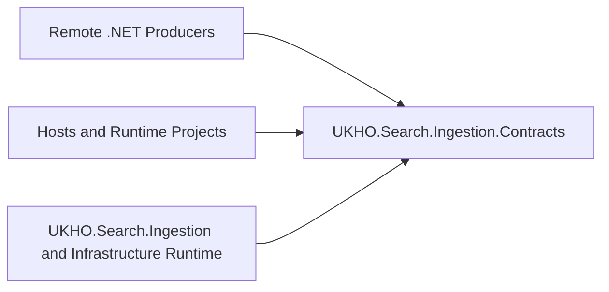

# Implementation Plan

Target output path: `dev/work-packages/100-remote-ingestion-queue-contracts/plan-ingestion-remote-ingestion-queue-contracts.md`

Date: 2026-06-30

Based on:
- `dev/work-packages/100-remote-ingestion-queue-contracts/spec-domain-remote-ingestion-queue-contracts.md`
- `./.github/instructions/documentation-pass.instructions.md`
- `./.github/instructions/wiki.instructions.md`

## Boundary Establishment

- [x] Work Item 1: Introduce the contracts project boundary and prove it builds in isolation - Completed
  - **Purpose**: Establish the new `UKHO.Search.Ingestion.Contracts` project as a dependency-light domain-layer package with package metadata, independent buildability, and no accidental runtime or infrastructure coupling.
  - **Acceptance Criteria**:
    - `src/UKHO.Search.Ingestion.Contracts/UKHO.Search.Ingestion.Contracts.csproj` exists with package metadata, nullable enabled, XML documentation generation enabled, and no `ProjectReference` items.
    - The new project is added to the solution and can be built independently.
    - The project contains only boundary-establishing content and does not yet pull in runtime request types, queue clients, provider SPI, or infrastructure packages.
    - The implementation explicitly follows `./.github/instructions/documentation-pass.instructions.md` for all code and comments written during this work item.
  - **Definition of Done**:
    - Code implemented for the new contracts project and solution wiring.
    - All new code is fully commented in line with `./.github/instructions/documentation-pass.instructions.md`, including type comments, constructor comments, method comments, parameter comments where applicable, and explanatory inline comments for non-obvious logic.
    - Build succeeds for the new project in isolation and in solution context where relevant.
    - Documentation updated in the active work package.
    - Wiki review completed; relevant wiki or repository guidance updated, or an explicit no-change review result recorded.
    - Foundational documentation retains book-like narrative depth, defines technical terms, and includes examples or walkthrough support where the subject matter is conceptually dense.
    - Can execute end-to-end via: `dotnet build src/UKHO.Search.Ingestion.Contracts/UKHO.Search.Ingestion.Contracts.csproj`.
  - [x] Task 1: Create the project and package identity - Completed
    - [x] Step 1: Add `src/UKHO.Search.Ingestion.Contracts/UKHO.Search.Ingestion.Contracts.csproj` targeting `net8.0` with package identity, description, authorship metadata, nullable enabled, implicit usings enabled where appropriate, and XML documentation output enabled.
    - [x] Step 2: Use repository coding conventions for C# project structure, including block-scoped namespaces for any new source files and one public type per file.
    - [x] Step 3: Add the new project to the solution so it is discoverable by normal build and test workflows without introducing runtime coupling.
  - [x] Task 2: Add minimal boundary-establishing source content - Completed
    - [x] Step 1: Add a minimal public package marker or boundary-oriented root type so the package has an explicit public identity even before DTO extraction begins.
    - [x] Step 2: Document the package purpose, intended consumers, and excluded dependency categories in code comments or package-facing documentation content as appropriate.
    - [x] Step 3: Ensure all created source files comply with `./.github/instructions/documentation-pass.instructions.md`, including developer-level comments on internal types and methods.
  - [x] Task 3: Validate independent buildability - Completed
    - [x] Step 1: Build `src/UKHO.Search.Ingestion.Contracts/UKHO.Search.Ingestion.Contracts.csproj` directly.
    - [x] Step 2: Resolve any solution-wiring or packaging metadata issues without broadening the package boundary.
    - [x] Step 3: Record the build command and outcome in the work item execution notes when implementation occurs.
  - **Files**:
    - `src/UKHO.Search.Ingestion.Contracts/UKHO.Search.Ingestion.Contracts.csproj`: create the new contracts project and package metadata.
    - `src/UKHO.Search.Ingestion.Contracts/*`: add minimal boundary-establishing source files and comments.
    - `Search.slnx`: register the new project in the solution.
  - **Work Item Dependencies**: none
  - **Run / Verification Instructions**:
    - `dotnet build src/UKHO.Search.Ingestion.Contracts/UKHO.Search.Ingestion.Contracts.csproj`
    - `dotnet build Search.slnx`
  - **User Instructions**: No manual setup expected.
  - **Implementation Summary**:
    - Added `src/UKHO.Search.Ingestion.Contracts/UKHO.Search.Ingestion.Contracts.csproj` as a new `net8.0` dependency-light domain project with package metadata, XML documentation output, nullable enabled, and warnings treated as errors.
    - Added `IngestionContractsPackage` as a minimal public package identity type with XML documentation and explanatory developer comments.
    - Registered the new project under the domain folder in `Search.slnx`.
    - Validation performed: `dotnet build src/UKHO.Search.Ingestion.Contracts/UKHO.Search.Ingestion.Contracts.csproj` succeeded; `dotnet build Search.slnx` failed due to pre-existing package downgrade errors in `test/IngestionServiceHost.Tests` and `test/UKHO.Search.Ingestion.Tests`, not because of the new contracts project.
    - Wiki review result: Updated `wiki/Solution-Architecture.md` to describe the new `UKHO.Search.Ingestion.Contracts` domain package boundary. Reviewed `wiki/Ingestion-Pipeline.md` and `wiki/Ingestion-Service-Provider-Mechanism.md`; no changes were required there because the runtime flow and provider deserialization contract have not moved yet.

- [x] Work Item 2: Add automated dependency-boundary enforcement for the contracts package - Completed
  - **Purpose**: Turn the architectural boundary into an executable rule so forbidden project or package references fail fast rather than relying on manual review.
  - **Acceptance Criteria**:
    - A targeted automated test verifies that `UKHO.Search.Ingestion.Contracts.csproj` contains no forbidden `ProjectReference` or `PackageReference` entries.
    - The boundary test runs in a narrow test project or targeted test slice rather than depending on a full solution run.
    - The test and any helper code are fully commented per `./.github/instructions/documentation-pass.instructions.md`.
    - Validation commands are documented for contributors who need to confirm the boundary locally.
  - **Definition of Done**:
    - Test code implemented and passing.
    - All new code is fully commented in line with `./.github/instructions/documentation-pass.instructions.md`.
    - Logging or failure messages make it clear which dependency rule was broken.
    - Documentation updated in the active work package.
    - Wiki review completed; relevant wiki or repository guidance updated, or an explicit no-change review result recorded.
    - Foundational documentation retains book-like narrative depth, defines technical terms, and includes examples or walkthrough support where the subject matter is conceptually dense.
    - Can execute end-to-end via: `dotnet test <targeted dependency-boundary test project>`.
  - [x] Task 1: Choose and create the narrowest test host for the boundary rule - Completed
    - [x] Step 1: Decide whether to add a dedicated `test/UKHO.Search.Ingestion.Contracts.Tests` project or place the boundary audit in an existing closely related test project.
    - [x] Step 2: Keep the chosen test host aligned with onion architecture and repository naming conventions.
    - [x] Step 3: Wire the test host into the solution without introducing new architectural coupling.
  - [x] Task 2: Implement the dependency audit test - Completed
    - [x] Step 1: Load `src/UKHO.Search.Ingestion.Contracts/UKHO.Search.Ingestion.Contracts.csproj` as XML inside the test.
    - [x] Step 2: Assert that no `ProjectReference` items exist.
    - [x] Step 3: Assert that no forbidden `PackageReference` items exist and that any allowed package use remains explicitly justified.
    - [x] Step 4: Emit clear failure messages naming the offending dependency so the boundary break is easy to fix.
  - [x] Task 3: Validate the audit workflow - Completed
    - [x] Step 1: Run the targeted test project directly.
    - [x] Step 2: Confirm the dependency audit can be executed independently of broader, slower test suites.
    - [x] Step 3: Record the exact validation command in the implementation notes.
  - **Files**:
    - `test/UKHO.Search.Ingestion.Contracts.Tests/UKHO.Search.Ingestion.Contracts.Tests.csproj`: create if a dedicated test host is chosen.
    - `test/UKHO.Search.Ingestion.Contracts.Tests/*`: add boundary audit tests and any minimal helpers.
    - `Search.slnx`: register the test project if a new project is introduced.
  - **Work Item Dependencies**: Work Item 1
  - **Run / Verification Instructions**:
    - `dotnet test test/UKHO.Search.Ingestion.Contracts.Tests/UKHO.Search.Ingestion.Contracts.Tests.csproj`
  - **User Instructions**: No manual setup expected.
  - **Implementation Summary**:
    - Added a dedicated `test/UKHO.Search.Ingestion.Contracts.Tests` project so the boundary audit remains narrow and does not depend on unrelated runtime tests.
    - Implemented `ContractsProjectBoundaryTests` to load the contracts `.csproj` directly and fail if `ProjectReference` or `PackageReference` entries appear.
    - Fixed the repository-root path resolution inside the test so the audit remains stable regardless of the test output folder shape.
    - Validation performed: `dotnet test test/UKHO.Search.Ingestion.Contracts.Tests/UKHO.Search.Ingestion.Contracts.Tests.csproj` succeeded with 2 passing tests.
    - Wiki review result: Updated `wiki/Solution-Architecture.md` to explain that some test projects act as architectural guardrails, including the new contracts boundary test project. Reviewed `wiki/Ingestion-Pipeline.md` and `wiki/Ingestion-Service-Provider-Mechanism.md`; no changes were required because the runtime processing path remains unchanged.

## Package Guidance And Contributor Workflow

- [x] Work Item 3: Publish the package boundary guidance for contributors and future remote producers - Completed
  - **Purpose**: Make the new package boundary understandable to internal contributors before queue DTO extraction begins, so future work packages have a clear rule-set for what belongs in the contracts package and what must stay out.
  - **Acceptance Criteria**:
    - The work package documentation clearly states the allowed dependencies, forbidden dependencies, target consumers, and deferred responsibilities.
    - The implementation records that queue submission, provider discovery, security-token derivation, journal concepts, and runtime pipeline behaviors remain out of scope.
    - The plan for later work packages is explicit enough that WP101 and WP102 can proceed without reopening the WP100 boundary decision.
    - Contributor-facing documentation changes are identified for wiki review.
  - **Definition of Done**:
    - Work package documentation updated.
    - Any new package-facing repository documentation is aligned with the implemented boundary.
    - Wiki review completed; relevant wiki or repository guidance updated, or an explicit no-change review result recorded.
    - Foundational documentation retains book-like narrative depth, defines technical terms, and includes examples or walkthrough support where the subject matter is conceptually dense.
    - Can execute end-to-end via: review of the work package spec plus any linked package guidance, backed by successful build and dependency-boundary checks from prior work items.
  - [x] Task 1: Consolidate package-boundary guidance in repository-facing documentation - Completed
    - [x] Step 1: Ensure the active spec remains the canonical statement of WP100 boundary intent.
    - [x] Step 2: Add or update any lightweight package-facing documentation that implementers of WP101-WP104 will rely on, such as a project README if that proves necessary.
    - [x] Step 3: Keep the guidance current-state and present-tense, following the repository wiki narrative standards.
  - [x] Task 2: Prepare the handoff surface for later work packages - Completed
    - [x] Step 1: State clearly which responsibilities are deferred to WP101, WP102, and WP103.
    - [x] Step 2: Capture the validation expectations that later work must preserve, especially independent build and dependency-boundary enforcement.
    - [x] Step 3: Ensure later work is directed to reuse this package boundary rather than rebuilding contract rules inside runtime projects.
  - **Files**:
    - `dev/work-packages/100-remote-ingestion-queue-contracts/spec-domain-remote-ingestion-queue-contracts.md`: maintain the canonical scope and boundary specification.
    - `src/UKHO.Search.Ingestion.Contracts/README.md`: create only if package-local guidance is needed beyond XML/package metadata.
  - **Work Item Dependencies**: Work Item 1, Work Item 2
  - **Run / Verification Instructions**:
    - Review `dev/work-packages/100-remote-ingestion-queue-contracts/spec-domain-remote-ingestion-queue-contracts.md`
    - Re-run prior build and targeted dependency-boundary test commands
  - **User Instructions**: No manual setup expected.
  - **Implementation Summary**:
    - Added `src/UKHO.Search.Ingestion.Contracts/README.md` as the canonical package-local explanation of intended consumers, allowed and forbidden dependencies, deferred responsibilities, and the WP101-WP103 handoff path.
    - Updated `UKHO.Search.Ingestion.Contracts.csproj` to pack the README so package consumers can receive the same boundary guidance from package metadata.
    - Validation performed: `dotnet build src/UKHO.Search.Ingestion.Contracts/UKHO.Search.Ingestion.Contracts.csproj` succeeded and `dotnet test test/UKHO.Search.Ingestion.Contracts.Tests/UKHO.Search.Ingestion.Contracts.Tests.csproj` succeeded with 2 passing tests.
    - Wiki review result: Reviewed `wiki/Architecture-Walkthrough.md` and `wiki/Ingestion-Walkthrough.md`; no wiki page update was required because the current runtime walkthroughs remain accurate and the contributor-facing boundary explanation is already covered by `wiki/Solution-Architecture.md` plus the new package-local README.

## Wiki Review And Repository Guidance Closure

- [x] Work Item 4: Complete the mandatory wiki review for the full work package - Completed
  - **Purpose**: Satisfy `./.github/instructions/wiki.instructions.md` by explicitly reviewing whether the new contracts-package boundary changes contributor understanding of ingestion architecture, repository workflow, or package responsibilities.
  - **Acceptance Criteria**:
    - The implementation explicitly reviews the ingestion and architecture wiki pages most likely to be affected by the new package boundary.
    - Any required wiki updates are made before the work package is closed.
    - If no wiki updates are required, the execution record states exactly which pages were reviewed and why the existing content remained sufficient.
  - **Definition of Done**:
    - Wiki review outcome recorded explicitly.
    - Relevant wiki or repository guidance updated, created, or intentionally left unchanged with a concrete explanation.
    - Foundational documentation retains book-like narrative depth, defines technical terms, and includes examples or walkthrough support where the subject matter is conceptually dense.
    - Can execute end-to-end via: a clear final work package record that cites the reviewed wiki pages and the resulting action.
  - [x] Task 1: Review likely affected wiki pages - Completed
    - [x] Step 1: Review `wiki/Solution-Architecture.md` for package-boundary and onion-layer explanations.
    - [x] Step 2: Review `wiki/Ingestion-Pipeline.md` and `wiki/Ingestion-Service-Provider-Mechanism.md` for any wording that assumes queue contracts only live inside `UKHO.Search.Ingestion`.
    - [x] Step 3: Review `wiki/Ingestion-Walkthrough.md` and `wiki/Architecture-Walkthrough.md` for contributor workflow guidance that may need to mention the new contracts project.
  - [x] Task 2: Record the outcome - Completed
    - [x] Step 1: Update the relevant wiki pages if the package boundary materially changes contributor understanding.
    - [x] Step 2: If no wiki changes are required, record the no-change decision explicitly in the implementation summary with the pages reviewed and the reason they remained sufficient.
    - [x] Step 3: Ensure the final work package summary names the wiki result directly rather than using a vague “wiki reviewed” statement.
  - **Files**:
    - `wiki/Solution-Architecture.md`: update if package-boundary guidance needs to reflect the new domain contract assembly.
    - `wiki/Ingestion-Pipeline.md`: update if ingestion-flow explanations need to mention the extracted contracts boundary.
    - `wiki/Ingestion-Service-Provider-Mechanism.md`: update if provider-facing boundary language changes.
    - `wiki/Ingestion-Walkthrough.md`: update if contributor workflow guidance should mention the contracts package.
    - `wiki/Architecture-Walkthrough.md`: update if the architectural narrative needs the new project boundary explained.
  - **Work Item Dependencies**: Work Item 1, Work Item 2, Work Item 3
  - **Run / Verification Instructions**:
    - Review the listed wiki pages alongside the final implemented project and test layout
    - Confirm the final execution record contains an explicit wiki review result
  - **User Instructions**: No manual setup expected.
  - **Implementation Summary**:
    - Completed the full WP100 wiki review across `wiki/Solution-Architecture.md`, `wiki/Ingestion-Pipeline.md`, `wiki/Ingestion-Service-Provider-Mechanism.md`, `wiki/Ingestion-Walkthrough.md`, and `wiki/Architecture-Walkthrough.md`.
    - Updated `wiki/Solution-Architecture.md` to document the new `UKHO.Search.Ingestion.Contracts` domain package boundary and the dedicated architectural guardrail test project.
    - Left `wiki/Ingestion-Pipeline.md`, `wiki/Ingestion-Service-Provider-Mechanism.md`, `wiki/Ingestion-Walkthrough.md`, and `wiki/Architecture-Walkthrough.md` unchanged because the runtime still deserializes queue-message DTOs from `UKHO.Search.Ingestion`; only the package boundary and contributor-facing architecture story changed in WP100.
    - Final wiki review result: the repository wiki now reflects the new contracts-project boundary at the solution-architecture level, and the remaining ingestion walkthrough pages remain current-state accurate.

## Summary / Key Considerations

- The plan keeps WP100 narrow: it establishes the package boundary, proves the boundary automatically, and documents the contributor-facing consequences without prematurely extracting DTOs or changing runtime consumers.
- The first runnable slice is an independently buildable `UKHO.Search.Ingestion.Contracts` project. That slice validates the onion placement and dependency policy before later work introduces the actual queue-message types.
- The boundary test is treated as a first-class executable contract. It should fail loudly if future contributors accidentally introduce runtime, infrastructure, or Azure-client coupling into the package.
- `./.github/instructions/documentation-pass.instructions.md` is a hard completion gate for any code written during implementation, even though this work package is primarily structural and package-boundary oriented.
- `./.github/instructions/wiki.instructions.md` is also a hard completion gate. Because this work package changes contributor understanding of package boundaries and repository workflow, the final implementation must either update the relevant ingestion and architecture wiki pages or record a precise no-change review result.

# Architecture

## Overall Technical Approach

WP100 introduces a small domain-layer package boundary rather than a runtime feature. The implementation should add a new `UKHO.Search.Ingestion.Contracts` project under `src/` and treat it as the canonical home for queue-message contract concerns once later work packages perform extraction.

In onion-architecture terms, this package sits at the innermost edge of the ingestion message contract surface. It must not depend on service, infrastructure, or host assemblies. Instead, runtime projects will eventually depend inward on the contracts package.

The first technical objective is not “message functionality” but “boundary integrity.” That means the architecture for WP100 is successful when:
- the new package builds independently,
- its project file contains no forbidden dependencies,
- an automated test enforces that constraint,
- contributor-facing documentation explains what belongs in the package and what does not.

The intended dependency direction is:

This diagram is intentionally simple. Its purpose is to show that the contracts package becomes a shared inward dependency for producers and runtime code, rather than a runtime package that producers must reach outward to consume.

## Frontend

No frontend or Blazor surface is introduced by WP100.

This work package does not add pages, components, or user-facing flows. Any contributor-facing impact is documentation-oriented: future contributors need to understand that queue-message contracts will live in a dedicated package rather than remaining embedded inside the ingestion runtime project.

## Backend

The backend impact is architectural rather than request-processing oriented.

Current state:
- Queue-message DTOs live in `src/UKHO.Search.Ingestion/Requests/`.
- Serialization support lives in `src/UKHO.Search.Ingestion/Requests/Serialization/`.
- Queue ingestion runtime code in `src/UKHO.Search.Infrastructure.Ingestion/Queue/` eventually deserializes those request types.

WP100 backend design:
- Add `src/UKHO.Search.Ingestion.Contracts/` as a new package root.
- Keep the project dependency-free except for the .NET base class library and in-box `System.Text.Json` APIs where needed later.
- Add a narrow test surface that asserts the package remains free of forbidden `ProjectReference` and `PackageReference` entries.
- Leave runtime consumers unchanged until later work packages perform extraction and migration.

The key data flow does not change yet. Instead, the repository gains a new future destination for the contract types. That destination must be established, documented, and protected before DTO movement begins.