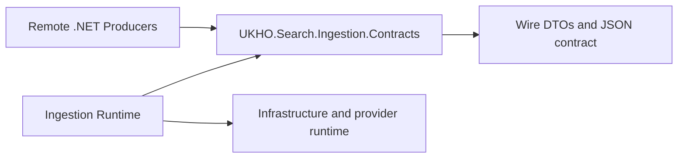

# Implementation Plan

Target output path: `dev/work-packages/101-queue-message-json-contract/plan-ingestion-queue-message-json-contract.md`

Date: 2026-06-30

Based on:
- `dev/work-packages/101-queue-message-json-contract/spec-domain-queue-message-json-contract.md`
- `./.github/instructions/documentation-pass.instructions.md`
- `./.github/instructions/wiki.instructions.md`

## Contract Extraction Core

- [x] Work Item 1: Extract the queue-message DTO and converter surface into `UKHO.Search.Ingestion.Contracts` - Completed
  - **Purpose**: Make the contracts package the real owner of the ingestion queue-message wire contract by moving the DTOs, enums, collection wrappers, and JSON converter surface out of `UKHO.Search.Ingestion` and into the dedicated package established by WP100.
  - **Acceptance Criteria**:
    - `UKHO.Search.Ingestion.Contracts` contains the extracted queue-message DTOs, enums, collection types, and serializer/converter surface required by WP101.
    - The extracted types preserve current JSON names, null-omission behavior, lower-case property-type tokens, and validation semantics.
    - The contracts project remains dependency-light with no `ProjectReference` or external `PackageReference` additions.
    - All new or moved code complies fully with `./.github/instructions/documentation-pass.instructions.md`.
  - **Definition of Done**:
    - Code implemented for the extracted contract surface.
    - All new and moved code is fully commented in line with `./.github/instructions/documentation-pass.instructions.md`, including type comments, constructor comments, method comments, parameter comments where practical, and developer-level flow comments.
    - The contracts project builds independently.
    - The dependency-boundary tests continue to pass.
    - Documentation updated in the active work package and package-local guidance updated if needed.
    - Wiki review completed; relevant wiki or repository guidance updated, or an explicit no-change review result recorded.
    - Foundational documentation retains book-like narrative depth, defines technical terms, and includes examples or walkthrough support where the subject matter is conceptually dense.
    - Can execute end-to-end via: `dotnet build src/UKHO.Search.Ingestion.Contracts/UKHO.Search.Ingestion.Contracts.csproj` and `dotnet test test/UKHO.Search.Ingestion.Contracts.Tests/UKHO.Search.Ingestion.Contracts.Tests.csproj`.
  - [x] Task 1: Move the DTO and enum types into the contracts package - Completed
    - [x] Step 1: Extract `IngestionRequest`, `IngestionRequestType`, `IndexRequest`, `DeleteItemRequest`, `UpdateAclRequest`, `IngestionProperty`, `IngestionPropertyType`, `IngestionPropertyList`, `IngestionFile`, and `IngestionFileList` into `src/UKHO.Search.Ingestion.Contracts/`.
    - [x] Step 2: Preserve the current public shape, constructor behavior, and validation semantics while updating namespaces to `UKHO.Search.Ingestion.Contracts`.
    - [x] Step 3: Keep one public type per file and follow repository C# style conventions, including block-scoped namespaces and Allman braces.
  - [x] Task 2: Move the JSON serializer surface into the contracts package - Completed
    - [x] Step 1: Extract `IngestionJsonSerializerOptions` and the queue-message JSON converters required for typed property values and lower-case property-type tokens.
    - [x] Step 2: Preserve exact JSON field names, required-field behavior, and null-omission semantics already proven by current tests.
    - [x] Step 3: Keep the JSON surface free of runtime-only dependencies, logging, or queue mechanics.
  - [x] Task 3: Keep migration support minimal and temporary - Completed
    - [x] Step 1: Prefer direct ownership transfer into `UKHO.Search.Ingestion.Contracts` rather than maintaining duplicate DTO definitions.
    - [x] Step 2: If a compatibility bridge is required to keep the solution buildable during the refactor, keep it compile-time only and remove it within WP101 or immediately after runtime references are updated.
    - [x] Step 3: Record any temporary bridge explicitly so it cannot become a long-lived hidden dependency.
  - **Files**:
    - `src/UKHO.Search.Ingestion.Contracts/*`: extracted DTOs, enums, collection wrappers, serializer options, and converters.
    - `src/UKHO.Search.Ingestion/*`: remove or temporarily bridge only what is necessary during extraction.
  - **Work Item Dependencies**: relies on the completed WP100 contracts boundary package.
  - **Run / Verification Instructions**:
    - `dotnet build src/UKHO.Search.Ingestion.Contracts/UKHO.Search.Ingestion.Contracts.csproj`
    - `dotnet test test/UKHO.Search.Ingestion.Contracts.Tests/UKHO.Search.Ingestion.Contracts.Tests.csproj`
  - **User Instructions**: No manual setup expected.
  - **Implementation Summary**:
    - Added the extracted DTO, enum, collection-wrapper, extension, and JSON converter surface to `src/UKHO.Search.Ingestion.Contracts/` with block-scoped namespaces, XML documentation, and developer-level comments aligned to `./.github/instructions/documentation-pass.instructions.md`.
    - Preserved the current queue-message JSON field names, lower-case property-type token handling, and validation semantics inside the contracts package implementation.
    - Validation performed: `dotnet build src/UKHO.Search.Ingestion.Contracts/UKHO.Search.Ingestion.Contracts.csproj` succeeded and `dotnet test test/UKHO.Search.Ingestion.Contracts.Tests/UKHO.Search.Ingestion.Contracts.Tests.csproj` succeeded with 2 passing tests.
    - Wiki review result: Reviewed `wiki/Solution-Architecture.md`, `wiki/Ingestion-Pipeline.md`, and `wiki/Ingestion-Walkthrough.md`. No wiki page update was made at this step because the active runtime still consumes the runtime-local contract path until Work Item 2, so the current contributor-facing runtime narrative would have become misleading if updated before the runtime rewiring slice completed.

- [x] Work Item 2: Rewire the active ingestion runtime and core contract tests to use the extracted package - Completed
  - **Purpose**: Make the extraction real by switching the active runtime path and core JSON tests over to `UKHO.Search.Ingestion.Contracts`, while keeping the ingestion runtime behavior unchanged.
  - **Acceptance Criteria**:
    - The runtime deserialization and processing path uses the extracted contracts package rather than runtime-local DTO types.
    - Existing ingestion model JSON tests are updated to reference the extracted package and continue to prove current behavior.
    - The change stays focused on the active runtime path and core tests, without widening scope into the full WP103 convergence set.
    - All changed code and tests comply fully with `./.github/instructions/documentation-pass.instructions.md`.
  - **Definition of Done**:
    - Runtime and targeted test references updated.
    - Tests passing for the touched slice.
    - All changed code is fully commented in line with `./.github/instructions/documentation-pass.instructions.md`.
    - Documentation updated in the active work package.
    - Wiki review completed; relevant wiki or repository guidance updated, or an explicit no-change review result recorded.
    - Foundational documentation retains book-like narrative depth, defines technical terms, and includes examples or walkthrough support where the subject matter is conceptually dense.
    - Can execute end-to-end via: targeted contract tests plus targeted ingestion runtime JSON tests.
  - [x] Task 1: Update the active runtime integration points - Completed
    - [x] Step 1: Update the active runtime deserialization path in `src/UKHO.Search.Infrastructure.Ingestion/Queue/` to use `UKHO.Search.Ingestion.Contracts` types.
    - [x] Step 2: Update the provider contract path in `src/UKHO.Search.Ingestion/Providers/` to reference the extracted types where necessary.
    - [x] Step 3: Keep runtime behavior stable and avoid mixing extracted and runtime-local DTO ownership after the migration completes.
  - [x] Task 2: Update the core JSON and validation tests - Completed
    - [x] Step 1: Point `test/UKHO.Search.Ingestion.Tests/` at the extracted contracts package for queue-message JSON contract coverage.
    - [x] Step 2: Preserve the current round-trip, validation, and legacy-rejection assertions already encoded in the test suite.
    - [x] Step 3: Keep the test slice narrow so regressions in the extracted wire contract are easy to isolate.
  - [x] Task 3: Validate the migrated runtime slice - Completed
    - [x] Step 1: Run the contracts boundary tests.
    - [x] Step 2: Run the targeted ingestion model JSON tests.
    - [x] Step 3: Rebuild the contracts project and any directly affected runtime/test projects.
  - **Files**:
    - `src/UKHO.Search.Infrastructure.Ingestion/Queue/*`: runtime deserialization path updates.
    - `src/UKHO.Search.Ingestion/Providers/*`: provider contract reference updates where required.
    - `test/UKHO.Search.Ingestion.Tests/*`: retarget JSON and validation tests.
  - **Work Item Dependencies**: Work Item 1
  - **Run / Verification Instructions**:
    - `dotnet test test/UKHO.Search.Ingestion.Contracts.Tests/UKHO.Search.Ingestion.Contracts.Tests.csproj`
    - `dotnet test test/UKHO.Search.Ingestion.Tests/UKHO.Search.Ingestion.Tests.csproj`
  - **User Instructions**: No manual setup expected.
  - **Implementation Summary**:
    - Added direct project references from the active runtime and provider path into `src/UKHO.Search.Ingestion.Contracts/`, then rewired the ingestion pipeline, rules integration points, FileShare provider path, and core ingestion tests to import the extracted contract types instead of the runtime-local request namespace.
    - Kept the change narrowly scoped to the active runtime slice and core queue-message tests, leaving the broader repository-wide convergence of remaining runtime-local request consumers for a later work package.
    - Validation performed: `dotnet test test/UKHO.Search.Ingestion.Contracts.Tests/UKHO.Search.Ingestion.Contracts.Tests.csproj` succeeded with 2 passing tests, and `dotnet test test/UKHO.Search.Ingestion.Tests/UKHO.Search.Ingestion.Tests.csproj --filter "FullyQualifiedName~IngestionModelJsonTests|FullyQualifiedName~IngestionPropertyListTests"` succeeded with 63 passing tests while also rebuilding the directly affected runtime, provider, and test projects transitively.
    - Wiki review result: Reviewed `wiki/Solution-Architecture.md`, `wiki/Ingestion-Pipeline.md`, and `wiki/Ingestion-Walkthrough.md` against the newly rewired runtime slice. No wiki page update was made at this step because Work Item 3 still needs to add the explicit producer-facing package guidance and fixture-backed examples, so the final WP101 wiki review remains the correct point to update contributor-facing narrative in one coherent pass.

## Compatibility Fixtures And Producer-Facing Guidance

- [x] Work Item 3: Add golden JSON fixture coverage and publish the initial producer-facing contract page - Completed
  - **Purpose**: Make the extracted wire contract inspectable and reusable by adding explicit golden fixture files and by publishing the first user-facing page describing the new third-party authoring capability.
  - **Acceptance Criteria**:
    - Explicit fixture files exist for `IndexItem`, `DeleteItem`, and `UpdateAcl` message envelopes.
    - Tests prove that the extracted contract serializes and deserializes against those fixtures.
    - `src/UKHO.Search.Ingestion.Contracts/README.md` or equivalent package-local guidance describes the third-party authoring capability introduced by WP101.
    - The producer-facing page clearly distinguishes contract authoring from queue submission and deployment concerns.
  - **Definition of Done**:
    - Golden fixture files added and tested.
    - Producer-facing page added or refreshed.
    - All code and tests comply with `./.github/instructions/documentation-pass.instructions.md` where code changes are involved.
    - Documentation updated in the active work package and package-local docs.
    - Wiki review completed; relevant wiki or repository guidance updated, or an explicit no-change review result recorded.
    - Foundational documentation retains book-like narrative depth, defines technical terms, and includes examples or walkthrough support where the subject matter is conceptually dense.
    - Can execute end-to-end via: targeted fixture tests and package README review.
  - [x] Task 1: Add golden JSON fixtures as stable repository assets - Completed
    - [x] Step 1: Create explicit fixture files in the contracts test project for `IndexItem`, `DeleteItem`, and `UpdateAcl` envelopes.
    - [x] Step 2: Add tests that load those files and assert serialization and deserialization compatibility.
    - [x] Step 3: Keep the fixtures readable enough to serve as human-inspectable examples of the wire contract.
  - [x] Task 2: Publish the initial producer-facing documentation page - Completed
    - [x] Step 1: Update `src/UKHO.Search.Ingestion.Contracts/README.md` to describe the new third-party authoring capability using the actually extracted DTO and JSON contract surface.
    - [x] Step 2: Explain who the package is for, which operations are supported, and which concerns remain external to the package.
    - [x] Step 3: State clearly that queue submission, queue naming, authentication, provider queue selection, deployment topology, and security-token derivation are outside the package scope.
  - [x] Task 3: Validate fixtures and guidance together - Completed
    - [x] Step 1: Run the contracts test project with the fixture-based tests.
    - [x] Step 2: Rebuild the contracts project to confirm the package-local README remains packable.
    - [x] Step 3: Review the package README as a producer-facing page for clarity and current-state accuracy.
  - **Files**:
    - `test/UKHO.Search.Ingestion.Contracts.Tests/Fixtures/*`: golden JSON fixture files.
    - `test/UKHO.Search.Ingestion.Contracts.Tests/*`: fixture-backed compatibility tests.
    - `src/UKHO.Search.Ingestion.Contracts/README.md`: initial producer-facing contract guidance.
  - **Work Item Dependencies**: Work Item 1, Work Item 2
  - **Run / Verification Instructions**:
    - `dotnet test test/UKHO.Search.Ingestion.Contracts.Tests/UKHO.Search.Ingestion.Contracts.Tests.csproj`
    - `dotnet build src/UKHO.Search.Ingestion.Contracts/UKHO.Search.Ingestion.Contracts.csproj`
  - **User Instructions**: No manual setup expected.
  - **Implementation Summary**:
    - Added explicit checked-in JSON envelope fixtures for `IndexItem`, `DeleteItem`, and `UpdateAcl` under `test/UKHO.Search.Ingestion.Contracts.Tests/Fixtures/`, and added fixture-backed compatibility tests in the contracts test project so the examples stay executable.
    - Updated `src/UKHO.Search.Ingestion.Contracts/README.md` from a boundary-placeholder note into the first producer-facing contract guide, covering intended consumers, supported operations, canonical serializer usage, validation rules, and out-of-scope concerns such as queue submission and authentication.
    - Validation performed: `dotnet test test/UKHO.Search.Ingestion.Contracts.Tests/UKHO.Search.Ingestion.Contracts.Tests.csproj` succeeded with 5 passing tests and rebuilt `src/UKHO.Search.Ingestion.Contracts/UKHO.Search.Ingestion.Contracts.csproj` transitively.
    - Wiki review result: Work Item 3 itself did not directly update wiki pages because the producer-facing page belongs with the package. The page was then referenced from the final WP101 wiki updates completed in Work Item 4.

## Wiki Review And Work Package Closure

- [x] Work Item 4: Complete the mandatory wiki review for the full WP101 extraction work package - Completed
  - **Purpose**: Satisfy `./.github/instructions/wiki.instructions.md` by reviewing whether the extracted queue-message ownership, fixture-based contract documentation, and producer-facing guidance change contributor understanding of ingestion architecture or repository workflow.
  - **Acceptance Criteria**:
    - The implementation explicitly reviews the architecture and ingestion wiki pages most likely to be affected by the extraction.
    - Any required wiki updates are made before the work package is closed.
    - If no wiki updates are required for a reviewed page, the execution record states which pages were reviewed and why they remained sufficient.
  - **Definition of Done**:
    - Wiki review outcome recorded explicitly.
    - Relevant wiki or repository guidance updated, created, or intentionally left unchanged with a concrete explanation.
    - Foundational documentation retains book-like narrative depth, defines technical terms, and includes examples or walkthrough support where the subject matter is conceptually dense.
    - Can execute end-to-end via: a final work package record that cites the reviewed wiki pages and the resulting updates or no-change decisions.
  - [x] Task 1: Review likely affected wiki pages - Completed
    - [x] Step 1: Review `wiki/Solution-Architecture.md` for any wording that still treats the queue-message DTOs as runtime-local after WP101.
    - [x] Step 2: Review `wiki/Ingestion-Pipeline.md` and `wiki/Ingestion-Service-Provider-Mechanism.md` for any runtime-path wording that now needs to mention `UKHO.Search.Ingestion.Contracts` as the owner of the wire contract.
    - [x] Step 3: Review `wiki/Ingestion-Walkthrough.md` and `wiki/Architecture-Walkthrough.md` for contributor guidance that may need to reflect the extracted contract location and producer-facing README.
  - [x] Task 2: Record and apply the outcome - Completed
    - [x] Step 1: Update any affected wiki pages before marking the work package complete.
    - [x] Step 2: Record explicit no-change results for pages that remain current-state accurate.
    - [x] Step 3: Ensure the final implementation record names the updated, created, or unchanged pages directly.
  - **Files**:
    - `wiki/Solution-Architecture.md`: update if domain contract ownership needs revision after extraction.
    - `wiki/Ingestion-Pipeline.md`: update if the pipeline narrative should mention the extracted contract owner.
    - `wiki/Ingestion-Service-Provider-Mechanism.md`: update if provider deserialization ownership wording changes.
    - `wiki/Ingestion-Walkthrough.md`: update if contributor workflow should mention the producer-facing package page.
    - `wiki/Architecture-Walkthrough.md`: update if the code-oriented reading path should reflect the new contract location.
  - **Work Item Dependencies**: Work Item 1, Work Item 2, Work Item 3
  - **Run / Verification Instructions**:
    - Review the listed wiki pages alongside the final implemented project and test layout
    - Confirm the final execution record contains an explicit wiki review result
  - **User Instructions**: No manual setup expected.
  - **Implementation Summary**:
    - Reviewed `wiki/Solution-Architecture.md`, `wiki/Ingestion-Pipeline.md`, `wiki/Ingestion-Service-Provider-Mechanism.md`, `wiki/Ingestion-Walkthrough.md`, and `wiki/Architecture-Walkthrough.md` against the final WP101 implementation.
    - Updated all five reviewed pages to reflect the current-state ownership move: `UKHO.Search.Ingestion.Contracts` now owns the queue-message DTO and serializer contract, the active runtime consumes that package directly, and the package README is the producer-facing contract guide.
    - Validation basis: the final wiki narrative was checked against the already validated WP101 runtime and contracts slices, including `dotnet test test/UKHO.Search.Ingestion.Contracts.Tests/UKHO.Search.Ingestion.Contracts.Tests.csproj` with 5 passing tests and `dotnet test test/UKHO.Search.Ingestion.Tests/UKHO.Search.Ingestion.Tests.csproj --filter "FullyQualifiedName~IngestionModelJsonTests|FullyQualifiedName~IngestionPropertyListTests"` with 63 passing tests.
    - Wiki review result: Updated `wiki/Solution-Architecture.md`, `wiki/Ingestion-Pipeline.md`, `wiki/Ingestion-Service-Provider-Mechanism.md`, `wiki/Ingestion-Walkthrough.md`, and `wiki/Architecture-Walkthrough.md`. No additional wiki page changes were required because those pages were the only reviewed pages whose current-state narrative materially changed after the extraction and producer-facing documentation work landed.

## Summary / Key Considerations

- The plan keeps WP101 centered on real ownership transfer: the contracts package stops being only a shell and becomes the actual home of the queue-message wire contract.
- The first runnable slice is the extracted DTO and converter surface building inside `UKHO.Search.Ingestion.Contracts` while the dependency-boundary tests remain green.
- The second slice makes the extraction real by switching the active runtime path and core contract tests over to the extracted package.
- Golden fixture files are treated as part of the user-visible wire contract rather than as disposable test strings, and the package README becomes the first producer-facing page for third-party contract authoring.
- `./.github/instructions/documentation-pass.instructions.md` remains a hard gate for all code-writing work in the slice, and `./.github/instructions/wiki.instructions.md` remains a hard gate for the work package closeout.

# Architecture

## Overall Technical Approach

WP101 turns `UKHO.Search.Ingestion.Contracts` from a boundary-establishing shell into the canonical owner of the ingestion queue-message wire contract.

The technical approach is still deliberately narrow. This is not a transport SDK and it is not a runtime redesign. It is an ownership move that relocates the DTOs, enums, collection wrappers, serializer options, and converters into a package that both internal runtime code and future external producers can depend on without inheriting the runtime project's broader dependency graph.

The guiding architectural idea is that queue-message authoring and queue-message processing should share one contract surface, but queue submission, provider execution, journal behavior, and infrastructure adapters should remain outside that surface.

The intended ownership after WP101 is:

The extraction is successful when the contracts package owns the wire model, the runtime consumes it directly, the dependency boundary remains intact, and explicit fixture files prove compatibility for representative envelope messages.

## Frontend

No frontend or Blazor feature is introduced by WP101.

The only user-facing effect is documentation-oriented: package consumers and contributors gain a producer-facing page that explains the third-party contract authoring capability of `UKHO.Search.Ingestion.Contracts`. That page is still developer-facing rather than end-user-facing, and it belongs with the package rather than with a UI host.

## Backend

The backend impact is focused on contract ownership and runtime deserialization.

Current state before WP101:
- queue-message DTOs and serializer options live in `src/UKHO.Search.Ingestion/Requests/`
- the active runtime deserializes runtime-owned request types
- the contracts package exists but does not yet own the wire model

Target state after WP101:
- queue-message DTOs, enums, serializer options, and converters live in `src/UKHO.Search.Ingestion.Contracts/`
- the active runtime path references those extracted types directly
- core JSON tests validate the extracted package rather than a runtime-local copy
- explicit fixture files represent the stable envelope JSON for the supported operations

The runtime behavior should remain stable throughout the change. The extraction is architectural, not behavioral: the package that owns the types changes, but the accepted JSON and the validation semantics must remain the same.