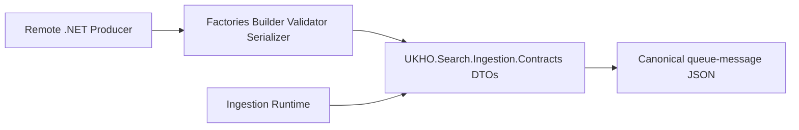

# Implementation Plan

Target output path: `dev/work-packages/102-producer-safe-helpers-validation/plan-ingestion-producer-safe-helpers-validation.md`

Date: 2026-06-30

Based on:
- `dev/work-packages/102-producer-safe-helpers-validation/spec-domain-producer-safe-helpers-validation.md`
- `./.github/instructions/documentation-pass.instructions.md`
- `./.github/instructions/wiki.instructions.md`

## Producer Authoring Foundation

- [x] Work Item 1: Add the first producer-safe authoring slice for envelope factories, serializer facade, and contract version visibility - Completed
  - **Purpose**: Deliver the smallest end-to-end producer improvement by letting a remote .NET caller create and serialize valid non-index envelopes through package-owned helper APIs without needing to wire serializer options or inspect raw DTO details.
  - **Acceptance Criteria**:
    - `UKHO.Search.Ingestion.Contracts` exposes package-owned helper entry points for `CreateDelete` and `CreateAclUpdate`.
    - The package exposes a serializer facade that round-trips the canonical queue-message JSON without requiring callers to instantiate `JsonSerializerOptions` manually.
    - The package exposes a visible contract-version marker through a simple constant or string surface.
    - Tests prove helper parity with the canonical DTO and serializer behavior already delivered by WP101.
    - All code-writing work complies fully with `./.github/instructions/documentation-pass.instructions.md`.
  - **Definition of Done**:
    - Code implemented for helper entry points, serializer facade, and contract-version marker.
    - All new and changed code is fully commented in line with `./.github/instructions/documentation-pass.instructions.md`, including type comments, constructor comments, method comments, parameter comments where practical, property comments where meaning is not obvious, and developer-level flow comments on internal and other non-public code.
    - Focused unit tests pass for the new helper and serializer slice.
    - Package README guidance is updated if the public producer-facing surface changed materially.
    - Wiki review completed; relevant wiki or repository guidance updated, or an explicit no-change review result recorded.
    - Foundational documentation retains book-like narrative depth, defines technical terms, and includes examples or walkthrough support where the subject matter is conceptually dense.
    - Can execute end-to-end via: `dotnet test test/UKHO.Search.Ingestion.Contracts.Tests/UKHO.Search.Ingestion.Contracts.Tests.csproj --filter "FullyQualifiedName~Factory|FullyQualifiedName~Serializer|FullyQualifiedName~Version"`.
  - [x] Task 1: Add the initial helper entry points for simple envelope creation - Completed
    - [x] Step 1: Add package-owned helper APIs for `CreateDelete` and `CreateAclUpdate` in `src/UKHO.Search.Ingestion.Contracts/` using block-scoped namespaces and one public type per file.
    - [x] Step 2: Keep helper logic dependency-free and aligned with the existing DTO validation semantics instead of bypassing them.
    - [x] Step 3: Ensure the helper surface reads naturally for external producer code and does not imply queue submission ownership.
    - [x] Step 4: Apply the full commenting standard from `./.github/instructions/documentation-pass.instructions.md` to every new class, method, constructor, and relevant property, including internal and other non-public types.
  - [x] Task 2: Add the serializer facade and version marker - Completed
    - [x] Step 1: Add package-owned serialize and deserialize entry points that wrap the canonical serializer settings already defined by the contracts package.
    - [x] Step 2: Expose the initial contract-version marker through a simple visible constant or string surface that can be referenced by tests, samples, and documentation.
    - [x] Step 3: Keep the serializer facade semantically identical to `JsonSerializer` plus `IngestionJsonSerializerOptions.Create()`.
    - [x] Step 4: Apply the full commenting standard from `./.github/instructions/documentation-pass.instructions.md` to every new class, method, constructor, and relevant property, including internal and other non-public types.
  - [x] Task 3: Add focused tests and package guidance for the first authoring slice - Completed
    - [x] Step 1: Add focused contracts tests that prove the helper-created envelopes match the canonical JSON and DTO behavior.
    - [x] Step 2: Add tests that prove the serializer facade emits and consumes the same JSON as the existing canonical serializer path.
    - [x] Step 3: Add a focused test proving the contract-version marker is visible and stable through the intended public surface.
    - [x] Step 4: Update `src/UKHO.Search.Ingestion.Contracts/README.md` if needed so the first helper and serializer entry points are discoverable to producers.
  - **Files**:
    - `src/UKHO.Search.Ingestion.Contracts/*`: helper entry points, serializer facade, and contract-version marker.
    - `test/UKHO.Search.Ingestion.Contracts.Tests/*`: focused tests for factory, serializer, and version behavior.
    - `src/UKHO.Search.Ingestion.Contracts/README.md`: producer-facing guidance updates if the public helper surface changes materially.
  - **Work Item Dependencies**: relies on the completed WP101 extracted contracts package and fixture coverage.
  - **Run / Verification Instructions**:
    - `dotnet test test/UKHO.Search.Ingestion.Contracts.Tests/UKHO.Search.Ingestion.Contracts.Tests.csproj --filter "FullyQualifiedName~Factory|FullyQualifiedName~Serializer|FullyQualifiedName~Version"`
    - `dotnet build src/UKHO.Search.Ingestion.Contracts/UKHO.Search.Ingestion.Contracts.csproj`
  - **User Instructions**: No manual setup expected.
  - **Implementation Summary**:
    - Added `IngestionRequestFactory` with producer-safe `CreateDelete(...)` and `CreateAclUpdate(...)` helpers, added `IngestionContractSerializer` as the package-owned serializer facade, and exposed `IngestionContractsPackage.ContractVersion` as the first visible compatibility marker.
    - Added focused contracts tests covering factory output, serializer serialization parity, serializer deserialization behavior, and contract-version visibility, and refreshed `src/UKHO.Search.Ingestion.Contracts/README.md` so the first helper and serializer entry points are discoverable to producers.
    - Validation performed: `dotnet test test/UKHO.Search.Ingestion.Contracts.Tests/UKHO.Search.Ingestion.Contracts.Tests.csproj --filter "FullyQualifiedName~Factory|FullyQualifiedName~Serializer|FullyQualifiedName~Version"` succeeded with 8 passing tests and rebuilt `src/UKHO.Search.Ingestion.Contracts/UKHO.Search.Ingestion.Contracts.csproj` transitively.
    - Wiki review result: Reviewed `wiki/Solution-Architecture.md`, `wiki/Ingestion-Walkthrough.md`, and `wiki/Ingestion-Service-Provider-Mechanism.md`. No wiki page update was made for this partial slice because the change adds package-local producer ergonomics rather than altering ingestion runtime architecture or contributor workflow outside the contracts package, and the updated `src/UKHO.Search.Ingestion.Contracts/README.md` now carries the current producer-facing guidance for the new surface.

## Index Authoring Slice

- [x] Work Item 2: Add typed property helpers and an `IndexRequestBuilder` so producers can author valid `IndexItem` messages end to end - Completed
  - **Purpose**: Deliver the main producer authoring value of WP102 by making `IndexItem` creation safe and readable without forcing callers to hand-assemble every DTO collection and property type pairing.
  - **Acceptance Criteria**:
    - The package exposes typed property helper APIs for the supported property-value kinds in scope for WP102.
    - The package exposes an `IndexRequestBuilder` or equivalent producer-safe builder surface centered on `Build()` and `TryBuild(...)`.
    - A package-owned `CreateIndex` helper path exists and produces the same canonical contract as raw DTO construction.
    - The builder and helpers preserve current DTO validity rules for id, timestamp, security tokens, files, properties, property-name normalization, and lower-case property-type tokens.
    - Helper APIs do not derive provider-specific security tokens or absorb File Share policy.
    - All code-writing work complies fully with `./.github/instructions/documentation-pass.instructions.md`.
  - **Definition of Done**:
    - Code implemented for typed property helpers, builder support, and the `CreateIndex` authoring path.
    - All new and changed code is fully commented in line with `./.github/instructions/documentation-pass.instructions.md`, including type comments, constructor comments, method comments, parameter comments where practical, property comments where meaning is not obvious, and developer-level flow comments on internal and other non-public code.
    - Focused unit tests pass for the index authoring slice.
    - Producer-facing guidance is updated to describe the preferred first-cut calling pattern for straightforward versus incremental authoring.
    - Wiki review completed; relevant wiki or repository guidance updated, or an explicit no-change review result recorded.
    - Foundational documentation retains book-like narrative depth, defines technical terms, and includes examples or walkthrough support where the subject matter is conceptually dense.
    - Can execute end-to-end via: `dotnet test test/UKHO.Search.Ingestion.Contracts.Tests/UKHO.Search.Ingestion.Contracts.Tests.csproj --filter "FullyQualifiedName~Index|FullyQualifiedName~Property|FullyQualifiedName~Builder"`.
  - [x] Task 1: Add typed property helper APIs - Completed
    - [x] Step 1: Add typed property helper entry points for the supported property kinds such as string, text, date/time, and string-array values.
    - [x] Step 2: Keep helper output aligned with the current `IngestionProperty` and `IngestionPropertyType` semantics delivered by WP101.
    - [x] Step 3: Ensure helper naming and return shapes remain simple enough for external producer use without repository-specific knowledge.
    - [x] Step 4: Apply the full commenting standard from `./.github/instructions/documentation-pass.instructions.md` to every new class, method, constructor, and relevant property, including internal and other non-public types.
  - [x] Task 2: Add the builder-backed `IndexItem` authoring path - Completed
    - [x] Step 1: Add `IndexRequestBuilder` or equivalent builder state types in `src/UKHO.Search.Ingestion.Contracts/` with a simple terminal model centered on `Build()` and `TryBuild(...)`.
    - [x] Step 2: Add a package-owned `CreateIndex` helper path that composes naturally with the builder and typed property helpers.
    - [x] Step 3: Preserve DTO validation semantics rather than reinterpreting them in a weaker or more permissive builder-specific model.
    - [x] Step 4: Keep File Share–specific policy such as `BusinessUnitName` conventions and security-token derivation explicitly outside the contracts package.
    - [x] Step 5: Apply the full commenting standard from `./.github/instructions/documentation-pass.instructions.md` to every new class, method, constructor, and relevant property, including internal and other non-public types.
  - [x] Task 3: Add focused tests and guidance for the `IndexItem` authoring slice - Completed
    - [x] Step 1: Add tests proving property helpers and builder output match raw DTO construction and canonical JSON serialization.
    - [x] Step 2: Add tests proving `TryBuild(...)` handles invalid states without exception-driven control flow for expected validation failures.
    - [x] Step 3: Add tests proving provider-specific policy such as File Share security-token derivation remains outside the package scope.
    - [x] Step 4: Update `src/UKHO.Search.Ingestion.Contracts/README.md` with a worked `IndexItem` helper example if it materially improves producer comprehension.
  - **Files**:
    - `src/UKHO.Search.Ingestion.Contracts/*`: typed property helpers, builder types, and index helper APIs.
    - `test/UKHO.Search.Ingestion.Contracts.Tests/*`: focused tests for property helpers, builder behavior, and index envelope parity.
    - `src/UKHO.Search.Ingestion.Contracts/README.md`: package guidance for helper-based `IndexItem` authoring.
  - **Work Item Dependencies**: Work Item 1.
  - **Run / Verification Instructions**:
    - `dotnet test test/UKHO.Search.Ingestion.Contracts.Tests/UKHO.Search.Ingestion.Contracts.Tests.csproj --filter "FullyQualifiedName~Index|FullyQualifiedName~Property|FullyQualifiedName~Builder"`
    - `dotnet build src/UKHO.Search.Ingestion.Contracts/UKHO.Search.Ingestion.Contracts.csproj`
  - **User Instructions**: No manual setup expected.
  - **Implementation Summary**:
    - Added `IngestionPropertyFactory` for the supported typed property-value pairings, added `IndexRequestBuilder` with a simple `Build()` / `TryBuild(...)` authoring model, and extended `IngestionRequestFactory` with `CreateIndex(...)` overloads so the package now supports package-owned `IndexItem` envelope creation.
    - Kept the helper layer aligned with the canonical DTO model by delegating final normalization and validation to `IngestionPropertyList`, `IngestionFile`, and `IndexRequest`, while explicitly leaving File Share token derivation and other provider-specific policy outside the contracts package.
    - Added focused contracts tests for typed property helpers, `CreateIndex(...)`, builder success, and builder non-throwing failure behavior, and refreshed `src/UKHO.Search.Ingestion.Contracts/README.md` with a worked `IndexItem` helper example and explicit helper non-goals.
    - Validation performed: `dotnet test test/UKHO.Search.Ingestion.Contracts.Tests/UKHO.Search.Ingestion.Contracts.Tests.csproj --filter "FullyQualifiedName~Index|FullyQualifiedName~Property|FullyQualifiedName~Builder"` succeeded with 5 passing tests and rebuilt `src/UKHO.Search.Ingestion.Contracts/UKHO.Search.Ingestion.Contracts.csproj` transitively.
    - Wiki review result: Reviewed `wiki/Solution-Architecture.md`, `wiki/Ingestion-Walkthrough.md`, and `wiki/Ingestion-Service-Provider-Mechanism.md`. No wiki page update was made for this partial slice because the change expands package-local authoring ergonomics but does not yet change the contributor-facing ingestion runtime narrative beyond the contracts README, which was updated directly as the producer-facing source of truth.

## Non-Throwing Validation And Consumer Guidance

- [x] Work Item 3: Add the non-throwing validator and close the producer guidance loop for the WP102 helper surface - Completed
  - **Purpose**: Complete the producer-safe authoring story by giving consumers a structured validation path that reports contract errors without expected exception control flow and by aligning package guidance with the final helper surface delivered by WP102.
  - **Acceptance Criteria**:
    - The package exposes a non-throwing validation API that reports a flat core error model containing `code`, `path`, and `message`.
    - Validator behavior remains semantically aligned with the raw DTO contract and the builder/helper surfaces delivered in earlier work items.
    - Package guidance clearly explains when to use raw DTOs, helper APIs, builder APIs, serializer facade entry points, and validator APIs.
    - Focused tests prove validator output shapes and parity with the underlying contract rules.
    - All code-writing work complies fully with `./.github/instructions/documentation-pass.instructions.md`.
  - **Definition of Done**:
    - Code implemented for the validator result model, contract-error model, and validation entry points.
    - All new and changed code is fully commented in line with `./.github/instructions/documentation-pass.instructions.md`, including type comments, constructor comments, method comments, parameter comments where practical, property comments where meaning is not obvious, and developer-level flow comments on internal and other non-public code.
    - Focused unit tests pass for validator shape and helper/DTO parity.
    - Package README and work package documentation are updated to describe the final WP102 authoring surface in current-state terms.
    - Wiki review completed; relevant wiki or repository guidance updated, or an explicit no-change review result recorded.
    - Foundational documentation retains book-like narrative depth, defines technical terms, and includes examples or walkthrough support where the subject matter is conceptually dense.
    - Can execute end-to-end via: `dotnet test test/UKHO.Search.Ingestion.Contracts.Tests/UKHO.Search.Ingestion.Contracts.Tests.csproj --filter "FullyQualifiedName~Validation|FullyQualifiedName~Validator"`.
  - [x] Task 1: Add the validator result and contract-error model - Completed
    - [x] Step 1: Add package-owned validation result and flat contract-error models with, at minimum, `code`, `path`, and `message`.
    - [x] Step 2: Keep the validator result model independent of any UI, logging, queue, or provider abstractions.
    - [x] Step 3: Apply the full commenting standard from `./.github/instructions/documentation-pass.instructions.md` to every new class, method, constructor, and relevant property, including internal and other non-public types.
  - [x] Task 2: Add validator entry points aligned to the helper and raw DTO surface - Completed
    - [x] Step 1: Add validation entry points that can inspect helper-produced or raw DTO contract instances without changing the underlying contract semantics.
    - [x] Step 2: Ensure expected invalid states are represented through the non-throwing result model rather than through exceptions at the validator layer.
    - [x] Step 3: Keep the validator behavior aligned with the DTO and builder rules already proven by earlier work items.
    - [x] Step 4: Apply the full commenting standard from `./.github/instructions/documentation-pass.instructions.md` to every new class, method, constructor, and relevant property, including internal and other non-public types.
  - [x] Task 3: Add focused tests and finalize producer-facing guidance - Completed
    - [x] Step 1: Add tests proving validator outputs for representative invalid envelopes, payloads, properties, and security-token cases.
    - [x] Step 2: Add parity tests proving the validator reports the same logical failures already enforced by raw DTO construction and canonical serialization paths.
    - [x] Step 3: Refresh `src/UKHO.Search.Ingestion.Contracts/README.md` so the final WP102 helper, serializer, and validator calling patterns are explained in one coherent producer guide.
    - [x] Step 4: Update the active work package documents with the final validation and guidance outcomes.
  - **Files**:
    - `src/UKHO.Search.Ingestion.Contracts/*`: validator types and entry points.
    - `test/UKHO.Search.Ingestion.Contracts.Tests/*`: focused tests for validator behavior and result shape.
    - `src/UKHO.Search.Ingestion.Contracts/README.md`: final WP102 producer-facing guidance updates.
    - `dev/work-packages/102-producer-safe-helpers-validation/*`: execution record updates during implementation.
  - **Work Item Dependencies**: Work Item 1, Work Item 2.
  - **Run / Verification Instructions**:
    - `dotnet test test/UKHO.Search.Ingestion.Contracts.Tests/UKHO.Search.Ingestion.Contracts.Tests.csproj --filter "FullyQualifiedName~Validation|FullyQualifiedName~Validator"`
    - `dotnet build src/UKHO.Search.Ingestion.Contracts/UKHO.Search.Ingestion.Contracts.csproj`
  - **User Instructions**: No manual setup expected.
  - **Implementation Summary**:
    - Added `IngestionContractValidationError`, `IngestionContractValidationResult`, and `IngestionContractValidator` so the contracts package now exposes a non-throwing flat validation surface with stable `code`, `path`, and `message` fields.
    - Kept validator behavior aligned with the current DTO contract by inspecting the in-memory envelope and payload surfaces directly for the same core rules around payload selection, identifiers, security tokens, and reserved `Id` properties.
    - Added focused validator tests for successful validation and representative invalid delete and index cases, and refreshed `src/UKHO.Search.Ingestion.Contracts/README.md` so producers can see how raw DTOs, factories, builder APIs, serializer APIs, and validator APIs fit together.
    - Validation performed: `dotnet test test/UKHO.Search.Ingestion.Contracts.Tests/UKHO.Search.Ingestion.Contracts.Tests.csproj --filter "FullyQualifiedName~Validation|FullyQualifiedName~Validator"` succeeded with 3 passing tests.
    - Wiki review result: Reviewed `wiki/Solution-Architecture.md`, `wiki/Ingestion-Walkthrough.md`, and `wiki/Ingestion-Service-Provider-Mechanism.md`. No wiki page update was made during this work item because the validator surface is package-local producer guidance, and the final work-package wiki review captured the broader architecture update in Work Item 4.

## Wiki Review And Work Package Closure

- [x] Work Item 4: Complete the mandatory wiki review for the full WP102 helper and validation work package - Completed
  - **Purpose**: Satisfy `./.github/instructions/wiki.instructions.md` by reviewing whether the new producer authoring helpers, validator surface, serializer facade, and contract-version marker change contributor understanding of the contracts package, ingestion authoring workflow, or repository guidance.
  - **Acceptance Criteria**:
    - The implementation explicitly reviews the wiki and repository guidance most likely to be affected by the new producer-facing authoring surface.
    - Any required wiki or repository guidance updates are made before the work package is closed.
    - If no updates are required for a reviewed page, the execution record states which pages were reviewed and why they remained sufficient.
  - **Definition of Done**:
    - Wiki review outcome recorded explicitly.
    - Relevant wiki or repository guidance updated, created, or intentionally left unchanged with a concrete explanation.
    - Foundational documentation retains book-like narrative depth, defines technical terms, and includes examples or walkthrough support where the subject matter is conceptually dense.
    - Can execute end-to-end via: a final work package record that cites the reviewed pages and resulting updates or no-change decisions.
  - [x] Task 1: Review likely affected wiki and repository guidance - Completed
    - [x] Step 1: Review `wiki/Solution-Architecture.md` for any wording that should now acknowledge the contracts package as a producer-safe authoring surface rather than only a DTO boundary.
    - [x] Step 2: Review `wiki/Ingestion-Walkthrough.md` and `wiki/Ingestion-Service-Provider-Mechanism.md` for any contributor guidance that should explicitly distinguish contract authoring helpers from queue submission and provider runtime responsibilities.
    - [x] Step 3: Review `src/UKHO.Search.Ingestion.Contracts/README.md` and any linked repository guidance paths to ensure the producer entry story remains current-state and coherent.
  - [x] Task 2: Record and apply the outcome - Completed
    - [x] Step 1: Update any affected wiki or repository guidance pages before marking the work package complete.
    - [x] Step 2: Record explicit no-change results for reviewed pages that remain sufficient.
    - [x] Step 3: Ensure the final execution record names the updated, created, or unchanged pages directly.
  - **Files**:
    - `wiki/Solution-Architecture.md`: update if the contracts package role needs broader contributor-facing clarification.
    - `wiki/Ingestion-Walkthrough.md`: update if producer authoring guidance needs to distinguish helper-based authoring from runtime processing.
    - `wiki/Ingestion-Service-Provider-Mechanism.md`: update if queue-message authoring and provider execution boundaries need clearer narrative separation.
    - `src/UKHO.Search.Ingestion.Contracts/README.md`: confirm or update the final package guidance linked from the wiki review.
  - **Work Item Dependencies**: Work Item 1, Work Item 2, Work Item 3.
  - **Run / Verification Instructions**:
    - Review the listed wiki and repository guidance pages alongside the final implemented helper surface
    - Confirm the final execution record contains an explicit wiki review result
  - **User Instructions**: No manual setup expected.
  - **Implementation Summary**:
    - Reviewed `wiki/Solution-Architecture.md`, `wiki/Ingestion-Walkthrough.md`, `wiki/Ingestion-Service-Provider-Mechanism.md`, `wiki/Architecture-Walkthrough.md`, and `src/UKHO.Search.Ingestion.Contracts/README.md` against the final WP102 implementation.
    - Updated `wiki/Solution-Architecture.md` and `wiki/Architecture-Walkthrough.md` so they now describe `UKHO.Search.Ingestion.Contracts` as a producer-safe authoring surface with helper and validator entry points, not only as a DTO and serializer boundary.
    - Left `wiki/Ingestion-Walkthrough.md` and `wiki/Ingestion-Service-Provider-Mechanism.md` unchanged because WP102 did not alter ingestion runtime execution, provider ownership, or queue-processing flow; their existing current-state runtime narrative remained sufficient once the package README carried the producer-facing helper details.
    - Final validation performed: `dotnet test test/UKHO.Search.Ingestion.Contracts.Tests/UKHO.Search.Ingestion.Contracts.Tests.csproj` succeeded with 18 passing tests, and `dotnet build src/UKHO.Search.Ingestion.Contracts/UKHO.Search.Ingestion.Contracts.csproj` succeeded.
    - Wiki review result: Updated `wiki/Solution-Architecture.md`, `wiki/Architecture-Walkthrough.md`, and `src/UKHO.Search.Ingestion.Contracts/README.md`; reviewed `wiki/Ingestion-Walkthrough.md` and `wiki/Ingestion-Service-Provider-Mechanism.md` with explicit no-change decisions.

## Summary / Key Considerations

- The plan keeps WP102 narrowly centered on producer-safe authoring ergonomics inside `UKHO.Search.Ingestion.Contracts`, not on transport, provider policy, or queue submission.
- The first runnable slice focuses on the simplest end-to-end producer value: package-owned factories for non-index envelopes, serializer facade entry points, and visible contract-version reporting.
- The second slice delivers the main index-authoring ergonomics through typed property helpers and a builder-centered `IndexItem` path while keeping provider-specific policy outside the package.
- The third slice completes the producer story with a non-throwing validator and final package guidance that explains when to choose raw DTOs, factories, builder APIs, serializer facade APIs, and validator APIs.
- `./.github/instructions/documentation-pass.instructions.md` is a hard gate for every code-writing task in the plan, and `./.github/instructions/wiki.instructions.md` remains a mandatory completion gate for the work package closeout.

# Architecture

## Overall Technical Approach

WP102 extends `UKHO.Search.Ingestion.Contracts` from a DTO-and-serializer package into a small producer-authoring library that still preserves the same dependency-light boundary introduced in WP100 and the same wire contract established in WP101.

The technical approach is deliberately additive. The raw DTOs remain the canonical contract surface. WP102 layers convenience APIs on top of that surface so remote .NET producers can author valid envelopes more safely and with less repetitive plumbing, but without changing the underlying JSON contract or introducing transport ownership.

The intended shape after WP102 is:

The helper layer succeeds when it reduces invalid message construction, preserves queue-message compatibility, remains dependency-free, and keeps provider policy and queue submission concerns outside the package.

## Frontend

No frontend or Blazor feature is introduced by WP102.

The only user-facing change is at the package-consumer level: producers and contributors gain a safer and more discoverable authoring surface through helper APIs and refreshed package guidance. That remains developer-facing documentation and library ergonomics rather than a UI-host concern.

## Backend

The backend impact is focused entirely on the contracts package and its focused tests.

Current state before WP102:
- the contracts package owns the DTOs, serializer options, and fixtures
- producers must manually compose DTOs and serializer options
- local helper ergonomics exist only in tooling code such as `FileShareEmulator.Common`, where they are mixed with provider-specific policy

Target state after WP102:
- the contracts package owns producer-safe factories, typed property helpers, builder support, a non-throwing validator, serializer facade entry points, and a visible contract-version marker
- helper behavior remains aligned with the existing DTO and JSON contract
- provider-specific policy such as File Share security-token derivation remains outside the package
- focused contracts tests prove helper, serializer, and validator parity without requiring a full-solution test run

The main architectural rule is that authoring convenience must not become behavioral drift. The helper APIs exist to make the canonical contract easier to use, not to create a second interpretation of that contract.