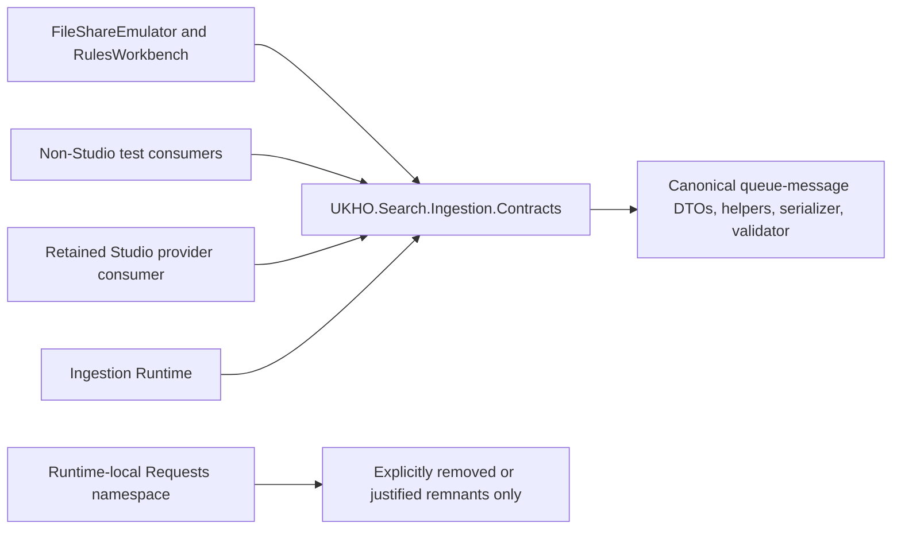

# Implementation Plan

Target output path: `dev/work-packages/103-in-repo-consumer-contract-convergence/plan-ingestion-in-repo-consumer-contract-convergence.md`

Date: 2026-06-30

Based on:
- `dev/work-packages/103-in-repo-consumer-contract-convergence/spec-domain-in-repo-consumer-contract-convergence.md`
- `./.github/instructions/documentation-pass.instructions.md`
- `./.github/instructions/wiki.instructions.md`

## Tooling Consumer Convergence

- [x] Work Item 1: Converge FileShareEmulator and FileShareEmulator.Common onto `UKHO.Search.Ingestion.Contracts` - Completed
  - **Purpose**: Deliver the first non-Studio consumer-convergence slice by moving the local File Share emulator authoring path onto the extracted contracts package so tooling and runtime now share the same canonical queue-message surface.
  - **Acceptance Criteria**:
    - `tools/FileShareEmulator.Common/*` and `tools/FileShareEmulator/*` no longer depend on `UKHO.Search.Ingestion.Requests` for queue-message DTOs or serializer configuration.
    - FileShareEmulator-related tests continue to prove current queue-message behavior after the migration.
    - Any selective adoption of WP102 helper APIs remains behavior-preserving and does not absorb File Share security-token derivation into the contracts package.
    - All code-writing work complies fully with `./.github/instructions/documentation-pass.instructions.md`.
  - **Definition of Done**:
    - Code implemented for the FileShareEmulator and FileShareEmulator.Common migration slice.
    - All new and changed code is fully commented in line with `./.github/instructions/documentation-pass.instructions.md`, including type comments, constructor comments, method comments, parameter comments where practical, property comments where meaning is not obvious, and developer-level flow comments on internal and other non-public code.
    - Focused FileShareEmulator-related tests pass.
    - Documentation updated in the active work package and package/tool guidance updated if needed.
    - Wiki review completed; relevant wiki or repository guidance updated, or an explicit no-change review result recorded.
    - Foundational documentation retains book-like narrative depth, defines technical terms, and includes examples or walkthrough support where the subject matter is conceptually dense.
    - Can execute end-to-end via: `dotnet test test/FileShareEmulator.Common.Tests/FileShareEmulator.Common.Tests.csproj` and `dotnet test test/FileShareEmulator.Tests/FileShareEmulator.Tests.csproj`.
  - [x] Task 1: Migrate FileShareEmulator.Common queue-message authoring code - Completed
    - [x] Step 1: Update `tools/FileShareEmulator.Common/FileShareIngestionMessageFactory.cs` to reference `UKHO.Search.Ingestion.Contracts` instead of the runtime-local request namespace.
    - [x] Step 2: Decide whether raw DTOs or WP102 helper APIs keep the emulator authoring path clearer, while preserving current message shape and File Share token-policy behavior.
    - [x] Step 3: Keep `SecurityTokenPolicy` outside the contracts package and outside package-owned helper behavior.
    - [x] Step 4: Apply the full commenting standard from `./.github/instructions/documentation-pass.instructions.md` to every changed class, method, constructor, and relevant property, including internal and other non-public types.
  - [x] Task 2: Migrate FileShareEmulator runtime-side consumers - Completed
    - [x] Step 1: Update `tools/FileShareEmulator/Services/IndexService.cs` and any neighboring ingestion-message paths to use the extracted contracts package and, where appropriate, the package-owned serializer facade.
    - [x] Step 2: Preserve current batch/message generation behavior and user-visible emulator workflow.
    - [x] Step 3: Apply the full commenting standard from `./.github/instructions/documentation-pass.instructions.md` to every changed class, method, constructor, and relevant property, including internal and other non-public types.
  - [x] Task 3: Update focused tests for the emulator slice - Completed
    - [x] Step 1: Update `test/FileShareEmulator.Common.Tests/*` to reference the extracted contracts package instead of the runtime-local request namespace.
    - [x] Step 2: Update any touched FileShareEmulator runtime tests so they still prove current queue-message behavior.
    - [x] Step 3: Validate that the migration did not move File Share token-policy ownership into the contracts package.
  - **Files**:
    - `tools/FileShareEmulator.Common/*`: queue-message construction and supporting tests.
    - `tools/FileShareEmulator/*`: runtime-side queue-message consumers.
    - `test/FileShareEmulator.Common.Tests/*`: focused tests for emulator contract behavior.
    - `test/FileShareEmulator.Tests/*`: focused tests for emulator runtime behavior if touched.
  - **Work Item Dependencies**: relies on the completed WP101/WP102 contracts package and helper surface.
  - **Run / Verification Instructions**:
    - `dotnet test test/FileShareEmulator.Common.Tests/FileShareEmulator.Common.Tests.csproj`
    - `dotnet test test/FileShareEmulator.Tests/FileShareEmulator.Tests.csproj`
  - **User Instructions**: No manual setup expected.
  - **Implementation Summary**:
    - Migrated `tools/FileShareEmulator.Common/FileShareIngestionMessageFactory.cs`, `tools/FileShareEmulator/Services/IndexService.cs`, and the related emulator-common tests to `UKHO.Search.Ingestion.Contracts`, and narrowed the emulator project references away from `UKHO.Search.Ingestion` to the extracted contracts project.
    - Preserved the existing emulator authoring flow and File Share token-policy ownership by keeping `SecurityTokenPolicy` in the tooling layer rather than moving that behavior into the contracts package.
    - Validation performed: `dotnet test test/FileShareEmulator.Common.Tests/FileShareEmulator.Common.Tests.csproj` succeeded with 7 passing tests, and `dotnet test test/FileShareEmulator.Tests/FileShareEmulator.Tests.csproj` succeeded with 7 passing tests. `FileShareEmulator.Tests` emitted 4 pre-existing nullable warnings in `BatchFilesApiTests.cs` unrelated to this migration slice.
    - Wiki review result: No wiki page update was required for this slice. Reviewed `wiki/Solution-Architecture.md`, `wiki/Ingestion-Walkthrough.md`, and `wiki/Architecture-Walkthrough.md`; the migration changed internal tooling references to the canonical contracts package but did not materially change the already-published contributor understanding of runtime architecture or tooling workflow beyond the code-level convergence recorded in this work package.

## Rules Workbench And Service Test Convergence

- [x] Work Item 2: Converge RulesWorkbench and service-aligned test consumers onto the extracted contracts package - Completed
  - **Purpose**: Deliver the next runnable non-Studio slice by moving rules-evaluation tooling and service-adjacent tests onto the canonical contracts package while preserving current evaluation and diagnostics behavior.
  - **Acceptance Criteria**:
    - RulesWorkbench services no longer depend on `UKHO.Search.Ingestion.Requests`.
    - Service-adjacent test consumers that still rely on the old request namespace are migrated to the extracted contracts package.
    - Existing rule-evaluation and service-layer behaviors remain unchanged.
    - All code-writing work complies fully with `./.github/instructions/documentation-pass.instructions.md`.
  - **Definition of Done**:
    - Code implemented for the RulesWorkbench and service-test convergence slice.
    - All new and changed code is fully commented in line with `./.github/instructions/documentation-pass.instructions.md`, including type comments, constructor comments, method comments, parameter comments where practical, property comments where meaning is not obvious, and developer-level flow comments on internal and other non-public code.
    - Focused RulesWorkbench and service-adjacent tests pass.
    - Documentation updated in the active work package if the migration changes contributor understanding of the rules-tooling contract path.
    - Wiki review completed; relevant wiki or repository guidance updated, or an explicit no-change review result recorded.
    - Foundational documentation retains book-like narrative depth, defines technical terms, and includes examples or walkthrough support where the subject matter is conceptually dense.
    - Can execute end-to-end via: `dotnet test test/RulesWorkbench.Tests/RulesWorkbench.Tests.csproj` and `dotnet test test/UKHO.Search.Services.Ingestion.Tests/UKHO.Search.Services.Ingestion.Tests.csproj`.
  - [x] Task 1: Migrate RulesWorkbench queue-message consumers - Completed
    - [x] Step 1: Update `tools/RulesWorkbench/Services/RuleEvaluationService.cs` and `tools/RulesWorkbench/Services/EvaluationPayloadMapper.cs` to use `UKHO.Search.Ingestion.Contracts`.
    - [x] Step 2: Preserve current rule-evaluation payload mapping and diagnostics behavior while migrating the contract namespace.
    - [x] Step 3: Apply the full commenting standard from `./.github/instructions/documentation-pass.instructions.md` to every changed class, method, constructor, and relevant property, including internal and other non-public types.
  - [x] Task 2: Migrate service-adjacent consumer tests - Completed
    - [x] Step 1: Update `test/RulesWorkbench.Tests/*` to reference the extracted contracts package.
    - [x] Step 2: Update `test/UKHO.Search.Services.Ingestion.Tests/*` and other directly touched service-adjacent tests that still reference the runtime-local request namespace.
    - [x] Step 3: Keep test intent centered on current queue-message and rule-evaluation behavior rather than on implementation detail drift.
  - **Files**:
    - `tools/RulesWorkbench/*`: rules-evaluation payload consumers.
    - `test/RulesWorkbench.Tests/*`: focused rules-tooling tests.
    - `test/UKHO.Search.Services.Ingestion.Tests/*`: service-adjacent tests if touched.
  - **Work Item Dependencies**: Work Item 1.
  - **Run / Verification Instructions**:
    - `dotnet test test/RulesWorkbench.Tests/RulesWorkbench.Tests.csproj`
    - `dotnet test test/UKHO.Search.Services.Ingestion.Tests/UKHO.Search.Services.Ingestion.Tests.csproj`
  - **User Instructions**: No manual setup expected.
  - **Implementation Summary**:
    - Migrated `tools/RulesWorkbench/Services/RuleEvaluationService.cs`, `tools/RulesWorkbench/Services/EvaluationPayloadMapper.cs`, selected `RulesWorkbench.Tests` files, and `test/UKHO.Search.Services.Ingestion.Tests/TestProviders/TestIngestionDataProvider.cs` to `UKHO.Search.Ingestion.Contracts`, and added direct contracts project references where those projects now consume the extracted package explicitly.
    - Preserved current rule-evaluation, payload mapping, and service-test behavior by changing the contract ownership path without redesigning the rules or provider logic.
    - Validation performed: `dotnet test test/RulesWorkbench.Tests/RulesWorkbench.Tests.csproj` succeeded with 58 passing tests, and `dotnet test test/UKHO.Search.Services.Ingestion.Tests/UKHO.Search.Services.Ingestion.Tests.csproj` succeeded with 7 passing tests. The RulesWorkbench slice emitted pre-existing `NU1903` vulnerability warnings for `Microsoft.Kiota.Abstractions` and pre-existing nullable warnings in `RulesSnapshotStore.cs` and several test files.
    - Wiki review result: No wiki page update was required for this slice. Reviewed `wiki/Solution-Architecture.md`, `wiki/Ingestion-Walkthrough.md`, and `wiki/Architecture-Walkthrough.md`; the migration changed internal tool and service-test references to the canonical contracts package but did not materially alter the already-published contributor understanding of ingestion runtime flow or rules-tooling workflow.

## Runtime-Test And Provider-Test Convergence

- [x] Work Item 3: Converge infrastructure, provider, and integration test consumers onto the extracted contracts package - Completed
  - **Purpose**: Complete the largest non-Studio convergence slice by migrating the remaining runtime-test and provider-test consumers to `UKHO.Search.Ingestion.Contracts`, while preserving current ingestion, rules, provider, and integration behavior.
  - **Acceptance Criteria**:
    - `UKHO.Search.Infrastructure.Ingestion.Tests`, `UKHO.Search.Ingestion.Providers.FileShare.Tests`, and touched integration-test slices no longer depend on `UKHO.Search.Ingestion.Requests`.
    - Any migrated tests continue to prove the same queue-message, rules, provider, and indexing behavior.
    - If the runtime-local request surface remains after the migration, the work package records why it still exists rather than leaving dual ownership implicit.
    - All code-writing work complies fully with `./.github/instructions/documentation-pass.instructions.md`.
  - **Definition of Done**:
    - Code implemented for the infrastructure/provider/integration convergence slice.
    - All new and changed code is fully commented in line with `./.github/instructions/documentation-pass.instructions.md`, including type comments, constructor comments, method comments, parameter comments where practical, property comments where meaning is not obvious, and developer-level flow comments on internal and other non-public code.
    - Focused infrastructure, provider, and integration tests pass for the touched slices.
    - Any remaining runtime-local request ownership is explicitly documented in the work package record.
    - Wiki review completed; relevant wiki or repository guidance updated, or an explicit no-change review result recorded.
    - Foundational documentation retains book-like narrative depth, defines technical terms, and includes examples or walkthrough support where the subject matter is conceptually dense.
    - Can execute end-to-end via the targeted infrastructure/provider/integration test commands for the touched slices.
  - [x] Task 1: Migrate infrastructure-ingestion test consumers - Completed
    - [x] Step 1: Update `test/UKHO.Search.Infrastructure.Ingestion.Tests/*` that still import `UKHO.Search.Ingestion.Requests` or the runtime-local serializer namespace.
    - [x] Step 2: Preserve queue-source, rules, dead-letter, and indexing test intent while changing only the contract ownership path.
    - [x] Step 3: Apply the full commenting standard from `./.github/instructions/documentation-pass.instructions.md` to every changed class, method, constructor, and relevant property, including internal and other non-public types.
  - [x] Task 2: Migrate File Share provider and integration test consumers - Completed
    - [x] Step 1: Update `test/UKHO.Search.Ingestion.Providers.FileShare.Tests/*` to reference the extracted contracts package.
    - [x] Step 2: Update touched `test/UKHO.Search.IntegrationTests/*` slices that still depend on the old request namespace.
    - [x] Step 3: Preserve current provider and end-to-end queue-message behavior while changing only the contract path.
  - [x] Task 3: Record the legacy request-surface outcome - Completed
    - [x] Step 1: Determine whether any runtime-local `src/UKHO.Search.Ingestion/Requests/*` files still have a justified role after the non-Studio convergence work.
    - [x] Step 2: If any remain, record the concrete reason in the work package execution record so dual ownership does not remain accidental.
    - [x] Step 3: If removal is safe and naturally part of the migration, remove the no-longer-needed legacy request-surface files or references in this slice.
  - **Files**:
    - `test/UKHO.Search.Infrastructure.Ingestion.Tests/*`: infrastructure-ingestion test consumers.
    - `test/UKHO.Search.Ingestion.Providers.FileShare.Tests/*`: provider-focused tests.
    - `test/UKHO.Search.IntegrationTests/*`: touched integration slices.
    - `src/UKHO.Search.Ingestion/Requests/*`: only to the extent required to record or remove remaining legacy request ownership.
  - **Work Item Dependencies**: Work Item 1, Work Item 2.
  - **Run / Verification Instructions**:
    - `dotnet test test/UKHO.Search.Infrastructure.Ingestion.Tests/UKHO.Search.Infrastructure.Ingestion.Tests.csproj`
    - `dotnet test test/UKHO.Search.Ingestion.Providers.FileShare.Tests/UKHO.Search.Ingestion.Providers.FileShare.Tests.csproj`
    - `dotnet test test/UKHO.Search.IntegrationTests/UKHO.Search.IntegrationTests.csproj --filter "Ingestion|Rules|FileShare"`
  - **User Instructions**: No manual setup expected.
  - **Implementation Summary**:
    - Migrated the remaining non-Studio infrastructure-ingestion, File Share provider, and integration test consumers from `UKHO.Search.Ingestion.Requests` to `UKHO.Search.Ingestion.Contracts`, including the old runtime-local serializer namespace where it still appeared.
    - Added explicit contracts project references to the affected test projects so their queue-message contract dependency is direct and obvious rather than only transitive.
    - Recorded the legacy request-surface outcome: after the non-Studio convergence slice, the only remaining `UKHO.Search.Ingestion.Requests` consumers are the intentionally deferred Studio provider code/tests and the legacy request-model files themselves. Those files therefore remain as an explicit deferred compatibility surface rather than as accidental dual ownership.
    - Validation performed: `dotnet test test/UKHO.Search.Infrastructure.Ingestion.Tests/UKHO.Search.Infrastructure.Ingestion.Tests.csproj` succeeded with 145 passing tests, `dotnet test test/UKHO.Search.Ingestion.Providers.FileShare.Tests/UKHO.Search.Ingestion.Providers.FileShare.Tests.csproj` succeeded with 46 passing tests, and `dotnet test test/UKHO.Search.IntegrationTests/UKHO.Search.IntegrationTests.csproj --filter "Ingestion|Rules|FileShare"` succeeded with 18 passing tests. The slice emitted pre-existing `NU1903` vulnerability warnings for `Microsoft.Kiota.Abstractions` and pre-existing nullable warnings in several touched test projects.
    - Wiki review result: No wiki page update was made during this work item because the non-Studio consumer convergence now matches the architecture and package-ownership story already documented by WP101 and WP102, and the remaining legacy request surface is an internal deferred compatibility detail captured in this work package record.

## Wiki Review And Work Package Closure

- [x] Work Item 4: Complete the mandatory wiki review for the full WP103 non-Studio convergence work package - Completed
  - **Purpose**: Satisfy `./.github/instructions/wiki.instructions.md` by reviewing whether the consumer convergence work changes contributor understanding of the canonical queue-message contract location, tool authoring paths, or repository runtime/test workflow guidance.
  - **Acceptance Criteria**:
    - The implementation explicitly reviews the wiki and repository guidance most likely to be affected by the non-Studio convergence work.
    - Any required wiki or repository guidance updates are made before the work package is closed.
    - If no updates are required for a reviewed page, the execution record states which pages were reviewed and why they remained sufficient.
  - **Definition of Done**:
    - Wiki review outcome recorded explicitly.
    - Relevant wiki or repository guidance updated, created, or intentionally left unchanged with a concrete explanation.
    - Foundational documentation retains book-like narrative depth, defines technical terms, and includes examples or walkthrough support where the subject matter is conceptually dense.
    - Can execute end-to-end via: a final work package record that cites the reviewed pages and resulting updates or no-change decisions.
  - [x] Task 1: Review likely affected wiki and repository guidance - Completed
    - [x] Step 1: Review `wiki/Solution-Architecture.md` and `wiki/Architecture-Walkthrough.md` for any wording that still implies non-Studio tooling or tests consume a runtime-local queue-message contract.
    - [x] Step 2: Review `wiki/Ingestion-Walkthrough.md` and `wiki/Ingestion-Service-Provider-Mechanism.md` for any contributor guidance that should now point more clearly at `UKHO.Search.Ingestion.Contracts` for tool/test authoring paths.
    - [x] Step 3: Review `src/UKHO.Search.Ingestion.Contracts/README.md` and any related repository guidance paths to ensure the producer-safe contract story remains aligned after in-repo convergence.
  - [x] Task 2: Record and apply the outcome - Completed
    - [x] Step 1: Update any affected wiki or repository guidance pages before marking the work package complete.
    - [x] Step 2: Record explicit no-change results for reviewed pages that remain sufficient.
    - [x] Step 3: Ensure the final execution record names the updated, created, or unchanged pages directly.
  - **Files**:
    - `wiki/Solution-Architecture.md`: update if the canonical contract ownership story for non-Studio consumers needs clarification.
    - `wiki/Architecture-Walkthrough.md`: update if code-reading guidance should reflect the completed non-Studio convergence path.
    - `wiki/Ingestion-Walkthrough.md`: update if contributor authoring paths for tools/tests need clearer contract-package references.
    - `wiki/Ingestion-Service-Provider-Mechanism.md`: update if provider/test ownership boundaries need clarification after convergence.
    - `src/UKHO.Search.Ingestion.Contracts/README.md`: confirm or update the package guidance linked from the wiki review.
  - **Work Item Dependencies**: Work Item 1, Work Item 2, Work Item 3.
  - **Run / Verification Instructions**:
    - Review the listed wiki and repository guidance pages alongside the final implemented convergence slice
    - Confirm the final execution record contains an explicit wiki review result
  - **User Instructions**: No manual setup expected.
  - **Implementation Summary**:
    - Reviewed `wiki/Solution-Architecture.md`, `wiki/Architecture-Walkthrough.md`, `wiki/Ingestion-Walkthrough.md`, `wiki/Ingestion-Service-Provider-Mechanism.md`, and `src/UKHO.Search.Ingestion.Contracts/README.md` against the final WP103 implementation.
    - Left all reviewed wiki and repository guidance pages unchanged because the non-Studio convergence work now aligns the codebase with the contract-ownership story those pages already describe: `UKHO.Search.Ingestion.Contracts` is the canonical queue-message surface for runtime, tooling, and tests. No new contributor-facing architecture or workflow concept was introduced beyond that already-documented direction.
    - The only remaining runtime-local request usage is the intentionally deferred Studio slice plus the legacy request-model files retained for that deferred compatibility surface, and that deferred state is captured in this work package record rather than requiring a new wiki concept.
    - Final validation basis: `dotnet test test/FileShareEmulator.Common.Tests/FileShareEmulator.Common.Tests.csproj`, `dotnet test test/FileShareEmulator.Tests/FileShareEmulator.Tests.csproj`, `dotnet test test/RulesWorkbench.Tests/RulesWorkbench.Tests.csproj`, `dotnet test test/UKHO.Search.Services.Ingestion.Tests/UKHO.Search.Services.Ingestion.Tests.csproj`, `dotnet test test/UKHO.Search.Infrastructure.Ingestion.Tests/UKHO.Search.Infrastructure.Ingestion.Tests.csproj`, `dotnet test test/UKHO.Search.Ingestion.Providers.FileShare.Tests/UKHO.Search.Ingestion.Providers.FileShare.Tests.csproj`, and `dotnet test test/UKHO.Search.IntegrationTests/UKHO.Search.IntegrationTests.csproj --filter "Ingestion|Rules|FileShare"` all succeeded.
    - Wiki review result: No wiki page update was necessary. Reviewed `wiki/Solution-Architecture.md`, `wiki/Architecture-Walkthrough.md`, `wiki/Ingestion-Walkthrough.md`, `wiki/Ingestion-Service-Provider-Mechanism.md`, and `src/UKHO.Search.Ingestion.Contracts/README.md`; the existing published guidance remained sufficient once the codebase converged to match it.

## Studio Convergence Extension

- [x] Work Item 5: Converge the retained Studio provider slice onto `UKHO.Search.Ingestion.Contracts` - Completed
  - **Purpose**: Complete the final remaining in-repo queue-message consumer migration by moving the retained Studio File Share provider slice onto the extracted contracts package so the repository no longer has active non-legacy consumers of `UKHO.Search.Ingestion.Requests`.
  - **Acceptance Criteria**:
    - `src/Providers/UKHO.Search.Studio.Providers.FileShare/*` no longer depends on `UKHO.Search.Ingestion.Requests` or the runtime-local serializer namespace.
    - `test/UKHO.Search.Studio.Providers.FileShare.Tests/*` validates the Studio provider slice against the extracted contracts package.
    - The Studio-facing payload fetch, submission, context, and indexing flows preserve their current behavior after the migration.
    - All code-writing work complies fully with `./.github/instructions/documentation-pass.instructions.md`.
  - **Definition of Done**:
    - Code implemented for the retained Studio convergence slice.
    - All new and changed code is fully commented in line with `./.github/instructions/documentation-pass.instructions.md`, including type comments, constructor comments, method comments, parameter comments where practical, property comments where meaning is not obvious, and developer-level flow comments on internal and other non-public code.
    - Focused Studio provider tests pass.
    - The active work package and canonical spec are updated to reflect that Studio convergence is no longer deferred.
    - Wiki review completed; relevant wiki or repository guidance updated, or an explicit no-change review result recorded.
    - Foundational documentation retains book-like narrative depth, defines technical terms, and includes examples or walkthrough support where the subject matter is conceptually dense.
    - Can execute end-to-end via: `dotnet test test/UKHO.Search.Studio.Providers.FileShare.Tests/UKHO.Search.Studio.Providers.FileShare.Tests.csproj`.
  - [x] Task 1: Migrate the Studio provider and payload source surfaces - Completed
    - [x] Step 1: Update the retained Studio provider files to reference `UKHO.Search.Ingestion.Contracts` instead of the runtime-local request namespace.
    - [x] Step 2: Narrow the Studio provider project dependency from `UKHO.Search.Ingestion` to `UKHO.Search.Ingestion.Contracts` where only the queue-message contract surface is needed.
    - [x] Step 3: Preserve the current Studio-facing payload semantics, including File Share token-policy behavior.
  - [x] Task 2: Migrate the focused Studio provider tests - Completed
    - [x] Step 1: Update `test/UKHO.Search.Studio.Providers.FileShare.Tests/*` to reference the extracted contracts package.
    - [x] Step 2: Validate that Studio provider ingestion tests still prove the current fetch, submit, and index flows.
  - **Files**:
    - `src/Providers/UKHO.Search.Studio.Providers.FileShare/*`: retained Studio provider consumer slice.
    - `test/UKHO.Search.Studio.Providers.FileShare.Tests/*`: focused Studio provider tests.
    - `dev/work-packages/103-in-repo-consumer-contract-convergence/*`: spec and execution record updates for the scope extension.
  - **Work Item Dependencies**: Work Item 1, Work Item 2, Work Item 3.
  - **Run / Verification Instructions**:
    - `dotnet test test/UKHO.Search.Studio.Providers.FileShare.Tests/UKHO.Search.Studio.Providers.FileShare.Tests.csproj`
  - **User Instructions**: No manual setup expected.
  - **Implementation Summary**:
    - Migrated the retained Studio provider files and their focused tests to `UKHO.Search.Ingestion.Contracts`, and narrowed the Studio provider project dependency from `UKHO.Search.Ingestion` to `UKHO.Search.Ingestion.Contracts`.
    - Preserved the current Studio-facing payload behavior, including File Share security-token policy remaining in the Studio slice rather than moving into the contracts package.
    - Validation performed: `dotnet test test/UKHO.Search.Studio.Providers.FileShare.Tests/UKHO.Search.Studio.Providers.FileShare.Tests.csproj` succeeded with 10 passing tests. The slice emitted pre-existing `NU1903` warnings for `Microsoft.Kiota.Abstractions` and a pre-existing `NU1902` warning for `OpenTelemetry.Api` through the Studio dependency graph.
    - Wiki review result: No wiki page update was required for the Studio slice itself. The migration completed the already-documented contract-ownership story rather than introducing a new contributor-facing workflow or architecture concept.

- [x] Work Item 6: Re-run the final WP103 wiki review after Studio convergence - Completed
  - **Purpose**: Confirm that the completed full-consumer convergence, including the Studio slice, is either reflected in the repository wiki and guidance or explicitly requires no further update.
  - **Acceptance Criteria**:
    - The final WP103 wiki review is repeated against the completed full-consumer convergence state.
    - Any required wiki or repository guidance updates are made before the work package is closed.
    - If no updates are required, the execution record states which pages were reviewed and why they remained sufficient.
  - **Definition of Done**:
    - Final wiki review outcome recorded explicitly.
    - Relevant wiki or repository guidance updated, created, or intentionally left unchanged with a concrete explanation.
    - Foundational documentation retains book-like narrative depth, defines technical terms, and includes examples or walkthrough support where the subject matter is conceptually dense.
    - Can execute end-to-end via: a final work package record that cites the reviewed pages and resulting updates or no-change decisions.
  - [x] Task 1: Review the architecture and ingestion guidance again against the full convergence state - Completed
    - [x] Step 1: Review `wiki/Solution-Architecture.md` and `wiki/Architecture-Walkthrough.md` for any wording that still implies Studio or other internal consumers depend on a runtime-local queue-message contract.
    - [x] Step 2: Review `wiki/Ingestion-Walkthrough.md` and `wiki/Ingestion-Service-Provider-Mechanism.md` for any contributor guidance that should now change because Studio also converges on the contracts package.
    - [x] Step 3: Review `src/UKHO.Search.Ingestion.Contracts/README.md` to ensure the package guidance remains sufficient after the Studio slice joins the canonical contract story.
  - **Files**:
    - `wiki/Solution-Architecture.md`: review for full-consumer contract ownership clarity.
    - `wiki/Architecture-Walkthrough.md`: review for full-consumer code-reading guidance.
    - `wiki/Ingestion-Walkthrough.md`: review for any Studio-related contract-path clarification.
    - `wiki/Ingestion-Service-Provider-Mechanism.md`: review for any Studio-related boundary clarification.
    - `src/UKHO.Search.Ingestion.Contracts/README.md`: review for current-state sufficiency.
  - **Work Item Dependencies**: Work Item 5.
  - **Run / Verification Instructions**:
    - Review the listed wiki and repository guidance pages alongside the final full-consumer convergence state
    - Confirm the final execution record contains an explicit wiki review result
  - **User Instructions**: No manual setup expected.
  - **Implementation Summary**:
    - Re-reviewed `wiki/Solution-Architecture.md`, `wiki/Architecture-Walkthrough.md`, `wiki/Ingestion-Walkthrough.md`, `wiki/Ingestion-Service-Provider-Mechanism.md`, and `src/UKHO.Search.Ingestion.Contracts/README.md` against the final full-consumer convergence state, now including the Studio slice.
    - Left all reviewed wiki and repository guidance pages unchanged because they already describe `UKHO.Search.Ingestion.Contracts` as the canonical queue-message surface, and the Studio migration completed that existing architecture story rather than introducing a new concept or workflow.
    - Final legacy-surface outcome after the Studio migration: no active in-repo consumers still use `UKHO.Search.Ingestion.Requests`; only the legacy request-model files themselves remain as an explicitly recorded transitional compatibility surface.
    - Wiki review result: No wiki page update was necessary. Reviewed `wiki/Solution-Architecture.md`, `wiki/Architecture-Walkthrough.md`, `wiki/Ingestion-Walkthrough.md`, `wiki/Ingestion-Service-Provider-Mechanism.md`, and `src/UKHO.Search.Ingestion.Contracts/README.md`; the published guidance remained sufficient once the final Studio consumer slice converged to match it.

## Summary / Key Considerations

- The plan began with the non-Studio convergence slices and was then extended to include the retained Studio provider slice, so the final work package now covers the full in-repo consumer estate for Arc 01.
- Each work item remained a runnable migration slice: FileShareEmulator first, RulesWorkbench and service-adjacent consumers second, infrastructure/provider/integration test convergence third, and Studio convergence as the final scope extension.
- The final outcome is that active runtime code, tooling, tests, and retained Studio consumers now all use `UKHO.Search.Ingestion.Contracts` as the canonical queue-message surface, while the legacy request-model files remain only as an explicitly recorded transitional compatibility surface.
- `./.github/instructions/documentation-pass.instructions.md` remained a hard gate for every code-writing task, and `./.github/instructions/wiki.instructions.md` remained a mandatory completion gate for the work package closeout.

# Architecture

## Overall Technical Approach

WP103 is a convergence work package rather than a new capability work package. The technical goal is to remove the remaining routine internal dependency on `UKHO.Search.Ingestion.Requests` across the in-repo consumer estate, so the repository no longer tells two conflicting stories about where queue-message contracts live.

The approach stayed deliberately incremental. The active runtime already moved to `UKHO.Search.Ingestion.Contracts` in WP101, and the package gained producer-safe helpers and validation support in WP102. WP103 extended that same canonical surface across tooling, tests, and the retained Studio provider slice, so they now share the runtime’s contract home instead of keeping a parallel dependency on the older runtime-local namespace.

The intended shape after the completed WP103 scope extension is:

The convergence succeeds when tooling, tests, runtime slices, and retained Studio-facing consumers all point at the same canonical queue-message package, while any remaining runtime-local request-model files are treated as an explicitly recorded transitional compatibility surface rather than as an actively consumed parallel contract.

## Frontend

No frontend or Blazor feature is introduced by WP103.

The only developer-facing effect is on internal tool and test authoring paths. Contributors working in local tooling, rules tooling, and focused ingestion tests should see one clearer queue-message contract story after the migration: `UKHO.Search.Ingestion.Contracts` is the package they reach for when they need message DTOs, serializer behavior, helper APIs, or validator support.

## Backend

The backend impact is spread across tooling code, focused test projects, the retained Studio provider slice, and the remaining legacy request-surface decision.

Current state before WP103:
- the active ingestion runtime already consumes `UKHO.Search.Ingestion.Contracts`
- some tools, many tests, and the retained Studio provider slice still imported `UKHO.Search.Ingestion.Requests`
- the repository therefore still carried a split internal contract-ownership story

Target state after WP103:
- FileShareEmulator and RulesWorkbench consume `UKHO.Search.Ingestion.Contracts`
- infrastructure, provider, integration, and related tests consume `UKHO.Search.Ingestion.Contracts`
- the retained Studio provider slice also consumes `UKHO.Search.Ingestion.Contracts`
- no active in-repo consumer continues to depend on `UKHO.Search.Ingestion.Requests`
- any remaining runtime-local request-model files are explicitly treated as a transitional compatibility surface rather than as an actively consumed second contract

The key architectural rule is that convergence must preserve behavior. WP103 is not the place to redesign queue-message policy, queue transport, File Share security-token derivation, runtime processing, or Studio-facing ingestion semantics. It is the place to make the repository’s contract ownership story internally consistent.