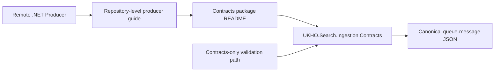

# Implementation Plan

Target output path: `dev/work-packages/104-producer-guidance-compatibility-rules/plan-ingestion-producer-guidance-compatibility-rules.md`

Date: 2026-06-30

Based on:
- `dev/work-packages/104-producer-guidance-compatibility-rules/spec-domain-producer-guidance-compatibility-rules.md`
- `./.github/instructions/documentation-pass.instructions.md`
- `./.github/instructions/wiki.instructions.md`

## Canonical Producer Guide Refresh

- [x] Work Item 1: Refresh the canonical package README into the completed Arc 01 producer guide - Completed
  - **Purpose**: Deliver the smallest runnable WP104 slice by turning the existing package README into the final current-state producer guide that explains the completed contracts surface, package boundary, and compatibility expectations in one coherent narrative.
  - **Acceptance Criteria**:
    - `src/UKHO.Search.Ingestion.Contracts/README.md` clearly explains what the package is for, how to use its DTO, helper, serializer, validator, and version-marker surfaces, and which responsibilities remain external.
    - The README explicitly explains queue-submission boundaries, queue naming, authentication, deployment topology, upstream security-token derivation, and journal ownership boundaries.
    - The README explains compatibility rules in current-state terms rather than as partial roadmap notes.
    - All code-writing and source-documentation work complies fully with `./.github/instructions/documentation-pass.instructions.md` where it applies.
  - **Definition of Done**:
    - Canonical producer guidance updated in `src/UKHO.Search.Ingestion.Contracts/README.md`.
    - Documentation updated in the active work package and package-local guidance reflects the final Arc 01 story.
    - Wiki review completed; relevant wiki or repository guidance updated, or an explicit no-change review result recorded.
    - Foundational documentation retains book-like narrative depth, defines technical terms, and includes examples or walkthrough support where the subject matter is conceptually dense.
    - Can execute end-to-end via: a producer-facing README review plus the focused contracts-package validation path.
  - [x] Task 1: Reframe the README as the final canonical producer guide - Completed
    - [x] Step 1: Rewrite or expand the README so it reads as the completed Arc 01 producer story rather than as an implementation-adjacent package note.
    - [x] Step 2: Explain the completed DTO, helper, builder, serializer, validator, and contract-version-marker surfaces in a sequence that teaches a producer how to approach the package.
    - [x] Step 3: Define technical terms where they materially help a new contributor or producer understand the package boundary.
  - [x] Task 2: Make package boundaries and compatibility rules explicit in the README - Completed
    - [x] Step 1: Explain that queue submission helpers are an optional future package concern rather than part of `UKHO.Search.Ingestion.Contracts`.
    - [x] Step 2: Explain that queue naming, provider selection, authentication, deployment topology, and security-token derivation remain external concerns.
    - [x] Step 3: Explain that producers provide queue-message data only and do not own journal identity, dead-letter, supersession, or replay metadata.
    - [x] Step 4: Explain what kinds of future changes would count as deliberate contract changes to the package or wire format.
  - **Files**:
    - `src/UKHO.Search.Ingestion.Contracts/README.md`: canonical producer-facing guide.
    - `dev/work-packages/104-producer-guidance-compatibility-rules/*`: execution record updates during implementation.
  - **Work Item Dependencies**: relies on the completed WP100-WP103 package surface.
  - **Run / Verification Instructions**:
    - Review `src/UKHO.Search.Ingestion.Contracts/README.md` alongside the implemented contracts package
    - `dotnet test test/UKHO.Search.Ingestion.Contracts.Tests/UKHO.Search.Ingestion.Contracts.Tests.csproj`
  - **User Instructions**: No manual setup expected.
  - **Implementation Summary**:
    - Refreshed `src/UKHO.Search.Ingestion.Contracts/README.md` into the final Arc 01 canonical producer guide, expanding the package boundary explanation, adding a practical producer workflow, clarifying which entry points to use, and documenting the compatibility-sensitive parts of the contracts surface.
    - Made package boundaries explicit in current-state terms, including queue submission, queue naming, provider selection, authentication, deployment topology, upstream security-token derivation, and journal ownership boundaries.
    - Validation performed: `dotnet test test/UKHO.Search.Ingestion.Contracts.Tests/UKHO.Search.Ingestion.Contracts.Tests.csproj` succeeded with 18 passing tests.
    - Wiki review result: No wiki page update was required for this first documentation slice. Reviewed `wiki/Solution-Architecture.md` and `wiki/Architecture-Walkthrough.md`; the package README is the canonical producer guide, and the repository-level producer framing page is delivered in the next work item.

## Repository-Level Producer Guide

- [x] Work Item 2: Add the repository-level producer guide page that frames how external producers should approach the package - Completed
  - **Purpose**: Deliver the second documentation slice by adding a repository-level producer guide that teaches the wider package boundary, points readers at the canonical README, and clarifies how external producers should think about transport, topology, and compatibility responsibilities.
  - **Acceptance Criteria**:
    - A repository-level producer guide page exists and points readers back to `src/UKHO.Search.Ingestion.Contracts/README.md` as the canonical package guide.
    - The page explains where the contracts package sits in the wider Search architecture and what external producers still need to solve outside the package.
    - The page distinguishes package-owned authoring and validation concerns from optional future queue-submission package concerns.
    - The page uses current-state, book-like narrative prose rather than terse bullet-only treatment.
  - **Definition of Done**:
    - Repository-level producer guide page added or updated.
    - Links between the repository-level guide and the canonical package README are clear in both directions where appropriate.
    - Wiki review completed; relevant wiki or repository guidance updated, or an explicit no-change review result recorded.
    - Foundational documentation retains book-like narrative depth, defines technical terms, and includes examples or walkthrough support where the subject matter is conceptually dense.
    - Can execute end-to-end via: repository-level guide review plus link verification against the package README.
  - [x] Task 1: Add the repository-level framing guide - Completed
    - [x] Step 1: Choose the repository-level page location consistent with current documentation patterns for producer- or contributor-facing guidance.
    - [x] Step 2: Explain what `UKHO.Search.Ingestion.Contracts` is, when an external producer should use it, and what it deliberately does not solve.
    - [x] Step 3: Explain how the package fits into the wider Search architecture without turning the page into a generic architecture duplicate.
  - [x] Task 2: Connect the repository guide to the canonical package guide - Completed
    - [x] Step 1: Link the repository-level guide to `src/UKHO.Search.Ingestion.Contracts/README.md` as the canonical API- and usage-adjacent reference.
    - [x] Step 2: Update the package README if needed so readers can discover the repository-level framing page from the package side.
    - [x] Step 3: Keep both documents aligned on current-state package boundaries and compatibility language.
  - **Files**:
    - repository-level producer guide page under the chosen documentation path.
    - `src/UKHO.Search.Ingestion.Contracts/README.md`: cross-link updates if needed.
  - **Work Item Dependencies**: Work Item 1.
  - **Run / Verification Instructions**:
    - Review the repository-level guide and confirm it links cleanly to `src/UKHO.Search.Ingestion.Contracts/README.md`
    - `dotnet test test/UKHO.Search.Ingestion.Contracts.Tests/UKHO.Search.Ingestion.Contracts.Tests.csproj`
  - **User Instructions**: No manual setup expected.
  - **Implementation Summary**:
    - Added the repository-level producer framing page at `wiki/Remote-Ingestion-Producer-Guide.md`, explaining where `UKHO.Search.Ingestion.Contracts` sits in the wider Search architecture, which responsibilities remain outside the package, and how producers should think about transport, topology, security-token derivation, and compatibility.
    - Kept the page intentionally framed around the package boundary rather than turning it into a duplicate of the canonical package README, while linking readers back to `src/UKHO.Search.Ingestion.Contracts/README.md` for the concrete package-adjacent usage story.
    - Validation performed: `dotnet test test/UKHO.Search.Ingestion.Contracts.Tests/UKHO.Search.Ingestion.Contracts.Tests.csproj` succeeded with 18 passing tests.
    - Wiki review result: Updated `wiki/Remote-Ingestion-Producer-Guide.md` as the repository-level producer guide page required by the spec. No additional wiki page update was required at this step because the new page itself is the primary repository-level guidance change.

## External-Consumer Validation Path

- [x] Work Item 3: Add the minimal external-consumer-style validation path for the final Arc 01 contract story - Completed
  - **Purpose**: Close the producer story with an executable proof that a consumer referencing only the contracts package can create and serialize `IndexItem`, `DeleteItem`, and `UpdateAcl` messages through the final surface.
  - **Acceptance Criteria**:
    - A minimal external-consumer-style sample or test path references only `UKHO.Search.Ingestion.Contracts`.
    - The path proves that `IndexItem`, `DeleteItem`, and `UpdateAcl` can each be created and serialized correctly.
    - The path remains focused on contracts-package usage and does not introduce transport or runtime dependencies.
    - All code-writing work complies fully with `./.github/instructions/documentation-pass.instructions.md`.
  - **Definition of Done**:
    - External-consumer-style validation path implemented.
    - Any new or changed test or sample code is fully commented in line with `./.github/instructions/documentation-pass.instructions.md`, including type comments, method comments, constructor comments where relevant, parameter comments where practical, and developer-level flow comments.
    - Focused validation passes for the external-consumer-style sample/test path and the contracts test project.
    - Wiki review completed; relevant wiki or repository guidance updated, or an explicit no-change review result recorded.
    - Foundational documentation retains book-like narrative depth, defines technical terms, and includes examples or walkthrough support where the subject matter is conceptually dense.
    - Can execute end-to-end via the focused contracts-package validation commands documented in the work package.
  - [x] Task 1: Add the focused external-consumer-style sample or test path - Completed
    - [x] Step 1: Implement the smallest possible contracts-only sample or test that creates `DeleteItem`, `UpdateAcl`, and `IndexItem` messages through the final package surface.
    - [x] Step 2: Serialize each message through the canonical package serializer path.
    - [x] Step 3: Keep the validation path free of runtime, queue, provider, or infrastructure dependencies.
  - [x] Task 2: Validate the path against the documented guidance - Completed
    - [x] Step 1: Confirm the sample or test still reflects the producer entry points recommended in the README and repository-level guide.
    - [x] Step 2: Run the contracts test project and any focused sample/test command required by the new validation path.
    - [x] Step 3: Update the active work package record with the final validation outcome.
  - **Files**:
    - `test/UKHO.Search.Ingestion.Contracts.Tests/*` or another focused contracts-only validation location consistent with the existing package test strategy.
    - `src/UKHO.Search.Ingestion.Contracts/README.md`: align examples if the validation path reveals a needed documentation adjustment.
    - repository-level producer guide page: align examples or command references if needed.
  - **Work Item Dependencies**: Work Item 1, Work Item 2.
  - **Run / Verification Instructions**:
    - `dotnet test test/UKHO.Search.Ingestion.Contracts.Tests/UKHO.Search.Ingestion.Contracts.Tests.csproj`
    - any additional focused sample/test command added by the implementation
  - **User Instructions**: No manual setup expected.
  - **Implementation Summary**:
    - Added `test/UKHO.Search.Ingestion.Contracts.Tests/ExternalConsumerContractUsageTests.cs` as the minimal contracts-only validation path proving that `DeleteItem`, `UpdateAcl`, and `IndexItem` can each be created and serialized through the final package surface without any runtime or infrastructure dependency.
    - Kept the validation path aligned with the producer entry points documented in the canonical README and repository-level producer guide by using the final factory, builder, serializer, and helper surface directly.
    - Validation performed: `dotnet test test/UKHO.Search.Ingestion.Contracts.Tests/UKHO.Search.Ingestion.Contracts.Tests.csproj` succeeded with 21 passing tests.
    - Wiki review result: No additional wiki page update was required for this slice because the new external-consumer-style validation path supports the producer guidance already added in the README and repository-level producer guide rather than introducing a new contributor-facing concept.

## Wiki Review And Work Package Closure

- [x] Work Item 4: Complete the mandatory wiki review for the full WP104 producer-guidance work package - Completed
  - **Purpose**: Satisfy `./.github/instructions/wiki.instructions.md` by reviewing whether the final producer guidance, compatibility rules, and repository-level producer guide change contributor-facing architecture, workflow, or terminology guidance.
  - **Acceptance Criteria**:
    - The implementation explicitly reviews the wiki and repository guidance most likely to be affected by the final producer-story closeout.
    - Any required wiki or repository guidance updates are made before the work package is closed.
    - If no updates are required for a reviewed page, the execution record states which pages were reviewed and why they remained sufficient.
  - **Definition of Done**:
    - Wiki review outcome recorded explicitly.
    - Relevant wiki or repository guidance updated, created, or intentionally left unchanged with a concrete explanation.
    - Foundational documentation retains book-like narrative depth, defines technical terms, and includes examples or walkthrough support where the subject matter is conceptually dense.
    - Can execute end-to-end via: a final work package record that cites the reviewed pages and resulting updates or no-change decisions.
  - [x] Task 1: Review likely affected wiki and repository guidance - Completed
    - [x] Step 1: Review `wiki/Solution-Architecture.md` and `wiki/Architecture-Walkthrough.md` for any wording that should now point contributors more clearly at the final producer-story guidance.
    - [x] Step 2: Review any repository-level documentation paths chosen for the producer guide so links and current-state boundaries are coherent.
    - [x] Step 3: Review `src/UKHO.Search.Ingestion.Contracts/README.md` to ensure it remains the canonical producer guide after WP104 closes Arc 01.
  - [x] Task 2: Record and apply the outcome - Completed
    - [x] Step 1: Update any affected wiki or repository guidance pages before marking the work package complete.
    - [x] Step 2: Record explicit no-change results for reviewed pages that remain sufficient.
    - [x] Step 3: Ensure the final execution record names the updated, created, or unchanged pages directly.
  - **Files**:
    - `wiki/Solution-Architecture.md`: update if the final producer-story reading path needs clearer architectural signposting.
    - `wiki/Architecture-Walkthrough.md`: update if the code-reading path should now point to the final producer guide more directly.
    - repository-level producer guide page: final review or update.
    - `src/UKHO.Search.Ingestion.Contracts/README.md`: final review or update.
  - **Work Item Dependencies**: Work Item 1, Work Item 2, Work Item 3.
  - **Run / Verification Instructions**:
    - Review the listed wiki and repository guidance pages alongside the final implemented producer-story slice
    - Confirm the final execution record contains an explicit wiki review result
  - **User Instructions**: No manual setup expected.
  - **Implementation Summary**:
    - Reviewed `wiki/Home.md`, `wiki/Solution-Architecture.md`, `wiki/Architecture-Walkthrough.md`, `wiki/Remote-Ingestion-Producer-Guide.md`, and `src/UKHO.Search.Ingestion.Contracts/README.md` against the final WP104 implementation.
    - Updated `wiki/Remote-Ingestion-Producer-Guide.md` as the repository-level producer guide page, and updated `wiki/Home.md`, `wiki/Solution-Architecture.md`, and `wiki/Architecture-Walkthrough.md` so contributors can discover that guide from the existing wiki reading paths.
    - Left `wiki/Ingestion-Walkthrough.md` and `wiki/Ingestion-Service-Provider-Mechanism.md` unchanged because WP104 did not alter runtime flow or provider execution boundaries; it clarified the producer-story guidance around the already-delivered contracts package surface.
    - Final validation performed: `dotnet test test/UKHO.Search.Ingestion.Contracts.Tests/UKHO.Search.Ingestion.Contracts.Tests.csproj` succeeded with 21 passing tests. A broader `dotnet build Search.slnx` and `dotnet test Search.slnx` attempt surfaced a pre-existing unrelated restore failure in `test/IngestionServiceHost.Tests/IngestionServiceHost.Tests.csproj` due to a `Microsoft.Extensions.Logging.Abstractions` package downgrade from 10.0.8 to 10.0.5, alongside pre-existing vulnerability warnings across the solution.
    - Wiki review result: Updated `wiki/Remote-Ingestion-Producer-Guide.md`, `wiki/Home.md`, `wiki/Solution-Architecture.md`, and `wiki/Architecture-Walkthrough.md`; reviewed `wiki/Ingestion-Walkthrough.md`, `wiki/Ingestion-Service-Provider-Mechanism.md`, and `src/UKHO.Search.Ingestion.Contracts/README.md` with explicit no-change decisions.

## Summary / Key Considerations

- The plan keeps WP104 focused on the remaining Arc 01 gap: turning the completed contracts package surface into the final producer story and compatibility guide rather than adding more runtime or package behavior.
- The first slice refreshes the package README as the canonical current-state producer guide.
- The second slice adds the repository-level framing guide that points readers back to the canonical README.
- The third slice closes the loop with a minimal contracts-only external-consumer validation path.
- `./.github/instructions/documentation-pass.instructions.md` remains a hard gate for any code or source-documentation updates, and `./.github/instructions/wiki.instructions.md` remains a mandatory completion gate for the work package closeout.

# Architecture

## Overall Technical Approach

WP104 is a documentation-and-validation closeout work package. The technical surface it describes already exists: `UKHO.Search.Ingestion.Contracts` owns the queue-message DTOs, helper APIs, serializer facade, validator, and version marker. The purpose of WP104 is to make that surface teachable, navigable, and maintainable for remote producers and for future maintainers evolving the package.

The approach is deliberately layered. The package README remains the canonical guide closest to the package itself, because that is where a producer who already has the package in hand will naturally look first. A repository-level producer guide then frames the package in the wider Search architecture, explains which responsibilities remain outside the package, and points readers back to the canonical README for the concrete API and usage story.

The intended shape after WP104 is:

The producer story succeeds when a remote .NET consumer can understand what the package is for, how to use it, what it does not do, and how compatibility should be interpreted, all without needing to reverse-engineer that story from work-package history.

## Frontend

No frontend or Blazor feature is introduced by WP104.

The only user-facing effect is documentation for developers and producers. The work package improves how contributors and external .NET producers learn the package surface, not how any interactive UI behaves.

## Backend

The backend impact is focused on the contracts package documentation and its contracts-only validation path.

Current state before WP104:
- the contracts package already exposes DTOs, helpers, serializer, validator, and a version marker
- the package README already contains substantial guidance
- the final Arc 01 producer story and compatibility rules are still distributed across code, README text, and work package history

Target state after WP104:
- the package README is the final canonical producer guide
- a repository-level producer guide frames how the package sits inside the wider Search architecture and points readers back to the README
- a minimal contracts-only validation path proves the final producer entry points for `IndexItem`, `DeleteItem`, and `UpdateAcl`
- compatibility rules are written down explicitly so future changes can be judged against the published contract story

The key architectural rule is that WP104 does not expand package responsibility. It closes the explanation gap around the already delivered package surface while preserving the strong boundary between message authoring and all external concerns such as queue transport, authentication, topology, token derivation, and journal behavior.