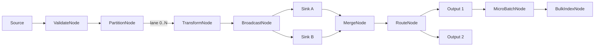

# Architecture

> Work package: `docs/002-pipeline-playground`

## Overall Technical Approach
The pipeline playground is a **Domain-layer**, in-process, channel-based messaging pipeline built around:
- bounded channels for backpressure
- node loops for transform/route/merge/broadcast
- supervision + fault propagation
- message-scoped failures (dead-letter) vs fatal faults
- retry + per-lane ordering constraints
- micro-batching
- metrics via `System.Diagnostics.Metrics`

As this is a library-style Domain capability, the primary “runnable” surface is via **tests** (and any existing host/sample wiring already present in the repository).

### Conceptual topology

### Cross-cutting concerns
- **Cancellation**: a unified `CancellationMode` applied by base node types and buffering nodes.
- **Error handling**: message-scoped errors go to dead-letter; fatal faults propagate via supervision.
- **Ordering**: maintained within lanes; merge explicitly does not guarantee global order.
- **Observability**: metrics including throughput, failures, retries, and queue depth (where measurable).

## Frontend
No frontend is in scope for the pipeline playground work package.

## Backend
### Domain
Primary components live under:
- `src/UKHO.Search/Pipelines/Messaging/*`: envelope, channels, pipeline wiring utilities
- `src/UKHO.Search/Pipelines/Nodes/*`: node implementations (existing + `BroadcastNode`, `MergeNode`, `RouteNode`, `BulkIndexNode`)
- `src/UKHO.Search/Pipelines/Supervision/*`: fault propagation and supervision
- `src/UKHO.Search/Pipelines/Retry/*`: retry policies and retry node(s)
- `src/UKHO.Search/Pipelines/Batching/*`: micro-batching and batch envelopes
- `src/UKHO.Search/Pipelines/Metrics/*`: meters and metric providers

Key architectural pattern:
- Nodes are independent processing loops connected by channels.
- Node base types establish consistent lifecycle, completion propagation, cancellation, and fault semantics.

### Tests
- `test/UKHO.Search.Tests/Pipelines/*`: integration-focused tests that exercise end-to-end behavior for each node (backpressure, completion, faulting, retry, batching, metrics).

### External dependencies
- None required for most work items.
- `BulkIndexNode<TDocument>` is designed to depend on an abstraction (`IBulkIndexClient`) so tests can run against a deterministic test double without external services.
