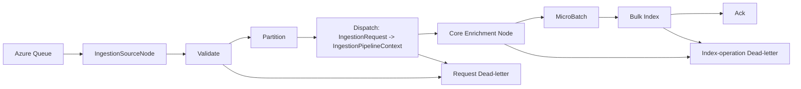

# Architecture

Work Package folder: `docs/007-enrichment/`

## Overall Technical Approach
This change introduces an enrichment stage into the ingestion pipeline before Elasticsearch bulk indexing.

Key ideas:
- Enrichment is provider-extensible via DI multi-registration of `IIngestionEnricher`.
- Enrichers mutate the in-flight `CanonicalDocument` on `UpsertOperation` only.
- Enrichment is deterministic (ordered by `Ordinal`, then `Type.FullName`) and resilient (configurable retry for transient failures).
- Failures that cannot be recovered are treated as transform errors and routed to the index-operation dead-letter sink.

### Ingestion flow (high-level)

### Component responsibilities
- **Domain (`UKHO.Search.Ingestion`)**
  - Defines the enrichment contract `IIngestionEnricher`.
  - Defines `IngestionPipelineContext` payload (request + operation).
  - Hosts the core enrichment node that executes enrichers with ordering + retry.

- **Provider (`UKHO.Search.Ingestion.Providers.FileShare`)**
  - Implements file-share-specific enrichers (initially no-op):
    - `FileContentEnricher` (`Ordinal=100`)
    - `ExchangeSetEnricher` (`Ordinal=200`)
    - `GeoLocationEnricher` (`Ordinal=300`)
  - Provides provider-owned DI registration entrypoint `AddFileShareProvider(IServiceCollection)`.
  - Updates the file share ingestion graph to produce `IngestionPipelineContext` and include the core enrichment node.

- **Infrastructure (`UKHO.Search.Infrastructure.Ingestion`)**
  - Remains the central DI composition root for ingestion services (`AddIngestionServices`).
  - Calls `services.AddFileShareProvider()`.
  - Builds the queue-backed ingestion pipeline (hosted service + adapter), wiring in sinks for diagnostics, acking, and dead-letter.

## Frontend
No dedicated frontend is introduced as part of this spec.

Notes:
- The repository contains a Blazor-based FileShare emulator/tooling, which can be used for manual end-to-end verification (enqueue ingestion requests and observe indexing), but the enrichment feature itself is backend-only.

## Backend
### Domain contracts
- `IIngestionEnricher` lives in `UKHO.Search.Ingestion` and is provider-agnostic.
- `IngestionPipelineContext` lives in `UKHO.Search.Ingestion.Pipeline` and ensures enrichers can access both:
  - the original `IngestionRequest`
  - the derived `IndexOperation` (and `CanonicalDocument` for upserts)

### Pipeline node behaviour
- The enrichment node:
  - reads `Envelope<IngestionPipelineContext>`
  - for upserts, executes all `IIngestionEnricher` instances in deterministic order
  - uses an exponential backoff retry policy for whitelisted transient exceptions
  - on unrecoverable failure, marks the envelope with a `Transform` error and routes to index dead-letter

### Configuration
Under `ingestion:` (per environment block):
- `enrichmentRetryMaxAttempts` (default `5`)
- `enrichmentRetryBaseDelayMilliseconds` (default `200`)
- `enrichmentRetryMaxDelayMilliseconds` (default `5000`)
- `enrichmentRetryJitterMilliseconds` (default `250`)

### Error handling
- Non-transient exceptions and exhausted transient retries prevent bulk indexing for that item.
- Failures are routed to the existing index-operation dead-letter path.

### Testing strategy
- Unit tests in `test/UKHO.Search.Ingestion.Tests` validate:
  - deterministic ordering (including tie-break)
  - correct retry classification and behaviour
  - correct routing to dead-letter and non-propagation to bulk indexing
  - preservation of envelope metadata through payload transforms
