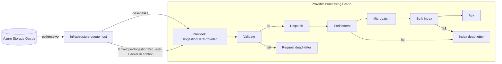

# Architecture

## Overall Technical Approach
This uplift refactors ingestion startup and ownership boundaries so that:
- **Infrastructure** owns **queue lifecycle + polling** (create queue, poison handling, visibility renewal).
- **Providers** own **request processing** (long-lived processing graph) and expose `ProcessIngestionRequestAsync(Envelope<IngestionRequest>, ct)`.

Key contracts:
- `IIngestionDataProviderFactory.QueueName` determines which queue Infrastructure polls.
- `IIngestionDataProvider.ProcessIngestionRequestAsync(...)` is the provider entrypoint.

### High-level data flow

## Frontend
No frontend changes.

## Backend
### Infrastructure (`UKHO.Search.Infrastructure.Ingestion`)
Responsibilities:
- Enumerate provider factories.
- For each factory:
  - Ensure queue + poison queue exist.
  - Receive messages, apply poison rules.
  - Create a queue acker and attach it to `Envelope.Context`.
  - Deserialize the message text to `IngestionRequest` using the provider.
  - Invoke `provider.ProcessIngestionRequestAsync(envelope, ct)`.

Key components:
- Queue host/poller (currently `IngestionSourceNode`, to be refactored to call provider processing rather than writing to a pipeline output channel).
- Queue client factory and poison handling remain infrastructure-owned.

### Provider (`UKHO.Search.Ingestion.Providers.FileShare`)
Responsibilities:
- Own the long-lived processing graph for the provider.
- Implement `ProcessIngestionRequestAsync(...)` by enqueuing the envelope into the graph ingress.
- Configure the processing pipeline stages (validate/dispatch/enrich/batch/index/ack/dead-letter).

Notes:
- Providers do not create or manage queues.
- Providers preserve envelope context so downstream ack/dead-letter can use the queue acker.
