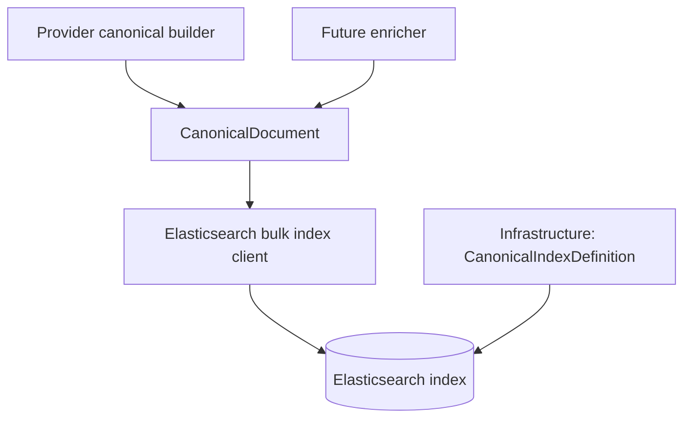

# Architecture

Work Package: `docs/011-canonical-document/`

Spec: `docs/011-canonical-document/spec-canonical-document-model-and-index_v0.02.md`

## Overall Technical Approach
This uplift is a small, provider-agnostic extension of the canonical indexing model:
- Domain model `CanonicalDocument` gains a new enrichment-owned field `Content`.
- Infrastructure-owned Elasticsearch index definition (`CanonicalIndexDefinition`) is extended to map `content` as analyzed English text, consistent with `searchText`.
- Providers remain responsible only for building the minimal canonical document; enrichers (future work) will populate `Content`.

## Frontend
No change.

This work package does not introduce or modify any Blazor UI flows.

## Backend
### Domain
- `src/UKHO.Search.Ingestion/Pipeline/Documents/CanonicalDocument.cs`
  - Add `Content` with set-then-append semantics aligned with `SearchText`.
  - Normalization remains domain-owned (lowercase invariant), keeping indexing/query behaviour consistent.

### Infrastructure
- `src/UKHO.Search.Infrastructure.Ingestion/Elastic/CanonicalIndexDefinition.cs`
  - Extend mapping to include `content` as `text` with English analysis (same approach as `searchText`).

### Testing
- Domain tests:
  - Add `CanonicalDocumentContentTests` for normalization + deterministic append behaviour.
  - Extend JSON round-trip tests to include `Content`.
- Infrastructure tests:
  - Extend `CanonicalIndexDefinitionTests` to assert `content` is present with the correct mapping.

## Local smoke verification (manual)
### Prerequisites
- Docker is running (Aspire/AppHost launches Elasticsearch/Kibana + dependencies).

### 1) Run AppHost
From the repository root:
- `dotnet run --project src/Hosts/AppHost/AppHost.csproj`

### 2) Confirm the index mapping contains `content`
1. Determine the canonical index name from configuration key `ingestion:indexname` (as used by `BootstrapService`).
2. In Kibana Dev Tools, run:
   - `GET <indexName>/_mapping`
3. Confirm the returned mapping includes:
   - `properties.content.type == "text"`
   - `properties.content.analyzer == "english"`

If you prefer HTTP, you can use `curl` (adjust index name and credentials as needed):
- `curl -u elastic:<elastic-password> http://localhost:9200/<indexName>/_mapping?pretty`

### 3) Index a sample document via the FileShareEmulator flow
1. Use the existing FileShareEmulator UI/flow to enqueue a batch for ingestion (this sends messages to the `file-share-queue`).
2. Confirm ingestion/indexing completes without mapping errors (check the ingestion host logs).
3. Optionally validate documents are present:
   - `GET <indexName>/_count`
   - `GET <indexName>/_search?size=1`
