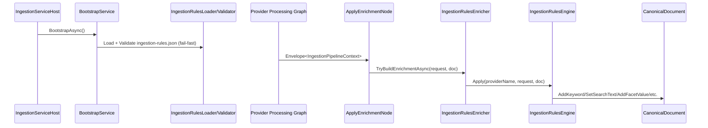

# Architecture

Work Package: `docs/012-ingestion-rules/`

## Overall Technical Approach

- Implement a provider-agnostic, rules-based enrichment engine in `UKHO.Search.Infrastructure.Ingestion`.
- Load and validate `ingestion-rules.json` at ingestion host startup (fail-fast) and compile it into an immutable in-memory catalog.
- Execute rule evaluation during ingestion enrichment via the existing `IIngestionEnricher` pipeline integration.
- Keep domain model unchanged where possible; reuse existing `CanonicalDocument` mutation APIs.

### High-level flow

```mermaid
flowchart LR
    Queue[Azure Queue message] --> Provider[Provider processing graph]
    Provider --> Dispatch[Dispatch: IngestionRequest -> UpsertOperation + CanonicalDocument]
    Dispatch --> Enrich[ApplyEnrichmentNode]
    Enrich --> Enricher[IIngestionEnricher(s)]
    Enricher --> RulesEnricher[IngestionRulesEnricher]
    RulesEnricher --> Engine[IngestionRulesEngine]
    Engine --> Doc[CanonicalDocument mutations]
    Doc --> Index[Index pipeline]
```

### Components

- `IngestionRulesLoader`
  - Reads `src/Hosts/IngestionServiceHost/ingestion-rules.json` at startup.
  - Parses with `System.Text.Json`.
- `IngestionRulesValidator`
  - Validates schema version, required fields, predicate shapes, action shapes, path syntax, and scalar-safety for `documentType.set`.
  - Fail-fast: throws on any validation error.
- `IngestionRulesCatalog`
  - Immutable compiled representation of rules indexed by provider name.
- `IngestionRulesEngine`
  - API: `Apply(providerName, request, document)`.
  - Selects active payload (`AddItem` or `UpdateItem`).
  - Evaluates predicates and applies actions for all matching rules in file order.
  - Emits required per-request debug logging.
- `IngestionRulesEnricher`
  - Implements `IIngestionEnricher` and delegates to `IngestionRulesEngine`.

### Provider scoping mechanism

- Each provider processing graph already has a `providerName` passed into nodes.
- `ApplyEnrichmentNode` sets a scoped `IIngestionProviderContext.ProviderName` before invoking enrichers.
- `IngestionRulesEnricher` reads that provider name and applies only rules for that provider.

## Frontend

- Not applicable. This feature is backend ingestion infrastructure and has no UI requirements.

## Backend

### Host startup

- `IngestionServiceHost` includes the required `ingestion-rules.json` file and copies it to output.
- `BootstrapService.BootstrapAsync()` forces rules load/validation and logs the loaded providers/rule IDs.

### Rule evaluation



### Path evaluation & safety

- A small path language is parsed/validated at startup.
- Runtime resolution is reflection-based (case-insensitive), with wildcard-only enumeration (`[*]`).
- Missing runtime paths are non-fatal: treated as empty/missing values causing non-match.

### Observability

- Startup logs: number of rules per provider + rule IDs.
- Per request debug logs: provider name, matched rule IDs (ordered), and action summary.
