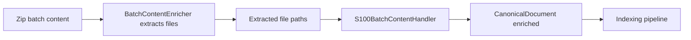

# Architecture

- **Target output path**: `docs/024-s101-parsing/architecture.md`
- **Related spec**: `docs/024-s101-parsing/s101-parsing-spec.md`

## Overall Technical Approach
- This change is an ingestion-enrichment enhancement within the existing FileShare ingestion provider.
- The ingestion pipeline flow (simplified for this work package):

- `S100BatchContentHandler` is responsible for reading the extracted `catalog.xml` and enriching `CanonicalDocument`.
- Parsing uses .NET LINQ-to-XML (`XDocument`, `XNamespace`) with explicit namespace URIs from the catalogue.
- Enrichment follows existing `CanonicalDocument` APIs (`AddSearchText`, `AddKeyword`, `AddGeoPolygon`) which normalize search tokens to lowercase.

## Frontend
- No frontend changes.

## Backend
- **Provider project**: `src/UKHO.Search.Ingestion.Providers.FileShare`
  - `Enrichment/Handlers/S100BatchContentHandler.cs`
    - Loads and parses `catalog.xml`.
    - Gated to S-101 only using `XC:productSpecification/XC:name`.
    - Extracts organisation name and comment into `CanonicalDocument.SearchText`.
    - Adds S-101 tokens into `CanonicalDocument.Keywords`.
    - Extracts geometry from `gml:posList` and writes to `CanonicalDocument.GeoPolygons`.

- **Domain types used**:
  - `src/UKHO.Search.Ingestion/Pipeline/Documents/CanonicalDocument.cs`
  - `src/UKHO.Search/Geo/GeoPolygon.cs`, `src/UKHO.Search/Geo/GeoCoordinate.cs`

- **Testing**:
  - `test/UKHO.Search.Ingestion.Tests`
    - Unit tests validate end-to-end handler behaviour using a verbatim copy of `test/sample-data/s101-CATALOG.XML`.

Data flow details
- Input: extracted path list including `catalog.xml`.
- Output: `CanonicalDocument` enriched with:
  - Keywords (`s-101`, `s101`)
  - SearchText (organisation + exchange catalogue comment)
  - GeoPolygons (EPSG:4326 WGS-84, `lat lon` pairs converted to `GeoCoordinate(lon, lat)`).
