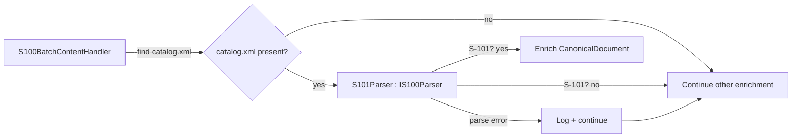

# Architecture

## Overall Technical Approach
- Refactor-only change within the existing ingestion provider codebase: extract S-101-specific `catalog.xml` parsing/enrichment responsibilities out of `S100BatchContentHandler` into a dedicated internal parser class.
- Introduce a minimal internal `IS100Parser` interface implemented by `S101Parser` to formalize the delegation point without introducing DI or a plugin model.
- Preserve existing behaviour (XML namespaces, schema mapping, enrichment rules) and resilience (log + continue on parse errors, do not fail the enrichment step).

## Frontend
- Not applicable. This work package affects backend ingestion/enrichment only.

## Backend
- **Location**: File-share ingestion provider project (where `S100BatchContentHandler` currently lives).
- **Key components**:
  - `S100BatchContentHandler`
    - Continues to orchestrate extracted batch scanning to locate/select `catalog.xml`.
    - Delegates S-101-specific parsing/enrichment to `S101Parser`.
    - Maintains the pipeline’s resilience: exceptions from parsing (excluding cancellation) are handled such that enrichment continues.
  - `IS100Parser` (internal)
    - A small interface aligned to the handler’s needs; expected to accept the `catalog.xml` path (or stream/content) and a target `CanonicalDocument` to mutate.
    - Returns either `bool` to indicate whether enrichment was applied, or `void` with best-effort semantics.
  - `S101Parser` (internal)
    - Owns: XML loading/parsing, S-101 product spec gating, and enrichment mapping of parsed values into `CanonicalDocument`.
    - Owns error handling around XML/geometry parsing (log + continue). Cancellation is not swallowed.

- **Instantiation model (no DI)**:
  - `S100BatchContentHandler` creates `S101Parser` via `new` (e.g., once per handler invocation), satisfying the “lightweight helper” intent and avoiding service registration.

- **Testing strategy**:
  - Tests assert observable outcomes on `CanonicalDocument` when a `catalog.xml` is present.
  - Minimum cases: S-101 enriches expected fields; non S-101 does not enrich; invalid polygon data is handled without failing the enrichment step.
