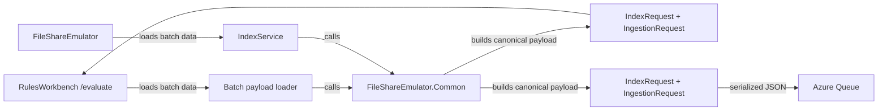

# Architecture

Work package: `docs/035-fsemualator-common/`

## Overall Technical Approach

Introduce a shared library `tools/FileShareEmulator.Common` that becomes the **single source of truth** for:

- Canonical ingestion payload creation (`IngestionRequest` + `IndexRequest`)
- Strict `SecurityTokens` policy enforcement

Both tools (`FileShareEmulator` and `RulesWorkbench`) will reference this library and must not duplicate token or payload creation logic.

### Data flow (high-level)

### Canonical token policy

`FileShareEmulator.Common` enforces that `SecurityTokens` contains **only**:

- `batchcreate`
- `batchcreate_{businessUnitName}` (only when BU is active and non-empty after normalization)
- `public`

No other tokens are permitted.

## Frontend

- No new frontend components are required.
- Existing `RulesWorkbench` UI continues to display the evaluation payload; it will now be built using the shared canonical builder.

User flow:

1. User opens `RulesWorkbench`.
2. Navigates to `/evaluate`.
3. Loads a batch.
4. UI displays the canonical payload and evaluates rules against it.

## Backend

### `tools/RulesWorkbench`

- `BatchPayloadLoader` remains responsible for loading batch-related data from DB.
- It must delegate payload construction and token generation to `FileShareEmulator.Common`.

### `tools/FileShareEmulator`

- `IndexService` remains responsible for selecting batches to index and sending messages to the queue.
- It must delegate ingestion payload construction and token generation to `FileShareEmulator.Common`.

### `tools/FileShareEmulator.Common`

- Contains the canonical payload builder.
- Contains the strict token policy (including normalization and “active BU only” behavior).

### Testing

- `test/FileShareEmulator.Common.Tests` validates the token policy and payload generation.
- Tests should prefer strict equality checks (exact allowed token set) and deterministic serialization.
