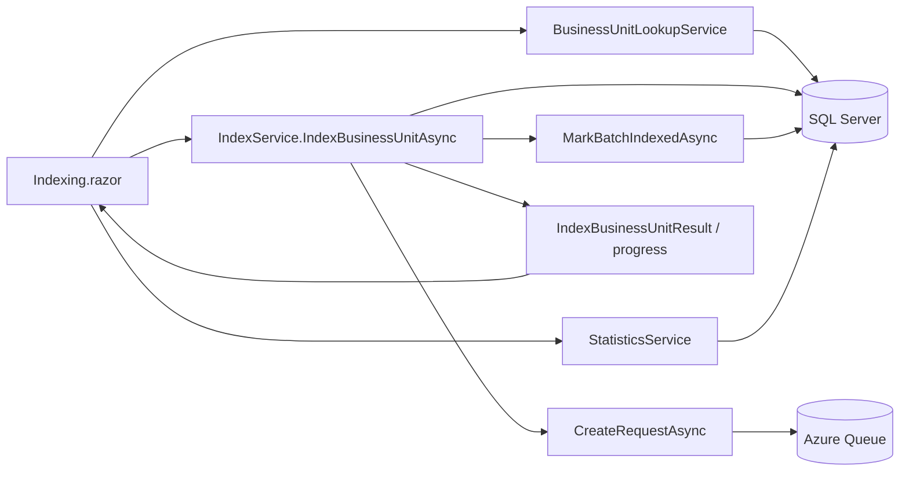

# Implementation Plan

**Target output path:** `./docs/048-emulator-index-bu/plan.md`

**Based on:** `docs/048-emulator-index-bu/spec.md`

## Baseline
- `tools/FileShareEmulator/Components/Pages/Indexing.razor` already provides a runnable Blazor Server indexing page with three end-to-end actions:
  - index next pending batches
  - index all pending batches
  - index a specific batch by id
- `tools/FileShareEmulator/Services/IndexService.cs` already owns the queue submission flow and `IndexStatus` update behavior for pending batch indexing.
- `tools/FileShareEmulator/Program.cs` already wires the existing emulator services and SQL / queue clients.
- `tools/RulesWorkbench/Services/BusinessUnitLookupService.cs` already contains the SQL query pattern for listing all rows from `BusinessUnit` as `Name` + `Id` options.
- The indexing page already polls `StatisticsService` so top-level counts can refresh, and it already has an established inline success/failure message pattern in the `Index batch by id`, queue-clear, and delete-index sections.

## Delta
- Add a new `Index batch by business unit` section to `tools/FileShareEmulator/Components/Pages/Indexing.razor`.
- Copy the existing RulesWorkbench business-unit lookup logic into `tools/FileShareEmulator` and register it in the emulator host.
- Extend `IndexService` with a business-unit-driven indexing path that:
  - selects unindexed batches for one chosen business unit
  - submits each batch using the existing request-building path
  - updates `IndexStatus` in the same way as existing indexing flows
  - returns enough detail for success, zero-results, interim-progress, and partial-failure UI feedback
- Refresh top-page statistics immediately after the action completes, in addition to the current polling loop.
- Add regression coverage for the new emulator services and the business-unit indexing flow.

## Carry-over / Deferred
- Moving shared business-unit lookup logic into `tools/FileShareEmulator.Common`.
- Adding cancellation support for the business-unit indexing action.
- Handling an empty `BusinessUnit` table as a dedicated UX scenario.
- Real-time per-batch progress repainting; periodic progress updates are sufficient for this package.
- Broader emulator UX cleanup outside the new business-unit indexing section.

## Project Structure / Placement
- Blazor UI changes stay in `tools/FileShareEmulator/Components/Pages/*`.
- Emulator-only SQL lookup and indexing orchestration stay in `tools/FileShareEmulator/Services/*`.
- Host registration stays in `tools/FileShareEmulator/Program.cs`.
- New automated tests should live in a dedicated emulator test project under `test/FileShareEmulator.Tests/*` so emulator-specific service behavior is not forced into `FileShareEmulator.Common.Tests`.
- Documentation remains within `docs/048-emulator-index-bu/*`.

## Feature Slice: Business-unit indexing end-to-end

- [x] Work Item 1: Add a runnable business-unit selector and indexing path on the emulator page - Completed
  - **Purpose**: Deliver the smallest useful end-to-end capability where a user can select a business unit and submit all of its unindexed batches to the ingestion queue from the existing indexing page.
  - **Acceptance Criteria**:
    - The indexing page shows a new `Index batch by business unit` section beneath `Index batch by id`.
    - The section loads all business units from the `BusinessUnit` table and renders them as `Name (Id)`.
    - The selector includes a `Select a business unit` placeholder.
    - The `Index Business Unit` button is disabled until a business unit is selected.
    - Clicking the button submits all batches for that business unit where `IndexStatus = 0`.
    - Submitted batches are marked indexed using the same `IndexStatus` behavior as the existing indexing methods.
    - On success, the page shows a message including the business unit name, business unit id, and submitted count.
    - If no unindexed batches exist for the selected business unit, the page shows a non-error message including the selected business unit name and id.
  - **Definition of Done**:
    - UI, service, and host wiring implemented inside the existing emulator project.
    - Error handling and structured logging added for business unit lookup and indexing execution.
    - Service-level automated tests cover business unit lookup and the happy-path / zero-results business-unit indexing outcomes.
    - Documentation updated in this work package if implementation reveals a necessary clarification.
    - Can execute end-to-end via: run `FileShareEmulator`, open `/indexing`, select a business unit, and submit indexing.
  - [x] Task 1.1: Copy the business-unit lookup capability into `FileShareEmulator` - Completed
    - [x] Step 1: Added emulator-local business-unit DTO/result types in `tools/FileShareEmulator/Services/BusinessUnitOptionDto.cs` and `BusinessUnitLookupResultDto.cs`.
    - [x] Step 2: Added `tools/FileShareEmulator/Services/BusinessUnitLookupService.cs` using the same SQL query pattern and ordering as RulesWorkbench.
    - [x] Step 3: Kept the implementation emulator-local inside `tools/FileShareEmulator` and did not extract it into `FileShareEmulator.Common`.
    - [x] Step 4: Registered `BusinessUnitLookupService` in `tools/FileShareEmulator/Program.cs`.
  - [x] Task 1.2: Extend `IndexService` with a business-unit-driven indexing operation - Completed
    - [x] Step 1: Added `tools/FileShareEmulator/Services/IndexBusinessUnitResult.cs` to represent business unit id/name, candidate counts, submitted counts, and failure details.
    - [x] Step 2: Added `IndexBusinessUnitAsync(...)` to `tools/FileShareEmulator/Services/IndexService.cs` to query unindexed batches for a selected business unit.
    - [x] Step 3: Reused `CreateRequestAsync(...)` and `MarkBatchIndexedAsync(...)` rather than duplicating queue submission logic.
    - [x] Step 4: Preserved partial-failure semantics so previously submitted batches remain marked/indexed and are not rolled back.
    - [x] Step 5: Added structured logging for business unit id/name, candidate counts, submitted counts, and failures.
  - [x] Task 1.3: Add the new UI section to `Indexing.razor` - Completed
    - [x] Step 1: Added `@rendermode InteractiveServer` to `tools/FileShareEmulator/Components/Pages/Indexing.razor`.
    - [x] Step 2: Added page state for loaded business units, selected business unit, load error handling, running state, and business-unit-specific messages.
    - [x] Step 3: Added the new `Index batch by business unit` section beneath `Index batch by id` using the existing Radzen layout style.
    - [x] Step 4: Reused the same inline success/failure message color pattern as the existing specific-batch section.
    - [x] Step 5: Kept the selected business unit after completion by preserving the dropdown value.
  - [x] Task 1.4: Add basic regression coverage for slice 1 - Completed
    - [x] Step 1: Created `test/FileShareEmulator.Tests/FileShareEmulator.Tests.csproj` for emulator-specific tests.
    - [x] Step 2: Added `test/FileShareEmulator.Tests/BusinessUnitLookupServiceTests.cs` covering the SQL failure path for business unit loading.
    - [x] Step 3: Added `test/FileShareEmulator.Tests/IndexServiceTests.cs` covering successful submission, zero-results behavior, and invalid business-unit validation.
    - [x] Step 4: Kept the indexing branch logic isolated with delegate-based tests via `IndexService.IndexBusinessUnitBatchesAsync(...)` and `InternalsVisibleTo` support in `tools/FileShareEmulator/Properties/AssemblyInfo.cs`.
  - **Summary (Work Item 1)**:
    - Added emulator-local business-unit lookup contracts/service and registered them in the FileShareEmulator host.
    - Extended `IndexService` with business-unit indexing support and a testable helper for submission/result shaping.
    - Updated `Indexing.razor` with a new selector-driven business-unit indexing section, load-error messaging, and success/zero-results/failure messaging.
    - Added a new `FileShareEmulator.Tests` project with regression coverage for the lookup service and business-unit indexing logic.
    - Verified the slice with `dotnet test test/FileShareEmulator.Tests/FileShareEmulator.Tests.csproj` and a successful workspace build.
  - **Files**:
    - `tools/FileShareEmulator/Components/Pages/Indexing.razor`: Add selector UI, messages, and action wiring.
    - `tools/FileShareEmulator/Program.cs`: Register the new business-unit lookup service.
    - `tools/FileShareEmulator/Services/BusinessUnitLookupService.cs`: New emulator-local business unit lookup service.
    - `tools/FileShareEmulator/Services/BusinessUnitOptionDto.cs`: New selector option contract.
    - `tools/FileShareEmulator/Services/BusinessUnitLookupResultDto.cs`: New lookup result contract.
    - `tools/FileShareEmulator/Services/IndexBusinessUnitResult.cs`: New business-unit indexing result contract.
    - `tools/FileShareEmulator/Services/IndexService.cs`: Add business-unit indexing method.
    - `test/FileShareEmulator.Tests/*`: New emulator service regression coverage.
  - **Work Item Dependencies**: None.
  - **Run / Verification Instructions**:
    - `dotnet run --project tools/FileShareEmulator/FileShareEmulator.csproj`
    - Open the emulator and navigate to `/indexing`.
    - Verify the new selector loads all business units as `Name (Id)`.
    - Select a business unit and click `Index Business Unit`.
    - Verify batches are submitted and the page shows either:
      - success with business unit name/id + submitted count, or
      - a non-error zero-results message with business unit name/id.
  - **User Instructions**:
    - Ensure the emulator database contains business units and batches, as already required by the existing indexing features.

## Feature Slice: Progress, partial-failure reporting, and stats refresh hardening

- [x] Work Item 2: Add progress reporting and resilient completion feedback for longer business-unit runs - Completed
  - **Purpose**: Make the new business-unit indexing flow trustworthy and operator-friendly when a business unit has many unindexed batches or when failures occur after some submissions have already succeeded.
  - **Acceptance Criteria**:
    - While the operation is running, the button text changes to `Indexing Business Unit...`.
    - Interim progress is shown periodically while submissions are processed.
    - Interim progress includes:
      - selected business unit name
      - selected business unit id
      - submitted count
      - total batches to process
    - Partial failures report both the submitted count before failure and the associated error.
    - After completion, the top-page indexing statistics refresh immediately without waiting for the next poll tick.
    - The business-unit indexing section uses the same visual message style as the existing `Index batch by id` section.
  - **Definition of Done**:
    - Progress and partial-failure information flow from `IndexService` to the Blazor page without changing queue semantics.
    - Logging captures both progress milestones and partial-failure summaries.
    - Automated tests cover partial-failure reporting and immediate post-completion state refresh logic where practical.
    - Manual verification confirms long-running runs show progress and final counts consistently.
    - Can execute end-to-end via: run the emulator, trigger a larger business-unit indexing run, observe progress, and verify top statistics refresh immediately at completion.
  - [x] Task 2.1: Extend the service result model to support progress and partial outcomes - Completed
    - [x] Step 1: Introduced a dedicated progress report type in `tools/FileShareEmulator/Services/IndexBusinessUnitProgress.cs` so the UI can consume progress separately from the final result model.
    - [x] Step 2: Used the full pending-batch count up front in `IndexService.IndexBusinessUnitBatchesAsync(...)` so progress can show submitted/total values.
    - [x] Step 3: Added periodic `IProgress<IndexBusinessUnitProgress>` reporting from the service layer using a configurable batch interval without repainting on every batch.
    - [x] Step 4: Kept `IndexBusinessUnitResult` as the final source of truth for success, zero-results, and partial-failure completion.
  - [x] Task 2.2: Wire progress and immediate stats refresh into `Indexing.razor` - Completed
    - [x] Step 1: Added page state for the current business-unit progress message and rendered it in the new indexing section.
    - [x] Step 2: Updated the button text to switch between `Index Business Unit` and `Indexing Business Unit...` while the action is running.
    - [x] Step 3: Added an immediate `StatisticsService` refresh after business-unit indexing completes while preserving the existing polling loop.
    - [x] Step 4: Ensured load errors, progress text, zero-results, success, and partial-failure messages are managed separately so they do not overwrite one another incorrectly.
  - [x] Task 2.3: Harden logging and diagnostics - Completed
    - [x] Step 1: Confirmed business-unit indexing start logs include selected id/name and initial candidate count.
    - [x] Step 2: Added periodic structured progress logs for larger business-unit runs.
    - [x] Step 3: Preserved partial-failure logging with submitted count before failure and exception detail.
    - [x] Step 4: Kept logs concise and avoided per-batch payload logging.
  - [x] Task 2.4: Add regression and verification coverage for hardened behavior - Completed
    - [x] Step 1: Added service tests covering partial failure after one successful submission.
    - [x] Step 2: Added service tests covering progress callback calculation and message shaping.
    - [x] Step 3: Kept verification lightweight for this work item by using the expanded service regression suite and the existing manual UI verification path rather than introducing Playwright in-scope.
    - [x] Step 4: Verified the behavior through `dotnet test test/FileShareEmulator.Tests/FileShareEmulator.Tests.csproj` and a successful workspace build; manual UI verification remains documented in the run instructions for this slice.
  - **Summary (Work Item 2)**:
    - Added periodic progress reporting via `IndexBusinessUnitProgress` and `IProgress<IndexBusinessUnitProgress>` support in `tools/FileShareEmulator/Services/IndexService.cs`.
    - Updated `tools/FileShareEmulator/Components/Pages/Indexing.razor` to show progress text, switch the running button text, and refresh the top-of-page indexing statistics immediately after completion.
    - Extended `test/FileShareEmulator.Tests/IndexServiceTests.cs` with regression coverage for partial failures and progress-message behavior.
    - Verified the slice with `dotnet test test/FileShareEmulator.Tests/FileShareEmulator.Tests.csproj` and a successful workspace build.
  - **Files**:
    - `tools/FileShareEmulator/Components/Pages/Indexing.razor`: Add progress rendering, running button text, and immediate statistics refresh.
    - `tools/FileShareEmulator/Services/IndexService.cs`: Add progress reporting and partial-failure result shaping.
    - `tools/FileShareEmulator/Services/IndexBusinessUnitResult.cs`: Extend with progress/final outcome metadata if needed.
    - `test/FileShareEmulator.Tests/*`: Add partial-failure and progress regression tests.
    - `docs/048-emulator-index-bu/spec.md`: Clarification-only updates if implementation evidence requires them.
  - **Work Item Dependencies**: Depends on Work Item 1.
  - **Run / Verification Instructions**:
    - `dotnet test test/FileShareEmulator.Tests/FileShareEmulator.Tests.csproj`
    - `dotnet run --project tools/FileShareEmulator/FileShareEmulator.csproj`
    - Open `/indexing`, choose a business unit with several unindexed batches, and start the run.
    - Verify the button text changes, periodic progress is shown, final messaging is correct, and the top statistics refresh immediately after completion.
  - **User Instructions**:
    - Use a business unit with multiple unindexed batches to verify progress behavior.

---

# Architecture

## Overall Technical Approach
- Extend the existing Blazor Server `Indexing` page rather than introducing a new page or project.
- Keep all emulator-specific logic inside `tools/FileShareEmulator`, matching the Docker and project-structure constraint.
- Copy the existing business-unit lookup query pattern from `RulesWorkbench` into an emulator-local service.
- Reuse the existing `IndexService` queue-submission pipeline so business-unit indexing behaves like the other indexing modes.
- Introduce a business-unit-specific result/progress model so the UI can render:
  - success
  - zero-results
  - periodic progress
  - partial failure
- Preserve current indexing semantics: once a batch has been submitted and marked indexed, partial failures do not roll it back.

## Frontend
- `tools/FileShareEmulator/Components/Pages/Indexing.razor`
  - remains the single operator entry point for indexing actions.
  - gains a new business-unit section under `Index batch by id`.
  - loads business units on initialization alongside existing statistics startup work.
  - manages selector state, running state, inline messages, and periodic progress display.
  - triggers an immediate statistics refresh when the business-unit indexing action completes.
- User flow:
  1. Open `/indexing`.
  2. Wait for business units to load.
  3. Select one business unit from the placeholder-backed dropdown.
  4. Click `Index Business Unit`.
  5. Observe periodic progress.
  6. Review final success, zero-results, or partial-failure message.

## Backend
- `tools/FileShareEmulator/Services/BusinessUnitLookupService.cs`
  - performs the `BusinessUnit` lookup for the selector.
  - returns `Id` and `Name` ordered consistently with RulesWorkbench.
- `tools/FileShareEmulator/Services/IndexService.cs`
  - gains the orchestration path for selecting unindexed batches by business unit.
  - reuses existing batch request creation and queue submission logic.
  - remains responsible for marking successfully submitted batches indexed.
  - emits progress and final result data for the UI.
- `tools/FileShareEmulator/Program.cs`
  - registers the new lookup service.
- Test project
  - verifies lookup behavior, indexing result shaping, zero-results handling, and partial-failure semantics.

## Overall approach summary
This plan delivers the feature in two vertical slices. The first adds the core end-to-end capability: choose a business unit and index all of its unindexed batches from the existing page. The second hardens the operator experience with periodic progress, partial-failure reporting, immediate statistics refresh, and stronger regression coverage. The key implementation choice is to keep all new logic inside `FileShareEmulator` and to reuse the existing `IndexService` submission path rather than building a separate indexing pipeline.
