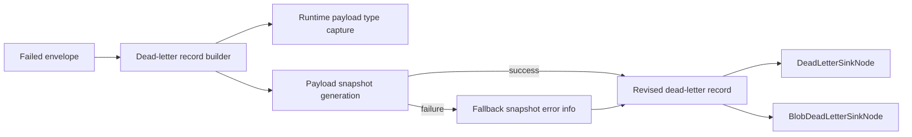

# Implementation Plan

**Target output path:** `./docs/049-deadletter-enhancement/plan.md`

**Based on:** `docs/049-deadletter-enhancement/spec.md`

## Baseline
- `src/UKHO.Search/Pipelines/Nodes/DeadLetterSinkNode.cs` persists dead-letter records for generic payloads using the declared generic type.
- `src/UKHO.Search.Infrastructure.Ingestion/DeadLetter/BlobDeadLetterSinkNode.cs` persists ingestion dead-letters to blob storage using a similar record shape and similar fallback behavior.
- `src/UKHO.Search/Pipelines/DeadLetter/*` already contains the shared dead-letter record and metadata model used by both dead-letter sinks.
- `src/UKHO.Search.Ingestion/Pipeline/Operations/IndexOperation.cs` is an abstract base type, while `UpsertOperation` carries the full `CanonicalDocument`.
- The current dead-letter output is runnable and durable, but index-operation dead-letters lose derived payload details such as `UpsertOperation.Document`.

## Delta
- Revise the dead-letter persistence contract so records include runtime payload diagnostics generically.
- Introduce a shared runtime payload snapshot model that can be reused by both file and blob dead-letter sinks.
- Ensure `UpsertOperation` dead-letters expose the full `CanonicalDocument` content needed to diagnose index failures such as malformed `geoPolygons`.
- Preserve dead-letter persistence resilience by falling back to a reduced record when snapshot generation fails.
- Add regression coverage for polymorphic payload capture, sink consistency, and fallback serialization behavior.

## Carry-over / Deferred
- Redaction or truncation policies for large or sensitive payloads.
- Compression or size-optimization for blob/file dead-letter artifacts.
- Tooling or UI to browse dead-letter records visually.
- Broader changes to ingestion retry semantics or Elasticsearch error classification.

## Project Structure / Placement
- Shared dead-letter record and payload snapshot abstractions stay under `src/UKHO.Search/Pipelines/DeadLetter/*`.
- File-based dead-letter sink changes stay in `src/UKHO.Search/Pipelines/Nodes/DeadLetterSinkNode.cs`.
- Blob-based dead-letter sink changes stay in `src/UKHO.Search.Infrastructure.Ingestion/DeadLetter/BlobDeadLetterSinkNode.cs`.
- Index-operation types remain in `src/UKHO.Search.Ingestion/Pipeline/Operations/*`; only diagnostic consumption changes are expected.
- Automated tests should be added to the existing test projects that already cover pipeline and ingestion behavior:
  - `test/UKHO.Search.Tests/*`
  - `test/UKHO.Search.Ingestion.Tests/*`
- Documentation remains within `docs/049-deadletter-enhancement/*`.

## Feature Slice: Shared runtime payload diagnostic contract

- [x] Work Item 1: Introduce a generic dead-letter diagnostic snapshot model that captures runtime payload detail end to end - Completed
  - **Purpose**: Deliver the smallest useful vertical slice where a dead-letter record can persist runtime payload type and diagnostic content generically, enabling immediate inspection of derived payload data.
  - **Acceptance Criteria**:
    - Dead-letter records include a runtime payload type field.
    - Dead-letter records include a generic payload diagnostic snapshot field.
    - The shared dead-letter record model can represent both normal diagnostic snapshots and snapshot-generation failures.
    - The change is reusable by both file and blob dead-letter sinks.
    - The design does not special-case `CanonicalDocument` in the shared contract.
  - **Definition of Done**:
    - Shared model(s) and helper abstraction(s) implemented.
    - Unit tests cover payload type capture and generic snapshot creation.
    - Logging/error handling defined for snapshot-generation failures.
    - Documentation updated if implementation clarifies the record shape.
    - Can execute end-to-end via: run the relevant automated tests that serialize the revised dead-letter record model.
  - [x] Task 1.1: Define the revised dead-letter record shape - Completed
    - [x] Step 1: Reviewed the current shared dead-letter model and kept the existing envelope, error, raw snapshot, and metadata fields unchanged.
    - [x] Step 2: Added explicit payload diagnostic fields via `DeadLetterPayloadDiagnostics`, including runtime payload type, payload snapshot, and snapshot serialization failure detail.
    - [x] Step 3: Chose one canonical structured payload representation under `PayloadDiagnostics` so the runtime payload shape is modeled consistently across payload families.
    - [x] Step 4: Extended `DeadLetterRecord<TPayload>` with the generic `PayloadDiagnostics` field without coupling the shared contract to request or index-specific payload types.
  - [x] Task 1.2: Introduce shared snapshot generation logic - Completed
    - [x] Step 1: Added `DeadLetterPayloadDiagnosticsBuilder` in the shared dead-letter layer to build diagnostics from the runtime payload instance.
    - [x] Step 2: Implemented snapshot generation with runtime-type serialization so derived members are preserved even when the declared type is more general.
    - [x] Step 3: Implemented fallback capture through `DeadLetterPayloadSnapshotError` so snapshot-generation failures are returned as diagnostics instead of throwing.
    - [x] Step 4: Kept the helper in `src/UKHO.Search/Pipelines/DeadLetter/*` so infrastructure sinks can adopt it in the next work item without reversing dependency direction.
  - [x] Task 1.3: Add shared regression coverage for the new contract - Completed
    - [x] Step 1: Added tests proving runtime payload type is preserved.
    - [x] Step 2: Added tests proving derived payload members remain visible in the diagnostic snapshot when the declared payload type is broader.
    - [x] Step 3: Added tests proving unsupported payload members return snapshot error diagnostics instead of failing the record-build path.
  - **Files**:
    - `src/UKHO.Search/Pipelines/DeadLetter/*`: Add or revise shared dead-letter record / snapshot model(s).
    - `test/UKHO.Search.Tests/*`: Add shared dead-letter serialization and fallback tests.
  - **Work Item Dependencies**: None.
  - **Run / Verification Instructions**:
    - `dotnet test test/UKHO.Search.Tests/UKHO.Search.Tests.csproj`
  - **User Instructions**:
    - None.
  - **Summary (Work Item 1)**:
    - Added shared dead-letter payload diagnostic types in `src/UKHO.Search/Pipelines/DeadLetter/`.
    - Extended `DeadLetterRecord<TPayload>` with a generic `PayloadDiagnostics` field ready for sink adoption.
    - Added `DeadLetterPayloadDiagnosticsBuilder` to capture runtime payload type, structured snapshots, and fallback snapshot errors.
    - Added `test/UKHO.Search.Tests/Pipelines/DeadLetterPayloadDiagnosticsBuilderTests.cs` covering runtime type capture, derived payload serialization, and fallback error handling.
    - Verified the slice with `dotnet test test/UKHO.Search.Tests/UKHO.Search.Tests.csproj` and a successful workspace build.

## Feature Slice: File and blob dead-letter sinks emit the new diagnostic schema

- [x] Work Item 2: Apply the shared diagnostic snapshot model to both dead-letter sinks so persisted artifacts are consistent and resilient - Completed
  - **Purpose**: Make the new dead-letter schema operational by updating the file-based and blob-based sinks to emit the same logical diagnostic content in real persistence paths.
  - **Acceptance Criteria**:
    - File dead-letter persistence uses the revised runtime payload diagnostic contract.
    - Blob dead-letter persistence uses the revised runtime payload diagnostic contract.
    - Both sinks produce the same logical fields for runtime payload type, payload snapshot, and snapshot failure information.
    - If snapshot serialization fails, both sinks still persist a dead-letter record successfully.
    - Existing queue-message acknowledgement behavior after successful dead-letter persistence remains unchanged.
  - **Definition of Done**:
    - Both sink implementations updated.
    - Sink-specific tests verify logical schema consistency.
    - Existing dead-letter persistence behavior remains intact apart from the revised record shape.
    - Logging added or updated where snapshot fallback occurs.
    - Can execute end-to-end via: run pipeline and ingestion test suites covering file and blob dead-letter persistence.
  - [x] Task 2.1: Update `DeadLetterSinkNode<TPayload>` - Completed
    - [x] Step 1: Replaced direct record construction with `DeadLetterRecordBuilder` so the file sink uses the shared runtime payload snapshot helper.
    - [x] Step 2: Switched file dead-letter serialization to the revised camelCase JSON shape with `payloadDiagnostics` included in persisted output.
    - [x] Step 3: Added fallback record serialization so non-fatal file dead-letter persistence still succeeds when the full record payload cannot be serialized.
  - [x] Task 2.2: Update `BlobDeadLetterSinkNode<TPayload>` - Completed
    - [x] Step 1: Replaced the blob sink's direct payload serialization path with `DeadLetterRecordBuilder`.
    - [x] Step 2: Kept blob upload and container provisioning behavior unchanged while adopting the new record shape.
    - [x] Step 3: Replaced the blob sink's ad-hoc anonymous fallback with a shared fallback record that preserves payload diagnostics and serialization failure detail.
    - [x] Step 4: Preserved queue-message delete-after-dead-letter semantics when blob persistence succeeds.
  - [x] Task 2.3: Add sink-level regression coverage - Completed
    - [x] Step 1: Added file dead-letter schema tests covering runtime payload diagnostics and fallback persistence.
    - [x] Step 2: Expanded blob dead-letter tests to assert runtime payload diagnostics and fallback persistence behavior.
    - [x] Step 3: Verified both sinks continue to persist a dead-letter record successfully when payload snapshot / full record serialization falls back.
    - [x] Step 4: Added a cross-sink schema consistency test to compare the logical file and blob dead-letter JSON shapes.
  - **Files**:
    - `src/UKHO.Search/Pipelines/Nodes/DeadLetterSinkNode.cs`: Adopt shared runtime payload snapshot record building.
    - `src/UKHO.Search.Infrastructure.Ingestion/DeadLetter/BlobDeadLetterSinkNode.cs`: Adopt shared runtime payload snapshot record building.
    - `test/UKHO.Search.Tests/*`: Add file sink regression coverage.
    - `test/UKHO.Search.Ingestion.Tests/*`: Add ingestion/blob dead-letter regression coverage.
  - **Work Item Dependencies**: Depends on Work Item 1.
  - **Run / Verification Instructions**:
    - `dotnet test test/UKHO.Search.Tests/UKHO.Search.Tests.csproj`
    - `dotnet test test/UKHO.Search.Ingestion.Tests/UKHO.Search.Ingestion.Tests.csproj`
  - **User Instructions**:
    - None.
  - **Summary (Work Item 2)**:
    - Added shared fallback dead-letter record types in `src/UKHO.Search/Pipelines/DeadLetter/` so both sinks can persist the same logical schema when full record serialization fails.
    - Updated `DeadLetterSinkNode<TPayload>` and `BlobDeadLetterSinkNode<TPayload>` to build records with `DeadLetterRecordBuilder`, emit camelCase JSON, include `payloadDiagnostics`, and log when snapshot or record serialization falls back.
    - Added and updated regression tests across `test/UKHO.Search.Tests/Pipelines/*` and `test/UKHO.Search.Ingestion.Tests/DeadLetter/*` for file sink schema, blob sink schema, fallback persistence, and cross-sink schema consistency.
    - Updated existing dead-letter JSON assertions in retry / pipeline tests to match the revised contract.
    - Verified the slice with `dotnet test test/UKHO.Search.Tests/UKHO.Search.Tests.csproj`, `dotnet test test/UKHO.Search.Ingestion.Tests/UKHO.Search.Ingestion.Tests.csproj`, and a successful workspace build.

## Feature Slice: `UpsertOperation` dead-letters expose failed `CanonicalDocument` content for Elasticsearch diagnostics

- [x] Work Item 3: Verify end-to-end index dead-letters contain the failed document and are usable for diagnosing `geoPolygons` parsing failures - Completed
  - **Purpose**: Deliver the main operator value of this package by making index dead-letter artifacts self-contained for `UpsertOperation` failures.
  - **Acceptance Criteria**:
    - When an `UpsertOperation` is dead-lettered, the persisted record includes the `CanonicalDocument` content.
    - The persisted record makes it possible to inspect fields such as `geoPolygons` directly from the dead-letter artifact.
    - The persisted record continues to include the bulk-index error details returned by Elasticsearch.
    - Delete and ACL update operations remain representable and clearly identifiable by operation type.
    - The final persisted artifact is readable enough for developers to inspect without custom tooling.
  - **Definition of Done**:
    - End-to-end tests or targeted integration-style tests cover failed `UpsertOperation` persistence.
    - Example diagnostic assertions verify `CanonicalDocument` fields are present in the persisted dead-letter record.
    - Index-operation variants remain supported by the generic payload snapshot design.
    - Documentation updated if the final JSON shape needs clarifying examples.
    - Can execute end-to-end via: run ingestion tests that create a failed `UpsertOperation` and inspect the persisted dead-letter JSON.
  - [x] Task 3.1: Add index-operation-specific regression coverage - Completed
    - [x] Step 1: Added tests proving `UpsertOperation` payload diagnostics include the nested `document` content.
    - [x] Step 2: Added assertions proving `geoPolygons` data appears in the persisted diagnostic snapshot.
    - [x] Step 3: Added tests proving delete and ACL update operations preserve clear runtime operation identity and operation-specific members.
  - [x] Task 3.2: Validate end-to-end dead-letter usability - Completed
    - [x] Step 1: Added a representative failed bulk-index path using `InOrderBulkIndexNode` feeding `BlobDeadLetterSinkNode<IndexOperation>`.
    - [x] Step 2: Asserted the persisted dead-letter artifact contains the bulk-index error, runtime payload type, and payload diagnostic snapshot in one record.
    - [x] Step 3: Confirmed the record is readable directly as JSON without relying on CLR polymorphic metadata in the envelope payload.
  - [x] Task 3.3: Final documentation and verification pass - Completed
    - [x] Step 1: No spec update was required; implementation stayed within the existing work-package intent and did not force a new clarification-only spec revision.
    - [x] Step 2: Final verification remained aligned with the original plan and was executed with the documented test assemblies and workspace build.
    - [x] Step 3: Confirmed no backward-compatibility or migration work is required for this dev-focused schema change.
  - **Files**:
    - `test/UKHO.Search.Ingestion.Tests/*`: Add failed-upsert dead-letter persistence coverage.
    - `test/UKHO.Search.Tests/*`: Add index-operation dead-letter readability assertions where shared helpers are exercised.
    - `docs/049-deadletter-enhancement/spec.md`: Clarification-only updates if implementation resolves the remaining open question.
  - **Work Item Dependencies**: Depends on Work Items 1 and 2.
  - **Run / Verification Instructions**:
    - `dotnet test test/UKHO.Search.Ingestion.Tests/UKHO.Search.Ingestion.Tests.csproj`
    - `dotnet test test/UKHO.Search.Tests/UKHO.Search.Tests.csproj`
  - **User Instructions**:
    - Inspect a generated dead-letter artifact from a failed upsert test and verify the `CanonicalDocument` content is present.
  - **Summary (Work Item 3)**:
    - Updated `DeadLetterPayloadDiagnosticsBuilder` to emit camelCase payload snapshots for more readable persisted diagnostics.
    - Added index-operation-specific diagnostics tests in `test/UKHO.Search.Ingestion.Tests/DeadLetter/IndexOperationPayloadDiagnosticsTests.cs` covering `UpsertOperation`, `DeleteOperation`, and `AclUpdateOperation`.
    - Added an end-to-end failed bulk-index persistence test in `test/UKHO.Search.Ingestion.Tests/DeadLetter/IndexOperationDeadLetterPersistenceTests.cs` proving an `UpsertOperation` dead-letter contains the failed `CanonicalDocument`, including `geoPolygons`, together with the bulk-index error.
    - Updated shared payload-diagnostics assertions in `test/UKHO.Search.Tests/Pipelines/DeadLetterPayloadDiagnosticsBuilderTests.cs` to match the final camelCase snapshot contract.
    - Verified the slice with `dotnet test test/UKHO.Search.Tests/UKHO.Search.Tests.csproj`, `dotnet test test/UKHO.Search.Ingestion.Tests/UKHO.Search.Ingestion.Tests.csproj`, and a successful workspace build.

---

# Architecture

## Overall Technical Approach
- Introduce a shared dead-letter diagnostic snapshot contract in the domain pipeline layer so both file and blob dead-letter sinks can build the same persisted record shape.
- Capture runtime payload diagnostics generically from the payload instance rather than relying on declared generic/base types during dead-letter serialization.
- Keep sink persistence responsibilities focused on storage concerns; shared record construction and payload snapshot generation should be centralized.
- Preserve resilience by ensuring snapshot-generation failure degrades to a fallback diagnostic record rather than preventing dead-letter persistence.

## Frontend
- No frontend changes are required for this work package.
- Diagnostic consumption remains via raw blob/file JSON inspection by developers and operators.

## Backend
- `src/UKHO.Search/Pipelines/DeadLetter/*`
  - becomes the home for the revised dead-letter record contract and shared payload snapshot logic.
  - should expose a single, reusable way to build a persisted dead-letter record from an envelope and its runtime payload.
- `src/UKHO.Search/Pipelines/Nodes/DeadLetterSinkNode.cs`
  - continues to persist dead-letters to file.
  - adopts the shared record-building path so runtime payload diagnostics are included.
- `src/UKHO.Search.Infrastructure.Ingestion/DeadLetter/BlobDeadLetterSinkNode.cs`
  - continues to persist dead-letters to blob storage.
  - adopts the same shared record-building path and preserves queue-message acknowledgement behavior.
- `src/UKHO.Search.Ingestion/Pipeline/Operations/*`
  - remains unchanged in responsibility.
  - provides the runtime payload instances whose derived members must now be visible in dead-letter diagnostics.

## Overall approach summary
This plan delivers the enhancement in three vertical slices. The first establishes a generic runtime payload diagnostic contract. The second makes that contract operational in both dead-letter sinks. The third verifies the end-user value by proving failed `UpsertOperation` dead-letters contain the full `CanonicalDocument` content needed to diagnose Elasticsearch parse failures such as `geoPolygons`. The key design choice is to solve the problem once in shared dead-letter record construction rather than adding sink-specific or payload-specific special cases.
