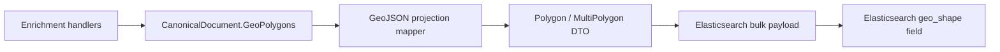

# Implementation Plan

**Target output path:** `./docs/050-geo-polygon-fixes/plan.md`

**Based on:** `docs/050-geo-polygon-fixes/spec.md`

## Baseline
- `CanonicalDocument` currently stores geo data as `List<GeoPolygon>` in the domain model.
- Elasticsearch index mapping already declares `geoPolygons` as `geo_shape`.
- The current bulk indexing path serializes the domain model shape directly, producing `rings`, `longitude`, and `latitude` rather than GeoJSON.
- Dead-letter diagnostics now expose the failed indexed payload, making the current shape mismatch visible and reproducible.
- The repository uses `System.Text.Json` and must not introduce `GeoJSON.Net` or `Newtonsoft.Json` for this work.

## Delta
- Introduce an explicit GeoJSON projection for geo polygon indexing.
- Ensure a single domain polygon is indexed as GeoJSON `Polygon`.
- Ensure multiple domain polygons are indexed as GeoJSON `MultiPolygon`.
- Ensure empty polygon collections do not emit an invalid empty `geo_shape` payload.
- Treat existing previously serialized `geoPolygons` data as out of scope; this work only needs to create and support newly indexed geo polygons in the correct format.
- Add regression coverage for GeoJSON mapping, serialized payload shape, and Elasticsearch bulk indexing integration.

## Carry-over / Deferred
- Backward compatibility for previously serialized `geoPolygons` payloads or already indexed malformed geo-shape documents.
- Geometry normalization beyond current domain validation, such as removing consecutive duplicate points.
- Geometry repair for self-intersections or winding-order normalization.
- Query-side geo abstractions or geo-search features.
- Any broader redesign of the domain geo model.

## Project Structure / Placement
- Domain geo types remain under `src/UKHO.Search/Geo/*`.
- Any indexing-specific GeoJSON projection types or mappers should live in `src/UKHO.Search.Infrastructure.Ingestion/Elastic/*` to preserve Onion dependency direction.
- Bulk indexing changes remain in `src/UKHO.Search.Infrastructure.Ingestion/Elastic/*`.
- Existing domain document types remain in `src/UKHO.Search.Ingestion/Pipeline/Documents/*` unless a minimal serialization-facing change is strictly required.
- Automated tests should be added to existing ingestion test areas:
  - `test/UKHO.Search.Ingestion.Tests/Elastic/*`
  - `test/UKHO.Search.Ingestion.Tests/Documents/*`
- Documentation remains within `docs/050-geo-polygon-fixes/*`.

## Feature Slice: GeoJSON projection for a single polygon end to end

- [x] Work Item 1: Add a runnable indexing path that serializes one domain polygon as Elasticsearch-compatible GeoJSON `Polygon` - Completed
  - **Purpose**: Deliver the smallest useful end-to-end capability by making a document containing one `GeoPolygon` indexable through a valid GeoJSON payload.
  - **Acceptance Criteria**:
    - A document with exactly one `GeoPolygon` is serialized as a GeoJSON object with `type` = `Polygon`.
    - The serialized payload uses GeoJSON coordinate ordering `[longitude, latitude]`.
    - The Elasticsearch bulk payload no longer emits the internal `rings` / `longitude` / `latitude` object graph for the single-polygon case.
    - Existing documents without polygons continue to serialize without failure.
    - No backward-compatibility behavior is required for previously serialized or previously indexed `geoPolygons` values.
  - **Definition of Done**:
    - GeoJSON projection code implemented for the single-polygon case.
    - Unit tests cover single-polygon projection and coordinate ordering.
    - Integration-style tests verify the Elasticsearch bulk payload shape.
    - Logging/error handling remains intact in the indexing path.
    - Can execute end-to-end via: run ingestion tests covering GeoJSON payload generation for one polygon.
  - [x] Task 1.1: Introduce Elasticsearch-facing GeoJSON projection types or mapper - Completed
    - [x] Step 1: Added infrastructure-layer projection types `CanonicalIndexDocument`, `GeoJsonPolygonShape`, and `GeoJsonPolygonShapeMapper` using a `System.Text.Json`-compatible approach.
    - [x] Step 2: Modeled the GeoJSON `Polygon` wire shape explicitly with `type` and `coordinates`.
    - [x] Step 3: Mapped one domain `GeoPolygon` and all of its rings into GeoJSON polygon coordinates in `[longitude, latitude]` order.
  - [x] Task 1.2: Integrate the single-polygon projection into bulk indexing - Completed
    - [x] Step 1: Updated `ElasticsearchBulkIndexClient` to project `CanonicalDocument.GeoPolygons` into an Elasticsearch-facing index DTO before serialization.
    - [x] Step 2: Kept the rest of the indexed document payload unchanged while swapping the geo field to GeoJSON.
    - [x] Step 3: Ensured documents with no polygons omit the `geoPolygons` field rather than emitting an invalid empty shape.
  - [x] Task 1.3: Add regression coverage for the single-polygon slice - Completed
    - [x] Step 1: Added tests proving a single polygon serializes as GeoJSON `Polygon`.
    - [x] Step 2: Added tests proving coordinates serialize in `[longitude, latitude]` order.
    - [x] Step 3: Added tests proving the old `rings` / `longitude` / `latitude` CLR-object wire shape is absent from the serialized bulk payload.
  - **Files**:
    - `src/UKHO.Search.Infrastructure.Ingestion/Elastic/*`: Add GeoJSON projection types/mapper and integrate with bulk payload generation.
    - `test/UKHO.Search.Ingestion.Tests/Elastic/*`: Add single-polygon payload-shape tests.
  - **Work Item Dependencies**: None.
  - **Run / Verification Instructions**:
    - `dotnet test test/UKHO.Search.Ingestion.Tests/UKHO.Search.Ingestion.Tests.csproj`
  - **User Instructions**:
    - None.
  - **Summary (Work Item 1)**:
    - Added infrastructure-layer GeoJSON projection types in `src/UKHO.Search.Infrastructure.Ingestion/Elastic/` for single-polygon indexing.
    - Updated `ElasticsearchBulkIndexClient` to index `CanonicalIndexDocument` rather than serializing the domain `CanonicalDocument` directly.
    - Added regression tests in `test/UKHO.Search.Ingestion.Tests/Elastic/GeoJsonPolygonShapeMapperTests.cs` and `ElasticsearchBulkIndexClientGeoJsonPayloadTests.cs` covering GeoJSON polygon shape, coordinate ordering, omission of empty shapes, and absence of the old CLR-object payload.
    - Verified the slice with `dotnet test test/UKHO.Search.Ingestion.Tests/UKHO.Search.Ingestion.Tests.csproj` and a successful workspace build.

## Feature Slice: Multi-polygon indexing via GeoJSON `MultiPolygon`

- [x] Work Item 2: Extend the indexing path so multiple domain polygons are emitted as one GeoJSON `MultiPolygon` - Completed
  - **Purpose**: Preserve domain-level support for multiple polygons while making the indexed `geoPolygons` field valid for Elasticsearch `geo_shape`.
  - **Acceptance Criteria**:
    - A document with more than one `GeoPolygon` is serialized as GeoJSON `MultiPolygon`.
    - Each domain polygon becomes one polygon entry within `MultiPolygon.coordinates`.
    - Ring structure is preserved for each polygon.
    - The resulting payload remains deterministic and readable in dead-letter diagnostics.
  - **Definition of Done**:
    - Multi-polygon projection implemented.
    - Tests cover `MultiPolygon` payload shape and ring nesting.
    - Single-polygon behavior remains stable.
    - Can execute end-to-end via: run ingestion tests covering documents with multiple polygons.
  - [x] Task 2.1: Add multi-polygon GeoJSON mapping - Completed
    - [x] Step 1: Extended the GeoJSON projection to emit `MultiPolygon` when `CanonicalDocument.GeoPolygons.Count > 1`.
    - [x] Step 2: Preserved each polygon's ring hierarchy within the multipolygon coordinates array.
    - [x] Step 3: Kept the single-polygon and zero-polygon branches explicit and deterministic by returning `Polygon`, `MultiPolygon`, or `null` from the mapper.
  - [x] Task 2.2: Add regression coverage for multi-polygon behavior - Completed
    - [x] Step 1: Added tests proving multiple polygons serialize as `MultiPolygon`.
    - [x] Step 2: Added tests proving each polygon is represented separately and in stable order.
    - [x] Step 3: Added tests proving additional rings remain nested under the correct polygon.
  - **Files**:
    - `src/UKHO.Search.Infrastructure.Ingestion/Elastic/*`: Extend projection logic for `MultiPolygon`.
    - `test/UKHO.Search.Ingestion.Tests/Elastic/*`: Add multi-polygon mapping and payload tests.
  - **Work Item Dependencies**: Depends on Work Item 1.
  - **Run / Verification Instructions**:
    - `dotnet test test/UKHO.Search.Ingestion.Tests/UKHO.Search.Ingestion.Tests.csproj`
  - **User Instructions**:
    - None.
  - **Summary (Work Item 2)**:
    - Added `GeoJsonMultiPolygonShape` in `src/UKHO.Search.Infrastructure.Ingestion/Elastic/` and extended the existing mapper to emit GeoJSON `MultiPolygon` for documents containing multiple domain polygons.
    - Updated the indexing DTO to support either single-polygon or multi-polygon GeoJSON payloads while preserving the zero-polygon omission behavior introduced in Work Item 1.
    - Added regression tests in `test/UKHO.Search.Ingestion.Tests/Elastic/GeoJsonPolygonShapeMapperTests.cs` and `ElasticsearchBulkIndexClientGeoJsonPayloadTests.cs` covering multi-polygon serialization, stable ordering, and correct ring nesting.
    - Verified the slice with `dotnet test test/UKHO.Search.Ingestion.Tests/UKHO.Search.Ingestion.Tests.csproj` and a successful workspace build.

## Feature Slice: End-to-end validation of geo-shape payload compatibility

- [x] Work Item 3: Harden the indexing contract and verification so geo-shape payloads are valid, inspectable, and regression-safe - Completed
  - **Purpose**: Validate that the final payload contract is correct for Elasticsearch and remains diagnosable through tests and dead-letter output.
  - **Acceptance Criteria**:
    - Empty polygon collections do not emit an invalid geo-shape payload.
    - Bulk indexing tests verify the final serialized field structure expected by Elasticsearch.
    - Dead-letter-visible payloads reflect the new GeoJSON shape rather than the old domain object graph.
    - The solution remains `System.Text.Json`-compatible and introduces no `Newtonsoft.Json`-based dependency.
    - The implementation is only required to support newly indexed geo polygon payloads in the corrected format.
  - **Definition of Done**:
    - Final serialization and payload tests pass.
    - Workspace build succeeds.
    - Documentation updated only if implementation forces clarification.
    - Can execute end-to-end via: run ingestion tests and inspect the serialized geo payload in test output/assertions.
  - [x] Task 3.1: Validate empty and edge-case behavior - Completed
    - [x] Step 1: Added final bulk-payload regression coverage proving empty `GeoPolygons` omits the `geoPolygons` field rather than emitting an invalid empty geo-shape object.
    - [x] Step 2: Verified the indexing path remains stable when documents contain no geo polygons through mapper and bulk-payload tests.
    - [x] Step 3: Confirmed current domain validation remains unchanged for this slice; no additional geometry normalization was required to satisfy the GeoJSON payload contract.
  - [x] Task 3.2: Verify final indexed payload contract - Completed
    - [x] Step 1: Extended bulk payload tests to assert the final `geoPolygons` field contains GeoJSON `type` and `coordinates` for polygon, multipolygon, and empty cases.
    - [x] Step 2: Kept assertions proving the old `rings` / `longitude` / `latitude` wire shape is absent from indexed payloads.
    - [x] Step 3: Updated blob dead-letter diagnostics to project `UpsertOperation` documents through the Elasticsearch-facing index DTO so persisted dead-letter payload snapshots show GeoJSON instead of the old domain object graph.
  - [x] Task 3.3: Final verification and documentation pass - Completed
    - [x] Step 1: No spec update was required; implementation stayed within the existing work-package intent.
    - [x] Step 2: Verified the work remained `System.Text.Json`-only and introduced no `Newtonsoft.Json` or `GeoJSON.Net` dependency.
    - [x] Step 3: Confirmed a fresh index remains an acceptable validation path and that support for previously serialized malformed geo payloads remains explicitly out of scope.
  - **Files**:
    - `test/UKHO.Search.Ingestion.Tests/Elastic/*`: Add final payload and empty-case regression tests.
    - `docs/050-geo-polygon-fixes/spec.md`: Clarification-only updates if required.
  - **Work Item Dependencies**: Depends on Work Items 1 and 2.
  - **Run / Verification Instructions**:
    - `dotnet test test/UKHO.Search.Ingestion.Tests/UKHO.Search.Ingestion.Tests.csproj`
    - `dotnet build`
  - **User Instructions**:
    - If you validate manually, recreate the dev index before running a new ingest so Elasticsearch uses the intended `geo_shape` mapping.
  - **Summary (Work Item 3)**:
    - Added an ingestion-specific dead-letter payload diagnostics factory so blob dead-letter records for `UpsertOperation` now snapshot the Elasticsearch-facing GeoJSON payload shape instead of the old domain geo object graph.
    - Extended `ElasticsearchBulkIndexClientGeoJsonPayloadTests` with the empty-document case and updated `IndexOperationDeadLetterPersistenceTests` to assert GeoJSON `type` / `coordinates` in dead-letter payload diagnostics.
    - Kept existing domain validation unchanged and confirmed no `Newtonsoft.Json`-based dependency was introduced.
    - Verified the slice with `dotnet test test/UKHO.Search.Ingestion.Tests/UKHO.Search.Ingestion.Tests.csproj` and a successful workspace build.

---

# Architecture

## Overall Technical Approach
- Keep `GeoPolygon` as the domain model and introduce an explicit Elasticsearch-facing GeoJSON projection in the infrastructure indexing layer.
- Convert domain polygons to one valid `geo_shape` payload object before bulk serialization.
- Use GeoJSON `Polygon` for exactly one polygon and `MultiPolygon` for more than one polygon.
- Keep the implementation `System.Text.Json`-compatible and avoid any `Newtonsoft.Json`-based dependency.

## Frontend
- No frontend changes are required for this work package.
- Validation is through tests and dead-letter / payload inspection rather than UI changes.

## Backend
- `src/UKHO.Search/Geo/*`
  - remains the domain representation of polygons and coordinates.
  - continues to enforce domain-level coordinate and ring validation.
- `src/UKHO.Search.Ingestion/Pipeline/Documents/*`
  - continues to hold `CanonicalDocument` as the domain indexing model.
  - remains responsible for storing zero, one, or many domain polygons.
- `src/UKHO.Search.Infrastructure.Ingestion/Elastic/*`
  - becomes responsible for converting domain polygons into Elasticsearch-compatible GeoJSON wire shapes.
  - should contain the GeoJSON DTOs or mapper logic and the bulk indexing integration point.
- `test/UKHO.Search.Ingestion.Tests/Elastic/*`
  - verifies GeoJSON payload generation, empty behavior, and single/multi-polygon serialization.

## Overall approach summary
This plan delivers the fix in three vertical slices. The first introduces a working single-polygon GeoJSON path so documents with one polygon can index correctly. The second extends the same path to multiple polygons by emitting `MultiPolygon`. The third hardens the contract with empty-case handling and full payload verification so the old CLR-object shape does not reappear in Elasticsearch indexing. The key design choice is to keep the domain model unchanged and add an explicit infrastructure-layer GeoJSON projection for Elasticsearch.
