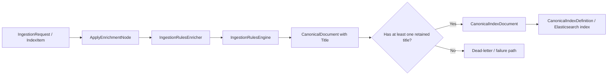
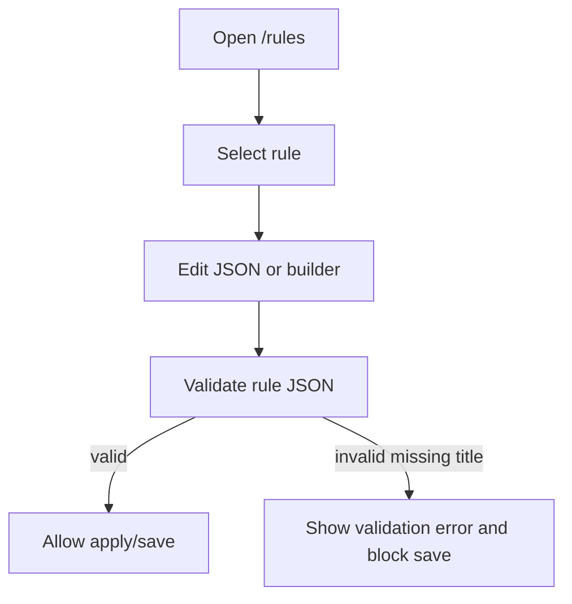

# Implementation Plan + Architecture — Work Package `054-rule-title`

**Target output path:** `docs/054-rule-title/plan-ingestion-canonical-title_v0.01.md`

**Version:** `v0.01` (Draft)

**Based on:** `docs/054-rule-title/spec-domain-canonical-document-title_v0.01.md`

---

# Implementation Plan

## Baseline

Current implemented behavior evidenced in the codebase:

- `src/UKHO.Search.Ingestion/Pipeline/Documents/CanonicalDocument.cs`
  - contains normalized lowercase discovery fields such as `Keywords`, `Authority`, `Region`, `Format`, `Category`, `Series`, `Instance`, `SearchText`, and `Content`
  - does **not** contain `Title`
- `src/UKHO.Search.Infrastructure.Ingestion/Elastic/CanonicalIndexDocument.cs`
  - projects canonical fields into the Elasticsearch payload
  - does **not** emit `title`
- `src/UKHO.Search.Infrastructure.Ingestion/Elastic/CanonicalIndexDefinition.cs`
  - defines canonical index mappings
  - does **not** map `title`
- `src/UKHO.Search.Infrastructure.Ingestion/Rules/Model/RuleDto.cs`
  - supports `Id`, `Context`, `Description`, `Enabled`, `If`, `Match`, and `Then`
  - does **not** model `Title`
- `src/UKHO.Search.Infrastructure.Ingestion/Rules/RuleFileLoader.cs`
  - validates rules directory, JSON, schema version, and rule id
  - does **not** fail on missing `rule.title`
- `src/UKHO.Search.Infrastructure.Ingestion/Rules/IngestionRulesEngine.cs`
  - applies matched rules via `IngestionRulesActionApplier`
  - currently applies only `then` actions, not a rule-level `title`
- `src/UKHO.Search.Ingestion/Pipeline/Nodes/ApplyEnrichmentNode.cs`
  - runs enrichers and forwards successful upsert operations
  - does **not** validate that the enriched canonical document contains a retained title before indexing
- `tools/RulesWorkbench/Services/SystemTextJsonRuleJsonValidator.cs`
  - validates JSON syntax only
- repository rules under `rules/file-share/*.json`
  - do not consistently include `rule.title`

## Delta

This work package will introduce:

- a multi-valued display-oriented `Title` field on `CanonicalDocument`
- canonical index payload + mapping support for `title`
- `rule.title` support in the rule model and runtime application path
- fail-fast rule loading when `rule.title` is missing or blank
- post-enrichment validation that rejects missing-title documents before indexing and routes them to the failure/dead-letter path
- updated repository rule files, RulesWorkbench validation behavior, and wiki guidance

## Carry-over / Deferred Items

Out of scope for this work package:

- query UI or API changes that choose a preferred display title at read time
- migration support for old rule files without `title`
- schema version changes beyond `1.0`
- changes to non-rules ingestion paths, because all indexed canonical documents already pass through the rules path

---

## Project Structure / Touchpoints

Primary code areas expected to change:

- Domain canonical document
  - `src/UKHO.Search.Ingestion/Pipeline/Documents/CanonicalDocument.cs`
- Ingestion pipeline validation / failure routing
  - `src/UKHO.Search.Ingestion/Pipeline/Nodes/ApplyEnrichmentNode.cs`
- Rules engine model and application
  - `src/UKHO.Search.Infrastructure.Ingestion/Rules/Model/RuleDto.cs`
  - `src/UKHO.Search.Infrastructure.Ingestion/Rules/Model/RuleFileDocumentDto.cs`
  - `src/UKHO.Search.Infrastructure.Ingestion/Rules/RuleFileLoader.cs`
  - `src/UKHO.Search.Infrastructure.Ingestion/Rules/IngestionRulesEngine.cs`
  - `src/UKHO.Search.Infrastructure.Ingestion/Rules/Actions/IngestionRulesActionApplier.cs`
- Index projection and mapping
  - `src/UKHO.Search.Infrastructure.Ingestion/Elastic/CanonicalIndexDocument.cs`
  - `src/UKHO.Search.Infrastructure.Ingestion/Elastic/CanonicalIndexDefinition.cs`
- RulesWorkbench authoring/validation path
  - `tools/RulesWorkbench/Services/SystemTextJsonRuleJsonValidator.cs`
  - `tools/RulesWorkbench/Services/AppConfigRulesSnapshotStore.cs`
  - `tools/RulesWorkbench/Components/Pages/Rules.razor`
- Repository rules and docs
  - `rules/file-share/*.json`
  - `wiki/CanonicalDocument-and-Discovery-Taxonomy.md`
  - `wiki/Ingestion-Rules.md`
  - `wiki/Tools-RulesWorkbench.md`
  - `wiki/Ingestion-Pipeline.md`
  - `wiki/Home.md`
  - `wiki/Documentation-Source-Map.md`

Primary test areas expected to change:

- `test/UKHO.Search.Ingestion.Tests/Rules/RuleFileLoaderTests.cs`
- `test/UKHO.Search.Ingestion.Tests/Rules/BootstrapStartupFailTests.cs`
- `test/UKHO.Search.Ingestion.Tests/Rules/RulesEngineEndToEndExampleTests.cs`
- `test/UKHO.Search.Ingestion.Tests/Rules/RulesEngineSlice4ActionsIntegrationTests.cs`
- `test/UKHO.Search.Ingestion.Tests/Rules/RulesEngineIndexItemPayloadRegressionTests.cs`
- `test/UKHO.Search.Ingestion.Tests/Pipeline/ApplyEnrichmentNodeTests.cs`
- `test/UKHO.Search.Ingestion.Tests/Elastic/CanonicalIndexDefinitionTests.cs`
- `test/RulesWorkbench.Tests/AppConfigRulesSnapshotStoreTests.cs`
- new focused tests for canonical title semantics if no existing canonical-document test file is suitable

---

## Slice 1: Matching rule produces a canonical title that reaches the index payload

- [x] Work Item 1: Add canonical `Title` and make matched rules populate it end to end - Completed
  - **Purpose**: Deliver the first runnable vertical slice where an indexed request passes through rule evaluation, produces a display title, and emits that title in the index payload/mapping.
  - **Acceptance Criteria**:
    - `CanonicalDocument` exposes `Title` as a multi-valued collection.
    - `Title` mutation preserves authored casing, trims whitespace, ignores blank values, de-duplicates values, and keeps deterministic ordering.
    - `rule.title` is modeled on the rule DTO and evaluated when a rule matches.
    - A matched rule adds one or more values into `CanonicalDocument.Title`.
    - `CanonicalIndexDocument` emits `title` and `CanonicalIndexDefinition` maps it as `keyword`.
    - A representative rules-engine integration test proves request -> rule match -> canonical document -> index payload title flow.
  - **Definition of Done**:
    - Code implemented across domain, rules runtime, and index projection.
    - Unit and integration tests passing for title mutation, title application, and mapping.
    - Logging/error handling preserved for the enrichment path.
    - Documentation comments or summaries updated if needed in touched tests.
    - Can execute end to end via the verification instructions below.
  - [x] Task 1: Add `Title` to the canonical document model - Completed
    - [x] Step 1: Extend `CanonicalDocument` with a `SortedSet<string>` or equivalent deterministic collection for `Title`. - Completed
    - [x] Step 2: Add `AddTitle(...)` and any companion bulk-add helper needed to match the existing canonical mutator pattern. - Completed
    - [x] Step 3: Implement title-specific normalization rules that preserve casing instead of calling the existing lowercasing helper used by keywords/search text/content. - Completed
    - [x] Step 4: Ensure title de-duplication uses deterministic comparison semantics and does not regress other fields. - Completed
  - [x] Task 2: Extend rule model and runtime title application - Completed
    - [x] Step 1: Add `Title` to `RuleDto` so rule files deserialize the new top-level property. - Completed
    - [x] Step 2: Update `RuleFileLoader` parsing assumptions so valid rule files may carry `rule.title` without custom casing issues. - Completed
    - [x] Step 3: Update `IngestionRulesEngine.ApplyWithReport(...)` to evaluate `rule.title` after predicate match and before the operation is considered fully enriched. - Completed
    - [x] Step 4: Reuse the existing template expansion/path resolution pipeline so `rule.title` supports literals, `$path:`, and `$val`. - Completed
    - [x] Step 5: Decide whether title application logic belongs directly in `IngestionRulesEngine` or in a small helper beside `IngestionRulesActionApplier`; keep a single obvious runtime path. - Completed
  - [x] Task 3: Project title into the index payload and mapping - Completed
    - [x] Step 1: Extend `CanonicalIndexDocument.Create(...)` to emit `title` from the canonical document. - Completed
    - [x] Step 2: Update `CanonicalIndexDefinition.Configure(...)` to add `.Keyword("title")` in the canonical mapping. - Completed
    - [x] Step 3: Confirm the chosen JSON property name is lowercase `title` and matches the spec. - Completed
  - [x] Task 4: Add focused tests for the first vertical slice - Completed
    - [x] Step 1: Add/update canonical-document tests covering title add/trim/dedup/case-preservation behavior. - Completed
    - [x] Step 2: Add/update rules-engine tests proving a matching rule contributes title values to the canonical document. - Completed
    - [x] Step 3: Update `CanonicalIndexDefinitionTests` to assert `title` exists with `keyword` type. - Completed
    - [x] Step 4: Update payload regression tests so title appears in the expected serialized payload shape where applicable. - Completed
  - **Files**:
    - `src/UKHO.Search.Ingestion/Pipeline/Documents/CanonicalDocument.cs`: add the `Title` collection and mutators.
    - `src/UKHO.Search.Infrastructure.Ingestion/Rules/Model/RuleDto.cs`: add `Title`.
    - `src/UKHO.Search.Infrastructure.Ingestion/Rules/IngestionRulesEngine.cs`: apply `rule.title` on matched rules.
    - `src/UKHO.Search.Infrastructure.Ingestion/Elastic/CanonicalIndexDocument.cs`: emit `title`.
    - `src/UKHO.Search.Infrastructure.Ingestion/Elastic/CanonicalIndexDefinition.cs`: map `title` as `keyword`.
    - `test/UKHO.Search.Ingestion.Tests/Rules/RulesEngineEndToEndExampleTests.cs`: assert end-to-end title flow.
    - `test/UKHO.Search.Ingestion.Tests/Rules/RulesEngineSlice4ActionsIntegrationTests.cs`: update rule application expectations.
    - `test/UKHO.Search.Ingestion.Tests/Rules/RulesEngineIndexItemPayloadRegressionTests.cs`: update payload expectations.
    - `test/UKHO.Search.Ingestion.Tests/Elastic/CanonicalIndexDefinitionTests.cs`: add mapping assertion for `title`.
  - **Work Item Dependencies**: none.
  - **Run / Verification Instructions**:
    - `dotnet test test\UKHO.Search.Ingestion.Tests\UKHO.Search.Ingestion.Tests.csproj --filter "FullyQualifiedName~RulesEngine|FullyQualifiedName~CanonicalIndexDefinition"`
    - Verify the representative rules-engine test demonstrates a non-empty `Title` on the resulting canonical document and serialized index payload.
  - **User Instructions**:
    - None beyond running the targeted ingestion tests.
  - **Completed Summary**:
    - Added `CanonicalDocument.Title` with trim-only normalization, casing preservation, de-duplication, and deterministic ordering via `AddTitle(...)` and `AddTitles(...)`.
    - Extended the validated rules path so `rule.title` is deserialized, carried through validation, and applied during matched-rule execution using the existing template expansion pipeline.
    - Updated `CanonicalIndexDocument` and `CanonicalIndexDefinition` so the canonical Elasticsearch payload and mapping now include `title` as a `keyword` field.
    - Added focused tests covering canonical title semantics, rules-engine title application, canonical index payload projection, and mapping coverage; targeted ingestion tests and workspace build passed.

---

## Slice 2: Invalid rule files fail startup and missing-title documents dead-letter before indexing

- [x] Work Item 2: Enforce the mandatory title contract at rule-load time and at pipeline execution time - Completed
  - **Purpose**: Deliver the safety slice where invalid rule definitions fail fast and any fully enriched canonical document with no retained title is rejected before indexing and routed to failure/dead-letter handling.
  - **Acceptance Criteria**:
    - Rule loading fails when `rule.title` is missing, null, empty, or whitespace-only.
    - Bootstrap startup fails when repository rule files violate the mandatory title contract.
    - The enrichment pipeline rejects upsert operations whose final canonical document has no retained title values.
    - Rejected missing-title documents are written to the existing dead-letter/failure path and are not forwarded to the normal indexing output.
    - Failure diagnostics include a clear reason indicating that title is required.
  - **Definition of Done**:
    - Rule validation, bootstrap failure, and pipeline rejection behavior implemented.
    - Unit/integration tests passing for both fail-fast and dead-letter scenarios.
    - Logging/error handling added or updated for title-validation failures.
    - Documentation updated in the plan/spec if implementation details materially differ.
    - Can execute end to end via the verification instructions below.
  - [x] Task 1: Implement fail-fast rule validation for `rule.title` - Completed
    - [x] Step 1: Extend `RuleFileLoader` validation to reject missing/blank `Rule.Title` with a clear `IngestionRulesValidationException` message that includes the offending file path. - Completed
    - [x] Step 2: Review whether additional catalog/bootstrap validation is needed beyond loader-level checks to keep startup failure messaging aggregated and readable. - Completed
    - [x] Step 3: Update test fixtures/helpers that create minimal valid rule JSON so they now include `title` by default. - Completed
  - [x] Task 2: Implement post-enrichment canonical title validation - Completed
    - [x] Step 1: Add a post-enricher validation step in `ApplyEnrichmentNode` for `UpsertOperation` documents after all enrichers complete. - Completed
    - [x] Step 2: If the canonical document has no retained title values, mark the envelope failed with a dedicated validation/error code and route it to `_deadLetterOutput`. - Completed
    - [x] Step 3: Ensure the failed missing-title document does not flow to the normal output writer. - Completed
    - [x] Step 4: Keep failure behavior aligned with existing dead-letter payload diagnostics conventions. - Completed
  - [x] Task 3: Add safety/regression tests - Completed
    - [x] Step 1: Update `RuleFileLoaderTests` with explicit missing-title and blank-title failure cases. - Completed
    - [x] Step 2: Update `BootstrapStartupFailTests` so startup failure covers repository rules missing `title`. - Completed
    - [x] Step 3: Extend `ApplyEnrichmentNodeTests` to prove a title-less enriched upsert is dead-lettered and not forwarded for indexing. - Completed
    - [x] Step 4: Add/update any dead-letter diagnostics tests if the validation code or payload reason is persisted into diagnostic records. - Completed
  - **Files**:
    - `src/UKHO.Search.Infrastructure.Ingestion/Rules/RuleFileLoader.cs`: reject rules without `title`.
    - `src/UKHO.Search.Ingestion/Pipeline/Nodes/ApplyEnrichmentNode.cs`: reject missing-title documents after enrichment.
    - `test/UKHO.Search.Ingestion.Tests/Rules/RuleFileLoaderTests.cs`: add missing-title validation cases.
    - `test/UKHO.Search.Ingestion.Tests/Rules/BootstrapStartupFailTests.cs`: cover startup failure on missing title.
    - `test/UKHO.Search.Ingestion.Tests/Pipeline/ApplyEnrichmentNodeTests.cs`: assert dead-letter behavior.
    - `src/UKHO.Search.Infrastructure.Ingestion/Pipeline/Terminal/DeadLetterPersistAndAckSinkNode.cs`: touch only if diagnostics need explicit title-validation handling.
  - **Work Item Dependencies**: Work Item 1.
  - **Run / Verification Instructions**:
    - `dotnet test test\UKHO.Search.Ingestion.Tests\UKHO.Search.Ingestion.Tests.csproj --filter "FullyQualifiedName~RuleFileLoaderTests|FullyQualifiedName~BootstrapStartupFailTests|FullyQualifiedName~ApplyEnrichmentNodeTests"`
    - Confirm a missing-title rule file fails startup.
    - Confirm a title-less canonical document is emitted to the dead-letter channel and not to the normal output channel.
  - **User Instructions**:
    - None beyond running the targeted ingestion tests.
  - **Completed Summary**:
    - Extended `RuleFileLoader` so provider rule files now fail fast when `rule.title` is missing or blank, with validation messages that identify the offending file.
    - Updated the startup validation path and supporting fixtures so missing-title rule files fail bootstrap consistently through the validated rules-loading path.
    - Added post-enrichment validation in `ApplyEnrichmentNode` so `UpsertOperation` documents with no retained canonical title are marked failed with `CANONICAL_TITLE_REQUIRED`, routed to dead-letter output, and withheld from normal indexing output.
    - Updated the affected ingestion tests and shared test enrichers so positive-path upsert tests now produce a retained title, while the new safety tests assert fail-fast rule validation and missing-title dead-letter behavior.

---

## Slice 3: Repository rule set, RulesWorkbench, and wiki are aligned with the new mandatory title contract

- [x] Work Item 3: Update rule assets, authoring tooling, and documentation so the repository is runnable with the new contract - Completed
  - **Purpose**: Deliver a repo-complete slice where the checked-in rules are valid, authoring tooling reflects the title requirement, and the wiki explains the new canonical field and failure behavior.
  - **Acceptance Criteria**:
    - All active repository rules under `rules/file-share` include a meaningful `rule.title`.
    - RulesWorkbench validation and rule snapshot editing flows surface title-related validation failures clearly.
    - The relevant wiki pages describe `CanonicalDocument.Title`, mandatory `rule.title`, and missing-title rejection/dead-letter behavior.
    - Repository rules validation tests pass against the updated ruleset.
  - **Definition of Done**:
    - Rule JSON files updated and loaded successfully.
    - RulesWorkbench tests updated and passing.
    - Wiki/documentation updated.
    - Full regression run passes for affected projects.
    - Can execute end to end via the verification instructions below.
  - [x] Task 1: Update repository rule files - Completed
    - [x] Step 1: Review each active rule in `rules/file-share` and add a human-meaningful `title` beside `id` and `context`. - Completed
    - [x] Step 2: Keep titles concise, display-oriented, and consistent with the rule’s business purpose. - Completed
    - [x] Step 3: Preserve `schemaVersion` as `1.0` and do not add migration compatibility shims. - Completed
  - [x] Task 2: Update RulesWorkbench validation and editing guidance - Completed
    - [x] Step 1: Extend `SystemTextJsonRuleJsonValidator` beyond JSON syntax so it rejects missing/blank `title` in the unwrapped rule payload. - Completed
    - [x] Step 2: Update `AppConfigRulesSnapshotStore` tests/behavior so invalid title metadata is surfaced through existing validation messages. - Completed
    - [x] Step 3: Update `Rules.razor` labels/help text so rule authors understand that `title` is mandatory and display-oriented. - Completed
  - [x] Task 3: Update wiki and plan/spec references - Completed
    - [x] Step 1: Update the canonical document wiki page to include `Title` in the discovery surface and explain case-preserving semantics. - Completed
    - [x] Step 2: Update the ingestion rules wiki page with the new `rule.title` JSON shape and mandatory validation behavior. - Completed
    - [x] Step 3: Update the RulesWorkbench wiki page to describe title validation in the Rules page workflow. - Completed
    - [x] Step 4: Update ingestion pipeline/home/source-map pages so they reference the missing-title rejection behavior and the new work package. - Completed
  - [x] Task 4: Run repository-wide regression for the affected areas - Completed
    - [x] Step 1: Run `UKHO.Search.Ingestion.Tests` after all rule JSON updates land. - Completed
    - [x] Step 2: Run `RulesWorkbench.Tests` after validator/store changes land. - Completed
    - [x] Step 3: Optionally run RulesWorkbench locally and manually confirm the Rules page flags invalid title-less rules. - Pending manual verification only
  - **Files**:
    - `rules/file-share/*.json`: add `rule.title` to every active rule.
    - `tools/RulesWorkbench/Services/SystemTextJsonRuleJsonValidator.cs`: extend validation beyond syntax.
    - `tools/RulesWorkbench/Services/AppConfigRulesSnapshotStore.cs`: surface validation failures consistently.
    - `tools/RulesWorkbench/Components/Pages/Rules.razor`: update UI guidance/message text.
    - `test/RulesWorkbench.Tests/AppConfigRulesSnapshotStoreTests.cs`: add title-validation cases.
    - `wiki/CanonicalDocument-and-Discovery-Taxonomy.md`: document canonical title.
    - `wiki/Ingestion-Rules.md`: document mandatory `rule.title`.
    - `wiki/Tools-RulesWorkbench.md`: document title validation behavior.
    - `wiki/Ingestion-Pipeline.md`, `wiki/Home.md`, `wiki/Documentation-Source-Map.md`: cross-reference the new behavior/work package.
  - **Work Item Dependencies**: Work Item 1 and Work Item 2.
  - **Run / Verification Instructions**:
    - `dotnet test test\UKHO.Search.Ingestion.Tests\UKHO.Search.Ingestion.Tests.csproj`
    - `dotnet test test\RulesWorkbench.Tests\RulesWorkbench.Tests.csproj`
    - `dotnet run --project tools\RulesWorkbench\RulesWorkbench.csproj`
    - In the running tool, navigate to `/rules` and confirm title-less rule JSON is reported as invalid.
  - **User Instructions**:
    - For manual verification, launch RulesWorkbench locally and inspect the Rules page after the updated configuration/rules are available.
  - **Completed Summary**:
    - Added display-oriented `title` values to every active checked-in rule under `rules/file-share`, and refined those titles to use rule-specific dynamic values (typically the same source field that feeds `Instance`) so indexed results are more distinguishable at display time while preserving the existing `schemaVersion` and rule ids/contexts.
    - Extended the RulesWorkbench rule JSON validator, snapshot store, and builder flow so title-less rule JSON is surfaced as invalid, and updated the Rules page guidance to explain the mandatory title requirement.
    - Updated the affected RulesWorkbench tests plus builder-mapper coverage so valid editing flows now include `title` and invalid title-less flows fail with clear validation messages.
    - Updated the relevant wiki/source-map pages to document `CanonicalDocument.Title`, mandatory `rule.title`, and the missing-title dead-letter behavior; `UKHO.Search.Ingestion.Tests` and `RulesWorkbench.Tests` both passed.

---

## Summary / Overall Approach

The implementation is sequenced as three vertical slices:

1. add canonical/index/rules runtime support for title generation
2. enforce the mandatory title contract at startup and during pipeline execution
3. align repository rules, RulesWorkbench, and wiki/docs with the final behavior

This order keeps each slice runnable while minimizing rework:

- Slice 1 proves the title data path from request to index payload.
- Slice 2 hardens the safety boundary so bad rule definitions and title-less documents cannot slip through.
- Slice 3 makes the repository operationally consistent and author-friendly.

Key considerations:

- `Title` must preserve display casing even though other indexed string fields normalize to lowercase.
- loader-time validation and runtime missing-data behavior must remain clearly separated.
- dead-letter behavior must reuse existing pipeline error/reporting patterns instead of inventing a parallel failure mechanism.
- because all indexed documents pass through the rules path, missing title is treated as a true processing failure, not an optional enrichment gap.

---

# Architecture

## Overall Technical Approach

This work is a targeted ingestion-pipeline evolution spanning domain, infrastructure, authoring tooling, and documentation.

High-level flow after the change:

Technical approach by layer:

- **Domain / ingestion model**
  - `CanonicalDocument` gains the new multi-valued `Title` surface with display-preserving semantics.
- **Infrastructure / rules engine**
  - rule DTOs and loader validation are extended to require `rule.title`
  - the rules engine applies `rule.title` using the existing template expansion model
- **Infrastructure / indexing**
  - canonical index payload and index mapping are updated to carry `title`
- **Pipeline safety**
  - enrichment completes only if the resulting canonical document has at least one retained title
  - otherwise the message is marked failed and routed to dead-letter
- **Tooling / authoring**
  - RulesWorkbench surfaces missing-title validation failures before save/apply

Architectural constraints to preserve:

- onion dependency direction: host -> infrastructure -> services -> domain
- no host-specific logic in domain/infrastructure title behavior
- no alternate rules schema version or migration branch
- reuse existing dead-letter and validation paths instead of introducing a new failure subsystem

## Frontend

There is no query-product frontend change in scope, but the Blazor Server `RulesWorkbench` tool is part of the authoring surface.

Relevant frontend area:

- `tools/RulesWorkbench/Components/Pages/Rules.razor`

Frontend responsibilities in this work package:

- explain that `title` is a required rule property
- surface validator errors clearly when rule JSON is missing `title`
- preserve the current edit/validate/save workflow rather than introducing a new page or new authoring model

User flow in RulesWorkbench:

## Backend

Backend changes are centered on the ingestion rule path.

Relevant backend areas:

- `src/UKHO.Search.Ingestion/Pipeline/Documents/CanonicalDocument.cs`
- `src/UKHO.Search.Ingestion/Pipeline/Nodes/ApplyEnrichmentNode.cs`
- `src/UKHO.Search.Infrastructure.Ingestion/Rules/RuleFileLoader.cs`
- `src/UKHO.Search.Infrastructure.Ingestion/Rules/IngestionRulesEngine.cs`
- `src/UKHO.Search.Infrastructure.Ingestion/Rules/Actions/IngestionRulesActionApplier.cs`
- `src/UKHO.Search.Infrastructure.Ingestion/Elastic/CanonicalIndexDocument.cs`
- `src/UKHO.Search.Infrastructure.Ingestion/Elastic/CanonicalIndexDefinition.cs`

Backend flow detail:

1. bootstrap loads provider rules from `Rules/<provider>`
2. `RuleFileLoader` validates schema version, ids, and now mandatory `title`
3. `ApplyEnrichmentNode` invokes `IngestionRulesEnricher`
4. `IngestionRulesEngine` matches rules and evaluates `rule.title`
5. title values are added to `CanonicalDocument.Title`
6. after all enrichers run, the node validates that the document has at least one retained title
7. valid documents continue to index projection; invalid ones go to dead-letter
8. `CanonicalIndexDocument` and `CanonicalIndexDefinition` ensure Elasticsearch stores `title` as `keyword`

Backend design choices:

- keep title application close to matched-rule execution rather than modeling it as a `then` action
- validate missing title after all enrichers, so the rule path has full opportunity to populate it
- use the existing dead-letter channel/output on `ApplyEnrichmentNode` for processing failures
- keep repository rule validation as the first defense and pipeline validation as the final defense
