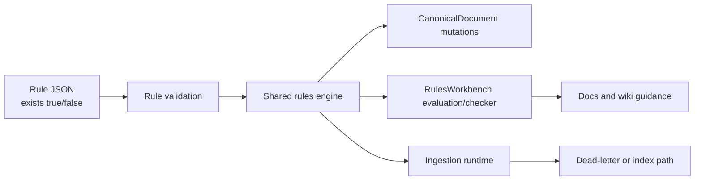

# Implementation Plan + Architecture — Work Package `055-rule-exists-semantics`

**Target output path:** `docs/055-rule-exists-semantics/plan-rule-exists-semantics_v0.01.md`

**Version:** `v0.01` (Draft)

**Based on:** `docs/055-rule-exists-semantics/spec-domain-rule-exists-semantics_v0.01.md`

---

# Implementation Plan

## Baseline

Current implemented behavior evidenced in the codebase:

- `src/UKHO.Search.Infrastructure.Ingestion/Rules/Validation/IngestionRulesValidator.cs`
  - accepts `exists` operator values when they are boolean
  - does not reject `"exists": false`
- `src/UKHO.Search.Infrastructure.Ingestion/Rules/Evaluation/IngestionRulesOperatorEvaluator.cs`
  - short-circuits to `false` when a path resolves to no values
  - implements `exists` only as a positive existence check over non-empty resolved values
  - does not honor the boolean value for `exists`
- `src/UKHO.Search.Infrastructure.Ingestion/Rules/Evaluation/IngestionRulesPredicateEvaluator.cs`
  - routes leaf predicates to the operator evaluator
  - has no special handling to restore `exists: false` semantics upstream
- `docs/ingestion-rules.md`
  - documents only the `exists: true` case
- repository rule files under `rules/file-share/*.json`
  - already contain multiple authored uses of `"exists": false`
- `tools/RulesWorkbench`
  - uses the shared ingestion rules engine for evaluation/checker flows
  - should inherit corrected runtime semantics automatically, but must still be reviewed and regression-tested
- `wiki/Ingestion-Rules.md` and `wiki/Tools-RulesWorkbench.md`
  - currently describe rules and checker behavior at a high level, but do not document completed negative-existence semantics

## Delta

This work package will introduce:

- completed runtime support for both `exists: true` and `exists: false`
- explicit semantic equivalence between `exists: false` and `not { exists: true }` for the same path and retained-value rules
- thorough unit and predicate-level tests for both boolean forms
- integration/regression coverage proving repository-style rules using `exists: false` now match as intended
- a repository rules review for current `exists: false` usage, with rule updates only if corrected semantics expose real overlap or intent problems
- RulesWorkbench verification and any required updates to tests or wording
- documentation updates in `docs/ingestion-rules.md` and relevant `wiki/*` pages

## Carry-over / Deferred Items

Out of scope for this work package:

- introducing new rule operators or a new rule schema version
- changing path parsing behavior unrelated to `exists`
- changing template expansion behavior unrelated to `exists`
- introducing a compatibility switch or dual-mode rule-evaluation path
- broad refactoring of RulesWorkbench UI beyond changes needed to keep it aligned with the corrected semantics

---

## Project Structure / Touchpoints

Primary code areas expected to change:

- Rules engine runtime
  - `src/UKHO.Search.Infrastructure.Ingestion/Rules/Evaluation/IngestionRulesOperatorEvaluator.cs`
  - `src/UKHO.Search.Infrastructure.Ingestion/Rules/Evaluation/IngestionRulesPredicateEvaluator.cs`
- Rule docs / authoring guidance
  - `docs/ingestion-rules.md`
- RulesWorkbench
  - `tools/RulesWorkbench/Services/RuleEvaluationService.cs`
  - `tools/RulesWorkbench/Services/RuleCheckerService.cs`
  - `tools/RulesWorkbench/Components/Pages/Checker.razor`
  - only if review shows wording or reporting changes are needed
- Wiki
  - `wiki/Ingestion-Rules.md`
  - `wiki/Tools-RulesWorkbench.md`
  - any additional affected page discovered during implementation review

Primary test areas expected to change:

- `test/UKHO.Search.Ingestion.Tests/Rules/OperatorEvaluatorTests.cs`
- `test/UKHO.Search.Ingestion.Tests/Rules/PredicateEvaluatorTests.cs`
- `test/UKHO.Search.Ingestion.Tests/Rules/RulesEngineSlice4ActionsIntegrationTests.cs`
- any repository-rules validation/regression test file suitable for checked-in rule coverage
- `test/RulesWorkbench.Tests/RuleCheckerServiceTests.cs`
- any RulesWorkbench evaluation/checker test file needed to prove alignment with the shared engine

---

## Slice 1: Correct `exists` runtime semantics with focused operator and predicate coverage

- [x] Work Item 1: Make `exists` behave as a full boolean operator in the shared rules engine - Completed
  - **Purpose**: Deliver the smallest runnable vertical slice where the shared rules engine correctly evaluates both `exists: true` and `exists: false`, with direct unit coverage proving the semantics.
  - **Acceptance Criteria**:
    - `exists: true` matches when a path resolves to at least one retained non-empty value.
    - `exists: false` matches when a path resolves to zero retained non-empty values.
    - missing, empty, and whitespace-only values are treated consistently for both boolean forms.
    - matched-values behavior is preserved for `exists: true` and explicitly empty for `exists: false`.
    - predicate-level tests prove the operator works correctly in leaf, `all`, `any`, and `not` forms.
  - **Definition of Done**:
    - Code implemented in the shared rules engine.
    - Unit and predicate-level tests passing.
    - Logging/error behavior unchanged except for corrected match outcomes.
    - Documentation note added in code comments only if non-obvious logic requires it.
    - Can execute end-to-end via the verification instructions below.
  - [x] Task 1: Update operator evaluation semantics - Completed
    - [x] Step 1: Review `IngestionRulesOperatorEvaluator` and define the exact retained-value rule for `exists`. - Completed
    - [x] Step 2: Implement boolean-aware `exists` handling so the operator uses the authored boolean value rather than acting as positive-only. - Completed
    - [x] Step 3: Ensure `exists: false` does not produce synthetic matched values. - Completed
    - [x] Step 4: Confirm non-`exists` operators retain current behavior. - Completed
  - [x] Task 2: Add focused unit tests for operator semantics - Completed
    - [x] Step 1: Extend `OperatorEvaluatorTests` for positive existence success/failure cases. - Completed
    - [x] Step 2: Add negative-existence tests for missing paths, empty values, whitespace-only values, and present non-empty values. - Completed
    - [x] Step 3: Assert matched-values behavior for both `exists: true` and `exists: false`. - Completed
  - [x] Task 3: Add predicate-level regression tests - Completed
    - [x] Step 1: Extend `PredicateEvaluatorTests` with leaf-level `exists: false` cases. - Completed
    - [x] Step 2: Add `all`/`any`/`not` scenarios proving negative existence composes correctly. - Completed
    - [x] Step 3: Add at least one wildcard-path predicate case if current fixtures support it. - Completed
  - **Files**:
    - `src/UKHO.Search.Infrastructure.Ingestion/Rules/Evaluation/IngestionRulesOperatorEvaluator.cs`: implement full boolean `exists` semantics.
    - `test/UKHO.Search.Ingestion.Tests/Rules/OperatorEvaluatorTests.cs`: add direct operator coverage.
    - `test/UKHO.Search.Ingestion.Tests/Rules/PredicateEvaluatorTests.cs`: add predicate-composition coverage.
  - **Work Item Dependencies**: none.
  - **Run / Verification Instructions**:
    - `dotnet test test\UKHO.Search.Ingestion.Tests\UKHO.Search.Ingestion.Tests.csproj --filter "FullyQualifiedName~OperatorEvaluatorTests|FullyQualifiedName~PredicateEvaluatorTests"`
  - **User Instructions**:
    - None.
  - **Completed Summary**:
    - Updated `IngestionRulesOperatorEvaluator` so `exists` now honors both boolean values, treats retained values as non-null/non-empty/non-whitespace strings, and returns empty matched-values for `exists: false`.
    - Extended `OperatorEvaluatorTests` with positive and negative existence coverage for missing, whitespace-only, and retained-value inputs.
    - Extended `PredicateEvaluatorTests` with leaf, `all`, `any`, `not`, and wildcard-path scenarios proving `exists: false` composes correctly through the shared predicate model.

---

## Slice 2: Prove repository-style rules now match and keep the rule set coherent

- [x] Work Item 2: Validate corrected semantics against repository-style rule behavior - Completed
  - **Purpose**: Deliver a runnable slice where representative rules authored with `exists: false` successfully mutate `CanonicalDocument`, and review the checked-in rules for any overlap or intent issues exposed by the correction.
  - **Acceptance Criteria**:
    - At least one representative repository-style rule using `exists: false` matches under the corrected engine and mutates the canonical document as intended.
    - Integration/regression tests capture the motivating scenario for missing-property matching.
    - Existing checked-in rules using `exists: false` are reviewed for overlap or unintended consequences.
    - Any repository rule updates required by the corrected semantics are applied and covered by tests.
  - **Definition of Done**:
    - Integration/regression tests added or updated.
    - Any necessary rule-file changes applied minimally.
    - No unexpected break in existing repository rule validation.
    - Documentation updated if authoring guidance changes.
    - Can execute end-to-end via the verification instructions below.
  - [x] Task 1: Add integration/regression coverage for `exists: false` - Completed
    - [x] Step 1: Select one or more representative rule shapes mirroring repository usage, including the S-100 missing-`product code` pattern. - Completed
    - [x] Step 2: Add or update rules-engine integration tests proving these rules now match and populate expected canonical fields. - Completed
    - [x] Step 3: Assert that the corrected behavior is equivalent in outcome to the explicit `not { exists: true }` form. - Completed
  - [x] Task 2: Review repository rules that already use `exists: false` - Completed
    - [x] Step 1: Enumerate current `exists: false` rule usage under `rules/file-share`. - Completed
    - [x] Step 2: Check for obvious overlap or contradictory fallback rules that become active under corrected semantics. - Completed
    - [x] Step 3: Update rule JSON only where corrected runtime semantics expose a genuine rule-definition issue. - Completed (No repository rule JSON changes were required in this slice.)
  - [x] Task 3: Re-run rule-focused regression coverage - Completed
    - [x] Step 1: Run the relevant ingestion tests that exercise rule loading and rule application. - Completed
    - [x] Step 2: If rule files were changed, verify no startup/configuration validation regressions occur. - Completed (No rule-file changes were needed, and the full ingestion test project passed.)
  - **Files**:
    - `test/UKHO.Search.Ingestion.Tests/Rules/RulesEngineSlice4ActionsIntegrationTests.cs`: add representative integration coverage for `exists: false` rule matching.
    - `rules/file-share/*.json`: review and update only if corrected semantics expose real overlap or intent issues.
    - any suitable repository-rules regression test file: add coverage if needed for checked-in rules.
  - **Work Item Dependencies**: Work Item 1.
  - **Run / Verification Instructions**:
    - `dotnet test test\UKHO.Search.Ingestion.Tests\UKHO.Search.Ingestion.Tests.csproj --filter "FullyQualifiedName~RulesEngine"`
    - If rule files change, also run the relevant repository rules validation/startup tests used by the ingestion suite.
  - **User Instructions**:
    - None.
  - **Completed Summary**:
    - Added repository-style rules-engine integration coverage proving the S-100 missing-`product code` pattern now matches and populates canonical title/taxonomy/search fields when `exists: false` is authored directly.
    - Added an integration regression proving a representative repository-style `exists: false` rule produces the same canonical outcome as the explicit `not { exists: true }` form.
    - Reviewed the checked-in `exists: false` rule usage under `rules/file-share` and found no immediate overlap or contradiction that required rule JSON changes in this slice.
    - Re-ran the full `UKHO.Search.Ingestion.Tests` project to confirm rule loading and application behavior remained green after the semantic correction.

---

## Slice 3: Confirm RulesWorkbench and documentation stay aligned with corrected semantics

- [x] Work Item 3: Align tooling, docs, and wiki with the completed `exists` behavior - Completed
  - **Purpose**: Deliver the final runnable slice where RulesWorkbench remains accurate under the corrected semantics and the repository documentation explains both boolean forms clearly.
  - **Acceptance Criteria**:
    - RulesWorkbench evaluation/checker behavior is reviewed and updated if necessary.
    - RulesWorkbench tests prove continued alignment with the shared engine.
    - `docs/ingestion-rules.md` explicitly documents both `exists: true` and `exists: false`.
    - Relevant `wiki` pages are updated to reflect completed negative-existence semantics.
  - **Definition of Done**:
    - Tooling code updated only if review shows a real behavior or wording gap.
    - RulesWorkbench tests passing.
    - Documentation and wiki updated together.
    - End-to-end local rule-diagnosis path remains demonstrable.
    - Can execute end-to-end via the verification instructions below.
  - [x] Task 1: Review and update RulesWorkbench - Completed
    - [x] Step 1: Inspect evaluation and checker flows to confirm they inherit corrected engine behavior without divergence. - Completed
    - [x] Step 2: Update page text, warnings, or reporting logic only if current wording becomes misleading under `exists: false` support. - Completed (No code changes were required in `RuleEvaluationService`, `RuleCheckerService`, or `Checker.razor`.)
    - [x] Step 3: Add or update RulesWorkbench tests that prove alignment with shared engine semantics. - Completed
  - [x] Task 2: Update authoring guidance and wiki - Completed
    - [x] Step 1: Update `docs/ingestion-rules.md` to describe both boolean forms and retained-value semantics. - Completed
    - [x] Step 2: Update `wiki/Ingestion-Rules.md` with explicit negative-existence guidance. - Completed
    - [x] Step 3: Update `wiki/Tools-RulesWorkbench.md` if tool behavior or explanation needs refinement. - Completed
    - [x] Step 4: Update any additional wiki page discovered during implementation review if it references `exists` semantics or rule-checker interpretation. - Completed (No additional wiki page updates were required.)
  - [x] Task 3: Verify documentation-backed behavior - Completed
    - [x] Step 1: Run RulesWorkbench tests. - Completed
    - [x] Step 2: Run a focused local check path or equivalent automated test proving checker/evaluation behavior remains understandable after the engine change. - Completed
  - **Files**:
    - `tools/RulesWorkbench/Services/RuleEvaluationService.cs`: update only if review shows a real alignment gap.
    - `tools/RulesWorkbench/Services/RuleCheckerService.cs`: update only if review shows a real alignment gap.
    - `tools/RulesWorkbench/Components/Pages/Checker.razor`: update only if wording/reporting needs to change.
    - `test/RulesWorkbench.Tests/RuleCheckerServiceTests.cs`: add/update alignment coverage as needed.
    - `docs/ingestion-rules.md`: document completed boolean `exists` semantics.
    - `wiki/Ingestion-Rules.md`: update rule-authoring guidance.
    - `wiki/Tools-RulesWorkbench.md`: update tool guidance if needed.
  - **Work Item Dependencies**: Work Item 2.
  - **Run / Verification Instructions**:
    - `dotnet test test\RulesWorkbench.Tests\RulesWorkbench.Tests.csproj`
    - `dotnet test test\UKHO.Search.Ingestion.Tests\UKHO.Search.Ingestion.Tests.csproj --filter "FullyQualifiedName~RulesEngine|FullyQualifiedName~PredicateEvaluatorTests|FullyQualifiedName~OperatorEvaluatorTests"`
    - For local manual verification, run Aspire services mode and use `RulesWorkbench` `/checker` or `/evaluate` with a payload/rule shape that depends on `exists: false`.
  - **User Instructions**:
    - If doing manual verification, start the local services stack before opening `RulesWorkbench`.
  - **Completed Summary**:
    - Reviewed the RulesWorkbench evaluation and checker flows and confirmed they already inherit the corrected `exists` behavior through the shared ingestion rules engine, so no runtime code changes were needed in the workbench services or pages.
    - Added `RuleEvaluationServiceTests` plus lightweight RulesWorkbench test support helpers to prove the workbench evaluation path now matches a repository-style `exists: false` rule using the shared engine.
    - Updated `docs/ingestion-rules.md`, `wiki/Ingestion-Rules.md`, and `wiki/Tools-RulesWorkbench.md` so authoring and tooling guidance explicitly documents both `exists: true` and `exists: false` semantics.
    - Ran the full `RulesWorkbench.Tests` and `UKHO.Search.Ingestion.Tests` projects to confirm tooling alignment and end-to-end documentation-backed behavior remain green.

---

# Architecture

## Overall Technical Approach

The work is a targeted semantic correction within the existing ingestion rules DSL.

The core approach is:

- keep the current rule JSON contract unchanged (`exists` remains a boolean-valued operator)
- correct the shared runtime evaluator so it honors both boolean values
- prove the semantics through layered tests: operator, predicate, integration, and tooling alignment
- treat RulesWorkbench as a consumer of the shared engine rather than as a separate implementation
- update repository documentation and wiki pages so authoring guidance matches actual runtime behavior

Key technical considerations:

- preserve existing `exists: true` behavior
- define `exists: false` as absence of retained non-empty values
- keep `exists: false` equivalent in outcome to `not { exists: true }`
- avoid unrelated refactoring of parser, templating, or schema versioning
- assume corrected semantics will activate already-authored repository rules that currently never match

## Frontend

There is no new frontend architecture for this work.

The relevant UI surface is `tools/RulesWorkbench`, a Blazor Server developer tool.

Relevant pages/components to review:

- `tools/RulesWorkbench/Components/Pages/Checker.razor`
  - presents checker status, matched rules, candidate rules, and final canonical document output
  - may need wording updates only if current messaging becomes misleading once `exists: false` matches are active
- `tools/RulesWorkbench/Components/Pages/Evaluate.razor`
  - provides direct rule-evaluation behavior using the shared engine
  - should inherit corrected semantics automatically, but should be reviewed for test alignment

User flow after implementation:

1. load or author a payload/rule shape that depends on `exists: false`
2. evaluate or check it in RulesWorkbench
3. see match outcomes that align with ingestion runtime behavior
4. use updated docs/wiki guidance to interpret the result

## Backend

The backend impact is centered on the shared ingestion rules engine and its tests.

Relevant components:

- `IngestionRulesOperatorEvaluator`
  - core location for implementing full boolean `exists` semantics
- `IngestionRulesPredicateEvaluator`
  - ensures corrected operator behavior composes through leaf and boolean predicate structures
- ingestion rules integration tests
  - prove repository-style rules now mutate `CanonicalDocument` correctly
- repository rule assets under `rules/file-share`
  - reviewed to confirm authored `exists: false` intent remains coherent when activated
- RulesWorkbench services
  - continue to consume the corrected shared rules engine rather than duplicating logic

Backend data flow after implementation:

1. rule JSON is validated as today
2. a predicate leaf resolves its path values
3. the operator evaluator filters retained non-empty values
4. the authored boolean for `exists` determines match success
5. predicate composition (`all`/`any`/`not`) proceeds normally
6. matching rules mutate `CanonicalDocument`
7. ingestion runtime and RulesWorkbench both reflect the same corrected semantics

---

## Overall Approach Summary

This plan delivers the feature in three vertical slices:

1. correct the shared `exists` runtime semantics and prove them with focused tests
2. validate the correction against repository-style rules and review the checked-in rule set for overlap or intent issues
3. confirm RulesWorkbench, docs, and wiki remain aligned with the corrected semantics

The key implementation consideration is that this is a behavioral correction, not a schema redesign. The highest-value work is therefore semantic accuracy, regression safety, and documentation/tooling alignment rather than broad architectural change.
