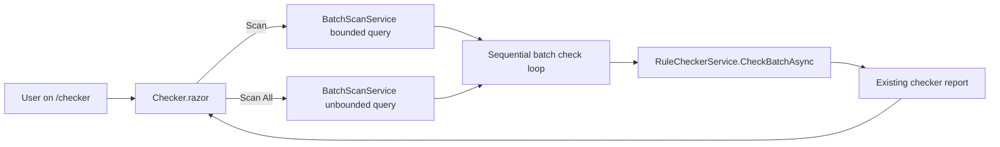

# Implementation Plan + Architecture — Work Package `056-rules-workbench-scan-all`

**Target output path:** `docs/056-rules-workbench-scan-all/plan-rules-workbench-scan-all_v0.01.md`

**Version:** `v0.01` (Draft)

**Based on:** `docs/056-rules-workbench-scan-all/spec-domain-rules-workbench-scan-all_v0.01.md`

---

# Implementation Plan

## Baseline

Current implemented behavior evidenced in the codebase:

- `tools/RulesWorkbench/Components/Pages/Checker.razor`
  - renders a business-unit scan section with a `Max rows` input and one button labelled `Start scan`
  - exposes one bounded scan action via `StartScanAsync`
  - uses `IsRunningScan` to disable the business-unit selector, `Max rows`, and the current scan button while a scan is in progress
  - stops at the first non-`OK` checker result and shows that batch's existing detailed report
- `tools/RulesWorkbench/Services/BatchScanService.cs`
  - provides `GetBatchesForBusinessUnitAsync(int businessUnitId, int maxRows, CancellationToken)`
  - uses `SELECT TOP (@maxRows)` to bound the batch set
  - returns deterministic ordering by `CreatedOn ASC, Id ASC`
- `tools/RulesWorkbench/Services/RuleCheckerService.cs`
  - already supports checking an individual batch and returning the existing report shape used by the page
  - does not need a new report model for the requested behavior because `Scan All` still stops at the first non-`OK` result
- `test/RulesWorkbench.Tests/BatchScanServiceTests.cs`
  - currently covers only validation and failure paths for the bounded batch-scan service
  - does not yet cover an unbounded retrieval path
- `wiki/Tools-RulesWorkbench.md`
  - documents the `Checker` page business-unit scan as a bounded scan focused on finding the first non-`OK` result quickly
  - does not yet describe separate `Scan` and `Scan All` actions

## Delta

This work package will introduce:

- a rename of the existing business-unit scan button from `Start scan` to `Scan`
- a second inline button labelled `Scan All`
- an unbounded business-unit scan path that removes the current `Max rows` cap while preserving the existing stop-at-first-non-`OK` behavior
- UI-state rules so `Scan`, `Scan All`, and `Max rows` are disabled appropriately while a scan is running
- supporting batch-scan service coverage for bounded versus unbounded retrieval
- updated `RulesWorkbench` documentation describing both scan modes and their differing use of `Max rows`

## Carry-over / Deferred Items

Out of scope for this work package:

- progress indicators beyond the existing busy-state feedback
- cancellation support for long-running scans
- a new aggregate results grid or multi-result reporting experience
- changes to `RuleCheckerService` report semantics or the checker result cards beyond what is needed to preserve the current single-result flow
- changes to the wider ingestion pipeline or rules engine

---

## Project Structure / Touchpoints

Primary code areas expected to change:

- Checker page UI and orchestration
  - `tools/RulesWorkbench/Components/Pages/Checker.razor`
- Batch retrieval service
  - `tools/RulesWorkbench/Services/BatchScanService.cs`
- Documentation
  - `wiki/Tools-RulesWorkbench.md`

Primary test areas expected to change:

- `test/RulesWorkbench.Tests/BatchScanServiceTests.cs`
- any existing or new RulesWorkbench test covering checker scan orchestration if practical within the current test project
- manual verification of `tools/RulesWorkbench/Components/Pages/Checker.razor` remains important because this is a Blazor UI workflow and there is no existing dedicated checker page UI automation evident in the current workspace

---

## Slice 1: Add `Scan All` as an end-to-end unbounded variant of the existing scan flow

- [x] Work Item 1: Deliver an unbounded business-unit scan that keeps the existing first-failure workflow - Completed
  - **Purpose**: Add user-visible `Scan` and `Scan All` actions while preserving the current checker result experience and reusing the same per-batch evaluation path.
  - **Acceptance Criteria**:
    - The business-unit scan button text is changed from `Start scan` to `Scan`.
    - A second inline button labelled `Scan All` is shown in the same business-unit scan area.
    - Clicking `Scan` preserves the current bounded behavior using `Max rows` and stopping at the first non-`OK` batch.
    - Clicking `Scan All` loads the full selected business-unit batch set, ignores `Max rows`, and still stops at the first non-`OK` batch.
    - When either scan mode stops on a non-`OK` batch, the existing detailed checker report is shown for that batch.
    - When `Scan All` completes without a non-`OK` batch, the page shows an informational message that the full selected business unit was scanned successfully.
  - **Definition of Done**:
    - Code implemented in the page and service layers.
    - Focused service and orchestration tests added or updated.
    - Logging and error handling remain aligned with current RulesWorkbench behavior.
    - Documentation updated for the new scan actions.
    - Can execute end to end via the verification instructions below.
  - [x] Task 1: Extend the batch retrieval service for unbounded business-unit scans - Completed
    - [x] Step 1: Review `BatchScanService` and choose the clearest contract shape for bounded versus unbounded retrieval. - Completed
    - [x] Step 2: Add an explicit unbounded retrieval path that returns all batches for the selected business unit while preserving deterministic ordering. - Completed
    - [x] Step 3: Keep the existing bounded retrieval path intact for `Scan`. - Completed
    - [x] Step 4: Add logging that makes it clear whether the service loaded a bounded or unbounded batch set. - Completed
  - [x] Task 2: Add the second scan action and wire both page flows - Completed
    - [x] Step 1: Update `Checker.razor` button text from `Start scan` to `Scan`. - Completed
    - [x] Step 2: Add an inline `Scan All` button alongside the existing scan controls. - Completed
    - [x] Step 3: Factor the current scan loop as needed so both actions reuse the same stop-at-first-non-`OK` evaluation path. - Completed
    - [x] Step 4: Ensure `Scan` uses the bounded batch source and `Scan All` uses the unbounded batch source. - Completed
    - [x] Step 5: Preserve current empty-business-unit and selected-business-unit validation behavior for both actions. - Completed
  - [x] Task 3: Preserve current report semantics and make completion messages mode-aware - Completed
    - [x] Step 1: Keep the first non-`OK` batch as the detailed report target for both scan modes. - Completed
    - [x] Step 2: Distinguish bounded versus unbounded completion messages so users can tell whether `Max rows` was applied. - Completed
    - [x] Step 3: Keep the single-batch checker workflow unchanged. - Completed
  - **Files**:
    - `tools/RulesWorkbench/Services/BatchScanService.cs`: add an unbounded retrieval path while preserving the current bounded query.
    - `tools/RulesWorkbench/Components/Pages/Checker.razor`: rename the existing button, add `Scan All`, and route each button to the correct scan source.
    - `wiki/Tools-RulesWorkbench.md`: document the two business-unit scan actions and their differing use of `Max rows`.
  - **Work Item Dependencies**: none.
  - **Run / Verification Instructions**:
    - `dotnet test test\RulesWorkbench.Tests\RulesWorkbench.Tests.csproj --filter "FullyQualifiedName~BatchScanServiceTests"`
    - `dotnet run --project tools\RulesWorkbench\RulesWorkbench.csproj`
    - In the running tool, navigate to `/checker`, select a business unit, confirm `Scan` respects `Max rows`, and confirm `Scan All` scans beyond that limit but still stops at the first non-`OK` result.
  - **User Instructions**:
    - Ensure the local services and backing data needed by `RulesWorkbench` are available before manual checker verification.
  - **Completed Summary**:
    - Added `BatchScanService.GetAllBatchesForBusinessUnitAsync(...)` and refactored the shared SQL path so bounded and unbounded scans preserve the same deterministic ordering while logging the scan mode explicitly.
    - Updated `Checker.razor` to rename the existing business-unit scan button to `Scan`, add an inline `Scan All` button, and route both actions through shared stop-at-first-non-`OK` scan-loop logic.
    - Added `BusinessUnitScanLoop` plus `BusinessUnitScanExecutionResult` so the scan orchestration is reusable and unit-testable without changing the existing checker report model.
    - Updated `BatchScanServiceTests`, added `BusinessUnitScanLoopTests`, updated `wiki/Tools-RulesWorkbench.md`, and verified the feature with `RulesWorkbench.Tests` plus a successful workspace build.

---

## Slice 2: Harden UI-state rules, regression coverage, and operator guidance for the new scan mode

- [x] Work Item 2: Finalize disablement behavior, regression coverage, and documentation clarity - Completed
  - **Purpose**: Make the new scan experience robust by explicitly handling button/input disablement and capturing the changed behavior in tests and wiki guidance.
  - **Acceptance Criteria**:
    - While `Scan All` is running, the `Scan` button is disabled.
    - While `Scan` is running, the `Scan All` button is disabled.
    - `Max rows` remains visible but is disabled while `Scan All` is running.
    - Existing busy-state feedback remains the only required in-progress indication.
    - Tests cover bounded versus unbounded retrieval intent and the key busy-state rules.
    - Documentation explains that `Scan All` differs only by removing the batch limit; it does not change the stop-on-first-non-`OK` behavior.
  - **Definition of Done**:
    - Busy-state logic implemented and verified.
    - Test coverage updated for the affected RulesWorkbench service and checker orchestration paths.
    - Documentation updated to remove ambiguity around `Scan All` semantics.
    - Manual checker verification completed against the updated UI.
    - Can execute end to end via the verification instructions below.
  - [x] Task 1: Tighten page-state rules for the two scan buttons and `Max rows` - Completed
    - [x] Step 1: Review the current `IsRunningScan` usage and any derived disablement properties in `Checker.razor`. - Completed
    - [x] Step 2: Ensure both scan buttons are disabled whenever either scan mode is active. - Completed
    - [x] Step 3: Ensure `Max rows` remains visible but is disabled during `Scan All` execution. - Completed
    - [x] Step 4: Keep the business-unit selector disablement aligned with the current running-state pattern. - Completed
  - [x] Task 2: Expand regression coverage - Completed
    - [x] Step 1: Update `BatchScanServiceTests` to cover the new unbounded retrieval path and deterministic ordering expectations where feasible. - Completed
    - [x] Step 2: Add or update RulesWorkbench tests for checker scan orchestration and mode-specific messages if the current test project can exercise that path cleanly. - Completed
    - [x] Step 3: Prefer the lightest existing test seam in `test/RulesWorkbench.Tests` rather than introducing a large new UI-test harness solely for this small feature. - Completed
  - [x] Task 3: Finalize documentation and operator guidance - Completed
    - [x] Step 1: Update `wiki/Tools-RulesWorkbench.md` so the Checker page section explicitly describes `Scan` versus `Scan All`. - Completed
    - [x] Step 2: Clarify that `Scan All` removes the `Max rows` cap only and still stops at the first non-`OK` result. - Completed
    - [x] Step 3: Keep the documented checker scope aligned with the existing rule-path-only behavior. - Completed
  - **Files**:
    - `tools/RulesWorkbench/Components/Pages/Checker.razor`: finalize disablement and mode-aware messaging.
    - `test/RulesWorkbench.Tests/BatchScanServiceTests.cs`: add bounded versus unbounded retrieval coverage.
    - `test/RulesWorkbench.Tests\*.cs`: add checker orchestration tests only where an existing seam supports them cleanly.
    - `wiki/Tools-RulesWorkbench.md`: update operator-facing guidance.
  - **Work Item Dependencies**: Work Item 1.
  - **Run / Verification Instructions**:
    - `dotnet test test\RulesWorkbench.Tests\RulesWorkbench.Tests.csproj`
    - `dotnet run --project tools\RulesWorkbench\RulesWorkbench.csproj`
    - In the running tool, navigate to `/checker`, start `Scan All`, and confirm `Scan`, `Scan All`, and `Max rows` are disabled while the scan is running.
    - Repeat with `Scan` to confirm the reciprocal button disablement and bounded-scan completion messaging.
  - **User Instructions**:
    - Use a business unit with more batches than the chosen `Max rows` value so the distinction between `Scan` and `Scan All` is visible during manual verification.
  - **Completed Summary**:
    - Added `BusinessUnitScanMode`, `BusinessUnitScanUiState`, and `BatchScanQueries` so the checker page now has explicit, testable state for bounded versus unbounded scans, including reciprocal button disablement and `Max rows` disablement only during `Scan All`.
    - Updated `Checker.razor` to use the new UI-state model, keeping the business-unit selector tied to the existing running-state pattern while making scan button text and disablement mode-aware.
    - Expanded `BatchScanServiceTests`, `BusinessUnitScanLoopTests`, and added `BusinessUnitScanUiStateTests` to cover bounded/unbounded query intent, mode-specific completion messages, and the key busy-state rules without introducing a heavier UI test harness.
    - Reused the already-updated `wiki/Tools-RulesWorkbench.md` guidance, ran the full `RulesWorkbench.Tests` project plus a workspace build successfully, and left final manual `/checker` verification as the only recommended follow-up.

---

## Summary / Overall Approach

The implementation should stay deliberately small and reuse the current checker design:

- keep the existing first-failure reporting model
- add one new user choice, `Scan All`, that changes only the source batch set
- avoid introducing aggregate-result UI, progress reporting, or cancellation controls
- keep the main technical work in `Checker.razor` and `BatchScanService.cs`
- back the change with focused RulesWorkbench tests and an updated checker wiki page

This keeps the feature aligned with the spec and minimizes regression risk in the existing Blazor Server checker workflow.

---

# Architecture

## Overall Technical Approach

The feature is a small extension of the existing `RulesWorkbench` checker workflow.

The technical approach is:

- keep `RuleCheckerService` as the single-batch evaluation engine
- keep the page-level orchestration in `Checker.razor`
- add a second page action that selects an unbounded batch retrieval path instead of the existing bounded path
- preserve the current first non-`OK` stop behavior and existing report presentation
- document the difference between scan modes clearly so users understand that `Scan All` removes only the batch cap

Key considerations:

- deterministic ordering must remain unchanged between both scan modes
- the only semantic difference between `Scan` and `Scan All` is whether `Max rows` limits the batch set
- existing busy-state feedback is sufficient for this work item
- the change should stay localized to RulesWorkbench rather than altering shared ingestion components

## Frontend

Frontend scope is the Blazor Server checker page:

- `tools/RulesWorkbench/Components/Pages/Checker.razor`
  - continue to host the single-batch and business-unit scan workflows
  - rename the current business-unit scan button to `Scan`
  - add an inline `Scan All` button
  - manage UI disablement for the business-unit selector, both scan buttons, and `Max rows`
  - keep the existing result cards and detail sections unchanged

User flow after implementation:

1. open `/checker`
2. select a business unit
3. either:
   - enter `Max rows` and click `Scan` for a bounded search, or
   - click `Scan All` for an unbounded search
4. review the first non-`OK` batch report if one is found, or the mode-specific success message if none is found

## Backend

Backend scope is limited to the RulesWorkbench service layer:

- `tools/RulesWorkbench/Services/BatchScanService.cs`
  - continue to own business-unit batch retrieval from SQL Server
  - expose bounded and unbounded retrieval paths with the same ordering rules
- `tools/RulesWorkbench/Services/RuleCheckerService.cs`
  - remain unchanged as the per-batch checker service unless implementation review finds a small helper extraction useful
  - continue to produce the existing `RuleCheckerRunResultDto` / `RuleCheckerReportDto` used by the page

Data flow:

1. page validates selected business unit
2. page loads either a bounded or unbounded batch list from `BatchScanService`
3. page checks each batch sequentially through `RuleCheckerService`
4. page stops on the first non-`OK` result or finishes cleanly if no such result is found
5. page renders the existing checker report UI and mode-aware info messaging
