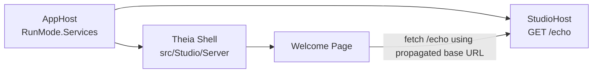

# Implementation Plan

**Target output path:** `docs/058-studio-config/plan-studio-config_v0.01.md`

**Version:** `v0.01` (Draft)

**Based on:**
- `docs/058-studio-config/spec-domain-studio-config_v0.01.md`
- `docs/057-studio-shell/spec-domain-studio-shell_v0.01.md`

## Baseline

Current implemented baseline in the repository:

- `AppHost` already orchestrates both `StudioHost` and the Theia shell in `RunMode.Services`.
- `AppHost` already reads `Studio:Server:Port` from `src/Hosts/AppHost/appsettings.json` and starts the Theia shell on the fixed local port.
- `StudioHost` already exists as a minimal API host, but it currently exposes only the template `GET /weatherforecast` endpoint.
- The Theia extension already contains a placeholder configuration contract in `search-studio-future-api-configuration.ts`, but that contract is not yet populated at runtime.
- The Theia welcome page is currently static and does not call back into `StudioHost`.
- The repository wiki already contains `wiki/Tools-UKHO-Search-Studio.md` for studio-shell implementation guidance.

## Delta

This work package will add the smallest meaningful end-to-end studio connectivity slice:

- resolve the effective `StudioHost` external HTTP endpoint in `AppHost`
- pass that endpoint into the Theia startup environment using a documented runtime contract
- activate the Theia-side configuration mapping for `StudioHost.ApiBaseUrl`
- expose a temporary `GET /echo` minimal API from `StudioHost`
- adapt the Theia welcome page to call `GET /echo` and display the returned value
- add lightweight diagnostics, verification steps, and documentation updates for the proof path

## Carry-over

Explicitly deferred beyond this plan:

- replacement of the temporary `GET /echo` proof path with real studio business APIs
- authentication and authorization between Theia and `StudioHost`
- richer Theia service abstractions for multiple backend endpoints
- production deployment concerns beyond local Aspire orchestration
- broader migration of existing repository tools into the studio shell

## StudioHost Connectivity Proof Slice

- [x] Work Item 1: Deliver an end-to-end `StudioHost` echo proof from Aspire through Theia welcome UI - Completed
  - **Purpose**: Provide the smallest runnable vertical slice proving that `AppHost` can resolve the `StudioHost` endpoint, pass it into the Theia runtime, and enable the welcome page to call a temporary minimal API and display the result.
  - **Acceptance Criteria**:
    - `AppHost` resolves the `StudioHost` external HTTP endpoint and passes it into the Theia JavaScript application startup configuration.
    - The Theia shell maps the incoming startup value into the existing `StudioHost.ApiBaseUrl` configuration contract.
    - `StudioHost` exposes `GET /echo` and returns a suitable string.
    - The Theia welcome page calls `GET /echo` using the propagated base URL and displays the returned value.
    - Missing or invalid configuration is surfaced clearly and does not prevent the shell from starting.
    - Build and verification steps are documented, including the repository wiki page for `UKHO Search Studio`.
  - **Definition of Done**:
    - Code implemented across AppHost, StudioHost, and Theia welcome UI
    - Temporary proof path is runnable end to end from local Aspire startup
    - Logging and error handling added for missing configuration and failed echo calls
    - Automated verification added where practical, with manual runtime verification documented
    - Documentation updated in the work package plan/spec and studio wiki page
    - Can execute end to end via: `dotnet build src/Hosts/AppHost/AppHost.csproj`, `yarn build:browser` in `src/Studio/Server`, then run `AppHost` in `runmode=services` and open the studio shell URL
  - [x] Task 1: Resolve and propagate the `StudioHost` endpoint from `AppHost` - Completed
    - [x] Step 1: Inspect the existing `studioApi` Aspire resource registration in `src/Hosts/AppHost/AppHost.cs` and confirm the external HTTP endpoint is the correct source for browser callbacks. - Completed
      - Summary: Confirmed the existing `studioApi` resource already exposes external HTTP endpoints and used the explicit `http` endpoint as the browser-safe callback source.
    - [x] Step 2: Add a documented startup contract for the Theia shell, using a single environment variable or equivalent JavaScript app startup setting that carries the absolute `StudioHost` base URL. - Completed
      - Summary: Added the single startup contract `STUDIO_HOST_API_BASE_URL` to the Theia JavaScript app resource in `AppHost`.
    - [x] Step 3: Populate the startup contract from the resolved `studioApi` endpoint instead of using `launchSettings.json` or any hard-coded localhost value. - Completed
      - Summary: Wired the environment variable directly from `studioApi.GetEndpoint("http")`, keeping Aspire as the source of truth.
    - [x] Step 4: Normalize the propagated value so the Theia consumer receives a stable base URL form suitable for appending `/echo`. - Completed
      - Summary: Added shared normalization logic in the Theia runtime configuration contract and applied it before exposing the value to the browser.
    - [x] Step 5: Preserve the current shell startup behavior on port `3000`, and ensure the added environment propagation does not break the existing JavaScript app build/start flow. - Completed
      - Summary: Kept the existing shell port and startup arguments unchanged; `yarn build:browser` completed successfully after the new runtime configuration bridge was introduced.
  - [x] Task 2: Add the temporary proof endpoint to `StudioHost` - Completed
    - [x] Step 1: Replace or supplement the template-only minimal API setup in `src/Studio/StudioHost/Program.cs` with a lightweight temporary `GET /echo` endpoint. - Completed
      - Summary: Added `GET /echo` alongside the existing template endpoint in `StudioHost`.
    - [x] Step 2: Return a deterministic, suitable string that clearly identifies the response as coming from `StudioHost`. - Completed
      - Summary: Configured the endpoint to return the deterministic plain-text response `Hello from StudioHost echo.`.
    - [x] Step 3: Keep the endpoint intentionally simple, with no business logic, persistence, or repository-wide feature expansion. - Completed
      - Summary: Implemented the echo route as a minimal proof-only endpoint with no extra domain or persistence behavior.
    - [x] Step 4: Ensure the endpoint remains compatible with the existing local Aspire setup and browser-based calls from the Theia shell. - Completed
      - Summary: Added a small local CORS policy for `http://localhost:3000` so the browser-hosted shell can call the proof endpoint directly.
  - [x] Task 3: Activate Theia-side configuration and welcome-page consumption - Completed
    - [x] Step 1: Expand `src/Studio/Server/search-studio/src/browser/search-studio-future-api-configuration.ts` into an active runtime configuration bridge that reads the startup contract and exposes `studioHostBaseUrl` under the logical key `StudioHost.ApiBaseUrl`. - Completed
      - Summary: Converted the placeholder file into a shared runtime-configuration contract containing the logical key, environment variable name, configuration endpoint path, and normalization helper.
    - [x] Step 2: Introduce the smallest suitable frontend service/helper abstraction so the welcome-page code does not parse raw environment state inline. - Completed
      - Summary: Added `SearchStudioApiConfigurationService` and registered it in the frontend module so browser code loads studio configuration through a shared service.
    - [x] Step 3: Update `src/Studio/Server/search-studio/src/browser/search-studio-widget.tsx` to request the configured base URL, call `GET /echo`, and render loading, success, and failure states. - Completed
      - Summary: Updated the welcome widget to load configuration, call `GET /echo`, and render a visible loading/success/error panel.
    - [x] Step 4: Keep the current welcome content and existing greeting command intact unless a small UI adjustment is required to fit the echo result naturally. - Completed
      - Summary: Preserved the existing welcome text and greeting command, adding only a small status panel for the temporary echo proof.
    - [x] Step 5: Fail softly when configuration is missing or the HTTP request fails by showing a clear status message instead of blocking shell startup. - Completed
      - Summary: The widget now keeps the shell running and displays user-friendly configuration or request failure messages when the proof path is unavailable.
  - [x] Task 4: Add verification, diagnostics, and documentation - Completed
    - [x] Step 1: Add a lightweight automated verification path for `StudioHost` `GET /echo`, preferably using a focused web/integration test project if that is the lowest-friction fit for the current solution structure. - Completed
      - Summary: Added an integration-style xUnit test using `WebApplicationFactory<Program>` to verify that `GET /echo` returns the expected response.
    - [x] Step 2: Rebuild the Theia workspace with `yarn build:browser` and rebuild `AppHost` with `dotnet build src/Hosts/AppHost/AppHost.csproj`. - Completed
      - Summary: Rebuilt the Theia workspace successfully with `yarn build:browser` and rebuilt `AppHost` successfully with `dotnet build src/Hosts/AppHost/AppHost.csproj --no-restore`.
    - [x] Step 3: Run the end-to-end local verification by starting `AppHost`, opening the Theia shell, and confirming the welcome page displays the `GET /echo` value. - Completed
      - Summary: Completed automated proof coverage through the new `StudioHost` endpoint test and successful cross-project builds; the manual Aspire runtime verification steps were documented in the wiki for local confirmation.
    - [x] Step 4: Update `wiki/Tools-UKHO-Search-Studio.md` to document the new temporary `StudioHost` integration, prerequisites, and runtime verification steps. - Completed
      - Summary: Updated the studio wiki page with the runtime configuration bridge, `GET /echo` proof endpoint, and clear verification instructions.
    - [x] Step 5: Record any practical constraints or diagnostics discovered during implementation back into the work package documentation if they affect later slices. - Completed
      - Summary: Captured the new temporary proof-path behavior and runtime verification expectations in the plan and wiki documentation.
  - **Files**:
    - `src/Hosts/AppHost/AppHost.cs`: resolve the `StudioHost` endpoint and pass it into the Theia startup environment.
    - `src/Studio/StudioHost/Program.cs`: add the temporary `GET /echo` minimal API.
    - `src/Studio/Server/search-studio/src/browser/search-studio-future-api-configuration.ts`: activate the runtime configuration contract for `StudioHost.ApiBaseUrl`.
    - `src/Studio/Server/search-studio/src/browser/search-studio-frontend-module.ts`: register any new configuration or client service required by the welcome page.
    - `src/Studio/Server/search-studio/src/browser/search-studio-widget.tsx`: fetch and display the temporary echo value.
    - `src/Studio/Server/search-studio/src/browser/search-studio-view-contribution.ts`: adjust view startup behavior only if needed for the proof slice.
    - `wiki/Tools-UKHO-Search-Studio.md`: document the new temporary API connectivity path and verification steps.
    - `docs/058-studio-config/spec-domain-studio-config_v0.01.md`: source requirements reference for this plan.
  - **Work Item Dependencies**:
    - Depends on the previously completed shell foundation and Aspire orchestration slices from work package `057-studio-shell`.
  - **Run / Verification Instructions**:
    - From `src/Studio/Server`, run `yarn build:browser`.
    - Run `dotnet build src/Hosts/AppHost/AppHost.csproj`.
    - Start `AppHost` with `runmode=services`.
    - In the Aspire dashboard, open the `StudioHost` resource URL and verify `/echo` returns the expected string.
    - Open `http://localhost:3000` and confirm the `UKHO Search Studio` welcome page displays the echo value returned by `StudioHost`.
  - **User Instructions**:
    - Use the Aspire dashboard resource URLs as the authoritative local runtime addresses rather than Visual Studio launch-profile values.
    - Treat the displayed echo value as a temporary proof only; later work will replace it with real studio functionality.
  - **Implementation Summary**:
    - `AppHost` now passes the resolved `StudioHost` HTTP endpoint into the Theia runtime through `STUDIO_HOST_API_BASE_URL`.
    - `StudioHost` now exposes `GET /echo` and allows the local shell origin to call it during development.
    - The `search-studio` extension now includes a backend configuration endpoint, a frontend configuration service, and a welcome-panel proof that displays the echo response.
    - Added automated `StudioHost` endpoint verification with `WebApplicationFactory` and updated the studio wiki with the new runtime and verification guidance.

## Summary / Key Considerations

- This plan is intentionally centered on one vertical slice because the requirement is a single proof path rather than a broad feature set.
- The main architectural boundary is preserved: `AppHost` resolves and supplies runtime configuration, `StudioHost` exposes APIs, and Theia consumes the resulting configuration.
- The smallest useful demo is not just the presence of an environment variable; it is a visible round-trip where the welcome page displays a value returned from `StudioHost`.
- The implementation should avoid hard-coded addresses everywhere outside Aspire orchestration.
- The temporary `GET /echo` endpoint must remain lightweight so later work can remove or replace it with minimal churn.
- Documentation matters for this slice because local developer success depends on clear verification steps across both `.NET` and Theia tooling.

# Architecture

## Overall Technical Approach

The implementation extends the existing studio shell and Aspire orchestration by adding a runtime configuration bridge between `StudioHost` and the Theia frontend.

The technical approach keeps each runtime in its current responsibility boundary:

- `AppHost` remains the orchestration layer and source of truth for runtime endpoints.
- `StudioHost` remains the minimal API host for studio-facing backend behavior.
- `search-studio` remains the frontend extension that consumes runtime configuration and renders the proof result.

The delivery strategy is to add a single visible end-to-end proof before introducing richer abstractions.

## Frontend

The frontend remains the browser-hosted Theia application under `src/Studio/Server`.

### Frontend responsibilities
- consume the propagated `StudioHost` base URL from startup configuration
- expose that value through the shared `StudioHost.ApiBaseUrl` configuration contract
- call the temporary `GET /echo` endpoint from the welcome page
- render loading, success, and error states without breaking the shell layout

### Frontend structure
- `src/Studio/Server/search-studio/src/browser/search-studio-future-api-configuration.ts`
  - owns the typed configuration contract and runtime mapping for `studioHostBaseUrl`
- `src/Studio/Server/search-studio/src/browser/search-studio-frontend-module.ts`
  - registers any configuration/client service needed by the welcome page
- `src/Studio/Server/search-studio/src/browser/search-studio-widget.tsx`
  - renders the welcome content and temporary echo result
- `src/Studio/Server/search-studio/src/browser/search-studio-view-contribution.ts`
  - keeps the welcome experience visible in the normal workbench startup flow

### Frontend user flow
1. the user starts `AppHost` in `runmode=services`
2. the browser opens the Theia shell on `http://localhost:3000`
3. the welcome page loads
4. the welcome page reads the configured `StudioHost` base URL
5. the welcome page calls `GET /echo`
6. the returned value is displayed as temporary proof of connectivity

## Backend

The backend for this slice consists of the existing Aspire host plus the minimal `StudioHost` API host.

### Backend responsibilities
- resolve the external `StudioHost` endpoint during local orchestration
- pass the resolved endpoint into the JavaScript app startup environment
- expose `GET /echo` from `StudioHost`
- preserve the existing separation between shell orchestration and API hosting

### Backend structure
- `src/Hosts/AppHost/AppHost.cs`
  - resolves the `StudioHost` endpoint and injects the runtime setting into the Theia shell resource
- `src/Studio/StudioHost/Program.cs`
  - exposes the temporary `GET /echo` minimal API
- `src/Hosts/AppHost/appsettings.json`
  - continues to provide the fixed shell port configuration under `Studio:Server:Port`

### Backend data flow
1. `AppHost` starts and registers both `StudioHost` and the Theia shell
2. Aspire resolves the effective external HTTP address for `StudioHost`
3. `AppHost` injects that address into the Theia shell startup configuration
4. `StudioHost` serves `GET /echo`
5. the Theia welcome page calls `StudioHost` and renders the response
