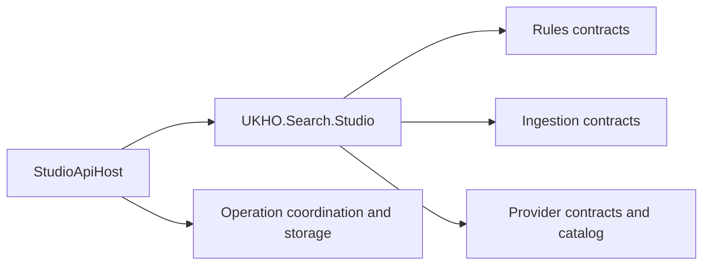

# Implementation Plan

- Work Package: `072-studio-host-uplift`
- Version: `v0.01`
- Status: `Draft`
- Target Output Path: `docs/072-studio-host-uplift/plan-studio-host-uplift_v0.01.md`
- Based on: `docs/072-studio-host-uplift/spec-studio-host-uplift_v0.01.md`

## Overall approach

This work package should be delivered in two sequential implementation phases:

1. a simple namespace and folder alignment adjustment in `src/Studio/UKHO.Search.Studio`
2. a later documentation-only pass across `src/Studio/UKHO.Search.Studio` and `src/Studio/StudioApiHost`

The plan intentionally keeps the namespace work lightweight and principle-led. It should reduce root namespace clutter in `UKHO.Search.Studio` without turning into a broader refactor. The documentation work must treat `./.github/instructions/documentation-pass.instructions.md` as a hard gate and must preserve the specification's comment-only constraint exactly.

## Implementation plan

## Namespace adjustment

- [ ] Work Item 1: Partition `UKHO.Search.Studio` into clearer feature namespaces
  - **Purpose**: Reduce clutter in the root `UKHO.Search.Studio` namespace by moving types into sensible `Rules`, `Ingestion`, and `Providers` areas while preserving behaviour.
  - **Acceptance Criteria**:
    - `src/Studio/UKHO.Search.Studio` no longer keeps most feature-specific types in the root namespace.
    - Folders align with the resulting namespace structure.
    - Genuinely shared types remain in the root namespace only where that is the clearest outcome.
    - `StudioApiHost` continues to compile against the adjusted Studio namespaces.
    - Solution build and relevant tests pass after the namespace change.
  - **Definition of Done**:
    - Namespace and folder changes implemented only in `src/Studio/UKHO.Search.Studio`
    - Public API usage sites updated where required
    - Logging and runtime behaviour unchanged
    - Tests passing for affected Studio and host coverage
    - Developer comments and XML comments added or updated for touched code in compliance with `./.github/instructions/documentation-pass.instructions.md`
    - Can execute end-to-end via: build solution and run affected Studio and host tests
  - [ ] Task 1: Establish the target namespace map for the current Studio types
    - [ ] Step 1: Review current Studio files and group them into `Rules`, `Ingestion`, `Providers`, or root common types using principle-led judgment.
    - [ ] Step 2: Keep dependency-injection wiring in `Injection/StudioProviderServiceCollectionExtensions.cs` in place unless a move is required strictly to preserve namespace/folder alignment.
    - [ ] Step 3: Confirm that the target structure stays lightweight and does not expand into unrelated host or provider-project tidy-up work.
    - [ ] Step 4: Explicitly reference `./.github/instructions/documentation-pass.instructions.md` before editing any touched source files and treat its XML-comment and developer-comment rules as mandatory Definition of Done criteria for those edits.
  - [ ] Task 2: Move Studio source files into matching folders and namespaces
    - [ ] Step 1: Create or align folders under `src/Studio/UKHO.Search.Studio` for `Rules`, `Ingestion`, and `Providers`.
    - [ ] Step 2: Move rule-related contracts and responses such as `StudioRuleDiscoveryResponse`, `StudioProviderRulesResponse`, and `StudioRuleSummaryResponse` into the `Rules` area.
    - [ ] Step 3: Move ingestion payload, status, result, operation, context, event, and error types into the `Ingestion` area.
    - [ ] Step 4: Move provider contracts, provider catalog types, and provider registration validation types into the `Providers` area.
    - [ ] Step 5: Leave genuinely shared abstractions in the root `UKHO.Search.Studio` namespace only where moving them would make the structure less clear.
    - [ ] Step 6: Update namespaces, using directives, and any cross-project references affected by the file moves.
    - [ ] Step 7: Ensure every touched file remains compliant with `./.github/instructions/documentation-pass.instructions.md`, including explicit XML documentation on eligible public API and developer-level comments in methods.
  - [ ] Task 3: Validate the adjusted Studio structure end to end
    - [ ] Step 1: Build the solution to confirm all namespace and file moves compile cleanly.
    - [ ] Step 2: Run targeted tests for `test/UKHO.Search.Studio.Tests` and `test/StudioApiHost.Tests` to verify that consuming code still works.
    - [ ] Step 3: If broader solution impact is detected, run the full relevant test set needed to show the namespace move is safe.
    - [ ] Step 4: Capture any residual follow-up concerns as notes only; do not broaden this work item into extra refactoring.
  - **Files**:
    - `src/Studio/UKHO.Search.Studio/StudioIngestionContextResponse.cs`: likely move into an `Ingestion` folder and namespace
    - `src/Studio/UKHO.Search.Studio/StudioIngestionContextsResponse.cs`: likely move into an `Ingestion` folder and namespace
    - `src/Studio/UKHO.Search.Studio/StudioIngestionPayloadEnvelope.cs`: likely move into an `Ingestion` folder and namespace
    - `src/Studio/UKHO.Search.Studio/StudioIngestionFetchPayloadResult.cs`: likely move into an `Ingestion` folder and namespace
    - `src/Studio/UKHO.Search.Studio/StudioIngestionSubmitPayloadResult.cs`: likely move into an `Ingestion` folder and namespace
    - `src/Studio/UKHO.Search.Studio/StudioIngestionSubmitPayloadResponse.cs`: likely move into an `Ingestion` folder and namespace
    - `src/Studio/UKHO.Search.Studio/StudioIngestionAcceptedOperationResponse.cs`: likely move into an `Ingestion` folder and namespace
    - `src/Studio/UKHO.Search.Studio/StudioIngestionOperationConflictResponse.cs`: likely move into an `Ingestion` folder and namespace
    - `src/Studio/UKHO.Search.Studio/StudioIngestionOperationEventResponse.cs`: likely move into an `Ingestion` folder and namespace
    - `src/Studio/UKHO.Search.Studio/StudioIngestionOperationExecutionResult.cs`: likely move into an `Ingestion` folder and namespace
    - `src/Studio/UKHO.Search.Studio/StudioIngestionOperationProgressUpdate.cs`: likely move into an `Ingestion` folder and namespace
    - `src/Studio/UKHO.Search.Studio/StudioIngestionOperationStateResponse.cs`: likely move into an `Ingestion` folder and namespace
    - `src/Studio/UKHO.Search.Studio/StudioIngestionOperationStatuses.cs`: likely move into an `Ingestion` folder and namespace
    - `src/Studio/UKHO.Search.Studio/StudioIngestionOperationTypes.cs`: likely move into an `Ingestion` folder and namespace
    - `src/Studio/UKHO.Search.Studio/StudioIngestionResultStatus.cs`: likely move into an `Ingestion` folder and namespace
    - `src/Studio/UKHO.Search.Studio/StudioIngestionFailureCodes.cs`: likely move into an `Ingestion` folder and namespace
    - `src/Studio/UKHO.Search.Studio/StudioIngestionErrorResponse.cs`: likely move into an `Ingestion` folder and namespace
    - `src/Studio/UKHO.Search.Studio/StudioRuleDiscoveryResponse.cs`: likely move into a `Rules` folder and namespace
    - `src/Studio/UKHO.Search.Studio/StudioProviderRulesResponse.cs`: likely move into a `Rules` folder and namespace
    - `src/Studio/UKHO.Search.Studio/StudioRuleSummaryResponse.cs`: likely move into a `Rules` folder and namespace
    - `src/Studio/UKHO.Search.Studio/IStudioProvider.cs`: likely move into a `Providers` folder and namespace
    - `src/Studio/UKHO.Search.Studio/IStudioIngestionProvider.cs`: likely move into a `Providers` folder and namespace
    - `src/Studio/UKHO.Search.Studio/IStudioProviderCatalog.cs`: likely move into a `Providers` folder and namespace
    - `src/Studio/UKHO.Search.Studio/IStudioProviderRegistrationValidator.cs`: likely move into a `Providers` folder and namespace
    - `src/Studio/UKHO.Search.Studio/StudioProviderCatalog.cs`: likely move into a `Providers` folder and namespace
    - `src/Studio/UKHO.Search.Studio/StudioProviderRegistrationValidator.cs`: likely move into a `Providers` folder and namespace
    - `src/Studio/UKHO.Search.Studio/Injection/StudioProviderServiceCollectionExtensions.cs`: keep in place unless alignment requires a minimal adjustment
    - `src/Studio/StudioApiHost/**/*`: update using directives only if required by Studio namespace changes
  - **Work Item Dependencies**: None
  - **Run / Verification Instructions**:
    - `dotnet build UKHO.Search.sln`
    - `dotnet test test/UKHO.Search.Studio.Tests/UKHO.Search.Studio.Tests.csproj`
    - `dotnet test test/StudioApiHost.Tests/StudioApiHost.Tests.csproj`
  - **User Instructions**: None expected beyond normal local build and test prerequisites.

## Documentation uplift

- [ ] Work Item 2: Apply the production documentation pass to `UKHO.Search.Studio` and `StudioApiHost`
  - **Purpose**: Bring the production Studio library and host to the repository's required documentation standard after the namespace structure is settled.
  - **Acceptance Criteria**:
    - Every hand-maintained `.cs` file in `src/Studio/UKHO.Search.Studio` and `src/Studio/StudioApiHost` is reviewed.
    - Eligible public API surface has explicit local XML documentation.
    - Methods and executable logic have developer-level comments explaining purpose, flow, and rationale.
    - `Program.cs` and other host bootstrap code are documented using the applicable developer-comment standard.
    - No code behaviour, signatures, or non-comment formatting are changed beyond the minimum required to insert comments cleanly.
    - Full solution build and full test suite run succeed, or any unrelated pre-existing failures are clearly identified.
  - **Definition of Done**:
    - Comment-only changes applied to the two production projects
    - `./.github/instructions/documentation-pass.instructions.md` followed in full and treated as a hard completion gate
    - XML comments added for all public classes, interfaces, records, enums, methods, constructors, properties, events, fields, operators, indexers, and enum members where present
    - Public method and constructor parameters documented
    - Meaningful inline and block comments added so implementation flow is understandable
    - Full build and full test suite completed
    - Can execute end-to-end via: full solution build and full solution test run
  - [ ] Task 1: Prepare the documentation-only execution scope
    - [ ] Step 1: Confirm Work Item 1 is complete so documentation is applied to the final namespace layout.
    - [ ] Step 2: Re-read `./.github/instructions/documentation-pass.instructions.md` and treat it as the authoritative implementation standard.
    - [ ] Step 3: Limit scope to hand-maintained `.cs` files in `src/Studio/UKHO.Search.Studio` and `src/Studio/StudioApiHost` only.
    - [ ] Step 4: Exclude generated files such as `obj` outputs and any designer or source-generated files.
  - [ ] Task 2: Apply XML documentation to the public API surface
    - [ ] Step 1: Add or improve XML documentation for public types and members in `UKHO.Search.Studio`.
    - [ ] Step 2: Add or improve XML documentation for public types and members in `StudioApiHost` where C# supports it.
    - [ ] Step 3: Ensure all public constructors, methods, and properties are documented explicitly in source rather than relying on inherited documentation.
    - [ ] Step 4: Add `<param>`, `<returns>`, `<typeparam>`, and other applicable tags where required by the repository standard.
    - [ ] Step 5: Document async behaviour, nullability expectations, tuple semantics, and explicit exceptions where these are materially relevant.
  - [ ] Task 3: Apply developer-level explanatory comments throughout implementations
    - [ ] Step 1: Add method-level explanatory comments for every method in scope, including trivial methods where required by the repository standard.
    - [ ] Step 2: Add step-by-step inline comments in multi-step logic, operation coordination paths, and API handling code where they clarify the flow.
    - [ ] Step 3: Ensure `src/Studio/StudioApiHost/Program.cs` and related bootstrap code include developer comments throughout top-level statements and local functions.
    - [ ] Step 4: Rewrite weak or inconsistent existing comments where required so the code reads in one consistent documentation style.
  - [ ] Task 4: Validate the documentation-only pass
    - [ ] Step 1: Build the full solution.
    - [ ] Step 2: Run the full test suite as required by `./.github/instructions/documentation-pass.instructions.md`.
    - [ ] Step 3: If failures occur, confirm whether they are pre-existing and unrelated before closing the work item.
    - [ ] Step 4: Keep test-project documentation uplift out of scope and raise it separately only if still required.
  - **Files**:
    - `src/Studio/UKHO.Search.Studio/**/*.cs`: comment-only documentation uplift for all hand-maintained production code in the Studio library
    - `src/Studio/StudioApiHost/Api/StudioIngestionApi.cs`: XML comments and developer-level method comments
    - `src/Studio/StudioApiHost/Api/StudioOperationsApi.cs`: XML comments and developer-level method comments
    - `src/Studio/StudioApiHost/Operations/StudioIngestionOperationCoordinator.cs`: XML comments and developer-level method comments
    - `src/Studio/StudioApiHost/Operations/StudioIngestionOperationStore.cs`: XML comments and developer-level method comments
    - `src/Studio/StudioApiHost/Operations/StudioTrackedOperation.cs`: XML comments and developer-level method comments
    - `src/Studio/StudioApiHost/StudioApiHostApplication.cs`: XML comments and developer-level method comments
    - `src/Studio/StudioApiHost/Program.cs`: developer-level comments through top-level bootstrap logic
  - **Work Item Dependencies**: Work Item 1
  - **Run / Verification Instructions**:
    - `dotnet build UKHO.Search.sln`
    - `dotnet test UKHO.Search.sln`
  - **User Instructions**: Test-project documentation work is intentionally excluded and should be tracked separately if requested later.

## Key considerations

- Keep the namespace work narrow: this is a Studio-library tidy-up, not a host refactor.
- Keep `StudioApiHost` namespace changes out of scope unless they are strictly required to update imports after Studio moves.
- Treat `./.github/instructions/documentation-pass.instructions.md` as mandatory for both work items because touched source files must meet repository documentation expectations.
- Preserve runtime behaviour throughout, especially for public contracts consumed by `StudioApiHost` and provider implementations.
- Do not fold test-project documentation work into this plan; keep it separately reversible.

# Architecture

## Overall Technical Approach

The technical approach is intentionally incremental:

1. reorganise `UKHO.Search.Studio` into clearer namespaces and matching folders
2. validate that the host and tests still compile and run against the adjusted contracts
3. perform a comment-only documentation uplift once the structure is stable

This keeps risk low by separating structural moves from documentation-only edits.

## Frontend

No frontend-specific implementation work is planned in this work package.

If `StudioApiHost` exposes UI-adjacent or API-consumed responses, the work only preserves those contracts and documents them; it does not introduce new pages, components, or Blazor flows.

## Backend

`UKHO.Search.Studio` acts as the reusable Studio contract and behaviour layer. The planned namespace adjustment keeps that code organised around three dominant areas:

- `Rules`: rule discovery and rule-summary response models
- `Ingestion`: ingestion payloads, responses, operation state, statuses, results, and related contracts
- `Providers`: provider abstractions, provider catalog behaviour, and provider registration validation

`StudioApiHost` remains the hosting layer. It should continue to contain API endpoints, operation coordination and storage, application composition, and top-level startup logic. The later documentation pass should explain how these host components interact with the Studio library without changing their behaviour.

Likely backend areas affected:

- `src/Studio/UKHO.Search.Studio`: namespace and folder alignment, followed later by comment-only documentation uplift
- `src/Studio/StudioApiHost/Api`: endpoint surface consuming Studio contracts
- `src/Studio/StudioApiHost/Operations`: orchestration and tracking flow for Studio ingestion operations
- `src/Studio/StudioApiHost/Program.cs`: host bootstrap and dependency wiring documentation only

## Summary

The plan delivers the work in two low-risk slices:

- first, a simple and reversible Studio namespace tidy-up
- second, a strict documentation-only pass governed by `./.github/instructions/documentation-pass.instructions.md`

The main implementation consideration is to keep the Studio-library namespace cleanup useful but modest, then document the settled production code thoroughly without changing behaviour.
