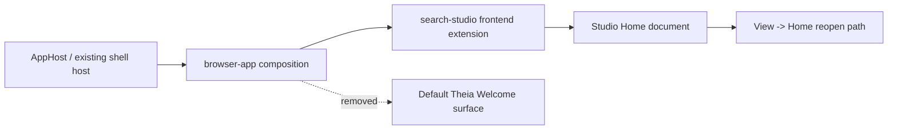

# Implementation Plan + Architecture

**Target output path:** `docs/073-new-theia-shell/plan-frontend-home-surface-cleanup_v0.01.md`

**Based on:** `docs/073-new-theia-shell/spec-frontend-home-surface-cleanup_v0.01.md`

**Version:** `v0.01` (`Draft`)

---

# Implementation Plan

## Planning constraints and delivery posture

- This plan is based on `docs/073-new-theia-shell/spec-frontend-home-surface-cleanup_v0.01.md`.
- All implementation work that creates or updates source code must comply fully with `./.github/instructions/documentation-pass.instructions.md`.
- `./.github/instructions/documentation-pass.instructions.md` is a **hard gate** for completion of every code-writing Work Item in this plan.
- For every code-writing Work Item, implementation must:
  - add developer-level comments to every class, including internal and other non-public types
  - add developer-level comments to every method and constructor, including internal and other non-public members
  - add parameter comments for every public method and constructor parameter
  - add comments to every property whose meaning is not obvious from its name
  - add sufficient inline or block comments so a developer can follow purpose, flow, and any non-obvious logic
- The plan is organized as a minimal vertical slice so the landing experience becomes cleaner in one runnable pass.
- The implementation should prefer removing scaffold-owned behavior cleanly rather than layering additional overrides on top of unused Theia defaults.
- Unless the cleanup specification explicitly changes behavior, the preserved Studio-owned `Home` startup and `View -> Home` reopen flow should remain unchanged in substance.

---

## Slice 1 — Studio `Home` becomes the sole landing surface

- [x] Work Item 1: Remove the default Theia `Welcome` experience and simplify the Studio `Home` page - Completed
  - **Purpose**: Deliver a single runnable end-to-end landing experience in which the Studio shell starts directly into the Studio-owned `Home` document, no default Theia `Welcome` surface remains active, and the Home page no longer contains the lower Theia-oriented explanatory box.
  - **Completion Summary**: Removed `@theia/getting-started` from `src/Studio/Server/browser-app/package.json`, simplified `search-studio-home-widget` and its CSS, added focused frontend tests for browser-app composition and Home rendering, refreshed `wiki/Tools-UKHO-Search-Studio.md`, and validated with `yarn --cwd .\src\Studio\Server\search-studio test`, `yarn --cwd .\src\Studio\Server build:browser`, and a successful workspace build.
  - **Acceptance Criteria**:
    - The Studio shell no longer opens the default Theia `Welcome` page during startup.
    - The active shell composition no longer includes the default Theia `Welcome` experience where practical, including package, menu, command, or other scaffold-only exposure required for that surface.
    - The Studio `Home` page still opens automatically on startup.
    - The Studio `Home` page is still reopenable from `View -> Home`.
    - The lower explanatory box is removed entirely from the Studio `Home` page.
    - No replacement placeholder box or alternate filler content is added to replace the removed lower explanatory box.
    - Existing Studio branding, logo, and primary orientation content remain intact.
  - **Definition of Done**:
    - Active frontend composition updated so the default Theia `Welcome` surface is removed in substance
    - Studio `Home` presentation simplified to remove the lower explanatory box cleanly
    - Logging and error handling preserved where startup behavior relies on existing Home-opening flow
    - Code comments and documentation added in full compliance with `./.github/instructions/documentation-pass.instructions.md`
    - Frontend tests updated or added to cover the cleaned landing experience
    - Wiki or work-package documentation updated so it no longer describes generated welcome-surface coexistence as acceptable
    - Can execute end to end via: launching the shell, seeing only Studio `Home`, confirming the lower explanatory box is absent, closing `Home`, and reopening it from `View -> Home`
  - [x] Task 1.1: Remove the scaffold-owned Theia `Welcome` surface from active frontend composition - Completed
    - **Summary**: Identified `@theia/getting-started` in `src/Studio/Server/browser-app/package.json` as the active scaffold-owned welcome source, removed it from the browser-app composition, preserved the remaining shell dependencies, confirmed the Studio-owned Home startup path still relies on the existing `search-studio` contribution, and kept updated source comments aligned with the mandatory documentation pass requirements.
    - [x] Step 1: Identify the current active source of the default Theia `Welcome` experience in the fresh scaffold, including package dependencies and any startup or menu exposure that keeps it available. - Completed
    - [x] Step 2: Remove the default Theia `Welcome` surface from the active browser-app composition where practical, preferring a clean composition change rather than a runtime-only hide/ignore approach. - Completed
    - [x] Step 3: Preserve the rest of the required shell composition so the Studio shell still builds and starts correctly after the cleanup. - Completed
    - [x] Step 4: Confirm the Studio-owned `Home` startup behavior remains the landing path after the Theia `Welcome` removal. - Completed
    - [x] Step 5: Apply `./.github/instructions/documentation-pass.instructions.md` in full to every source file created or updated. - Completed
  - [x] Task 1.2: Remove the lower explanatory box from the Studio `Home` page - Completed
    - **Summary**: Removed the lower explanatory box from `src/Studio/Server/search-studio/src/browser/home/search-studio-home-widget.tsx`, deleted the unused note-panel styles from `search-studio-home-widget.css`, preserved the logo, title, and primary orientation copy, and kept the Home surface intentionally lightweight and Studio-owned in tone.
    - [x] Step 1: Update the `Home` widget rendering so the lower explanatory box is no longer produced. - Completed
    - [x] Step 2: Remove any now-unused styling that existed only to support the removed explanatory box. - Completed
    - [x] Step 3: Preserve the logo, title, and primary Studio orientation content without replacing the removed box with alternate filler content. - Completed
    - [x] Step 4: Keep the Home page intentionally lightweight and Studio-owned in tone. - Completed
    - [x] Step 5: Apply `./.github/instructions/documentation-pass.instructions.md` in full to every source file created or updated. - Completed
  - [x] Task 1.3: Protect the landing-surface cleanup with focused verification - Completed
    - **Summary**: Added `src/Studio/Server/search-studio/test/search-studio-browser-app-composition.test.js`, expanded `search-studio-home-widget.test.js` to verify the lower explanatory box stays absent, preserved the existing Home startup and `View -> Home` reopen tests, and validated the cleanup with `yarn --cwd .\src\Studio\Server\search-studio test`, `yarn --cwd .\src\Studio\Server build:browser`, and a successful workspace build.
    - [x] Step 1: Add or update frontend tests covering the absence of the default Theia `Welcome` surface from active shell behavior where practical to verify. - Completed
    - [x] Step 2: Add or update frontend tests covering the absence of the removed lower explanatory box from the rendered Studio `Home` content. - Completed
    - [x] Step 3: Preserve or update frontend tests proving that automatic Studio `Home` opening still occurs and that `View -> Home` still works after the cleanup. - Completed
    - [x] Step 4: Run the relevant frontend test suite and the required shell build so stale browser output is not left behind. - Completed
    - [x] Step 5: Apply `./.github/instructions/documentation-pass.instructions.md` in full to every source file created or updated. - Completed
  - [x] Task 1.4: Update supporting documentation and manual verification guidance - Completed
    - **Summary**: Updated `wiki/Tools-UKHO-Search-Studio.md` so it no longer treats the generated welcome surface as an accepted concurrent landing experience and refreshed the manual smoke guidance to verify that only Studio Home appears and that the lower explanatory box is gone.
    - [x] Step 1: Update the Studio wiki page so it no longer describes the generated Theia welcome surface as an accepted concurrent landing experience. - Completed
    - [x] Step 2: Add or update the manual smoke path so it explicitly verifies that only Studio `Home` appears and that the lower explanatory box is gone. - Completed
    - [x] Step 3: Ensure the work-package documentation remains aligned with the cleaned Studio-first landing experience. - Completed
    - [x] Step 4: Apply `./.github/instructions/documentation-pass.instructions.md` in full to any code-writing task touched during documentation-support work. - Completed
  - **Files**:
    - `src/Studio/Server/browser-app/package.json`: remove the default Theia welcome/getting-started composition input if it is the active source of the unwanted landing surface
    - `src/Studio/Server/search-studio/src/browser/home/search-studio-home-widget.tsx`: remove the lower explanatory box from the Home render tree
    - `src/Studio/Server/search-studio/src/browser/home/search-studio-home-widget.css`: remove any styling used only by the deleted explanatory box
    - `src/Studio/Server/search-studio/src/browser/search-studio-frontend-module.ts`: preserve the active Home contribution wiring if any composition cleanup requires frontend registration adjustments
    - `src/Studio/Server/search-studio/src/browser/search-studio-frontend-application-contribution.ts`: preserve the Home-first startup lifecycle if any cleanup affects startup behavior
    - `src/Studio/Server/search-studio/test/*`: update or add focused tests for Home startup, View-menu reopening, and absence of removed content
    - `wiki/Tools-UKHO-Search-Studio.md`: remove documentation that still treats the generated welcome surface as acceptable
  - **Work Item Dependencies**: Depends on the already delivered Studio `Home` landing slice in `docs/073-new-theia-shell/plan-new-theia-shell_v0.01.md`.
  - **Run / Verification Instructions**:
    - `yarn --cwd .\src\Studio\Server\search-studio test`
    - `yarn --cwd .\src\Studio\Server build:browser`
    - Start `AppHost` with Visual Studio `F5`
    - Open the shell on the configured HTTP endpoint
    - Verify that the shell opens only to Studio `Home`, that no default Theia `Welcome` page appears, that the lower explanatory box is absent, and that `View -> Home` still reopens the Home tab after closure
  - **User Instructions**:
    - Hard refresh the browser page or restart the Studio shell resource after the updated browser bundle is built.

---

## Overall approach summary

This plan delivers the cleanup as one narrow vertical slice because the requested change is a single user-visible capability refinement rather than a broader feature set.

The implementation should:

1. remove the scaffold-owned Theia `Welcome` surface from the active shell composition rather than merely tolerating it
2. keep the Studio-owned `Home` page as the only supported landing surface
3. simplify the Home page by deleting the lower explanatory box entirely
4. protect the result with focused frontend verification and updated shell documentation

Key implementation considerations:

- treat `./.github/instructions/documentation-pass.instructions.md` as a mandatory completion gate for every code-writing change
- preserve the already-working Studio `Home` startup and `View -> Home` reopen behavior
- avoid widening scope into unrelated Theia workbench redesign
- ensure documentation and manual smoke guidance no longer describe generated Theia welcome-surface coexistence as acceptable
- always rebuild the browser shell after the cleanup so the user does not run stale frontend code

---

# Architecture

## Overall Technical Approach

- The cleanup stays entirely inside the active Theia shell workspace under `src/Studio/Server`.
- The implementation removes scaffold-owned Theia onboarding composition while preserving the Studio-owned `search-studio` extension as the landing-surface owner.
- The shell remains hosted exactly as it is today through the existing AppHost and StudioServiceHost flow; only frontend composition and presentation change.
- The result is a Studio-first workbench startup path in which `Home` is the sole supported landing document.

## Frontend

The frontend cleanup is centered in two places:

- `src/Studio/Server/browser-app`
  - owns active Theia application composition
  - is the likely place where scaffold-provided `Welcome` capability remains active through default package composition
  - must be cleaned so the default Theia landing surface is no longer part of the active shell where practical

- `src/Studio/Server/search-studio`
  - owns the Studio `Home` document, startup-open behavior, and `View -> Home` reopen behavior
  - keeps responsibility for the single supported landing experience after cleanup
  - simplifies the `Home` rendering by removing the lower Theia-oriented explanatory box entirely

Frontend user flow after implementation:

1. the user launches the Studio shell
2. the frontend composition no longer provides the default Theia `Welcome` surface
3. the Studio `Home` document opens automatically
4. the user sees Studio branding and orientation content only
5. if the user closes `Home`, they can reopen it from `View -> Home`

## Backend

No backend architecture change is required for this cleanup.

Existing backend responsibilities remain unchanged:

- `src/Hosts/AppHost`
  - continues to host and start the shell as it does today

- `src/Studio/StudioServiceHost`
  - continues to provide the existing backend runtime bridge and API integration used by the shell

Backend impact is limited to validating that no frontend cleanup accidentally disrupts the existing startup path. There is no new API, persistence, or service-layer work in this plan.
