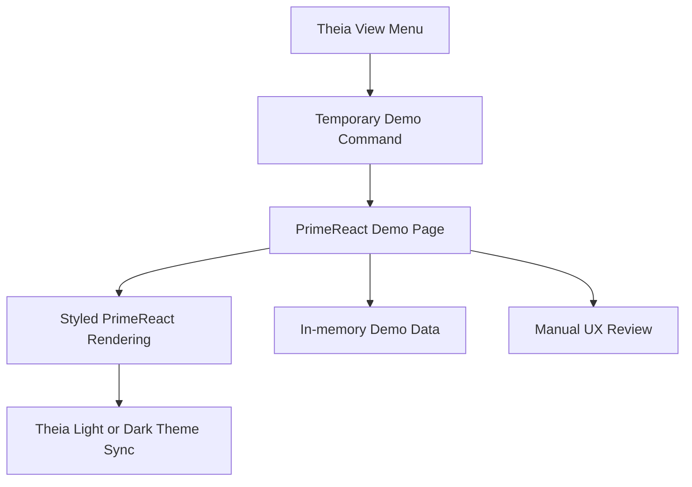

# Implementation Plan + Architecture

**Target output path:** `docs/074-primereact-research/plan-frontend-primereact-research_v0.01.md`

**Based on:** `docs/074-primereact-research/spec-frontend-primereact-research_v0.01.md`

**Version:** `v0.01` (`Draft`)

---

# Implementation Plan

## Planning constraints and delivery posture

- This plan is based on `docs/074-primereact-research/spec-frontend-primereact-research_v0.01.md`.
- All implementation work that creates or updates source code must comply fully with `./.github/instructions/documentation-pass.instructions.md`.
- `./.github/instructions/documentation-pass.instructions.md` is a **hard gate** for completion of every code-writing Work Item in this plan.
- For every code-writing Work Item, implementation must:
  - add developer-level comments to every class, including internal and other non-public types
  - add developer-level comments to every method and constructor, including internal and other non-public members
  - add parameter comments for every public method and constructor parameter where those constructs exist
  - add comments to every property whose meaning is not obvious from its name
  - add sufficient inline or block comments so a developer can follow purpose, flow, and any non-obvious logic
- This work item is frontend-focused. No production backend or domain behaviour changes are planned.
- PrimeReact is being evaluated as a temporary page-level component library inside Theia. The resulting demo code is intentionally disposable.
- The current research direction now prefers full styled PrimeReact only for all remaining demo pages.
- Unstyled mode, per-page presentation toggles, and styled-versus-unstyled comparison are out of scope for the remaining work items in this plan.
- `.github/instructions/primereact.instructions.md` is a **reference source only** for implementation guidance, component selection, and official documentation links. It is not a requirements source for this work package.
- The plan is organized as vertical slices. Each Work Item ends in a runnable, demonstrable capability inside the Theia shell.
- Demo page grouping should be pragmatic rather than architectural. The goal is to get a broad, useful range of fully styled PrimeReact controls on screen quickly.

---

## Slice 1 — PrimeReact bootstrap and first runnable demo host

- [x] Work Item 1: Add PrimeReact to the Theia shell and deliver the first styled/unstyled demo page with a working per-page toggle - Completed
  - Summary: Added `primereact` and `primeicons` to `search-studio`, introduced a temporary `primereact-demo` browser area with its own widget/service/theme handling, exposed the page from `View`, and delivered a first controlled demo page that switches like-for-like between unstyled and stock styled PrimeReact rendering while following Theia light/dark theme changes.
  - Files touched: `src/Studio/Server/search-studio/package.json`, `src/Studio/Server/search-studio/src/browser/search-studio-frontend-module.ts`, `src/Studio/Server/search-studio/src/browser/search-studio-command-contribution.ts`, `src/Studio/Server/search-studio/src/browser/search-studio-menu-contribution.ts`, `src/Studio/Server/search-studio/src/browser/primereact-demo/*`, `src/Studio/Server/search-studio/test/*`, `wiki/Tools-UKHO-Search-Studio.md`.
  - Tests/validation: `yarn --cwd .\src\Studio\Server\search-studio test` passed with 17/17 tests; `yarn --cwd .\src\Studio\Server build:browser` reached successful webpack compilation for both frontend and backend bundles, but the Theia application-manager wrapper still returned `webpack exited with an unexpected code: 1` after compilation.
  - **Purpose**: Establish the minimum end-to-end capability proving PrimeReact can render inside the Studio Theia shell, open from the `View` menu, and switch like-for-like between styled and unstyled presentation without rebuilding.
  - **Acceptance Criteria**:
    - A temporary PrimeReact demo page can be opened from the Theia `View` menu.
    - The page is not shown by default and behaves like the existing `Home` page exposure model.
    - PrimeReact dependencies and baseline configuration are wired into the active frontend package.
    - The demo page renders a small but representative initial set of PrimeReact controls.
    - The same page content can be toggled between `styled` and `unstyled` mode on the page itself.
    - In `styled` mode, PrimeReact follows the current Theia light/dark theme automatically using stock PrimeReact themes.
    - In `unstyled` mode, the page uses a clean, modern, lightly Theia-aligned appearance with minimal boxing and borders.
  - **Definition of Done**:
    - PrimeReact package integration completed
    - First demo page openable end to end from the shell
    - Styled/unstyled toggle implemented on the page
    - Logging and error handling added for demo activation and mode switching where useful
    - Code comments added in full compliance with `./.github/instructions/documentation-pass.instructions.md`
    - Tests added where practical for command/menu wiring and page open behaviour
    - Can execute end to end via: launch shell, open demo from `View`, toggle styled/unstyled, confirm Theia theme sync in styled mode
  - [x] Task 1.1: Add PrimeReact packages and baseline frontend integration - Completed
    - Summary: Added the PrimeReact dependencies to the active frontend package and wired the temporary demo widget, theme service, and open service into the existing Studio frontend module using minimal disposable integration points.
    - [x] Step 1: Add the required PrimeReact packages and any supporting packages to the active Studio frontend package.
    - [x] Step 2: Wire the minimum PrimeReact provider/configuration support into the active frontend composition.
    - [x] Step 3: Keep configuration minimal and aligned to the temporary demo purpose.
    - [x] Step 4: Use `.github/instructions/primereact.instructions.md` only as reference material for package setup and official component guidance.
    - [x] Step 5: Apply `./.github/instructions/documentation-pass.instructions.md` in full to all touched source files.
  - [x] Task 1.2: Add a temporary demo host contribution to the Studio shell - Completed
    - Summary: Added an isolated `primereact-demo` browser area with its own constants, widget, service, and menu/command registration so the temporary page is easy to remove later.
    - [x] Step 1: Add a temporary demo contribution area under the active Theia frontend package.
    - [x] Step 2: Register commands and menu entries so demos are available from `View` in the same general way as `Home`.
    - [x] Step 3: Keep the temporary demo contribution isolated so it can be removed cleanly later.
    - [x] Step 4: Apply `./.github/instructions/documentation-pass.instructions.md` in full to all touched source files.
  - [x] Task 1.3: Deliver the first baseline demo page with like-for-like styled/unstyled switching - Completed
    - Summary: Added the first temporary PrimeReact page with controlled inputs, summary metrics, status tags, a per-page runtime styled/unstyled toggle, and Theia light/dark theme following through stock Lara theme stylesheet switching.
    - [x] Step 1: Create an initial demo page that renders the same content in both styled and unstyled modes.
    - [x] Step 2: Add a per-page toggle that switches PrimeReact itself between styled and unstyled mode.
    - [x] Step 3: Ensure the toggle does not depend on rebuilding the frontend.
    - [x] Step 4: Ensure styled mode follows current Theia theme changes dynamically.
    - [x] Step 5: Keep unstyled visuals clean, modern, and only lightly aligned to Theia.
    - [x] Step 6: Apply `./.github/instructions/documentation-pass.instructions.md` in full to all touched source files.
  - [x] Task 1.4: Add baseline verification and demo guidance - Completed
    - Summary: Extended frontend tests to cover the new demo command/menu and demo-open service, added toggle-state coverage for the presentation-state model, and documented reviewer steps in the Studio wiki.
    - [x] Step 1: Add frontend tests for command/menu registration and widget open behaviour where practical.
    - [x] Step 2: Add lightweight tests or checks for toggle state changes where practical.
    - [x] Step 3: Add brief work-package notes if needed describing how reviewers open the page and toggle modes.
    - [x] Step 4: Apply `./.github/instructions/documentation-pass.instructions.md` in full to all touched source files.
  - **Files**:
    - `src/Studio/Server/search-studio/package.json`: PrimeReact dependency and script updates if needed
    - `src/Studio/Server/search-studio/src/browser/search-studio-frontend-module.ts`: frontend DI/config wiring
    - `src/Studio/Server/search-studio/src/browser/search-studio-command-contribution.ts`: temporary demo commands
    - `src/Studio/Server/search-studio/src/browser/search-studio-menu-contribution.ts`: `View` menu entries for demos
    - `src/Studio/Server/search-studio/src/browser/primereact-demo/*`: temporary demo host, services, and first demo page
    - `src/Studio/Server/search-studio/test/*`: command/menu/widget verification
  - **Work Item Dependencies**: Existing Studio shell baseline only.
  - **Run / Verification Instructions**:
    - `yarn --cwd .\src\Studio\Server build:browser`
    - Start `AppHost` with Visual Studio `F5`
    - Open the Studio shell
    - Navigate to `View` and open the first PrimeReact demo page
    - Toggle styled/unstyled and switch Theia theme to confirm styled-mode theme following
  - **User Instructions**:
    - None beyond normal Studio shell startup prerequisites.

---

## Slice 2 — Data-heavy demos: table, tree, and tree-table

- [x] Work Item 2: Add data-heavy PrimeReact demo pages covering `DataTable`, `Tree`, and `TreeTable` - Completed
  - Summary: Added reusable in-memory data generators and scenario helpers, introduced separate styled PrimeReact `DataTable`, `Tree`, and `TreeTable` pages under the temporary demo area, extended the shared demo widget/service/menu/command wiring so each page opens directly from `View`, expanded frontend tests for activation and data-state helpers, and updated the Studio wiki with reviewer guidance for the new pages.
  - Files touched: `src/Studio/Server/search-studio/src/browser/primereact-demo/search-studio-primereact-demo-constants.ts`, `src/Studio/Server/search-studio/src/browser/primereact-demo/search-studio-primereact-demo-service.ts`, `src/Studio/Server/search-studio/src/browser/primereact-demo/search-studio-primereact-demo-widget.tsx`, `src/Studio/Server/search-studio/src/browser/primereact-demo/search-studio-primereact-demo-widget.css`, `src/Studio/Server/search-studio/src/browser/primereact-demo/search-studio-primereact-demo-page.tsx`, `src/Studio/Server/search-studio/src/browser/primereact-demo/search-studio-primereact-demo-page-props.ts`, `src/Studio/Server/search-studio/src/browser/primereact-demo/data/*`, `src/Studio/Server/search-studio/src/browser/primereact-demo/pages/*`, `src/Studio/Server/search-studio/src/browser/search-studio-command-contribution.ts`, `src/Studio/Server/search-studio/src/browser/search-studio-menu-contribution.ts`, `src/Studio/Server/search-studio/test/*`, `wiki/Tools-UKHO-Search-Studio.md`.
  - Tests/validation: `yarn --cwd .\src\Studio\Server\search-studio test` passed with 23/23 tests; `yarn --cwd .\src\Studio\Server build:browser` completed successfully with the existing webpack warnings from Theia/Monaco dependencies; Visual Studio workspace build passed.
  - **Purpose**: Deliver the primary evaluation surfaces for richer business-style controls that Theia does not provide out of the box, with enough data, interactions, and states to judge real fit.
  - **Acceptance Criteria**:
    - Separate or sensibly grouped demo pages exist for `DataTable`, `Tree`, and `TreeTable`.
    - Each page is openable from `View`.
    - Each page uses full styled PrimeReact only and follows the current Theia light/dark theme automatically using stock PrimeReact themes.
    - Datasets are large enough to exercise scrolling and density.
    - `DataTable` demonstrates sorting, filtering, pagination, selection, and editable states.
    - `Tree` demonstrates expand/collapse, selection, and simple toolbar-style actions.
    - `TreeTable` demonstrates hierarchical data with columns and useful interaction states.
    - Empty, selected, loading, disabled, and edit-related states are shown where relevant.
  - **Definition of Done**:
    - Data-heavy demo pages implemented and openable end to end
    - Mock data and interaction states implemented without backend dependency
    - Logging and error handling added where useful for data-loading and page-activation demo states
    - Code comments added in full compliance with `./.github/instructions/documentation-pass.instructions.md`
    - Tests added where practical for page open behaviour and key interaction state transitions
    - Can execute end to end via: open table/tree/tree-table demos from `View` and inspect full styled PrimeReact behaviour plus interaction states
  - [x] Task 2.1: Add reusable in-memory demo data sources and state models - Completed
    - Summary: Added deterministic in-memory generators for dense table, tree, and tree-table datasets plus shared scenario, expansion, and selection helpers for the data-heavy demo pages.
    - [x] Step 1: Add in-memory sample data generators or fixtures for table, tree, and tree-table demos.
    - [x] Step 2: Ensure sample counts are large enough to exercise scrolling and density.
    - [x] Step 3: Keep sample data mixed between generic and loosely Studio-shaped examples.
    - [x] Step 4: Apply `./.github/instructions/documentation-pass.instructions.md` in full to all touched source files.
  - [x] Task 2.2: Implement the `DataTable` demo page - Completed
    - Summary: Added a styled PrimeReact `DataTable` page with sorting, lightweight filtering, pagination, multi-selection, mock inline editing, loading/empty scenarios, and disabled edit states backed by the reusable in-memory dataset.
    - [x] Step 1: Add a `DataTable` demo using official PrimeReact component APIs and documented imports.
    - [x] Step 2: Start with a minimal correct table and then add sorting, filtering, pagination, and selection.
    - [x] Step 3: Add editable states such as inline editing where practical, but keep behaviour mock-only.
    - [x] Step 4: Demonstrate empty, loading, selected, and editable states.
    - [x] Step 5: Ensure the page stays fully styled and follows current Theia theme changes using the stock PrimeReact themed path already established.
    - [x] Step 6: Apply `./.github/instructions/documentation-pass.instructions.md` in full to all touched source files.
  - [x] Task 2.3: Implement the `Tree` and `TreeTable` demo pages - Completed
    - Summary: Added styled PrimeReact `Tree` and `TreeTable` pages with dense hierarchical data, expand/collapse tooling, checkbox selection, mock toolbar actions, and loading/empty scenarios while reusing the shared Theia-aligned themed path.
    - [x] Step 1: Add a `Tree` demo page with expand/collapse, selection, and simple toolbar actions.
    - [x] Step 2: Add a `TreeTable` demo page with hierarchical rows plus columns and appropriate interactions.
    - [x] Step 3: Demonstrate useful states such as empty data, selection, and loading where practical.
    - [x] Step 4: Keep all actions mock-only and oriented to look-and-feel review.
    - [x] Step 5: Ensure both pages stay fully styled and follow current Theia theme changes using the stock PrimeReact themed path already established.
    - [x] Step 6: Apply `./.github/instructions/documentation-pass.instructions.md` in full to all touched source files.
  - [x] Task 2.4: Add verification coverage for data-heavy demos - Completed
    - Summary: Extended command/menu/service tests for the new demo entries, added coverage for generated data and shared scenario helpers, and documented manual reviewer checks for the new data-heavy pages in the Studio wiki.
    - [x] Step 1: Add frontend tests for page activation and key interaction state behaviour where practical.
    - [x] Step 2: Add lightweight manual verification notes for reviewers covering scrolling, density, editing, and selection.
    - [x] Step 3: Apply `./.github/instructions/documentation-pass.instructions.md` in full to all touched source files.
  - **Files**:
    - `src/Studio/Server/search-studio/src/browser/primereact-demo/data/*`: in-memory demo datasets and helpers
    - `src/Studio/Server/search-studio/src/browser/primereact-demo/pages/*`: `DataTable`, `Tree`, and `TreeTable` demo pages
    - `src/Studio/Server/search-studio/src/browser/primereact-demo/components/*`: shared temporary demo widgets and helpers
    - `src/Studio/Server/search-studio/test/*`: demo-page interaction and activation checks
  - **Work Item Dependencies**: Work Item 1.
  - **Run / Verification Instructions**:
    - `yarn --cwd .\src\Studio\Server build:browser`
    - Start `AppHost` with Visual Studio `F5`
    - Open the Studio shell
    - Open the table, tree, and tree-table demos from `View`
    - Confirm sorting, filtering, pagination, selection, edit states, density, scrolling, and styled-theme following
  - **User Instructions**:
    - None beyond normal shell startup prerequisites.

---

## Slice 3 — Forms, card/list presentation, and layout-container demos

- [x] Work Item 3: Add broad forms, `DataView`, and layout/container demos including resize interactions - Completed
  - Summary: Added styled PrimeReact forms, `DataView`, and layout/container demo pages plus supporting form-validation and card-list data helpers, extended the temporary demo command/menu/widget routing so each page opens directly from `View`, expanded frontend tests for the new page activations and form/data helpers, and updated the Studio wiki with reviewer guidance for the broader demo set.
  - Files touched: `src/Studio/Server/search-studio/src/browser/primereact-demo/search-studio-primereact-demo-constants.ts`, `src/Studio/Server/search-studio/src/browser/primereact-demo/search-studio-primereact-demo-widget.tsx`, `src/Studio/Server/search-studio/src/browser/primereact-demo/search-studio-primereact-demo-widget.css`, `src/Studio/Server/search-studio/src/browser/primereact-demo/data/search-studio-primereact-demo-data.ts`, `src/Studio/Server/search-studio/src/browser/primereact-demo/data/search-studio-primereact-demo-state.ts`, `src/Studio/Server/search-studio/src/browser/primereact-demo/pages/search-studio-primereact-forms-demo-page.tsx`, `src/Studio/Server/search-studio/src/browser/primereact-demo/pages/search-studio-primereact-data-view-demo-page.tsx`, `src/Studio/Server/search-studio/src/browser/primereact-demo/pages/search-studio-primereact-layout-demo-page.tsx`, `src/Studio/Server/search-studio/src/browser/search-studio-command-contribution.ts`, `src/Studio/Server/search-studio/src/browser/search-studio-menu-contribution.ts`, `src/Studio/Server/search-studio/test/*`, `wiki/Tools-UKHO-Search-Studio.md`.
  - Tests/validation: `yarn --cwd .\src\Studio\Server\search-studio test` passed with 28/28 tests; `yarn --cwd .\src\Studio\Server build:browser` completed successfully with the existing Theia/Monaco webpack warnings; Visual Studio workspace build passed.
  - **Purpose**: Deliver the broader UX comparison surfaces needed to judge not just grids and trees, but also common form controls, non-tabular list/card presentation, and page-level composition capabilities.
  - **Acceptance Criteria**:
    - A forms demo page exists with a broad range of representative controls.
    - The forms demo uses controlled components and includes validation and inline feedback.
    - A card/list demo exists using `DataView` or an equivalent list-style component.
    - Layout/container elements such as `Tabs`, `Splitter`, `Panel`, and `Divider` are demonstrated.
    - Layout demos emphasize spacious modern layouts rather than dense admin-style boxing.
    - Resizing interactions such as draggable `Splitter` panes are demonstrable.
    - Each page uses full styled PrimeReact only and follows the current Theia light/dark theme automatically using stock PrimeReact themes.
  - **Definition of Done**:
    - Forms, card/list, and layout-container demos implemented and openable end to end
    - Validation, disabled, loading, empty, and selection states shown where relevant
    - Logging and error handling added where useful for demo-state transitions
    - Code comments added in full compliance with `./.github/instructions/documentation-pass.instructions.md`
    - Tests added where practical for page activation and key state behaviour
    - Can execute end to end via: open forms, card/list, and layout demos from `View` and review full styled PrimeReact behaviour
  - [x] Task 3.1: Implement the forms demo page - Completed
    - Summary: Added a styled PrimeReact forms page with controlled inputs, grouped selection controls, inline validation, disabled states, and a mock loading save flow backed by shared validation helpers.
    - [x] Step 1: Add a broad set of controlled PrimeReact form controls using documented imports and APIs.
    - [x] Step 2: Include validation states and simple inline feedback.
    - [x] Step 3: Include disabled and selection-related states where relevant.
    - [x] Step 4: Keep business behaviour mock-only and focused on UX evaluation.
    - [x] Step 5: Ensure the page stays fully styled and follows current Theia theme changes using the stock PrimeReact themed path already established.
    - [x] Step 6: Apply `./.github/instructions/documentation-pass.instructions.md` in full to all touched source files.
  - [x] Task 3.2: Implement the card/list demo page - Completed
    - Summary: Added a styled PrimeReact `DataView` page with grid/list layout switching, density controls, selection state, pagination, and empty-state presentation using a reusable in-memory card-list dataset.
    - [x] Step 1: Add a `DataView`-style demo showing non-tabular presentation of the same or related mock data.
    - [x] Step 2: Demonstrate density, selection, and visual comparison against grid-based views.
    - [x] Step 3: Keep actions mock-only and oriented to presentation review.
    - [x] Step 4: Ensure the page stays fully styled and follows current Theia theme changes using the stock PrimeReact themed path already established.
    - [x] Step 5: Apply `./.github/instructions/documentation-pass.instructions.md` in full to all touched source files.
  - [x] Task 3.3: Implement the layout/container demo page - Completed
    - Summary: Added a styled PrimeReact layout page with `TabView`, nested `Splitter` panes, `Panel` containers, `Divider` rhythm, and mock resize feedback for broader page-composition review.
    - [x] Step 1: Add layout and container elements such as `Tabs`, `Splitter`, `Panel`, and `Divider`.
    - [x] Step 2: Emphasize spacious modern composition and avoid heavy boxing unless needed for clarity.
    - [x] Step 3: Demonstrate draggable `Splitter` resizing interactions.
    - [x] Step 4: Keep the page temporary and pragmatic rather than architected for long-term reuse.
    - [x] Step 5: Ensure the page stays fully styled and follows current Theia theme changes using the stock PrimeReact themed path already established.
    - [x] Step 6: Apply `./.github/instructions/documentation-pass.instructions.md` in full to all touched source files.
  - [x] Task 3.4: Add verification coverage for form/list/layout demos - Completed
    - Summary: Extended command/menu tests for the new demo entries, added helper coverage for the new form-validation and card-list data generators, and documented manual reviewer checks in the Studio wiki.
    - [x] Step 1: Add frontend tests for page activation and key validation or layout state transitions where practical.
    - [x] Step 2: Add manual verification notes for reviewers covering form breadth, validation, `DataView`, and resizing interactions.
    - [x] Step 3: Apply `./.github/instructions/documentation-pass.instructions.md` in full to all touched source files.
  - **Files**:
    - `src/Studio/Server/search-studio/src/browser/primereact-demo/pages/*`: forms, `DataView`, and layout/container pages
    - `src/Studio/Server/search-studio/src/browser/primereact-demo/components/*`: shared demo form and layout helpers
    - `src/Studio/Server/search-studio/test/*`: page activation and key UI-state coverage
  - **Work Item Dependencies**: Work Item 1.
  - **Run / Verification Instructions**:
    - `yarn --cwd .\src\Studio\Server build:browser`
    - Start `AppHost` with Visual Studio `F5`
    - Open the Studio shell
    - Open the forms, card/list, and layout demos from `View`
    - Confirm controlled inputs, validation states, `DataView` presentation, `Tabs`/`Splitter`/`Panel` composition, and styled-theme following
  - **User Instructions**:
    - None beyond normal shell startup prerequisites.

---

## Slice 4 — Combined showcase page, polish for review, and removable boundaries

- [x] Work Item 4: Add a combined showcase page and finish the temporary evaluation package for stakeholder review - Completed
  - Summary: Added a styled PrimeReact combined showcase page that brings tree, grid, and edit/detail form surfaces together in one resizable Theia-hosted view, centralized temporary demo command/menu registration to keep the research package removal-friendly, extended frontend tests for the new showcase entry, and updated the Studio wiki with final reviewer guidance for the completed demo set.
  - Files touched: `src/Studio/Server/search-studio/src/browser/primereact-demo/search-studio-primereact-demo-constants.ts`, `src/Studio/Server/search-studio/src/browser/primereact-demo/search-studio-primereact-demo-widget.tsx`, `src/Studio/Server/search-studio/src/browser/primereact-demo/search-studio-primereact-demo-widget.css`, `src/Studio/Server/search-studio/src/browser/primereact-demo/pages/search-studio-primereact-showcase-demo-page.tsx`, `src/Studio/Server/search-studio/src/browser/search-studio-command-contribution.ts`, `src/Studio/Server/search-studio/src/browser/search-studio-menu-contribution.ts`, `src/Studio/Server/search-studio/test/search-studio-command-contribution.test.js`, `src/Studio/Server/search-studio/test/search-studio-menu-contribution.test.js`, `wiki/Tools-UKHO-Search-Studio.md`.
  - Tests/validation: `yarn --cwd .\src\Studio\Server\search-studio test` passed with 29/29 tests; `yarn --cwd .\src\Studio\Server build:browser` completed successfully with the existing Theia/Monaco webpack warnings; Visual Studio workspace build passed.
  - **Purpose**: Deliver the broadest single-page comparison surface and make the temporary research package easy to review, verify, and later remove.
  - **Acceptance Criteria**:
    - At least one combined page exists that brings together form, table/grid, tree, and related controls.
    - The combined page favors breadth of component coverage over a realistic production workflow.
    - Mock edit/detail panel scenarios are included where useful.
    - The combined page uses full styled PrimeReact only and follows the current Theia light/dark theme automatically using stock PrimeReact themes.
    - Temporary demo boundaries are clear and localized for later removal.
    - Review instructions are documented in the work package.
  - **Definition of Done**:
    - Combined showcase page implemented and openable end to end
    - Review-oriented notes and verification guidance updated in the work package
    - Temporary/demo-only boundaries clear in structure and naming
    - Logging and error handling added where useful for combined-page state changes
    - Code comments added in full compliance with `./.github/instructions/documentation-pass.instructions.md`
    - Tests added where practical for combined-page activation and styled-theme following
    - Can execute end to end via: open combined showcase from `View`, review wide control coverage in one place, and confirm styled-theme following
  - [x] Task 4.1: Implement the combined showcase page - Completed
    - Summary: Added a styled PrimeReact combined showcase page with hierarchy browsing, a dense data grid, and a mock edit/detail panel inside one resizable Theia-hosted review surface.
    - [x] Step 1: Add a combined page that includes tree, table/grid, form, and related supporting controls.
    - [x] Step 2: Use sensible pragmatic grouping rather than long-term page architecture.
    - [x] Step 3: Include simple edit/detail panel scenarios where useful for editing UX review.
    - [x] Step 4: Keep actions mock-only and optimized for display of different component states.
    - [x] Step 5: Keep the page fully styled and aligned to the stock PrimeReact themed path already established.
    - [x] Step 6: Apply `./.github/instructions/documentation-pass.instructions.md` in full to all touched source files.
  - [x] Task 4.2: Make temporary scope and removability explicit - Completed
    - Summary: Centralized the temporary PrimeReact command/menu registrations in the isolated demo constants area so the full research package remains grouped and easy to remove later.
    - [x] Step 1: Ensure temporary demo code is grouped in an obvious temporary area of the frontend package.
    - [x] Step 2: Avoid leaking temporary demo dependencies or assumptions into unrelated production shell code where possible.
    - [x] Step 3: Keep commands, menu entries, and demo registrations easy to remove as a single change set later.
    - [x] Step 4: Apply `./.github/instructions/documentation-pass.instructions.md` in full to all touched source files.
  - [x] Task 4.3: Add final verification support for stakeholder review - Completed
    - Summary: Extended command/menu coverage for the showcase entry, confirmed the demo pages still open only from `View`, and updated the Studio wiki with the final reviewer checklist for the completed temporary demo set.
    - [x] Step 1: Add or update tests for combined-page activation and styled-theme following where practical.
    - [x] Step 2: Add brief reviewer guidance in the work package for what to inspect on each demo page.
    - [x] Step 3: Confirm the final demo set still opens only from `View` and is not shown by default.
    - [x] Step 4: Apply `./.github/instructions/documentation-pass.instructions.md` in full to all touched source files.
  - **Files**:
    - `src/Studio/Server/search-studio/src/browser/primereact-demo/pages/*`: combined showcase page and supporting composition helpers
    - `src/Studio/Server/search-studio/src/browser/primereact-demo/*`: temporary registration, organization, and removal-friendly structure
    - `src/Studio/Server/search-studio/test/*`: combined-page and mode-switching verification
    - `docs/074-primereact-research/*`: review notes if needed within the same work package
  - **Work Item Dependencies**: Work Item 1, Work Item 2, and Work Item 3.
  - **Run / Verification Instructions**:
    - `yarn --cwd .\src\Studio\Server build:browser`
    - Start `AppHost` with Visual Studio `F5`
    - Open the Studio shell
    - Open the combined showcase page from `View`
    - Verify wide component coverage, multiple states, edit/detail behaviour, and styled-theme following
  - **User Instructions**:
    - Use the work-package review notes to compare pages systematically before deciding on PrimeReact adoption.

---

## Overall approach summary

This plan keeps delivery vertical and reviewable:

1. first establish PrimeReact in the shell and prove a basic styled page can run end to end
2. then add the most important data-heavy evaluation surfaces: `DataTable`, `Tree`, and `TreeTable`
3. then add broader forms, list/card presentation, and layout/container evaluation surfaces
4. finally bring the range together in a combined showcase page and make the temporary scope easy to review and later remove

Key implementation considerations:

- treat `./.github/instructions/documentation-pass.instructions.md` as a hard gate for every code-writing step
- treat `.github/instructions/primereact.instructions.md` as non-normative reference material only
- keep the work temporary, isolated, and easy to remove later
- use full styled PrimeReact only for the remaining demo pages
- keep the Theia light/dark theme mapping aligned to the stock PrimeReact Lara themes throughout the remaining demo set
- favor broad, useful control coverage over long-lived abstractions or over-designed page architecture
- avoid PrimeReact overlays and terminal usage in this work item

---

# Architecture

## Overall Technical Approach

- The implementation stays entirely within the existing Studio Theia frontend shell.
- No new backend or domain slice is required. Demo data is in-memory and intentionally disposable.
- PrimeReact is added as a temporary page-level component library for UX evaluation only.
- The shell continues to own navigation, menu integration, theming context, and overall workbench behaviour.
- Demo pages are exposed from `View` and are not shown by default.
- Remaining demo pages use full styled PrimeReact only, with stock PrimeReact light/dark themes following the active Theia theme.
- `.github/instructions/primereact.instructions.md` is used only as reference material for how to implement PrimeReact components and where to find official documentation.

## Frontend

- The frontend implementation is expected to live in the active Studio frontend package under `src/Studio/Server/search-studio`.
- A temporary demo area should be added under the browser/frontend portion of that package so the entire research surface is easy to find and later remove.
- Likely frontend responsibilities:
  - register temporary demo commands and menu items
  - host demo widgets/pages
  - hold in-memory sample data generators and state helpers
  - manage stock PrimeReact styled-theme following for Theia light/dark mode
  - render demo-specific temporary components for forms, tables, trees, cards, and layouts
- Expected frontend page/component groups:
  - demo host and registration infrastructure
  - forms demo page
  - `DataTable` demo page
  - `Tree` demo page
  - `TreeTable` demo page
  - `DataView` / card-list demo page
  - layout/container demo page
  - combined showcase page
- User flow:
  1. user starts the Studio shell
  2. user opens temporary PrimeReact demos from `View`
 3. user inspects the page in full styled PrimeReact while Theia light/dark theme changes are followed automatically
 4. user explores states such as loading, empty, selected, validation, editing, and density/scrolling
 5. user compares fit and feel across pages and decides whether PrimeReact is suitable for future page-level work

## Backend

- No new backend architecture is required for this work package.
- Demo pages should use in-memory or mock data only.
- Existing Studio backend endpoints are not required for the planned demo set.
- The implementation should avoid introducing unnecessary backend contracts, persistence, or infrastructure because the work is temporary and evaluation-focused.
