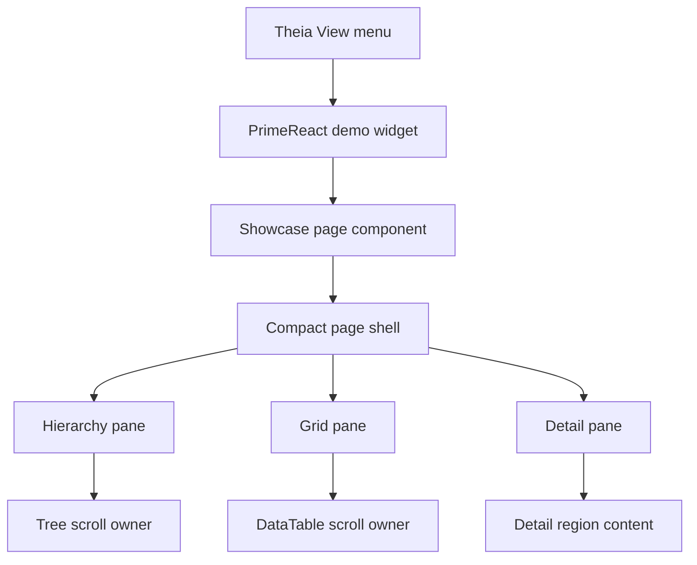

# Implementation Plan + Architecture

**Target output path:** `docs/074-primereact-research/plan-frontend-primereact-showcase-desktop-tidy-up_v0.01.md`

**Based on:** `docs/074-primereact-research/spec-frontend-primereact-showcase-desktop-tidy-up_v0.01.md`

**Version:** `v0.01` (`Draft`)

---

# Implementation Plan

## Planning constraints and delivery posture

- This plan is based on `docs/074-primereact-research/spec-frontend-primereact-showcase-desktop-tidy-up_v0.01.md`.
- All implementation work that creates or updates source code must comply fully with `./.github/instructions/documentation-pass.instructions.md`.
- `./.github/instructions/documentation-pass.instructions.md` is a **hard gate** for completion of every code-writing Work Item in this plan.
- For every code-writing Work Item, implementation must:
  - add developer-level comments to every class, including internal and other non-public types
  - add developer-level comments to every method and constructor, including internal and other non-public members
  - add parameter comments for every public method and constructor parameter where those constructs exist
  - add comments to every property whose meaning is not obvious from its name
  - add sufficient inline or block comments so a developer can follow purpose, flow, and any non-obvious logic
- This work item is frontend-only and scoped to the temporary PrimeReact showcase page already hosted inside the Theia Studio shell.
- The current repository direction for PrimeReact research demos is full styled PrimeReact only; this plan must not reintroduce unstyled mode or mode-toggle work.
- The plan is organized as small vertical slices. Each Work Item ends in a runnable, reviewable improvement to the existing showcase page inside Theia.
- The plan must preserve current showcase behaviour where possible while changing only density, layout, visual framing, and overflow ownership.
- After completing code changes for Theia Studio shell work, execution should run `yarn --cwd .\src\Studio\Server build:browser` so the user does not run stale frontend code.

## Baseline

- The temporary PrimeReact showcase page already exists and is available from `View` inside the Theia Studio shell.
- The current showcase already combines tree, grid, and detail/edit areas into one page.
- The page currently feels too spacious, too heavily boxed, and too web-page-like for the research goal.
- The current CSS uses large outer padding, generous gaps, multiple bordered surfaces, shadows, and large minimum heights that reduce density.
- Existing automated coverage already checks demo activation/menu wiring and should remain stable unless structure-specific assertions require adjustment.

## Delta

- Reduce the showcase page to a compact desktop/workbench density using the PrimeReact-supported scaling approach.
- Remove or materially reduce boxed feature framing, shadows, and non-essential card chrome.
- Rebalance the showcase into pane-oriented layout regions with smaller spacing and clearer information priority.
- Establish single-owner scrolling so either Theia or the relevant pane/control scrolls, but never both for the same content path.
- Verify that the showcase remains openable and reviewable inside the existing Theia shell workflow.

## Carry-over / Out of scope

- No redesign of the other PrimeReact demo pages.
- No changes to Theia menu structure or page registration.
- No backend, domain, or persistence work.
- No reintroduction of unstyled PrimeReact or presentation toggles.
- No permanent product UX decisions beyond this temporary showcase-page tidy-up.

---

## Slice 1 — Compact desktop density and chrome reduction

- [x] Work Item 1: Rework the showcase page into a compact, desktop-style PrimeReact surface - Completed
  - Summary: Applied a showcase-scoped compact PrimeReact density approach, flattened the showcase chrome into a pane-oriented workbench surface, tightened button/control sizing and grid row spacing after interactive review, preserved the combined tree/grid/detail interactions, updated wiki guidance, and validated with `yarn --cwd .\src\Studio\Server\search-studio test` plus `yarn --cwd .\src\Studio\Server build:browser`.
  - **Purpose**: Deliver an immediately reviewable showcase page that feels like a workbench tool surface instead of a spacious web page while preserving the existing combined tree/grid/detail evaluation flow.
  - **Acceptance Criteria**:
    - The showcase page opens from `View` as it does today.
    - The page uses visibly smaller text, smaller spacing, and tighter rhythm than the current implementation.
    - PrimeReact component sizing is reduced using a page-level supported scaling approach rather than scattered one-off size overrides.
    - Large hero-style treatment and oversized explanatory copy are removed or materially reduced.
    - Box-heavy feature framing is removed or substantially reduced so the page no longer reads as a stack of cards.
    - The tree, grid, and detail regions remain simultaneously visible and usable in the updated layout.
  - **Definition of Done**:
    - Compact density implemented end to end on the existing showcase page
    - Visual chrome reduced without removing the combined evaluation capability
    - Logging and error handling preserved where useful for existing showcase interactions
    - Code comments added in full compliance with `./.github/instructions/documentation-pass.instructions.md`
    - Relevant frontend tests updated or confirmed unchanged
    - Can execute end to end via: launch shell, open showcase from `View`, verify smaller scale and flatter layout in the running page
  - [x] Task 1.1: Apply page-level PrimeReact density/scaling to the showcase page - Completed
    - Summary: Added a showcase-only compact page wrapper that owns the smaller scale, tightened page typography and spacing, and let PrimeReact controls inherit the denser scale from that single page entry point.
    - [x] Step 1: Review the current showcase page container structure and identify the narrowest page-level wrapper that can own compact scale.
    - [x] Step 2: Apply the PrimeReact-supported scale approach at page scope so the showcase uses smaller control sizing consistently.
    - [x] Step 3: Reduce typography, field rhythm, toolbar spacing, and outer padding to a compact desktop baseline.
    - [x] Step 4: Avoid replacing the page-level scale with many individual component size overrides unless a specific control needs an exception.
    - [x] Step 5: Apply `./.github/instructions/documentation-pass.instructions.md` in full to all touched source files.
  - [x] Task 1.2: Remove web-page chrome and flatten the showcase composition - Completed
    - Summary: Replaced the spacious hero-and-card treatment with a flatter workbench header, compact metrics, lighter pane chrome, shorter copy, and minimal separators.
    - [x] Step 1: Remove or materially reduce boxed surface wrappers, shadows, border-heavy cards, and oversized section framing from the showcase-only layout.
    - [x] Step 2: Replace decorative grouping with cleaner alignment, tighter spacing, and minimal separators.
    - [x] Step 3: Use PrimeReact `Divider` only where a visual break is genuinely needed and keep it compact.
    - [x] Step 4: Simplify supporting copy and headings so the page reads like an application surface rather than a landing page.
    - [x] Step 5: Apply `./.github/instructions/documentation-pass.instructions.md` in full to all touched source files.
  - [x] Task 1.3: Preserve combined showcase usefulness at the new compact density - Completed
    - Summary: Kept the combined scenario selector, hierarchy, grid selection, and detail editing workflow intact while tightening the layout and leaving the wider demo framework untouched.
    - [x] Step 1: Keep the existing tree, table, and detail/edit interactions intact while tightening layout and spacing.
    - [x] Step 2: Ensure the compact layout still keeps the working regions visible together wherever practical.
    - [x] Step 3: Confirm toolbar, filter, status, and detail actions remain readable and operable at the smaller scale.
    - [x] Step 4: Keep changes scoped to the showcase page rather than refactoring the wider PrimeReact demo framework.
    - [x] Step 5: Apply `./.github/instructions/documentation-pass.instructions.md` in full to all touched source files.
  - **Files**:
    - `src/Studio/Server/search-studio/src/browser/primereact-demo/pages/search-studio-primereact-showcase-demo-page.tsx`: compact page composition, simplified section chrome, and any page-local structural adjustments
    - `src/Studio/Server/search-studio/src/browser/primereact-demo/search-studio-primereact-demo-widget.css`: compact density, chrome reduction, and page-specific visual rhythm updates
    - `src/Studio/Server/search-studio/test/*`: verification updates if any structure-sensitive showcase tests require changes
  - **Work Item Dependencies**: Existing PrimeReact showcase page implementation only.
  - **Run / Verification Instructions**:
    - `yarn --cwd .\src\Studio\Server\search-studio test`
    - `yarn --cwd .\src\Studio\Server build:browser`
    - Start `AppHost` with Visual Studio `F5`
    - Open the Studio shell
    - Navigate to `View` and open the PrimeReact showcase page
    - Verify the page reads as compact, flatter, and more desktop-like than the current version
  - **User Instructions**:
    - Compare the updated page to the prior showcase specifically for text size, padding, and the reduction of boxed feature framing.

---

## Slice 2 — Pane ownership and single-scroll behaviour

- [x] Work Item 2: Rework showcase overflow rules so each major region has a single clear scroll owner - Completed
  - Summary: Added widget-level full-height layout support, reworked the showcase pane structure so hierarchy, grid, and detail panes each own their intended overflow path, tightened splitter and panel min-height handling, added a widget layout regression check, updated wiki reviewer guidance, and validated with `yarn --cwd .\src\Studio\Server\search-studio test` plus `yarn --cwd .\src\Studio\Server build:browser`.
  - **Purpose**: Deliver a runnable showcase layout that behaves like a desktop workbench page, with predictable scrolling owned by the correct pane or control instead of competing outer and inner scrollbars.
  - **Acceptance Criteria**:
    - The showcase page no longer behaves like a long scrolling article under normal Theia workbench widths.
    - The tree region owns its own vertical scrolling when node content exceeds available height.
    - The grid region owns its own vertical and horizontal scrolling when its dataset exceeds available space.
    - The detail region remains usable without introducing unnecessary nested scrolling.
    - Splitter sizing, wrappers, heights, and overflow rules no longer create double-scroll behaviour for the same region.
    - The resulting page still opens and functions through the existing Theia showcase entry point.
  - **Definition of Done**:
    - Scroll ownership rules implemented end to end on the running showcase page
    - Double-scroll paths removed for major content regions under normal review widths
    - Logging and error handling preserved where useful for existing showcase interactions
    - Code comments added in full compliance with `./.github/instructions/documentation-pass.instructions.md`
    - Relevant frontend tests updated or confirmed unchanged
    - Can execute end to end via: open showcase, resize the Theia area, and confirm the owning region provides the scrollbar
  - [x] Task 2.1: Establish stable pane sizing for hierarchy, grid, and detail regions - Completed
    - Summary: Added full-height widget participation, enforced `min-height: 0` through the page, splitter, and panel stack, and kept the pane proportions desktop-oriented while preserving the existing split emphasis.
    - [x] Step 1: Review the current splitter layout, minimum heights, and wrapper containers that influence outer-page overflow.
    - [x] Step 2: Set stable page and pane heights so the showcase fits within the Theia content area where practical.
    - [x] Step 3: Adjust pane proportions so the hierarchy, grid, and detail regions receive space based on working value rather than decorative emphasis.
    - [x] Step 4: Keep the layout desktop-oriented and do not optimize primarily for narrow/mobile presentation.
    - [x] Step 5: Apply `./.github/instructions/documentation-pass.instructions.md` in full to all touched source files.
  - [x] Task 2.2: Assign explicit overflow ownership to the correct controls and wrappers - Completed
    - Summary: Introduced pane-shell and scroll-host wrappers so the tree container, flex-scroll data table, and detail pane each own their intended overflow behaviour without depending on the outer page to scroll.
    - [x] Step 1: Identify where page-shell overflow, pane overflow, and control overflow currently overlap.
    - [x] Step 2: Update CSS and page structure so each major region has one clear vertical scroll owner.
    - [x] Step 3: Ensure horizontal overflow, when needed, is owned by the relevant control region and not duplicated by outer containers.
    - [x] Step 4: Verify that tree, data table, and detail/edit surfaces remain usable when content grows.
    - [x] Step 5: Apply `./.github/instructions/documentation-pass.instructions.md` in full to all touched source files.
  - [x] Task 2.3: Add focused verification for resize and scroll behaviour - Completed
    - Summary: Updated the widget test to assert the full-height layout setup needed for pane-owned scrolling and expanded the Studio wiki reviewer notes to cover resize and scrollbar ownership checks.
    - [x] Step 1: Review existing showcase-related tests and update only where layout-specific assertions need to change.
    - [x] Step 2: Add or adjust lightweight verification for any helper logic or page-state behaviour touched during the tidy-up.
    - [x] Step 3: Add reviewer guidance notes within the work package if needed so manual validation covers resize and scroll ownership clearly.
    - [x] Step 4: Apply `./.github/instructions/documentation-pass.instructions.md` in full to all touched source files.
  - **Files**:
    - `src/Studio/Server/search-studio/src/browser/primereact-demo/pages/search-studio-primereact-showcase-demo-page.tsx`: pane structure, splitter usage, and any wrapper changes needed for scroll ownership
    - `src/Studio/Server/search-studio/src/browser/primereact-demo/search-studio-primereact-demo-widget.css`: overflow rules, pane sizing, splitter sizing, and compact scrollbar ownership behaviour
    - `src/Studio/Server/search-studio/test/*`: showcase verification updates if required
    - `docs/074-primereact-research/*`: optional reviewer notes if a short manual verification note is needed in the same work package
  - **Work Item Dependencies**: Work Item 1.
  - **Run / Verification Instructions**:
    - `yarn --cwd .\src\Studio\Server\search-studio test`
    - `yarn --cwd .\src\Studio\Server build:browser`
    - Start `AppHost` with Visual Studio `F5`
    - Open the Studio shell
    - Open the PrimeReact showcase page from `View`
    - Resize the Theia content area and confirm scrolling is owned by the relevant pane or control, not by competing nested regions
  - **User Instructions**:
    - Review the updated page at typical desktop widths first, then narrow the page moderately to confirm scroll ownership remains predictable.

---

## Overall approach summary

This plan keeps the work tightly scoped to the existing showcase page and delivers value in two runnable slices:

1. first reduce scale, spacing, and chrome so the page feels like a desktop/workbench surface
2. then rebalance pane sizing and overflow ownership so scrolling behaves like a real application view rather than a web page

Key considerations for implementation are:

- keep the work limited to the showcase page only
- prefer a PrimeReact-supported scale mechanism over ad hoc shrinkage
- remove decorative boxes rather than inventing new replacement chrome
- make tree, grid, and detail regions feel like working panes
- treat `./.github/instructions/documentation-pass.instructions.md` as mandatory for all code-writing work
- finish with browser build and in-shell review so the user sees the actual updated Theia experience

---

# Architecture

## Overall Technical Approach

The implementation remains inside the existing temporary PrimeReact demo area of the Theia Studio shell. No new projects, services, or runtime boundaries are introduced.

The technical approach is to refine the current showcase page in place:

- keep the existing showcase entry point and data-driven interaction model
- reduce the rendered density using a supported PrimeReact scale approach applied at page scope
- simplify the page chrome by removing heavy wrappers and decorative surfaces
- rebalance the layout into stable working panes
- make overflow behaviour explicit so each major region has one clear scroll owner

At a high level, the page continues to sit inside the existing Theia widget host:

The work is intentionally local to the frontend presentation layer and does not change backend or domain data flows.

## Frontend

The frontend implementation remains in `src/Studio/Server/search-studio/src/browser/primereact-demo/`.

Primary elements and responsibilities:

- `pages/search-studio-primereact-showcase-demo-page.tsx`
  - owns the combined showcase page structure
  - coordinates the tree, grid, detail/edit, and scenario interactions
  - is the main place for structural changes that reduce hero treatment and rebalance pane layout

- `search-studio-primereact-demo-widget.css`
  - owns the current density, spacing, chrome, pane sizing, and overflow rules
  - is the main location for compact desktop styling and single-owner scroll behaviour

- existing demo host and Theia integration files
  - remain unchanged unless a small showcase-specific hook is required
  - continue to expose the page through the existing Theia widget pathway

User flow after implementation:

1. the user opens the showcase page from `View`
2. the page renders in compact styled PrimeReact density
3. the user reviews hierarchy, grid, and detail regions together
4. each major region scrolls only within its owning pane/control when content exceeds space
5. the page continues to function as a temporary review surface inside Theia

## Backend

No backend changes are planned or required.

The showcase continues to use existing in-memory demo data and page-local state. There are no new APIs, persistence concerns, or service boundaries for this work item.
