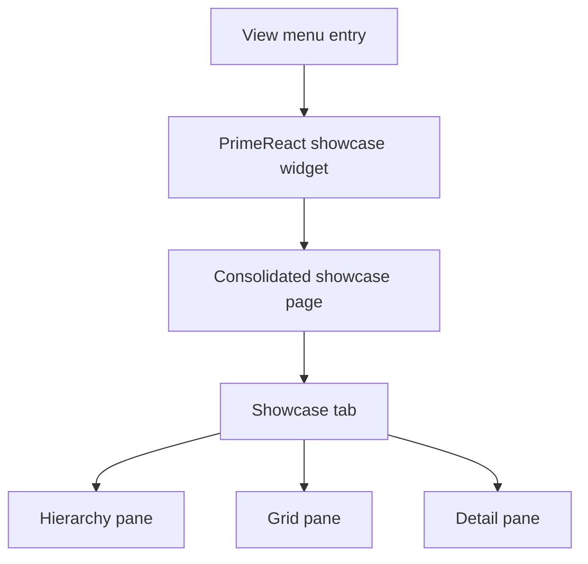

# Implementation Plan + Architecture

**Target output path:** `docs/074-primereact-research/plan-frontend-primereact-showcase-tab-density-tidy-up_v0.01.md`

**Based on:** `docs/074-primereact-research/spec-frontend-primereact-showcase-tab-density-tidy-up_v0.01.md`

**Version:** `v0.01` (`Draft`)

---

# Implementation Plan

## Planning constraints and delivery posture

- This plan is based on `docs/074-primereact-research/spec-frontend-primereact-showcase-tab-density-tidy-up_v0.01.md`.
- All implementation work that creates or updates source code must comply fully with `./.github/instructions/documentation-pass.instructions.md`.
- `./.github/instructions/documentation-pass.instructions.md` is a **hard gate** and mandatory Definition of Done criterion for every code-writing Work Item in this plan.
- For every code-writing Work Item, implementation must:
  - follow `./.github/instructions/documentation-pass.instructions.md` in full for all touched source files
  - add developer-level comments to every touched class, including internal and other non-public types where applicable
  - add developer-level comments to every touched method and constructor, including internal and other non-public members where applicable
  - add parameter comments for every public method and constructor parameter where those constructs exist
  - add comments to every property whose meaning is not obvious from its name
  - add sufficient inline or block comments so a developer can understand purpose, logical flow, and non-obvious decisions
- This work is frontend-only and scoped to the consolidated PrimeReact `Showcase` tab inside the Theia Studio shell.
- Styled PrimeReact remains the only supported presentation mode for this research area.
- The intended UX target is tighter Theia-like desktop density, not a general restyling of all tabs.
- The implementation must preserve the existing hierarchy, grid, and detail workflow while improving density and deterministic scroll ownership.
- The summary/status strip is to be removed completely rather than visually restyled.
- The existing `Grid filter` and `Filter showcase hierarchy` textboxes are the preferred local typography reference and should not be degraded.
- The plan is organized as small vertical slices so each Work Item ends in a runnable, reviewable improvement in the existing shell.
- After completing code changes for Theia Studio shell work, execution should run `yarn --cwd .\src\Studio\Server build:browser` so the user does not run stale frontend code.

## Baseline

- The consolidated PrimeReact research surface already exists as a single showcase page with root tabs.
- The retained `Showcase` tab currently combines hierarchy, grid, and detail panes in one compact workbench-style layout.
- The current `Showcase` tab is still visually heavier and more spacious than desired for Theia alignment.
- A summary/status strip remains above the main working area and consumes vertical space.
- The grid text and hierarchy tree text are currently too large and too bold relative to the desired density baseline.
- The grid vertical scrollbar does not appear reliably when the workbench becomes narrower, while the detail pane below behaves correctly.
- Existing node-based frontend tests already cover parts of the PrimeReact showcase shell and will likely need updates for removed status content and density-sensitive layout expectations.
- The repository wiki already contains Studio shell reviewer guidance and should be updated if the implementation materially changes how the showcase should be assessed.

## Delta

- Remove the upper summary/status strip from the `Showcase` tab entirely.
- Reduce title, heading, grid, and hierarchy typography size and weight so the page feels closer to Theia.
- Tighten spacing, row height, padding, and control rhythm for the hierarchy and grid regions.
- Keep the existing filter textboxes broadly unchanged and use their typography as a compact reference point.
- Correct the grid layout so vertical scrolling appears deterministically when the available grid viewport becomes insufficient at narrower widths.
- Preserve the current detail pane behavior and avoid regressions in its overflow handling.
- Update focused tests and reviewer guidance to reflect the reduced chrome, lighter density, and scrollbar behavior expectations.

## Carry-over / Out of scope

- No backend, domain, service, or persistence work.
- No changes to non-`Showcase` tabs unless a safe shared styling hook must be adjusted for the `Showcase` tab to work correctly.
- No redesign of mock data, scenarios, or detail-edit behavior.
- No new route, command, menu item, or page registration work.
- No broad visual redesign that would move the experience away from the current styled PrimeReact baseline.

---

## Slice 1 — Remove summary chrome and establish smaller heading density

- [x] Work Item 1: Remove the `Showcase` summary/status strip and rebalance the page shell for denser working content - Completed
  - Summary: Removed the retired `Showcase` summary strip and remaining local showcase hero/theme-sync header, tightened showcase heading density in the scoped stylesheet, updated showcase shell regression coverage, and refreshed the Studio wiki reviewer guidance for the reclaimed workspace area.
  - **Purpose**: Deliver an immediately reviewable improvement by reclaiming vertical space, reducing oversized emphasis, and making the `Showcase` tab feel more like a Theia workbench surface without changing its core workflow.
  - **Acceptance Criteria**:
    - The summary/status strip containing items such as `Grid selection`, `Hierarchy selection`, `Scenario`, and `Last action` is no longer rendered on the `Showcase` tab.
    - The remaining working content reflows upward and uses the reclaimed space rather than leaving decorative gaps.
    - Remaining page and section titles are visibly smaller and lighter than before.
    - The `Grid filter` and `Filter showcase hierarchy` textboxes remain acceptable and are not visually enlarged or made heavier.
    - The `Showcase` tab remains runnable and visually coherent inside the existing consolidated shell.
  - **Definition of Done**:
    - Summary/status strip removed end to end from the `Showcase` tab
    - Smaller and lighter title styling applied without breaking layout
    - Logging and error handling preserved where relevant for page rendering
    - Code comments added in full compliance with `./.github/instructions/documentation-pass.instructions.md`
    - Relevant frontend tests updated or added
    - Wiki guidance updated if reviewer expectations change materially
    - Can execute end to end via: open the PrimeReact showcase page from `View`, confirm the `Showcase` tab opens without the summary/status strip, and verify the main working panes occupy the reclaimed space
  - [x] Task 1.1: Remove summary/status-strip markup and related layout dependencies - Completed
    - [x] Step 1: Review the current `Showcase` tab component structure to identify the full summary/status strip markup, wrappers, and any dependent spacing rules.
    - [x] Step 2: Remove the summary/status strip content and any title/panel wrappers that belong only to that section.
    - [x] Step 3: Rebalance surrounding layout containers so the reclaimed vertical space is absorbed by the remaining hierarchy, grid, and detail working area.
    - [x] Step 4: Apply `./.github/instructions/documentation-pass.instructions.md` in full to all touched source files.
  - [x] Task 1.2: Reduce title and section-heading scale toward the Theia baseline - Completed
    - [x] Step 1: Review the current page title, section title, and label typography within the `Showcase` tab.
    - [x] Step 2: Reduce heading font size, weight, and spacing so titles support orientation without dominating the page.
    - [x] Step 3: Keep the `Grid filter` and `Filter showcase hierarchy` controls broadly unchanged and use them as a reference point for nearby typography weight and sizing.
    - [x] Step 4: Apply `./.github/instructions/documentation-pass.instructions.md` in full to all touched source files.
  - [x] Task 1.3: Add focused verification for removed chrome and reduced title density - Completed
    - [x] Step 1: Update or add frontend tests that assert the summary/status strip is absent from the `Showcase` tab.
    - [x] Step 2: Add focused checks, where practical, that the retained headings and labels still render correctly after the layout simplification.
    - [x] Step 3: Update `wiki/Tools-UKHO-Search-Studio.md` so reviewers know to assess reduced chrome, smaller titles, and improved working-space usage.
    - [x] Step 4: Apply `./.github/instructions/documentation-pass.instructions.md` in full to all touched source files.
  - **Files**:
    - `src/Studio/Server/search-studio/src/browser/primereact-demo/pages/search-studio-primereact-showcase-demo-page.tsx`: remove summary/status strip and rebalance page composition
    - `src/Studio/Server/search-studio/src/browser/primereact-demo/search-studio-primereact-demo-widget.css`: heading, spacing, and shell-density adjustments for the `Showcase` tab
    - `src/Studio/Server/search-studio/test/primereact-showcase-tabbed-shell.test.js`: showcase-tab shell verification updates
    - `wiki/Tools-UKHO-Search-Studio.md`: reviewer guidance for the denser `Showcase` presentation
  - **Work Item Dependencies**: Existing consolidated showcase shell and current `Showcase` tab layout.
  - **Run / Verification Instructions**:
    - `yarn --cwd .\src\Studio\Server\search-studio test`
    - `yarn --cwd .\src\Studio\Server build:browser`
    - Start `AppHost` with Visual Studio `F5`
    - Open the Studio shell
    - Navigate to `View` and open `PrimeReact Showcase Demo`
    - Confirm the `Showcase` tab no longer renders the summary/status strip and that the main panes occupy the available space with smaller titles
  - **User Instructions**: Review the `Showcase` tab at your normal desktop width and confirm the page feels less like a demo dashboard and more like a workbench surface.

---

## Slice 2 — Fix grid scroll ownership and compact the grid region

- [x] Work Item 2: Make the grid own vertical scrolling reliably and reduce grid typography weight and size - Completed
  - Summary: Centralized the `Showcase` grid scroll/density contract, switched the grid to a stable full-height inner scroll configuration, tightened grid header/body typography, centralized compact control font sizing, paginator sizing, and row spacing, added focused regression coverage for the grid contract, and refreshed Studio reviewer guidance for scrollbar validation.
  - **Purpose**: Deliver the most important interaction fix in the spec by ensuring the grid scrolls correctly at narrower widths while also making the grid read as a denser, calmer desktop table.
  - **Acceptance Criteria**:
    - The grid displays and owns a vertical scrollbar whenever row content exceeds the visible grid viewport height.
    - Narrowing the workbench can trigger the grid scrollbar deterministically without requiring the user to widen the window first.
    - The detail pane below retains its currently correct overflow behavior.
    - Grid body and header typography are visibly smaller and lighter than before.
    - Grid row spacing, padding, and line-height feel tighter overall rather than just smaller in font size.
    - The `Grid filter` control remains visually acceptable and is not unintentionally degraded.
  - **Definition of Done**:
    - Grid scroll ownership corrected end to end in the `Showcase` tab
    - Grid density tightened through typography and spacing updates
    - Logging and error handling preserved where relevant for page rendering or resize-safe behavior
    - Code comments added in full compliance with `./.github/instructions/documentation-pass.instructions.md`
    - Relevant frontend tests updated or added
    - Can execute end to end via: open the `Showcase` tab, narrow the workbench, confirm the grid vertical scrollbar appears when needed, and verify the detail pane still behaves correctly
  - [x] Task 2.1: Correct deterministic grid overflow behavior inside the `Showcase` layout - Completed
    - [x] Step 1: Review the current grid container, splitter/pane sizing rules, and overflow CSS to identify why vertical scrolling depends on resize side effects.
    - [x] Step 2: Adjust the `Showcase` layout and grid-region sizing so the grid has a stable height contract and owns its own vertical overflow.
    - [x] Step 3: Verify the grid scrollbar appears correctly when the workbench is narrowed and the effective viewport becomes insufficient.
    - [x] Step 4: Preserve the current detail-pane scrollbar behavior and avoid introducing competing scroll owners.
    - [x] Step 5: Apply `./.github/instructions/documentation-pass.instructions.md` in full to all touched source files.
  - [x] Task 2.2: Tighten grid typography, row density, and emphasis - Completed
    - [x] Step 1: Reduce grid body and header font size so the table aligns more closely with the compact filter textbox baseline.
    - [x] Step 2: Reduce font weight and ease off bold usage across the grid unless a stronger emphasis remains clearly justified.
    - [x] Step 3: Tighten row padding, line-height, and related spacing so the grid feels denser as a whole.
    - [x] Step 4: Keep the `Grid filter` control broadly unchanged and confirm nearby text styling does not make it feel inconsistent.
    - [x] Step 5: Apply `./.github/instructions/documentation-pass.instructions.md` in full to all touched source files.
  - [x] Task 2.3: Add focused verification for grid scrollbar behavior and density - Completed
    - [x] Step 1: Update or add frontend tests around the `Showcase` tab so the grid region still renders correctly after layout changes.
    - [x] Step 2: Add practical checks for the absence of regressions in grid and detail pane composition, using the current node-based test approach where full resize simulation is limited.
    - [x] Step 3: Update wiki reviewer guidance so manual review explicitly covers grid scrollbar appearance under narrower widths and reduced grid text density.
    - [x] Step 4: Apply `./.github/instructions/documentation-pass.instructions.md` in full to all touched source files.
  - **Files**:
    - `src/Studio/Server/search-studio/src/browser/primereact-demo/pages/search-studio-primereact-showcase-demo-page.tsx`: grid-region layout and sizing adjustments
    - `src/Studio/Server/search-studio/src/browser/primereact-demo/search-studio-primereact-demo-widget.css`: grid overflow, row density, and typography refinements
    - `src/Studio/Server/search-studio/test/primereact-showcase-tabbed-shell.test.js`: showcase grid-layout regression checks
    - `wiki/Tools-UKHO-Search-Studio.md`: reviewer guidance for scrollbar and grid-density validation
  - **Work Item Dependencies**: Work Item 1.
  - **Run / Verification Instructions**:
    - `yarn --cwd .\src\Studio\Server\search-studio test`
    - `yarn --cwd .\src\Studio\Server build:browser`
    - Start `AppHost` with Visual Studio `F5`
    - Open the Studio shell
    - Navigate to `View` and open `PrimeReact Showcase Demo`
    - On the `Showcase` tab, reduce the workbench width and confirm the grid shows its own vertical scrollbar when needed while the detail pane still scrolls correctly
  - **User Instructions**: Review the grid first at normal width and then after narrowing the workbench so you can compare density and confirm the scrollbar no longer depends on widening the window.

---

## Slice 3 — Tighten hierarchy-tree density and finish Theia-aligned polish

- [x] Work Item 3: Compact the hierarchy tree and complete the final Theia-aligned typography pass for the `Showcase` tab - Completed
  - Summary: Centralized the `Showcase` hierarchy contract, tightened tree label and control spacing, applied the final lighter-weight typography pass across remaining showcase labels and detail headings, removed the heavy publish-follow-up card chrome, refined paginator dropdown alignment, added focused regression coverage for the hierarchy contract and retained regions, and refreshed the Studio wiki reviewer guidance for final Theia-aligned assessment.
  - **Purpose**: Finish the density tidy-up by bringing the tree control and remaining `Showcase` typography into closer alignment with the compact filter textbox baseline and Theia workbench rhythm.
  - **Acceptance Criteria**:
    - The hierarchy tree uses materially tighter vertical spacing than before.
    - Hierarchy node text is smaller and visually closer to the watermark typography in the `Filter showcase hierarchy` textbox.
    - Checkbox, expander, icon, and row padding feel denser without harming readability.
    - Remaining labels and titles across the `Showcase` tab use lighter weight and restrained emphasis.
    - The final `Showcase` tab reads as one coherent styled PrimeReact surface rather than a patchwork of isolated overrides.
  - **Definition of Done**:
    - Hierarchy tree density and typography refined end to end
    - Remaining `Showcase` typography aligned more closely with Theia density goals
    - Logging and error handling preserved where relevant for page rendering
    - Code comments added in full compliance with `./.github/instructions/documentation-pass.instructions.md`
    - Relevant frontend tests updated or added
    - Wiki guidance updated for final reviewer checks
    - Can execute end to end via: open the `Showcase` tab, review hierarchy density against the filter textbox baseline, and confirm the full surface feels denser and lighter overall
  - [x] Task 3.1: Tighten hierarchy tree node spacing and typography - Completed
    - [x] Step 1: Review the current hierarchy tree row structure, PrimeReact tree classes, checkbox spacing, and node-label typography.
    - [x] Step 2: Reduce node text size and weight so it aligns more closely with the compact textbox watermark baseline.
    - [x] Step 3: Tighten expander, checkbox, icon, and row padding so the tree becomes materially denser without appearing broken.
    - [x] Step 4: Preserve usability and readability for tree interaction after the density reduction.
    - [x] Step 5: Apply `./.github/instructions/documentation-pass.instructions.md` in full to all touched source files.
  - [x] Task 3.2: Complete the final typography-weight pass across the remaining `Showcase` content - Completed
    - [x] Step 1: Review residual labels, badges, and supporting text across the `Showcase` tab for over-heavy weight or oversized scale.
    - [x] Step 2: Reduce unnecessary bold emphasis while preserving clear semantic cues where they still add value.
    - [x] Step 3: Keep the overall page visually calm, compact, and aligned with Theia workbench density.
    - [x] Step 4: Apply `./.github/instructions/documentation-pass.instructions.md` in full to all touched source files.
  - [x] Task 3.3: Finish regression coverage and final reviewer documentation - Completed
    - [x] Step 1: Update or add focused tests so the `Showcase` tab still renders the hierarchy, grid, and detail regions correctly after the density pass.
    - [x] Step 2: Add practical checks for the continued presence of hierarchy filtering and the absence of removed status content.
    - [x] Step 3: Update `wiki/Tools-UKHO-Search-Studio.md` so manual reviewers assess hierarchy density, title scale, and overall Theia alignment together.
    - [x] Step 4: Apply `./.github/instructions/documentation-pass.instructions.md` in full to all touched source files.
  - **Files**:
    - `src/Studio/Server/search-studio/src/browser/primereact-demo/pages/search-studio-primereact-showcase-demo-page.tsx`: hierarchy-tree presentation and remaining label refinements
    - `src/Studio/Server/search-studio/src/browser/primereact-demo/search-studio-primereact-demo-widget.css`: hierarchy density, label-weight, and final typography tuning
    - `src/Studio/Server/search-studio/test/primereact-showcase-tabbed-shell.test.js`: final showcase density and render regression checks
    - `wiki/Tools-UKHO-Search-Studio.md`: final reviewer guidance for Theia-aligned density assessment
  - **Work Item Dependencies**: Work Item 2.
  - **Run / Verification Instructions**:
    - `yarn --cwd .\src\Studio\Server\search-studio test`
    - `yarn --cwd .\src\Studio\Server build:browser`
    - Start `AppHost` with Visual Studio `F5`
    - Open the Studio shell
    - Navigate to `View` and open `PrimeReact Showcase Demo`
    - On the `Showcase` tab, compare hierarchy text and spacing to the `Filter showcase hierarchy` textbox and confirm the overall page now feels lighter, smaller, and denser
  - **User Instructions**: Compare the hierarchy text size against the filter textbox watermark and confirm the final page feels closer to Theia in density, weight, and spacing.

---

## Overall approach summary

This plan keeps the work tightly scoped to the existing PrimeReact `Showcase` tab and delivers value in three runnable vertical slices:

1. remove low-value summary chrome and shrink heading emphasis so the page immediately feels denser
2. fix the grid scrollbar defect while also compacting the grid's typography and spacing
3. finish the tree-density pass and lighter typography alignment so the full `Showcase` surface sits closer to Theia

Key implementation considerations are:

- keep the existing `Showcase` workflow intact while reducing visual weight and wasted space
- treat the filter textboxes as the local compact typography reference rather than broadening the page back out
- make grid overflow deterministic through layout ownership, not resize side effects
- preserve the detail pane's correct behavior while correcting the grid
- tighten the hierarchy tree materially, but not to the point of harming readability or usability
- update tests and wiki guidance so the refined density and scrollbar expectations remain reviewable
- treat `./.github/instructions/documentation-pass.instructions.md` as mandatory for every code-writing step

---

# Architecture

## Overall Technical Approach

The implementation remains fully inside the existing Theia Studio shell PrimeReact demo frontend. No new services, routes, data models, or backend integrations are required.

The technical approach is to refine the retained `Showcase` tab in place by:

- removing non-essential summary chrome from the top of the page
- tightening local typography and spacing toward a Theia-like workbench density baseline
- correcting the grid pane's layout and overflow contract so it owns vertical scrolling reliably
- keeping the detail pane's existing overflow behavior intact
- reducing hierarchy-tree row and text scale so the left-hand pane matches the rest of the compact page more closely
- preserving the current styled PrimeReact visual baseline rather than introducing a different presentation model

At a high level, the runtime flow remains:

The refinement focuses on markup and CSS coordination within the existing `Showcase` tab. The primary technical risk area is the grid overflow contract, which must be corrected by stable sizing and overflow rules rather than by incidental browser repaint behavior.

## Frontend

The frontend work is centered in the Theia-hosted PrimeReact demo page and its associated stylesheet.

Primary frontend responsibilities:

- `search-studio-primereact-showcase-demo-page.tsx`
  - owns the `Showcase` tab composition
  - renders the hierarchy, grid, and detail regions
  - will be updated to remove the summary/status strip and preserve the remaining working layout

- `search-studio-primereact-demo-widget.css`
  - owns the compact workbench-oriented styling for the PrimeReact research surface
  - will be updated to reduce heading scale, grid density, hierarchy density, and excess font weight
  - will be updated to enforce a deterministic grid overflow contract

- `primereact-showcase-tabbed-shell.test.js`
  - provides focused regression coverage for the consolidated showcase shell
  - should be updated to cover removal of the status strip and preservation of the remaining `Showcase` structure

- `wiki/Tools-UKHO-Search-Studio.md`
  - captures reviewer guidance for manual validation of density, layout, and scroll ownership inside the Studio shell

Frontend user flow after implementation:

1. the user opens `PrimeReact Showcase Demo` from `View`
2. the consolidated page opens on the `Showcase` tab
3. the user sees a denser layout with no summary/status strip
4. the user filters the hierarchy or grid using the existing textboxes
5. the user narrows the workbench and the grid shows its own vertical scrollbar when required
6. the user reviews the hierarchy, grid, and detail panes in a tighter Theia-like workbench presentation

## Backend

No backend changes are required.

The work does not alter APIs, services, data persistence, or application state management outside the existing frontend component tree. Existing mock content and local page interactions remain the source of displayed data for this refinement.
