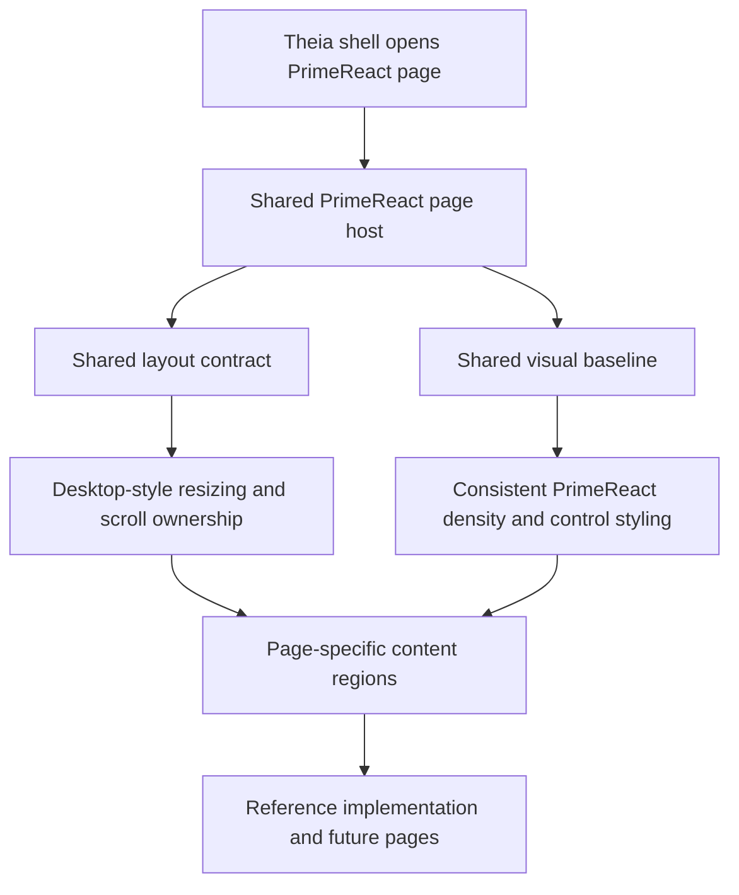

# Implementation Plan + Architecture

**Target output path:** `docs/075-primereact-system/plan-frontend-primereact-system_v0.01.md`

**Based on:** `docs/075-primereact-system/spec-frontend-primereact-system_v0.01.md`

**Version:** `v0.01` (`Draft`)

---

# Implementation Plan

## Planning constraints and delivery posture

- This plan is based on `docs/075-primereact-system/spec-frontend-primereact-system_v0.01.md`.
- All implementation work that creates or updates source code must comply fully with `./.github/instructions/documentation-pass.instructions.md`.
- `./.github/instructions/documentation-pass.instructions.md` is a **hard gate** and mandatory Definition of Done criterion for every code-writing Work Item in this plan.
- For every code-writing Work Item, implementation must:
  - follow `./.github/instructions/documentation-pass.instructions.md` in full for all touched source files
  - add developer-level comments to every touched class, including internal and other non-public types where applicable
  - add developer-level comments to every touched method and constructor, including internal and other non-public members where applicable
  - add parameter comments for every public method and constructor parameter where those constructs exist
  - add comments to every property whose meaning is not obvious from its name
  - add sufficient inline or block comments so a developer can understand purpose, logical flow, and non-obvious decisions
- This work is frontend-only and focused on shared PrimeReact/Theia behavior inside the existing Studio shell.
- The target outcome is one shared PrimeReact desktop-style foundation that produces a working starter page/host pattern for future surfaces.
- The `Showcase` tab is the initial reference implementation and must remain runnable throughout the work.
- Future page-level deviations are expected to remain case by case, but the default path must be the shared system rather than ad hoc page-local behavior.
- The detailed dedicated wiki page is the authoritative implementation guide, while `wiki/Tools-UKHO-Search-Studio.md` remains the summary and entry point.
- The implementation should prefer one practical page host/setup pattern with light reusable layout helpers over a family of rigid templates.
- After completing code changes for Theia Studio shell work, execution should run `yarn --cwd .\src\Studio\Server build:browser` so the user does not run stale frontend code.

## Baseline

- PrimeReact research pages already exist in the Theia Studio shell and share some visual conventions through `search-studio-primereact-demo-widget.css`.
- The current `Showcase` tab is the strongest example of the desired desktop-style resize and overflow behavior.
- Other PrimeReact pages still rely on more page-local structure and styling than desired for a reusable system.
- Shared CSS tokens already exist, but shared layout and density behavior are not yet organized as one clearly reusable foundation.
- There is not yet a dedicated authoritative wiki page describing the PrimeReact/Theia UI system, starter pattern, shared file locations, and required authoring checklist.
- Existing node-based tests cover the current PrimeReact demo widget and `Showcase` shell behavior and can be extended to protect the shared foundation.

## Delta

- Introduce one shared PrimeReact/Theia visual baseline for current and future PrimeReact surfaces.
- Introduce one shared desktop-style layout contract for full-height behavior, splitter composition, min-size handling, and inner scroll ownership.
- Provide a working starter host/pattern so a developer can build a new PrimeReact page with correct density and desktop-like behavior from the start.
- Migrate existing PrimeReact demo pages onto that shared foundation incrementally, with `Showcase` acting as the documented reference implementation.
- Create a dedicated authoritative wiki page plus a summary entry in `wiki/Tools-UKHO-Search-Studio.md` that documents setup, locations, checklist, and extension guidance.

## Carry-over / Out of scope

- No backend, domain, service, persistence, or API changes.
- No extraction into a separate reusable cross-project package during the initial Studio-first implementation.
- No attempt to eliminate all future page-level deviations up front; exceptions remain case by case.
- No commitment to a rigid library of template pages unless later evidence shows that one page host plus light helpers is insufficient.

---

## Slice 1 — Establish the shared PrimeReact desktop foundation and migrate `Showcase` as the reference implementation

- [ ] Work Item 1: Introduce the shared PrimeReact/Theia styling and layout foundation and prove it end to end through the `Showcase` reference surface
  - **Purpose**: Deliver the smallest meaningful vertical slice by promoting the current best `Showcase` behavior into a shared system while keeping one runnable, demonstrable page as the reference implementation for future authoring.
  - **Acceptance Criteria**:
    - A shared PrimeReact/Theia baseline exists for visual density, control styling, and desktop-style layout behavior inside the Studio shell.
    - A light shared page host/setup pattern exists and can be used by PrimeReact surfaces without introducing rigid page templates.
    - The `Showcase` tab is migrated to the shared baseline and still behaves like a desktop workbench surface with correct inner scroll ownership.
    - The shared foundation is organized in a recommended canonical file/folder structure that can be documented and reused.
    - Focused regression tests protect the shared foundation and the `Showcase` reference implementation.
  - **Definition of Done**:
    - Shared styling baseline implemented
    - Shared layout contract implemented
    - `Showcase` migrated as reference implementation
    - Logging and error handling preserved where relevant for page rendering or layout-safe runtime behavior
    - Code comments added in full compliance with `./.github/instructions/documentation-pass.instructions.md`
    - Relevant frontend tests updated or added
    - Can execute end to end via: open `PrimeReact Showcase Demo`, confirm the `Showcase` tab still renders as the reference desktop-style page using the shared host/layout contract
  - [ ] Task 1.1: Introduce the shared PrimeReact/Theia visual baseline in a canonical shared location
    - [ ] Step 1: Identify the visual rules already proven by the current `Showcase` work that should be promoted from page-local selectors into the shared baseline.
    - [ ] Step 2: Reorganize the existing PrimeReact CSS into a clearer shared foundation structure with recommended canonical locations for shared tokens, control density, and desktop-style component treatment.
    - [ ] Step 3: Preserve only narrow `Showcase`-specific rules that are truly layout-local rather than generally reusable.
    - [ ] Step 4: Apply `./.github/instructions/documentation-pass.instructions.md` in full to all touched source files.
  - [ ] Task 1.2: Introduce the shared desktop page host/setup pattern with light reusable layout helpers
    - [ ] Step 1: Define the minimal shared layout contract required for full-height behavior, `min-width: 0`, `min-height: 0`, splitter behavior, and inner scroll ownership.
    - [ ] Step 2: Add light reusable layout helpers or host wrappers in the PrimeReact frontend area so new pages can start from a working page pattern rather than hand-building layout behavior.
    - [ ] Step 3: Keep the model flexible enough that future pages can vary in composition without breaking the shared contract.
    - [ ] Step 4: Apply `./.github/instructions/documentation-pass.instructions.md` in full to all touched source files.
  - [ ] Task 1.3: Migrate the `Showcase` page onto the shared foundation as the reference implementation
    - [ ] Step 1: Update the `Showcase` page and any supporting tab-content composition so the page consumes the shared host/setup pattern and shared baseline rules.
    - [ ] Step 2: Preserve the current `Showcase` desktop-style resize, splitter, and scroll behavior while reducing bespoke page-local coupling.
    - [ ] Step 3: Add or update focused regression tests for shared host/layout usage and continued `Showcase` behavior.
    - [ ] Step 4: Apply `./.github/instructions/documentation-pass.instructions.md` in full to all touched source files.
  - **Files**:
    - `src/Studio/Server/search-studio/src/browser/primereact-demo/search-studio-primereact-demo-widget.css`: reorganize shared PrimeReact/Theia tokens, density rules, and shared layout baseline
    - `src/Studio/Server/search-studio/src/browser/primereact-demo/search-studio-primereact-demo-page.tsx`: adopt the shared PrimeReact page host/setup model if this is the correct common entry point
    - `src/Studio/Server/search-studio/src/browser/primereact-demo/pages/search-studio-primereact-showcase-demo-page.tsx`: migrate `Showcase` onto the shared foundation as the reference implementation
    - `src/Studio/Server/search-studio/src/browser/primereact-demo/`: add light shared layout helper files if needed for the page host/setup pattern
    - `src/Studio/Server/search-studio/test/primereact-showcase-tabbed-shell.test.js`: protect shared host/layout usage and the `Showcase` reference behavior
    - `src/Studio/Server/search-studio/test/search-studio-primereact-demo-widget.test.js`: add or adjust shared demo widget coverage where the host contract is centralized
  - **Work Item Dependencies**: Existing PrimeReact demo shell and current `Showcase` reference behavior.
  - **Run / Verification Instructions**:
    - `yarn --cwd .\src\Studio\Server\search-studio test`
    - `yarn --cwd .\src\Studio\Server build:browser`
    - Start `AppHost` with Visual Studio `F5`
    - Open the Studio shell
    - Navigate to `View` and open `PrimeReact Showcase Demo`
    - Confirm the `Showcase` tab still behaves like the reference desktop-style PrimeReact page using the shared foundation
  - **User Instructions**: Review the `Showcase` tab and confirm it still feels like a desktop workbench surface while now acting as the shared-system reference implementation.

---

## Slice 2 — Migrate the remaining PrimeReact research pages onto the shared foundation

- [ ] Work Item 2: Move the retained PrimeReact demo/research pages onto the shared baseline so the system is no longer `Showcase`-only
  - **Purpose**: Deliver the next runnable slice by proving that the shared foundation works beyond `Showcase`, reducing duplication and ensuring future pages inherit one standard approach.
  - **Acceptance Criteria**:
    - The retained PrimeReact pages use the shared host/layout contract and shared visual baseline by default.
    - Data-heavy pages use desktop-style inner scroll ownership instead of page-like overflow behavior.
    - Page-local exceptions are reduced to narrow, justified cases.
    - Existing root-tab navigation and current page capabilities continue to function.
    - Focused tests cover the migrated pages and the shared page pattern.
  - **Definition of Done**:
    - Retained PrimeReact pages migrated to shared baseline
    - Shared page-host pattern reused consistently
    - Logging and error handling preserved where relevant for rendering or tab/page activation
    - Code comments added in full compliance with `./.github/instructions/documentation-pass.instructions.md`
    - Relevant frontend tests updated or added
    - Can execute end to end via: open `PrimeReact Showcase Demo`, switch across retained PrimeReact tabs/pages, and confirm the shared density and desktop-style layout behavior applies consistently
  - [ ] Task 2.1: Migrate the retained PrimeReact page set onto the shared page host/setup pattern
    - [ ] Step 1: Identify the currently retained PrimeReact pages and tab-content surfaces that should consume the shared host/setup contract.
    - [ ] Step 2: Update those pages so they use the shared baseline and recommended layout helpers rather than local ad hoc structure wherever practical.
    - [ ] Step 3: Preserve page-specific functionality while reducing duplication and one-off layout behavior.
    - [ ] Step 4: Apply `./.github/instructions/documentation-pass.instructions.md` in full to all touched source files.
  - [ ] Task 2.2: Normalize desktop-style resize and overflow behavior across the migrated pages
    - [ ] Step 1: Review forms, data-view, data-table, tree, tree-table, and related demo surfaces for outer-page scrolling, inconsistent min-size behavior, or web-page-like resizing.
    - [ ] Step 2: Correct those pages so they inherit the same desktop-style resize/scroll model established by the shared contract.
    - [ ] Step 3: Leave only justified page-local exceptions where a page genuinely needs different behavior.
    - [ ] Step 4: Apply `./.github/instructions/documentation-pass.instructions.md` in full to all touched source files.
  - [ ] Task 2.3: Extend regression coverage for cross-page reuse of the shared foundation
    - [ ] Step 1: Update or add tests that verify multiple PrimeReact pages render under the shared host/layout model.
    - [ ] Step 2: Add practical checks for continued tab/page activation, stable focus behavior, and shared desktop-style layout expectations where feasible.
    - [ ] Step 3: Apply `./.github/instructions/documentation-pass.instructions.md` in full to all touched source files.
  - **Files**:
    - `src/Studio/Server/search-studio/src/browser/primereact-demo/pages/search-studio-primereact-forms-demo-page.tsx`: adopt shared host/setup pattern
    - `src/Studio/Server/search-studio/src/browser/primereact-demo/pages/search-studio-primereact-data-view-demo-page.tsx`: adopt shared host/setup pattern
    - `src/Studio/Server/search-studio/src/browser/primereact-demo/pages/search-studio-primereact-data-table-demo-page.tsx`: adopt shared host/setup pattern
    - `src/Studio/Server/search-studio/src/browser/primereact-demo/pages/search-studio-primereact-tree-demo-page.tsx`: adopt shared host/setup pattern
    - `src/Studio/Server/search-studio/src/browser/primereact-demo/pages/search-studio-primereact-tree-table-demo-page.tsx`: adopt shared host/setup pattern
    - `src/Studio/Server/search-studio/src/browser/primereact-demo/pages/search-studio-primereact-layout-demo-page.tsx`: align page structure with the shared desktop-style layout contract if retained
    - `src/Studio/Server/search-studio/src/browser/primereact-demo/pages/tab-content/`: align retained tab-content surfaces with the shared pattern if still applicable
    - `src/Studio/Server/search-studio/test/`: extend regression coverage for shared page-host usage and migrated page behavior
  - **Work Item Dependencies**: Work Item 1.
  - **Run / Verification Instructions**:
    - `yarn --cwd .\src\Studio\Server\search-studio test`
    - `yarn --cwd .\src\Studio\Server build:browser`
    - Start `AppHost` with Visual Studio `F5`
    - Open the Studio shell
    - Navigate to `View` and open `PrimeReact Showcase Demo`
    - Switch through the retained PrimeReact tabs/pages and confirm the shared density, control treatment, and desktop-style resize behavior now apply consistently
  - **User Instructions**: Review the retained PrimeReact tabs/pages and confirm they now behave like one family of Studio workbench surfaces rather than a collection of unrelated demo pages.

---

## Slice 3 — Finalize the starter-page authoring path, authoritative wiki guidance, and governance

- [ ] Work Item 3: Deliver the practical authoring guidance and governance needed so future PrimeReact pages can be created correctly from the start
  - **Purpose**: Finish the work package by making the shared system operational for future contributors and Copilot, with a clear starter-page path, authoritative documentation, file locations, and a concise mandatory checklist.
  - **Acceptance Criteria**:
    - A dedicated authoritative wiki page exists for the PrimeReact/Theia UI system.
    - `wiki/Tools-UKHO-Search-Studio.md` contains a summary and points to the authoritative page.
    - The authoritative wiki documents shared CSS/layout locations, the starter-page pattern, the `Showcase` reference implementation, and the checklist for new pages/windows.
    - The guidance makes clear which rules are shared defaults and how page-level deviations should be handled case by case.
    - The current shared implementation is documented well enough that a developer can create a new compliant PrimeReact page with minimal guesswork.
  - **Definition of Done**:
    - Dedicated authoritative wiki page created or updated
    - Summary wiki page updated
    - Starter-page guidance and checklist documented
    - Shared file/folder locations documented
    - Reference implementation documented
    - Can execute end to end via: open the documentation, locate the starter-page guidance, locate the shared CSS/helpers, and trace `Showcase` as the reference implementation
  - [ ] Task 3.1: Create the authoritative PrimeReact/Theia UI system wiki page
    - [ ] Step 1: Create or update a dedicated wiki page that acts as the authoritative guide for the shared PrimeReact/Theia system.
    - [ ] Step 2: Document the purpose of the system, the recommended canonical file/folder structure, the shared CSS/helper locations, and the working starter-page pattern.
    - [ ] Step 3: Document the required desktop-style layout contract, including full-height behavior, scroll ownership, splitter expectations, and when page-local deviations are acceptable.
  - [ ] Task 3.2: Update the Studio summary wiki page to point to the authoritative guide
    - [ ] Step 1: Add a concise summary section to `wiki/Tools-UKHO-Search-Studio.md` describing the shared PrimeReact/Theia system.
    - [ ] Step 2: Link clearly to the authoritative dedicated wiki page as the source of truth for implementation guidance.
    - [ ] Step 3: Reference `Showcase` as the working reference implementation for the starter-page pattern.
  - [ ] Task 3.3: Document the mandatory starter-page checklist and governance expectations
    - [ ] Step 1: Add a short practical checklist covering host/layout setup, scroll ownership, shared CSS/helper usage, and case-by-case exceptions.
    - [ ] Step 2: Document how future new pages must adopt the shared system immediately.
    - [ ] Step 3: Explain how contributors should decide when to promote a local rule into the shared baseline.
  - **Files**:
    - `wiki/PrimeReact-Theia-UI-System.md`: authoritative implementation guide for the shared PrimeReact/Theia system
    - `wiki/Tools-UKHO-Search-Studio.md`: summary and entry point linking to the authoritative guide
    - `docs/075-primereact-system/spec-frontend-primereact-system_v0.01.md`: update only if implementation reveals a necessary clarification to the requirements
  - **Work Item Dependencies**: Work Items 1 and 2.
  - **Run / Verification Instructions**:
    - Open `wiki/PrimeReact-Theia-UI-System.md`
    - Open `wiki/Tools-UKHO-Search-Studio.md`
    - Confirm the authoritative wiki page documents the starter-page pattern, shared locations, and required checklist
    - Confirm the summary wiki page links to the authoritative guide and references `Showcase` as the reference implementation
  - **User Instructions**: Review the new wiki guidance and confirm it would be sufficient for a developer or Copilot to create a new PrimeReact page that starts with the correct look and desktop-style behavior.

---

## Overall approach summary

This plan delivers the shared PrimeReact/Theia system in three practical vertical slices:

1. establish the shared visual and desktop-layout foundation and prove it through `Showcase`
2. migrate the remaining retained PrimeReact pages onto that shared system so it is truly cross-page
3. document the operational authoring path so future pages can start from a working pattern without repeating the discovery work

Key implementation considerations are:

- keep the first implementation Studio-first while leaving later UKHO/Theia reuse possible
- prefer one flexible working starter page/host pattern over rigid templates
- centralize the desktop-style layout contract so pages behave like workbench surfaces rather than web pages
- treat `Showcase` as the initial reference implementation, not the permanent home of the only good behavior
- allow page-level deviations case by case, but make the shared system the clear default path
- keep the dedicated PrimeReact/Theia UI system wiki page authoritative and practical
- treat `./.github/instructions/documentation-pass.instructions.md` as mandatory for every code-writing step

---

# Architecture

## Overall Technical Approach

The implementation remains fully inside the existing Theia Studio shell PrimeReact frontend. No backend, domain, or service-layer changes are required.

The technical approach is to convert the current PrimeReact demo/research styling from a primarily page-local model into a shared PrimeReact/Theia desktop foundation that includes:

- shared visual tokens and control-density rules
- a shared desktop-style layout contract
- light reusable page/layout helpers
- a working starter-page pattern
- authoritative documentation for future page creation

At a high level, future PrimeReact pages should move through one shared layout model rather than each page inventing its own workbench behavior.

## Frontend

The frontend work is centered in the existing Theia-hosted PrimeReact demo area under `src/Studio/Server/search-studio/src/browser/primereact-demo/`.

Primary frontend responsibilities:

- shared PrimeReact/Theia CSS foundation
  - tokens, density, and shared control styling
  - desktop-style page and data-region layout behavior

- shared page host/layout helpers
  - reusable root container behavior
  - full-height and min-size handling
  - inner scroll ownership
  - split-pane/data-heavy helpers where required

- PrimeReact pages
  - consume the shared page host/setup pattern
  - keep only narrow page-local exceptions
  - use `Showcase` as the reference implementation

- frontend tests
  - protect shared layout reuse and reference behavior
  - verify continued page activation, rendering, and resize expectations where practical

- wiki guidance
  - authoritative implementation page
  - summary entry point page
  - starter-page checklist and shared file locations

Frontend user/developer flow after implementation:

1. a contributor creates or updates a PrimeReact page in the Studio shell
2. the page starts from the shared PrimeReact page host/setup pattern
3. the shared CSS foundation applies the standard Theia-aligned density and control styling
4. the shared layout contract gives correct desktop-style resize and scroll behavior
5. only justified page-specific exceptions are added where necessary
6. the contributor uses the authoritative wiki and `Showcase` reference implementation to validate setup

## Backend

No backend changes are required.

The work does not alter APIs, services, persistence, or application state management outside the existing frontend component tree. The implementation is limited to frontend structure, styling, layout contracts, test coverage, and documentation.