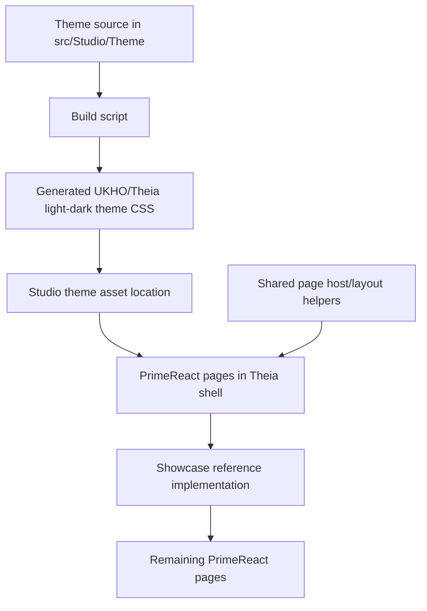

# Implementation Plan + Architecture

**Target output path:** `docs/075-primereact-system/plan-frontend-primereact-system_v0.02.md`

**Based on:** `docs/075-primereact-system/spec-frontend-primereact-system_v0.02.md`

**Version:** `v0.02` (`Draft`)

**Supersedes:** `docs/075-primereact-system/plan-frontend-primereact-system_v0.01.md`

---

# Implementation Plan

## Planning constraints and delivery posture

- This plan is based on `docs/075-primereact-system/spec-frontend-primereact-system_v0.02.md`.
- All implementation work that creates or updates source code must comply fully with `./.github/instructions/documentation-pass.instructions.md`.
- `./.github/instructions/documentation-pass.instructions.md` is a **hard gate** and mandatory Definition of Done criterion for every code-writing Work Item in this plan.
- For every code-writing Work Item, implementation must:
  - follow `./.github/instructions/documentation-pass.instructions.md` in full for all touched source files
  - add developer-level comments to every touched class, including internal and other non-public types where applicable
  - add developer-level comments to every touched method and constructor, including internal and other non-public members where applicable
  - add parameter comments for every public method and constructor parameter where those constructs exist
  - add comments to every property whose meaning is not obvious from its name
  - add sufficient inline or block comments so a developer can understand purpose, logical flow, and non-obvious decisions
- This work is frontend-only and focused on the PrimeReact theming and layout system inside the existing Studio shell.
- Theme and layout are separate concerns in this plan and must remain separate in implementation:
  - theme work covers SASS theme source, build, deploy, and visual styling
  - layout work covers full-height behavior, splitter composition, and scroll ownership
- The target outcome is no longer a downstream shared override layer alone; it is a true UKHO/Theia PrimeReact light and dark theme built from upstream-compatible source, plus a separate shared desktop layout contract.
- The first theme cycle should lift the styling decisions already proven in `Showcase` into the theme source wherever those decisions are genuinely theme-level concerns.
- The `Showcase` tab remains the first proving surface and visual reference implementation throughout the work.
- Day-to-day Visual Studio runs do not need to rebuild the theme automatically; a repository-provided script-driven build/deploy cycle is acceptable and preferred for clarity.
- After completing code changes for Theia Studio shell work, execution should run `yarn --cwd .\src\Studio\Server build:browser` so the user does not run stale frontend code.

## Baseline

- Studio currently uses `primereact` `10.9.7` in `src/Studio/Server/search-studio/package.json`.
- Local PrimeReact theme source now exists under `src/Studio/Theme` with `theme-base`, `themes`, `build.bat`, `build.sh`, and `package.json`.
- The copied `src/Studio/Theme/package.json` currently reports `primereact-sass-theme` version `10.8.5`, which does not match the Studio-installed `primereact` version `10.9.7`.
- Existing `src/Studio/Theme/build.bat` and `build.sh` scripts target a generic upstream `primereact/public/themes` output location rather than a Studio-specific deploy target.
- The current `Showcase` tab contains the strongest validated density and desktop-style behavior, but those styling decisions currently live mainly in Studio-side CSS rather than theme source.
- Existing Studio frontend asset copying only mirrors `.css` and `.png` files from `src/Studio/Server/search-studio/src` into `lib`, which can be used to host built theme outputs if the output location is chosen carefully.

## Delta

- Align `src/Studio/Theme` to the exact upstream SASS theme source release matching PrimeReact `10.9.7`.
- Introduce a repeatable repository-local workflow of theme source modification -> build -> deploy -> Studio verification.
- Add UKHO/Theia light and dark theme source variants under `src/Studio/Theme/themes/`.
- Build generated theme CSS outputs into a Studio-consumable location, or copy them there through an explicit repository script.
- Wire Studio to load the generated UKHO/Theia themes for the PrimeReact demo/research surfaces.
- Retrofit the current `Showcase` theme-appropriate styling decisions into the UKHO/Theia theme source.
- Preserve a separate shared desktop layout contract and continue to use `Showcase` as the first proving surface for that contract under the new theme.
- Document the full source-build-deploy-verify cycle, file locations, and starter workflow in the authoritative wiki guidance.

## Carry-over / Out of scope

- No backend, domain, service, persistence, or API changes.
- No attempt to automate theme rebuilds as part of every standard Visual Studio run unless later evidence shows that manual scripts are insufficient.
- No extraction into a reusable cross-project package during the first Studio-focused implementation.
- No attempt to force all future local exceptions into the theme system in one pass; genuine case-by-case exceptions remain allowed.

---

## Slice 1 — Align the local theme source and establish the repeatable source-build-deploy cycle

- [ ] Work Item 1: Align `src/Studio/Theme` to PrimeReact `10.9.7` and make the source-build-deploy workflow runnable end to end
  - **Purpose**: Deliver the first meaningful slice by making sure the repository contains the correct upstream-compatible theme source and a reliable build/deploy workflow before any deeper UKHO/Theia styling changes are attempted.
  - **Acceptance Criteria**:
    - The local `src/Studio/Theme` source is aligned to the upstream `primereact-sass-theme` release matching PrimeReact `10.9.7`.
    - Repository scripts exist to build the theme source and deploy or copy the resulting theme outputs into a Studio-consumable location.
    - The build/deploy cycle is explicit, repeatable, and does not rely on editing compiled CSS by hand.
    - The generated light and dark theme outputs can be located and inspected after build.
    - Focused verification proves the cycle succeeds before any `Showcase` styling uplift begins.
  - **Definition of Done**:
    - Theme source version aligned
    - Build script(s) working
    - Deploy/copy script(s) working
    - Logging and error handling preserved where relevant for script execution and asset resolution
    - Code comments added in full compliance with `./.github/instructions/documentation-pass.instructions.md`
    - Relevant verification steps documented and runnable
    - Can execute end to end via: build the theme source, deploy outputs to Studio assets, and verify the generated files exist in the expected location
  - [ ] Task 1.1: Align `src/Studio/Theme` to the exact matching upstream theme source release
    - [ ] Step 1: Compare the current `src/Studio/Theme` contents against the expected upstream `primereact-sass-theme` release for `10.9.7` and identify mismatches.
    - [ ] Step 2: Replace or update the local theme source so its package metadata, theme files, and build structure match the correct upstream release.
    - [ ] Step 3: Preserve the local workspace in a form that clearly distinguishes upstream source structure from future UKHO/Theia custom theme folders.
    - [ ] Step 4: Apply `./.github/instructions/documentation-pass.instructions.md` in full to all touched source files.
  - [ ] Task 1.2: Create the Studio-specific build and deploy script workflow
    - [ ] Step 1: Review the current `src/Studio/Theme/build.bat`, `build.sh`, and `package.json` scripts and decide how they should target Studio rather than a generic upstream `public/themes` path.
    - [ ] Step 2: Add or update scripts so they build the UKHO/Theia theme outputs and copy or emit them into a Studio-consumed asset location under the frontend source tree.
    - [ ] Step 3: Keep the build workflow explicit and manual-on-demand rather than wired into ordinary Visual Studio startup.
    - [ ] Step 4: Ensure the chosen output location works with the existing frontend asset-copy/build behavior, or update that behavior in a narrow, documented way.
    - [ ] Step 5: Apply `./.github/instructions/documentation-pass.instructions.md` in full to all touched source files.
  - [ ] Task 1.3: Prove the first source-build-deploy cycle works before theme customization begins
    - [ ] Step 1: Build the local theme source using the repository workflow.
    - [ ] Step 2: Deploy the generated theme CSS outputs into the Studio asset location.
    - [ ] Step 3: Add lightweight verification that the expected UKHO/Theia light and dark theme artifacts now exist where Studio can load them.
    - [ ] Step 4: Apply `./.github/instructions/documentation-pass.instructions.md` in full to all touched source files.
  - **Files**:
    - `src/Studio/Theme/package.json`: align theme source version and scripts with PrimeReact `10.9.7`
    - `src/Studio/Theme/build.bat`: build and deploy theme outputs into a Studio-specific location
    - `src/Studio/Theme/build.sh`: Unix equivalent of the Studio-specific theme build and deploy workflow
    - `src/Studio/Theme/themes/`: retain upstream themes and add UKHO/Theia custom theme source folders in a documented structure
    - `src/Studio/Server/search-studio/scripts/copy-assets.js`: extend only if necessary so the chosen output location is copied into emitted frontend assets correctly
    - `src/Studio/Server/search-studio/src/browser/primereact-demo/themes/`: preferred Studio-side generated theme output location if outputs are deployed into the frontend source tree
  - **Work Item Dependencies**: Existing local theme source under `src/Studio/Theme` and current Studio asset build pipeline.
  - **Run / Verification Instructions**:
    - `npm --prefix .\src\Studio\Theme install`
    - `npm --prefix .\src\Studio\Theme run build`
    - run the repository-specific deploy/copy script if it is separate from the build script
    - `yarn --cwd .\src\Studio\Server\search-studio test`
    - `yarn --cwd .\src\Studio\Server build:browser`
    - Confirm the built UKHO/Theia theme artifacts exist in the chosen Studio asset location
  - **User Instructions**: Review the built asset location and confirm the source-build-deploy workflow is now concrete and repeatable inside the repository.

---

## Slice 2 — Wire Studio to consume the generated UKHO/Theia themes and prove the cycle visually through `Showcase`

- [ ] Work Item 2: Load the generated UKHO/Theia light and dark themes in Studio and verify them visually through the `Showcase` reference surface
  - **Purpose**: Deliver the first visible end-to-end outcome by proving that Studio can consume the generated theme outputs and that the custom theme pipeline actually affects the running PrimeReact UI.
  - **Acceptance Criteria**:
    - Studio can load the generated UKHO/Theia PrimeReact light and dark theme outputs.
    - The active PrimeReact demo/research surface uses those generated themes instead of only the shipped built-in themes.
    - `Showcase` remains runnable and acts as the first visual proving surface for the new theme pipeline.
    - Theme switching or theme selection behavior, where applicable, remains coherent with Theia light/dark context.
    - Focused tests or verifiable checks protect the wiring between generated theme outputs and the running Studio shell.
  - **Definition of Done**:
    - Generated theme outputs wired into Studio
    - `Showcase` visually consuming generated themes
    - Logging and error handling preserved where relevant for theme resolution or runtime selection behavior
    - Code comments added in full compliance with `./.github/instructions/documentation-pass.instructions.md`
    - Relevant tests or verification checks updated or added
    - Can execute end to end via: build theme source, start Studio, open `PrimeReact Showcase Demo`, and visually confirm the generated theme is active
  - [ ] Task 2.1: Update the Studio PrimeReact frontend to load the generated UKHO/Theia themes
    - [ ] Step 1: Review the current PrimeReact theme-loading mechanism in the Studio frontend and identify where generated theme outputs should be referenced.
    - [ ] Step 2: Update the theme-loading logic or asset references so the UKHO/Theia light and dark theme outputs become the preferred custom themes for the PrimeReact research surfaces.
    - [ ] Step 3: Preserve compatibility with Theia light/dark detection and current Studio shell startup behavior.
    - [ ] Step 4: Apply `./.github/instructions/documentation-pass.instructions.md` in full to all touched source files.
  - [ ] Task 2.2: Add visual verification steps around the first live theme cycle in `Showcase`
    - [ ] Step 1: Open `Showcase` under the new generated light theme and visually verify the theme is being loaded from built outputs rather than accidental downstream CSS alone.
    - [ ] Step 2: Open `Showcase` under the generated dark theme and perform the equivalent verification.
    - [ ] Step 3: Record the visual verification expectations so the first cycle is repeatable for later theme edits.
    - [ ] Step 4: Apply `./.github/instructions/documentation-pass.instructions.md` in full to all touched source files.
  - [ ] Task 2.3: Protect the Studio-side theme wiring with focused regression coverage
    - [ ] Step 1: Add or update tests around the PrimeReact demo presentation state and widget loading so the custom UKHO/Theia themes are the expected runtime targets.
    - [ ] Step 2: Add practical verification for the generated asset paths or resolved theme identifiers where feasible.
    - [ ] Step 3: Apply `./.github/instructions/documentation-pass.instructions.md` in full to all touched source files.
  - **Files**:
    - `src/Studio/Server/search-studio/src/browser/primereact-demo/`: update theme-loading and asset reference points for UKHO/Theia light and dark themes
    - `src/Studio/Server/search-studio/src/browser/primereact-demo/search-studio-primereact-demo-widget.tsx`: wire generated themes into the running PrimeReact demo shell if this is the correct host point
    - `src/Studio/Server/search-studio/src/browser/primereact-demo/search-studio-primereact-demo-service.ts`: update theme asset or runtime selection behavior if the service owns it
    - `src/Studio/Server/search-studio/test/search-studio-primereact-demo-widget.test.js`: protect widget/theme behavior
    - `src/Studio/Server/search-studio/test/search-studio-primereact-demo-service.test.js`: protect service or runtime theme selection behavior
  - **Work Item Dependencies**: Work Item 1.
  - **Run / Verification Instructions**:
    - run the theme build/deploy workflow from Work Item 1
    - `yarn --cwd .\src\Studio\Server\search-studio test`
    - `yarn --cwd .\src\Studio\Server build:browser`
    - Start `AppHost` with Visual Studio `F5`
    - Open the Studio shell
    - Navigate to `View` and open `PrimeReact Showcase Demo`
    - Confirm the `Showcase` tab loads under the generated UKHO/Theia theme in both light and dark contexts where applicable
  - **User Instructions**: Visually confirm that Studio is now consuming the generated UKHO/Theia themes and that `Showcase` is the first proving surface for the new pipeline.

---

## Slice 3 — Retrofit the current `Showcase` styling learnings into the theme source at source level

- [ ] Work Item 3: Move the proven `Showcase` styling decisions into the UKHO/Theia theme source and reduce downstream page-local styling pressure
  - **Purpose**: Deliver the key first custom-theme value by taking what has already been learned in `Showcase` and applying those decisions at source level in the theme, rather than preserving them mainly as downstream CSS adjustments.
  - **Acceptance Criteria**:
    - The theme-appropriate `Showcase` density and styling decisions are implemented in the UKHO/Theia theme source.
    - The generated light and dark themes reflect those changes when rebuilt and deployed.
    - `Showcase` needs fewer downstream styling overrides for theme-level concerns after the uplift.
    - Visual verification confirms the generated theme now carries the expected typography, weights, spacing, and component treatment.
    - Focused regression checks protect the `Showcase` reference behavior under the new theme outputs.
  - **Definition of Done**:
    - Theme source updated with `Showcase` learnings
    - Generated themes rebuilt and deployed
    - `Showcase` visual verification completed
    - Logging and error handling preserved where relevant for theme asset consumption
    - Code comments added in full compliance with `./.github/instructions/documentation-pass.instructions.md`
    - Relevant tests updated or added
    - Can execute end to end via: rebuild UKHO/Theia theme, start Studio, open `Showcase`, and visually confirm that theme-level styling has moved upstream into the generated theme outputs
  - [ ] Task 3.1: Identify which `Showcase` styling decisions belong in the theme source
    - [ ] Step 1: Review the current `Showcase` CSS adjustments and classify them into theme concerns versus layout-contract concerns.
    - [ ] Step 2: Select the theme-appropriate rules such as typography scale, font weight, paddings, control chrome, badges, paginator styling, and component-level density treatment.
    - [ ] Step 3: Leave layout concerns such as full-height hosts, splitter sizing, and scroll ownership in the separate Studio layout contract.
    - [ ] Step 4: Apply `./.github/instructions/documentation-pass.instructions.md` in full to all touched source files.
  - [ ] Task 3.2: Implement the first UKHO/Theia theme-source uplift in light and dark variants
    - [ ] Step 1: Update the UKHO/Theia theme source folders and variables to carry the selected `Showcase` styling decisions.
    - [ ] Step 2: Rebuild and deploy the generated theme outputs.
    - [ ] Step 3: Reduce corresponding downstream `Showcase` CSS where those rules now belong in the generated theme output instead.
    - [ ] Step 4: Apply `./.github/instructions/documentation-pass.instructions.md` in full to all touched source files.
  - [ ] Task 3.3: Visually verify the first theme-source uplift through `Showcase`
    - [ ] Step 1: Verify typography size, weight, and density under the UKHO/Theia light theme.
    - [ ] Step 2: Verify the equivalent behaviors under the UKHO/Theia dark theme.
    - [ ] Step 3: Verify that the page still behaves correctly as a desktop workbench surface and that layout behavior has not regressed while theme styling moved upstream.
    - [ ] Step 4: Add or update focused regression coverage where practical for the `Showcase` reference surface.
    - [ ] Step 5: Apply `./.github/instructions/documentation-pass.instructions.md` in full to all touched source files.
  - **Files**:
    - `src/Studio/Theme/themes/mytheme/`: replace or evolve into UKHO/Theia light and dark theme source folders as the first custom theme targets
    - `src/Studio/Theme/theme-base/`: adjust only if theme-base level changes are genuinely required
    - `src/Studio/Server/search-studio/src/browser/primereact-demo/search-studio-primereact-demo-widget.css`: remove or reduce only those page-local rules that are now owned by the source-built theme
    - `src/Studio/Server/search-studio/src/browser/primereact-demo/pages/search-studio-primereact-showcase-demo-page.tsx`: keep `Showcase` aligned with the reference implementation role
    - `src/Studio/Server/search-studio/test/primereact-showcase-tabbed-shell.test.js`: protect `Showcase` reference behavior
  - **Work Item Dependencies**: Work Items 1 and 2.
  - **Run / Verification Instructions**:
    - run the theme build/deploy workflow
    - `yarn --cwd .\src\Studio\Server\search-studio test`
    - `yarn --cwd .\src\Studio\Server build:browser`
    - Start `AppHost` with Visual Studio `F5`
    - Open the Studio shell
    - Navigate to `View` and open `PrimeReact Showcase Demo`
    - Visually compare the generated theme result in light and dark modes and confirm the current `Showcase` styling decisions now come from theme output where appropriate
  - **User Instructions**: Review `Showcase` carefully in both themes and confirm the first theme-source uplift has captured the desired density and component styling without regressing desktop-style behavior.

---

## Slice 4 — Reconcile the separate desktop layout contract and migrate the remaining PrimeReact pages under the new theme strategy

- [ ] Work Item 4: Preserve the desktop layout contract separately from the theme and migrate the remaining PrimeReact pages onto the new UKHO/Theia system
  - **Purpose**: Deliver the next runnable slice by making sure the theme-source pivot does not obscure the equally important layout contract and by applying the resulting system beyond `Showcase`.
  - **Acceptance Criteria**:
    - The shared desktop layout contract remains separate from the custom theme source and is reusable by multiple PrimeReact pages.
    - Retained PrimeReact pages consume the generated UKHO/Theia themes and the shared page host/layout contract by default.
    - Data-heavy pages continue to own inner scrolling correctly and do not regress into page-like overflow behavior.
    - Existing tab/page behavior remains functional.
    - Focused regression tests protect cross-page reuse of the theme and layout system.
  - **Definition of Done**:
    - Shared layout contract preserved separately
    - Retained pages migrated onto the theme plus layout system
    - Logging and error handling preserved where relevant for rendering and theme/layout initialization
    - Code comments added in full compliance with `./.github/instructions/documentation-pass.instructions.md`
    - Relevant tests updated or added
    - Can execute end to end via: open `PrimeReact Showcase Demo`, switch across retained pages, and confirm the generated theme and shared desktop layout contract both apply consistently
  - [ ] Task 4.1: Keep the shared desktop layout contract explicit and separate from theme source
    - [ ] Step 1: Review the current page host and layout helper model and retain the rules that govern full-height workbench behavior, splitter composition, and scroll ownership.
    - [ ] Step 2: Ensure those rules stay in Studio-side layout helpers/CSS rather than being incorrectly pushed into the theme source.
    - [ ] Step 3: Apply `./.github/instructions/documentation-pass.instructions.md` in full to all touched source files.
  - [ ] Task 4.2: Migrate the retained PrimeReact pages onto the generated UKHO/Theia themes and shared layout host
    - [ ] Step 1: Identify the retained PrimeReact pages and tab-content surfaces that should consume the generated theme outputs and shared page host/setup contract.
    - [ ] Step 2: Update those pages so they use the new theme system and layout helpers by default.
    - [ ] Step 3: Preserve page-specific functionality while reducing duplication and ad hoc page-local styling.
    - [ ] Step 4: Apply `./.github/instructions/documentation-pass.instructions.md` in full to all touched source files.
  - [ ] Task 4.3: Extend regression and visual verification across the migrated pages
    - [ ] Step 1: Update or add tests that verify multiple PrimeReact pages render under the generated UKHO/Theia themes and shared host/layout contract.
    - [ ] Step 2: Add practical visual verification guidance for the migrated page set under both light and dark themes.
    - [ ] Step 3: Apply `./.github/instructions/documentation-pass.instructions.md` in full to all touched source files.
  - **Files**:
    - `src/Studio/Server/search-studio/src/browser/primereact-demo/search-studio-primereact-demo-page.tsx`: preserve or refine the shared page host/setup model
    - `src/Studio/Server/search-studio/src/browser/primereact-demo/pages/*.tsx`: migrate retained PrimeReact pages under the theme plus layout system
    - `src/Studio/Server/search-studio/src/browser/primereact-demo/pages/tab-content/`: align retained tab-content surfaces with the separate layout contract and generated themes
    - `src/Studio/Server/search-studio/test/`: extend regression coverage for theme and layout reuse
  - **Work Item Dependencies**: Work Items 1, 2, and 3.
  - **Run / Verification Instructions**:
    - run the theme build/deploy workflow
    - `yarn --cwd .\src\Studio\Server\search-studio test`
    - `yarn --cwd .\src\Studio\Server build:browser`
    - Start `AppHost` with Visual Studio `F5`
    - Open the Studio shell
    - Navigate to `View` and open `PrimeReact Showcase Demo`
    - Switch through retained PrimeReact tabs/pages and confirm consistent UKHO/Theia theme usage and desktop-style layout behavior
  - **User Instructions**: Review the retained PrimeReact pages and confirm the result now feels like one coherent UKHO/Theia-themed workbench system rather than a collection of demo surfaces.

---

## Slice 5 — Finalize the authoritative guidance, checklist, and repeatable theme-development workflow documentation

- [ ] Work Item 5: Document the full source-build-deploy-verify workflow and the ongoing page-authoring model
  - **Purpose**: Finish the work package by making the theme pipeline, layout contract, starter-page path, and verification model operational for future contributors and Copilot.
  - **Acceptance Criteria**:
    - A dedicated authoritative wiki page exists for the PrimeReact/Theia UI system and now documents the source theme workflow explicitly.
    - `wiki/Tools-UKHO-Search-Studio.md` contains a concise summary and points to the authoritative guide.
    - The authoritative guidance covers source location, version alignment, build scripts, deploy location, visual verification steps, shared layout contract, and the `Showcase` reference implementation.
    - The guidance includes a short practical checklist for new PrimeReact pages and for re-running the theme-development cycle.
    - A developer can follow the documentation to rebuild and deploy the theme and then create or update a compliant PrimeReact page with minimal guesswork.
  - **Definition of Done**:
    - Authoritative wiki page created or updated
    - Summary wiki page updated
    - Theme source-build-deploy-verify workflow documented
    - Shared file/folder locations documented
    - Starter-page and checklist guidance documented
    - Reference implementation documented
    - Can execute end to end via: open the documentation, locate the theme source workflow, locate the shared layout guidance, and trace `Showcase` as the reference implementation
  - [ ] Task 5.1: Document the authoritative PrimeReact/Theia theme and layout workflow
    - [ ] Step 1: Create or update the dedicated authoritative wiki page for the PrimeReact/Theia system.
    - [ ] Step 2: Document the version alignment rule, source location under `src/Studio/Theme`, build script usage, deploy target, and visual verification flow.
    - [ ] Step 3: Document the separation of theme work and layout-contract work clearly so future contributors do not conflate them.
  - [ ] Task 5.2: Update the Studio summary wiki page and point to the authoritative guide
    - [ ] Step 1: Add a concise summary section to `wiki/Tools-UKHO-Search-Studio.md` for the PrimeReact/Theia system.
    - [ ] Step 2: Link clearly to the authoritative dedicated wiki page as the source of truth.
    - [ ] Step 3: Reference `Showcase` as the working reference implementation and first visual proving surface.
  - [ ] Task 5.3: Document the practical checklists for both theme work and new-page work
    - [ ] Step 1: Add a short checklist for rerunning the theme source-build-deploy-verify cycle.
    - [ ] Step 2: Add a short checklist for creating a new PrimeReact page or window using the generated themes and shared layout contract.
    - [ ] Step 3: Explain how contributors should decide whether a styling concern belongs in theme source, shared layout helpers, or a narrow page-local exception.
  - **Files**:
    - `wiki/PrimeReact-Theia-UI-System.md`: authoritative implementation guide for the custom theme plus layout system
    - `wiki/Tools-UKHO-Search-Studio.md`: summary and entry point linking to the authoritative guide
    - `docs/075-primereact-system/spec-frontend-primereact-system_v0.02.md`: update only if implementation reveals a necessary clarification to the requirements
  - **Work Item Dependencies**: Work Items 1 through 4.
  - **Run / Verification Instructions**:
    - Open `wiki/PrimeReact-Theia-UI-System.md`
    - Open `wiki/Tools-UKHO-Search-Studio.md`
    - Confirm the authoritative wiki page documents source version alignment, build/deploy steps, visual verification, shared layout rules, and the required checklists
    - Confirm the summary wiki page links to the authoritative guide and references `Showcase` as the reference implementation
  - **User Instructions**: Review the documentation and confirm it would be sufficient for a developer or Copilot to rebuild the theme, verify it visually, and start a new PrimeReact page correctly.

---

## Overall approach summary

This `v0.02` plan delivers the UKHO/Theia PrimeReact system in five practical slices:

1. align the local SASS theme source to the exact PrimeReact version and establish the repeatable build/deploy workflow
2. wire Studio to consume the generated UKHO/Theia light and dark themes and prove the cycle visually through `Showcase`
3. retrofit the current `Showcase` styling learnings into the theme source itself
4. preserve the shared desktop layout contract separately and migrate the remaining PrimeReact pages under the new theme strategy
5. document the full source-build-deploy-verify and page-authoring workflow so it is repeatable later

Key implementation considerations are:

- treat source-authored theming and page layout as separate but coordinated workstreams
- align the local `src/Studio/Theme` source to PrimeReact `10.9.7` before relying on it deeply
- use repository-local scripts for theme build and deploy rather than hand-editing compiled CSS
- keep ordinary Visual Studio runs free from mandatory theme rebuilds unless the team later decides automation is worth the trade-off
- use `Showcase` as the first proving surface and reference implementation
- lift theme concerns from `Showcase` into theme source, but keep layout concerns in shared Studio layout helpers
- keep the dedicated PrimeReact/Theia UI system wiki page authoritative and practical
- treat `./.github/instructions/documentation-pass.instructions.md` as mandatory for every code-writing step

---

# Architecture

## Overall Technical Approach

The implementation remains fully inside the existing Theia Studio shell PrimeReact frontend. No backend, domain, or service-layer changes are required.

The architecture now has two explicit layers:

1. **UKHO/Theia PrimeReact theme pipeline**
   - upstream-compatible SASS theme source under `src/Studio/Theme`
   - repository-local build and deploy scripts
   - generated light and dark theme outputs consumed by Studio

2. **Studio desktop layout contract**
   - shared page host and layout helpers inside the Studio frontend
   - full-height behavior, splitter composition, and inner scroll ownership
   - used by `Showcase` first and then by later PrimeReact pages

## Frontend

The frontend work is split across two main areas.

### Theme source workspace

Located under `src/Studio/Theme`:

- upstream-compatible `theme-base`
- `themes` folder containing built-in and custom source themes
- build scripts and package metadata
- UKHO/Theia light and dark theme source folders

Responsibilities:

- own the source-authored visual system
- build generated theme CSS
- support a repeatable source-build-deploy cycle

### Studio frontend integration

Located under `src/Studio/Server/search-studio/src/browser/primereact-demo/` and related test/wiki files.

Responsibilities:

- load generated UKHO/Theia theme outputs
- preserve the separate desktop layout contract
- keep `Showcase` as the first visual proving surface
- migrate later pages onto the theme plus layout system
- document the workflow for future contributors

Frontend user/developer flow after implementation:

1. a contributor updates the UKHO/Theia theme source under `src/Studio/Theme`
2. the contributor runs the repository theme build/deploy workflow
3. Studio consumes the newly generated theme assets
4. the contributor opens `PrimeReact Showcase Demo` and visually verifies the result in `Showcase`
5. the contributor continues to other PrimeReact pages once the first cycle is validated
6. new pages use the generated themes plus the shared desktop layout contract by default

## Backend

No backend changes are required.

The work does not alter APIs, services, persistence, or application state management outside the existing frontend component tree. The implementation is limited to theme source assets, build/deploy scripts, frontend layout contracts, theme wiring, test coverage, and documentation.