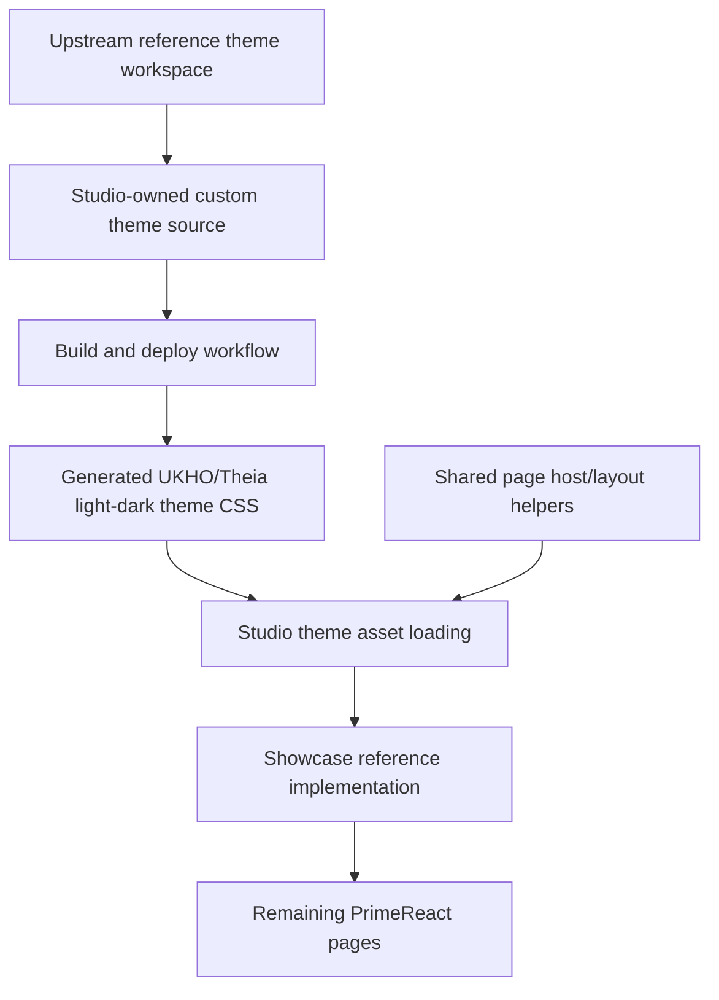

# Implementation Plan + Architecture

**Target output path:** `docs/075-primereact-system/plan-frontend-primereact-system_v0.03.md`

**Based on:** `docs/075-primereact-system/spec-frontend-primereact-system_v0.02.md`

**Version:** `v0.03` (`Draft`)

**Supersedes:** `docs/075-primereact-system/plan-frontend-primereact-system_v0.02.md`

---

# Implementation Plan

## Planning constraints and delivery posture

- This plan is based on `docs/075-primereact-system/spec-frontend-primereact-system_v0.02.md`.
- All implementation work that creates or updates source code must comply fully with `./.github/instructions/documentation-pass.instructions.md`.
- `./.github/instructions/documentation-pass.instructions.md` is a **hard gate** and mandatory Definition of Done criterion for every code-writing Work Item in this plan.
- For every code-writing Work Item, implementation must:
  - follow `./.github/instructions/documentation-pass.instructions.md` in full for all touched source files
  - add developer-level comments to every touched class, including internal and other non-public types where applicable
  - add developer-level comments to every touched method and constructor, including internal and other non-public members where applicable
  - add parameter comments for every public method and constructor parameter where those constructs exist
  - add comments to every property whose meaning is not obvious from its name
  - add sufficient inline or block comments so a developer can understand purpose, logical flow, and non-obvious decisions
- Theme and layout are separate workstreams in this plan and must remain separate in implementation:
  - **theme** = upstream/reference SASS source, Studio-owned custom source, build, deploy, and visual styling
  - **layout** = full-height host behavior, splitter composition, `min-width: 0`, `min-height: 0`, and inner scroll ownership
- `src/Studio/Theme` is treated as the upstream/reference workspace and toolchain baseline.
- Studio-owned editable custom themes live under `src/Studio/Server/search-studio/src/browser/primereact-theme/source`.
- Generated Studio-consumed theme outputs live under `src/Studio/Server/search-studio/src/browser/primereact-theme/generated`.
- The first UKHO/Theia theme iteration should use Theia’s UI font family for typography cohesion and should not introduce a separate hosted font unless later evidence requires it.
- The `Showcase` tab remains the first proving surface and reference implementation throughout the work.
- Day-to-day Visual Studio runs do not need to rebuild the theme automatically; explicit repository scripts are acceptable and preferred.
- After completing code changes for Theia Studio shell work, execution should run `yarn --cwd .\src\Studio\Server build:browser` so the user does not run stale frontend code.

## Baseline

- Studio currently uses `primereact` `10.9.7`.
- The local upstream/reference SASS theme workspace under `src/Studio/Theme` currently reports `primereact-sass-theme` `10.8.5`, which is treated as the latest practical upstream/reference source baseline available for this effort.
- Existing build scripts in `src/Studio/Theme` currently target generic upstream theme outputs and need Studio-specific build/deploy behavior.
- `Showcase` already proves much of the desired density and desktop-style layout behavior, but many theme concerns still live in downstream Studio CSS rather than the theme source.
- Existing Theia CSS exposes `--theia-ui-font-family`, so host-shell typography alignment is available without shipping a separate custom font in the first iteration.
- Existing frontend asset copying from `src/Studio/Server/search-studio/src` to `lib` can be reused or extended to move generated theme outputs into the emitted bundle.

## Delta

- Validate and normalize `src/Studio/Theme` as the accepted upstream/reference baseline.
- Establish a concrete source -> build -> deploy -> verify workflow inside the repository.
- Introduce Studio-owned UKHO/Theia light and dark theme source folders.
- Generate theme CSS into a Studio-consumable asset location.
- Wire the Studio shell to load those generated themes.
- Retrofit the current `Showcase` styling learnings into the theme source where those decisions belong in theme rather than layout.
- Preserve the separate shared desktop layout contract and apply it consistently across the retained PrimeReact pages.
- Document bootstrap, build, deploy, and visual verification steps in the authoritative wiki.

## Carry-over / Out of scope

- No backend, domain, service, persistence, or API changes.
- No extraction into a shared cross-project package in this first Studio-focused implementation.
- No automatic theme rebuild on every ordinary Visual Studio run unless later justified.
- No attempt to force every future page-specific exception into the shared theme or layout system immediately.

---

## Slice 1 — Establish the upstream/reference theme workspace and a runnable Studio build/deploy cycle

- [ ] Work Item 1: Validate the upstream/reference SASS workspace and make the Studio theme build/deploy cycle runnable end to end
  - **Purpose**: Deliver the first runnable slice by proving that the repository can build and deploy UKHO/Theia theme assets from source before any deep styling uplift begins.
  - **Acceptance Criteria**:
    - `src/Studio/Theme` is validated and documented as the accepted upstream/reference baseline.
    - First-time bootstrap instructions are explicit and runnable.
    - Repository scripts can build theme assets and deploy them into a Studio-consumed output location.
    - Generated light and dark theme artifacts exist in the expected output location after the workflow runs.
    - Verification instructions prove the cycle works before deeper styling changes begin.
  - **Definition of Done**:
    - Upstream/reference baseline validated
    - Bootstrap, build, and deploy scripts implemented or updated
    - Logging and error handling preserved for script and asset operations
    - Code comments added in full compliance with `./.github/instructions/documentation-pass.instructions.md`
    - Documentation updated
    - Can execute end-to-end via: `npm --prefix .\src\Studio\Theme install`, `npm --prefix .\src\Studio\Theme run build`, deploy to Studio asset location, and confirm generated theme files exist
  - [ ] Task 1.1: Validate `src/Studio/Theme` as the upstream/reference baseline
    - [ ] Step 1: Inspect the local `src/Studio/Theme` structure and confirm the workspace is sufficient as the accepted upstream/reference baseline for Studio’s first custom theme iteration.
    - [ ] Step 2: Record the practical version relationship between `primereact` `10.9.7` and `primereact-sass-theme` `10.8.5` in repository documentation or script comments where relevant.
    - [ ] Step 3: Keep `src/Studio/Theme` read-only in intent and avoid placing Studio-owned UKHO/Theia customizations directly into that upstream/reference workspace.
    - [ ] Step 4: Apply `./.github/instructions/documentation-pass.instructions.md` in full to all touched source files.
  - [ ] Task 1.2: Implement the bootstrap/build/deploy workflow for Studio theme assets
    - [ ] Step 1: Update `src/Studio/Theme` scripts or add Studio-owned wrapper scripts so first-time bootstrap, build, and deploy steps are explicit.
    - [ ] Step 2: Ensure generated theme outputs are emitted or copied into `src/Studio/Server/search-studio/src/browser/primereact-theme/generated`.
    - [ ] Step 3: Keep the workflow manual-on-demand rather than tied to every normal Visual Studio run.
    - [ ] Step 4: Extend frontend asset copying only if needed so the generated theme assets flow into emitted `lib` output cleanly.
    - [ ] Step 5: Apply `./.github/instructions/documentation-pass.instructions.md` in full to all touched source files.
  - [ ] Task 1.3: Verify the first source-build-deploy cycle without custom styling changes
    - [ ] Step 1: Run the documented bootstrap command if local tooling is missing.
    - [ ] Step 2: Run the documented build and deploy workflow.
    - [ ] Step 3: Verify the generated UKHO/Theia light and dark theme artifacts exist where Studio will consume them.
    - [ ] Step 4: Apply `./.github/instructions/documentation-pass.instructions.md` in full to all touched source files.
  - **Files**:
    - `src/Studio/Theme/package.json`: validate scripts and bootstrap expectations for the upstream/reference theme workspace
    - `src/Studio/Theme/build.bat`: support Studio-specific theme build/deploy flow on Windows
    - `src/Studio/Theme/build.sh`: support Studio-specific theme build/deploy flow on Unix-like shells
    - `src/Studio/Server/search-studio/src/browser/primereact-theme/generated/`: Studio-consumed generated theme output location
    - `src/Studio/Server/search-studio/scripts/copy-assets.js`: extend only if required to copy generated theme CSS into emitted frontend assets
  - **Work Item Dependencies**: Existing `src/Studio/Theme` workspace and current search-studio asset copy/build pipeline.
  - **Run / Verification Instructions**:
    - `npm --prefix .\src\Studio\Theme install`
    - `npm --prefix .\src\Studio\Theme run build`
    - run the repository-specific deploy/copy command if separate from build
    - `yarn --cwd .\src\Studio\Server\search-studio test`
    - `yarn --cwd .\src\Studio\Server build:browser`
    - confirm generated light/dark theme CSS files exist under `src/Studio/Server/search-studio/src/browser/primereact-theme/generated`
  - **User Instructions**: Confirm that the repository now has a repeatable bootstrap/build/deploy cycle for Studio theme assets.

---

## Slice 2 — Introduce Studio-owned UKHO/Theia light/dark theme source and wire Studio to consume the generated themes

- [ ] Work Item 2: Create the Studio-owned UKHO/Theia theme source structure and load the generated themes in Studio
  - **Purpose**: Deliver the first visible end-to-end capability by making Studio consume generated UKHO/Theia theme assets built from the new source structure.
  - **Acceptance Criteria**:
    - Studio-owned custom theme source exists under the canonical `source/shared`, `source/ukho-theia-light`, and `source/ukho-theia-dark` structure.
    - Generated theme outputs are loaded by Studio instead of relying only on a shipped built-in PrimeReact theme.
    - The first iteration uses Theia’s UI font family for typography cohesion.
    - `Showcase` remains runnable and can visually demonstrate that Studio is consuming the generated theme assets.
    - Focused checks or tests protect the theme loading and asset path wiring.
  - **Definition of Done**:
    - Custom light/dark theme source structure implemented
    - Generated theme outputs wired into Studio
    - Theia font integration applied in the first iteration
    - Logging and error handling preserved where relevant for theme resolution/runtime selection behavior
    - Code comments added in full compliance with `./.github/instructions/documentation-pass.instructions.md`
    - Tests or verification checks updated or added
    - Can execute end-to-end via: build theme assets, start Studio, open `PrimeReact Showcase Demo`, and confirm generated UKHO/Theia themes are active
  - [ ] Task 2.1: Create the Studio-owned UKHO/Theia light/dark source structure
    - [ ] Step 1: Create `source/shared`, `source/ukho-theia-light`, and `source/ukho-theia-dark` under `src/Studio/Server/search-studio/src/browser/primereact-theme/source`.
    - [ ] Step 2: Add shared SASS fragments for UKHO/Theia tokens, extensions, and theme composition.
    - [ ] Step 3: Keep the first iteration intentionally simple and avoid introducing a separate hosted font asset unless later justified.
    - [ ] Step 4: Apply `./.github/instructions/documentation-pass.instructions.md` in full to all touched source files.
  - [ ] Task 2.2: Apply Theia typography cohesion in the first custom theme iteration
    - [ ] Step 1: Configure the UKHO/Theia light and dark themes to use Theia’s UI font family contract, including `--theia-ui-font-family`, where practical.
    - [ ] Step 2: Avoid populating `_fonts.scss` with hosted font assets in the first iteration unless a clear requirement emerges.
    - [ ] Step 3: Verify that generated typography no longer feels typographically detached from the Theia shell.
    - [ ] Step 4: Apply `./.github/instructions/documentation-pass.instructions.md` in full to all touched source files.
  - [ ] Task 2.3: Wire Studio to consume generated UKHO/Theia themes
    - [ ] Step 1: Update theme-loading or theme-selection logic in the Studio PrimeReact frontend to point at generated UKHO/Theia theme outputs.
    - [ ] Step 2: Preserve compatibility with Theia light/dark context where applicable.
    - [ ] Step 3: Add focused verification or tests around asset path resolution and active theme selection.
    - [ ] Step 4: Apply `./.github/instructions/documentation-pass.instructions.md` in full to all touched source files.
  - **Files**:
    - `src/Studio/Server/search-studio/src/browser/primereact-theme/source/shared/`: shared UKHO/Theia SASS fragments
    - `src/Studio/Server/search-studio/src/browser/primereact-theme/source/ukho-theia-light/`: Studio-owned editable light theme source
    - `src/Studio/Server/search-studio/src/browser/primereact-theme/source/ukho-theia-dark/`: Studio-owned editable dark theme source
    - `src/Studio/Server/search-studio/src/browser/primereact-demo/`: theme loading/runtime selection points for generated theme assets
    - `src/Studio/Server/search-studio/test/`: theme loading and presentation-state verification coverage
  - **Work Item Dependencies**: Work Item 1.
  - **Run / Verification Instructions**:
    - run the bootstrap/build/deploy workflow from Work Item 1
    - `yarn --cwd .\src\Studio\Server\search-studio test`
    - `yarn --cwd .\src\Studio\Server build:browser`
    - Start `AppHost` with Visual Studio `F5`
    - Open the Studio shell
    - Navigate to `View` and open `PrimeReact Showcase Demo`
    - verify the generated UKHO/Theia themes are active and typography aligns with Theia
  - **User Instructions**: Visually confirm that the running PrimeReact surface now uses the generated UKHO/Theia theme and feels typographically cohesive with Theia.

---

## Slice 3 — Retrofit the proven `Showcase` styling decisions into the theme source at source level

- [ ] Work Item 3: Move the proven `Showcase` styling decisions into the UKHO/Theia theme source and reduce downstream theme overrides
  - **Purpose**: Deliver the key first theming value by moving already-proven `Showcase` styling decisions into source-authored theme assets instead of maintaining them primarily as page-local CSS.
  - **Acceptance Criteria**:
    - Theme-appropriate `Showcase` decisions are implemented in the UKHO/Theia light/dark theme source.
    - Generated theme outputs reflect those changes after rebuild/deploy.
    - `Showcase` needs fewer downstream theme-level overrides after the uplift.
    - Visual verification confirms the generated theme now carries the desired density, typography, and component treatment.
    - Focused regression tests protect the reference `Showcase` behavior.
  - **Definition of Done**:
    - Theme source updated with `Showcase` learnings
    - Generated themes rebuilt and deployed
    - Downstream theme-level overrides reduced where appropriate
    - Logging and error handling preserved where relevant for theme asset consumption
    - Code comments added in full compliance with `./.github/instructions/documentation-pass.instructions.md`
    - Tests or verification checks updated or added
    - Can execute end-to-end via: rebuild generated themes, start Studio, open `Showcase`, and visually confirm theme-owned styling now comes from source-built assets
  - [ ] Task 3.1: Classify current `Showcase` rules into theme concerns versus layout concerns
    - [ ] Step 1: Review current `Showcase` CSS and identify which rules belong in theme source: typography, weights, spacing, control chrome, badges, paginator treatment, and component density.
    - [ ] Step 2: Keep full-height host behavior, splitter sizing, and scroll ownership in the separate Studio layout contract.
    - [ ] Step 3: Apply `./.github/instructions/documentation-pass.instructions.md` in full to all touched source files.
  - [ ] Task 3.2: Implement the first theme-source uplift in the UKHO/Theia light and dark themes
    - [ ] Step 1: Update the custom theme source to carry the selected `Showcase` styling decisions.
    - [ ] Step 2: Rebuild and deploy the generated theme outputs.
    - [ ] Step 3: Reduce corresponding downstream `Showcase` CSS where those rules now belong in the generated theme.
    - [ ] Step 4: Apply `./.github/instructions/documentation-pass.instructions.md` in full to all touched source files.
  - [ ] Task 3.3: Visually verify the first theme-source uplift through `Showcase`
    - [ ] Step 1: Verify typography size, weight, and density under the UKHO/Theia light theme.
    - [ ] Step 2: Verify equivalent behavior under the UKHO/Theia dark theme.
    - [ ] Step 3: Verify controls such as buttons, inputs, tags, paginator, and tables feel cohesive with the Theia shell.
    - [ ] Step 4: Add or update focused regression coverage where practical.
    - [ ] Step 5: Apply `./.github/instructions/documentation-pass.instructions.md` in full to all touched source files.
  - **Files**:
    - `src/Studio/Server/search-studio/src/browser/primereact-theme/source/ukho-theia-light/`: implement light-theme source uplift
    - `src/Studio/Server/search-studio/src/browser/primereact-theme/source/ukho-theia-dark/`: implement dark-theme source uplift
    - `src/Studio/Server/search-studio/src/browser/primereact-theme/generated/`: generated outputs after rebuild
    - `src/Studio/Server/search-studio/src/browser/primereact-demo/search-studio-primereact-demo-widget.css`: reduce only those theme-level rules now owned by the generated theme
    - `src/Studio/Server/search-studio/src/browser/primereact-demo/pages/search-studio-primereact-showcase-demo-page.tsx`: keep `Showcase` aligned with the reference role
    - `src/Studio/Server/search-studio/test/primereact-showcase-tabbed-shell.test.js`: protect reference behavior
  - **Work Item Dependencies**: Work Items 1 and 2.
  - **Run / Verification Instructions**:
    - run the theme build/deploy workflow
    - `yarn --cwd .\src\Studio\Server\search-studio test`
    - `yarn --cwd .\src\Studio\Server build:browser`
    - Start `AppHost` with Visual Studio `F5`
    - Open the Studio shell
    - Navigate to `View` and open `PrimeReact Showcase Demo`
    - visually verify the generated light/dark themes now carry the first `Showcase` uplift
  - **User Instructions**: Review `Showcase` in both themes and confirm the first source-level uplift now owns the expected density and typography.

---

## Slice 4 — Preserve the desktop layout contract separately and migrate the remaining PrimeReact pages onto the new theme + layout system

- [ ] Work Item 4: Keep layout separate from theme and migrate the retained PrimeReact pages onto the coherent UKHO/Theia system
  - **Purpose**: Deliver the next runnable slice by proving the new system works beyond `Showcase` and that the layout contract remains a separate reusable layer.
  - **Acceptance Criteria**:
    - Shared desktop layout rules remain separate from the theme source.
    - Retained PrimeReact pages consume the generated UKHO/Theia themes and the shared layout contract by default.
    - Data-heavy pages keep correct inner scroll ownership and do not regress into web-page-style overflow.
    - Existing tab/page behavior remains functional.
    - Focused tests protect cross-page reuse of the theme and layout system.
  - **Definition of Done**:
    - Shared layout contract preserved separately
    - Retained pages migrated onto the theme + layout system
    - Logging and error handling preserved where relevant for rendering and layout/theme initialization
    - Code comments added in full compliance with `./.github/instructions/documentation-pass.instructions.md`
    - Tests updated or added
    - Can execute end-to-end via: open the retained PrimeReact tabs/pages and confirm consistent theme + desktop layout behavior
  - [ ] Task 4.1: Preserve the shared desktop layout contract as a separate Studio-owned layer
    - [ ] Step 1: Review current shared page host and layout helper behavior.
    - [ ] Step 2: Keep full-height, splitter, and scroll ownership rules in Studio-side layout helpers/CSS rather than pushing them into theme source.
    - [ ] Step 3: Apply `./.github/instructions/documentation-pass.instructions.md` in full to all touched source files.
  - [ ] Task 4.2: Migrate retained PrimeReact pages to the generated theme + shared layout host
    - [ ] Step 1: Identify retained PrimeReact pages and tab-content surfaces that should consume the generated UKHO/Theia themes and shared layout contract.
    - [ ] Step 2: Update those pages so they use the new system by default.
    - [ ] Step 3: Reduce ad hoc page-local styling where practical.
    - [ ] Step 4: Apply `./.github/instructions/documentation-pass.instructions.md` in full to all touched source files.
  - [ ] Task 4.3: Extend cross-page verification and regression coverage
    - [ ] Step 1: Add or update tests for cross-page reuse of the theme and layout system.
    - [ ] Step 2: Add practical visual verification guidance across the migrated page set.
    - [ ] Step 3: Apply `./.github/instructions/documentation-pass.instructions.md` in full to all touched source files.
  - **Files**:
    - `src/Studio/Server/search-studio/src/browser/primereact-demo/search-studio-primereact-demo-page.tsx`: preserve/refine the shared page host
    - `src/Studio/Server/search-studio/src/browser/primereact-demo/pages/*.tsx`: migrate retained PrimeReact pages under the theme + layout system
    - `src/Studio/Server/search-studio/src/browser/primereact-demo/pages/tab-content/`: align retained tab content with the shared system
    - `src/Studio/Server/search-studio/test/`: extend regression coverage for theme/layout reuse
  - **Work Item Dependencies**: Work Items 1, 2, and 3.
  - **Run / Verification Instructions**:
    - run the theme build/deploy workflow
    - `yarn --cwd .\src\Studio\Server\search-studio test`
    - `yarn --cwd .\src\Studio\Server build:browser`
    - Start `AppHost` with Visual Studio `F5`
    - Open `PrimeReact Showcase Demo`
    - switch through retained pages and confirm coherent theme + layout behavior
  - **User Instructions**: Confirm the retained PrimeReact pages now feel like one coherent UKHO/Theia-themed desktop workbench system.

---

## Slice 5 — Finalize the authoritative workflow, visual verification guidance, and contributor checklists

- [ ] Work Item 5: Document the complete source-build-deploy-verify workflow and the ongoing page-authoring model
  - **Purpose**: Finish the work package by making the system repeatable for future contributors and Copilot without rediscovery.
  - **Acceptance Criteria**:
    - A dedicated authoritative wiki page exists and documents source location, build bootstrap, build/deploy flow, verification, and layout separation.
    - `wiki/Tools-UKHO-Search-Studio.md` contains a concise summary and points to the authoritative guide.
    - The documentation includes practical checklists for rerunning the theme cycle and for creating new PrimeReact pages.
    - `Showcase` is documented as the reference implementation and first proving surface.
    - A developer can follow the documentation to rebuild the theme, verify it visually, and start a new PrimeReact page correctly.
  - **Definition of Done**:
    - Authoritative wiki updated
    - Summary wiki updated
    - Bootstrap/build/deploy/verify workflow documented
    - Starter-page and checklist guidance documented
    - Reference implementation documented
    - Can execute end-to-end via: open the docs, follow the commands, and trace `Showcase` as the first proving surface
  - [ ] Task 5.1: Document the authoritative PrimeReact/Theia theme + layout workflow
    - [ ] Step 1: Update or create the dedicated authoritative wiki page.
    - [ ] Step 2: Document the source/reference/custom/generated folder structure and the build/bootstrap commands.
    - [ ] Step 3: Document the separation of theme concerns and layout concerns.
  - [ ] Task 5.2: Update the Studio summary wiki page
    - [ ] Step 1: Add a concise summary section to `wiki/Tools-UKHO-Search-Studio.md`.
    - [ ] Step 2: Link clearly to the authoritative guide.
    - [ ] Step 3: Reference `Showcase` as the reference implementation.
  - [ ] Task 5.3: Document practical checklists
    - [ ] Step 1: Add a checklist for first-time bootstrap and theme rebuild/deploy.
    - [ ] Step 2: Add a checklist for creating a new PrimeReact page or window using the shared theme + layout system.
    - [ ] Step 3: Explain how to decide whether a rule belongs in theme source, layout helpers, or a narrow page-local exception.
  - **Files**:
    - `wiki/PrimeReact-Theia-UI-System.md`: authoritative implementation guide
    - `wiki/Tools-UKHO-Search-Studio.md`: summary and entry point
    - `docs/075-primereact-system/spec-frontend-primereact-system_v0.02.md`: update only if implementation reveals a necessary clarification
  - **Work Item Dependencies**: Work Items 1 through 4.
  - **Run / Verification Instructions**:
    - open `wiki/PrimeReact-Theia-UI-System.md`
    - open `wiki/Tools-UKHO-Search-Studio.md`
    - confirm bootstrap/build/deploy/verify steps, folder structure, layout separation, and `Showcase` reference guidance are present
  - **User Instructions**: Confirm the documentation would let a developer or Copilot rebuild the theme and start a new compliant PrimeReact page without rediscovery.

---

## Overall approach summary

This plan delivers the `v0.02` UKHO/Theia PrimeReact system in five practical vertical slices:

1. validate the upstream/reference workspace and establish the runnable bootstrap/build/deploy cycle
2. create the Studio-owned light/dark theme source and wire Studio to consume generated themes with Theia typography cohesion
3. retrofit the proven `Showcase` styling decisions into the theme source
4. preserve the separate desktop layout contract and migrate the retained PrimeReact pages onto the full system
5. document the full workflow, verification model, and contributor checklists

Key implementation considerations are:

- keep `src/Studio/Theme` as upstream/reference and keep Studio-owned custom themes under the frontend tree
- use explicit bootstrap/build/deploy commands rather than hand-editing compiled CSS
- reuse Theia’s UI font family for immediate typography cohesion in the first theme iteration
- keep theme styling and desktop layout mechanics separate throughout implementation and documentation
- use `Showcase` as the first proving surface and reference implementation
- treat `./.github/instructions/documentation-pass.instructions.md` as mandatory for every code-writing step

---

# Architecture

## Overall Technical Approach

The implementation remains fully inside the existing Theia Studio shell PrimeReact frontend. No backend, domain, or service-layer changes are required.

The architecture has two explicit layers:

1. **UKHO/Theia PrimeReact theme pipeline**
   - upstream/reference SASS workspace under `src/Studio/Theme`
   - Studio-owned custom source under `src/Studio/Server/search-studio/src/browser/primereact-theme/source`
   - generated outputs under `src/Studio/Server/search-studio/src/browser/primereact-theme/generated`
   - explicit bootstrap/build/deploy workflow

2. **Studio desktop layout contract**
   - shared host/layout helpers in the Studio frontend
   - full-height behavior, splitter composition, and inner scroll ownership
   - reused first by `Showcase` and then by later PrimeReact pages

## Frontend

The frontend work is centered in two areas.

### Theme work

- `src/Studio/Theme`
  - reference SASS workspace and toolchain
- `src/Studio/Server/search-studio/src/browser/primereact-theme/source`
  - Studio-owned UKHO/Theia light/dark source
- `src/Studio/Server/search-studio/src/browser/primereact-theme/generated`
  - generated theme outputs used by Studio

Responsibilities:
- maintain the source-authored UKHO/Theia theme
- build and deploy generated CSS
- align typography with Theia using `--theia-ui-font-family`
- uplift proven `Showcase` styling decisions into source-owned theme assets

### Layout work

- `src/Studio/Server/search-studio/src/browser/primereact-demo/`
  - shared host/layout behavior
  - retained PrimeReact pages and tab-content surfaces
  - `Showcase` as the reference implementation

Responsibilities:
- preserve desktop-style resize and inner scroll ownership
- keep layout separate from theme source
- migrate retained pages onto the theme + layout system
- protect behavior with tests and visual verification guidance

Frontend user/developer flow after implementation:

1. a contributor bootstraps the theme toolchain if necessary
2. the contributor updates Studio-owned UKHO/Theia theme source
3. the contributor runs the build/deploy workflow
4. Studio loads the generated theme assets
5. the contributor verifies the result visually in `Showcase`
6. the contributor applies the same theme + layout system to later PrimeReact pages

## Backend

No backend changes are required.

The work does not alter APIs, services, persistence, or application state management outside the existing frontend component tree. The implementation is limited to theme source assets, build/deploy scripts, frontend theme wiring, desktop layout contracts, test coverage, and documentation.