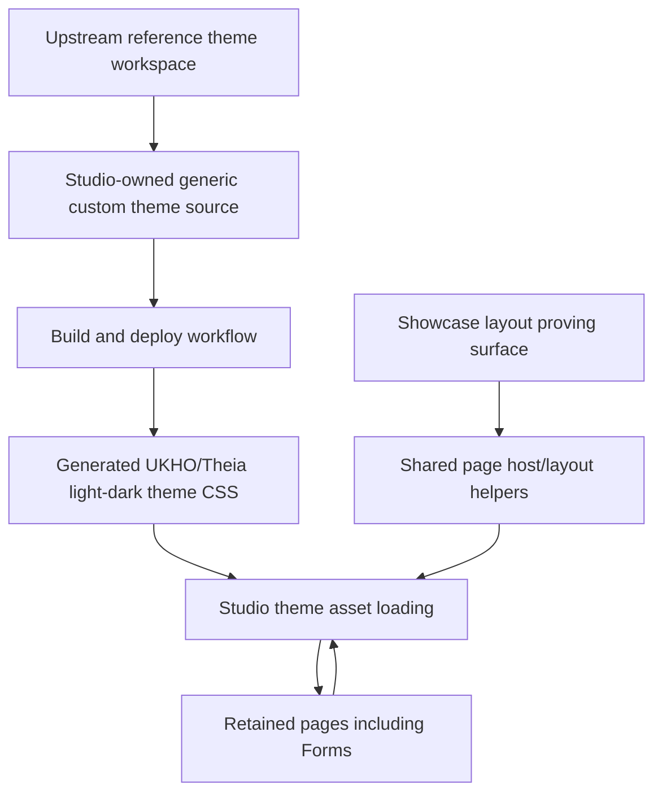

# Implementation Plan + Architecture

**Target output path:** `docs/075-primereact-system/plan-frontend-primereact-system_v0.04.md`

**Based on:** `docs/075-primereact-system/spec-frontend-primereact-system_v0.02.md`

**Version:** `v0.04` (`Draft`)

**Supersedes:** `docs/075-primereact-system/plan-frontend-primereact-system_v0.03.md`

---

# Change Summary for `v0.04`

This revision keeps the completed theme-pipeline and runtime-loading work from `v0.03`, but changes the styling authority model:

- `Showcase` remains authoritative for **layout** only.
- `Showcase` is **not** authoritative for final theme styling or typography.
- Shared theme source must stay generic and must not accumulate page-named selectors such as `Showcase`-specific theme rules.
- The current typography baseline should be preserved where it already reads correctly, and future iterations should focus on generic PrimeReact component styling, colors, spacing, and sizing rather than on reworking font family or size without evidence.

---

# Implementation Plan

## Planning constraints and delivery posture

- This plan is based on `docs/075-primereact-system/spec-frontend-primereact-system_v0.02.md`.
- All implementation work that creates or updates source code must comply fully with `./.github/instructions/documentation-pass.instructions.md`.
- `./.github/instructions/documentation-pass.instructions.md` is a **hard gate** and mandatory Definition of Done criterion for every code-writing Work Item in this plan.
- For every code-writing Work Item, implementation must:
  - follow `./.github/instructions/documentation-pass.instructions.md` in full for all touched source files
  - add developer-level comments to every touched class, including internal and other non-public types where applicable
  - add developer-level comments to every touched method and constructor, including internal and other non-public members where applicable
  - add parameter comments for every public method and constructor parameter where those constructs exist
  - add comments to every property whose meaning is not obvious from its name
  - add sufficient inline or block comments so a developer can understand purpose, logical flow, and non-obvious decisions
- Theme and layout remain separate workstreams and must remain separate in implementation:
  - **theme** = upstream/reference SASS source, Studio-owned custom source, build, deploy, generated assets, component styling, typography, color, spacing, and chrome
  - **layout** = full-height host behavior, splitter composition, `min-width: 0`, `min-height: 0`, inner scroll ownership, and page host structure
- `src/Studio/Theme` remains the upstream/reference workspace and toolchain baseline.
- Studio-owned editable custom themes remain under `src/Studio/Server/search-studio/src/browser/primereact-theme/source`.
- Generated Studio-consumed theme outputs remain under `src/Studio/Server/search-studio/src/browser/primereact-theme/generated`.
- The first UKHO/Theia theme iteration should continue to use Theia’s UI font family for typography cohesion and should not introduce a separate hosted font unless later evidence requires it.
- `Showcase` remains the first proving surface for desktop layout behavior, but it is **not** the styling authority for the real UKHO/Theia theme.
- Styling authority should come from generic component behavior seen across retained pages, especially `Forms`, and then be validated across the remaining retained surfaces.
- Shared theme source should stay generic and should not contain page-named selectors or page-specific styling rules unless a later explicit architecture decision permits a reusable neutral hook.
- Day-to-day Visual Studio runs do not need to rebuild the theme automatically; explicit repository scripts remain acceptable and preferred.
- After completing code changes for Theia Studio shell work, execution should run `yarn --cwd .\src\Studio\Server build:browser` so the user does not run stale frontend code.

## Baseline

- Studio currently uses `primereact` `10.9.7`.
- The local upstream/reference SASS theme workspace under `src/Studio/Theme` currently reports `primereact-sass-theme` `10.8.5`, which remains the practical upstream/reference source baseline for this effort.
- The repository now has a runnable bootstrap/build/deploy/verify cycle that emits generated UKHO/Theia light/dark theme outputs into the Studio frontend tree.
- Studio now has a canonical custom theme source structure under:
  - `src/Studio/Server/search-studio/src/browser/primereact-theme/source/shared`
  - `src/Studio/Server/search-studio/src/browser/primereact-theme/source/ukho-theia-light`
  - `src/Studio/Server/search-studio/src/browser/primereact-theme/source/ukho-theia-dark`
- Studio now loads generated local theme content at runtime rather than relying only on the stock PrimeReact CDN theme stylesheet for the active theme layer.
- Existing Theia CSS exposes `--theia-ui-font-family`, so host-shell typography alignment remains available without shipping a separate custom font in the first iteration.
- `Showcase` still proves much of the desired desktop-style layout behavior, but recent review indicates its page-specific compact styling should not be treated as the styling authority for the real theme.
- `Forms` currently reads correctly against the surrounding Theia shell for typography, and current review indicates the same generic font family and size baseline already appears acceptable on non-`Showcase` tabs.

## Delta

- Keep the completed `v0.03` theme pipeline and generated-theme runtime wiring.
- Reframe the styling strategy so the real theme is derived from generic PrimeReact component rules rather than `Showcase`-specific styling uplift.
- Remove or avoid page-specific selectors from shared theme source.
- Preserve the current generic UKHO/Theia typography baseline where it already reads correctly across retained pages.
- Iterate next on component styling, colors, spacing, and sizing where evidence shows a real mismatch.
- Preserve `Showcase` as the authoritative desktop layout proving surface while keeping its styling non-authoritative.
- Validate the theme primarily through cross-page comparison rather than by copying `Showcase`-specific compact styling into theme source.
- Update documentation so future contributors understand the authority split: generic theme styling versus shared layout contract.

## Carry-over / Out of scope

- No backend, domain, service, persistence, or API changes.
- No extraction into a shared cross-project package in this Studio-focused implementation.
- No automatic theme rebuild on every ordinary Visual Studio run unless later justified.
- No requirement to immediately eliminate every page-local exception; only obvious misplacements between theme and layout should be corrected in this pass.
- No attempt to make `Showcase` the canonical styling reference again.

---

## Slice 1 — Preserve the upstream/reference workspace and the runnable Studio build/deploy cycle

- [x] Work Item 1: Validate the upstream/reference SASS workspace and make the Studio theme build/deploy cycle runnable end to end - Completed
  - Summary: Completed in `v0.03` and carried forward unchanged. The repository can bootstrap, build, deploy, verify, and consume generated light/dark Studio theme assets.

---

## Slice 2 — Preserve the Studio-owned source structure and generated theme loading in Studio

- [x] Work Item 2: Create the Studio-owned UKHO/Theia theme source structure and load the generated themes in Studio - Completed
  - Summary: Completed in `v0.03` and carried forward unchanged. Studio-owned theme source exists, generated theme outputs are consumed at runtime, and the first iteration uses Theia’s UI font family contract.

---

## Slice 3 — Establish the real generic UKHO/Theia theme direction and stop treating `Showcase` styling as authoritative

- [x] Work Item 3: Preserve the current typography baseline and iteratively refine generic component styling without treating `Showcase` styling as authoritative - Completed
  - Summary: Reset the styling authority guidance in `src/Studio/Theme/README.md`, removed upstream hosted font ownership from generated Studio theme assets, added compact generic component refinements in shared theme source, updated retained demo theme labels to the UKHO/Theia naming, rebuilt generated light/dark assets, and extended regression coverage for generated output and runtime theme selection.
  - **Purpose**: Deliver the first credible styling pass by preserving the generic UKHO/Theia typography that already reads correctly on non-`Showcase` tabs and then iteratively refining generic component styling, colors, spacing, and sizing instead of deriving the theme from `Showcase`-specific compact styling.
  - **Acceptance Criteria**:
    - Shared theme source does not rely on `Showcase`-named selectors for the generic theme pass.
    - The current generic typography baseline is preserved where it already reads correctly on non-`Showcase` tabs.
    - `Forms` and at least one additional retained page continue to validate that the theme reads coherently with Theia.
    - `Showcase` continues to prove layout behavior without being treated as the styling authority.
    - Additional shared-theme styling changes focus on component styling, colors, spacing, and sizing, and are minimal and evidence-led rather than broad exploratory retuning.
    - Focused tests protect the generated theme output and runtime theme-selection behavior.
  - **Definition of Done**:
    - Shared theme source kept generic
    - Current generic typography baseline preserved unless evidence requires targeted changes
    - Targeted component styling, color, spacing, and sizing refinements implemented where evidence supports them
    - Generated themes rebuilt and deployed
    - `Showcase` layout contract preserved
    - No page-specific theme selectors added to shared theme source for this pass
    - Logging and error handling preserved where relevant for theme asset generation and runtime consumption
    - Code comments added in full compliance with `./.github/instructions/documentation-pass.instructions.md`
    - Tests or verification checks updated or added
    - Can execute end-to-end via: rebuild generated themes, start Studio, open retained pages, and confirm the generic theme still reads coherently with Theia while `Showcase` is aligned to that baseline without depending on `Showcase`-specific styling
  - [x] Task 3.1: Reset the styling authority model in repository documentation and implementation intent - Completed
    - [x] Step 1: Record that `Showcase` is authoritative for layout but not for final styling/typography.
    - [x] Step 2: Record that shared theme source must remain generic and should not contain page-named selectors for this workstream.
    - [x] Step 3: Apply `./.github/instructions/documentation-pass.instructions.md` in full to all touched source files.
  - [x] Task 3.2: Confirm and protect the current typography baseline - Completed
    - [x] Step 1: Review retained PrimeReact pages and confirm which shared typography patterns already read correctly and should therefore remain the baseline: headings, body copy, labels, inputs, tabs, table text, and paginator text.
    - [x] Step 2: Use `Forms` as a primary validation surface for typography alignment with Theia, and use at least one additional retained page to avoid overfitting to a single page.
    - [x] Step 3: Keep the current font family and font-size baseline in place unless new evidence shows a genuine mismatch.
    - [x] Step 4: Apply `./.github/instructions/documentation-pass.instructions.md` in full to all touched source files.
  - [x] Task 3.3: Make only the targeted generic styling changes needed beyond typography - Completed
    - [x] Step 1: Update shared/light/dark theme source only where evidence shows a real generic mismatch in component styling, colors, spacing, or sizing, and otherwise leave the current typography rules in place.
    - [x] Step 2: Rebuild and deploy the generated theme outputs.
    - [x] Step 3: Keep page-local CSS only for layout mechanics or narrow exceptions that clearly do not belong in the shared theme, including any remaining `Showcase`-specific layout behavior.
    - [x] Step 4: Apply `./.github/instructions/documentation-pass.instructions.md` in full to all touched source files.
  - [x] Task 3.4: Verify the first generic theme pass across retained pages - Completed
    - [x] Step 1: Verify the preserved typography size, weight, and readability under the UKHO/Theia light theme.
    - [x] Step 2: Verify equivalent typography behavior under the UKHO/Theia dark theme.
    - [x] Step 3: Verify controls such as buttons, inputs, tags, paginator, tables, spacing, and component chrome feel cohesive with the Theia shell on retained pages, not only in `Showcase`, and confirm non-`Showcase` tabs were not made worse by the refinement work.
    - [x] Step 4: Add or update focused regression coverage where practical.
    - [x] Step 5: Apply `./.github/instructions/documentation-pass.instructions.md` in full to all touched source files.
  - **Files**:
    - `src/Studio/Server/search-studio/src/browser/primereact-theme/source/shared/`: generic UKHO/Theia SASS fragments only
    - `src/Studio/Server/search-studio/src/browser/primereact-theme/source/ukho-theia-light/`: light-theme generic source uplift
    - `src/Studio/Server/search-studio/src/browser/primereact-theme/source/ukho-theia-dark/`: dark-theme generic source uplift
    - `src/Studio/Server/search-studio/src/browser/primereact-theme/generated/`: generated outputs after rebuild
    - `src/Studio/Server/search-studio/src/browser/primereact-demo/search-studio-primereact-demo-widget.css`: retain only layout or narrow page-local styling where appropriate
    - `src/Studio/Server/search-studio/test/`: generated theme output and runtime theme-loading verification coverage
  - **Work Item Dependencies**: Work Items 1 and 2.
  - **Run / Verification Instructions**:
    - run the theme build/deploy workflow
    - `yarn --cwd .\src\Studio\Server\search-studio test`
    - `yarn --cwd .\src\Studio\Server build:browser`
    - Start `AppHost` with Visual Studio `F5`
    - Open the Studio shell
    - Navigate to `View` and open `PrimeReact Showcase Demo`
    - compare `Forms`, `Data View`, and `Showcase`
    - verify the generic light/dark theme reads coherently with Theia without depending on `Showcase`-specific styling rules
  - **User Instructions**: Confirm that `Forms` and the other retained pages remain typographically coherent with Theia, and use the next review passes to iterate component styling, colors, spacing, and sizing while `Showcase` remains valuable primarily for layout validation.

---

## Slice 4 — Preserve the desktop layout contract separately and migrate the remaining PrimeReact pages onto the new theme + layout system

- [x] Work Item 4: Keep layout separate from theme and migrate the retained PrimeReact pages onto the coherent UKHO/Theia system - Completed
  - Summary: Added a shared retained-page layout helper at `src/Studio/Server/search-studio/src/browser/primereact-demo/search-studio-primereact-demo-page-layout.tsx`, migrated the consolidated showcase tab wrappers plus the retained `Forms`, `Data View`, `Data Table`, `Tree`, and `Tree Table` pages onto that shared contract, added focused layout-host regression coverage in `src/Studio/Server/search-studio/test/search-studio-primereact-demo-page.test.js`, and validated with `yarn --cwd .\src\Studio\Server\search-studio test`, `yarn --cwd .\src\Studio\Server build:browser`, and a solution build.
  - **Purpose**: Deliver the next runnable slice by proving the new system works beyond `Showcase` and that the layout contract remains a separate reusable layer.
  - **Acceptance Criteria**:
    - Shared desktop layout rules remain separate from the theme source.
    - Retained PrimeReact pages consume the generated UKHO/Theia themes and the shared layout contract by default.
    - Data-heavy pages keep correct inner scroll ownership and do not regress into web-page-style overflow.
    - Existing tab/page behavior remains functional.
    - Focused tests protect cross-page reuse of the theme and layout system.
  - **Definition of Done**:
    - Shared layout contract preserved separately
    - Retained pages migrated onto the theme + layout system
    - Logging and error handling preserved where relevant for rendering and layout/theme initialization
    - Code comments added in full compliance with `./.github/instructions/documentation-pass.instructions.md`
    - Tests updated or added
    - Can execute end-to-end via: open the retained PrimeReact tabs/pages and confirm consistent theme + desktop layout behavior
  - [x] Task 4.1: Preserve the shared desktop layout contract as a separate Studio-owned layer - Completed (added a shared PrimeReact demo page host helper in `search-studio-primereact-demo-page-layout.tsx`, centralized page-hosted layout class selection, and kept data-heavy scroll ownership in the Studio-side page host layer rather than the theme source.)
    - [x] Step 1: Review current shared page host and layout helper behavior. - Completed (reviewed the consolidated showcase tab shell, page-hosted layout classes, and current data-heavy overflow ownership in the PrimeReact demo pages and shared widget CSS.)
    - [x] Step 2: Keep full-height, splitter, and scroll ownership rules in Studio-side layout helpers/CSS rather than pushing them into theme source. - Completed (centralized retained page host class selection and data-heavy scroll-height rules in `search-studio-primereact-demo-page-layout.tsx` while leaving the shared layout CSS as the owner of full-height and overflow behavior.)
    - [x] Step 3: Apply `./.github/instructions/documentation-pass.instructions.md` in full to all touched source files. - Completed (documented the new shared layout helper and kept the touched retained page files aligned with the repository documentation-pass standard.)
  - [x] Task 4.2: Migrate retained PrimeReact pages to the generated theme + shared layout host - Completed (migrated the retained `Forms`, `Data View`, `Data Table`, `Tree`, and `Tree Table` pages plus the consolidated showcase tab wrappers onto the shared page-host helper so tab-hosted pages now opt into the shared layout contract by default.)
    - [x] Step 1: Identify retained PrimeReact pages and tab-content surfaces that should consume the generated UKHO/Theia themes and shared layout contract. - Completed (confirmed the retained showcase tab set is `Showcase`, `Forms`, `Data View`, `Data Table`, `Tree`, and `Tree Table`, with shared focusable tab wrappers inside the consolidated showcase page.)
    - [x] Step 2: Update those pages so they use the new system by default. - Completed (updated the retained tab wrappers and retained page components to resolve page-host class names and data-heavy scroll-height rules from the shared layout helper.)
    - [x] Step 3: Reduce ad hoc page-local styling where practical. - Completed (removed repeated retained-tab wrapper markup and repeated page-host class selection logic in favor of the shared PrimeReact demo page helper.)
    - [x] Step 4: Apply `./.github/instructions/documentation-pass.instructions.md` in full to all touched source files. - Completed (documented the shared retained-page helper and kept the touched retained page sources aligned with the documentation-pass requirement.)
  - [x] Task 4.3: Extend cross-page verification and regression coverage - Completed (added focused retained-page layout-host tests and expanded the practical retained-page verification checklist so reviewers can validate both general page hosting and data-heavy inner scroll ownership.)
    - [x] Step 1: Add or update tests for cross-page reuse of the theme and layout system. - Completed (added `search-studio-primereact-demo-page.test.js` to verify shared page-host class selection, shared tab-panel overflow handling, data-heavy scroll-height resolution, and the shared retained-tab wrapper contract.)
    - [x] Step 2: Add practical visual verification guidance across the migrated page set. - Completed (expanded the Work Item 4 verification guidance so reviewers explicitly check `Forms`, `Data View`, `Data Table`, `Tree`, `Tree Table`, and `Showcase`, including inner scroll ownership on the data-heavy tabs.)
    - [x] Step 3: Apply `./.github/instructions/documentation-pass.instructions.md` in full to all touched source files. - Completed (documented the new retained-page layout helper and kept the new regression test source aligned with the documentation-pass standard.)
  - **Files**:
    - `src/Studio/Server/search-studio/src/browser/primereact-demo/search-studio-primereact-demo-page.tsx`: preserve/refine the shared page host
    - `src/Studio/Server/search-studio/src/browser/primereact-demo/pages/*.tsx`: migrate retained PrimeReact pages under the theme + layout system
    - `src/Studio/Server/search-studio/src/browser/primereact-demo/pages/tab-content/`: align retained tab content with the shared system
    - `src/Studio/Server/search-studio/test/`: extend regression coverage for theme/layout reuse
  - **Work Item Dependencies**: Work Items 1, 2, and 3.
  - **Run / Verification Instructions**:
    - run the theme build/deploy workflow
    - `yarn --cwd .\src\Studio\Server\search-studio test`
    - `yarn --cwd .\src\Studio\Server build:browser`
    - Start `AppHost` with Visual Studio `F5`
    - Open `PrimeReact Showcase Demo`
    - open `Showcase` and confirm the compact workspace still owns splitter sizing, inner grid scrolling, and detail-pane scrolling without the outer page taking overflow
    - open `Forms` and `Data View` and confirm the shared tab host provides consistent padding, focus transfer, and page-level scrolling without page-specific host setup
    - open `Data Table`, `Tree`, and `Tree Table` and confirm the shared retained-page contract keeps scrolling inside the grid/tree surfaces instead of pushing overflow to the outer tab page
    - switch across the full retained page set and confirm coherent theme + layout behavior
  - **User Instructions**: Confirm the retained PrimeReact pages now feel like one coherent UKHO/Theia-themed desktop workbench system.

---

## Slice 5 — Finalize the authoritative workflow, visual verification guidance, and contributor checklists

- [ ] Work Item 5: Document the complete source-build-deploy-verify workflow and the ongoing page-authoring model
  - **Purpose**: Finish the work package by making the system repeatable for future contributors and Copilot without rediscovery.
  - **Acceptance Criteria**:
    - A dedicated authoritative wiki page exists and documents source location, build bootstrap, build/deploy flow, verification, and layout separation.
    - `wiki/Tools-UKHO-Search-Studio.md` contains a concise summary and points to the authoritative guide.
    - The documentation includes practical checklists for rerunning the theme cycle and for creating new PrimeReact pages.
    - `Showcase` is documented as the reference implementation for layout and first proving surface, but not as the styling authority for the real theme.
    - A developer can follow the documentation to rebuild the theme, verify it visually, and start a new PrimeReact page correctly.
  - **Definition of Done**:
    - Authoritative wiki updated
    - Summary wiki updated
    - Bootstrap/build/deploy/verify workflow documented
    - Starter-page and checklist guidance documented
    - Reference implementation guidance corrected
    - Can execute end-to-end via: open the docs, follow the commands, and trace the correct split between generic theme authority and shared layout authority
  - [ ] Task 5.1: Document the authoritative PrimeReact/Theia theme + layout workflow
    - [ ] Step 1: Update or create the dedicated authoritative wiki page.
    - [ ] Step 2: Document the source/reference/custom/generated folder structure and the build/bootstrap commands.
    - [ ] Step 3: Document the separation of theme concerns and layout concerns.
  - [ ] Task 5.2: Update the Studio summary wiki page
    - [ ] Step 1: Add a concise summary section to `wiki/Tools-UKHO-Search-Studio.md`.
    - [ ] Step 2: Link clearly to the authoritative guide.
    - [ ] Step 3: Reference `Showcase` as the layout proving surface rather than the styling authority.
  - [ ] Task 5.3: Document practical checklists
    - [ ] Step 1: Add a checklist for first-time bootstrap and theme rebuild/deploy.
    - [ ] Step 2: Add a checklist for creating a new PrimeReact page or window using the shared theme + layout system.
    - [ ] Step 3: Explain how to decide whether a rule belongs in theme source, layout helpers, or a narrow page-local exception.
  - **Files**:
    - `wiki/PrimeReact-Theia-UI-System.md`: authoritative implementation guide
    - `wiki/Tools-UKHO-Search-Studio.md`: summary and entry point
    - `docs/075-primereact-system/spec-frontend-primereact-system_v0.02.md`: update only if implementation reveals a necessary clarification
  - **Work Item Dependencies**: Work Items 1 through 4.
  - **Run / Verification Instructions**:
    - open `wiki/PrimeReact-Theia-UI-System.md`
    - open `wiki/Tools-UKHO-Search-Studio.md`
    - confirm bootstrap/build/deploy/verify steps, folder structure, layout separation, styling-authority guidance, and `Showcase` layout-reference guidance are present
  - **User Instructions**: Confirm the documentation would let a developer or Copilot rebuild the theme and start a new compliant PrimeReact page without rediscovery.

---

## Overall approach summary

This `v0.04` plan delivers the UKHO/Theia PrimeReact system in five practical vertical slices:

1. preserve the validated upstream/reference workspace and runnable bootstrap/build/deploy cycle
2. preserve the Studio-owned light/dark theme source and generated theme loading in Studio
3. preserve the current typography baseline and iteratively refine generic component styling rather than deriving the theme from `Showcase`-specific styling
4. preserve the separate desktop layout contract and migrate the retained PrimeReact pages onto the full system
5. document the full workflow, authority split, verification model, and contributor checklists

Key implementation considerations are:

- keep `src/Studio/Theme` as upstream/reference and keep Studio-owned custom themes under the frontend tree
- use explicit bootstrap/build/deploy commands rather than hand-editing compiled CSS
- reuse Theia’s UI font family for immediate typography cohesion in the first theme iteration
- keep theme styling and desktop layout mechanics separate throughout implementation and documentation
- treat `Showcase` as the first proving surface for layout, not as the final styling authority
- preserve the current typography baseline where it already reads correctly across retained pages and change component styling, colors, spacing, and sizing only where evidence shows a mismatch
- treat `./.github/instructions/documentation-pass.instructions.md` as mandatory for every code-writing step

---

# Architecture

## Overall Technical Approach

The implementation remains fully inside the existing Theia Studio shell PrimeReact frontend. No backend, domain, or service-layer changes are required.

The architecture continues to have two explicit layers:

1. **UKHO/Theia PrimeReact theme pipeline**
   - upstream/reference SASS workspace under `src/Studio/Theme`
   - Studio-owned custom source under `src/Studio/Server/search-studio/src/browser/primereact-theme/source`
   - generated outputs under `src/Studio/Server/search-studio/src/browser/primereact-theme/generated`
   - explicit bootstrap/build/deploy workflow
   - generic component-level styling authority

2. **Studio desktop layout contract**
   - shared host/layout helpers in the Studio frontend
   - full-height behavior, splitter composition, and inner scroll ownership
   - reused first by `Showcase` and then by later PrimeReact pages
   - `Showcase` as the layout proving surface

## Frontend

The frontend work remains centered in two areas.

### Theme work

- `src/Studio/Theme`
  - reference SASS workspace and toolchain
- `src/Studio/Server/search-studio/src/browser/primereact-theme/source`
  - Studio-owned UKHO/Theia light/dark source
- `src/Studio/Server/search-studio/src/browser/primereact-theme/generated`
  - generated theme outputs used by Studio

Responsibilities:
- maintain the source-authored UKHO/Theia theme
- build and deploy generated CSS
- align typography with Theia using `--theia-ui-font-family`
- implement generic PrimeReact component styling that works across retained pages without unnecessarily reworking the accepted typography baseline
- avoid page-named selectors in shared theme source for the real theme pass

### Layout work

- `src/Studio/Server/search-studio/src/browser/primereact-demo/`
  - shared host/layout behavior
  - retained PrimeReact pages and tab-content surfaces
  - `Showcase` as the layout proving surface

Responsibilities:
- preserve desktop-style resize and inner scroll ownership
- keep layout separate from theme source
- let `Showcase` validate layout behavior without becoming the styling authority
- migrate retained pages onto the theme + layout system
- protect behavior with tests and visual verification guidance

Frontend user/developer flow after implementation:

1. a contributor bootstraps the theme toolchain if necessary
2. the contributor updates Studio-owned UKHO/Theia theme source
3. the contributor runs the build/deploy workflow
4. Studio loads the generated theme assets
5. the contributor verifies generic styling across retained pages and layout behavior through `Showcase`
6. the contributor applies the same theme + layout system to later PrimeReact pages

## Backend

No backend changes are required.

The work does not alter APIs, services, persistence, or application state management outside the existing frontend component tree. The implementation is limited to theme source assets, build/deploy scripts, frontend theme wiring, desktop layout contracts, test coverage, and documentation.
