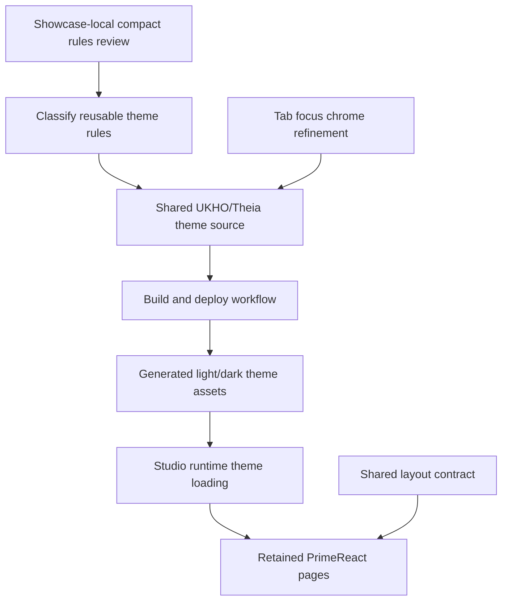

# Implementation Plan + Architecture

**Target output path:** `docs/076-primereact-theme-uplift/plan-frontend-primereact-theme-uplift_v0.01.md`

**Based on:** `docs/076-primereact-theme-uplift/spec-frontend-primereact-theme-uplift_v0.01.md`

**Version:** `v0.01` (`Draft`)

---

# Implementation Plan

## Planning constraints and delivery posture

- This plan is based on `docs/076-primereact-theme-uplift/spec-frontend-primereact-theme-uplift_v0.01.md`.
- All implementation work that creates or updates source code must comply fully with `./.github/instructions/documentation-pass.instructions.md`.
- `./.github/instructions/documentation-pass.instructions.md` is a **hard gate** and mandatory Definition of Done criterion for every code-writing Work Item in this plan.
- For every code-writing Work Item, implementation must:
  - follow `./.github/instructions/documentation-pass.instructions.md` in full for all touched source files
  - add developer-level comments to every touched class, including internal and other non-public types where applicable
  - add developer-level comments to every touched method and constructor, including internal and other non-public members where applicable
  - add parameter comments for every public method and constructor parameter where those constructs exist
  - add comments to every property whose meaning is not obvious from its name
  - add sufficient inline or block comments so a developer can understand purpose, logical flow, and non-obvious decisions
- Theme concerns and layout concerns must remain separate in implementation:
  - **theme** = upstream/reference SASS source, Studio-owned custom source, build, deploy, generated assets, component styling, focus chrome, typography-preserving density refinements, colors, spacing, and sizing
  - **layout** = full-height host behavior, splitter composition, `min-width: 0`, `min-height: 0`, inner scroll ownership, and page host structure
- Shared theme source must remain generic and must not accumulate page-named selectors such as `Showcase`-specific theme rules.
- `Showcase` remains a proving surface for retained PrimeReact behavior, but it is not the styling authority once generic component rules have been promoted into the shared theme.
- The current accepted typography baseline should be preserved unless evidence gathered during implementation shows a specific generic mismatch that must be corrected as part of the same slice.
- Day-to-day Visual Studio runs do not need to rebuild the theme automatically; explicit repository scripts remain acceptable and preferred.
- After completing code changes for Theia Studio shell work, execution should run `yarn --cwd .\src\Studio\Server build:browser` so the user does not run stale frontend code.

## Baseline

- The repository already contains a runnable PrimeReact UKHO/Theia theme pipeline with Studio-owned source and generated theme outputs.
- Studio already loads generated local theme content at runtime rather than relying only on the stock PrimeReact CDN theme stylesheet.
- The retained PrimeReact pages already share a desktop-style layout contract that is separate from the theme.
- `Showcase` still contains some page-local compact styling that makes data-dense controls such as grid and tree surfaces feel more condensed than equivalent controls on other retained pages.
- PrimeReact tab surfaces currently show an unwanted blue focus border around the tab content area while still providing a selected-tab underline that is desirable and should remain.

## Delta

- Promote remaining generic compact density rules from `Showcase` into the shared UKHO/Theia PrimeReact theme.
- Remove or reduce duplicated `Showcase`-local styling once the theme owns those reusable rules.
- Refine PrimeReact tab focus styling so the content-panel blue border is removed while the active-tab underline remains.
- Preserve a visible keyboard focus indication on the tab header itself, or another theme-appropriate header-level focus treatment, rather than relying on a content-panel border.
- Rebuild generated light and dark theme outputs and validate the changes across retained PrimeReact pages.

## Carry-over / Out of scope

- No backend, domain, service, persistence, or API changes.
- No broad redesign of typography beyond preserving the current accepted baseline and making only narrow evidence-led adjustments if required.
- No changes to the shared layout contract except where needed to keep layout concerns separate from theme concerns.
- No reintroduction of page-specific selectors into shared theme source.
- No automatic theme rebuild on every ordinary Visual Studio run unless later justified.

---

## Slice 1 — Promote generic `Showcase` density rules into the shared UKHO/Theia theme

- [x] Work Item 1: Move reusable condensed component styling from `Showcase` into the shared theme so retained pages receive the same compact behavior by default - Completed
  - **Summary**: Promoted reusable compact `DataTable`, `Tree`, `TreeTable`, and paginator density rules into `src/browser/primereact-theme/source/shared`, removed duplicated `Showcase`-local styling, rebuilt generated light and dark theme outputs, extended focused theme regression checks, updated the PrimeReact wiki guidance, and completed `yarn --cwd .\src\Studio\Server\search-studio test` plus `yarn --cwd .\src\Studio\Server build:browser`.
  - **Purpose**: Deliver the smallest useful end-to-end refinement by making generic component density a theme-owned concern rather than a `Showcase`-local override.
  - **Acceptance Criteria**:
    - Generic condensed styling currently expressed in `Showcase` is identified and classified into shared-theme rules versus true page-local exceptions.
    - Shared UKHO/Theia theme source gains the reusable density rules for data-dense PrimeReact controls without adding page-named selectors.
    - `Showcase` local styling is reduced so it retains only layout mechanics or genuinely local exceptions.
    - At least `Data Table`, `Tree`, and `Tree Table` can consume the uplifted condensed styling through the theme without page-specific opt-ins.
  - **Definition of Done**:
    - Code implemented in theme source and any necessary `Showcase` cleanup locations
    - Generated light and dark theme assets rebuilt and deployed
    - Tests updated or added where practical
    - Logging and error handling preserved where relevant for theme generation or runtime loading
    - Documentation updated if implementation reveals necessary clarification
    - Code comments added in full compliance with `./.github/instructions/documentation-pass.instructions.md`
    - Can execute end-to-end via: rebuild generated themes, start Studio, open retained pages, and confirm condensed shared component styling is present beyond `Showcase`
  - [x] Task 1.1: Identify the remaining `Showcase` compact rules that are genuinely reusable theme concerns - Completed
    - [x] Step 1: Review `Showcase` page-local styling and list the rules that affect generic component density rather than page structure.
    - [x] Step 2: Classify each candidate rule as either shared theme concern or narrow `Showcase`-local exception.
    - [x] Step 3: Keep layout mechanics, splitter rules, and scroll-ownership rules out of the shared theme.
    - [x] Step 4: Apply `./.github/instructions/documentation-pass.instructions.md` in full to all touched source files.
    - **Summary**: Classified `Showcase` compact tree-node spacing, compact table and tree-table cell padding, and paginator density as shared theme concerns, while retaining full-height hosting, overflow ownership, splitter sizing, and grid-specific selection-column sizing as `Showcase`-local layout responsibilities.
  - [x] Task 1.2: Promote reusable compact rules into shared UKHO/Theia theme source - Completed
    - [x] Step 1: Add reusable density rules for primary affected component families, including data-table and tree-related surfaces, into shared or variant theme source as appropriate.
    - [x] Step 2: Preserve the current accepted typography baseline while applying only the compact spacing, padding, row-height, node-spacing, and related generic component refinements supported by the evidence.
    - [x] Step 3: Ensure the rules remain generic and avoid `Showcase`-named selectors in the shared theme source.
    - [x] Step 4: Apply `./.github/instructions/documentation-pass.instructions.md` in full to all touched source files.
    - **Summary**: Added shared compact density tokens and generic shared-theme rules in `_tokens.scss` and `_extensions.scss` for `Tree`, `DataTable`, `TreeTable`, and paginator chrome, preserved the existing typography baseline, and rebuilt the generated light and dark theme assets through the existing theme deploy workflow.
  - [x] Task 1.3: Remove duplicated `Showcase` local styling and keep only real local exceptions - Completed
    - [x] Step 1: Remove or reduce page-local styling in `Showcase` where the theme now owns the reusable rule.
    - [x] Step 2: Retain only page-specific layout, structure, or narrow visual exceptions that clearly do not belong in the shared theme.
    - [x] Step 3: Confirm `Showcase` still renders correctly because the generated theme now supplies the shared density rules.
    - [x] Step 4: Apply `./.github/instructions/documentation-pass.instructions.md` in full to all touched source files.
    - **Summary**: Removed duplicated `Showcase` tree and data-surface density selectors from `search-studio-primereact-demo-widget.css`, kept layout-only overflow and scroll-ownership rules local, extended the generated-asset and runtime theme tests, updated `wiki/PrimeReact-Theia-UI-System.md`, and validated with the browser-side test suite plus the required browser bundle rebuild.
  - **Files**:
    - `src/Studio/Server/search-studio/src/browser/primereact-theme/source/shared/`: shared generic component density rules
    - `src/Studio/Server/search-studio/src/browser/primereact-theme/source/ukho-theia-light/`: light-theme refinements if variant-specific treatment is required
    - `src/Studio/Server/search-studio/src/browser/primereact-theme/source/ukho-theia-dark/`: dark-theme refinements if variant-specific treatment is required
    - `src/Studio/Server/search-studio/src/browser/primereact-demo/search-studio-primereact-demo-widget.css`: remove or reduce duplicated `Showcase`-local styling after uplift
    - `src/Studio/Server/search-studio/src/browser/primereact-demo/pages/`: only if narrow page-local cleanup is required
  - **Work Item Dependencies**: Existing theme pipeline and retained-page layout system from `docs/075-primereact-system/plan-frontend-primereact-system_v0.04.md`.
  - **Run / Verification Instructions**:
    - run the theme build/deploy workflow
    - `yarn --cwd .\src\Studio\Server\search-studio test`
    - `yarn --cwd .\src\Studio\Server build:browser`
    - Start `AppHost` with Visual Studio `F5`
    - Open `PrimeReact Showcase Demo`
    - compare `Showcase`, `Data Table`, `Tree`, and `Tree Table`
    - confirm the condensed component styling is present beyond `Showcase` without page-specific opt-in styling
  - **User Instructions**: Confirm the data-dense retained pages now share the same condensed UKHO/Theia visual language instead of depending on `Showcase`-local CSS.

---

## Slice 2 — Remove tab content focus border chrome while preserving active-tab and keyboard-focus clarity

- [x] Work Item 2: Refine PrimeReact tab focus styling so the blue content-panel border is removed but active and keyboard focus states remain clear - Completed
  - **Summary**: Refined the shared UKHO/Theia tab theme so keyboard focus stays on the tab header, added shared tab-panel chrome cleanup rules, regenerated the light and dark theme outputs, extended focused generated-asset and runtime theme checks, updated the PrimeReact wiki verification guidance, and completed `yarn --cwd .\src\Studio\Server\search-studio test` plus `yarn --cwd .\src\Studio\Server build:browser`.
  - **Purpose**: Deliver a coherent tab experience that feels themed and Theia-aligned by removing unwanted panel-border chrome while preserving selected-tab underlining and visible keyboard usability.
  - **Acceptance Criteria**:
    - The blue border, outline, or equivalent focus chrome around tab content no longer appears in the themed experience.
    - The selected-tab underline or equivalent active-tab header treatment remains visible.
    - Keyboard users still have a clear visible focus indication on the tab header itself, or through an equivalent theme-appropriate tab-level focus treatment that does not draw a border around the content panel.
    - The tab focus styling is owned by the shared theme rather than by page-local overrides.
  - **Definition of Done**:
    - Code implemented in shared theme source and generated theme outputs
    - Light and dark theme variants validated for the updated tab styling
    - Tests updated or added where practical for generated theme output or runtime theme behavior
    - Logging and error handling preserved where relevant for theme generation or runtime loading
    - Code comments added in full compliance with `./.github/instructions/documentation-pass.instructions.md`
    - Can execute end-to-end via: rebuild themes, start Studio, move focus through the retained tab surfaces, and confirm no blue content-border chrome appears while tab focus remains understandable
  - [x] Task 2.1: Identify the correct themed focus target for PrimeReact tabs - Completed
    - [x] Step 1: Review the current theme source and generated CSS to identify the selector path responsible for the tab content focus border.
    - [x] Step 2: Confirm whether the current selected-tab underline is already sufficient for active-state clarity and whether a separate header-level keyboard-focus treatment is needed.
    - [x] Step 3: Keep the solution theme-owned and generic across retained PrimeReact tab surfaces.
    - [x] Step 4: Apply `./.github/instructions/documentation-pass.instructions.md` in full to all touched source files.
    - **Summary**: Reviewed the shared theme and generated outputs, confirmed the retained selected-tab underline was already sufficient for active-state clarity, identified the need for an explicit shared header-level keyboard-focus treatment, and scoped the cleanup to generic shared `TabView` selectors rather than page-local overrides.
  - [x] Task 2.2: Implement the shared tab focus refinement - Completed
    - [x] Step 1: Remove the content-panel border, outline, or box-shadow treatment responsible for the unwanted blue focus chrome.
    - [x] Step 2: Preserve the active-tab underline or equivalent selected header state.
    - [x] Step 3: If needed, add a subtle header-level keyboard-focus treatment so inactive-but-focused tabs remain visibly understandable without reintroducing content-border chrome.
    - [x] Step 4: Ensure the implementation works coherently in both UKHO/Theia light and dark themes.
    - [x] Step 5: Apply `./.github/instructions/documentation-pass.instructions.md` in full to all touched source files.
    - **Summary**: Removed the generic tab-link focus treatment from the shared catch-all focus rule, added an explicit shared `focus-visible` treatment on tab headers, added shared tab-panel and panel-focus chrome cleanup selectors, regenerated the light and dark theme outputs, extended generated-asset and runtime theme tests, updated `wiki/PrimeReact-Theia-UI-System.md`, and validated the changes with the browser-side test suite plus the required browser bundle rebuild.
  - **Files**:
    - `src/Studio/Server/search-studio/src/browser/primereact-theme/source/shared/`: shared tab focus and active-state rules
    - `src/Studio/Server/search-studio/src/browser/primereact-theme/source/ukho-theia-light/`: light-theme focus treatment if variant-specific refinement is required
    - `src/Studio/Server/search-studio/src/browser/primereact-theme/source/ukho-theia-dark/`: dark-theme focus treatment if variant-specific refinement is required
    - `src/Studio/Server/search-studio/src/browser/primereact-theme/generated/`: rebuilt generated outputs containing the updated tab rules
  - **Work Item Dependencies**: Work Item 1 may proceed first so the shared theme uplift and tab-focus refinement are validated together in one rebuilt theme cycle.
  - **Run / Verification Instructions**:
    - run the theme build/deploy workflow
    - `yarn --cwd .\src\Studio\Server\search-studio test`
    - `yarn --cwd .\src\Studio\Server build:browser`
    - Start `AppHost` with Visual Studio `F5`
    - Open `PrimeReact Showcase Demo`
    - move keyboard focus across the retained tabs
    - confirm the selected-tab underline remains visible
    - confirm the tab content area no longer shows the unwanted blue border
    - confirm focus remains visually understandable on the tab interaction surface
  - **User Instructions**: Confirm the tab experience now feels like themed Studio chrome rather than browser-default focus chrome.

---

## Slice 3 — Rebuild, verify, and protect the uplift with focused regression coverage

- [x] Work Item 3: Rebuild generated themes, validate the shared uplift across retained pages, and extend focused regression coverage where practical - Completed
  - **Summary**: Re-ran the UKHO/Theia theme build, deploy, and verify workflow, extended focused regression checks to preserve the selected-tab underline and dark-variant generated theme content, refreshed the wiki verification checklist with explicit cross-page density guidance, and completed `yarn --cwd .\src\Studio\Server\search-studio test` plus `yarn --cwd .\src\Studio\Server build:browser`.
  - **Purpose**: Finish the slice with a runnable, verifiable end state so the theme uplift and tab-focus cleanup are protected against regression.
  - **Acceptance Criteria**:
    - Generated UKHO/Theia light and dark theme outputs are rebuilt and deployed successfully.
    - Verification covers `Showcase`, `Data Table`, `Tree`, `Tree Table`, and at least one of `Forms` or `Data View`.
    - Focused regression coverage is added or updated where practical for generated theme assets and runtime theme behavior.
    - The browser build completes so Studio does not run stale frontend code.
  - **Definition of Done**:
    - Theme assets rebuilt and deployed
    - Tests updated or added and passing
    - Browser build completed
    - Manual verification guidance updated if implementation reveals a necessary clarification
    - Code comments added in full compliance with `./.github/instructions/documentation-pass.instructions.md` for any touched source files
    - Can execute end-to-end via: run tests, rebuild browser assets, start Studio, and verify the retained pages and tab behavior visually
  - [ ] Task 3.1: Rebuild and deploy the generated theme outputs
    - [ ] Step 1: Run the repository theme build/deploy workflow for the UKHO/Theia light and dark themes.
    - [ ] Step 2: Confirm the generated outputs contain the expected shared density and tab-focus refinements.
    - [ ] Step 3: Preserve any existing logging and verification behavior from the current build/deploy scripts.
  - [ ] Task 3.2: Update focused regression coverage where practical
    - [ ] Step 1: Review existing tests for generated theme assets and runtime theme service behavior.
    - [ ] Step 2: Add or update focused checks that protect the uplifted theme outputs and the tab-focus refinement where feasible.
    - [ ] Step 3: Keep the tests narrow, maintainable, and aligned with the generated-theme/runtime-loading responsibilities already present in the repository.
    - [ ] Step 4: Apply `./.github/instructions/documentation-pass.instructions.md` in full to all touched source files.
  - [ ] Task 3.3: Perform retained-page verification and final build validation
    - [ ] Step 1: Verify the condensed styling across `Showcase`, `Data Table`, `Tree`, and `Tree Table`.
    - [ ] Step 2: Verify at least one additional retained page such as `Forms` or `Data View` to ensure the uplift does not make other pages worse.
    - [ ] Step 3: Verify the tab underline remains and the blue content-panel border is absent in focused states.
    - [ ] Step 4: Run `yarn --cwd .\src\Studio\Server build:browser` after the code changes so Studio does not run stale frontend code.
  - **Files**:
    - `src/Studio/Server/search-studio/test/generated-primereact-theme-assets.test.js`: extend asset-level regression coverage if needed
    - `src/Studio/Server/search-studio/test/search-studio-primereact-demo-theme-service.test.js`: extend runtime theme-loading verification if needed
    - `src/Studio/Server/search-studio/test/`: add only narrowly scoped regression coverage if a new test file is justified
    - `wiki/PrimeReact-Theia-UI-System.md`: update only if implementation reveals a necessary workflow or authority clarification
  - **Work Item Dependencies**: Work Items 1 and 2.
  - **Run / Verification Instructions**:
    - run the theme build/deploy workflow
    - `yarn --cwd .\src\Studio\Server\search-studio test`
    - `yarn --cwd .\src\Studio\Server build:browser`
    - Start `AppHost` with Visual Studio `F5`
    - Open `PrimeReact Showcase Demo`
    - verify `Showcase`, `Data Table`, `Tree`, `Tree Table`, and `Forms` or `Data View`
    - confirm condensed shared theme styling is visible across retained pages
    - confirm the selected-tab underline remains and the tab content blue border does not appear
  - **User Instructions**: Confirm the updated theme feels coherent across the retained PrimeReact pages in both light and dark modes.

---

## Overall approach summary

This `v0.01` plan delivers the PrimeReact theme uplift work in three small vertical slices:

1. identify and promote reusable `Showcase` compact styling into the shared UKHO/Theia theme
2. remove the unwanted PrimeReact tab content focus border while preserving active-tab and keyboard-focus clarity
3. rebuild generated theme outputs, validate the uplift across retained pages, and protect it with focused regression coverage

Key implementation considerations are:

- keep shared theme source generic and free of page-named selectors
- preserve the existing accepted typography baseline unless evidence requires a narrow targeted correction
- keep theme styling separate from the retained-page desktop layout contract
- use the existing UKHO/Theia light/dark theme pipeline rather than introducing ad hoc runtime-only overrides
- keep the selected-tab underline while removing the blue content-panel focus chrome
- preserve visible keyboard focus on the tab header interaction surface
- rebuild theme outputs, run tests, and run `yarn --cwd .\src\Studio\Server build:browser` before considering the work complete
- treat `./.github/instructions/documentation-pass.instructions.md` as mandatory for every code-writing task

---

# Architecture

## Overall Technical Approach

The implementation remains fully inside the existing Theia Studio shell PrimeReact frontend. No backend, domain, service, or persistence changes are required.

The architecture remains split into two explicit frontend layers:

1. **UKHO/Theia PrimeReact theme pipeline**
   - upstream/reference SASS workspace under `src/Studio/Theme`
   - Studio-owned custom source under `src/Studio/Server/search-studio/src/browser/primereact-theme/source`
   - generated outputs under `src/Studio/Server/search-studio/src/browser/primereact-theme/generated`
   - explicit build/deploy workflow
   - owner of reusable compact density rules and tab-focus chrome behavior

2. **Studio desktop layout contract**
   - shared page-host/layout helpers in the Studio frontend
   - full-height behavior, splitter composition, and inner scroll ownership
   - intentionally separate from component styling and tab focus chrome

## Frontend

The frontend work is centered in the PrimeReact theme source, generated theme assets, and retained PrimeReact demo surfaces.

### Theme work

- `src/Studio/Theme`
  - upstream/reference SASS workspace and toolchain
- `src/Studio/Server/search-studio/src/browser/primereact-theme/source`
  - Studio-owned UKHO/Theia theme source
  - shared density rules and tab-focus styling live here
- `src/Studio/Server/search-studio/src/browser/primereact-theme/generated`
  - generated theme outputs consumed by Studio

Responsibilities:

- promote reusable compact component rules out of `Showcase`
- preserve current accepted typography while applying generic density refinements
- remove the tab content focus border from themed tab surfaces
- retain the active-tab underline and visible keyboard focus clarity
- keep shared theme source generic and reusable across retained pages

### Retained page validation surfaces

- `src/Studio/Server/search-studio/src/browser/primereact-demo/`
  - `Showcase`
  - `Forms`
  - `Data View`
  - `Data Table`
  - `Tree`
  - `Tree Table`

Responsibilities:

- validate that theme-owned compact density now appears beyond `Showcase`
- validate that tab focus styling feels coherent in the Studio shell
- retain page-local CSS only where it represents layout or truly narrow exceptions

Frontend contributor flow after implementation:

1. review remaining `Showcase` compact rules
2. move reusable rules into shared theme source
3. rebuild and deploy light/dark theme outputs
4. run tests and browser build
5. open retained PrimeReact pages in Studio and verify shared density plus tab-focus behavior

## Backend

No backend changes are required.

This work does not alter APIs, services, persistence, or application state management outside the existing frontend component tree. The implementation is limited to theme source assets, generated CSS outputs, runtime theme consumption, focused regression coverage, and supporting documentation where clarification is required.
