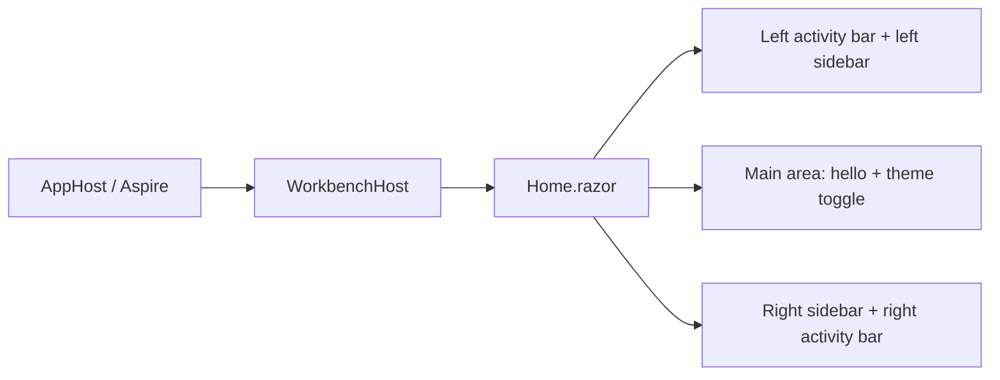

# Implementation Plan + Architecture

**Target output path:** `docs/080-workbench-initial/plan-frontend-workbench-home-radzen-mockup_v0.01.md`

**Based on:** `docs/080-workbench-initial/spec-frontend-workbench-home-radzen-mockup_v0.01.md`

**Version:** `v0.01` (`Draft`)

---

# Implementation Plan

## Planning constraints and delivery posture

- This plan is based on `docs/080-workbench-initial/spec-frontend-workbench-home-radzen-mockup_v0.01.md`.
- All code-writing work in this plan must comply fully with `./.github/instructions/documentation-pass.instructions.md`.
- `./.github/instructions/documentation-pass.instructions.md` is a mandatory repository standard and a hard Definition of Done gate for every code-writing Work Item.
- Every code-writing task must explicitly follow `./.github/instructions/documentation-pass.instructions.md` in full, including developer-level comments on every touched class, method, constructor, relevant property, and public parameter.
- The implementation must also follow repository Blazor guidance, including explicit `@rendermode InteractiveServer` on pages that handle input or click interactions.
- The implementation scope must remain tightly limited to the temporary `WorkbenchHost` visual mock-up and must not introduce real Workbench behavior, responsive auto-hiding behavior, or new automated tests.
- The work must stay within the existing `WorkbenchHost` host and component structure and should avoid unnecessary new abstractions because this screen is temporary and intended for rapid iteration.
- Manual visual verification is the required validation path for this work package; no new unit, integration, component, or end-to-end tests are to be added.

## Baseline

- `WorkbenchHost` already serves a temporary Blazor home page from `Home.razor`.
- The current home page still contains scaffold-only content, including `Hello UKHO Workbench` and temporary listing output that is now out of scope.
- The work package already contains the approved specification for the Radzen-based mock-up in `docs/080-workbench-initial/spec-frontend-workbench-home-radzen-mockup_v0.01.md`.
- The target runtime remains `WorkbenchHost` launched through the existing `AppHost` / Aspire flow.

## Delta

- Introduce Radzen into `WorkbenchHost` using the official Radzen get-started approach.
- Replace the current temporary `Home.razor` content with a full-viewport desktop-style shell mock-up.
- Add a left activity bar with `3 + gear` icon arrangement and a right activity bar with `2` icons.
- Add independently controlled, full-height, resizable left and right sidebars using Radzen splitters.
- Add temporary per-icon placeholder content that is visibly different across icons.
- Add the main-area `hello` text and a theme toggle, with dark theme as the initial state and no persistence across refresh.
- Finalize visual polish required by the specification, including subtle separators, icon-only sidebar chrome, full-height behavior, edge anchoring, and desktop-only layout behavior.

## Carry-over / Out of scope

- No real Workbench commands, tools, workflows, docking model, or persistence.
- No business logic, APIs, domain behavior, or Search-specific behavior.
- No responsive auto-hide rules or mobile-style adaptations.
- No new automated tests.
- No broader shell or architecture restructuring outside what is needed to produce the temporary mock-up.

---

## Slice 1 — Establish the Radzen-backed full-viewport shell baseline

- [ ] Work Item 1: Replace the current home page with a full-viewport dark shell baseline and theme toggle
  - **Purpose**: Deliver the smallest runnable visual slice that proves `WorkbenchHost` can host the new Radzen-backed desktop shell direction before sidebar mechanics are layered in.
  - **Acceptance Criteria**:
    - `WorkbenchHost` is configured to use Radzen according to the official get-started guidance.
    - `Home.razor` no longer renders the temporary `Hello UKHO Workbench` scaffold output or temporary listing content.
    - The page fills the browser viewport horizontally and vertically with no outer margins or padding.
    - The initial theme is dark.
    - The main area renders `hello` and a working theme toggle at the top left.
    - Toggling switches between light and dark themes without persisting across refresh.
    - The page explicitly uses `InteractiveServer`.
  - **Definition of Done**:
    - Code implemented for the Radzen-backed shell baseline
    - `./.github/instructions/documentation-pass.instructions.md` followed in full for every touched source file
    - Developer-level comments added to all touched files as required by `./.github/instructions/documentation-pass.instructions.md`
    - No new automated tests added, per specification
    - Solution builds successfully
    - End-to-end path can be manually verified through `AppHost` / Aspire at `/`
  - [ ] Task 1.1: Introduce Radzen into `WorkbenchHost`
    - [ ] Step 1: Inspect `WorkbenchHost.csproj`, `Program.cs`, shared imports, and host assets to identify the correct integration points for Radzen.
    - [ ] Step 2: Add the Radzen package references, service registration, and static asset usage required by the official Radzen get-started guidance.
    - [ ] Step 3: Keep `.csproj` edits aligned with repository package grouping conventions.
    - [ ] Step 4: Apply `./.github/instructions/documentation-pass.instructions.md` in full to every touched source file.
  - [ ] Task 1.2: Replace the current home-page scaffold with the shell baseline
    - [ ] Step 1: Remove the current temporary greeting and any scaffold-only listing markup from `Home.razor`.
    - [ ] Step 2: Add a full-viewport shell container that occupies the full browser width and height with no outer padding or margins.
    - [ ] Step 3: Place the visible `hello` text and a working theme toggle at the top left of the main area.
    - [ ] Step 4: Ensure the page remains visually neutral and does not introduce cards or panel framing.
    - [ ] Step 5: Add `@rendermode InteractiveServer` explicitly because the page contains interactive controls.
    - [ ] Step 6: Apply `./.github/instructions/documentation-pass.instructions.md` in full to every touched Razor or C# file.
  - [ ] Task 1.3: Implement temporary light/dark theme switching for the baseline shell
    - [ ] Step 1: Choose a lightweight theme-switching approach appropriate for a temporary Blazor shell mock-up.
    - [ ] Step 2: Make dark the default first-load theme.
    - [ ] Step 3: Make the toggle switch between dark and light themes in both directions.
    - [ ] Step 4: Ensure the selected theme resets on refresh rather than persisting.
    - [ ] Step 5: Keep the exact toggle visual treatment implementation-led, as permitted by the specification.
    - [ ] Step 6: Apply `./.github/instructions/documentation-pass.instructions.md` in full to every touched source file.
  - **Files**:
    - `src/workbench/server/WorkbenchHost/WorkbenchHost.csproj`: Radzen package references
    - `src/workbench/server/WorkbenchHost/Program.cs`: Radzen service registration and host wiring if required
    - `src/workbench/server/WorkbenchHost/Components/Pages/Home.razor`: full-viewport shell baseline, `hello`, theme toggle, render mode
    - `src/workbench/server/WorkbenchHost/Components/Pages/Home.razor.css`: page-scoped shell styling if used
    - `src/workbench/server/WorkbenchHost/Components/_Imports.razor`: Radzen namespaces if required
    - `src/workbench/server/WorkbenchHost/Components/Layout/MainLayout.razor`: minimal layout adjustment only if required for edge-to-edge rendering
  - **Work Item Dependencies**: Current repository baseline only.
  - **Run / Verification Instructions**:
    - build the solution
    - start `AppHost`
    - open the Aspire dashboard
    - open the `WorkbenchHost` endpoint
    - confirm the page loads edge-to-edge with a dark initial theme
    - confirm `hello` and the theme toggle appear at the top left
    - confirm the theme toggle switches between dark and light and resets after refresh
  - **User Instructions**: None beyond the normal `AppHost` launch path.

---

## Slice 2 — Deliver the left activity bar and left resizable sidebar

- [ ] Work Item 2: Add the left Theia-style activity bar, gear utility icon, and resizable left sidebar
  - **Purpose**: Deliver the first real shell-mechanics slice by making the left side behave like a desktop workbench activity bar with an independently controlled, resizable panel.
  - **Acceptance Criteria**:
    - The left activity bar is anchored to the absolute left edge and runs full height.
    - The left activity bar contains three top-aligned main icons plus a bottom-anchored decorative gear icon.
    - Main left icons are icon-only, show hover and active states, and use tooltips.
    - The left gear icon is decorative only and exposes a `Settings` tooltip.
    - Clicking a left main icon opens a full-height left sidebar with different placeholder content for that icon.
    - Clicking the active left icon closes the left sidebar.
    - The left sidebar is full-height, uses a subtle separator, opens rightwards, and is user-resizable through a Radzen splitter up to a maximum width of `300`.
    - The left sidebar header is icon-only, with an arbitrary icon followed by an icon-only close button that exposes a `Close` tooltip.
  - **Definition of Done**:
    - Code implemented for the left activity bar and left sidebar slice
    - `./.github/instructions/documentation-pass.instructions.md` followed in full for every touched source file
    - Developer-level comments added to all touched files as required by `./.github/instructions/documentation-pass.instructions.md`
    - No new automated tests added, per specification
    - Solution builds successfully
    - Left-side behavior can be manually verified end-to-end through `WorkbenchHost`
  - [ ] Task 2.1: Add the left activity bar chrome
    - [ ] Step 1: Add a full-height left activity bar anchored to the viewport edge.
    - [ ] Step 2: Add three top-aligned main icons using icon-only presentation and tooltip labels.
    - [ ] Step 3: Add a bottom-anchored gear icon separate from the main icon group.
    - [ ] Step 4: Ensure the gear icon remains visual only and does not open content.
    - [ ] Step 5: Add clear hover and active states consistent with the Theia-like direction in the specification.
    - [ ] Step 6: Apply `./.github/instructions/documentation-pass.instructions.md` in full to every touched source file.
  - [ ] Task 2.2: Add the left sidebar interaction and resize mechanics
    - [ ] Step 1: Add state handling for one-open-panel-at-a-time behavior on the left side.
    - [ ] Step 2: Add a full-height left sidebar that opens rightwards and pushes the main area rather than overlaying it.
    - [ ] Step 3: Implement the left sidebar with a Radzen splitter so the user can resize it.
    - [ ] Step 4: Enforce the `300` maximum width while otherwise using Radzen default initial sizing behavior.
    - [ ] Step 5: Ensure the left side starts closed on initial page load.
    - [ ] Step 6: Apply `./.github/instructions/documentation-pass.instructions.md` in full to every touched source file.
  - [ ] Task 2.3: Add left-panel placeholder content and header chrome
    - [ ] Step 1: Add a minimal full-height sidebar header with an arbitrary icon and an icon-only close button.
    - [ ] Step 2: Ensure the close button closes the left sidebar and exposes a `Close` tooltip.
    - [ ] Step 3: Add visibly different placeholder content for each of the three left icons.
    - [ ] Step 4: Allow visible text inside the sidebar content area while keeping shell chrome icon-only.
    - [ ] Step 5: Add subtle separator styling between the left sidebar and the main area.
    - [ ] Step 6: Apply `./.github/instructions/documentation-pass.instructions.md` in full to every touched source file.
  - **Files**:
    - `src/workbench/server/WorkbenchHost/Components/Pages/Home.razor`: left activity bar, left sidebar, left interaction state
    - `src/workbench/server/WorkbenchHost/Components/Pages/Home.razor.css`: activity bar styling, left sidebar styling, separators, hover and active visuals
    - `src/workbench/server/WorkbenchHost/Components/_Imports.razor`: any additional namespaces required for Radzen components used by the shell
  - **Work Item Dependencies**: Work Item 1.
  - **Run / Verification Instructions**:
    - build the solution
    - start `AppHost`
    - open the `WorkbenchHost` endpoint
    - confirm the left activity bar is full-height and edge-anchored
    - confirm there are three top icons and a separate bottom gear icon
    - confirm the gear icon shows `Settings` and does not open a panel
    - confirm each main icon opens visibly different left-side placeholder content
    - confirm repeat-click on the active icon closes the left sidebar
    - confirm the close button also closes the left sidebar
    - confirm the left sidebar is resizable and never exceeds `300`
  - **User Instructions**: None.

---

## Slice 3 — Deliver the right activity bar, simultaneous sidebars, and final mock-up polish

- [ ] Work Item 3: Add the right activity bar, right resizable sidebar, simultaneous-open behavior, and final visual polish
  - **Purpose**: Complete the first usable mock-up by mirroring the shell mechanics on the right side and finalizing the desktop workbench look and feel needed for review.
  - **Acceptance Criteria**:
    - The right activity bar is anchored to the absolute right edge and runs full height.
    - The right activity bar contains two top-aligned main icons and no bottom utility icon.
    - Clicking a right main icon opens a full-height right sidebar that expands leftwards and pushes the main area.
    - The right sidebar is independently controlled from the left side and both sidebars may remain open simultaneously.
    - The right sidebar is resizable through a Radzen splitter up to a maximum width of `300`.
    - When both sidebars are open, the main area is allowed to become very narrow rather than auto-hiding anything.
    - The shell remains desktop-only under narrow widths and does not switch to responsive hiding behavior.
    - The final page preserves all specified visual rules: full viewport, no top bar, subtle separators, subtle open/close animation, no cards, and edge-to-edge layout.
  - **Definition of Done**:
    - Code implemented for the right activity bar, right sidebar, simultaneous-open behavior, and final shell polish
    - `./.github/instructions/documentation-pass.instructions.md` followed in full for every touched source file
    - Developer-level comments added to all touched files as required by `./.github/instructions/documentation-pass.instructions.md`
    - No new automated tests added, per specification
    - Solution builds successfully
    - Full mock-up can be manually reviewed through `WorkbenchHost`
  - [ ] Task 3.1: Add the right activity bar and right panel mechanics
    - [ ] Step 1: Add a full-height right activity bar anchored to the viewport edge.
    - [ ] Step 2: Add two top-aligned right-side icons using icon-only presentation and tooltips.
    - [ ] Step 3: Add state handling for one-open-panel-at-a-time behavior on the right side.
    - [ ] Step 4: Add a full-height right sidebar that opens leftwards and pushes the main area.
    - [ ] Step 5: Implement Radzen splitter-based resizing for the right sidebar with a maximum width of `300`.
    - [ ] Step 6: Apply `./.github/instructions/documentation-pass.instructions.md` in full to every touched source file.
  - [ ] Task 3.2: Finalize simultaneous-open desktop behavior
    - [ ] Step 1: Allow left and right sidebars to remain open at the same time.
    - [ ] Step 2: Ensure narrow-width behavior keeps the desktop layout intact without responsive auto-hide changes.
    - [ ] Step 3: Ensure the main content region is allowed to become narrow when both sidebars are open.
    - [ ] Step 4: Preserve full-height, edge-to-edge layout for the entire shell under all supported desktop review sizes.
    - [ ] Step 5: Apply `./.github/instructions/documentation-pass.instructions.md` in full to every touched source file.
  - [ ] Task 3.3: Apply final visual polish and placeholder variation
    - [ ] Step 1: Add visibly different placeholder content for each right-side icon.
    - [ ] Step 2: Ensure sidebars use subtle separators and subtle open/close animation only.
    - [ ] Step 3: Verify the page contains no top header or command bar and no card or panel framing in the main area.
    - [ ] Step 4: Verify icon-only rules remain limited to sidebar chrome, while visible text remains acceptable in the main area and sidebar bodies.
    - [ ] Step 5: Confirm the overall composition follows the supplied screenshot's general direction while ignoring bottom panel treatment and specific panel contents.
    - [ ] Step 6: Apply `./.github/instructions/documentation-pass.instructions.md` in full to every touched source file.
  - **Files**:
    - `src/workbench/server/WorkbenchHost/Components/Pages/Home.razor`: right activity bar, right sidebar, simultaneous-open behavior, final shell composition
    - `src/workbench/server/WorkbenchHost/Components/Pages/Home.razor.css`: right-side styling, animation, separator polish, full-viewport and narrow-width desktop behavior
  - **Work Item Dependencies**: Work Items 1 and 2.
  - **Run / Verification Instructions**:
    - build the solution
    - start `AppHost`
    - open the `WorkbenchHost` endpoint
    - confirm the right activity bar is full-height and edge-anchored with two icons only
    - confirm right-side panels open leftwards and resize correctly
    - confirm left and right sidebars can both stay open at once
    - confirm the main area may become narrow without auto-hiding shell regions
    - confirm the page remains full-viewport, dark-first, desktop-style, and free of top chrome
    - confirm the shell looks like a first-review workbench mock-up rather than a normal web page
  - **User Instructions**: None.

---

## Overall approach summary

This plan delivers the mock-up in three runnable vertical slices:

1. establish the Radzen-backed full-viewport shell baseline with a dark-first theme and working theme toggle
2. add the left workbench activity bar and left resizable sidebar mechanics
3. add the right mirrored activity bar, simultaneous sidebars, and final desktop-shell polish

Key implementation considerations are:

- keep all work inside `WorkbenchHost` and avoid over-engineering because this screen is temporary
- treat `./.github/instructions/documentation-pass.instructions.md` as mandatory in every code-writing task
- keep the shell edge-to-edge, desktop-only, and visually workbench-like rather than responsive-web-like
- use Radzen where it helps shell mechanics, especially splitter behavior
- keep shell chrome icon-only in the sidebars while allowing visible text in the main area and sidebar content bodies
- prioritize manual visual review over automated testing because the specification explicitly excludes new tests for this slice

---

# Architecture

## Overall Technical Approach

The technical approach is to evolve `WorkbenchHost` into a temporary desktop-style Blazor shell that uses Radzen for layout and interaction primitives while keeping all implementation inside the existing server-hosted Razor component application.

The page remains a single interactive Blazor route hosted by `WorkbenchHost`. The shell is composed from three primary UI regions:

- a full-height left activity bar and left sidebar region
- a central main area containing the visible `hello` text and theme toggle
- a full-height right sidebar and right activity bar region

Radzen is used where it improves shell mechanics, especially for splitter-based sidebar resizing and any lightweight UI primitives needed for the mock-up. The shell remains intentionally stateful only in memory and contains no persistence or business workflows.

## Frontend

The frontend lives inside the existing Blazor component structure of `src/workbench/server/WorkbenchHost/Components`.

Primary frontend responsibilities:

- render a full-viewport shell with no outer margins or padding
- apply a dark-first visual style with a temporary light/dark toggle
- provide a left activity bar with three top icons and a separate bottom gear icon
- provide a mirrored right activity bar with two top icons and no utility icon
- provide full-height, resizable left and right sidebars that push the main area
- render placeholder content bodies that differ per icon while keeping shell chrome icon-only

Likely touched frontend files:

- `src/workbench/server/WorkbenchHost/Components/Pages/Home.razor`
- `src/workbench/server/WorkbenchHost/Components/Pages/Home.razor.css`
- `src/workbench/server/WorkbenchHost/Components/_Imports.razor`
- `src/workbench/server/WorkbenchHost/Components/Layout/MainLayout.razor` only if edge-to-edge layout changes require it

User flow:

1. launch `AppHost`
2. open the `WorkbenchHost` endpoint
3. land on a dark full-viewport shell
4. use left and right activity-bar icons to open side panels
5. resize sidebars with Radzen splitters
6. toggle between dark and light themes from the main area

## Backend

The backend remains the existing `WorkbenchHost` ASP.NET Core / Blazor host. No new APIs, persistence, or business services are introduced.

Backend responsibilities are limited to:

- hosting the interactive Blazor page
- registering Radzen services and any required static assets
- serving the shell through the existing `AppHost` / Aspire path
- maintaining only temporary in-memory UI state for open panels and theme mode

Likely touched backend files:

- `src/workbench/server/WorkbenchHost/Program.cs`
- `src/workbench/server/WorkbenchHost/WorkbenchHost.csproj`

Data flow is minimal and UI-local:

1. the user clicks an activity-bar icon or close button
2. `Home.razor` updates in-memory component state
3. the selected sidebar region opens, closes, or changes content
4. the page re-renders using the current theme and panel state
