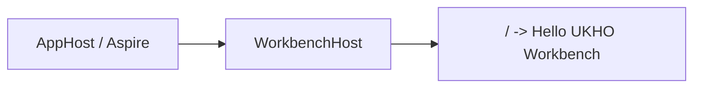

# Implementation Plan + Architecture

**Target output path:** `docs/080-workbench-initial/plan-workbench-host-blazor-root_v0.01.md`

**Based on:** `docs/080-workbench-initial/spec-workbench-host-blazor-root_v0.01.md`

**Version:** `v0.01` (`Draft`)

---

# Implementation Plan

## Planning constraints and delivery posture

- This plan is based on `docs/080-workbench-initial/spec-workbench-host-blazor-root_v0.01.md`.
- All code-writing work in this plan must comply fully with `./.github/instructions/documentation-pass.instructions.md`.
- `./.github/instructions/documentation-pass.instructions.md` is a mandatory repository standard and a hard Definition of Done gate for every code-writing Work Item.
- The implementation must treat the documentation-pass instruction as mandatory documentation coverage for every touched source file while limiting behavior changes to the scope explicitly authorized by the specification.
- Every code-writing task in this plan must explicitly deliver the developer-level commenting standard required by `./.github/instructions/documentation-pass.instructions.md`, including:
  - type-level comments for public, internal, and other non-public types
  - method and constructor comments for public, internal, and other non-public members
  - parameter documentation for every public method and constructor parameter
  - comments on properties whose meaning is not obvious from their names
  - sufficient inline or block comments so future developers can understand purpose, logical flow, and non-obvious decisions
- The implementation scope must stay tightly focused on `WorkbenchHost`.
- The only required user-facing capability is that `WorkbenchHost` serves a temporary Blazor page at `/` that displays `Hello UKHO Workbench`.
- The temporary root page must explicitly use `InteractiveServer`.
- All WebAssembly-specific packages, configuration, assets, and startup wiring that are no longer needed by `WorkbenchHost` must be removed.
- No new automated verification is required for this work package.
- `AppHost`/Aspire must remain the expected launch and manual verification path.

## Baseline

- The separate client-side Workbench projects have already been removed from the repository.
- `WorkbenchHost` now needs to become the sole temporary Workbench UI entry point.
- A focused specification exists for this transitional host-served page in `docs/080-workbench-initial/spec-workbench-host-blazor-root_v0.01.md`.
- The target outcome is intentionally minimal and temporary rather than a feature-complete Workbench shell.

## Delta

- Convert `WorkbenchHost` from WebAssembly-oriented hosting to a host-served Blazor page model.
- Introduce a single temporary root page at `/` that renders `Hello UKHO Workbench`.
- Apply `InteractiveServer` explicitly to the root page.
- Remove all WebAssembly-specific packages, configuration, assets, and startup wiring that are no longer needed.
- Preserve `AppHost`/Aspire as the supported launch and manual verification path.
- Validate build, remaining tests, and manual root-page rendering.

## Carry-over / Out of scope

- No broader Workbench shell composition, layout, menus, commands, or module behavior.
- No Search-specific UI, workflows, or business behavior.
- No new automated UI verification.
- No unrelated restructuring outside what is required for `WorkbenchHost` to serve the temporary page and remove obsolete WebAssembly concerns.
- No additional work package documents beyond this plan and the referenced specification.

---

## Slice 1 — Deliver the temporary host-served Blazor root page

- [x] Work Item 1: Make `WorkbenchHost` serve a minimal interactive Blazor page at `/` - Completed
  - **Purpose**: Establish the smallest runnable Workbench capability by making the retained host directly render a temporary page that proves the Workbench entry point still works after removal of the separate client-side application.
  - **Acceptance Criteria**:
    - `WorkbenchHost` serves a Blazor page from `/`.
    - The root page displays `Hello UKHO Workbench`.
    - The root page explicitly uses `InteractiveServer`.
    - The page is reachable through the existing `AppHost`/Aspire launch path.
    - The implementation remains tightly limited to the temporary host-served page.
  - **Definition of Done**:
    - Code implemented for the host-served Blazor root path
    - `./.github/instructions/documentation-pass.instructions.md` followed in full for every touched source file
    - Developer-level comments added to every touched class, method, constructor, relevant property, and public parameters as required
    - Build succeeds
    - Remaining tests pass
    - End-to-end path can be run via `AppHost`/Aspire and manually verified at `/`
  - Summary: Replaced the hosted WebAssembly request pipeline in `WorkbenchHost` with server-side Razor component hosting, added a minimal unstyled component shell and root page for `/`, retained the existing Aspire registration, and validated the change with a successful solution build plus the `WorkbenchHost.Tests` test project.
  - [x] Task 1.1: Rework `WorkbenchHost` startup to serve Razor components directly - Completed
    - Summary: Inspected the existing WebAssembly-oriented host bootstrap, then rewired `Program.cs` to register Razor components with interactive server rendering and map the component app shell directly.
    - [x] Step 1: Inspect the current `WorkbenchHost` startup, hosting packages, and component structure to identify the existing WebAssembly-oriented hosting path.
    - [x] Step 2: Update the host bootstrap so Razor components are served directly by `WorkbenchHost` rather than through any removed WebAssembly client application.
    - [x] Step 3: Keep the startup wiring minimal and aligned with repository host conventions.
    - [x] Step 4: Apply `./.github/instructions/documentation-pass.instructions.md` in full to every touched host bootstrap file.
  - [x] Task 1.2: Add the temporary root page and route wiring - Completed
    - Summary: Added the minimal component app shell, routing, layout, and a `/` page that renders `Hello UKHO Workbench` with explicit `InteractiveServer`, while removing component-scoped CSS so the temporary page stays visually plain.
    - [x] Step 1: Create or update the minimal root component/page structure needed for `WorkbenchHost` to answer `/`.
    - [x] Step 2: Ensure the root page renders only `Hello UKHO Workbench`.
    - [x] Step 3: Explicitly apply `@rendermode InteractiveServer` to the root page in line with repository Blazor Server guidance.
    - [x] Step 4: Remove any unused template pages, navigation, or component routing artifacts that are no longer needed for the temporary single-page experience.
    - [x] Step 5: Apply `./.github/instructions/documentation-pass.instructions.md` in full to all touched Razor and C# files involved in the root page flow.
  - [x] Task 1.3: Preserve the supported launch path through `AppHost`/Aspire - Completed
    - Summary: Confirmed the existing `AppHost` registration already continues to expose `WorkbenchHost` as the supported Aspire entry point, so no `AppHost` code changes were required for this work item.
    - [x] Step 1: Confirm `AppHost` still launches `WorkbenchHost` as the supported developer entry point.
    - [x] Step 2: Confirm the effective default route for manual verification remains `/`.
    - [x] Step 3: Adjust only the minimum `AppHost` registration details needed so the supported launch path remains correct after the host conversion.
    - [x] Step 4: Apply `./.github/instructions/documentation-pass.instructions.md` in full to any touched host/bootstrap files.
  - **Files**:
    - `src/workbench/server/WorkbenchHost/Program.cs`: host bootstrap and Razor component hosting setup
    - `src/workbench/server/WorkbenchHost/Components/**/*`: app shell, routing, layout, and temporary root page updates
    - `src/Hosts/AppHost/**/*`: any minimal launch-path adjustment needed to keep `WorkbenchHost` reachable through Aspire
  - **Work Item Dependencies**: Current repository baseline only.
  - **Run / Verification Instructions**:
    - build the solution
    - start `AppHost`
    - open the Aspire dashboard
    - open the `WorkbenchHost` endpoint
    - confirm `/` renders `Hello UKHO Workbench`
  - **User Instructions**: Use the normal `AppHost` startup flow; no additional setup is expected.

---

## Slice 2 — Remove obsolete WebAssembly concerns and validate the simplified host

- [ ] Work Item 2: Remove obsolete WebAssembly-specific implementation artifacts while preserving the runnable host-served page
  - **Purpose**: Complete the transitional simplification by removing WebAssembly-specific packages, configuration, assets, and startup wiring that are no longer needed once `WorkbenchHost` serves the temporary page directly.
  - **Acceptance Criteria**:
    - WebAssembly-specific packages no longer required by `WorkbenchHost` are removed.
    - WebAssembly-specific configuration and startup wiring no longer required by `WorkbenchHost` are removed.
    - WebAssembly-specific static assets or host integration artifacts no longer needed by the new host-served path are removed.
    - `WorkbenchHost` still serves `Hello UKHO Workbench` from `/` after cleanup.
    - No new automated verification is introduced.
  - **Definition of Done**:
    - Obsolete WebAssembly-specific artifacts removed within the scope authorized by the specification
    - `./.github/instructions/documentation-pass.instructions.md` followed in full for every touched source file
    - Developer-level comments added or updated on all touched source files per repository standard
    - Build succeeds
    - Remaining tests pass
    - Manual verification through `AppHost`/Aspire confirms `/` still renders correctly
  - [ ] Task 2.1: Remove obsolete project and package dependencies
    - [ ] Step 1: Inspect `WorkbenchHost` project references and package references for WebAssembly-specific dependencies that are no longer used.
    - [ ] Step 2: Remove obsolete WebAssembly-specific references from project files and supporting configuration.
    - [ ] Step 3: Keep project-file edits aligned with repository `.csproj` grouping conventions.
    - [ ] Step 4: Apply `./.github/instructions/documentation-pass.instructions.md` in full to any touched source files associated with the cleanup.
  - [ ] Task 2.2: Remove obsolete WebAssembly assets and startup integration
    - [ ] Step 1: Inspect `WorkbenchHost` for static assets, hosting hooks, middleware, or route fallbacks that existed only to serve the removed WebAssembly application.
    - [ ] Step 2: Remove assets and host integration artifacts that are specific to the removed WebAssembly approach and no longer used by the host-served Blazor page.
    - [ ] Step 3: Keep any remaining shared host assets only where they are still required by the simplified root-page experience.
    - [ ] Step 4: Apply `./.github/instructions/documentation-pass.instructions.md` in full to all touched files.
  - [ ] Task 2.3: Validate the simplified host baseline
    - [ ] Step 1: Run a full solution build.
    - [ ] Step 2: Run the remaining tests.
    - [ ] Step 3: Start `AppHost` and open the Aspire dashboard.
    - [ ] Step 4: Open the `WorkbenchHost` endpoint and verify `/` renders `Hello UKHO Workbench`.
    - [ ] Step 5: Confirm no new automated verification has been introduced for this temporary page.
  - **Files**:
    - `src/workbench/server/WorkbenchHost/WorkbenchHost.csproj`: removal of obsolete WebAssembly-specific dependencies
    - `src/workbench/server/WorkbenchHost/Program.cs`: removal of obsolete WebAssembly-specific startup wiring
    - `src/workbench/server/WorkbenchHost/wwwroot/**/*`: removal of obsolete WebAssembly-specific static assets if present
    - `src/workbench/server/WorkbenchHost/Components/**/*`: any final cleanup to align the simplified host-served experience
  - **Work Item Dependencies**: Work Item 1.
  - **Run / Verification Instructions**:
    - build the solution
    - run the remaining tests
    - start `AppHost`
    - open the Aspire dashboard
    - open the `WorkbenchHost` endpoint
    - confirm `/` renders `Hello UKHO Workbench`
  - **User Instructions**: None beyond the normal local build, test, and `AppHost` startup workflow.

---

## Overall approach summary

This plan delivers the new temporary Workbench state in two small vertical slices:

1. make `WorkbenchHost` directly serve a minimal interactive Blazor page at `/`
2. remove obsolete WebAssembly-specific implementation concerns while preserving that runnable host-served page

Key implementation considerations are:

- keep the implementation strictly scoped to `WorkbenchHost` and the temporary root page
- use `InteractiveServer` explicitly on the root page
- preserve `AppHost`/Aspire as the supported run and manual verification path
- remove WebAssembly-specific packages, configuration, assets, and startup wiring comprehensively, but only where they are no longer needed
- treat `./.github/instructions/documentation-pass.instructions.md` as a hard gate for all code-writing work
- avoid introducing broader Workbench behavior, Search-specific logic, or automated UI verification in this transitional slice

---

# Architecture

## Overall Technical Approach

The technical approach is to simplify the remaining Workbench host into a single ASP.NET Core Blazor host that renders its own temporary root page.

The frontend and backend concerns for this temporary state are intentionally collapsed into `WorkbenchHost`. Rather than serving a separate WebAssembly client, the host uses Razor components directly and exposes a single minimal route at `/`.

`AppHost`/Aspire remains the orchestration and launch surface for local development and manual verification.

The main runtime path is:

1. `AppHost` starts `WorkbenchHost`
2. the developer opens the `WorkbenchHost` endpoint from the Aspire dashboard
3. `WorkbenchHost` routes `/` to the temporary Razor component page
4. the page renders `Hello UKHO Workbench` using `InteractiveServer`

## Frontend

For this temporary slice, the frontend is the Razor component surface hosted directly inside `src/workbench/server/WorkbenchHost`.

Expected frontend responsibilities:

- a minimal app shell or route configuration sufficient to answer `/`
- a temporary root page that renders `Hello UKHO Workbench`
- explicit `@rendermode InteractiveServer` on the root page
- removal of unused template navigation, extra pages, and any WebAssembly-oriented UI remnants no longer required

Likely touched frontend areas inside `WorkbenchHost` include:

- `Components/App.razor`
- `Components/Routes.razor`
- `Components/Layout/*`
- `Components/Pages/*`
- other minimal Razor component files required for the root page path

The user flow is intentionally simple:

1. launch through `AppHost`/Aspire
2. open `/`
3. see `Hello UKHO Workbench`

## Backend

For this temporary slice, the backend is also `WorkbenchHost`, acting as the ASP.NET Core host and Razor component runtime.

Expected backend responsibilities:

- configure the host to serve Razor components directly
- support the `InteractiveServer` render mode required by the root page
- remove obsolete WebAssembly-specific middleware, package dependencies, configuration, asset wiring, and route fallbacks no longer needed after removal of the separate client application
- remain compatible with the existing `AppHost`/Aspire startup path

Likely touched backend areas include:

- `src/workbench/server/WorkbenchHost/Program.cs`
- `src/workbench/server/WorkbenchHost/WorkbenchHost.csproj`
- any supporting configuration files under the `WorkbenchHost` project
- minimal `AppHost` files only if needed to preserve the supported launch path
