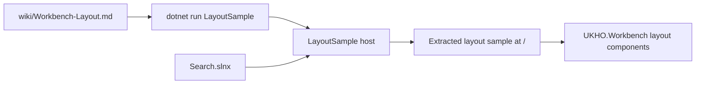

# Implementation Plan

**Target output path:** `docs/081-workbench-layout/plan-workbench-layout-sample-host_v0.01.md`

**Based on:** `docs/081-workbench-layout/spec-workbench-layout-sample-host_v0.01.md`

**Mandatory repository standard:** Every code-writing task in this plan must follow `./.github/instructions/documentation-pass.instructions.md` in full. Compliance with that instruction file is a hard Definition of Done gate for every Work Item. This includes developer-level comments on every class, method, and constructor, including internal and other non-public types and members; documentation for every public method and constructor parameter; comments on every non-obvious property; and sufficient inline or block comments so a developer can understand purpose, logical flow, and any algorithms used.

## Project Structure and Delivery Strategy

- Create the standalone sample under `src/Workbench/samples/LayoutSample/`.
- Keep `src/workbench/server/WorkbenchHost/` completely unchanged.
- Copy the existing layout sample page and any required project-local support assets into `LayoutSample` rather than extracting shared code through changes to `WorkbenchHost`.
- Keep the sample focused on a single runnable page at `/`, with no additional navigation, sidebar, header shell, or template chrome.
- Add the new project to `Search.slnx`; exact solution-folder placement is not important.
- Update `wiki/Workbench-Layout.md` so `LayoutSample` becomes the canonical runnable example and no references to `WorkbenchHost` remain.
- Treat `./.github/instructions/documentation-pass.instructions.md` as mandatory for all code-writing tasks in this plan.

## Standalone Layout Sample Vertical Slice
- [x] Work Item 1: Deliver `LayoutSample` as a runnable standalone extraction of the existing layout showcase - Completed
  - Summary: Created the standalone `LayoutSample` Blazor Server host under `src/Workbench/samples/LayoutSample/`, copied the existing `LayoutSplitterShowcase` to `/`, kept `WorkbenchHost` unchanged, registered the new project in `Search.slnx`, built the workspace, ran `UKHO.Workbench.Tests` (58 passed), and smoke-verified `dotnet run --project src/Workbench/samples/LayoutSample/LayoutSample.csproj` by requesting `/`.
  - **Purpose**: Create the smallest meaningful end-to-end slice that preserves the current layout showcase as a standalone Blazor Server sample, runnable directly from its own project and reachable at the home route `/`.
  - **Acceptance Criteria**:
    - A new Blazor Server project named `LayoutSample` exists under `src/Workbench/samples/`.
    - `LayoutSample` runs directly and renders the extracted layout showcase at `/`.
    - The sample contains only the extracted page and required support assets, with no template navigation or extra pages.
    - `WorkbenchHost` remains unchanged.
    - `Search.slnx` includes the new project.
    - All new and changed code follows `./.github/instructions/documentation-pass.instructions.md`.
  - **Definition of Done**:
    - Code implemented and fully commented per `./.github/instructions/documentation-pass.instructions.md`
    - Standalone sample builds successfully
    - Relevant automated tests pass, and manual startup verification is completed
    - `Search.slnx` updated
    - Can execute end to end via: `dotnet run --project src/Workbench/samples/LayoutSample/LayoutSample.csproj`
  - [x] Task 1: Create the standalone Blazor Server sample host - Completed
    - Summary: Added the standalone `LayoutSample` project, a minimal interactive server bootstrap, a minimal app shell, and a small host stylesheet-backed web root with no Aspire dependency or navigation chrome.
    - [x] Step 1: Create `src/Workbench/samples/LayoutSample/LayoutSample.csproj` using the default Blazor Server structure as the starting point. - Completed
      - Summary: Created `LayoutSample.csproj` as a .NET 10 web project with nullable and implicit usings enabled plus a reference to `UKHO.Workbench`.
    - [x] Step 2: Configure the sample host bootstrap so the app can run standalone without Aspire orchestration. - Completed
      - Summary: Added a standalone `Program.cs` that registers interactive server Razor components, maps static assets, and runs independently of Aspire.
    - [x] Step 3: Remove template-created pages, sample content, navigation, sidebar, header shell, and other unused chrome so the sample is reduced to a single-page host. - Completed
      - Summary: Created only the minimal `App`, `Routes`, and `MainLayout` files needed to render one routed page with no extra shell or navigation.
    - [x] Step 4: Apply `./.github/instructions/documentation-pass.instructions.md` to every new or changed file created for the standalone sample host. - Completed
      - Summary: Added developer-level comments and XML documentation across the new C# host files and documented the minimal Razor host files inline.
  - [x] Task 2: Extract the existing layout showcase into the new sample - Completed
    - Summary: Copied the existing `LayoutSplitterShowcase` markup, code-behind, and scoped CSS into `LayoutSample` and adapted only the route and minimal host assets needed for standalone execution.
    - [x] Step 1: Copy the current layout showcase page content into `LayoutSample` and host it at the home route `/`. - Completed
      - Summary: Added `Components/Pages/LayoutSplitterShowcase.razor` to the sample and changed the route to `/`.
    - [x] Step 2: Preserve the current page title and overall presentation unless a minimal host-level adaptation is required for standalone execution. - Completed
      - Summary: Kept the existing page title, headings, examples, and diagnostics panel while adding only a minimal host stylesheet and web root.
    - [x] Step 3: Copy any required page-local styles, helper classes, code-behind files, or other project-local assets into `LayoutSample`. - Completed
      - Summary: Copied the page code-behind and scoped CSS and retained the `UKHO.Workbench` project dependency that supplies the layout components and static splitter assets.
    - [x] Step 4: Verify the extracted page remains functionally equivalent to the current showcase, apart from the minimal hosting changes needed to run it standalone. - Completed
      - Summary: Verified the standalone sample builds, starts, and returns the expected showcase heading from `/` while preserving the original demos and resize diagnostics.
    - [x] Step 5: Apply `./.github/instructions/documentation-pass.instructions.md` to every copied or adapted code file. - Completed
      - Summary: Preserved and supplemented the local developer comments and XML documentation in the copied sample code-behind and host files.
  - [x] Task 3: Register the sample in the solution and validate the runnable path - Completed
    - Summary: Added `LayoutSample` to `Search.slnx`, validated the sample-specific build path, ran targeted `UKHO.Workbench.Tests`, and smoke-tested the documented `dotnet run` flow.
    - [x] Step 1: Add `src/Workbench/samples/LayoutSample/LayoutSample.csproj` to `Search.slnx`. - Completed
      - Summary: Registered the new sample project under the `/04 Workbench/samples/` folder in `Search.slnx`.
    - [x] Step 2: Build the new sample project and address any project-reference or asset-loading issues needed for standalone execution. - Completed
      - Summary: Built `LayoutSample.csproj` successfully and added `wwwroot/app.css` so the sample host exposes a concrete web root.
    - [x] Step 3: Run the sample locally and verify the home route `/` renders the layout showcase correctly. - Completed
      - Summary: Started the sample with `dotnet run --project src/Workbench/samples/LayoutSample/LayoutSample.csproj` and confirmed the home route response contains `Row and column splitter showcase`.
    - [x] Step 4: Run any relevant targeted tests for affected projects, or document why no additional automated test project changes are required for this extraction. - Completed
      - Summary: Ran the targeted `UKHO.Workbench.Tests` project (58 passed); no new automated test project changes were required because the extraction adds a thin sample host over the already-covered layout library.
  - **Files**:
    - `src/Workbench/samples/LayoutSample/LayoutSample.csproj`: New standalone sample project definition.
    - `src/Workbench/samples/LayoutSample/Program.cs`: Standalone host bootstrap.
    - `src/Workbench/samples/LayoutSample/Components/*`: Extracted page and minimal app shell needed to host only the sample page.
    - `src/Workbench/samples/LayoutSample/wwwroot/*`: Any copied static assets required by the extracted sample.
    - `Search.slnx`: Solution registration for `LayoutSample`.
  - **Work Item Dependencies**: None. This is the first runnable vertical slice.
  - **Run / Verification Instructions**:
    - `dotnet build src/Workbench/samples/LayoutSample/LayoutSample.csproj`
    - `dotnet run --project src/Workbench/samples/LayoutSample/LayoutSample.csproj`
    - Open the sample root URL and verify the extracted layout sample is the only rendered page.
  - **User Instructions**: None expected beyond running the sample locally.

## Canonical Documentation Alignment Slice
- [x] Work Item 2: Make `LayoutSample` the canonical documented runnable example - Completed
  - Summary: Updated the Workbench layout wiki to reinforce `LayoutSample` as the canonical standalone single-page showcase, re-ran the sample with the documented `dotnet run --project src/Workbench/samples/LayoutSample/LayoutSample.csproj` command, verified the root page content and absence of navigation chrome, and revalidated the workspace with a successful build plus targeted `UKHO.Workbench.Tests` execution (58 passed).
  - **Purpose**: Complete the user-facing slice by aligning repository documentation with the new standalone sample so developers are directed to the correct runnable example and no old host references remain.
  - **Acceptance Criteria**:
    - `wiki/Workbench-Layout.md` references `LayoutSample` as the canonical runnable example.
    - The wiki includes the explicit run command `dotnet run --project src/Workbench/samples/LayoutSample/LayoutSample.csproj`.
    - No references to `WorkbenchHost` remain in the wiki page.
    - The documented run flow matches the actual standalone sample behaviour.
  - **Definition of Done**:
    - Documentation updated and reviewed for consistency with the implemented sample
    - Code-writing tasks, if any arise while fixing sample integration gaps, comply with `./.github/instructions/documentation-pass.instructions.md`
    - Manual verification confirms the wiki instructions match the actual runnable sample
    - Can execute end to end via: `dotnet run --project src/Workbench/samples/LayoutSample/LayoutSample.csproj`
  - [x] Task 1: Update the Workbench layout wiki guidance - Completed
    - Summary: Tightened `wiki/Workbench-Layout.md` so it explicitly presents `LayoutSample` as the canonical standalone single-page showcase, retains the exact `dotnet run --project src/Workbench/samples/LayoutSample/LayoutSample.csproj` command, and confirms the page contains no remaining `WorkbenchHost` references.
    - [x] Step 1: Replace existing runnable showcase references with `LayoutSample`. - Completed
      - Summary: Verified the runnable showcase guidance points to `src/Workbench/samples/LayoutSample/Components/Pages/LayoutSplitterShowcase.razor` and strengthened the wiki wording to describe it as the canonical runnable showcase.
    - [x] Step 2: Add the explicit run command `dotnet run --project src/Workbench/samples/LayoutSample/LayoutSample.csproj`. - Completed
      - Summary: Confirmed the wiki includes the exact standalone sample launch command unchanged.
    - [x] Step 3: Position `LayoutSample` as the standalone canonical example of how the Workbench layout works. - Completed
      - Summary: Updated the wiki wording so `LayoutSample` is described as the canonical standalone single-page example for Workbench layout behaviour.
    - [x] Step 4: Ensure no references to `WorkbenchHost` remain anywhere in `wiki/Workbench-Layout.md`. - Completed
      - Summary: Reviewed the wiki page and confirmed that no `WorkbenchHost` references remain.
  - [x] Task 2: Final verification of documentation and runnable behaviour - Completed
    - Summary: Re-ran the sample using the exact wiki command, confirmed the home route renders the expected showcase content without navigation chrome, and verified the wiki text still matches the final project location, launch command, and canonical-example wording.
    - [x] Step 1: Re-run the standalone sample using the exact wiki command. - Completed
      - Summary: Started the sample successfully with `dotnet run --project src/Workbench/samples/LayoutSample/LayoutSample.csproj` and observed the host listening on `http://localhost:5000`.
    - [x] Step 2: Verify the rendered application matches the wiki description and remains a single-page sample with no navigation chrome. - Completed
      - Summary: Requested the sample root and confirmed it contains `Row and column splitter showcase` plus `Unified resize notification` while exposing no `<nav>` element or sidebar/template chrome markers.
    - [x] Step 3: Verify the wiki reflects the final project location, command, and canonical-example wording accurately. - Completed
      - Summary: Reviewed `wiki/Workbench-Layout.md` and confirmed it references `LayoutSample`, the exact run command, the single-page root route, and no `WorkbenchHost` references.
  - **Files**:
    - `wiki/Workbench-Layout.md`: Canonical runnable guidance updated to point to `LayoutSample`.
    - `docs/081-workbench-layout/spec-workbench-layout-sample-host_v0.01.md`: Reference specification for the implemented behaviour; no change planned unless clarification is explicitly required later.
  - **Work Item Dependencies**: Depends on Work Item 1.
  - **Run / Verification Instructions**:
    - `dotnet run --project src/Workbench/samples/LayoutSample/LayoutSample.csproj`
    - Open the sample root URL and confirm the wiki accurately describes the page and launch flow.
  - **User Instructions**: None expected beyond running the sample locally.

## Architecture

## Overall Technical Approach
- Introduce a new standalone Blazor Server sample host at `src/Workbench/samples/LayoutSample/`.
- Preserve behaviour by copying the existing layout showcase page and any required project-local assets into the new sample instead of refactoring through changes to `WorkbenchHost`.
- Keep the sample intentionally minimal: one page at `/`, no navigation shell, no Aspire orchestration, and no additional feature surface.
- Treat `LayoutSample` as the canonical runnable documentation example for Workbench layout behaviour.
- Treat `./.github/instructions/documentation-pass.instructions.md` as a hard gate for all code-writing work.

## Frontend
- The primary frontend surface is the standalone Blazor Server sample under `src/Workbench/samples/LayoutSample/`.
- The sample should use only the minimum host structure required to render the extracted page at `/`.
- The extracted page should preserve the current title, layout, and behaviour as closely as possible.
- Any required local styles, helper types, or page support code should live inside `LayoutSample` so the sample remains self-contained.
- No navigation menu, sidebar, header shell, or additional pages should be present.

## Backend
- No separate backend/API/service work is required for this work package.
- Runtime behaviour remains within the Blazor Server sample host plus its existing Workbench component dependencies.
- Integration is limited to:
  - project references needed by the extracted page
  - solution registration in `Search.slnx`
  - documentation alignment in `wiki/Workbench-Layout.md`

## Summary
This plan delivers the work in two runnable slices. The first creates the new standalone `LayoutSample` and proves the extracted page runs independently at `/` without changing `WorkbenchHost`. The second makes the sample the canonical documented entry point by updating the wiki and verifying the documented command and behaviour match the implemented sample. The key implementation considerations are preserving the page exactly as it exists today, copying any required support assets into the new sample, keeping the host minimal, and enforcing `./.github/instructions/documentation-pass.instructions.md` as a hard completion gate for all code-writing work.
