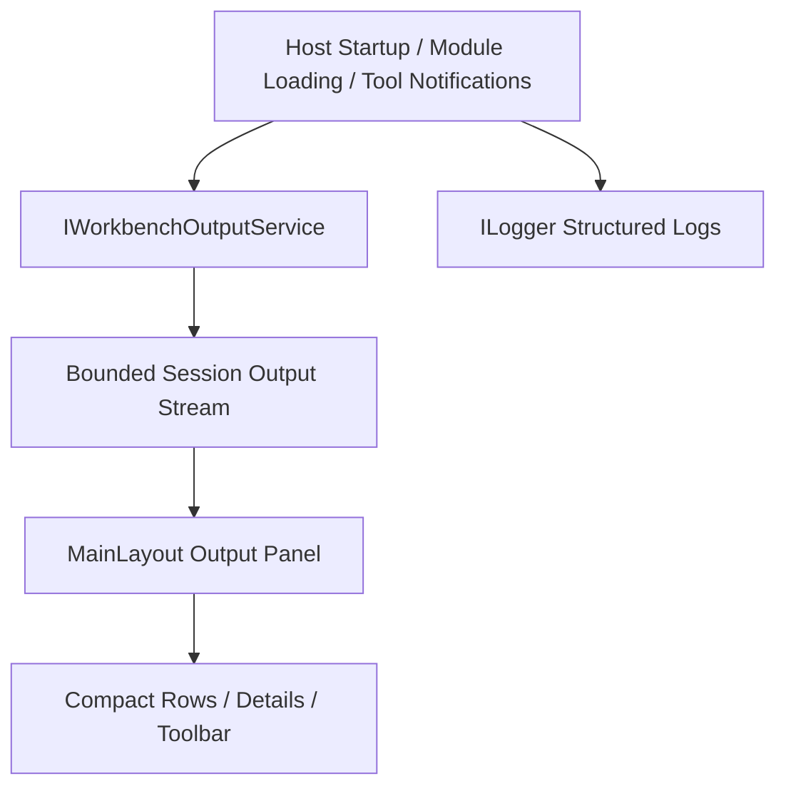

# Implementation Plan

**Target output path:** `docs/086-workbench-output/implementation-plan.md`

**Source specification:** `docs/086-workbench-output/spec-workbench-output_v0.01.md`

## Delivery rules for all Work Items

- `./.github/instructions/documentation-pass.instructions.md` is a mandatory repository standard for this work package and a hard Definition of Done gate for every code-writing task in this plan.
- Every code-writing task in this plan must implement `./.github/instructions/documentation-pass.instructions.md` in full, including developer-level comments on every class, method, and constructor touched, including internal and other non-public types; parameter documentation for every public method and constructor parameter; comments on every property whose meaning is not obvious from its name; and sufficient inline or block comments so the purpose, logical flow, and any non-obvious algorithms remain understandable to another developer.
- All new and updated C# code must continue to follow repository coding standards, including block-scoped namespaces, Allman braces, one public type per file, and underscore-prefixed private fields where applicable.
- The Workbench shell must remain desktop-like, stay close to the stock Radzen Material theme, and continue to use the existing `UKHO.Workbench.Layout` grid and splitter primitives rather than introducing module-specific CSS workarounds.
- The output panel must be implemented as a shell-owned structured Workbench component rather than a terminal emulator or a free-form text console.
- Validation for this work package must stay focused on the Workbench projects and tests affected by each slice rather than the full repository suite.
- Where practical for UI verification in this repository, prefer Playwright end-to-end coverage over component-only tests, but keep delivery realistic for the existing Workbench test estate.
- The status bar must remain in the shell, but module-loading traces, context reporting, and other historical output defined by the specification must move into the output stream.

## Output Foundation Slice

- [ ] Work Item 1: Deliver a runnable shell-owned output stream with a collapsible bottom panel
  - **Purpose**: Establish the smallest end-to-end Workbench output capability by introducing the shared output contracts and service, wiring a real shell-produced entry into the stream, and rendering a hidden-by-default bottom panel that can be toggled open from the far-left of the status bar.
  - **Acceptance Criteria**:
    - The Workbench starts with the `Output` panel collapsed.
    - The status bar shows an `Output` toggle on the far-left edge with an expand-collapse indicator.
    - The shell can write at least one real output entry into a shell-wide in-memory output stream during startup or shell bootstrap.
    - Opening the panel renders a full-width bottom pane above the status bar and below the centre working area.
    - The panel shows the current output stream in chronological order with newest entries at the bottom.
  - **Definition of Done**:
    - Code implemented for shared output contracts, an in-memory output service, shell toggle state, and initial panel rendering
    - Targeted tests passing for service behavior and shell rendering
    - Logging and error handling added or preserved where shell bootstrap and UI state coordination require them
    - Documentation updated
    - `./.github/instructions/documentation-pass.instructions.md` fully applied and treated as a hard gate
    - Can execute end-to-end via: `dotnet run --project src/Workbench/server/WorkbenchHost/WorkbenchHost.csproj`
  - [ ] Task 1: Introduce shared Workbench output contracts in `UKHO.Workbench`
    - [ ] Step 1: Add one-public-type-per-file shared models such as `OutputEntry`, `OutputLevel`, and `OutputPanelState` under `src/Workbench/server/UKHO.Workbench`.
    - [ ] Step 2: Add the initial `IWorkbenchOutputService` abstraction with write, clear, and state-notification responsibilities suitable for a shell-wide append-only stream.
    - [ ] Step 3: Keep output-entry records immutable and keep panel UI state separate from entry data.
    - [ ] Step 4: Implement all new and updated code in full compliance with `./.github/instructions/documentation-pass.instructions.md`, including mandatory comments on every class, method, constructor, parameter, and non-obvious property touched by this task.
  - [ ] Task 2: Add an in-memory shell-wide output service in `UKHO.Workbench.Services`
    - [ ] Step 1: Implement a bounded in-memory `WorkbenchOutputService` that stores the session stream, raises change notifications, and preserves chronological ordering.
    - [ ] Step 2: Seed the default retention behavior so the service keeps the newest `250` entries and discards the oldest entries when the limit is exceeded.
    - [ ] Step 3: Keep the implementation lightweight and host-agnostic so host code, shell services, and module code can all append output entries through the same abstraction.
    - [ ] Step 4: Register the new service through the existing Workbench service composition path so it is available to the host and the shell.
    - [ ] Step 5: Implement all new and updated code in full compliance with `./.github/instructions/documentation-pass.instructions.md`, including mandatory comments on every class, method, constructor, parameter, and non-obvious property touched by this task.
  - [ ] Task 3: Render the first output panel shell slice in `WorkbenchHost`
    - [ ] Step 1: Update `MainLayout.razor`, `MainLayout.razor.cs`, and `MainLayout.razor.css` so the shell can render a bottom output panel above the status bar using the existing grid and splitter primitives.
    - [ ] Step 2: Add the far-left `Output` toggle to the status bar and keep the panel hidden by default.
    - [ ] Step 3: Use the first-open height ratio of approximately `1* : 4*` output-to-centre when the panel becomes visible.
    - [ ] Step 4: Render a minimal compact entry list using the new output service and keep the panel empty rather than showing a dedicated empty-state message when no entries exist.
    - [ ] Step 5: Ensure the panel remains collapsed on startup even if startup entries already exist in the stream.
    - [ ] Step 6: Implement all new and updated code in full compliance with `./.github/instructions/documentation-pass.instructions.md`, including mandatory comments on every class, method, constructor, parameter, and non-obvious property touched by this task.
  - [ ] Task 4: Route the first real shell-produced entries through the output stream
    - [ ] Step 1: Update `Program.cs` and any shell bootstrap code so at least one real shell-owned event is written into the output stream rather than relying on synthetic demo content.
    - [ ] Step 2: Keep existing `ILogger` usage intact and complement it with output-stream projection rather than replacing structured logging.
    - [ ] Step 3: Ensure the initial slice stays runnable even before the later migration of all status-bar and notification pathways is complete.
    - [ ] Step 4: Implement all new and updated code in full compliance with `./.github/instructions/documentation-pass.instructions.md`, including mandatory comments on every class, method, constructor, parameter, and non-obvious property touched by this task.
  - [ ] Task 5: Add focused verification for the output foundation slice
    - [ ] Step 1: Add service tests in `test/workbench/server/UKHO.Workbench.Services.Tests` covering append order, immutability, and oldest-first eviction at the retention boundary.
    - [ ] Step 2: Add host rendering tests in `test/workbench/server/WorkbenchHost.Tests/MainLayoutRenderingTests.cs` confirming the `Output` toggle renders on the far left and the panel is hidden by default.
    - [ ] Step 3: Add focused layout verification confirming the panel appears above the status bar and below the centre pane when toggled open.
    - [ ] Step 4: Implement all new and updated code in full compliance with `./.github/instructions/documentation-pass.instructions.md`, including mandatory comments on every class, method, constructor, parameter, and non-obvious property touched by this task.
  - **Files**:
    - `src/Workbench/server/UKHO.Workbench/Output/OutputEntry.cs`: shared immutable output record.
    - `src/Workbench/server/UKHO.Workbench/Output/OutputLevel.cs`: shared output level enum.
    - `src/Workbench/server/UKHO.Workbench/Output/OutputPanelState.cs`: shell UI state for visibility, wrap, auto-scroll, unseen severity, and expanded rows.
    - `src/Workbench/server/UKHO.Workbench/Output/IWorkbenchOutputService.cs`: output service abstraction.
    - `src/Workbench/server/UKHO.Workbench.Services/Output/WorkbenchOutputService.cs`: in-memory bounded output service implementation.
    - `src/Workbench/server/UKHO.Workbench.Services/Extensions/...`: DI registration updates if needed.
    - `src/Workbench/server/WorkbenchHost/Components/Layout/MainLayout.razor`: output panel and toggle markup.
    - `src/Workbench/server/WorkbenchHost/Components/Layout/MainLayout.razor.cs`: shell event wiring and UI state orchestration.
    - `src/Workbench/server/WorkbenchHost/Components/Layout/MainLayout.razor.css`: bottom panel layout and baseline styling.
    - `src/Workbench/server/WorkbenchHost/Program.cs`: first shell-owned output entries and service registration.
    - `test/workbench/server/UKHO.Workbench.Services.Tests/...`: service behavior tests.
    - `test/workbench/server/WorkbenchHost.Tests/MainLayoutRenderingTests.cs`: shell rendering verification.
  - **Work Item Dependencies**: Depends on the existing Workbench shell and layout foundations only.
  - **Run / Verification Instructions**:
    - `dotnet build src/Workbench/server/WorkbenchHost/WorkbenchHost.csproj`
    - `dotnet test test/workbench/server/UKHO.Workbench.Services.Tests/UKHO.Workbench.Services.Tests.csproj`
    - `dotnet test test/workbench/server/WorkbenchHost.Tests/WorkbenchHost.Tests.csproj`
    - `dotnet run --project src/Workbench/server/WorkbenchHost/WorkbenchHost.csproj`
    - Launch the Workbench, confirm the `Output` toggle appears at the far left of the status bar, confirm the panel starts collapsed, open it, and verify that at least one shell-owned entry is rendered in the bottom panel.
  - **User Instructions**: Use the current local Workbench startup path and module configuration already required by `WorkbenchHost`.

## Output Toolbar and Session-State Slice

- [ ] Work Item 2: Deliver a runnable output panel with toolbar actions, unseen severity, and session-resident sizing behavior
  - **Purpose**: Make the output panel genuinely usable by adding the operational toolbar, the hidden-panel severity indicator, session-only resizing behavior, and the scroll-state rules that make the panel feel like a real IDE output surface.
  - **Acceptance Criteria**:
    - The output panel includes `Clear`, `Auto-scroll`, `Scroll to end`, `Wrap`, and copy-entry actions in a compact toolbar.
    - The panel stays hidden until the user opens it and never auto-opens for new entries.
    - The hidden-panel toggle shows the most severe unseen level when unseen entries exist and clears that indicator when the panel is opened or the stream is cleared.
    - Manual upward scrolling disables `Auto-scroll`.
    - `Scroll to end` re-enables `Auto-scroll`.
    - Closing and reopening the panel in the same session restores the last user-adjusted height rather than the default height.
  - **Definition of Done**:
    - Code implemented for toolbar behavior, hidden-panel severity state, scroll rules, and in-session size memory
    - Targeted tests passing for service/state logic and shell rendering
    - Logging and error handling preserved for toolbar and panel interactions
    - Documentation updated
    - `./.github/instructions/documentation-pass.instructions.md` fully applied and treated as a hard gate
    - Can execute end-to-end via: `dotnet run --project src/Workbench/server/WorkbenchHost/WorkbenchHost.csproj`
  - [ ] Task 1: Extend shared output state for toolbar and unseen-indicator rules
    - [ ] Step 1: Update the output state model and service behavior to track hidden-panel unseen severity, session-only height memory, wrap mode, and auto-scroll mode.
    - [ ] Step 2: Implement the rule that opening the panel clears the hidden unseen severity indicator immediately.
    - [ ] Step 3: Implement the rule that clearing the stream also resets the hidden unseen severity indicator and leaves the panel empty with no synthetic `Output cleared` entry.
    - [ ] Step 4: Keep expanded-row state reset-on-reopen behavior explicit in the panel state handling.
    - [ ] Step 5: Implement all new and updated code in full compliance with `./.github/instructions/documentation-pass.instructions.md`, including mandatory comments on every class, method, constructor, parameter, and non-obvious property touched by this task.
  - [ ] Task 2: Add the output toolbar and scroll behaviors in the shell UI
    - [ ] Step 1: Update `MainLayout.razor` and `MainLayout.razor.cs` so the panel renders a compact toolbar with `Clear`, `Auto-scroll`, `Scroll to end`, `Wrap`, and copy-entry commands.
    - [ ] Step 2: Implement the rule that `Auto-scroll` disables when the user manually scrolls upward away from the newest entries.
    - [ ] Step 3: Implement the rule that `Scroll to end` also re-enables `Auto-scroll`.
    - [ ] Step 4: Add any minimal JS interop needed for scroll-to-end, scroll-state detection, or clipboard support without turning the panel into a JavaScript-owned widget.
    - [ ] Step 5: Keep the toolbar compact, shell-owned, and visually aligned with the Radzen Material Workbench shell.
    - [ ] Step 6: Implement all new and updated code in full compliance with `./.github/instructions/documentation-pass.instructions.md`, including mandatory comments on every class, method, constructor, parameter, and non-obvious property touched by this task.
  - [ ] Task 3: Add splitter-backed output height memory for the current session
    - [ ] Step 1: Update the shell grid composition so the output-panel boundary is resizeable after open.
    - [ ] Step 2: Track the current-session user-adjusted height and restore it when the panel is closed and reopened in the same session.
    - [ ] Step 3: Keep cross-session persistence out of scope unless a natural existing shell layout persistence mechanism already supports it.
    - [ ] Step 4: Implement all new and updated code in full compliance with `./.github/instructions/documentation-pass.instructions.md`, including mandatory comments on every class, method, constructor, parameter, and non-obvious property touched by this task.
  - [ ] Task 4: Add focused verification for toolbar and session-state behavior
    - [ ] Step 1: Extend service tests to verify unseen severity calculation, clear behavior, and the no-synthetic-entry rule.
    - [ ] Step 2: Extend host rendering or component-level tests to verify the toolbar actions, hidden-panel indicator behavior, and no-auto-open rule.
    - [ ] Step 3: Add focused verification for session-only panel height restoration and auto-scroll transition rules.
    - [ ] Step 4: Add or update Playwright coverage only if it is practical for the existing Workbench UI test setup; otherwise keep verification targeted to current host test projects plus manual validation.
    - [ ] Step 5: Implement all new and updated code in full compliance with `./.github/instructions/documentation-pass.instructions.md`, including mandatory comments on every class, method, constructor, parameter, and non-obvious property touched by this task.
  - **Files**:
    - `src/Workbench/server/UKHO.Workbench/Output/OutputPanelState.cs`: extend session-state shape.
    - `src/Workbench/server/UKHO.Workbench.Services/Output/WorkbenchOutputService.cs`: unseen-severity, clear, and retention behavior.
    - `src/Workbench/server/WorkbenchHost/Components/Layout/MainLayout.razor`: toolbar markup and hidden-panel indicator rendering.
    - `src/Workbench/server/WorkbenchHost/Components/Layout/MainLayout.razor.cs`: toolbar actions, scroll coordination, and session height memory.
    - `src/Workbench/server/WorkbenchHost/Components/Layout/MainLayout.razor.css`: toolbar and indicator styling.
    - `src/Workbench/server/WorkbenchHost/wwwroot/...`: minimal output-panel JS helpers for scrolling or clipboard, if required.
    - `test/workbench/server/UKHO.Workbench.Services.Tests/...`: unseen severity and clear behavior tests.
    - `test/workbench/server/WorkbenchHost.Tests/MainLayoutRenderingTests.cs`: toolbar and indicator rendering tests.
  - **Work Item Dependencies**: Depends on Work Item 1.
  - **Run / Verification Instructions**:
    - `dotnet build src/Workbench/server/WorkbenchHost/WorkbenchHost.csproj`
    - `dotnet test test/workbench/server/UKHO.Workbench.Services.Tests/UKHO.Workbench.Services.Tests.csproj`
    - `dotnet test test/workbench/server/WorkbenchHost.Tests/WorkbenchHost.Tests.csproj`
    - `dotnet run --project src/Workbench/server/WorkbenchHost/WorkbenchHost.csproj`
    - Launch the Workbench, open the `Output` panel, resize it, close and reopen it, verify the height is remembered, generate additional output, verify the hidden severity marker while collapsed, scroll upward to disable `Auto-scroll`, and confirm `Scroll to end` both jumps to the bottom and re-enables `Auto-scroll`.
  - **User Instructions**: Use the existing Workbench startup path. If clipboard support is added through browser APIs, verify in a browser profile that permits clipboard interaction from the current host.

## Structured Output Rendering Slice

- [ ] Work Item 3: Deliver a runnable compact row-based output surface with expansion, copy, wrap, and horizontal scrolling behavior
  - **Purpose**: Move the output panel from a basic stream viewer to the specified compact IDE-like presentation by rendering structured rows with timestamps, sources, subtle level markers, chevron-only expansion, and details that remain useful for developer diagnostics.
  - **Acceptance Criteria**:
    - Collapsed rows show timestamp, source, and summary by default.
    - Collapsed rows use a compact visual level marker rather than level text.
    - Optional event codes appear only in expanded details.
    - Expansion occurs only from the disclosure control and multiple rows may remain expanded at once.
    - Expanded details follow the global `Wrap` toggle.
    - When `Wrap` is disabled, the output panel supports horizontal scrolling.
    - The first version does not introduce separate row-selection state.
  - **Definition of Done**:
    - Code implemented for compact row rendering and detail expansion behavior
    - Targeted tests passing for row rendering, expansion behavior, copy behavior, and wrap/scroll modes
    - Logging and error handling preserved for output-row interactions
    - Documentation updated
    - `./.github/instructions/documentation-pass.instructions.md` fully applied and treated as a hard gate
    - Can execute end-to-end via: `dotnet run --project src/Workbench/server/WorkbenchHost/WorkbenchHost.csproj`
  - [ ] Task 1: Create focused output-row rendering components in `WorkbenchHost`
    - [ ] Step 1: Introduce small shell-owned Blazor components or focused markup regions for output-row rendering rather than letting `MainLayout` grow unbounded.
    - [ ] Step 2: Render timestamp, source, and summary in the compact row layout and keep the level indication visual rather than textual.
    - [ ] Step 3: Keep the row density editor-like and avoid card-style layouts or large vertical padding.
    - [ ] Step 4: Respect light and dark shell themes using the existing Workbench theming direction and CSS variables where appropriate.
    - [ ] Step 5: Implement all new and updated code in full compliance with `./.github/instructions/documentation-pass.instructions.md`, including mandatory comments on every class, method, constructor, parameter, and non-obvious property touched by this task.
  - [ ] Task 2: Add expansion, details rendering, and copy-entry behavior
    - [ ] Step 1: Add a disclosure affordance that expands or collapses a row without turning the whole row into a click target.
    - [ ] Step 2: Allow multiple rows to remain expanded at the same time.
    - [ ] Step 3: Render details inline beneath the summary line, preserve whitespace and line breaks, and surface optional event codes there only.
    - [ ] Step 4: Implement copy behavior for the expanded or otherwise targeted entry only, without adding a general row-selection model.
    - [ ] Step 5: Reset expanded-row state when the panel is closed and reopened in the same session.
    - [ ] Step 6: Implement all new and updated code in full compliance with `./.github/instructions/documentation-pass.instructions.md`, including mandatory comments on every class, method, constructor, parameter, and non-obvious property touched by this task.
  - [ ] Task 3: Finalize wrap and horizontal-scroll presentation rules
    - [ ] Step 1: Wire the visible `Wrap` toggle into both collapsed and expanded presentation as defined by the specification.
    - [ ] Step 2: Ensure expanded details follow the global wrap setting rather than a separate details-only setting.
    - [ ] Step 3: Support horizontal scrolling when wrap is disabled and keep that behavior usable for long diagnostic content.
    - [ ] Step 4: Keep the implementation accessible and keyboard-usable without adding a first-version keyboard shortcut.
    - [ ] Step 5: Implement all new and updated code in full compliance with `./.github/instructions/documentation-pass.instructions.md`, including mandatory comments on every class, method, constructor, parameter, and non-obvious property touched by this task.
  - [ ] Task 4: Add focused verification for structured output rendering
    - [ ] Step 1: Add host rendering tests confirming timestamps and sources appear in collapsed rows and event codes do not.
    - [ ] Step 2: Add tests confirming expansion is chevron-only, multiple rows can stay expanded, and expanded content follows the wrap toggle.
    - [ ] Step 3: Add tests or focused manual verification for horizontal scrolling when wrap is disabled and for copy-entry behavior.
    - [ ] Step 4: Implement all new and updated code in full compliance with `./.github/instructions/documentation-pass.instructions.md`, including mandatory comments on every class, method, constructor, parameter, and non-obvious property touched by this task.
  - **Files**:
    - `src/Workbench/server/WorkbenchHost/Components/Layout/...`: new output-row component files if the layout is decomposed.
    - `src/Workbench/server/WorkbenchHost/Components/Layout/MainLayout.razor`: host integration for output-row components.
    - `src/Workbench/server/WorkbenchHost/Components/Layout/MainLayout.razor.cs`: expansion, wrap, and copy orchestration.
    - `src/Workbench/server/WorkbenchHost/Components/Layout/MainLayout.razor.css`: compact row, details, severity marker, and wrap/scroll styling.
    - `test/workbench/server/WorkbenchHost.Tests/MainLayoutRenderingTests.cs`: collapsed and expanded rendering verification.
    - `test/workbench/server/WorkbenchHost.Tests/...`: any focused output-row interaction tests added for the new components.
  - **Work Item Dependencies**: Depends on Work Items 1 and 2.
  - **Run / Verification Instructions**:
    - `dotnet build src/Workbench/server/WorkbenchHost/WorkbenchHost.csproj`
    - `dotnet test test/workbench/server/WorkbenchHost.Tests/WorkbenchHost.Tests.csproj`
    - `dotnet run --project src/Workbench/server/WorkbenchHost/WorkbenchHost.csproj`
    - Launch the Workbench, open the `Output` panel, confirm rows render compact timestamps and sources with subtle severity markers, expand several rows via their disclosure controls, verify details render inline, switch `Wrap` on and off, and confirm long lines scroll horizontally when wrapping is disabled.
  - **User Instructions**: Use existing shell and module interactions to generate enough output entries for multi-row expansion and wrap verification.

## Producer Migration and Status-Bar Simplification Slice

- [ ] Work Item 4: Deliver a runnable output-first shell by migrating startup, notification, and status-bar reporting into the output stream
  - **Purpose**: Complete the feature by moving the historical and contextual reporting behaviors defined in the specification away from the status bar and into the shell-wide output stream while preserving concise shell affordances and existing structured logging.
  - **Acceptance Criteria**:
    - Module-loading success messages are written to the output stream as `Debug` entries.
    - Module-loading failures appear in the output stream at `Warning` or `Error` level while preserving appropriate user-safe notification behavior.
    - User-facing toast or notification messages are also written into the output stream.
    - Current shell context values currently shown in the status bar are moved into output entries rather than remaining persistent right-aligned status text.
    - Host- or tool-contributed readiness messages that are historical rather than current-state indicators are moved into the output stream.
    - The output stream remains shell-wide across navigation and tool changes during the current Workbench session.
  - **Definition of Done**:
    - Code implemented for output-producer migration and status-bar simplification
    - Targeted tests passing for producer routing and rendered shell behavior
    - Logging and error handling preserved so `ILogger` remains the primary structured log surface while the output panel becomes the user-visible shell trace
    - Documentation updated
    - `./.github/instructions/documentation-pass.instructions.md` fully applied and treated as a hard gate
    - Can execute end-to-end via: `dotnet run --project src/Workbench/server/WorkbenchHost/WorkbenchHost.csproj`
  - [ ] Task 1: Migrate host startup and module-loading messages into the output stream
    - [ ] Step 1: Update `Program.cs`, startup helper services, and any module-loading orchestration so successful module discovery and loading produce `Debug` output entries.
    - [ ] Step 2: Keep failure handling dual-pathed where required: structured logging via `ILogger`, user-safe notifications where appropriate, and `Warning` or `Error` output entries in the shell stream.
    - [ ] Step 3: Ensure the projected output entries use meaningful `Source` values such as shell or module-loader identifiers.
    - [ ] Step 4: Implement all new and updated code in full compliance with `./.github/instructions/documentation-pass.instructions.md`, including mandatory comments on every class, method, constructor, parameter, and non-obvious property touched by this task.
  - [ ] Task 2: Project toast and notification messages into the output stream
    - [ ] Step 1: Update the existing startup-notification and runtime notification pathways so user-facing notifications are also mirrored into the output stream.
    - [ ] Step 2: Preserve user-safe wording in the output stream and avoid projecting sensitive or overly technical detail where the specification does not allow it.
    - [ ] Step 3: Keep notification projection additive so existing notification UX continues to function where still required.
    - [ ] Step 4: Implement all new and updated code in full compliance with `./.github/instructions/documentation-pass.instructions.md`, including mandatory comments on every class, method, constructor, parameter, and non-obvious property touched by this task.
  - [ ] Task 3: Simplify the status bar and move context reporting into output events
    - [ ] Step 1: Review current `StatusBarContribution` and context-value rendering in `MainLayout.razor` and identify which items are historical or contextual rather than truly persistent shell affordances.
    - [ ] Step 2: Move current shell context values from persistent right-aligned status-bar rendering into output events.
    - [ ] Step 3: Move host- or tool-contributed readiness messages that are historical by nature into output entries.
    - [ ] Step 4: Leave the status bar focused on the `Output` toggle and any concise affordance-level shell state that still makes sense after the migration.
    - [ ] Step 5: Implement all new and updated code in full compliance with `./.github/instructions/documentation-pass.instructions.md`, including mandatory comments on every class, method, constructor, parameter, and non-obvious property touched by this task.
  - [ ] Task 4: Update tests and Workbench documentation for the completed shell output feature
    - [ ] Step 1: Add or update focused tests confirming module-loading diagnostics, notification mirroring, and status-bar simplification now flow through the output service.
    - [ ] Step 2: Update `wiki/Workbench-Shell.md` so the Workbench shell documentation describes the output panel, the output-first developer trace, and the reduced status-bar role.
    - [ ] Step 3: Update any nearby documentation in the work-package folder if implementation details require alignment with the final delivered behavior.
    - [ ] Step 4: Implement all new and updated code in full compliance with `./.github/instructions/documentation-pass.instructions.md`, including mandatory comments on every class, method, constructor, parameter, and non-obvious property touched by this task.
  - **Files**:
    - `src/Workbench/server/WorkbenchHost/Program.cs`: module-loading output projection and notification mirroring.
    - `src/Workbench/server/WorkbenchHost/Services/WorkbenchStartupNotificationStore.cs`: startup notification integration with the output stream if needed.
    - `src/Workbench/server/UKHO.Workbench/WorkbenchShell/StatusBarContribution.cs`: adjust semantics only if required by the new shell role.
    - `src/Workbench/server/WorkbenchHost/Components/Layout/MainLayout.razor`: remove migrated status-bar context output and preserve shell affordances.
    - `src/Workbench/server/WorkbenchHost/Components/Layout/MainLayout.razor.cs`: coordinate migrated output producers and reduced status-bar composition.
    - `src/Workbench/server/UKHO.Workbench.Services/...`: service-layer helpers for output projection if needed.
    - `test/workbench/server/UKHO.Workbench.Services.Tests/...`: output projection and service behavior tests.
    - `test/workbench/server/WorkbenchHost.Tests/MainLayoutRenderingTests.cs`: status-bar and output rendering assertions.
    - `wiki/Workbench-Shell.md`: shell documentation update.
  - **Work Item Dependencies**: Depends on Work Items 1 through 3.
  - **Run / Verification Instructions**:
    - `dotnet build src/Workbench/server/WorkbenchHost/WorkbenchHost.csproj`
    - `dotnet test test/workbench/server/UKHO.Workbench.Services.Tests/UKHO.Workbench.Services.Tests.csproj`
    - `dotnet test test/workbench/server/WorkbenchHost.Tests/WorkbenchHost.Tests.csproj`
    - `dotnet run --project src/Workbench/server/WorkbenchHost/WorkbenchHost.csproj`
    - Launch the Workbench, confirm module-loading and startup messages appear in the `Output` panel as `Debug` or higher severity entries, confirm user-visible notifications are also mirrored there, and verify that the status bar no longer carries the old context-value reporting role.
  - **User Instructions**: To verify module-loading output, start the host with the current local module configuration and watch the `Output` panel after opening it from the status bar.

## Overall approach summary

This plan delivers `086-workbench-output` as four vertical slices. The first slice establishes the shared output contracts, service, and basic shell panel so the Workbench can already demonstrate a real shell-owned output stream end to end. The second slice makes that panel operational by adding the toolbar, hidden-panel severity indicator, session-only size memory, and scroll behavior expected from an IDE-style output surface. The third slice completes the compact structured row experience with chevron-driven expansion, subtle severity markers, timestamp and source presentation, copy-entry support, and wrap plus horizontal-scroll rules. The final slice migrates startup, module-loading, notification, and status-bar reporting into the output stream so the panel becomes the shell’s primary chronological reporting surface while the status bar is simplified to affordance-level shell behavior. Across every slice, implementation must remain shell-owned, keep the Workbench close to the stock Radzen Material theme, preserve the desktop-like UX direction, and treat `./.github/instructions/documentation-pass.instructions.md` as a non-negotiable Definition of Done requirement.

## Architecture

### Overall Technical Approach

The Workbench output feature should be implemented as a shell-owned vertical enhancement across the existing Workbench layers:

- `UKHO.Workbench` holds shared output contracts and state models.
- `UKHO.Workbench.Services` holds the shell-wide bounded in-memory output service and any supporting state logic.
- `WorkbenchHost` owns the Blazor UI, status-bar toggle, output panel rendering, and startup-time projection of host and notification events into the output stream.
- Existing `ILogger` usage remains the authoritative structured logging path, while the output panel acts as the user-visible shell trace.

A lightweight event-flow shape is preferred:

This approach keeps the feature aligned with the current Workbench architecture, preserves inward dependency flow, and avoids pushing shell presentation concerns into modules.

### Frontend

The frontend implementation lives in the Blazor Server `WorkbenchHost` shell.

Primary frontend responsibilities:

- update `MainLayout` so the shell can render a bottom output region above the status bar
- keep the `Output` toggle anchored at the far-left of the status bar
- render compact structured output rows with timestamps, sources, subtle severity markers, and inline expandable details
- provide the output toolbar with `Clear`, `Auto-scroll`, `Scroll to end`, `Wrap`, and copy-entry actions
- keep styling close to the Radzen Material theme while remaining desktop-like and dense
- preserve theme compatibility in light and dark modes using shell-friendly CSS rather than module-specific workarounds

Where the layout logic becomes complex, small focused output-row components should be introduced under `src/Workbench/server/WorkbenchHost/Components/Layout` so `MainLayout` remains readable.

### Backend

There is no separate HTTP backend surface for this feature, but there is still a service-side architecture within the Workbench server projects.

Primary backend-style responsibilities:

- add shared contracts in `UKHO.Workbench` for output entries and state
- add a bounded in-memory output service in `UKHO.Workbench.Services`
- project host startup, module-loading, and notification events into the output service from `WorkbenchHost`
- preserve existing `ILogger` flows for diagnostics and troubleshooting
- keep the output stream shell-wide for the current session rather than scoping it per tool

This keeps the feature aligned with the repository’s Workbench architecture rule:

`WorkbenchHost -> UKHO.Workbench.Services -> UKHO.Workbench`
