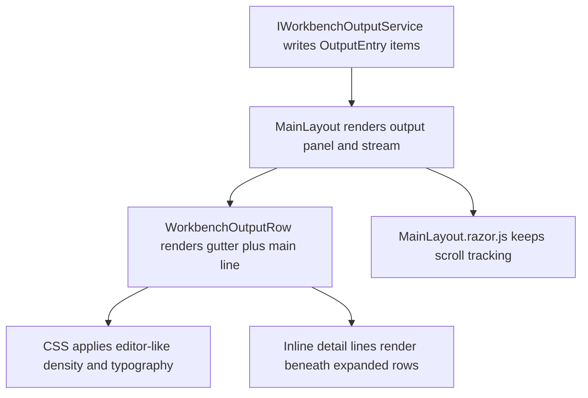

# Implementation Plan

**Target output path:** `docs/086-workbench-output/plan-workbench-output-ux-uplift_v0.01.md`

**Version:** `v0.01` (`Draft`)

**Based on:** `docs/086-workbench-output/spec-workbench-output-ux-uplift_v0.01.md`

**Related specification:** `docs/086-workbench-output/spec-workbench-output_v0.01.md`

## Project structure / approach

- Primary UI host: `src/workbench/server/WorkbenchHost`
- Shared output contracts that must remain stable for this uplift: `src/workbench/server/UKHO.Workbench/Output`
- Shared output service/state that should remain contract-compatible: `src/workbench/server/UKHO.Workbench.Services/Output`
- Rendering test project: `test/workbench/server/WorkbenchHost.Tests`
- This work package is a rendering-layer refinement of the existing shell-owned output panel. It must not redesign the toolbar, change the output entry data model, or introduce Monaco.
- The implementation must stay close to the stock Radzen Material theme overall while making only the output text area feel editor-like.
- All code-writing tasks in this plan must follow `./.github/instructions/documentation-pass.instructions.md` in full. This is a mandatory Definition of Done gate, not optional polish. Every class, method, constructor, public parameter, non-obvious property, and non-trivial logic path touched by implementation must be fully documented to that standard.
- This work should remain a vertical slice inside the existing host/UI layer. The expected dependency direction does not change: `WorkbenchHost` consumes `UKHO.Workbench` and `UKHO.Workbench.Services`; no new host-to-infrastructure shortcuts are needed.

## Output Text Area UX Uplift

- [x] Work Item 1: Deliver a dense read-only editor-like output surface while preserving the current line content model - Completed
  - Summary: Reworked the `WorkbenchHost` output stream toward an editor-like text surface, removed row-level copy plumbing and clipboard interop, tightened output-only density styling, and added focused rendering coverage in `MainLayoutRenderingTests.cs` and `WorkbenchOutputRowRenderingTests.cs`.
  - **Purpose**: Convert the current list-like output text area into a compact, selectable, editor-like surface without changing the toolbar scope, output-entry contracts, or collapsed line content format.
  - **Acceptance Criteria**:
    - The visible output text area uses an editor-like monospace stack headed by `Consolas` with denser row height, tighter vertical spacing, and stable scanning for long sessions.
    - The collapsed row continues to display the current timestamp, source, and summary content in the existing format.
    - The output surface supports normal text selection semantics across the visible output text area.
    - The visible in-row copy affordance is removed so the text area relies on normal clipboard selection behaviour.
    - Existing output toolbar actions remain present and unchanged in scope.
  - **Definition of Done**:
    - Code implemented in the existing `WorkbenchHost` output rendering path only.
    - `./.github/instructions/documentation-pass.instructions.md` followed in full for every touched file and member.
    - Logging and error handling remain correct after removing obsolete text-area copy pathways.
    - Rendering tests updated or added for density, preserved content format, and removal of visible copy chrome.
    - Can execute end-to-end via: launch `WorkbenchHost`, open the `Output` panel from the status bar, and verify the root Workbench page renders the denser editor-like surface with selectable text.
  - [x] Task 1.1: Rework the output text-area structure so the stream reads as a read-only editor surface rather than an interactive list - Completed
    - Summary: Added a stable editor-like output-surface contract in `MainLayout.razor`, simplified `WorkbenchOutputRow` markup around text-first rendering, and preserved the visible timestamp/source/summary ordering.
    - [x] Step 1: Review `MainLayout` and `WorkbenchOutputRow` responsibilities and keep the uplift inside the existing Blazor host composition.
    - [x] Step 2: Update the output stream and row markup so the text-area semantics focus on text scanning and selection rather than row-command chrome.
    - [x] Step 3: Preserve the current displayed timestamp/source/summary content ordering while preparing the markup for tighter editor-style spacing.
    - [x] Step 4: Apply `./.github/instructions/documentation-pass.instructions.md` to all touched `.razor`, `.razor.cs`, and supporting files.
  - [x] Task 1.2: Apply the editor-like typography, density, and selection styling to the text area only - Completed
    - Summary: Tightened output-only spacing and typography in `MainLayout.razor.css`, kept the broader shell on the existing Radzen baseline, and made wrapped plus non-wrapped output rows selection-friendly.
    - [x] Step 1: Tighten `MainLayout.razor.css` output-stream, row, and summary styling to achieve true single-line editor density.
    - [x] Step 2: Keep the host close to the Radzen Material baseline outside the output text area.
    - [x] Step 3: Ensure wrapped and non-wrapped modes both remain readable and selection-friendly.
    - [x] Step 4: Remove styling that makes rows feel card-like, pill-like, or button-heavy.
  - [x] Task 1.3: Remove obsolete in-row copy plumbing from the output text area without changing toolbar scope - Completed
    - Summary: Removed the row-level copy action from `WorkbenchOutputRow`, deleted clipboard-only helper code from `MainLayout.razor.cs` and `MainLayout.razor.js`, preserved scroll interop, and refreshed the affected member documentation.
    - [x] Step 1: Remove the visible row-level copy action from `WorkbenchOutputRow`.
    - [x] Step 2: Remove or simplify any no-longer-needed callback, clipboard helper, and browser interop that existed only to support the row-level copy button.
    - [x] Step 3: Keep output scrolling interop intact.
    - [x] Step 4: Update comments and member documentation so the new text-selection-first interaction model is explicit.
  - **Files**:
    - `src/workbench/server/WorkbenchHost/Components/Layout/MainLayout.razor`: keep toolbar scope stable while refining output stream markup as needed.
    - `src/workbench/server/WorkbenchHost/Components/Layout/MainLayout.razor.cs`: remove obsolete copy-path logic if no longer required and preserve output-panel state handling.
    - `src/workbench/server/WorkbenchHost/Components/Layout/MainLayout.razor.css`: introduce dense editor-like typography, spacing, and selection-friendly output-surface styling.
    - `src/workbench/server/WorkbenchHost/Components/Layout/MainLayout.razor.js`: retain scroll support and remove clipboard-specific interop if it becomes dead code.
    - `src/workbench/server/WorkbenchHost/Components/Layout/WorkbenchOutputRow.razor`: simplify row chrome for the read-only-editor baseline.
    - `src/workbench/server/WorkbenchHost/Components/Layout/WorkbenchOutputRow.razor.cs`: keep row behaviour minimal and well-documented after the copy-action removal.
    - `test/workbench/server/WorkbenchHost.Tests/MainLayoutRenderingTests.cs`: update assertions for removed row-copy chrome and preserved content format.
    - `test/workbench/server/WorkbenchHost.Tests/WorkbenchOutputRowRenderingTests.cs`: add focused row rendering coverage if a new dedicated test file is the smallest clear option.
  - **Work Item Dependencies**: Existing output panel implementation in `docs/086-workbench-output/spec-workbench-output_v0.01.md`; no new dependencies.
  - **Run / Verification Instructions**:
    - `dotnet build src/workbench/server/WorkbenchHost/WorkbenchHost.csproj`
    - `dotnet test test/workbench/server/WorkbenchHost.Tests/WorkbenchHost.Tests.csproj --filter "MainLayoutRenderingTests|WorkbenchOutputRowRenderingTests"`
    - Launch `WorkbenchHost` from Visual Studio or run `dotnet run --project src/workbench/server/WorkbenchHost/WorkbenchHost.csproj`, open `/`, then open the `Output` panel from the status bar and verify text can be selected directly in the output surface.
  - **User Instructions**: No manual setup beyond launching the existing `WorkbenchHost` application.

- [x] Work Item 2: Add chrome-less folding, inline detail lines, and a subtle editor-style gutter - Completed
  - Summary: Refactored `WorkbenchOutputRow` around a minimal gutter plus text layout, introduced chrome-less fold triangles with inline detail-line projection and subtle severity markers, refreshed output-surface styling in `MainLayout.razor.css`, and extended `MainLayoutRenderingTests.cs` plus `WorkbenchOutputRowRenderingTests.cs` to cover foldable and non-foldable rows.
  - **Purpose**: Preserve the existing summary/detail mental model while making expansion feel like editor folding instead of button-driven list-row interaction.
  - **Acceptance Criteria**:
    - Entries with details show a compact fold triangle in the left gutter; entries without details do not render the fold affordance.
    - The fold affordance does not visually read as a button: no visible button chrome, oversized padding, or card-like hover treatment.
    - Expanded details render inline as indented text lines directly beneath the main line.
    - Multiple output entries can remain expanded at the same time.
    - A subtle severity gutter marker is rendered without changing the displayed text format.
    - Clicking ordinary text does not trigger row-wide expansion.
  - **Definition of Done**:
    - Row markup and styling updated to model a minimal gutter plus content text area.
    - `./.github/instructions/documentation-pass.instructions.md` followed in full for every touched file and member.
    - Expansion behaviour remains parent-owned through the existing shell state model.
    - Rendering tests cover fold-affordance presence, inline detail rendering, gutter severity markers, and simultaneous expanded rows.
    - Can execute end-to-end via: launch `WorkbenchHost`, open `Output`, expand several foldable entries, and verify details render inline beneath their main lines without row-wide click activation.
  - [x] Task 2.1: Refactor row markup around a minimal gutter + text layout - Completed
    - Summary: Reworked `WorkbenchOutputRow.razor` to separate the fold gutter, severity cue, and summary text, preserved the timestamp/source/summary order, and removed redundant fold chrome for flat rows.
    - [x] Step 1: Replace the current button-like disclosure presentation with markup that can render as a compact editor-style disclosure triangle.
    - [x] Step 2: Reserve gutter space only for the fold affordance and subtle severity marker.
    - [x] Step 3: Keep the current collapsed header-line content format unchanged.
    - [x] Step 4: Ensure entries without details do not show redundant fold chrome.
    - [x] Step 5: Apply the mandatory documentation pass standard to the revised component structure and methods.
  - [x] Task 2.2: Render expanded details as inline editor-like text lines - Completed
    - Summary: Added inline detail-line projection plus event-code text rendering in `WorkbenchOutputRow.razor.cs` and `WorkbenchOutputRow.razor`, keeping expanded content indented beneath the main line in both wrap modes.
    - [x] Step 1: Split or project detail content into inline rendered lines that remain visually subordinate to the main line.
    - [x] Step 2: Keep expanded content indented beneath the main line rather than creating a secondary card/action area.
    - [x] Step 3: Preserve optional event code output in the expanded region while presenting it as text, not command chrome.
    - [x] Step 4: Ensure details remain selectable in both wrapped and non-wrapped modes.
  - [x] Task 2.3: Update styling so folding and severity cues feel editor-native - Completed
    - Summary: Tightened `MainLayout.razor.css` so the disclosure behaves like a compact fold triangle, the severity cue reads as a subtle gutter marker, and no extra gutter chrome or line numbers were introduced.
    - [x] Step 1: Tune triangle size, cursor, alignment, and hover/focus states so the disclosure remains discoverable without reading as a button.
    - [x] Step 2: Replace the current more prominent marker treatment with a very subtle severity gutter cue.
    - [x] Step 3: Preserve contrast in light and dark themes using the existing shell theme tokens.
    - [x] Step 4: Avoid introducing line numbers or extra gutter chrome in this work package.
  - **Files**:
    - `src/workbench/server/WorkbenchHost/Components/Layout/WorkbenchOutputRow.razor`: render gutter, fold triangle, main line, and inline details.
    - `src/workbench/server/WorkbenchHost/Components/Layout/WorkbenchOutputRow.razor.cs`: keep fold-state interaction narrow, parent-owned, and fully documented.
    - `src/workbench/server/WorkbenchHost/Components/Layout/MainLayout.razor.css`: style the gutter, disclosure triangle, detail indentation, and subtle severity treatment.
    - `test/workbench/server/WorkbenchHost.Tests/MainLayoutRenderingTests.cs`: update output-panel assertions for inline details and removal of legacy chrome.
    - `test/workbench/server/WorkbenchHost.Tests/WorkbenchOutputRowRenderingTests.cs`: add targeted coverage for foldable versus non-foldable entries and gutter rendering.
  - **Work Item Dependencies**: Work Item 1.
  - **Run / Verification Instructions**:
    - `dotnet build src/workbench/server/WorkbenchHost/WorkbenchHost.csproj`
    - `dotnet test test/workbench/server/WorkbenchHost.Tests/WorkbenchHost.Tests.csproj --filter "MainLayoutRenderingTests|WorkbenchOutputRowRenderingTests"`
    - Launch `WorkbenchHost`, open `/`, open `Output`, verify entries with details show a compact triangle, expand at least two entries, and confirm both remain open with inline indented details.
  - **User Instructions**: Seed or generate output entries with details so the fold affordance can be exercised during verification.

- [x] Work Item 3: Harden wrap-mode, accessibility, and regression coverage for the editor-like output text area - Completed
  - Summary: Locked the output-surface contract in `MainLayout.razor`, refined wrap-mode, selection, and disclosure styling in `MainLayout.razor.css`, added disclosure discoverability hooks in `WorkbenchOutputRow`, and extended `MainLayoutRenderingTests.cs` plus `WorkbenchOutputRowRenderingTests.cs` to cover wrap-mode, accessibility, and final regression hooks.
  - **Purpose**: Finish the uplift by proving the output surface remains stable, readable, and selection-friendly across wrap modes and shell themes without regressing existing output-panel behaviour.
  - **Acceptance Criteria**:
    - Wrapped and non-wrapped output modes both retain the editor-like density and readable indentation model.
    - Pointer and keyboard users can discover and operate the fold affordance while ordinary text remains selection-first.
    - The output surface remains visually credible in light and dark themes.
    - Regression tests protect the preserved toolbar scope, preserved content format, and uplifted text-area contract.
  - **Definition of Done**:
    - Styling and interaction refinements completed without altering the underlying output-entry model or toolbar scope.
    - `./.github/instructions/documentation-pass.instructions.md` followed in full for every touched file and member.
    - Rendering tests cover wrap mode and final output text-area contract.
    - Manual verification completed for theme contrast, selection behaviour, and fold operation from the running Workbench shell.
    - Can execute end-to-end via: switch wrap mode and theme in the running Workbench, then verify the output text area still behaves like a read-only editor surface.
  - [x] Task 3.1: Finalise wrap-mode behaviour for the uplifted text area - Completed
    - Summary: Added final output-surface wrap, density, selection, and theme-scope contract hooks in `MainLayout.razor`, refined nowrap versus wrapped overflow behaviour in `MainLayout.razor.css`, and documented the shared wrap-mode projection in `MainLayout.razor.cs`.
    - [x] Step 1: Confirm the summary line, gutter, and detail indentation remain coherent when `Wrap` is off.
    - [x] Step 2: Confirm the same surface remains editor-like and readable when `Wrap` is on.
    - [x] Step 3: Keep horizontal scrolling behaviour intact when wrap is disabled.
    - [x] Step 4: Document any non-obvious layout logic added to preserve both modes.
  - [x] Task 3.2: Verify accessibility and keyboard/pointer affordances - Completed
    - Summary: Kept the disclosure button semantic and discoverable with explicit labels and tooltips in `WorkbenchOutputRow`, and refined output-surface cursor and focus styling in `MainLayout.razor.css` so ordinary text remains selection-first.
    - [x] Step 1: Ensure the fold control retains clear semantics and focus behaviour even after visual chrome is removed.
    - [x] Step 2: Ensure text selection is not blocked by row-level click handlers or CSS that disables selection.
    - [x] Step 3: Confirm the hover cursor appears only on the fold affordance, not on ordinary text.
  - [x] Task 3.3: Lock in regression coverage and implementation notes - Completed
    - Summary: Extended `MainLayoutRenderingTests.cs` and `WorkbenchOutputRowRenderingTests.cs` to assert the final output-surface contract, chrome-less disclosure hooks, and selection-first interaction model; no additional work-package constraints were uncovered beyond the preserved contract now captured in tests.
    - [x] Step 1: Extend rendering tests to assert the final editor-like class/attribute contract for the output text area.
    - [x] Step 2: Add or update tests for theme-safe CSS hooks only where deterministic markup assertions are possible.
    - [x] Step 3: Record final verification notes in the work package document set if implementation uncovers constraints worth preserving.
  - **Files**:
    - `src/workbench/server/WorkbenchHost/Components/Layout/MainLayout.razor.css`: final wrap-mode, focus, and theme-contrast refinements.
    - `src/workbench/server/WorkbenchHost/Components/Layout/WorkbenchOutputRow.razor`: accessibility-safe fold affordance markup refinements.
    - `src/workbench/server/WorkbenchHost/Components/Layout/WorkbenchOutputRow.razor.cs`: final interaction/documentation cleanup.
    - `test/workbench/server/WorkbenchHost.Tests/MainLayoutRenderingTests.cs`: final regression assertions for wrap mode and output-panel contract.
    - `test/workbench/server/WorkbenchHost.Tests/WorkbenchOutputRowRenderingTests.cs`: final focused row-level regression coverage.
  - **Work Item Dependencies**: Work Items 1 and 2.
  - **Run / Verification Instructions**:
    - `dotnet build src/workbench/server/WorkbenchHost/WorkbenchHost.csproj`
    - `dotnet test test/workbench/server/WorkbenchHost.Tests/WorkbenchHost.Tests.csproj --filter "MainLayoutRenderingTests|WorkbenchOutputRowRenderingTests"`
    - Launch `WorkbenchHost`, open `/`, open `Output`, toggle `Wrap`, toggle the theme, expand a foldable row, and verify density, selection, and gutter behaviour in both theme states.
  - **User Instructions**: Use the existing appearance toggle in the Workbench menu bar during manual verification.

## Summary / key considerations

- The work should stay inside the existing `WorkbenchHost` rendering layer and should treat the current output service contracts as stable.
- The safest delivery path is to first establish the dense editor-like baseline, then replace the disclosure/list chrome with a real gutter model, and finally harden wrap-mode and accessibility behaviour.
- The uplift is intentionally visual and interaction-oriented. It should not redesign the toolbar, alter output-entry contracts, or introduce Monaco.
- The largest implementation risk is accidental regression of current output-panel behaviour while removing row-command chrome. Targeted rendering tests in `WorkbenchHost.Tests` should be used to lock down the preserved contract.
- Fully commented code is mandatory throughout implementation. Compliance with `./.github/instructions/documentation-pass.instructions.md` is a hard gate for completion of every coding task in this plan.

# Architecture

## Overall Technical Approach

- Keep the Workbench output panel as a shell-owned Blazor rendering surface inside `WorkbenchHost`.
- Preserve the existing `OutputEntry`, `OutputPanelState`, and `IWorkbenchOutputService` contracts so the uplift remains a presentation-only refinement.
- Use focused markup, CSS, and minimal existing JavaScript interop to move the output text area toward a read-only editor feel without adopting Monaco in this work package.
- Keep behaviour composition simple:
  - `UKHO.Workbench` continues to define immutable output models and panel state.
  - `UKHO.Workbench.Services` continues to own the output stream and panel state transitions.
  - `WorkbenchHost` continues to own the visual shell, output text-area markup, fold affordances, and browser-side scroll behaviour.

## Frontend

- `src/workbench/server/WorkbenchHost/Components/Layout/MainLayout.razor`
  - Continues to host the output toolbar and stream container.
  - Coordinates panel visibility, wrap mode, and expansion callbacks without changing toolbar scope.
- `src/workbench/server/WorkbenchHost/Components/Layout/WorkbenchOutputRow.razor`
  - Becomes the main text-area row renderer for the editor-like experience.
  - Owns the visible gutter structure, compact fold triangle, severity cue, and inline detail rendering.
- `src/workbench/server/WorkbenchHost/Components/Layout/MainLayout.razor.css`
  - Carries the core UX uplift: `Consolas`-first typography, dense line height, subtle gutter styling, inline detail indentation, and wrap-mode refinements.
- `src/workbench/server/WorkbenchHost/Components/Layout/MainLayout.razor.js`
  - Remains limited to lightweight browser-side output viewport support such as scroll tracking and scrolling to the end.
  - Clipboard-specific interop should be removed if it is no longer required after the selection-first UX uplift.
- User flow:
  1. User opens `Output` from the status bar.
  2. The stream renders as a dense read-only editor-like text area.
  3. User selects text directly or toggles a compact fold triangle for entries with details.
  4. Details render inline beneath the main line without changing the existing content model.
  5. User can switch wrap mode and theme while the text area remains readable and stable.

## Backend

- No new backend service or persistence layer is required for this uplift.
- `src/workbench/server/UKHO.Workbench/Output/OutputEntry.cs`
  - Remains the stable immutable record for timestamp, source, summary, details, level, and event code.
- `src/workbench/server/UKHO.Workbench/Output/OutputPanelState.cs`
  - Continues to own session-level state such as visibility, wrap mode, and expanded rows.
- `src/workbench/server/UKHO.Workbench.Services/Output/WorkbenchOutputService.cs`
  - Continues to manage append-only output entries and shell-wide panel state.
- Data flow remains unchanged:
  1. Runtime code writes output entries through `IWorkbenchOutputService`.
  2. `MainLayout` observes the shared output state.
  3. `WorkbenchOutputRow` renders each entry with editor-like presentation only.
  4. Expansion and wrap changes update existing shell state rather than introducing a new data model.
