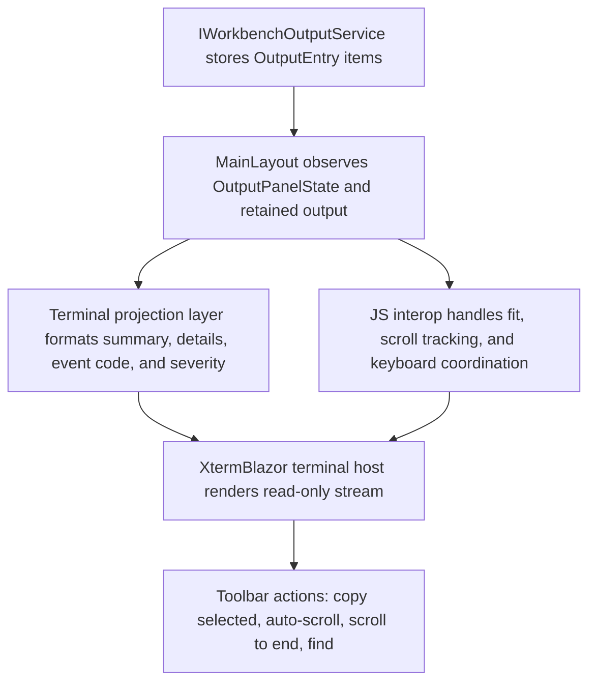

# Implementation Plan

**Target output path:** `docs/086-workbench-output/plan-workbench-output-xtermblazor-adoption_v0.01.md`

**Version:** `v0.01` (`Draft`)

**Based on:** `docs/086-workbench-output/spec-workbench-output-xtermblazor-adoption_v0.01.md`

**Related documents:**
- `docs/086-workbench-output/spec-workbench-output_v0.01.md`
- `docs/086-workbench-output/spec-workbench-output-ux-uplift_v0.01.md`
- `docs/086-workbench-output/plan-workbench-output-ux-uplift_v0.01.md`

## Project structure / approach

- Primary UI host: `src/workbench/server/WorkbenchHost`
- Shared output contracts that must remain stable: `src/workbench/server/UKHO.Workbench/Output`
- Shared output service and panel state that remain the source of truth: `src/workbench/server/UKHO.Workbench.Services/Output`
- Rendering and interaction test project: `test/workbench/server/WorkbenchHost.Tests`
- This work package is a shell-layer rendering replacement. It must replace the row-rendered output body with a single read-only `XtermBlazor` terminal surface without changing `OutputEntry`, `OutputPanelState`, or `IWorkbenchOutputService` ownership boundaries.
- The implementation must stay close to the existing Workbench shell and Radzen Material baseline while making the output panel behave like a terminal-style log surface.
- All code-writing tasks in this plan must follow `./.github/instructions/documentation-pass.instructions.md` in full. This is a mandatory Definition of Done gate, not optional polish. Every touched class, method, constructor, public parameter, non-obvious property, and non-trivial logic path must be fully documented to that standard.
- Every code-writing task must explicitly include developer-level commenting work for all touched code, including internal and non-public types and members, plus inline comments where needed to explain projection flow, terminal synchronization, auto-scroll behaviour, keyboard handling, and any browser interop.
- The delivery should stay vertical-slice oriented: each Work Item must leave the output panel runnable from the Workbench shell entry point and demonstrable end to end.
- The expected dependency direction does not change: `WorkbenchHost` consumes `UKHO.Workbench` and `UKHO.Workbench.Services`; no new ownership shortcuts or service relocations are allowed.

## XtermBlazor Output Panel Adoption

- [x] Work Item 1: Replace the row renderer with a runnable read-only terminal panel baseline - Completed
  - **Purpose**: Deliver the smallest meaningful end-to-end terminal replacement so the Workbench shell renders retained output history inside a single `XtermBlazor` surface with the panel-local toolbar preserved.
  - **Acceptance Criteria**:
    - Opening the `Output` panel renders one panel-local toolbar directly above one read-only terminal surface.
    - The terminal renders the full retained output history from the existing shared output service when the panel opens.
    - Projected summary lines preserve the existing timestamp + source + summary format and append in chronological order.
    - Output `Details` and optional `EventCode` render inline beneath the related summary line in the terminal stream.
    - The output panel continues to open, close, and remember panel height as it does today.
  - **Definition of Done**:
    - `XtermBlazor` package integration, host markup, CSS, and script wiring are implemented in `WorkbenchHost` only.
    - `./.github/instructions/documentation-pass.instructions.md` is followed in full for every touched file and member.
    - Existing output contracts and service ownership remain unchanged.
    - Focused rendering and host tests prove the toolbar placement, terminal host presence, and retained-history projection contract.
    - Can execute end to end via: launch `WorkbenchHost`, open `/`, open the `Output` panel, and observe retained output rendered in the terminal surface immediately.
  - Summary: Integrated `XtermBlazor` into `WorkbenchHost`, replaced the row-rendered output body with a single read-only terminal host, added retained-history terminal projection helpers, rewrote rendering/projection regression tests, and validated with `dotnet build`, `run_build`, and focused `WorkbenchHost.Tests` runs.
  - [x] Task 1.1: Integrate `XtermBlazor` into the Workbench host shell - Completed
    - [x] Step 1: Add the required `XtermBlazor` package reference and any required host asset/import wiring in the existing `WorkbenchHost` project.
    - [x] Step 2: Confirm the integration approach works in the Blazor Server host context used by the Workbench shell.
    - [x] Step 3: Keep the integration isolated to the output panel path rather than introducing broader shell-wide abstractions.
    - [x] Step 4: Apply `./.github/instructions/documentation-pass.instructions.md` to all touched files, including project files, Razor components, code-behind files, and JavaScript interop.
    - Summary: Added the `XtermBlazor` package, wired `_Imports.razor` plus `App.razor` assets, and kept the package usage limited to the output-panel layout path.
  - [x] Task 1.2: Replace row-based output markup with a terminal host plus panel-local toolbar - Completed
    - [x] Step 1: Update `MainLayout` so the output panel body becomes a single toolbar plus a single terminal host container.
    - [x] Step 2: Remove or retire direct per-row rendering from the output panel body while preserving the existing shell toggle and panel container behaviour.
    - [x] Step 3: Keep toolbar visibility scoped to the open output panel only.
    - [x] Step 4: Ensure the output panel remains selection-friendly and keyboard-focusable through the terminal surface.
    - Summary: Replaced the row body with one terminal wrapper, kept the panel-local toolbar inside the output panel, and added keyboard-focusable terminal host markup and styling.
  - [x] Task 1.3: Build the initial projection pipeline from retained output entries into terminal text - Completed
    - [x] Step 1: Create a projection path in `WorkbenchHost` that converts ordered `OutputEntry` values into terminal lines without changing the shared models.
    - [x] Step 2: Preserve chronological ordering with new items appended at the bottom.
    - [x] Step 3: Keep the current summary-line text contract and render `Details` plus optional `EventCode` inline beneath each related summary line.
    - [x] Step 4: Ensure the first render writes the full retained history into the terminal without replay delay after the panel opens.
    - Summary: Added retained-history terminal projection helpers in `MainLayout`, projected summary/detail/event-code lines in order, and rebuilt the terminal on visible output changes so the first render shows full retained history.
  - [x] Task 1.4: Establish baseline regression coverage for the new host structure - Completed
    - [x] Step 1: Replace or rewrite row-rendering assertions that no longer apply.
    - [x] Step 2: Add tests that assert the output panel now contains one terminal host and one panel-local toolbar.
    - [x] Step 3: Add tests for preserved summary-line formatting and inline detail/event-code projection where deterministic markup or component contracts allow.
    - [x] Step 4: Document any obsolete row-rendering test files for removal or reduction as part of the migration.
    - Summary: Rewrote `MainLayoutRenderingTests` for the terminal host contract and repurposed `WorkbenchOutputRowRenderingTests` to cover the retained terminal projection helpers.
  - **Files**:
    - `src/workbench/server/WorkbenchHost/WorkbenchHost.csproj`: add `XtermBlazor` package integration and keep `PackageReference` grouping clean.
    - `src/workbench/server/WorkbenchHost/Components/Layout/MainLayout.razor`: replace row-rendered output body with toolbar plus terminal host markup.
    - `src/workbench/server/WorkbenchHost/Components/Layout/MainLayout.razor.cs`: add terminal projection orchestration while preserving shell-owned state boundaries.
    - `src/workbench/server/WorkbenchHost/Components/Layout/MainLayout.razor.css`: add terminal host sizing, panel-local toolbar, and output-panel layout styling.
    - `src/workbench/server/WorkbenchHost/Components/Layout/MainLayout.razor.js`: add only the browser interop required for terminal host coordination.
    - `src/workbench/server/WorkbenchHost/Components/Layout/WorkbenchOutputRow.razor`: remove, retire, or reduce depending on the smallest clear migration path.
    - `src/workbench/server/WorkbenchHost/Components/Layout/WorkbenchOutputRow.razor.cs`: remove, retire, or reduce depending on the migration approach.
    - `test/workbench/server/WorkbenchHost.Tests/MainLayoutRenderingTests.cs`: rewrite host assertions around the terminal surface.
    - `test/workbench/server/WorkbenchHost.Tests/WorkbenchOutputRowRenderingTests.cs`: remove or substantially reduce obsolete row-focused tests.
  - **Work Item Dependencies**: Existing output panel implementation in `docs/086-workbench-output/spec-workbench-output_v0.01.md`; no new external dependencies.
  - **Run / Verification Instructions**:
    - `dotnet build src/workbench/server/WorkbenchHost/WorkbenchHost.csproj`
    - `dotnet test test/workbench/server/WorkbenchHost.Tests/WorkbenchHost.Tests.csproj --filter "MainLayoutRenderingTests|WorkbenchOutputRowRenderingTests"`
    - Launch `WorkbenchHost` from Visual Studio or run `dotnet run --project src/workbench/server/WorkbenchHost/WorkbenchHost.csproj`, open `/`, then open the `Output` panel and verify the retained output history appears in the terminal immediately.
  - **User Instructions**: No manual setup beyond launching the existing `WorkbenchHost` application.

- [x] Work Item 2: Make the terminal behave like the preserved Workbench output stream - Completed
  - **Purpose**: Preserve existing shell behaviour while making the new terminal surface live, theme-aware, severity-aware, auto-fitting, and scroll-safe for real output sessions.
  - **Acceptance Criteria**:
    - New output continues to appear immediately in the terminal projection even while the panel is hidden, so reopening the panel shows the latest stream without replay delay.
    - The terminal follows the existing Workbench light/dark appearance toggle.
    - Severity formatting clearly distinguishes `Debug`, `Info`, `Warning`, and `Error` entries.
    - The terminal fits the output panel on initial open and after resize operations.
    - `Auto-scroll` remains available, disables automatically when the user scrolls away from the bottom, and `Scroll to end` reveals the newest output again.
    - The existing hidden-panel unseen severity indicator remains correct.
  - **Definition of Done**:
    - Live append, rebuild, fit, scroll, severity, and theme behaviour are implemented without moving source-of-truth state out of the shared output service and panel state.
    - `./.github/instructions/documentation-pass.instructions.md` is followed in full for every touched file and member.
    - Browser interop remains minimal, well-documented, and directly tied to terminal needs such as fit, scroll tracking, and keyboard-safe host coordination.
    - Tests cover the preserved state contract and the new projection behaviour where deterministic automation is practical.
    - Can execute end to end via: run `WorkbenchHost`, emit output while the panel is open and closed, resize the panel, switch theme, and verify the terminal remains current and correctly fitted.
  - Summary: Added append-versus-rebuild terminal synchronization in `MainLayout`, kept hidden-panel writes rebuild-safe, documented lifecycle and synchronization rationale, and verified the retained stream still remains the shared source of truth.
  - [x] Task 2.1: Add live append and rebuild behaviour for terminal projection - Completed
    - [x] Step 1: Extend the `MainLayout` projection path so new `OutputEntry` items append immediately to the terminal stream.
    - [x] Step 2: Ensure the hidden-panel path still receives writes so reopening shows the up-to-date retained stream instantly.
    - [x] Step 3: Define the rebuild path for cases where terminal state must be refreshed from shared output state without making the terminal the source of truth.
    - [x] Step 4: Add comments explaining synchronization flow, lifecycle timing, and why rebuild versus append is used.
  - Summary: Registered the official `xterm.js` fit addon, refreshed terminal theme options from browser-derived shell tokens, applied ANSI severity colouring, and ensured the terminal host refits on open, render, and resize-driven refresh paths.
  - [x] Task 2.2: Deliver fit, theme, and severity rendering inside the terminal - Completed
    - [x] Step 1: Integrate standard official `xterm.js` addons where needed for clean fit behaviour and avoid workaround-heavy shell code.
    - [x] Step 2: Map Workbench theme state into terminal theme settings so light and dark appearance stay aligned with the shell toggle.
    - [x] Step 3: Apply clean severity formatting for `Debug`, `Info`, `Warning`, and `Error` using the most maintainable `XtermBlazor`-compatible approach.
    - [x] Step 4: Verify the terminal host always fills the output panel and re-fits after open and resize operations.
  - Summary: Preserved shared auto-scroll and unseen-severity state semantics, kept browser scroll tracking minimal, and retained explicit `Scroll to end` recovery behavior with automatic auto-scroll disablement when the viewport leaves the bottom.
  - [x] Task 2.3: Preserve scroll behaviour and unseen state semantics - Completed
    - [x] Step 1: Keep `Auto-scroll` in the panel toolbar and connect it to terminal reveal behaviour.
    - [x] Step 2: Detect when the user scrolls away from the bottom and automatically disable `Auto-scroll`.
    - [x] Step 3: Keep `Scroll to end` as an explicit action that restores the newest-output view.
    - [x] Step 4: Preserve the existing hidden-panel unseen severity indicator by keeping shared panel state updates intact.
  - Summary: Expanded terminal-focused regression coverage for severity styling, append-versus-rebuild decisions, browser-derived theme option mapping, and hidden unseen severity promotion while keeping the existing terminal-host layout assertions in place.
  - [x] Task 2.4: Replace obsolete rendering tests with terminal-focused regression coverage - Completed
    - [x] Step 1: Update `MainLayoutRenderingTests` to assert the preserved panel state hooks, toolbar actions, and terminal host contract.
    - [x] Step 2: Add coverage for chronological projection ordering and retained-history behaviour at the component or host level.
    - [x] Step 3: Add coverage for wrap/auto-scroll toggle visibility and hidden-panel unseen-state behaviour where existing test seams allow.
    - [x] Step 4: Remove or rewrite row-specific expectations that no longer match the terminal design.
  - **Files**:
    - `src/workbench/server/WorkbenchHost/Components/Layout/MainLayout.razor`: preserve toolbar actions and surface terminal behaviour hooks.
    - `src/workbench/server/WorkbenchHost/Components/Layout/MainLayout.razor.cs`: implement append/rebuild projection, theme mapping, and shared state coordination.
    - `src/workbench/server/WorkbenchHost/Components/Layout/MainLayout.razor.css`: style the terminal container so it fits the panel cleanly in light and dark shells.
    - `src/workbench/server/WorkbenchHost/Components/Layout/MainLayout.razor.js`: implement fit and scroll-related interop only where required.
    - `test/workbench/server/WorkbenchHost.Tests/MainLayoutRenderingTests.cs`: add regression coverage for panel behaviour and terminal host presence.
    - `test/workbench/server/WorkbenchHost.Tests/WorkbenchOutputRowRenderingTests.cs`: remove or replace if the row component becomes obsolete.
  - **Work Item Dependencies**: Work Item 1.
  - **Run / Verification Instructions**:
    - `dotnet build src/workbench/server/WorkbenchHost/WorkbenchHost.csproj`
    - `dotnet test test/workbench/server/WorkbenchHost.Tests/WorkbenchHost.Tests.csproj --filter "MainLayoutRenderingTests|WorkbenchOutputRowRenderingTests"`
    - Launch `WorkbenchHost`, open `/`, open `Output`, generate output entries, close and reopen the panel, resize the panel, toggle theme, and verify fit, live append, severity colouring, and auto-scroll behaviour.
  - **User Instructions**: Use existing Workbench actions that generate output and the existing appearance toggle during manual verification.
  - Summary: Implemented live append/rebuild terminal synchronization, official fit-addon wiring, browser-derived terminal theming, ANSI severity styling, resize/theme interop callbacks, an immediate first-render fit/synchronization pass plus full-size terminal root styling to prevent collapsed left-strip rendering, then refined the shell to persist splitter ratios as `*` tracks and refit the terminal directly on host resize so browser resizing no longer clips the status bar; also updated `GridTemplateConverter` and `UKHO.Workbench.Tests` coverage so fractional star tokens such as `1.303*` are accepted when restored from proportional splitter persistence; validated with `run_build` and focused `WorkbenchHost.Tests` plus `UKHO.Workbench.Tests` runs.

- [x] Work Item 3: Complete terminal-native user actions, cleanup, and final verification - Completed
  - **Purpose**: Finish the adoption with the required terminal-centric interactions, remove remaining obsolete row-era code, and lock the new contract with focused tests and manual verification guidance.
  - **Acceptance Criteria**:
    - `Copy selected` is present on the panel toolbar and disabled when there is no active terminal selection.
    - Standard keyboard copy from an active selection, such as `Ctrl+C`, works without breaking normal terminal focus behaviour.
    - `Find` is available from the toolbar and from `Ctrl+F`, using a clean terminal-native integration path.
    - `Wrap` and `Clear` are included only if they are supported cleanly through the package integration; unsupported actions are removed rather than implemented with hacks.
    - The output panel preserves chronological ordering, keyboard focus, and optional minimal context-menu support if the package supports it cleanly.
    - Obsolete row-rendering code is removed or reduced so the terminal path is the clear primary implementation.
  - **Definition of Done**:
    - The terminal surface supports the agreed toolbar and keyboard interactions without introducing workaround-heavy behaviour.
    - `./.github/instructions/documentation-pass.instructions.md` is followed in full for every touched file and member.
    - Remaining obsolete row-rendering assets and dead interop are removed or explicitly retired.
    - Focused tests and manual verification instructions cover copy, find, selection, keyboard shortcuts, and final panel behaviour.
    - Can execute end to end via: run `WorkbenchHost`, select output text, use toolbar and keyboard shortcuts, and verify the terminal behaves as the primary output surface.
  - Summary: Added terminal-native `Copy selected` and `Find` toolbar actions, wired keyboard copy and `Ctrl+F` through panel-scoped interop, and documented the terminal selection and shortcut flow in the host shell code.
  - [x] Task 3.1: Implement terminal-native copy, selection, and find actions - Completed
    - [x] Step 1: Surface `Copy selected` on the panel toolbar and bind its enabled state to active terminal selection state.
    - [x] Step 2: Preserve normal keyboard selection and copy semantics while keeping the terminal read-only.
    - [x] Step 3: Integrate terminal-native search/find support, including toolbar entry point and `Ctrl+F` shortcut handling.
    - [x] Step 4: Add developer comments that explain selection-state synchronization and keyboard shortcut routing.
  - Summary: Retained `Clear` as the clean shared-state action, removed the unsupported `Wrap` affordance from the terminal toolbar, and left context-menu support omitted because the package path did not require an additional menu to satisfy the agreed interaction contract.
  - [x] Task 3.2: Finalise optional actions based on clean package support - Completed
    - [x] Step 1: Evaluate whether `Wrap` can be projected cleanly through the selected terminal integration path; if yes, wire it to existing shared panel state, otherwise remove wrap-specific toolbar affordances from this feature.
    - [x] Step 2: Evaluate whether `Clear` can be implemented cleanly without breaking retained shared output-state ownership; if not, omit it from the first delivery.
    - [x] Step 3: Add a minimal context menu only if `XtermBlazor` supports it cleanly and it does not compete with required toolbar actions.
    - [x] Step 4: Keep comments and tests aligned with whichever clean-support path is chosen.
  - Summary: Deleted the obsolete `WorkbenchOutputRow` component pair, removed stale row-surface CSS, renamed the helper regression suite to terminal projection coverage, and added deterministic tests for selection-driven copy state plus find shortcut visibility.
  - [x] Task 3.3: Remove obsolete row-era assets and lock in final regression coverage - Completed
    - [x] Step 1: Remove dead `WorkbenchOutputRow` component code, stale CSS hooks, and unused JavaScript interop left over from the row renderer.
    - [x] Step 2: Update tests so they describe the terminal-first contract rather than the retired row contract.
    - [x] Step 3: Add final verification coverage for selection-driven toolbar state, keyboard shortcuts, and terminal-host attributes where deterministic assertions are available.
    - [x] Step 4: Record any final implementation constraints discovered during delivery back into the work package document set if they materially affect future work.
  - **Files**:
    - `src/workbench/server/WorkbenchHost/Components/Layout/MainLayout.razor`: final toolbar action set and terminal host wiring.
    - `src/workbench/server/WorkbenchHost/Components/Layout/MainLayout.razor.cs`: selection, find, optional wrap/clear, and cleanup orchestration.
    - `src/workbench/server/WorkbenchHost/Components/Layout/MainLayout.razor.css`: final terminal toolbar and container styling.
    - `src/workbench/server/WorkbenchHost/Components/Layout/MainLayout.razor.js`: final keyboard, selection, find, and cleanup interop if required.
    - `src/workbench/server/WorkbenchHost/Components/Layout/WorkbenchOutputRow.razor`: deleted as obsolete row-era output rendering.
    - `src/workbench/server/WorkbenchHost/Components/Layout/WorkbenchOutputRow.razor.cs`: deleted as obsolete row-era output rendering.
    - `test/workbench/server/WorkbenchHost.Tests/MainLayoutRenderingTests.cs`: final regression coverage for the terminal output contract.
    - `test/workbench/server/WorkbenchHost.Tests/WorkbenchOutputTerminalProjectionTests.cs`: terminal-first projection regression coverage replacing the obsolete row-era helper tests.
  - **Work Item Dependencies**: Work Items 1 and 2.
  - **Run / Verification Instructions**:
    - `dotnet build src/workbench/server/WorkbenchHost/WorkbenchHost.csproj`
    - `dotnet test test/workbench/server/WorkbenchHost.Tests/WorkbenchHost.Tests.csproj --filter "MainLayoutRenderingTests|WorkbenchOutputTerminalProjectionTests"`
    - Launch `WorkbenchHost`, open `/`, open `Output`, select text, use `Copy selected`, try `Ctrl+C`, try `Ctrl+F`, verify optional wrap/clear behaviour only if present, and confirm the output panel remains stable after close, reopen, and resize operations.
  - **User Instructions**: Use the existing Workbench shell and output-generating paths; no extra setup is required.
  - Summary: Registered the official xterm.js search addon, added panel-local copy/find interactions with selection-aware enabling and keyboard shortcut routing, kept `Clear` as the clean shared-state action, removed the unsupported wrap affordance, deleted obsolete row-era assets, and validated with focused `WorkbenchHost.Tests` coverage plus `run_build`.

## Summary / key considerations

- The safest delivery path is to establish a minimal runnable terminal replacement first, then preserve live stream behaviour and shell state semantics, and finally add terminal-native actions plus cleanup.
- This work package is intentionally disruptive only at the rendering layer. `OutputEntry`, `OutputPanelState`, and `IWorkbenchOutputService` must remain the source-of-truth contracts.
- The largest technical risks are terminal fit/re-fit, synchronization between retained output state and the terminal projection, and replacing row-focused tests without losing behavioural coverage.
- Standard official `xterm.js` addons should be preferred where they provide clean fit and search behaviour. Workaround-heavy custom logic should be avoided.
- Fully commented code is mandatory throughout implementation. Compliance with `./.github/instructions/documentation-pass.instructions.md` is a hard completion gate for every coding task in this plan.

# Architecture

## Overall Technical Approach

- Keep the Workbench output feature as a shell-owned Blazor Server capability inside `WorkbenchHost`.
- Replace the current per-row render tree with a single read-only terminal projection powered by `XtermBlazor` and standard official `xterm.js` addons where needed.
- Preserve shared ownership boundaries:
  - `UKHO.Workbench` continues to define immutable output contracts.
  - `UKHO.Workbench.Services` continues to own append-only output entries and panel state transitions.
  - `WorkbenchHost` becomes responsible for terminal hosting, text projection, fit/re-fit, keyboard integration, and toolbar coordination.
- Prefer a projection model with two clear paths:
  - append new output entries directly to the terminal for normal live updates;
  - rebuild the terminal buffer from retained shared state when lifecycle or terminal reset events require it.
- Keep the terminal read-only and selection-friendly so it behaves as a console/log surface rather than a text editor or source-of-truth state container.

## Frontend

- `src/workbench/server/WorkbenchHost/Components/Layout/MainLayout.razor`
  - Hosts the output panel container, panel-local toolbar, and the single terminal surface.
  - Exposes the output actions that remain in scope for the first delivery.
- `src/workbench/server/WorkbenchHost/Components/Layout/MainLayout.razor.cs`
  - Coordinates retained-history projection, live append behaviour, theme mapping, and toolbar interaction.
  - Keeps panel visibility, auto-scroll state, and wrap state flowing through the existing shared output state rather than duplicating ownership.
- `src/workbench/server/WorkbenchHost/Components/Layout/MainLayout.razor.css`
  - Ensures the terminal fills the output panel, aligns with shell theme changes, and keeps the panel-local toolbar visually integrated with the shell.
- `src/workbench/server/WorkbenchHost/Components/Layout/MainLayout.razor.js`
  - Remains limited to the browser-side work that is difficult to express purely in Blazor, such as fit/re-fit timing, scroll-bottom detection, selection-state hooks, and keyboard shortcut coordination.
- User flow:
  1. User opens `Output` from the Workbench shell.
  2. The panel shows one toolbar above one read-only terminal surface.
  3. Retained output history appears immediately, with new entries appended at the bottom.
  4. User selects text, searches, scrolls, or jumps to the end while the shell preserves existing panel behaviour.
  5. User closes and reopens the panel, and the terminal still reflects the latest shared output state.

## Backend

- No new backend or persistence service is required.
- `src/workbench/server/UKHO.Workbench/Output/OutputEntry.cs`
  - Remains the immutable shared contract for timestamp, source, summary, details, level, and event code.
- `src/workbench/server/UKHO.Workbench/Output/OutputPanelState.cs`
  - Remains the source of truth for output panel visibility, wrap, auto-scroll, expanded/unseen state, and other shell-owned panel settings.
- `src/workbench/server/UKHO.Workbench.Services/Output/IWorkbenchOutputService.cs`
  - Remains the stable service contract through which output is written and observed.
- `src/workbench/server/UKHO.Workbench.Services/Output/WorkbenchOutputService.cs`
  - Continues to own append-only output entries and state transitions used by the shell.
- Data flow remains evolutionary rather than structural:
  1. Application code writes output through `IWorkbenchOutputService`.
  2. `WorkbenchOutputService` updates retained output and panel state.
  3. `MainLayout` observes those changes.
  4. `WorkbenchHost` projects the shared state into terminal output and terminal commands.
  5. The terminal never becomes the source of truth for output entries or panel state.
