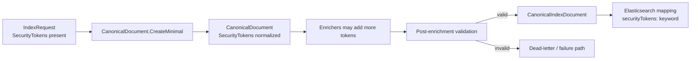

# Implementation Plan + Architecture — Work Package `091-security`

**Target output path:** `docs/091-security/plan-canonical-document-security-tokens_v0.01.md`

**Version:** `v0.01` (Draft)

**Based on:** `docs/091-security/spec-canonical-document-security-tokens_v0.01.md`

**Mandatory repository instructions for execution:**

- `./.github/instructions/documentation-pass.instructions.md` is a hard gate for every code-writing task in this plan.
- `./.github/instructions/wiki.instructions.md` is a hard gate for this full work package and for the final closure record.

---

# Implementation Plan

## Baseline

Current implemented behavior evidenced by the repository:

- `src/UKHO.Search.Ingestion/Pipeline/Documents/CanonicalDocument.cs`
  - contains normalized set-based canonical fields such as `Keywords`, taxonomy fields, and `Title`
  - does not currently expose `SecurityTokens`
- `src/UKHO.Search.Ingestion/Requests/IndexRequest.cs`
  - already requires non-empty `SecurityTokens`
  - already rejects null or blank request-token entries
- `src/UKHO.Search.Ingestion/Pipeline/Documents/CanonicalDocument.cs` `CreateMinimal(...)`
  - creates the minimal canonical document from `Id`, `Provider`, `Source`, and `Timestamp`
  - does not currently copy request security tokens into canonical state
- `src/UKHO.Search.Infrastructure.Ingestion/Elastic/CanonicalIndexDocument.cs`
  - projects canonical fields into the Elasticsearch payload
  - does not currently emit `securityTokens`
- `src/UKHO.Search.Infrastructure.Ingestion/Elastic/CanonicalIndexDefinition.cs`
  - defines canonical index mappings
  - does not currently map `securityTokens`
- `src/UKHO.Search.Ingestion/Pipeline/Nodes/ApplyEnrichmentNode.cs`
  - already rejects missing-title documents and routes them to the failure/dead-letter path
  - does not currently reject canonical documents whose normalized `SecurityTokens` set is empty
- Affected existing tests already cover nearby behavior in:
  - `test/UKHO.Search.Ingestion.Tests/Documents/CanonicalDocument*.cs`
  - `test/UKHO.Search.Ingestion.Tests/IngestionModelJsonTests.cs`
  - `test/UKHO.Search.Ingestion.Tests/Pipeline/ApplyEnrichmentNodeTests.cs`
  - `test/UKHO.Search.Infrastructure.Ingestion.Tests/Elastic/CanonicalIndexDocumentTests.cs`
  - `test/UKHO.Search.Infrastructure.Ingestion.Tests/Elastic/CanonicalIndexDefinitionTests.cs`
  - `test/UKHO.Search.Infrastructure.Ingestion.Tests/Elastic/ElasticsearchBulkIndexClientMappingValidationTests.cs`
- The minimum wiki pages already identified by the specification are:
  - `wiki/CanonicalDocument-and-Discovery-Taxonomy.md`
  - `wiki/Ingestion-Walkthrough.md`

## Delta

This work package will introduce:

- canonical `SecurityTokens` on `CanonicalDocument` as a normalized `SortedSet<string>`
- `AddSecurityToken(string)` and `AddSecurityToken(IEnumerable<string>)` following the existing canonical mutation pattern
- population of canonical security tokens during `CreateMinimal(...)` via the canonical add-method path
- Elasticsearch projection and mapping for `securityTokens` as `keyword`
- post-enrichment canonical validation that rejects missing canonical security tokens using the same failure/dead-letter path as missing title
- full alignment of all affected tests, fixtures, builders, and example payloads with the new canonical shape
- wiki updates that explain `SecurityTokens` as a mandatory exact-match security/filter field in the canonical model

## Carry-over / Deferred Items

Out of scope for this work package:

- query-side model or filter changes
- new rule-authored mutation behavior for security tokens
- new UI/Blazor features
- repository-wide full test suite execution for this work package; verification should stay targeted to affected projects and test groups per repository guidance

---

## Project Structure / Touchpoints

Primary code areas expected to change:

- Canonical model and minimal creation
  - `src/UKHO.Search.Ingestion/Pipeline/Documents/CanonicalDocument.cs`
- Pipeline validation / failure routing
  - `src/UKHO.Search.Ingestion/Pipeline/Nodes/ApplyEnrichmentNode.cs`
- Index projection and mapping
  - `src/UKHO.Search.Infrastructure.Ingestion/Elastic/CanonicalIndexDocument.cs`
  - `src/UKHO.Search.Infrastructure.Ingestion/Elastic/CanonicalIndexDefinition.cs`
- Existing request contract reference point
  - `src/UKHO.Search.Ingestion/Requests/IndexRequest.cs`
- Developer guidance
  - `wiki/CanonicalDocument-and-Discovery-Taxonomy.md`
  - `wiki/Ingestion-Walkthrough.md`

Primary existing test areas that must be brought to the new shape where affected:

- Canonical document tests
  - `test/UKHO.Search.Ingestion.Tests/Documents/CanonicalDocumentBuilderTests.cs`
  - `test/UKHO.Search.Ingestion.Tests/Documents/CanonicalDocumentContentTests.cs`
  - `test/UKHO.Search.Ingestion.Tests/Documents/CanonicalDocumentGeoPolygonsTests.cs`
  - `test/UKHO.Search.Ingestion.Tests/Documents/CanonicalDocumentJsonRoundTripTests.cs`
  - `test/UKHO.Search.Ingestion.Tests/Documents/CanonicalDocumentKeywordsTests.cs`
  - `test/UKHO.Search.Ingestion.Tests/Documents/CanonicalDocumentProviderTests.cs`
  - `test/UKHO.Search.Ingestion.Tests/Documents/CanonicalDocumentSearchTextTests.cs`
  - `test/UKHO.Search.Ingestion.Tests/Documents/CanonicalDocumentTaxonomyFieldsTests.cs`
  - `test/UKHO.Search.Ingestion.Tests/Pipeline/Documents/CanonicalDocumentTitleTests.cs`
- Request JSON / contract tests
  - `test/UKHO.Search.Ingestion.Tests/IngestionModelJsonTests.cs`
- Pipeline validation tests
  - `test/UKHO.Search.Ingestion.Tests/Pipeline/ApplyEnrichmentNodeTests.cs`
- Index projection / mapping tests
  - `test/UKHO.Search.Infrastructure.Ingestion.Tests/Elastic/CanonicalIndexDocumentTests.cs`
  - `test/UKHO.Search.Infrastructure.Ingestion.Tests/Elastic/CanonicalIndexDefinitionTests.cs`
  - `test/UKHO.Search.Infrastructure.Ingestion.Tests/Elastic/ElasticsearchBulkIndexClientMappingValidationTests.cs`

---

## Slice 1: Minimal index request produces canonical and index-facing security tokens end to end

- [x] Work Item 1: Add canonical `SecurityTokens` and project them to the Elasticsearch payload - Completed
  - **Purpose**: Deliver the first runnable vertical slice where an `IndexRequest` with security tokens becomes a canonical document with normalized `SecurityTokens`, and that canonical state reaches the index payload and mapping.
  - **Acceptance Criteria**:
    - `CanonicalDocument` exposes `SecurityTokens` as a normalized `SortedSet<string>`.
    - `SecurityTokens` follows the same `JsonInclude`, private-set, comparer, and deterministic ordering pattern used by the other normalized set-based canonical fields.
    - `AddSecurityToken(string)` and `AddSecurityToken(IEnumerable<string>)` exist and follow the existing canonical mutation behavior, including null-collection handling.
    - `CreateMinimal(...)` copies `IndexRequest.SecurityTokens` into canonical state through the add-method path.
    - `CanonicalIndexDocument` emits `securityTokens` from the canonical document.
    - `CanonicalIndexDefinition` maps `securityTokens` as `keyword`.
  - **Definition of Done**:
    - Code implemented for canonical model, minimal creation, and index projection/mapping.
    - All code written for this slice complies with `./.github/instructions/documentation-pass.instructions.md`.
    - Developer-level comments, XML comments, method/constructor comments, parameter comments, and explanatory inline comments are added or updated wherever required by `./.github/instructions/documentation-pass.instructions.md`, including internal and non-public types.
    - Targeted affected tests pass for canonical mutation, JSON round-trip, and index mapping/projection behavior.
    - Logging and error handling remain consistent with the current ingestion and indexing flow.
    - Wiki review completed for this slice; either relevant pages are updated or a no-change result is explicitly recorded, per `./.github/instructions/wiki.instructions.md`.
    - Can execute end to end via the verification instructions below.
  - [x] Task 1: Extend the canonical document model
    - [x] Step 1: Add `SecurityTokens` to `CanonicalDocument` using the same set-based serialization and comparer pattern as the other normalized string collections.
    - [x] Step 2: Implement `AddSecurityToken(string)` with trim, invariant lowercase normalization, blank-value skipping, de-duplication, and deterministic ordering.
    - [x] Step 3: Implement `AddSecurityToken(IEnumerable<string>)` with null-collection tolerance and per-item reuse of the single-value add path.
    - [x] Step 4: Ensure `SecurityTokens` participates in JSON serialization/deserialization using the same repository pattern already used by the other set-based canonical fields.
  - [x] Task 2: Populate canonical security tokens during minimal creation
    - [x] Step 1: Update `CreateMinimal(...)` to populate `SecurityTokens` from `IndexRequest.SecurityTokens`.
    - [x] Step 2: Ensure population uses the canonical add-method path rather than direct set assignment.
    - [x] Step 3: Preserve the original request-token casing in `Source` while storing normalized lowercase values in canonical state.
  - [x] Task 3: Project and map `securityTokens`
    - [x] Step 1: Extend `CanonicalIndexDocument.Create(...)` to emit `securityTokens` from canonical state.
    - [x] Step 2: Extend `CanonicalIndexDefinition.Configure(...)` so `securityTokens` is mapped as `keyword` using the existing field-naming convention.
    - [x] Step 3: Update any mapping validation helpers or defensive mapping checks that assume the old field list.
  - [x] Task 4: Update the affected canonical and index tests for the new shape
    - [x] Step 1: Update `CanonicalDocumentJsonRoundTripTests` to assert `SecurityTokens` survives serialization and deserialization correctly.
    - [x] Step 2: Add or extend focused canonical-document tests to cover normalization, de-duplication, null handling, and deterministic ordering for `SecurityTokens`.
    - [x] Step 3: Update `CanonicalIndexDocumentTests`, `CanonicalIndexDefinitionTests`, and `ElasticsearchBulkIndexClientMappingValidationTests` so `securityTokens` is part of the expected payload and mapping shape.
    - [x] Step 4: Update affected builders, fixtures, and sample canonical payloads so the new canonical shape is the default test shape where relevant.
  - **Files**:
    - `src/UKHO.Search.Ingestion/Pipeline/Documents/CanonicalDocument.cs`: add `SecurityTokens` and mutators.
    - `src/UKHO.Search.Infrastructure.Ingestion/Elastic/CanonicalIndexDocument.cs`: emit `securityTokens`.
    - `src/UKHO.Search.Infrastructure.Ingestion/Elastic/CanonicalIndexDefinition.cs`: map `securityTokens` as `keyword`.
    - `test/UKHO.Search.Ingestion.Tests/Documents/CanonicalDocumentJsonRoundTripTests.cs`: assert canonical round-trip behavior.
    - `test/UKHO.Search.Infrastructure.Ingestion.Tests/Elastic/CanonicalIndexDocumentTests.cs`: assert projection behavior.
    - `test/UKHO.Search.Infrastructure.Ingestion.Tests/Elastic/CanonicalIndexDefinitionTests.cs`: assert mapping behavior.
    - `test/UKHO.Search.Infrastructure.Ingestion.Tests/Elastic/ElasticsearchBulkIndexClientMappingValidationTests.cs`: assert mapping validation behavior.
  - **Work Item Dependencies**: none.
  - **Run / Verification Instructions**:
    - `dotnet test test\UKHO.Search.Ingestion.Tests\UKHO.Search.Ingestion.Tests.csproj --filter "FullyQualifiedName~CanonicalDocument|FullyQualifiedName~IngestionModelJsonTests"`
    - `dotnet test test\UKHO.Search.Infrastructure.Ingestion.Tests\UKHO.Search.Infrastructure.Ingestion.Tests.csproj --filter "FullyQualifiedName~CanonicalIndex|FullyQualifiedName~ElasticsearchBulkIndexClientMappingValidationTests"`
    - Verify a representative `IndexRequest` produces lowercase canonical `SecurityTokens` and a `securityTokens` index payload field.
  - **User Instructions**:
    - None beyond running the targeted tests.
  - **Execution Summary**:
    - Added canonical `SecurityTokens` to `src/UKHO.Search.Ingestion/Pipeline/Documents/CanonicalDocument.cs`, implemented both `AddSecurityToken` overloads, and seeded normalized canonical tokens during `CreateMinimal(...)` while preserving the original request-token casing in `Source`.
    - Updated `src/UKHO.Search.Infrastructure.Ingestion/Elastic/CanonicalIndexDocument.cs`, `src/UKHO.Search.Infrastructure.Ingestion/Elastic/CanonicalIndexDefinition.cs`, and `src/UKHO.Search.Infrastructure.Ingestion/Elastic/ElasticsearchBulkIndexClient.cs` so `securityTokens` is projected and validated as an Elasticsearch `keyword` field.
    - Added and updated targeted tests in `test/UKHO.Search.Ingestion.Tests/Documents/CanonicalDocumentSecurityTokensTests.cs`, `test/UKHO.Search.Ingestion.Tests/Documents/CanonicalDocumentJsonRoundTripTests.cs`, `test/UKHO.Search.Ingestion.Tests/Documents/CanonicalDocumentBuilderTests.cs`, `test/UKHO.Search.Ingestion.Tests/Documents/CanonicalDocumentProviderTests.cs`, `test/UKHO.Search.Infrastructure.Ingestion.Tests/Elastic/CanonicalIndexDocumentTests.cs`, `test/UKHO.Search.Infrastructure.Ingestion.Tests/Elastic/CanonicalIndexDefinitionTests.cs`, and `test/UKHO.Search.Infrastructure.Ingestion.Tests/Elastic/ElasticsearchBulkIndexClientMappingValidationTests.cs`.
    - Validation performed: `dotnet test test\UKHO.Search.Ingestion.Tests\UKHO.Search.Ingestion.Tests.csproj --filter "FullyQualifiedName~CanonicalDocument|FullyQualifiedName~IngestionModelJsonTests"`; `dotnet test test\UKHO.Search.Infrastructure.Ingestion.Tests\UKHO.Search.Infrastructure.Ingestion.Tests.csproj --filter "FullyQualifiedName~CanonicalIndex|FullyQualifiedName~ElasticsearchBulkIndexClientMappingValidationTests"`; `run_build` completed successfully. Existing GDAL architecture warnings and pre-existing nullable warnings in `ApplyEnrichmentNodeTests.cs` remained outside this slice.
    - Wiki review result: updated `wiki/CanonicalDocument-and-Discovery-Taxonomy.md` and `wiki/Ingestion-Walkthrough.md` to describe canonical `SecurityTokens`, explain the traceability-copy versus normalized canonical-state distinction, and document the minimal-creation/index-projection flow introduced by this slice.

---

## Slice 2: Post-enrichment validation rejects missing canonical security tokens and dead-letters the document

- [x] Work Item 2: Enforce mandatory canonical `SecurityTokens` before indexing - Completed
  - **Purpose**: Deliver the safety slice where a document that reaches the post-enrichment validation stage with no retained canonical security tokens is rejected and routed through the same failure/dead-letter path as a missing-title document.
  - **Acceptance Criteria**:
    - The existing request-validation contract on `IndexRequest.SecurityTokens` remains intact.
    - Post-enrichment canonical validation rejects documents whose canonical `SecurityTokens` set is empty after normalization.
    - Failed documents follow the same processing-failure/dead-letter path already used for missing title.
    - Failed documents are not forwarded to normal indexing output.
    - Failure diagnostics clearly identify the missing canonical security-token condition.
  - **Definition of Done**:
    - Code implemented for canonical validation and failure routing.
    - All code written for this slice complies with `./.github/instructions/documentation-pass.instructions.md`.
    - Developer-level comments, XML comments, constructor/method comments, parameter comments, and explanatory inline comments are delivered per `./.github/instructions/documentation-pass.instructions.md`.
    - Targeted pipeline and request-contract tests pass.
    - Logging and error handling are updated consistently with the existing dead-letter conventions.
    - Wiki review completed for this slice; if no page update is needed beyond the identified pages, that no-change outcome is explicitly recorded.
    - Can execute end to end via the verification instructions below.
  - [x] Task 1: Add post-enrichment canonical security-token validation
    - [x] Step 1: Review the current missing-title validation path in `ApplyEnrichmentNode` and place security-token validation beside it.
    - [x] Step 2: Reject `UpsertOperation` documents that reach validation with zero retained canonical security tokens.
    - [x] Step 3: Reuse the same failure-category and dead-letter routing conventions already used for mandatory title failures.
    - [x] Step 4: Ensure the invalid document is withheld from the normal index output writer.
  - [x] Task 2: Keep request-contract behavior aligned
    - [x] Step 1: Confirm `IndexRequest` constructor and deserialization behavior remains unchanged for null, empty, or blank request tokens.
    - [x] Step 2: Avoid moving request validation responsibilities into canonical validation; canonical validation is an additional safeguard.
    - [x] Step 3: Preserve the distinction between request-source traceability data and canonical normalized state.
  - [x] Task 3: Update all affected failure-path and contract tests
    - [x] Step 1: Extend `ApplyEnrichmentNodeTests` with explicit missing-security-token dead-letter coverage.
    - [x] Step 2: Add a regression case where input is non-empty before canonical normalization but yields zero retained canonical tokens after normalization.
    - [x] Step 3: Update `IngestionModelJsonTests` so request-contract tests remain aligned with the unchanged `IndexRequest.SecurityTokens` validation behavior.
    - [x] Step 4: Update any fixtures or test enrichers needed so positive-path pipeline tests produce valid canonical `SecurityTokens` by default where relevant.
  - **Files**:
    - `src/UKHO.Search.Ingestion/Pipeline/Nodes/ApplyEnrichmentNode.cs`: add canonical security-token validation.
    - `src/UKHO.Search.Ingestion/Requests/IndexRequest.cs`: likely unchanged behavior, but this file is a validation reference point.
    - `test/UKHO.Search.Ingestion.Tests/Pipeline/ApplyEnrichmentNodeTests.cs`: assert dead-letter behavior.
    - `test/UKHO.Search.Ingestion.Tests/IngestionModelJsonTests.cs`: keep request-contract tests aligned.
  - **Work Item Dependencies**: Work Item 1.
  - **Run / Verification Instructions**:
    - `dotnet test test\UKHO.Search.Ingestion.Tests\UKHO.Search.Ingestion.Tests.csproj --filter "FullyQualifiedName~ApplyEnrichmentNodeTests|FullyQualifiedName~IngestionModelJsonTests"`
    - Verify that a document with no retained canonical `SecurityTokens` is dead-lettered and not forwarded for indexing.
  - **User Instructions**:
    - None beyond running the targeted tests.
  - **Execution Summary**:
    - Updated `src/UKHO.Search.Ingestion/Pipeline/Nodes/ApplyEnrichmentNode.cs` to validate canonical `SecurityTokens` beside the existing title safeguard, emit `CANONICAL_SECURITY_TOKENS_REQUIRED`, and reuse the established validation/dead-letter path so invalid upserts are withheld from normal indexing output.
    - Kept request-contract behaviour unchanged in `src/UKHO.Search.Ingestion/Requests/IndexRequest.cs` and added regression coverage in `test/UKHO.Search.Ingestion.Tests/IngestionModelJsonTests.cs` to prove blank or empty request security tokens are still rejected before canonical validation.
    - Extended `test/UKHO.Search.Ingestion.Tests/Pipeline/ApplyEnrichmentNodeTests.cs` and added `test/UKHO.Search.Ingestion.Tests/TestEnrichers/SecurityTokenClearingEnricher.cs` so the test suite now covers both direct missing-token dead-letter behaviour and the safeguard case where a valid request reaches validation with no retained canonical tokens after enrichment.
    - Validation performed: `dotnet test test\UKHO.Search.Ingestion.Tests\UKHO.Search.Ingestion.Tests.csproj --filter "FullyQualifiedName~ApplyEnrichmentNodeTests|FullyQualifiedName~IngestionModelJsonTests"`; `run_build` completed successfully. Existing GDAL architecture warnings and pre-existing nullable warnings in `ApplyEnrichmentNodeTests.cs` remained outside this slice.
    - Wiki review result: updated `wiki/Ingestion-Walkthrough.md` and `wiki/CanonicalDocument-and-Discovery-Taxonomy.md` to explain the new post-enrichment canonical security-token validation rule, the shared dead-letter behaviour, and why canonical state remains authoritative even when the original request was valid.

---

## Slice 3: Repository test estate, fixtures, and developer guidance are fully aligned to the new canonical shape

- [x] Work Item 3: Bring all affected tests, fixtures, builders, and wiki pages to the new canonical shape - Completed
  - **Purpose**: Deliver the repo-complete slice where the whole affected test estate and the minimum wiki pages consistently describe and exercise canonical `SecurityTokens` as mandatory state.
  - **Acceptance Criteria**:
    - All affected existing tests are updated with no exceptions where this feature is relevant.
    - Affected fixtures, test builders, sample canonical documents, and example payloads include `SecurityTokens` where they construct or describe canonical shape.
    - Canonical document tests that serialize, compare, project, validate, or snapshot shape are all aligned to the new model.
    - Minimum wiki pages are updated to describe `SecurityTokens` in present tense as a mandatory exact-match security/filter field.
    - The wiki updates use substantial narrative depth, define technical terms when first introduced, and include practical explanation where helpful, per `./.github/instructions/wiki.instructions.md`.
  - **Definition of Done**:
    - All affected tests, fixtures, builders, and sample payloads are updated.
    - All code-writing work for touched tests and helpers complies with `./.github/instructions/documentation-pass.instructions.md`.
    - Test code comments are updated to meet the repository documentation-pass standard, including hand-written fixture/setup/test helper code.
    - Wiki pages are updated with contributor-facing current-state guidance, or any additional no-change result is explicitly justified.
    - Targeted affected-project tests pass.
    - Wiki review completed for this slice with an explicit record of what changed.
    - Can execute end to end via the verification instructions below.
  - [x] Task 1: Update all affected canonical-shape tests and helpers
    - [x] Step 1: Review every affected canonical-document-related test class and helper identified in the specification and this plan.
    - [x] Step 2: Add `SecurityTokens` to fixtures, builder defaults, sample canonical documents, and example payloads so tests target the new canonical shape by default.
    - [x] Step 3: Remove assumptions in existing tests that depend on the old shape lacking `SecurityTokens`.
    - [x] Step 4: Keep all updated tests readable and fully commented per `./.github/instructions/documentation-pass.instructions.md`.
  - [x] Task 2: Update wiki pages with current-state narrative guidance
    - [x] Step 1: Update `wiki/CanonicalDocument-and-Discovery-Taxonomy.md` so `SecurityTokens` appears in the canonical shape and is explained as an exact-match security/filter field rather than a display or full-text field.
    - [x] Step 2: Update `wiki/Ingestion-Walkthrough.md` so the minimal creation and post-enrichment validation flow now explains canonical `SecurityTokens` and the dead-letter behavior.
    - [x] Step 3: Keep the wiki treatment book-like and explanatory rather than reducing the pages to terse bullet lists.
    - [x] Step 4: Define any potentially unfamiliar technical terms, such as dead-letter flow or traceability copy, where they first appear or by clear linked explanation.
  - [x] Task 3: Run the full affected regression set for this work package
    - [x] Step 1: Run the affected ingestion tests covering canonical model behavior, JSON behavior, and pipeline validation.
    - [x] Step 2: Run the affected infrastructure ingestion tests covering index projection and mapping.
    - [x] Step 3: Confirm no affected test class remains on the old canonical shape.
    - [x] Step 4: Do not run the full repository test suite for this work package; stay within the targeted affected-project scope.
  - **Files**:
    - `test/UKHO.Search.Ingestion.Tests/Documents/CanonicalDocumentBuilderTests.cs`: align builder expectations.
    - `test/UKHO.Search.Ingestion.Tests/Documents/CanonicalDocumentContentTests.cs`: align canonical shape where relevant.
    - `test/UKHO.Search.Ingestion.Tests/Documents/CanonicalDocumentGeoPolygonsTests.cs`: align canonical shape where relevant.
    - `test/UKHO.Search.Ingestion.Tests/Documents/CanonicalDocumentJsonRoundTripTests.cs`: include `SecurityTokens` round-trip assertions.
    - `test/UKHO.Search.Ingestion.Tests/Documents/CanonicalDocumentKeywordsTests.cs`: align normalized set behavior expectations where relevant.
    - `test/UKHO.Search.Ingestion.Tests/Documents/CanonicalDocumentProviderTests.cs`: align minimal document expectations.
    - `test/UKHO.Search.Ingestion.Tests/Documents/CanonicalDocumentSearchTextTests.cs`: align canonical shape where relevant.
    - `test/UKHO.Search.Ingestion.Tests/Documents/CanonicalDocumentTaxonomyFieldsTests.cs`: align canonical shape where relevant.
    - `test/UKHO.Search.Ingestion.Tests/Pipeline/Documents/CanonicalDocumentTitleTests.cs`: align combined canonical-shape expectations where relevant.
    - `wiki/CanonicalDocument-and-Discovery-Taxonomy.md`: narrative update for canonical shape.
    - `wiki/Ingestion-Walkthrough.md`: narrative update for workflow and failure handling.
  - **Work Item Dependencies**: Work Items 1 and 2.
  - **Run / Verification Instructions**:
    - `dotnet test test\UKHO.Search.Ingestion.Tests\UKHO.Search.Ingestion.Tests.csproj`
    - `dotnet test test\UKHO.Search.Infrastructure.Ingestion.Tests\UKHO.Search.Infrastructure.Ingestion.Tests.csproj`
    - Verify the updated wiki pages describe current behavior in present tense and that the affected tests no longer assume the old canonical shape.
  - **User Instructions**:
    - None beyond running the targeted affected-project tests and reviewing the wiki changes.
  - **Execution Summary**:
    - Reviewed and aligned the affected canonical-shape test estate, including `test/UKHO.Search.Ingestion.Tests/Documents/CanonicalDocumentContentTests.cs`, `test/UKHO.Search.Ingestion.Tests/Documents/CanonicalDocumentGeoPolygonsTests.cs`, `test/UKHO.Search.Ingestion.Tests/Documents/CanonicalDocumentKeywordsTests.cs`, `test/UKHO.Search.Ingestion.Tests/Documents/CanonicalDocumentSearchTextTests.cs`, `test/UKHO.Search.Ingestion.Tests/Documents/CanonicalDocumentTaxonomyFieldsTests.cs`, and `test/UKHO.Search.Ingestion.Tests/Pipeline/Documents/CanonicalDocumentTitleTests.cs`, so their helpers and assertions now assume the current canonical shape includes normalized `SecurityTokens` by default.
    - Preserved the previously updated canonical and infrastructure tests from Work Items 1 and 2 and confirmed the affected test estate no longer assumes the older token-less canonical model.
    - Extended `wiki/CanonicalDocument-and-Discovery-Taxonomy.md` and `wiki/Ingestion-Walkthrough.md` with deeper narrative guidance, including worked examples and explicit explanation of request-validity versus canonical-validity concepts, so contributors can understand how traceability copies, normalized canonical tokens, and dead-letter flow relate.
    - Validation performed: `dotnet test test\UKHO.Search.Ingestion.Tests\UKHO.Search.Ingestion.Tests.csproj`; `dotnet test test\UKHO.Search.Infrastructure.Ingestion.Tests\UKHO.Search.Infrastructure.Ingestion.Tests.csproj`; `run_build` completed successfully. Existing GDAL architecture warnings and pre-existing nullable warnings in `ApplyEnrichmentNodeTests.cs` remained outside this slice.
    - Wiki review result: updated `wiki/CanonicalDocument-and-Discovery-Taxonomy.md` and `wiki/Ingestion-Walkthrough.md`; no additional wiki pages were needed because those two current-state pages already own the contributor mental model for canonical shape, minimal creation, validation, and dead-letter workflow.

---

## Final Work Package Closure

- [x] Work Item 4: Record final wiki review outcome and work-package closure state - Completed
  - **Purpose**: Provide the explicit closure record required by `./.github/instructions/wiki.instructions.md` and confirm the work package is complete against the specification.
  - **Acceptance Criteria**:
    - The final execution record states which wiki pages were updated, created, retired, or left unchanged.
    - The final execution record states why no additional wiki pages were needed beyond the reviewed set, if that is the outcome.
    - The closure record confirms compliance with `./.github/instructions/documentation-pass.instructions.md` for all code-writing tasks.
    - The closure record confirms which targeted tests were run for this work package.
  - **Definition of Done**:
    - Wiki review outcome recorded explicitly.
    - Documentation-pass compliance recorded explicitly.
    - Final verification commands and results recorded explicitly.
    - Remaining no-change decisions, if any, are justified in current-state terms.
    - Work package closure record is ready for execution handoff or review.
  - [x] Task 1: Record wiki review result
    - [x] Step 1: State which wiki pages were reviewed.
    - [x] Step 2: State which wiki pages were updated and why.
    - [x] Step 3: If no other wiki pages changed, state why the existing guidance remained sufficient.
  - [x] Task 2: Record execution compliance
    - [x] Step 1: State that code-writing work followed `./.github/instructions/documentation-pass.instructions.md`.
    - [x] Step 2: State which affected test projects and commands were run.
    - [x] Step 3: State whether any manual follow-up remains.
  - **Files**:
    - `docs/091-security/plan-canonical-document-security-tokens_v0.01.md`: final execution checkboxes and closure notes.
  - **Work Item Dependencies**: Work Items 1, 2, and 3.
  - **Run / Verification Instructions**:
    - Review the completed plan and final execution notes.
  - **User Instructions**:
    - Ensure the final execution record is updated before considering the work package complete.
  - **Execution Summary**:
    - Wiki review result: reviewed `wiki/CanonicalDocument-and-Discovery-Taxonomy.md` and `wiki/Ingestion-Walkthrough.md` across the full work package because those pages define the contributor-facing explanation of canonical document shape, minimal creation, enrichment validation, and dead-letter flow.
    - Wiki updates delivered: updated `wiki/CanonicalDocument-and-Discovery-Taxonomy.md` to describe `SecurityTokens` as a mandatory exact-match canonical security/filter field, to explain the difference between the traceability copy and normalized canonical state, and to add a worked example showing why post-enrichment canonical validation remains authoritative; updated `wiki/Ingestion-Walkthrough.md` to explain when canonical `SecurityTokens` are established, how request validity differs from canonical validity, and why missing canonical security state dead-letters a document after enrichment.
    - No additional wiki pages were changed because those two current-state pages already own the repository guidance for canonical model semantics and ingestion workflow behaviour; no other reviewed page needed revision to keep contributor understanding accurate.
    - Documentation-pass compliance: all code-writing tasks in Work Items 1, 2, and 3 were executed under `./.github/instructions/documentation-pass.instructions.md`, and the touched production/test files were updated with local XML documentation and developer comments consistent with the repository standard.
    - Targeted verification run across the work package: `dotnet test test\UKHO.Search.Ingestion.Tests\UKHO.Search.Ingestion.Tests.csproj --filter "FullyQualifiedName~CanonicalDocument|FullyQualifiedName~IngestionModelJsonTests"`; `dotnet test test\UKHO.Search.Infrastructure.Ingestion.Tests\UKHO.Search.Infrastructure.Ingestion.Tests.csproj --filter "FullyQualifiedName~CanonicalIndex|FullyQualifiedName~ElasticsearchBulkIndexClientMappingValidationTests"`; `dotnet test test\UKHO.Search.Ingestion.Tests\UKHO.Search.Ingestion.Tests.csproj --filter "FullyQualifiedName~ApplyEnrichmentNodeTests|FullyQualifiedName~IngestionModelJsonTests"`; `dotnet test test\UKHO.Search.Ingestion.Tests\UKHO.Search.Ingestion.Tests.csproj`; `dotnet test test\UKHO.Search.Infrastructure.Ingestion.Tests\UKHO.Search.Infrastructure.Ingestion.Tests.csproj`; `run_build` completed successfully after each slice and at closure.
    - Remaining no-change decisions: existing GDAL architecture warnings and pre-existing nullable warnings in `test/UKHO.Search.Ingestion.Tests/Pipeline/ApplyEnrichmentNodeTests.cs` were observed during validation but were outside the scope of this work package and therefore were not changed as part of the closure record.
    - Manual follow-up: none. The work package is complete with no required manual action beyond normal review of the recorded plan, test results, and wiki updates.

## Final Work Package Summary

- Restored canonical `SecurityTokens` on `CanonicalDocument`, added canonical mutation helpers, and populated normalized canonical security tokens during minimal document creation while preserving the original request-token casing in `Source` for traceability.
- Projected canonical `SecurityTokens` into `CanonicalIndexDocument`, mapped `securityTokens` as Elasticsearch `keyword`, and extended mapping validation so index schema drift is detected consistently.
- Added post-enrichment canonical validation that rejects upserts with no retained `SecurityTokens`, routes them through the same dead-letter family as missing-title failures, and keeps request validation separate from later canonical validation.
- Brought the affected ingestion and infrastructure test estate to the new canonical shape, including builders, helpers, canonical mutation coverage, JSON round-trips, projection tests, mapping tests, and failure-path tests.
- Updated `wiki/CanonicalDocument-and-Discovery-Taxonomy.md` and `wiki/Ingestion-Walkthrough.md` with book-like current-state guidance that explains technical terms, rationale, worked examples, minimal creation flow, canonical validation, and dead-letter behaviour.

## Final Wiki Review Outcome

- Updated: `wiki/CanonicalDocument-and-Discovery-Taxonomy.md`
- Updated: `wiki/Ingestion-Walkthrough.md`
- Created: none
- Retired: none
- Intentionally left unchanged: all other wiki pages, because the reviewed canonical-model and ingestion-walkthrough pages were sufficient to keep contributor-facing behaviour, terminology, and workflow guidance accurate for this work package.

## Final Follow-up Recommendations

- Consider addressing the pre-existing nullable warnings in `test/UKHO.Search.Ingestion.Tests/Pipeline/ApplyEnrichmentNodeTests.cs` in a separate cleanup-focused work package.
- Consider reviewing the recurring GDAL architecture warning separately if the repository wants a cleaner targeted-test validation baseline.

---

# Architecture

## Overall Technical Approach

This work package is a backend-focused ingestion and indexing refinement inside the existing Onion Architecture.

The change stays within the inward dependency flow already used by the repository:

`Hosts -> Infrastructure -> Services -> Domain`

For this work package, the runtime path is primarily:

- ingestion request contract creation in `UKHO.Search.Ingestion`
- canonical document creation and enrichment in `UKHO.Search.Ingestion`
- index payload and mapping production in `UKHO.Search.Infrastructure.Ingestion`
- developer-facing guidance in the repository wiki

The core technical approach is to restore `SecurityTokens` as canonical state early, keep request traceability intact, and validate mandatory canonical state before indexing.

The most important architectural decisions are:

- `IndexRequest.SecurityTokens` remains request-contract data and keeps its original casing in the traceability copy.
- `CanonicalDocument.SecurityTokens` is the normalized provider-independent form used for downstream indexing and validation.
- `CreateMinimal(...)` is the earliest trustworthy place to establish canonical security-token state.
- post-enrichment validation remains the authoritative gate that decides whether a document is indexable
- missing mandatory canonical security tokens are treated in the same processing-failure family as missing title

## Frontend

There is no product frontend scope for this work package.

No Blazor pages, Razor components, or user-facing flows are required to deliver the specification.

The only developer-facing presentation surface in scope is repository guidance:

- `wiki/CanonicalDocument-and-Discovery-Taxonomy.md`
- `wiki/Ingestion-Walkthrough.md`

Those pages should explain the contributor mental model in long-form narrative prose rather than terse bullets. In practical terms, that means a contributor should be able to read them and understand:

- what canonical `SecurityTokens` is
- why it exists separately from the request traceability copy
- when normalization happens
- why a document may be dead-lettered after enrichment

## Backend

The backend work is centered on three collaborating areas.

### 1. Canonical model

`src/UKHO.Search.Ingestion/Pipeline/Documents/CanonicalDocument.cs` is the canonical search document shared across ingestion and indexing behavior. This work package extends that type with normalized `SecurityTokens`, keeping the implementation aligned with the existing set-based canonical field patterns.

### 2. Pipeline validation and failure routing

`src/UKHO.Search.Ingestion/Pipeline/Nodes/ApplyEnrichmentNode.cs` remains the workflow stage that decides whether an enriched canonical document is fit to proceed. In this work package it becomes responsible for enforcing the mandatory canonical security-token rule beside the existing mandatory title rule.

A dead-letter flow is the repository's failure path for messages that were structurally processable but could not complete normal ingestion successfully. The plan keeps that mental model unchanged and extends it to missing canonical security tokens.

### 3. Index projection and mapping

`src/UKHO.Search.Infrastructure.Ingestion/Elastic/CanonicalIndexDocument.cs` and `src/UKHO.Search.Infrastructure.Ingestion/Elastic/CanonicalIndexDefinition.cs` together define how canonical state becomes Elasticsearch state. The former shapes the payload. The latter defines the schema. Both must be updated together so the runtime payload and the index mapping remain coherent.

The backend verification story is also intentionally layered:

- canonical-document tests prove mutation and JSON behavior
- pipeline tests prove validation and dead-letter handling
- infrastructure ingestion tests prove projection and mapping behavior
- wiki review proves contributor guidance remains aligned with the codebase
