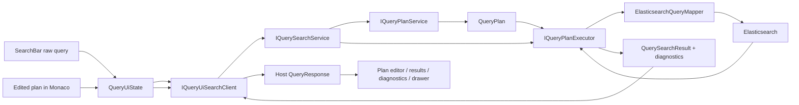

# Implementation Plan

**Target output path:** `docs/096-query-ui-uplift/plan-frontend-query-ui-uplift_v0.01.md`

**Version:** v0.01 (Draft)

**Based on:**
- `docs/096-query-ui-uplift/spec-frontend-query-ui-uplift_v0.01.md`

**Mandatory instruction references:**
- `./.github/instructions/wiki.instructions.md` — mandatory completion gate for every work item in this plan
- `./.github/instructions/documentation-pass.instructions.md` — mandatory Definition of Done requirement for every code-writing task in this plan

## Query UI Uplift

- [x] Work Item 1: Deliver the single-screen raw-query workspace shell - Completed
  - **Purpose**: Replace the current nested three-column page with a flatter, single-screen developer workspace that keeps the existing raw-query search path runnable while making the generated query plan visible in Monaco beside the results.
  - **Acceptance Criteria**:
    - A raw-query search still executes end to end from the existing top search bar.
    - The centre workspace is split into query-plan editor and results panes that remain visible together on desktop widths.
    - The generated query plan from the raw-query search is shown in Monaco after each successful run.
    - Results move to a flatter row-based presentation with selection retained.
    - The old always-visible right-hand details card layout is removed from the main body.
  - **Definition of Done**:
    - Code implemented for the shell, state wiring, and generated-plan display
    - All code written or updated follows `./.github/instructions/documentation-pass.instructions.md` in full, including developer-level comments on every class, method, constructor, public parameter, and non-obvious property touched by the slice
    - Logging and error handling are present where the new shell or state transitions can fail
    - Targeted tests pass for the host state and UI composition paths changed by this slice
    - Wiki review completed per `./.github/instructions/wiki.instructions.md`; relevant wiki or repository guidance updated, or an explicit no-change review result recorded
    - Foundational documentation retained or added for any dense contributor-facing explanation in book-like narrative form, with technical terms explained when first introduced and examples added where they materially help
    - Can execute end to end via: run the host, submit a raw query, and confirm the generated plan appears in Monaco beside the results
  - Summary: Replaced the old three-column home page with a single-screen shell that keeps a raw-query command bar at the top, a left insight column, a centre Monaco/results split, a right diagnostics column, and a bottom selected-result drawer host. Added the host Monaco editor and JavaScript interop, projected generated plans through `QueryUiSearchClient` and `QueryUiState`, flattened results into row-style buttons with logical selection retention, documented all touched code to the repository standard, and corrected the `QueryPlanPanel` Razor binding so Monaco receives generated JSON instead of the literal `State.EditablePlanText` text. Validation: `QueryServiceHost.Tests` project passed, `UKHO.Search.Services.Query.Tests` project passed, and workspace build succeeded. Wiki review result: updated `wiki/Query-Pipeline.md` and `wiki/Query-Walkthrough.md`; reviewed `wiki/Query-Model-and-Elasticsearch-Mapping.md` and `wiki/Glossary.md` with no changes required for this slice and no further wiki update required for the binding-only fix.
  - [x] Task 1: Reshape the `QueryServiceHost` page into the new single-screen shell - Completed
    - Summary: Reworked `Home.razor`, `Home.razor.css`, `SearchBar.razor`, and new host shell components so the page always renders the new diagnostics-first workspace while staying interactive with Blazor Server.
    - [x] Step 1: Replace the current `Home.razor` three-column composition with a top command bar, left query-insight column, centre split workspace, right diagnostics column, and bottom detail-drawer host region.
    - [x] Step 2: Add or repurpose host components so the layout is expressed as focused sections rather than nested cards.
    - [x] Step 3: Move the old details experience out of the always-visible right column so the page no longer uses the current placeholder `DetailsPanel` pattern as the main diagnostic surface.
    - [x] Step 4: Keep the page interactive with the existing Blazor Server rendering model.
    - [x] Step 5: Apply the repository documentation-pass standard from `./.github/instructions/documentation-pass.instructions.md` to all code written in this task.
  - [x] Task 2: Add Monaco-based generated plan display in the centre-left pane - Completed
    - Summary: Added `JsonEditor.razor`, `QueryPlanPanel.razor`, `wwwroot/js/monacoEditorInterop.js`, and the `require.js` host bootstrap so Monaco now shows the generated plan inside the Query host using the established RulesWorkbench pattern.
    - [x] Step 1: Reuse the Monaco editor integration approach already established in `tools/RulesWorkbench/Components/JsonEditor.razor` and its JavaScript interop pattern.
    - [x] Step 2: Introduce the Query host equivalent component and supporting static assets in `src/Hosts/QueryServiceHost`.
    - [x] Step 3: Populate the editor with the generated query plan from the raw-query execution path.
    - [x] Step 4: Keep the editor writable from the start so later edited-plan execution work can layer onto the same component without a second refactor.
    - [x] Step 5: Apply the repository documentation-pass standard from `./.github/instructions/documentation-pass.instructions.md` to all code written in this task.
  - [x] Task 3: Extend host-local models and state so generated-plan data reaches the page - Completed
    - Summary: Enriched `QueryResponse`, projected repository `QueryPlan` JSON in `QueryUiSearchClient`, and taught `QueryUiState` to keep generated-plan and editable-plan text separate while preserving selection across refreshed results.
    - [x] Step 1: Extend the host response model to carry the generated query plan in a form suitable for Monaco display.
    - [x] Step 2: Update `QueryUiSearchClient` so the existing repository-owned query result is projected into the richer host response without moving planning logic into the host.
    - [x] Step 3: Update `QueryUiState` to retain the latest generated plan separately from result-selection state.
    - [x] Step 4: Keep raw-query search behaviour unchanged from the user perspective except for the new diagnostics shell.
    - [x] Step 5: Apply the repository documentation-pass standard from `./.github/instructions/documentation-pass.instructions.md` to all code written in this task.
  - [x] Task 4: Flatten the results presentation and preserve selection - Completed
    - Summary: Replaced the old nested-card result composition with row-style buttons, preserved click/selection behaviour, and kept loading, empty, and error states readable inside the flatter centre-right pane.
    - [x] Step 1: Replace nested result cards with a simpler row-style list presentation.
    - [x] Step 2: Preserve the selected-result visual state and click behavior.
    - [x] Step 3: Keep empty, loading, and error states readable within the flatter layout.
    - [x] Step 4: Apply the repository documentation-pass standard from `./.github/instructions/documentation-pass.instructions.md` to all code written in this task.
  - [x] Task 5: Add focused tests for the shell slice - Completed
    - Summary: Added state, adapter, and host-composition tests in `test/QueryServiceHost.Tests` for generated-plan projection, selection retention, and shell composition, while relying on existing `UKHO.Search.Services.Query.Tests` coverage for unchanged repository query services.
    - [x] Step 1: Add or extend host-state and host-composition tests in `test/QueryServiceHost.Tests` for generated-plan projection and shell state transitions.
    - [x] Step 2: Add or extend query service tests only where the host contract now depends on additional result data from the application service.
    - [x] Step 3: Avoid bUnit introduction; prefer repository-standard higher-level verification approaches, with browser automation added only if it can be introduced proportionately in this work package.
  - **Files**:
    - `src/Hosts/QueryServiceHost/Components/Pages/Home.razor`: replace the page composition with the new one-screen shell.
    - `src/Hosts/QueryServiceHost/Components/Pages/Home.razor.css`: add layout styles for the shell, split centre pane, and drawer host.
    - `src/Hosts/QueryServiceHost/Components/SearchBar.razor`: keep the raw-query action clear within the new top command bar.
    - `src/Hosts/QueryServiceHost/Components/ResultsPanel.razor`: flatten the results presentation.
    - `src/Hosts/QueryServiceHost/Components/QueryPlanPanel.razor`: new Monaco-hosting pane for generated-plan display and later edited-plan actions.
    - `src/Hosts/QueryServiceHost/Components/QueryInsightPanel.razor`: new left-column panel for extracted signals and trace placeholders or first-pass rendering.
    - `src/Hosts/QueryServiceHost/Components/QueryDiagnosticsPanel.razor`: new right-column diagnostics surface shell.
    - `src/Hosts/QueryServiceHost/Components/ResultExplainDrawer.razor`: new bottom detail drawer shell.
    - `src/Hosts/QueryServiceHost/Components/JsonEditor.razor`: Query host Monaco editor component adapted from the RulesWorkbench pattern.
    - `src/Hosts/QueryServiceHost/wwwroot/js/monacoEditorInterop.js`: Query host Monaco interop module.
    - `src/Hosts/QueryServiceHost/Models/QueryResponse.cs`: enrich host response data with generated-plan payload.
    - `src/Hosts/QueryServiceHost/State/QueryUiState.cs`: carry shell state, generated plan, and selection state.
    - `src/Hosts/QueryServiceHost/Services/IQueryUiSearchClient.cs`: preserve a clean host-local client abstraction while exposing richer raw-query results.
    - `src/Hosts/QueryServiceHost/Services/QueryUiSearchClient.cs`: project repository-owned search results into the richer host response.
    - `test/QueryServiceHost.Tests/*`: focused host tests for the shell slice.
  - **Work Item Dependencies**: none
  - **Run / Verification Instructions**:
    - `dotnet test test/QueryServiceHost.Tests/QueryServiceHost.Tests.csproj`
    - `dotnet test test/UKHO.Search.Services.Query.Tests/UKHO.Search.Services.Query.Tests.csproj`
    - `dotnet run --project src/Hosts/QueryServiceHost/QueryServiceHost.csproj`
    - Open `/`, submit a raw query, and confirm that results render in the flattened centre-right pane while the generated plan appears in Monaco in the centre-left pane.
  - **User Instructions**:
    - Use an environment with the normal Query host configuration available.
    - If local verification is easier through Aspire composition, run the relevant host stack and open the Query host from there instead of running the host standalone.

- [x] Work Item 2: Add edited-plan execution, reset, and validation as a full vertical slice - Completed
  - **Purpose**: Let developers treat the generated query plan as a working artifact by editing it, resetting it, validating it, and executing it directly from the plan pane without re-submitting the raw query.
  - **Acceptance Criteria**:
    - A `Search` button appears directly above the Monaco editor and executes the edited plan.
    - A `Reset to generated plan` action restores the editor content to the most recent generated plan.
    - Invalid edited plan JSON or invalid query-plan structure produces clear validation errors and does not execute.
    - Valid edited plans execute end to end and refresh results, metrics, and diagnostics using the edited-plan path.
    - The raw-query search path remains available and continues to regenerate the plan when used.
  - **Definition of Done**:
    - Code implemented for edited-plan execution from UI entry point through application-service boundary to executor
    - All code written or updated follows `./.github/instructions/documentation-pass.instructions.md` in full, including developer-level comments on every class, method, constructor, public parameter, and non-obvious property touched by the slice
    - Validation, logging, and user-visible error handling are added for malformed JSON and invalid plan execution attempts
    - Targeted tests pass for host state, application-service orchestration, and infrastructure execution paths changed by this slice
    - Wiki review completed per `./.github/instructions/wiki.instructions.md`; relevant wiki or repository guidance updated, or an explicit no-change review result recorded
    - Foundational documentation retained or added for any dense contributor-facing explanation in book-like narrative form, with technical terms explained when first introduced and examples added where they materially help
    - Can execute end to end via: generate a plan from raw text, edit it, run it from the pane, and reset it back to the generated baseline
  - Summary: Added a supplied-plan execution path to `IQuerySearchService` and `QueryUiSearchClient`, taught `QueryUiState` to validate Monaco JSON as `QueryPlan`, execute edited plans without overwriting the generated raw-query baseline, reset back to the latest generated plan, and distinguish raw-query versus edited-plan runs in the shell summaries and diagnostics. `QueryPlanPanel.razor` now exposes pane-level `Search` and `Reset to generated plan` actions, `QueryDiagnosticsPanel.razor` projects blocking validation messages, and `QueryResponse` carries execution-source metadata for the host. Validation: `QueryServiceHost.Tests` passed, `UKHO.Search.Services.Query.Tests` passed, `UKHO.Search.Infrastructure.Query.Tests` passed, and workspace build succeeded. Wiki review result: updated `wiki/Query-Pipeline.md`, `wiki/Query-Walkthrough.md`, and `wiki/Glossary.md`; reviewed `wiki/Query-Model-and-Elasticsearch-Mapping.md` with no change required because the edited-plan slice did not alter the underlying `QueryPlan` contract or Elasticsearch mapping rules.
  - [x] Task 1: Extend the query application-service contract for supplied-plan execution - Completed
    - Summary: Extended `IQuerySearchService` with supplied-plan execution and updated `QuerySearchService` so raw-query and edited-plan paths converge on the same repository-owned executor while preserving Onion Architecture boundaries.
    - [x] Step 1: Extend the repository-owned query application-service surface so callers can execute a supplied `QueryPlan` directly without duplicating execution logic in the host.
    - [x] Step 2: Keep the Onion Architecture boundary intact by placing orchestration in `src/UKHO.Search.Services.Query` and execution in `src/UKHO.Search.Query` / `src/UKHO.Search.Infrastructure.Query`.
    - [x] Step 3: Ensure the host continues to depend on the application-service abstraction rather than directly owning executor logic.
    - [x] Step 4: Apply the repository documentation-pass standard from `./.github/instructions/documentation-pass.instructions.md` to all code written in this task.
  - [x] Task 2: Add host-local edited-plan execution workflow - Completed
    - Summary: Extended the host adapter and UI state with supplied-plan execution, execution-source tracking, reset behavior, and separate generated-plan versus editable-plan storage, then wired distinct raw-query and edited-plan actions into the command bar and plan pane.
    - [x] Step 1: Extend the host client abstraction so `QueryUiState` can request execution of a supplied plan.
    - [x] Step 2: Add state fields for generated-plan text, current editor text, validation errors, and last successful edited-plan execution.
    - [x] Step 3: Wire the plan-pane `Search` and `Reset to generated plan` actions.
    - [x] Step 4: Keep the raw-query and edited-plan actions visually distinct so the user understands which path is being executed.
    - [x] Step 5: Apply the repository documentation-pass standard from `./.github/instructions/documentation-pass.instructions.md` to all code written in this task.
  - [x] Task 3: Implement validation and error projection - Completed
    - Summary: Added host-side JSON and contract validation for Monaco plan text, projected blocking validation errors into the diagnostics panel without discarding the current editor contents, and logged invalid-plan attempts before execution is blocked.
    - [x] Step 1: Validate JSON parsing and query-plan contract deserialization before attempting execution.
    - [x] Step 2: Surface blocking errors in the diagnostics area instead of replacing them with generic search failures.
    - [x] Step 3: Preserve the current editor contents when validation fails so the user can correct the plan in place.
    - [x] Step 4: Log invalid-plan execution attempts at the appropriate boundary with enough context for diagnostics.
    - [x] Step 5: Apply the repository documentation-pass standard from `./.github/instructions/documentation-pass.instructions.md` to all code written in this task.
  - [x] Task 4: Add focused tests for edited-plan execution - Completed
    - Summary: Added host-state and adapter tests for raw-versus-edited routing, validation failures, and reset behavior, plus query application-service orchestration tests for supplied-plan execution; infrastructure behavior stayed unchanged, so the existing infrastructure test project was rerun as regression coverage without requiring new executor tests.
    - [x] Step 1: Add host tests covering reset behavior, validation-state transitions, and raw-query versus edited-plan action routing.
    - [x] Step 2: Add or extend service tests covering supplied-plan execution through the application service.
    - [x] Step 3: Add or extend infrastructure tests if executor or request-mapping behavior changes to support the edited-plan path.
  - **Files**:
    - `src/UKHO.Search.Services.Query/Abstractions/IQuerySearchService.cs`: extend or refine the application-service contract for supplied-plan execution.
    - `src/UKHO.Search.Services.Query/Execution/QuerySearchService.cs`: implement orchestration for executing a supplied plan.
    - `src/Hosts/QueryServiceHost/Services/IQueryUiSearchClient.cs`: add the host-local edited-plan execution capability.
    - `src/Hosts/QueryServiceHost/Services/QueryUiSearchClient.cs`: map edited-plan execution through the repository-owned application service.
    - `src/Hosts/QueryServiceHost/State/QueryUiState.cs`: manage generated plan, editor content, validation, reset, and execute-plan behavior.
    - `src/Hosts/QueryServiceHost/Components/QueryPlanPanel.razor`: add pane-level `Search` and `Reset to generated plan` actions.
    - `src/Hosts/QueryServiceHost/Models/*`: add or update any host-local request/response or validation models needed for edited-plan execution.
    - `test/QueryServiceHost.Tests/*`: host-state and contract tests for edited-plan execution.
    - `test/UKHO.Search.Services.Query.Tests/*`: application-service tests for supplied-plan execution.
    - `test/UKHO.Search.Infrastructure.Query.Tests/*`: infrastructure tests if request-building or executor behavior changes.
  - **Work Item Dependencies**: Work Item 1
  - **Run / Verification Instructions**:
    - `dotnet test test/QueryServiceHost.Tests/QueryServiceHost.Tests.csproj`
    - `dotnet test test/UKHO.Search.Services.Query.Tests/UKHO.Search.Services.Query.Tests.csproj`
    - `dotnet test test/UKHO.Search.Infrastructure.Query.Tests/UKHO.Search.Infrastructure.Query.Tests.csproj`
    - `dotnet run --project src/Hosts/QueryServiceHost/QueryServiceHost.csproj`
    - Open `/`, run a raw query, edit the query plan in Monaco, click the pane-level `Search` button, and verify that results refresh from the edited plan. Then click `Reset to generated plan` and verify that the editor returns to the latest generated plan.
  - **User Instructions**:
    - Use valid query-plan JSON when manually verifying the execute-plan path.
    - Keep one browser session open so raw-query and edited-plan actions can be compared without losing state.

- [x] Work Item 3: Enrich diagnostics, metrics, and selected-result explanation - Completed
  - **Purpose**: Complete the developer-centric experience by filling the left and right columns with genuinely useful diagnostics and by moving deeper result detail into a bottom drawer instead of nested main-column panels.
  - **Acceptance Criteria**:
    - The left diagnostics column shows extracted signals and a compact transformation trace for the current execution.
    - The right diagnostics column shows the final Elasticsearch request JSON, validation or warning output, and execution metrics in stacked sections.
    - Results remain visually flat while selected-result detail is available through a collapsible bottom drawer.
    - The initial result explanation is lightweight but useful, and does not depend on full clause-level explain support.
    - The diagnostics shown correspond to the current raw-query or edited-plan execution path.
  - **Definition of Done**:
    - Code implemented for diagnostics projection, metrics display, stacked diagnostics sections, and lightweight result explanation drawer
    - All code written or updated follows `./.github/instructions/documentation-pass.instructions.md` in full, including developer-level comments on every class, method, constructor, public parameter, and non-obvious property touched by the slice
    - Logging and error handling cover diagnostic-projection failures and null or missing optional data gracefully
    - Targeted tests pass for service/infrastructure diagnostics enrichment and host rendering state
    - Wiki review completed per `./.github/instructions/wiki.instructions.md`; relevant wiki or repository guidance updated, or an explicit no-change review result recorded
    - Foundational documentation retained or added for any dense contributor-facing explanation in book-like narrative form, with technical terms explained when first introduced and examples added where they materially help
    - Can execute end to end via: run a query, inspect signals/trace/request JSON/metrics, select a result, and open the bottom drawer summary
  - Summary: Enriched the repository-owned query result with final Elasticsearch request JSON, search-engine timing, and non-blocking warnings; surfaced that data through `QueryUiSearchClient` and `QueryUiState`; replaced the left and right placeholder columns with extracted-signal, transformation-trace, request-JSON, warning, and metrics views; and converted the bottom details area into a collapsible lightweight explanation drawer that opens on result selection. Validation: `QueryServiceHost.Tests` passed, `UKHO.Search.Services.Query.Tests` passed, `UKHO.Search.Infrastructure.Query.Tests` passed, and the workspace build succeeded. Wiki review result: updated `wiki/Query-Pipeline.md`, `wiki/Query-Walkthrough.md`, `wiki/Query-Model-and-Elasticsearch-Mapping.md`, and `wiki/Glossary.md` to describe the diagnostics-first workflow, request visibility, enriched execution-result contract, and transformation-trace terminology.
  - [x] Task 1: Project rich diagnostics from the repository-owned query pipeline - Completed
    - Summary: Extended `QuerySearchResult` and `ElasticsearchQueryExecutor` so the inward pipeline now retains final request JSON, search-engine timing, and warnings, while the host reuses the existing `QueryPlan` for extracted-signal and trace derivation instead of inventing duplicate models.
    - [x] Step 1: Extend the repository-owned query result shape as needed so the host can access final Elasticsearch request JSON, engine timing, and any warnings that belong in the diagnostics UI.
    - [x] Step 2: Reuse existing query-plan content for extracted signals and transformation-trace derivation where possible rather than inventing duplicate host-only models.
    - [x] Step 3: Keep Elasticsearch request generation owned by infrastructure so the host receives diagnostics rather than re-creating request JSON itself.
    - [x] Step 4: Apply the repository documentation-pass standard from `./.github/instructions/documentation-pass.instructions.md` to all code written in this task.
  - [x] Task 2: Render left and right diagnostics columns in the host - Completed
    - Summary: Replaced the left-column and right-column placeholders with repository-driven signal, trace, warning, metrics, and request-JSON sections while preserving flat layout treatment and useful empty states.
    - [x] Step 1: Populate the left column with extracted signals and a compact staged trace from raw input through plan and request.
    - [x] Step 2: Populate the right column with stacked sections for request JSON, warnings/validation, and metrics.
    - [x] Step 3: Keep the layout flat, using headings, spacing, and subtle separators instead of nested cards where possible.
    - [x] Step 4: Preserve useful empty states so a fresh page load or failed execution does not collapse the layout.
    - [x] Step 5: Apply the repository documentation-pass standard from `./.github/instructions/documentation-pass.instructions.md` to all code written in this task.
  - [x] Task 3: Add the lightweight bottom result-explain drawer - Completed
    - Summary: Reworked the footer detail region into a state-driven collapsible drawer that opens on selection, keeps the flat results list unchanged, and shows a lightweight explanation summary, key metadata, matched fields, and raw detail without introducing clause-level explain support.
    - [x] Step 1: Replace the current always-visible details pane behavior with a bottom drawer that opens on selected-result inspection.
    - [x] Step 2: Show a lightweight explanation summary first, such as key matched fields, selected metadata, and raw detail where available.
    - [x] Step 3: Keep deeper clause-level explain detail explicitly deferred unless backend support is already trivial to surface.
    - [x] Step 4: Apply the repository documentation-pass standard from `./.github/instructions/documentation-pass.instructions.md` to all code written in this task.
  - [x] Task 4: Add focused tests for diagnostics enrichment - Completed
    - Summary: Added host-state and host-adapter tests for diagnostics projection and drawer behavior, plus infrastructure tests for request-body capture and search-engine timing, and used the repository-standard targeted project validation instead of introducing a browser harness for this slice.
    - [x] Step 1: Add or extend service and infrastructure tests for enriched query result diagnostics and request-body capture.
    - [x] Step 2: Add host tests covering diagnostics rendering state and selected-result drawer behavior.
    - [x] Step 3: Add browser-level verification only if a lightweight repository-aligned harness is introduced without disproportionate overhead; otherwise record the targeted host/service verification used for this slice.
  - **Files**:
    - `src/UKHO.Search.Query/Results/QuerySearchResult.cs`: enrich the repository-owned result contract with diagnostics fields needed by the host.
    - `src/UKHO.Search.Infrastructure.Query/Search/ElasticsearchQueryMapper.cs`: remain the source of truth for final request JSON generation.
    - `src/UKHO.Search.Infrastructure.Query/Search/ElasticsearchQueryExecutor.cs`: project request JSON and execution metrics into the enriched result.
    - `src/Hosts/QueryServiceHost/Models/QueryResponse.cs`: surface diagnostics fields required by the host UI.
    - `src/Hosts/QueryServiceHost/Components/QueryInsightPanel.razor`: render extracted signals and transformation trace.
    - `src/Hosts/QueryServiceHost/Components/QueryDiagnosticsPanel.razor`: render request JSON, warnings, and metrics as stacked sections.
    - `src/Hosts/QueryServiceHost/Components/ResultExplainDrawer.razor`: render lightweight selected-result explanation.
    - `src/Hosts/QueryServiceHost/State/QueryUiState.cs`: coordinate diagnostics and drawer state.
    - `test/QueryServiceHost.Tests/*`: host tests for diagnostics and drawer behavior.
    - `test/UKHO.Search.Services.Query.Tests/*`: service tests if orchestration changes to carry new diagnostics.
    - `test/UKHO.Search.Infrastructure.Query.Tests/*`: infrastructure tests for request-body capture and execution metrics.
  - **Work Item Dependencies**: Work Item 2
  - **Run / Verification Instructions**:
    - `dotnet test test/QueryServiceHost.Tests/QueryServiceHost.Tests.csproj`
    - `dotnet test test/UKHO.Search.Services.Query.Tests/UKHO.Search.Services.Query.Tests.csproj`
    - `dotnet test test/UKHO.Search.Infrastructure.Query.Tests/UKHO.Search.Infrastructure.Query.Tests.csproj`
    - `dotnet run --project src/Hosts/QueryServiceHost/QueryServiceHost.csproj`
    - Open `/`, run a query, confirm extracted signals and transformation trace appear on the left, confirm final Elasticsearch request JSON plus metrics appear on the right, then select a result and verify the bottom drawer summary opens.
  - **User Instructions**:
    - Use queries that produce at least one result so the bottom drawer can be exercised.
    - Use at least one query that produces recognizable structured signals so the extracted-signals panel can be meaningfully verified.

- [x] Work Item 4: Complete the mandatory wiki review and record the work-package documentation outcome - Completed
  - **Purpose**: Satisfy the repository requirement that every work package ends with an explicit wiki review or wiki update record covering the implemented developer-facing behavior, terminology, architecture, and workflows.
  - **Acceptance Criteria**:
    - Relevant wiki pages have been reviewed against the implemented Query UI uplift.
    - Any stale pages are updated in current-state narrative form with technical terms explained and examples added where they materially improve comprehension.
    - If no wiki page requires changes beyond the implementation-time updates already made, the final work-package record explicitly states what was reviewed and why no further changes were needed.
  - **Definition of Done**:
    - Wiki review completed per `./.github/instructions/wiki.instructions.md`
    - Final execution record states which wiki or repository guidance pages were updated, created, retired, or why none changed
    - Any dense architecture or workflow explanations remain in long-form, book-like narrative prose rather than terse bullet-only treatment
    - Can execute completion review via: inspect the changed wiki pages or the recorded no-change result before closing the work package
  - Summary: Reviewed the query-side wiki reader path after the completed Query UI uplift slices and confirmed that the current-state pages already capture the single-screen diagnostics-first workflow, edited-plan execution path, request-visibility behavior, enriched execution diagnostics, and transformation-trace terminology. No further wiki page edits were required beyond the updates already made during Work Items 1 through 3. Validation: `QueryServiceHost.Tests` passed, `UKHO.Search.Services.Query.Tests` passed, `UKHO.Search.Infrastructure.Query.Tests` passed, and workspace build succeeded. Wiki review result: reviewed `wiki/Query-Pipeline.md`, `wiki/Query-Walkthrough.md`, `wiki/Query-Model-and-Elasticsearch-Mapping.md`, and `wiki/Glossary.md`; left them unchanged in this closure item because they already reflect the implemented current-state contributor workflow and terminology.
  - [x] Task 1: Review the query-related wiki reader path - Completed
    - Summary: Re-reviewed the query overview, walkthrough, mapping, and glossary pages against the implemented shell, edited-plan, diagnostics, and drawer workflow to confirm the reader path remains accurate and complete.
    - [x] Step 1: Review `wiki/Query-Pipeline.md` for the new split-screen developer workflow and edited-plan execution path.
    - [x] Step 2: Review `wiki/Query-Walkthrough.md` for contributor-facing usage steps and screenshots or walkthrough prose if they materially help.
    - [x] Step 3: Review `wiki/Query-Model-and-Elasticsearch-Mapping.md` for any terminology or request-visibility clarifications caused by the new diagnostics UI.
    - [x] Step 4: Review `wiki/Glossary.md` if new terms such as transformation trace or edited query plan need explicit definitions.
  - [x] Task 2: Record the final documentation outcome - Completed
    - Summary: Recorded the grounded no-change result for the final closure pass because the relevant wiki pages had already been updated during implementation and no stale guidance remained after review.
    - [x] Step 1: Update the relevant wiki pages, or explicitly record the grounded no-change result.
    - [x] Step 2: Ensure the final work-package record states exactly which pages changed or were reviewed and left unchanged.
  - **Files**:
    - `wiki/Query-Pipeline.md`: likely review/update target.
    - `wiki/Query-Walkthrough.md`: likely review/update target.
    - `wiki/Query-Model-and-Elasticsearch-Mapping.md`: likely review/update target.
    - `wiki/Glossary.md`: possible terminology update target.
    - `docs/096-query-ui-uplift/*`: record final work-package outcome if the implementation workflow for this work package includes an execution summary.
  - **Work Item Dependencies**: Work Item 3
  - **Run / Verification Instructions**:
    - Review the changed or reviewed wiki pages in the repository viewer.
    - Confirm the final work-package record explicitly captures the wiki review outcome.
  - **User Instructions**:
    - None beyond the normal repository documentation review expectations.

## Summary / Key Considerations

The plan is intentionally sequenced as three runnable vertical slices followed by an explicit documentation closure step.

- Work Item 1 establishes the new page shell and keeps the existing raw-query path fully demonstrable.
- Work Item 2 turns the generated query plan into a first-class executable artifact without breaking Onion Architecture boundaries.
- Work Item 3 fills the surrounding diagnostics surfaces so the page becomes a true developer workbench for query interpretation.
- Work Item 4 closes the repository-mandated wiki review gate.

Key implementation considerations:

- Keep UI responsibilities in `src/Hosts/QueryServiceHost` and preserve planning/execution logic inside the existing query services and infrastructure layers.
- Reuse the Monaco approach already proven in `tools/RulesWorkbench` rather than introducing a second editor pattern.
- Prefer deriving diagnostics from repository-owned query models and results instead of creating host-only duplicate concepts.
- Keep results visually flat and reserve deeper detail for the bottom drawer so the main screen stays readable.
- Treat `./.github/instructions/documentation-pass.instructions.md` and `./.github/instructions/wiki.instructions.md` as hard completion gates, not optional polish.
- Use targeted project-level verification for this work package rather than the full repository test suite.

# Architecture

## Overall Technical Approach

The Query UI uplift remains a Blazor Server feature inside `src/Hosts/QueryServiceHost`, but the page is reoriented around a diagnostics-first workflow rather than a conventional search-results-first layout.

The technical approach is:

1. keep the existing raw-query execution path intact
2. surface the generated `QueryPlan` as a first-class UI artifact
3. allow developers to edit and re-execute that plan
4. enrich the host result contract with the diagnostics needed to explain what happened
5. preserve Onion Architecture by keeping UI orchestration in the host, application orchestration in `UKHO.Search.Services.Query`, and Elasticsearch-specific behavior in `UKHO.Search.Infrastructure.Query`

The main architectural consequence of this work package is that `QueryPlan` stops being an internal service artifact from the page's point of view and becomes a visible, editable, developer-facing runtime object. Even so, the host should still consume that object through a clean application-service boundary rather than embedding planning or Elasticsearch translation logic into Blazor components.

## Frontend

The frontend remains the authenticated Blazor Server host under `src/Hosts/QueryServiceHost`.

### Primary user flow

1. user enters raw query text in the top command bar
2. raw-query search executes and returns results plus the generated query plan
3. Monaco shows the generated plan in the centre-left pane
4. user optionally edits the plan
5. user executes the edited plan from the pane-level `Search` button or resets it back to the generated baseline
6. user inspects results, extracted signals, transformation trace, request JSON, warnings, metrics, and lightweight selected-result explanation without leaving the page

### Frontend components and responsibilities

- `Components/Pages/Home.razor`
  - owns the high-level one-screen composition
  - lays out the top bar, left insight column, centre split, right diagnostics column, and bottom drawer host

- `Components/SearchBar.razor`
  - remains the raw-query entry point
  - must make it clear that this search action regenerates the plan from raw text

- `Components/QueryPlanPanel.razor`
  - hosts Monaco
  - shows generated plan content
  - owns the pane-level `Search` and `Reset to generated plan` actions

- `Components/ResultsPanel.razor`
  - renders flat, row-based result summaries
  - preserves current selection behavior without nested card clutter

- `Components/QueryInsightPanel.razor`
  - renders extracted signals and transformation trace in the left column

- `Components/QueryDiagnosticsPanel.razor`
  - renders final Elasticsearch request JSON, warnings, validation issues, and execution metrics in stacked sections on the right

- `Components/ResultExplainDrawer.razor`
  - renders the lightweight selected-result explanation in a collapsible bottom drawer

- `Components/JsonEditor.razor` and `wwwroot/js/monacoEditorInterop.js`
  - adapt the RulesWorkbench Monaco pattern for this host

- `State/QueryUiState.cs`
  - remains the page-level interaction coordinator
  - gains responsibility for generated-plan text, editable-plan text, validation state, diagnostics state, and drawer state

The frontend should stay visually close to the repository's stock Radzen Material setup. The uplift is about layout and developer diagnostics, not about introducing a custom visual design system.

## Backend

The backend for this feature is not a separate HTTP API surface. It is the repository-owned query pipeline already consumed by `QueryServiceHost`, enriched so the host can drive both raw-query and supplied-plan execution.

### Backend flow for raw-query execution

- `IQuerySearchService` receives raw query text from the host adapter
- `IQueryPlanService` builds the repository-owned `QueryPlan`
- `IQueryPlanExecutor` executes that plan against Elasticsearch
- the result returns hits, timing, the executed plan, and enriched diagnostics such as final request JSON and warnings
- `QueryUiSearchClient` maps that repository-owned result into the host-local `QueryResponse`

### Backend flow for edited-plan execution

- the host collects edited plan JSON from Monaco
- the host deserializes and validates the supplied plan using the repository-owned contract
- the host adapter calls the application-service path for supplied-plan execution
- the application service delegates directly to the executor for that already-built plan
- the result shape remains consistent with the raw-query path so the same host UI surfaces can render it

### Backend components and responsibilities

- `src/UKHO.Search.Services.Query/Abstractions/IQuerySearchService.cs`
  - remains the host-facing application-service abstraction
  - should be extended or refined to support executing a supplied `QueryPlan`

- `src/UKHO.Search.Services.Query/Execution/QuerySearchService.cs`
  - continues to coordinate planning and execution for raw queries
  - also coordinates supplied-plan execution without duplicating infrastructure behavior

- `src/UKHO.Search.Services.Query/Abstractions/IQueryPlanService.cs`
  - remains responsible for turning raw query text into a deterministic `QueryPlan`

- `src/UKHO.Search.Query/Abstractions/IQueryPlanExecutor.cs`
  - remains the abstraction for executing a `QueryPlan`

- `src/UKHO.Search.Query/Models/QueryPlan.cs`
  - remains the canonical developer-facing plan contract shown and edited in Monaco

- `src/UKHO.Search.Query/Results/QuerySearchResult.cs`
  - should carry the executed plan, hits, timing, and any additional diagnostics needed by the host

- `src/UKHO.Search.Infrastructure.Query/Search/ElasticsearchQueryMapper.cs`
  - remains the source of truth for final Elasticsearch request JSON generation
  - is the natural place to expose the request body that the diagnostics UI needs to show

- `src/UKHO.Search.Infrastructure.Query/Search/ElasticsearchQueryExecutor.cs`
  - remains responsible for sending the request to Elasticsearch and collecting execution details
  - should enrich the result with request-body and timing information needed by the page

This approach keeps the host thin, preserves current layering rules, and makes the new developer-facing UI diagnostic surfaces a projection of the existing query architecture rather than a parallel host-only implementation.
