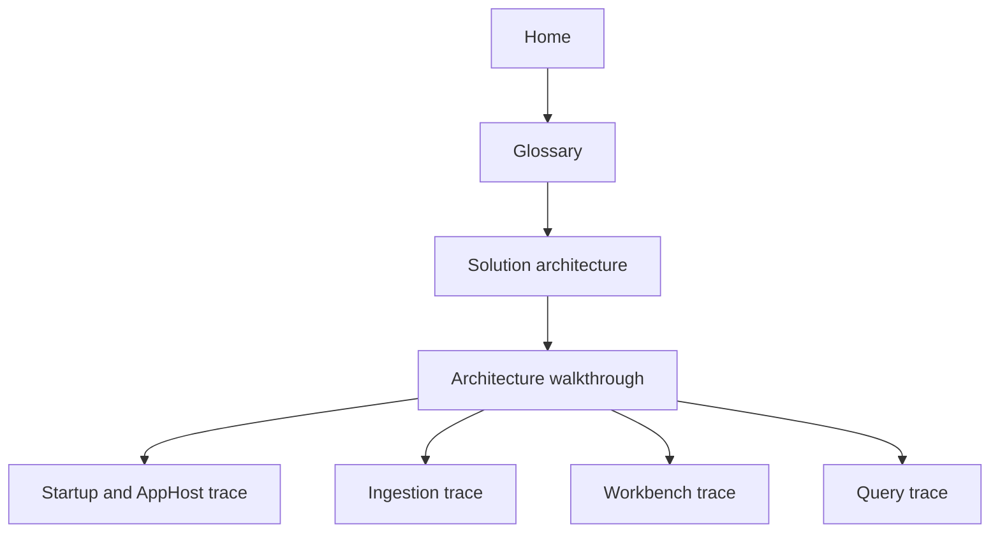
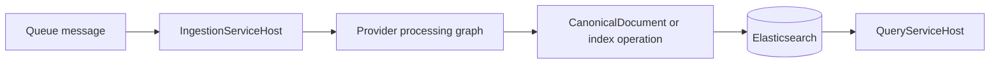

# Architecture walkthrough

This page turns the repository map from [Solution architecture](Solution-Architecture) into a set of practical reading paths. Use it when you want to answer questions such as "where does this request go?", "which project owns this behaviour?", or "where should a change live?"

If the repository vocabulary is unfamiliar, start with the [Glossary](Glossary) first.

This walkthrough exists because the stable project map on [Solution architecture](Solution-Architecture) is only half of the architectural story. Contributors also need to see how the repository behaves as a running system: which host starts first, where local dependencies enter the picture, where provider-specific behavior stops, and how the same canonical index later becomes the input for query and diagnostics. The sections below therefore follow runtime paths rather than just folder names.

## How to use this page

Read this page in one of two ways:

- top to bottom when you need an end-to-end understanding of the active repository flows
- by section when you are tracing a specific change in ingestion, query, AppHost orchestration, or Workbench composition

## 1. Trace the local startup path

When you start the repository locally, the first stop is usually `src/Hosts/AppHost`.

This is the right first stop because local startup in this repository is an architectural concern, not a thin bootstrapping detail. AppHost decides which dependencies are part of a normal development session, how import versus services versus export workflows are separated, and which tools are presented as part of the supported local engineering path.

### What AppHost owns

`AppHost` is the composition root for the local developer environment. It decides which resources and processes are started for the current run mode and supplies the local orchestration surface you inspect through the Aspire dashboard.

### What to read in code

- `src/Hosts/AppHost`
- `src/Hosts/UKHO.Search.ServiceDefaults`
- `configuration/UKHO.Aspire.Configuration*`

### What happens conceptually

1. `AppHost` reads its current environment and run-mode settings.
2. It declares the storage, database, search, auth, and process resources that make up the local stack.
3. It starts the relevant hosts and tools for the selected workflow.
4. The Aspire dashboard then gives you one place to inspect parameters, links, logs, and health for those resources.

That sequence explains why startup problems often feel wider than one project. A broken local session may involve Keycloak, seeded File Share data, queue infrastructure, Elasticsearch, module loading, or environment-specific parameter drift before the issue reaches a feature-specific code path. Reading startup through AppHost keeps those cross-cutting concerns visible.

### Why this matters

If the repository appears broken locally, the problem is often not in a feature project first. It may be in local orchestration, configuration, or a missing dependency started by `AppHost`.

## 2. Trace one ingestion message end to end

The ingestion path is the most important runtime flow in the repository because it turns provider-specific messages into searchable documents.

It is also the clearest example of why the repository uses the boundaries described in the architecture overview. Source-specific details enter at the provider edge, shared runtime primitives handle the flow of work, rules and enrichers shape the canonical form, and infrastructure projects persist the result for the query side. If you understand this one path, the rest of the solution becomes easier to place.

### Where the flow starts

Start in `src/Hosts/IngestionServiceHost` to understand how the host wires the runtime together. The host composes provider registration, infrastructure clients, rule services, and the channel-based ingestion runtime.

That composition step matters because it shows which parts of ingestion are intended to be swappable and which parts are shared. Provider registration can vary by source. Queue clients, projection, dead-letter persistence, and runtime policies can vary by environment. The canonical-document contract, however, remains the shared hand-off point that lets the rest of the repository avoid source-specific coupling.

### Where the shared runtime lives

Then move inward to:

- `src/UKHO.Search` for channels, envelopes, nodes, supervision, and metrics
- `src/UKHO.Search.Ingestion` for ingestion contracts and `CanonicalDocument`
- `src/UKHO.Search.Services.Ingestion` for service-layer coordination
- `src/UKHO.Search.Infrastructure.Ingestion` for queue polling, Elasticsearch projection, dead-letter persistence, and runtime infrastructure

### Where provider-specific logic lives

If the change is File Share-specific, continue to:

- `src/Providers/UKHO.Search.Ingestion.Providers.FileShare`

That project owns the concrete processing graph, request dispatch, enrichers, and source-specific parsing behaviour for the current provider.

This is one of the most important architectural boundaries in the repository. When a contributor is tempted to put File Share-specific behavior into the shared ingestion runtime or into provider metadata projects, this is the section to revisit. The repository is intentionally trying to keep provider-specific knowledge where it can evolve without forcing the whole solution to understand it.

### What to keep in mind while tracing

- infrastructure owns queue and Elasticsearch mechanics
- the provider owns source-specific parsing and enrichment
- the canonical model is the contract between provider-specific work and query-side consumers
- rules can add or derive canonical fields without requiring every mapping to be hard-coded in C#

The end result is not just a message-processing pipeline. It is a normalization boundary. Ingestion is where provider-specific reality is turned into a search-oriented shape that query, diagnostics, and tooling can all trust.

For the full staged explanation, continue to [Ingestion pipeline](Ingestion-Pipeline). For rule behaviour, continue to [Ingestion rules](Ingestion-Rules).

## 3. Trace the query path

The query side is intentionally simpler than ingestion because it consumes the indexed canonical form instead of understanding upstream provider payloads.

That simplicity is one of the architectural payoffs of the ingestion design. The repository spends complexity earlier so that query and downstream tooling do not have to keep rediscovering provider-specific structure. When query behavior looks surprising, the walkthrough should therefore send you back upstream before you assume the read-side code is the primary problem.

### What to read in code

- `src/Hosts/QueryServiceHost`
- `src/UKHO.Search.Query`
- `src/UKHO.Search.Services.Query`
- `src/UKHO.Search.Infrastructure.Query`

### What happens conceptually

1. Ingestion produces and indexes the canonical representation.
2. The query host and query-side services read that indexed form.
3. Query logic works with the normalized search shape instead of duplicating provider-specific parsing rules.

### Why this matters

If you are changing query behaviour, you often need to check whether the real problem is earlier in ingestion or canonical projection rather than in the query host itself.

## 4. Trace Workbench composition

Workbench is the repository's desktop-like Blazor Server tool shell. It is not just one page or one component. It is a bounded runtime model made of host, contracts, services, infrastructure, and modules.

This distinction matters because Workbench can look deceptively like a UI-only concern if you only skim Razor components. In practice it is closer to a lightweight platform inside the repository. The shell owns composition, the core contracts define what modules are allowed to contribute, the infrastructure layer discovers and loads those modules, and the services layer turns contributions into active tools, commands, tabs, and output surfaces.

### Where to read first

- `src/workbench/server/WorkbenchHost`
- `src/workbench/server/UKHO.Workbench`
- `src/workbench/server/UKHO.Workbench.Services`
- `src/workbench/server/UKHO.Workbench.Infrastructure`
- `src/Workbench/modules/UKHO.Workbench.Modules.*`

### How the Workbench flow works

1. `WorkbenchHost` starts the Blazor Server shell.
2. Workbench infrastructure reads `modules.json`, resolves probe roots, and discovers enabled module assemblies.
3. Modules register bounded tools and services through Workbench contracts.
4. Workbench services manage activation, commands, contributions, and active shell state.
5. The shell renders the current explorer, tabs, output, and active tool surfaces.

That layered flow is what lets Workbench stay extensible without making every module responsible for the shell itself. A contributor can usually diagnose a Workbench issue more quickly by asking which layer owns the behavior than by starting from whichever UI surface looks wrong.

### Why this matters

If a Workbench problem looks like a UI issue, the real owner may be one of several places:

- shell composition in `WorkbenchHost`
- command or activation logic in `UKHO.Workbench.Services`
- module loading in `UKHO.Workbench.Infrastructure`
- tool contribution code in a specific `UKHO.Workbench.Modules.*` project

For the current shell behaviour and runtime details, continue to [Workbench introduction](Workbench-Introduction).

## 5. Use the provider model correctly

`src/UKHO.Search.ProviderModel` is a shared repository boundary, not a home for provider-specific parsing logic.

It exists because the repository needs one reusable place for provider identity, registration metadata, and enablement rules that can be shared by hosts and tooling. Without that boundary, provider-specific implementation details and host-specific registration code would start to blur together, which would make both the ingestion runtime and the developer tooling harder to extend safely.

Use it when you need:

- provider descriptors
- shared metadata
- provider catalogs
- split registration helpers used by hosts and tooling

Do not use it for:

- File Share-specific enrichment logic
- source-specific request parsing
- concrete provider processing graphs

Those belong in the concrete provider project instead.

## 6. Decide where a change should live

Treat this table as a starting heuristic, not as a replacement for reading the surrounding architecture pages. The table works best when you already understand why the owning areas are separated. If a change feels like it belongs to several rows at once, the most likely answer is that one layer should own the behavior while another layer merely wires it up or observes it.

| If you are changing... | Start reading here | Likely owning area |
|---|---|---|
| Local startup or resource wiring | `src/Hosts/AppHost` | Host / orchestration |
| Queue polling, indexing, or dead-letter behaviour | `src/UKHO.Search.Infrastructure.Ingestion` | Infrastructure ingestion |
| Channel runtime, nodes, or supervision | `src/UKHO.Search` | Domain runtime primitives |
| Canonical document structure or ingestion contracts | `src/UKHO.Search.Ingestion` | Domain ingestion |
| File Share-specific parsing or enrichers | `src/Providers/UKHO.Search.Ingestion.Providers.FileShare` | Concrete provider |
| Query-side endpoint or adapter behaviour | `src/UKHO.Search.Infrastructure.Query` and `src/Hosts/QueryServiceHost` | Query infrastructure / host |
| Workbench shell composition | `src/workbench/server/WorkbenchHost` | Workbench host |
| Workbench commands, activation, or contributions | `src/workbench/server/UKHO.Workbench.Services` | Workbench services |
| Workbench module discovery or `modules.json` handling | `src/workbench/server/UKHO.Workbench.Infrastructure` | Workbench infrastructure |
| Tool-specific Workbench content | `src/Workbench/modules/UKHO.Workbench.Modules.*` | Workbench module |

## 7. Common architecture-reading mistakes

- Starting with a provider project before understanding the host and canonical boundaries.
- Treating the current File Share provider as if it defines the whole ingestion design.
- Looking for Workbench behaviour only in Razor components and missing the service and module model behind them.
- Treating tools as optional extras instead of part of the repository's intended developer workflow.
- Tracing a query bug without checking whether the indexed canonical fields were produced correctly upstream.

## 8. Recommended next reads

- Return to [Solution architecture](Solution-Architecture) for the stable project map.
- Continue to [Project setup](Project-Setup) if you need to run the stack locally.
- Continue to [Ingestion pipeline](Ingestion-Pipeline) for the detailed ingestion stages.
- Continue to [Workbench introduction](Workbench-Introduction) for the current shell and module runtime details.
- Continue to [Metrics in the Aspire dashboard](Metrics-in-the-Aspire-Dashboard) when you need runtime visibility and diagnostics.
