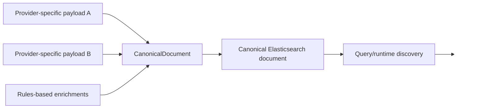
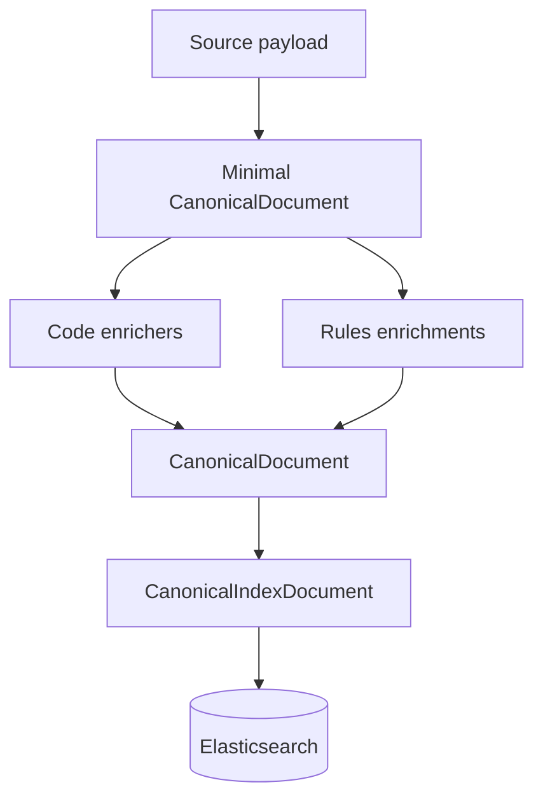

# `CanonicalDocument` and the discovery taxonomy

`CanonicalDocument` is the provider-independent search document built by ingestion before indexing.

It exists to separate **source/provider mechanics** from **discovery behavior**.

A File Share batch, a future provider, or a rules-driven enrichment path can all produce the same canonical shape. Query/index code can then work against that shared model instead of learning every provider's schema.

## Where it lives

- `src/UKHO.Search.Ingestion/Pipeline/Documents/CanonicalDocument.cs`

## Core shape

The current model contains:

- `Id`
- `Provider`
- `Source` (`IndexRequest`)
- `Timestamp`
- `Keywords`
- `Authority`
- `Region`
- `Format`
- `MajorVersion`
- `MinorVersion`
- `Category`
- `Series`
- `Instance`
- `SearchText`
- `Content`
- `GeoPolygons`

## Why it is provider-independent

A provider can be completely source-specific in how it gathers data, but it should still emit a common discovery model.

That means:

- providers own parsing/extraction
- `CanonicalDocument` owns search semantics
- query/indexing code sees one shared contract

## The two halves of the document

### 1. Provenance/source half

- `Id`
- `Provider`
- `Source`
- `Timestamp`

These fields preserve the source record identity, the owning provider identity, and the original request material.

`Provider` is system-managed provenance metadata. It is assigned when the canonical document is constructed from provider context already known at queue ingress. It is not intended to be set by users, rules, or later enrichment stages.

### 2. Discovery half

- `Keywords`
- `SearchText`
- `Content`
- taxonomy fields (`Authority`, `Region`, `Format`, `Category`, `Series`, `Instance`, `MajorVersion`, `MinorVersion`)
- `GeoPolygons`

These fields exist for search, faceting, and filtering.

## Normalization rules

String discovery values are normalized inside the mutator methods:

- trim whitespace
- convert to lower-case invariant
- skip null/empty/whitespace
- store set-based fields in sorted sets for deterministic ordering and de-duplication

This is why `CanonicalDocument` is more than a DTO. It embeds index-shape discipline.

## Search surfaces

### `Keywords`

`Keywords` is a set of exact-match style discovery tokens.

It is populated by:

- tokenized source properties
- rule outputs
- file-name-derived content extraction keywords
- provider-specific enrichers such as S-101 classification

### `SearchText`

`SearchText` is additive phrase text for analyzed search. It is used for concise searchable phrases such as:

- comments
- organization names
- extracted metadata strings

### `Content`

`Content` is additive extracted text content, typically from document/file extraction such as Kreuzberg.

## Discovery taxonomy fields

These fields were introduced so search classification could move beyond generic keywords.

| Field | Meaning |
|---|---|
| `Authority` | authority or owning organization taxonomy |
| `Region` | regional taxonomy |
| `Format` | format taxonomy |
| `MajorVersion` | major version taxonomy |
| `MinorVersion` | minor version taxonomy |
| `Category` | category/product taxonomy |
| `Series` | series taxonomy |
| `Instance` | instance taxonomy |

These are deliberately independent of the provider transport mechanism.

A provider, a rule, or a future mapping component may populate them, but downstream indexing/query code reads one shared representation.

## Geo coverage

`GeoPolygons` stores zero or more polygons using domain geo primitives:

- `GeoCoordinate`
- `GeoPolygon`

At indexing time the infrastructure layer maps those to GeoJSON-like `Polygon` or `MultiPolygon` objects for Elasticsearch `geo_shape` indexing.

## Minimal creation model

The dispatch step creates a minimal document first:

- id
- provider
- defensive copy of `Source`
- timestamp

Everything else is added by enrichers and rules.

This is important because it keeps dispatch cheap and pushes source-specific enrichment into explicit enrichment stages.

## Elasticsearch projection

`CanonicalDocument` is not sent directly as-is to Elasticsearch. Infrastructure creates a `CanonicalIndexDocument` that preserves the canonical fields and maps `GeoPolygons` into GeoJSON-compatible objects.

That projection also preserves `Provider` as a `keyword` field so exact-match filtering and provenance inspection can distinguish which provider produced a document.

That projection lives in:

- `src/UKHO.Search.Infrastructure.Ingestion/Elastic/CanonicalIndexDocument.cs`
- `src/UKHO.Search.Infrastructure.Ingestion/Elastic/GeoJsonPolygonShapeMapper.cs`

## Practical implications for developers

### If you add a new provider

Do not index provider-native fields directly as the primary search contract. First decide whether the value belongs in:

- source/provenance only
- an existing canonical taxonomy/search field
- a genuinely new canonical field

The provider's stable identifier should also be passed into canonical document construction so `CanonicalDocument.Provider` is always set. Do not expose `Provider` as user-editable metadata to compensate for missing pipeline context.

### If you add a new enrichment

Favor mutating the canonical discovery surface rather than embedding provider-specific assumptions into indexing infrastructure.

### If you add a new rule

Think in terms of canonical outcomes:

- what keyword/search text/content/taxonomy should this rule add?

## Conceptual model

## Related pages

- [Ingestion pipeline](Ingestion-Pipeline)
- [Ingestion rules](Ingestion-Rules)
- [Ingestion service provider mechanism](Ingestion-Service-Provider-Mechanism)
- [File Share provider](FileShare-Provider)
