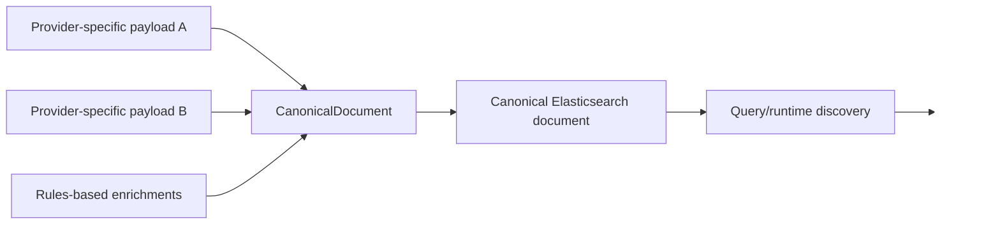
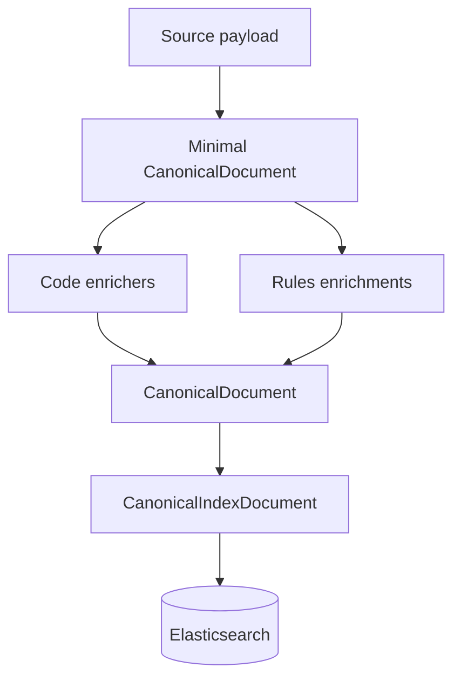

# `CanonicalDocument` and the discovery taxonomy

`CanonicalDocument` is the provider-independent search document built by ingestion before indexing.

It exists to separate **source/provider mechanics** from **discovery behavior**.

A File Share batch, a future provider, or a rules-driven enrichment path can all produce the same canonical shape. Query/index code can then work against that shared model instead of learning every provider's schema.

## Where it lives

- `src/UKHO.Search.Ingestion/Pipeline/Documents/CanonicalDocument.cs`

## Core shape

The current model contains:

- `Id`
- `Provider`
- `Source` (`IndexRequest`)
- `Timestamp`
- `SecurityTokens`
- `Title`
- `Keywords`
- `Authority`
- `Region`
- `Format`
- `MajorVersion`
- `MinorVersion`
- `Category`
- `Series`
- `Instance`
- `SearchText`
- `Content`
- `GeoPolygons`

## Why it is provider-independent

A provider can be completely source-specific in how it gathers data, but it should still emit a common discovery model.

That means:

- providers own parsing/extraction
- `CanonicalDocument` owns search semantics
- query/indexing code sees one shared contract

## The two halves of the document

### 1. Provenance/source half

- `Id`
- `Provider`
- `Source`
- `Timestamp`

These fields preserve the source record identity, the owning provider identity, and the original request material.

`Provider` is system-managed provenance metadata. It is assigned when the canonical document is constructed from provider context already known at queue ingress. It is not intended to be set by users, rules, or later enrichment stages.

### 2. Discovery half

- `SecurityTokens`
- `Keywords`
- `SearchText`
- `Content`
- taxonomy fields (`Authority`, `Region`, `Format`, `Category`, `Series`, `Instance`, `MajorVersion`, `MinorVersion`)
- `GeoPolygons`

These fields exist for search, faceting, filtering, and security trimming.

`SecurityTokens` deserves special attention because it is not a display field and it is not intended for full-text analysis. It is the canonical exact-match security/filter surface that tells downstream systems which authorization tokens must line up before a document should be treated as visible. The ingestion request still preserves the original caller-supplied token casing inside `Source` for traceability, but the canonical `SecurityTokens` set is normalized to lowercase so filtering stays deterministic and case-insensitive.

## Normalization rules

String discovery values are normalized inside the mutator methods:

- trim whitespace
- convert to lower-case invariant
- skip null/empty/whitespace
- store set-based fields in sorted sets for deterministic ordering and de-duplication

This is why `CanonicalDocument` is more than a DTO. It embeds index-shape discipline.

`SecurityTokens` follows that same normalized-set pattern. If a request arrives with values such as `"Public"`, `" public "`, and `"PUBLIC"`, the traceability copy in `Source.SecurityTokens` still shows the caller's original values, but the canonical set retains one lowercase token: `public`. That distinction matters because contributors often need both views: the preserved source payload for investigation and the normalized canonical value for indexing behaviour.

`Title` is the main exception to lowercase normalization. It is still trimmed, deduplicated, and deterministically ordered, but it preserves authored display casing because it is intended for user-facing display rather than normalized discovery matching.

## Search surfaces

### `Keywords`

`Keywords` is a set of exact-match style discovery tokens.

It is populated by:

- tokenized source properties
- rule outputs
- file-name-derived content extraction keywords
- provider-specific enrichers such as S-101 classification

### `SecurityTokens`

`SecurityTokens` is the exact-match security/filter field carried on the canonical document.

It is populated during minimal canonical creation from `IndexRequest.SecurityTokens`, which means the canonical document carries its security envelope before any later enricher or rules-driven shaping work begins. That early population point is deliberate. It ensures the canonical document already contains the minimum security context needed by downstream indexing logic, while still letting later enrichers add more retained tokens through the same canonical mutation path when the repository needs that behaviour.

Unlike `Title`, `SearchText`, or `Content`, `SecurityTokens` is not a user-facing content surface. Contributors should think of it as part of the document's exact-match operational metadata: it helps express who can see the document, not what the document says.

It is also a mandatory retained canonical field. The post-enrichment validation stage checks that the canonical `SecurityTokens` set is still non-empty before the document is allowed to proceed to indexing. That rule exists because the repository treats the canonical document, not only the original request payload, as the authoritative indexing contract. A valid request is therefore necessary but not sufficient: if later enrichment or document mutation leaves the retained canonical token set empty, the document is routed to dead-letter handling in the same family of failure as a missing title.

A short worked example makes the distinction clearer. Imagine the caller sends `Source.SecurityTokens = ["Public", " UKHO-Internal "]`. Minimal canonical creation keeps that exact array in the traceability copy so a maintainer can later inspect what the caller really supplied. At the same time, the canonical mutator path produces `CanonicalDocument.SecurityTokens = ["public", "ukho-internal"]`. If a later enrichment stage accidentally clears that canonical set, the original request still exists for diagnostics, but the document is no longer considered indexable because the authoritative canonical filter surface has been lost.

### `Title`

`Title` is a multi-valued display surface populated primarily by ingestion rules.

It is used to carry concise display-ready labels such as:

- exchange-set names
- publication labels
- rule-derived document titles

Unlike `Keywords`, `SearchText`, and taxonomy strings, `Title` preserves casing so downstream query/UI code can choose an appropriate display title without reconstructing it from normalized search fields.

### `SearchText`

`SearchText` is additive phrase text for analyzed search. It is used for concise searchable phrases such as:

- comments
- organization names
- extracted metadata strings

### `Content`

`Content` is additive extracted text content, typically from document/file extraction such as Kreuzberg.

## Discovery taxonomy fields

These fields were introduced so search classification could move beyond generic keywords.

| Field | Meaning |
|---|---|
| `Authority` | authority or owning organization taxonomy |
| `Region` | regional taxonomy |
| `Format` | format taxonomy |
| `MajorVersion` | major version taxonomy |
| `MinorVersion` | minor version taxonomy |
| `Category` | category/product taxonomy |
| `Series` | series taxonomy |
| `Instance` | instance taxonomy |

These are deliberately independent of the provider transport mechanism.

A provider, a rule, or a future mapping component may populate them, but downstream indexing/query code reads one shared representation.

## Geo coverage

`GeoPolygons` stores zero or more polygons using domain geo primitives:

- `GeoCoordinate`
- `GeoPolygon`

At indexing time the infrastructure layer maps those to GeoJSON-like `Polygon` or `MultiPolygon` objects for Elasticsearch `geo_shape` indexing.

## Minimal creation model

The dispatch step creates a minimal document first:

- id
- provider
- defensive copy of `Source`
- timestamp
- normalized `SecurityTokens` copied from `Source.SecurityTokens`

Everything else is added by enrichers and rules.

This is important because it keeps dispatch cheap and pushes source-specific enrichment into explicit enrichment stages, while still preserving the canonical security context that later indexing and validation steps depend on. The request copy in `Source` keeps the original casing and values for traceability, but the canonical `SecurityTokens` field is already normalized and ready for exact-match filtering.

## Elasticsearch projection

`CanonicalDocument` is not sent directly as-is to Elasticsearch. Infrastructure creates a `CanonicalIndexDocument` that preserves the canonical fields and maps `GeoPolygons` into GeoJSON-compatible objects.

That projection also preserves `Provider` as a `keyword` field so exact-match filtering and provenance inspection can distinguish which provider produced a document. `SecurityTokens` is projected as a `keyword` field for the same reason: Elasticsearch should treat the values as exact retained tokens, not as analyzed text.

That projection lives in:

- `src/UKHO.Search.Infrastructure.Ingestion/Elastic/CanonicalIndexDocument.cs`
- `src/UKHO.Search.Infrastructure.Ingestion/Elastic/GeoJsonPolygonShapeMapper.cs`

## Practical implications for developers

### If you add a new provider

Do not index provider-native fields directly as the primary search contract. First decide whether the value belongs in:

- source/provenance only
- an existing canonical taxonomy/search field
- a genuinely new canonical field

The provider's stable identifier should also be passed into canonical document construction so `CanonicalDocument.Provider` is always set. Do not expose `Provider` as user-editable metadata to compensate for missing pipeline context.

### If you add a new enrichment

Favor mutating the canonical discovery surface rather than embedding provider-specific assumptions into indexing infrastructure.

### If you add a new rule

Think in terms of canonical outcomes:

- what title/keyword/search text/content/taxonomy should this rule add?

## Conceptual model

## Related pages

- [Ingestion pipeline](Ingestion-Pipeline)
- [Ingestion walkthrough](Ingestion-Walkthrough)
- [Ingestion rules](Ingestion-Rules)
- [Appendix: rule syntax quick reference](Appendix-Rule-Syntax-Quick-Reference)
- [Ingestion service provider mechanism](Ingestion-Service-Provider-Mechanism)
- [File Share provider](FileShare-Provider)
