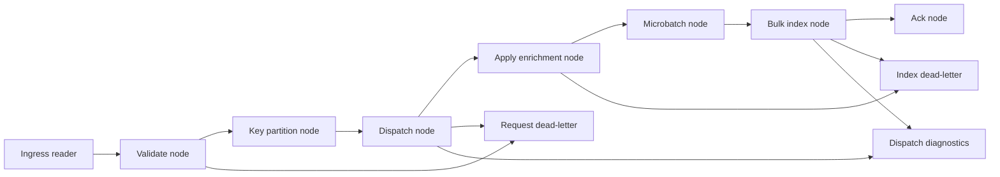

# `UKHO.Search.Ingestion.Providers.FileShare`

This is the current concrete ingestion provider.

It owns the File Share processing graph and the provider-specific enrichment behavior that converts File Share batches into a canonical discovery document.

## Main responsibilities

- identify itself as provider `file-share`
- deserialize queue messages into `IngestionRequest`
- own the provider ingress channel and processing graph
- dispatch requests into index operations
- run File Share-specific enrichers over upsert documents

## Factory and provider objects

### Factory

- `FileShareIngestionDataProviderFactory`

Responsibilities:

- expose provider name `file-share`
- expose the queue name
- create the provider instance

### Provider

- `FileShareIngestionDataProvider`

Responsibilities:

- deserialize JSON queue messages using `IngestionJsonSerializerOptions`
- enqueue envelopes into `IngestionRequestIngressChannel`
- lazily build and start the processing graph
- drain/cancel the graph on disposal

## Processing graph

The File Share provider graph is built in:

- `Pipeline/FileShareIngestionProcessingGraph.cs`

It combines generic pipeline nodes with File Share dispatch and enrichment.

## Dispatch and canonical creation

`IngestionRequestDispatchNode` maps request types to index operations:

- `IndexItem` -> `UpsertOperation`
- `DeleteItem` -> `DeleteOperation`
- `UpdateAcl` -> `AclUpdateOperation`

For upserts it uses `CanonicalDocumentBuilder` to create a minimal `CanonicalDocument` containing:

- `Id`
- copied `Source`
- `Timestamp`

Everything richer comes later from enrichment.

## Enrichment model

The File Share provider relies on `ApplyEnrichmentNode`, which resolves all `IIngestionEnricher` services and runs them in ordinal order.

Important current enrichers in the provider project include:

- `BasicEnricher`
- `BatchContentEnricher`
- `ExchangeSetEnricher` (currently placeholder)
- `GeoLocationEnricher` (currently placeholder)

Rules-based enrichment also joins the broader enrichment pipeline through the rules engine registration in infrastructure.

## `BasicEnricher`

`BasicEnricher` is the baseline provider enricher.

It:

- iterates source properties on `request.IndexItem.Properties`
- extracts scalar/array values
- token-normalizes them using `TokenNormalizer`
- adds the resulting tokens to `CanonicalDocument.Keywords`

This means many source attributes become searchable keywords even before specialized enrichment or rules run.

## `BatchContentEnricher`

`BatchContentEnricher` is the main File Share content enrichment step.

Responsibilities:

1. determine the batch id from `request.IndexItem.Id`
2. download the batch ZIP using `IFileShareZipDownloader`
3. create a temporary working directory
4. extract the ZIP safely with zip-slip protection
5. recursively expand nested ZIPs
6. collect all extracted file paths
7. run each registered `IBatchContentHandler`
8. clean up the temporary workspace in `finally`

### Best-effort ZIP behavior

`BatchContentEnricher` is aware of `IngestionModeOptions`.

In `BestEffort` mode, when the ZIP download fails specifically because it was not found, the enricher logs a warning and skips ZIP-dependent enrichment instead of failing the whole message.

In `Strict` mode, that same condition still fails ingestion.

## Batch content handlers

The provider uses specialized handlers over the extracted file set.

### `TextExtractionBatchContentHandler`

Purpose:

- run Kreuzberg over allowlisted document types
- append extracted text into `CanonicalDocument.Content`
- add normalized file-stem keywords to `CanonicalDocument.Keywords`

Current allowlist comes from configuration key:

- `ingestion:fileContentExtractionAllowedExtensions`

Typical defaults include:

- `.pdf`
- `.docx`
- `.txt`
- `.html`

This is the Kreuzberg integration point for document content extraction.

### `S57BatchContentHandler`

Purpose:

- discover S-57 dataset groups from extracted files
- parse the primary dataset with `BasicS57Enricher`

The handler groups related S-57 dataset members, logs what it found, then enriches from the first detected dataset.

#### What `BasicS57Enricher` extracts

It uses GDAL/OGR to:

- open the S-57 dataset
- compute the dataset envelope across layers
- convert that envelope into WKT polygon text
- parse the WKT into a domain `GeoPolygon`
- extract DSID comment fields (`DSID_COMT`, `DSPM_COMT`) and append them to `SearchText`

This is the main S-57 geo extraction path.

### `S100BatchContentHandler`

Purpose:

- locate `catalog.xml`
- detect whether it represents S-101 data
- enrich via `S101Enricher`

#### What `S101Enricher` does

It currently:

- adds `S-101` as a keyword via token normalization
- extracts organization text from `xc:contact/xc:organization`
- extracts exchange catalogue comments
- parses `gml:posList` values under `xc:dataCoverage`
- converts those lat/lon coordinate lists into domain `GeoPolygon` values

This is the main S-101 geo extraction path.

## Geo extraction summary

There are two major geo extraction mechanisms in the File Share provider today.

### S-57

- source: GDAL/OGR dataset extent across layers
- intermediate form: WKT polygon
- conversion: `GeoPolygonWktReader`
- target: `CanonicalDocument.GeoPolygons`

### S-101

- source: `catalog.xml` GML `posList`
- interpretation: source coordinates are lat/lon (EPSG:4326)
- conversion: `S101Enricher.TryParseLatLonPosList`
- target: `CanonicalDocument.GeoPolygons`

At index time these domain polygons are converted into GeoJSON `Polygon` or `MultiPolygon` structures for Elasticsearch.

## Kreuzberg extraction summary

The Kreuzberg integration happens in:

- `Enrichment/Handlers/TextExtractionBatchContentHandler.cs`

For each allowed file it:

1. calls `KreuzbergClient.ExtractFileAsync(filePath, ...)`
2. if content is non-empty, appends it to `CanonicalDocument.Content`
3. tokenizes the file name without extension and adds those tokens as keywords
4. logs warnings for per-file extraction failures but keeps processing the batch

This gives the provider a best-effort textual extraction path for PDFs, Office documents, text, and HTML-like content.

## Rules and File Share

The provider does not rely on code-only enrichment.

Because provider name is `file-share`, the shared rules engine can apply File Share-scoped rules during the same enrichment stage. In practice the full File Share discovery document is often the combination of:

- baseline keyword extraction from request properties
- ZIP/content-derived enrichments
- S-57 or S-101 parsing
- rules-based taxonomy/search-text/content additions

## Current placeholders and future growth

Two enrichers are present but effectively placeholders today:

- `ExchangeSetEnricher`
- `GeoLocationEnricher`

Their presence reflects the intended extensibility of the provider: enrichment concerns can grow in discrete steps without redesigning the graph.

## Why this provider matters architecturally

File Share is the proving ground for the overall ingestion architecture because it combines:

- queue-driven processing
- provider-owned graphs
- canonical-document construction
- rules integration
- ZIP handling
- structured geo enrichment
- unstructured text extraction
- dead-letter diagnostics

If you understand this provider, you understand most of the repository's ingestion-side design.

## Related pages

- [Ingestion pipeline](Ingestion-Pipeline)
- [Ingestion service provider mechanism](Ingestion-Service-Provider-Mechanism)
- [CanonicalDocument and discovery taxonomy](CanonicalDocument-and-Discovery-Taxonomy)
- [Ingestion rules](Ingestion-Rules)
