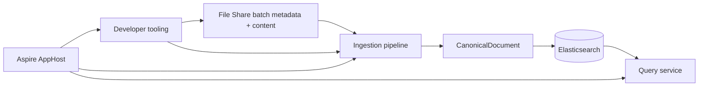

# UKHO.Search Wiki

Welcome to the developer wiki for `UKHO.Search`.

This wiki consolidates the repository's architecture notes, work-package history, operational guidance, and tooling documentation into a single onboarding path for contributors.

## What this solution is

`UKHO.Search` is a search and ingestion platform built around:

- an **ingestion pipeline** that reads provider messages, enriches them, and indexes a canonical search document into Elasticsearch
- a **query service** that reads from the same canonical index
- an **Aspire AppHost** that orchestrates the local stack
- a set of **developer tools** for emulating File Share data, importing/exporting data images, and evaluating ingestion rules

At the center of the design is a provider-independent `CanonicalDocument`. Providers turn source-specific payloads into that shared discovery contract, and the infrastructure layer projects it into Elasticsearch.

## Start here

- [Solution architecture](Solution-Architecture)
- [Project setup](Project-Setup)
- [Tools: `FileShareImageLoader` and `FileShareEmulator`](Tools-FileShareImageLoader-and-FileShareEmulator)
- [Tools (advanced): `FileShareImageBuilder`](Tools-Advanced-FileShareImageBuilder)
- [Tools: `RulesWorkbench`](Tools-RulesWorkbench)
- [Ingestion pipeline](Ingestion-Pipeline)
- [How to write ingestion rules](Ingestion-Rules)
- [CanonicalDocument and discovery taxonomy](CanonicalDocument-and-Discovery-Taxonomy)
- [Ingestion service provider mechanism](Ingestion-Service-Provider-Mechanism)
- [File Share provider deep dive](FileShare-Provider)
- [Documentation source map](Documentation-Source-Map)

## Quick orientation

### Main runtime entry points

- `src/Hosts/AppHost` — Aspire orchestration and `runmode` switching
- `src/Hosts/IngestionServiceHost` — ingestion host and bootstrap/runtime wiring
- `src/Hosts/QueryServiceHost` — query-side host
- `tools/FileShareEmulator` — local File Share emulator UI/API
- `tools/RulesWorkbench` — rule inspection, evaluation, and checker tooling

### Core libraries

- `src/UKHO.Search` — pipeline runtime, channels, supervision, metrics, dead-letter primitives
- `src/UKHO.Search.Ingestion` — ingestion contracts and `CanonicalDocument`
- `src/UKHO.Search.Ingestion.Providers.FileShare` — File Share provider processing graph and enrichers
- `src/UKHO.Search.Infrastructure.Ingestion` — queue, blob dead-letter, bootstrap, and Elasticsearch integration

### Local workflow at a glance

1. Acquire or build a File Share data image.
2. Run `AppHost` in `import` mode and start the loader.
3. Run `AppHost` in `services` mode.
4. Use `FileShareEmulator` to inspect data and enqueue batches.
5. Watch ingestion metrics/logs in Aspire and inspect Elasticsearch/query behavior.

If your task is rule authoring or rule diagnosis, open [`RulesWorkbench`](Tools-RulesWorkbench) as part of that loop.

## Design themes carried through the repo

- **Onion architecture** keeps domain logic inward and infrastructure outward.
- **Channels + supervised nodes** provide the ingestion runtime.
- **Provider-specific enrichment** feeds a **provider-agnostic search model**.
- **Rules** provide additive enrichment without hard-coding every mapping into C#.
- **Developer tooling** is first-class, especially for local File Share workflows.

## Historical design lineage

The repository contains a substantial design history in `docs/`. This wiki is intentionally derived from that corpus rather than replacing it. Use the [documentation source map](Documentation-Source-Map) when you want to trace a topic back to the originating work packages, plans, or architecture notes.
