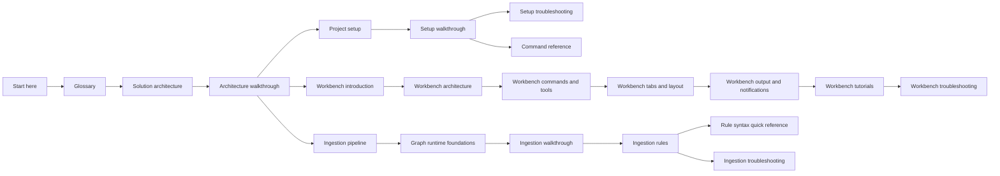

# UKHO.Search Wiki

Welcome to the developer wiki for `UKHO.Search`.

Use this page as the start of the repository reading path. It explains what the solution does, where to go next for your role, and which pages matter most when you are tracing architecture, setting up the stack, or extending ingestion and Workbench features.

## What this repository does

`UKHO.Search` combines four closely related concerns:

- a provider-aware **ingestion pipeline** that turns source messages into a shared search shape
- a **query path** that reads from the indexed canonical form
- an **Aspire AppHost** that orchestrates the local developer environment
- a set of **developer tools** that make File Share workflows, rule authoring, and Workbench exploration practical during day-to-day development

The repository's central contract is the [`CanonicalDocument`](Glossary#canonicaldocument). Providers build or enrich that shared model, the infrastructure layer projects it into Elasticsearch, and the query side reads the indexed result.

## Reading routes by audience

| If you are... | Start with | Then continue to |
|---|---|---|
| New to the repository | [Glossary](Glossary) | [Solution architecture](Solution-Architecture) -> [Architecture walkthrough](Architecture-Walkthrough) -> [Project setup](Project-Setup) |
| Setting up the local stack | [Project setup](Project-Setup) | [Setup walkthrough](Setup-Walkthrough) -> [Setup troubleshooting](Setup-Troubleshooting) -> [Appendix: command reference](Appendix-Command-Reference) -> [Tools: `FileShareImageLoader` and `FileShareEmulator`](Tools-FileShareImageLoader-and-FileShareEmulator) |
| Working on ingestion | [Ingestion pipeline](Ingestion-Pipeline) | [Ingestion graph runtime foundations](Ingestion-Graph-Runtime) -> [Ingestion walkthrough](Ingestion-Walkthrough) -> [Ingestion rules](Ingestion-Rules) -> [Appendix: rule syntax quick reference](Appendix-Rule-Syntax-Quick-Reference) -> [Ingestion troubleshooting](Ingestion-Troubleshooting) |
| Working on Workbench or Blazor UI | [Solution architecture](Solution-Architecture) | [Architecture walkthrough](Architecture-Walkthrough) -> [Workbench introduction](Workbench-Introduction) -> [Workbench architecture](Workbench-Architecture) -> [Workbench commands and tools](Workbench-Commands-and-Tools) -> [Workbench tabs and layout](Workbench-Tabs-and-Layout) |
| Tracing repository history or design background | [Documentation source map](Documentation-Source-Map) | Related work-package documents in `docs/` |

## Major areas of the wiki

### Architecture

Start with [Solution architecture](Solution-Architecture) for the current repository shape, project responsibilities, and runtime boundaries. Then continue to [Architecture walkthrough](Architecture-Walkthrough) for a code-oriented explanation of how requests, tools, and startup flows move through the solution.

### Setup

[Project setup](Project-Setup) is the narrative entry point for the local AppHost-driven workflow, the `runmode` model, and the File Share data-image loop. Follow it with [Setup walkthrough](Setup-Walkthrough), [Setup troubleshooting](Setup-Troubleshooting), and [Appendix: command reference](Appendix-Command-Reference) when you need the full guided onboarding path.

### Ingestion

[Ingestion pipeline](Ingestion-Pipeline) is the conceptual entry point for the message-processing path. Follow it with [Ingestion graph runtime foundations](Ingestion-Graph-Runtime) for the generic base library and terminology, then [Ingestion walkthrough](Ingestion-Walkthrough), [Ingestion rules](Ingestion-Rules), [Appendix: rule syntax quick reference](Appendix-Rule-Syntax-Quick-Reference), and [Ingestion troubleshooting](Ingestion-Troubleshooting) when you need to understand runtime flow, rule evaluation, canonical indexing, and failure handling.

### Workbench

[Workbench introduction](Workbench-Introduction) is the entry point for the full Workbench guide. Follow it into [Workbench architecture](Workbench-Architecture), [Workbench shell guide](Workbench-Shell-Guide), [Workbench modules and contributions](Workbench-Modules-and-Contributions), [Workbench commands and tools](Workbench-Commands-and-Tools), [Workbench tabs and layout](Workbench-Tabs-and-Layout), [Workbench output and notifications](Workbench-Output-and-Notifications), [Workbench tutorials](Workbench-Tutorials), and [Workbench troubleshooting](Workbench-Troubleshooting) when you need the current shell model, extension rules, practical recipes, and diagnostics guidance.

### Troubleshooting and observability

[Setup troubleshooting](Setup-Troubleshooting) covers environment bring-up issues, [Ingestion troubleshooting](Ingestion-Troubleshooting) covers queue, rules, and dead-letter symptoms, and [Metrics in the Aspire dashboard](Metrics-in-the-Aspire-Dashboard) remains the runtime visibility companion for local orchestration, indexing, and performance symptoms.

### Glossary

[Glossary](Glossary) centralizes repository vocabulary such as `CanonicalDocument`, provider model, Workbench module, explorer item, output panel, and AppHost terminology. Read it early if the repository-specific terms are unfamiliar.

### Appendices and supporting references

Several pages are intentionally deeper reference material rather than first-read narrative pages. Useful starting points are [Appendix: command reference](Appendix-Command-Reference), [Documentation source map](Documentation-Source-Map), [Provider metadata and split registration](Provider-Metadata-and-Split-Registration), and the more specialized ingestion and tooling pages linked throughout this wiki.

## Quick orientation

### Main runtime entry points

| Path | Responsibility |
|---|---|
| `src/Hosts/AppHost` | Starts the local Aspire-orchestrated environment and switches between import, services, and export workflows. |
| `src/Hosts/IngestionServiceHost` | Hosts the ingestion runtime, infrastructure wiring, and indexing path. |
| `src/Hosts/QueryServiceHost` | Hosts the query-facing runtime and endpoint surface. |
| `src/workbench/server/WorkbenchHost` | Hosts the desktop-like Blazor Server Workbench shell and module composition surface. |
| `tools/FileShareEmulator` | Provides the local File Share emulator UI and API. |
| `tools/RulesWorkbench` | Provides rule inspection, evaluation, and checker tooling. |

### Core implementation areas

| Path | Responsibility |
|---|---|
| `src/UKHO.Search` | Channel-based pipeline runtime, supervision, metrics, and core primitives. |
| `src/UKHO.Search.ProviderModel` | Shared provider identity, metadata, catalogs, and split registration helpers. |
| `src/UKHO.Search.Ingestion` | Ingestion contracts and the canonical discovery model. |
| `src/Providers/UKHO.Search.Ingestion.Providers.FileShare` | Concrete File Share provider processing graph and enrichers. |
| `src/UKHO.Search.Infrastructure.Ingestion` | Queue, blob dead-letter, bootstrap, and Elasticsearch integration. |
| `src/workbench/server/UKHO.Workbench*` | Workbench contracts, services, infrastructure, and shell composition support. |

### Common first workflow

1. Read the [Glossary](Glossary) if the repository terms are new.
2. Read [Solution architecture](Solution-Architecture) for the stable current-state map.
3. Read [Architecture walkthrough](Architecture-Walkthrough) to trace the main repository flows.
4. Follow [Project setup](Project-Setup) and [Setup walkthrough](Setup-Walkthrough) if you need a local environment.
5. Move into the ingestion or Workbench pages that match the area you are changing.

## Design themes that show up across the repository

- **Onion architecture** keeps dependency direction moving inward.
- **Provider-aware ingestion** preserves source-specific behaviour while normalizing into a shared discovery contract.
- **Canonical indexing** gives query and diagnostics features one stable search shape.
- **Rules-driven enrichment** adds mapping flexibility without hard-coding every transformation into the pipeline.
- **Developer tooling** is part of the normal workflow, not an afterthought.
- **Workbench composition** uses a bounded module and contribution model so tools can extend the shell without taking ownership of it.

## Related supporting pages

- [CanonicalDocument and discovery taxonomy](CanonicalDocument-and-Discovery-Taxonomy)
- [Setup walkthrough](Setup-Walkthrough)
- [Setup troubleshooting](Setup-Troubleshooting)
- [Appendix: command reference](Appendix-Command-Reference)
- [Ingestion graph runtime foundations](Ingestion-Graph-Runtime)
- [Ingestion walkthrough](Ingestion-Walkthrough)
- [Ingestion rules](Ingestion-Rules)
- [Appendix: rule syntax quick reference](Appendix-Rule-Syntax-Quick-Reference)
- [Ingestion troubleshooting](Ingestion-Troubleshooting)
- [Ingestion service provider mechanism](Ingestion-Service-Provider-Mechanism)
- [Provider metadata and split registration](Provider-Metadata-and-Split-Registration)
- [Tools: `RulesWorkbench`](Tools-RulesWorkbench)
- [Metrics in the Aspire dashboard](Metrics-in-the-Aspire-Dashboard)

_Current as of 2026-04-01._
