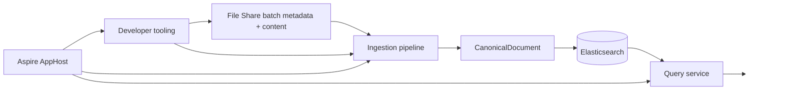

# UKHO.Search Wiki

Welcome to the developer wiki for `UKHO.Search`.

This wiki consolidates the repository's architecture notes, work-package history, operational guidance, and tooling documentation into a single onboarding path for contributors.

## What this solution is

`UKHO.Search` is a search and ingestion platform built around:

- an **ingestion pipeline** that reads provider messages, enriches them, and indexes a canonical search document into Elasticsearch
- a **query service** that reads from the same canonical index
- an **Aspire AppHost** that orchestrates the local stack
- a set of **developer tools** for emulating File Share data, importing/exporting data images, and evaluating ingestion rules

At the center of the design is a provider-independent `CanonicalDocument`. Providers turn source-specific payloads into that shared discovery contract, and the infrastructure layer projects it into Elasticsearch.

## Start here

- [Solution architecture](Solution-Architecture)
- [Project setup](Project-Setup)
- [Tools: `FileShareImageLoader` and `FileShareEmulator`](Tools-FileShareImageLoader-and-FileShareEmulator)
- [Tools (advanced): `FileShareImageBuilder`](Tools-Advanced-FileShareImageBuilder)
- [Tools: `RulesWorkbench`](Tools-RulesWorkbench)
- [Tools: `UKHO Search Studio`](Tools-UKHO-Search-Studio)
- [Ingestion pipeline](Ingestion-Pipeline)
- [Metrics in the Aspire dashboard](Metrics-in-the-Aspire-Dashboard)
- [How to write ingestion rules](Ingestion-Rules)
- [CanonicalDocument and discovery taxonomy](CanonicalDocument-and-Discovery-Taxonomy)
- [Ingestion service provider mechanism](Ingestion-Service-Provider-Mechanism)
- [Provider metadata and split registration](Provider-Metadata-and-Split-Registration)
- [File Share provider deep dive](FileShare-Provider)
- [Documentation source map](Documentation-Source-Map)

## Quick orientation

### Main runtime entry points

- `src/Hosts/AppHost` — Aspire orchestration and `runmode` switching
- `src/Hosts/IngestionServiceHost` — ingestion host and bootstrap/runtime wiring
- `src/Hosts/QueryServiceHost` — query-side host
- `src/Studio/StudioServiceHost` — studio-facing minimal API host for development-time tooling, exposing `/providers`, read-only `/rules`, provider-neutral ingestion/operation APIs, OpenAPI/Scalar metadata, and the lightweight `/echo` smoke endpoint
- `tools/FileShareEmulator` — local File Share emulator UI/API
- `tools/RulesWorkbench` — rule inspection, evaluation, and checker tooling
- `src/Studio/Server` — browser-hosted Eclipse Theia studio shell, currently centered on the default `Home` document, the runtime configuration bridge, and the temporary `PrimeReact Showcase Demo` review surface

### Core libraries

- `src/UKHO.Search` — pipeline runtime, channels, supervision, metrics, dead-letter primitives
- `src/UKHO.Search.ProviderModel` — shared provider identity, metadata, catalogs, and registration helpers used by ingestion and studio composition
- `src/UKHO.Search.Ingestion` — ingestion contracts and `CanonicalDocument`
- `src/Studio/UKHO.Search.Studio` — generic Studio provider contracts, catalogs, and registration validation
- `src/Providers/UKHO.Search.Ingestion.Providers.FileShare` — File Share provider processing graph and enrichers
- `src/Providers/UKHO.Search.Studio.Providers.FileShare` — tandem File Share Studio provider registration for development-time composition
- `src/UKHO.Search.Infrastructure.Ingestion` — queue, blob dead-letter, bootstrap, and Elasticsearch integration

### Test estate

- `test/<ProductionProjectName>.Tests` — the default project-specific test layout used across domain, services, infrastructure, hosts, tools, and configuration projects
- `test/UKHO.Search.Tests.Common` — shared helper-only test infrastructure, including sample-data resolution helpers
- `test/UKHO.Search.IntegrationTests` — intentionally cross-project integration coverage at the outer test layer
- `test/sample-data` — canonical shared fixture location for repository-wide test assets

### Local workflow at a glance

1. Acquire or build a File Share data image.
2. Run `AppHost` in `import` mode and start the loader.
3. Run `AppHost` in `services` mode.
4. Use `FileShareEmulator` to inspect data and enqueue batches.
5. Use Kibana from the Aspire dashboard for Elasticsearch index inspection, management, and query work.
6. Watch ingestion metrics/logs in Aspire and inspect Elasticsearch/query behavior.

If your task is rule authoring or rule diagnosis, open [`RulesWorkbench`](Tools-RulesWorkbench) as part of that loop.

If you are reviewing Studio shell wiring, open [Tools: `UKHO Search Studio`](Tools-UKHO-Search-Studio) for the current Theia shell and `StudioServiceHost` guidance.

## Design themes carried through the repo

- **Onion architecture** keeps domain logic inward and infrastructure outward.
- **Channels + supervised nodes** provide the ingestion runtime.
- **Provider-specific enrichment** feeds a **provider-agnostic search model**.
- **Rules** provide additive enrichment without hard-coding every mapping into C#.
- **Rule titles** now provide the canonical display title contract for indexed documents, and missing titles are treated as ingestion failures.
- **Developer tooling** is first-class, especially for local File Share workflows.
- **Provider metadata** is shared across hosts through `UKHO.Search.ProviderModel`, with mandatory split registration for provider packages, provider-aware rule loading, and tandem Studio provider composition for development-time studio tooling.

## Historical design lineage

The repository contains a substantial design history in `docs/`. This wiki is intentionally derived from that corpus rather than replacing it. Use the [documentation source map](Documentation-Source-Map) when you want to trace a topic back to the originating work packages, plans, or architecture notes.
