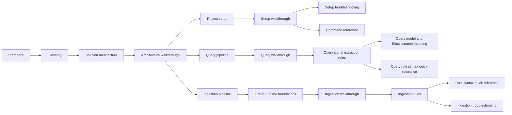

# UKHO.Search Wiki

Welcome to the developer wiki for `UKHO.Search`.

Use this page as the start of the repository reading path. It explains what the solution does, where to go next for your role, and which pages matter most when you are tracing architecture, setting up the stack, or extending ingestion, query, and host-level features.

## What this repository does

`UKHO.Search` combines four closely related concerns:

- a provider-aware **ingestion pipeline** that turns source messages into a shared search shape
- a **query path** that reads from the indexed canonical form
- an **Aspire AppHost** that orchestrates the local developer environment
- a set of **developer tools** that make File Share workflows, rule authoring, and runtime investigation practical during day-to-day development

The repository's central contract is the [`CanonicalDocument`](Glossary#canonicaldocument). Providers build or enrich that shared model, the infrastructure layer projects it into Elasticsearch, and the query side reads the indexed result.

That query-side statement now has more substance than a simple host shell. `QueryServiceHost` no longer stops at a stubbed UI adapter. The active query path normalizes incoming search text, runs Microsoft Recognizers behind the inward `ITypedQuerySignalExtractor` abstraction, retains repository-owned temporal and numeric signals on the `QueryPlan`, projects recognized years into the canonical `majorVersion` field, loads flat global query rules from `rules/query` through the `rules:query:*` configuration namespace, applies rule-driven concept expansion, explicit non-scoring filters, explicit boost clauses, and sort intent before residual defaults run, and only then asks Elasticsearch to execute the resulting request. This matters for contributors because the query host is now a real vertical slice through the Onion Architecture rather than a temporary façade over fixed sample data. It also means future query semantics such as rule-driven sort intent, year-aware filtering, and score tuning now have a stable typed foundation instead of having to infer everything from raw residual text alone.

```mermaid
flowchart LR
    Start[Start here] --> Glossary[Glossary]
    Glossary --> Architecture[Solution architecture]
    Architecture --> Walkthrough[Architecture walkthrough]
    Walkthrough --> Setup[Project setup]
    Setup --> SetupWalkthrough[Setup walkthrough]
    SetupWalkthrough --> SetupTroubleshooting[Setup troubleshooting]
    SetupWalkthrough --> CommandReference[Command reference]
    Walkthrough --> Ingestion[Ingestion pipeline]
    Walkthrough --> Query[Query pipeline]
    Query --> QueryWalkthrough[Query walkthrough]
    QueryWalkthrough --> QueryRules[Query signal extraction rules]
    QueryRules --> QueryMapping[Query model and Elasticsearch mapping]
    QueryRules --> QueryRuleReference[Query rule syntax quick reference]
    Ingestion --> Runtime[Graph runtime foundations]
    Runtime --> IngestionWalkthrough[Ingestion walkthrough]
    IngestionWalkthrough --> Rules[Ingestion rules]
    Rules --> RuleReference[Rule syntax quick reference]
    Rules --> IngestionTroubleshooting[Ingestion troubleshooting]
```

## Reading routes by audience

| If you are... | Start with | Then continue to |
|---|---|---|
| New to the repository | [Glossary](Glossary) | [Solution architecture](Solution-Architecture) -> [Architecture walkthrough](Architecture-Walkthrough) -> [Project setup](Project-Setup) |
| Setting up the local stack | [Project setup](Project-Setup) | [Setup walkthrough](Setup-Walkthrough) -> [Setup troubleshooting](Setup-Troubleshooting) -> [Appendix: command reference](Appendix-Command-Reference) -> [Tools: `FileShareImageLoader` and `FileShareEmulator`](Tools-FileShareImageLoader-and-FileShareEmulator) |
| Working on ingestion | [Ingestion pipeline](Ingestion-Pipeline) | [Ingestion graph runtime foundations](Ingestion-Graph-Runtime) -> [Ingestion walkthrough](Ingestion-Walkthrough) -> [Ingestion rules](Ingestion-Rules) -> [Appendix: rule syntax quick reference](Appendix-Rule-Syntax-Quick-Reference) -> [Ingestion troubleshooting](Ingestion-Troubleshooting) |
| Producing remote ingestion messages | [Remote ingestion producer guide](Remote-Ingestion-Producer-Guide) | [../src/UKHO.Search.Ingestion.Contracts/README.md](../src/UKHO.Search.Ingestion.Contracts/README.md) -> [Solution architecture](Solution-Architecture) -> [Ingestion walkthrough](Ingestion-Walkthrough) |
| Working on query or search semantics | [Query pipeline](Query-Pipeline) | [Query walkthrough](Query-Walkthrough) -> [Query signal extraction rules](Query-Signal-Extraction-Rules) -> [Query model and Elasticsearch mapping](Query-Model-and-Elasticsearch-Mapping) -> [Appendix: query rule syntax quick reference](Appendix-Query-Rule-Syntax-Quick-Reference) |
| Working on browser hosts or Blazor UI | [Solution architecture](Solution-Architecture) | [Architecture walkthrough](Architecture-Walkthrough) -> [Query pipeline](Query-Pipeline) -> [Query walkthrough](Query-Walkthrough) -> current next-gen work packages under `dev/work-packages/120-*` and `dev/specs/next-gen-arc0*-wp.md` |
| Tracing repository history or design background | [Documentation source map](Documentation-Source-Map) | Related work-package documents in `dev/work-packages/mvp/` |

## Major areas of the wiki

### Architecture

Start with [Solution architecture](Solution-Architecture) for the current repository shape, project responsibilities, and runtime boundaries. Then continue to [Architecture walkthrough](Architecture-Walkthrough) for a code-oriented explanation of how requests, tools, and startup flows move through the solution.

### Setup

[Project setup](Project-Setup) is the narrative entry point for the local AppHost-driven workflow, the `runmode` model, and the File Share data-image loop. Follow it with [Setup walkthrough](Setup-Walkthrough), [Setup troubleshooting](Setup-Troubleshooting), and [Appendix: command reference](Appendix-Command-Reference) when you need the full guided onboarding path.

### Ingestion

[Ingestion pipeline](Ingestion-Pipeline) is the conceptual entry point for the message-processing path. Follow it with [Ingestion graph runtime foundations](Ingestion-Graph-Runtime) for the generic base library and terminology, then [Ingestion walkthrough](Ingestion-Walkthrough), [Ingestion rules](Ingestion-Rules), [Appendix: rule syntax quick reference](Appendix-Rule-Syntax-Quick-Reference), and [Ingestion troubleshooting](Ingestion-Troubleshooting) when you need to understand runtime flow, rule evaluation, canonical indexing, and failure handling.

For remote queue-message authoring rather than runtime processing, start instead with [Remote ingestion producer guide](Remote-Ingestion-Producer-Guide) and then continue to the canonical package guide in [../src/UKHO.Search.Ingestion.Contracts/README.md](../src/UKHO.Search.Ingestion.Contracts/README.md).

### Query

[Query pipeline](Query-Pipeline) is the conceptual entry point for the read side. Follow it with [Query walkthrough](Query-Walkthrough) when you need the code-oriented runtime trace, [Query signal extraction rules](Query-Signal-Extraction-Rules) when you need the full explanation of `rules/query/*.json`, [Query model and Elasticsearch mapping](Query-Model-and-Elasticsearch-Mapping) when you need the contract-level mapping story, and [Appendix: query rule syntax quick reference](Appendix-Query-Rule-Syntax-Quick-Reference) when you need a shorter authoring lookup. When the conceptual pages make sense and you are ready to prove local runtime behavior, return to [Project setup](Project-Setup) and [Setup walkthrough](Setup-Walkthrough) for the services-mode query verification path.

### Browser hosts and developer tooling

The legacy Workbench tree under `src/Workbench/` was deleted by WP126 and is no longer part of the active repository runtime. Current browser-host work starts from [Solution architecture](Solution-Architecture), [Architecture walkthrough](Architecture-Walkthrough), [Project setup](Project-Setup), and the active next-gen planning material under `dev/work-packages/120-*`, `dev/work-packages/126-*`, and `dev/specs/next-gen-arc0*-wp.md`.

### Troubleshooting and observability

[Setup troubleshooting](Setup-Troubleshooting) covers environment bring-up issues, [Ingestion troubleshooting](Ingestion-Troubleshooting) covers queue, rules, and dead-letter symptoms, and [Metrics in the Aspire dashboard](Metrics-in-the-Aspire-Dashboard) remains the runtime visibility companion for local orchestration, indexing, and performance symptoms.

### Glossary

[Glossary](Glossary) centralizes repository vocabulary such as `CanonicalDocument`, provider model, query plan, and AppHost terminology. Read it early if the repository-specific terms are unfamiliar.

### Appendices and supporting references

Several pages are intentionally deeper reference material rather than first-read narrative pages. Useful starting points are [Appendix: command reference](Appendix-Command-Reference), [Documentation source map](Documentation-Source-Map), [Provider metadata and split registration](Provider-Metadata-and-Split-Registration), and the more specialized ingestion and tooling pages linked throughout this wiki.

## Quick orientation

### Main runtime entry points

| Path | Responsibility |
|---|---|
| `src/Hosts/AppHost` | Starts the local Aspire-orchestrated environment and switches between import, services, and export workflows. |
| `src/Hosts/IngestionServiceHost` | Hosts the ingestion runtime, infrastructure wiring, and indexing path. |
| `src/Hosts/QueryServiceHost` | Hosts the query-facing runtime, including UI composition, query planning entry, and Elasticsearch-backed execution of repository-owned query plans. |
| `tools/FileShareEmulator` | Provides the local File Share emulator UI and API. |
| `tools/RulesWorkbench` | Provides rule inspection, evaluation, and checker tooling. |

### Core implementation areas

| Path | Responsibility |
|---|---|
| `src/UKHO.Search` | Channel-based pipeline runtime, supervision, metrics, and core primitives. |
| `src/UKHO.Search.ProviderModel` | Shared provider identity, metadata, catalogs, and split registration helpers. |
| `src/UKHO.Search.Ingestion` | Ingestion contracts and the canonical discovery model. |
| `src/UKHO.Search.Query` | Query-owned canonical model, query-plan contracts, and search-result contracts that sit inward of the query host. |
| `src/UKHO.Search.Services.Query` | Query normalization and planning orchestration that turns raw search text into repository-owned query plans, including safe typed-signal projection, flat rule evaluation, concept expansion, sort-hint generation, and residual-content handling. |
| `src/UKHO.Search.Infrastructure.Query` | Elasticsearch request mapping and execution adapters for the query-side runtime, including the Microsoft Recognizers-backed typed extraction adapter, the configuration-backed flat query-rule catalog, and rule refresh monitoring that are kept behind inward query abstractions. |
| `src/Providers/UKHO.Search.Ingestion.Providers.FileShare` | Concrete File Share provider processing graph and enrichers. |
| `src/UKHO.Search.Infrastructure.Ingestion` | Queue, blob dead-letter, bootstrap, and Elasticsearch integration. |
### Common first workflow

1. Read the [Glossary](Glossary) if the repository terms are new.
2. Read [Solution architecture](Solution-Architecture) for the stable current-state map.
3. Read [Architecture walkthrough](Architecture-Walkthrough) to trace the main repository flows.
4. Follow [Project setup](Project-Setup) and [Setup walkthrough](Setup-Walkthrough) if you need a local environment.
5. Move into the ingestion, query, or browser-host planning material that matches the area you are changing.

## Design themes that show up across the repository

- **Onion architecture** keeps dependency direction moving inward.
- **Provider-aware ingestion** preserves source-specific behaviour while normalizing into a shared discovery contract.
- **Canonical indexing** gives query and diagnostics features one stable search shape.
- **Rules-driven enrichment** adds mapping flexibility without hard-coding every transformation into the pipeline.
- **Developer tooling** is part of the normal workflow, not an afterthought.
- **Browser-host ownership** is being split deliberately between the public query host and a future internal workbench host rather than being inherited from the deleted legacy shell.

## Related supporting pages

- [CanonicalDocument and discovery taxonomy](CanonicalDocument-and-Discovery-Taxonomy)
- [Setup walkthrough](Setup-Walkthrough)
- [Setup troubleshooting](Setup-Troubleshooting)
- [Appendix: command reference](Appendix-Command-Reference)
- [Query pipeline](Query-Pipeline)
- [Query walkthrough](Query-Walkthrough)
- [Query signal extraction rules](Query-Signal-Extraction-Rules)
- [Query model and Elasticsearch mapping](Query-Model-and-Elasticsearch-Mapping)
- [Appendix: query rule syntax quick reference](Appendix-Query-Rule-Syntax-Quick-Reference)
- [Ingestion graph runtime foundations](Ingestion-Graph-Runtime)
- [Ingestion walkthrough](Ingestion-Walkthrough)
- [Ingestion rules](Ingestion-Rules)
- [Appendix: rule syntax quick reference](Appendix-Rule-Syntax-Quick-Reference)
- [Ingestion troubleshooting](Ingestion-Troubleshooting)
- [Ingestion service provider mechanism](Ingestion-Service-Provider-Mechanism)
- [Provider metadata and split registration](Provider-Metadata-and-Split-Registration)
- [Tools: `RulesWorkbench`](Tools-RulesWorkbench)
- [Metrics in the Aspire dashboard](Metrics-in-the-Aspire-Dashboard)

_Current as of 2026-04-16._
