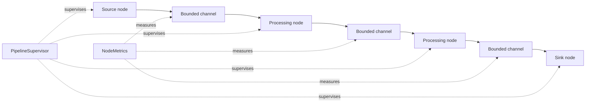
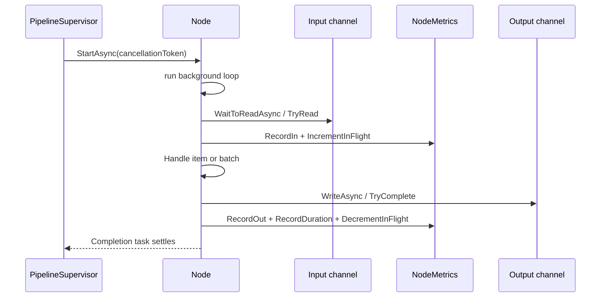
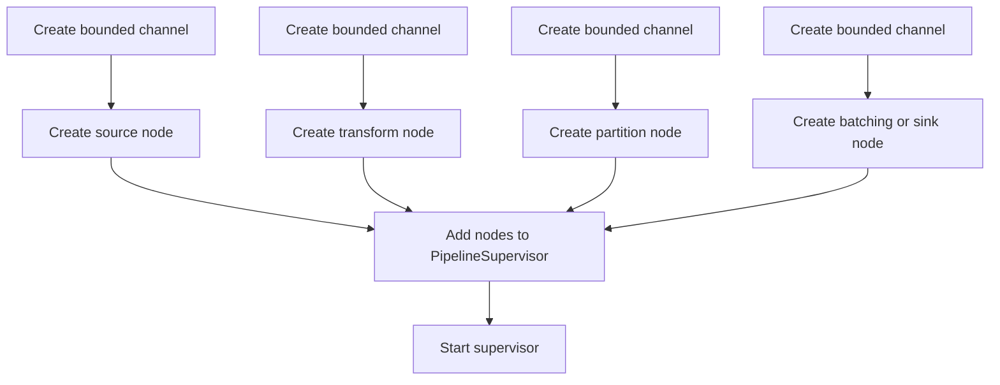
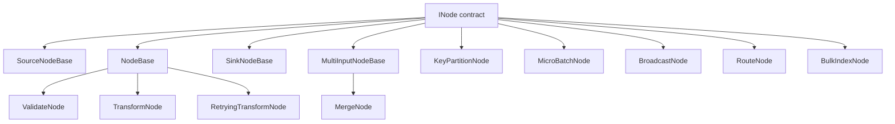

# Ingestion graph runtime foundations

Use this page when you want to understand the generic base graph runtime that sits underneath ingestion.

This page is intentionally not the File Share story and not the rules story. It is the deeper architectural explanation of the reusable node-and-channel runtime in `src/UKHO.Search`. The other ingestion pages explain what the current ingestion system does. This page explains how the underlying graph library is built, what it provides, and why the rest of the ingestion code is shaped around it.

If the other ingestion pages are meant to read like a guided tour through a working system, this page is meant to read like the chapter that explains the machine room under the floorboards.

## Reading path

Start with [Ingestion pipeline](Ingestion-Pipeline) for the overall ingestion narrative. Then read this page when you want the architectural basis behind the runtime terms used there. Continue to [Ingestion walkthrough](Ingestion-Walkthrough) when you are ready to see those ideas expressed in the concrete File Share graph.

## The problem this runtime is trying to solve

The repository does not model ingestion as one long method that polls a queue, performs some validation, does some enrichment, and writes into Elasticsearch. That kind of implementation might appear simpler at first glance, but in practice it hides the very things that matter most in an ingestion system: where work is waiting, where ordering matters, where failures belong, which stages are slow, and how pressure should move through the system.

The domain problem is awkward in several ways at once. Input is continuous and asynchronous. The cost of work is uneven. Some requests are cheap to validate and expensive to enrich. Some document keys may be quiet for long periods, while others may become very busy. Bulk indexing wants grouped work, but correctness still demands that related updates remain ordered. Operators and developers need to see whether the system is healthy, blocked, idle, or backlogged, and they need to answer those questions without reverse-engineering a single giant loop full of tasks and callbacks.

The generic graph runtime exists because those concerns are not File Share concerns and not Elasticsearch concerns. They are runtime concerns. The repository therefore solves them once in a reusable set of primitives: messages are wrapped in envelopes, work moves through channels, nodes define explicit processing boundaries, supervision coordinates node lifetime, and metrics are emitted at those boundaries.

## The project area that provides the runtime

The generic graph runtime lives in `src/UKHO.Search`, mostly under the `Pipelines` namespace family.

The important areas are:

| Path | Responsibility |
|---|---|
| `src/UKHO.Search/Pipelines/Messaging` | message envelopes, message state, and context |
| `src/UKHO.Search/Pipelines/Channels` | bounded-channel creation and queue-depth tracking |
| `src/UKHO.Search/Pipelines/Nodes` | generic node base classes and reusable node implementations |
| `src/UKHO.Search/Pipelines/Supervision` | graph lifetime and fatal-error coordination |
| `src/UKHO.Search/Pipelines/Metrics` | per-node instrumentation and queue-depth observability |
| `src/UKHO.Search/Pipelines/Errors` | structured pipeline error information |
| `src/UKHO.Search/Pipelines/Batching` | microbatch envelope types |
| `src/UKHO.Search/Pipelines/Retry` | retry policy contracts and backoff helpers |
| `src/UKHO.Search/Pipelines/DeadLetter` | dead-letter metadata and payload diagnostic helpers |

That list matters because it shows that the runtime is not just **some helper classes**. It is a coherent subsystem with its own message model, lifecycle model, instrumentation model, and error model.

## A conceptual picture of the runtime before any provider-specific graph exists

Before thinking about validation, enrichment, or indexing, it helps to picture the generic runtime as a grammar for building graphs.

That diagram is deliberately generic. It shows the architectural point: nodes do not call one another directly in a long synchronous chain. Instead, they communicate through explicit bounded channels. The supervisor sits above the graph rather than inside one node. Metrics are attached to graph boundaries rather than bolted on only at the host edge.

## Why `System.Threading.Channels` is the foundation

The runtime uses `System.Threading.Channels` because ingestion is fundamentally a producer-consumer problem with uneven stage costs and asynchronous boundaries.

A channel lets one part of the system write work while another part reads that work later, potentially at a different speed, without forcing the design into shared mutable queues guarded by manual locks and without turning every stage into a direct synchronous dependency on the next. That fits ingestion unusually well. Queue polling, validation, partitioning, enrichment, batching, and indexing do not all move at the same speed. They should not be forced to pretend they do.

Channels also make handoff points real. When a message passes from one node to another through a channel, the code has a concrete place where capacity can be enforced, where queue depth can be observed, and where operational questions can be answered. If the pipeline used little more than chained async methods, the handoff boundaries would still exist in reality, but they would be much harder to see and much harder to measure.

This is why the result is not merely **œasync code**. It is a runtime with explicit seams.

## Why the channels are bounded rather than unbounded

The runtime deliberately uses bounded channels via `BoundedChannelFactory` rather than allowing each stage to accumulate unlimited in-memory work.

The underlying factory is simple but important. `BoundedChannelFactory.Create(...)` creates a bounded channel with `BoundedChannelFullMode.Wait` and wraps it in a `CountingChannel<T>`. That one choice says a great deal about the philosophy of the runtime.

If a downstream stage is slower than an upstream stage, the system has only a few honest options. It can drop data. It can buffer without limit and hope memory does not become the problem. Or it can slow upstream production down until downstream capacity becomes available. For ingestion, dropping data is unacceptable and unbounded buffering is dangerous. The runtime therefore chooses the third option.

That is the design basis of **backpressure**.

## What backpressure means in readable terms

Backpressure means the system refuses to lie about available capacity.

The best plain-English picture is a series of conveyor belts between workstations. If the packaging station is already full, the belt feeding it cannot continue accepting crates forever. At some point the previous station has to slow down too. In this runtime, the channels are those belts. A bounded channel fills up. Once it is full, writers wait. That waiting is not an accident and not an implementation inconvenience. It is the mechanism by which the runtime keeps memory growth under control and makes bottlenecks visible.

So when the documentation says the graph applies backpressure, it means that slow work in one part of the graph naturally causes earlier stages to pause instead of letting the system either overflow or silently lose work.

## The message model: why everything moves as `Envelope<T>`

At the heart of the runtime is `Envelope<TPayload>`. It is the generic message wrapper defined in `src/UKHO.Search/Pipelines/Messaging/Envelope.cs`.

An envelope contains far more than a payload. It carries:

- `MessageId`
- `Key`
- `TimestampUtc`
- `Attempt`
- `Headers`
- `Context`
- `Status`
- `Error`

That design is one of the key reasons the runtime remains coherent. Cross-cutting concerns such as retries, breadcrumbs, dead-letter routing, queue acknowledgement, and message identity are attached to the message itself rather than scattered across unrelated method parameters and local state.

Two methods on `Envelope<T>` are especially important for understanding how the graph is built.

First, `MapPayload<TOut>(...)` creates a new envelope with a different payload type while preserving message identity, attempt count, headers, context, status, and error. That is how transform nodes can change payload shape without losing the runtime metadata that later nodes still need.

Second, methods such as `MarkFailed(...)`, `MarkRetrying(...)`, `MarkOk()`, and `MarkDropped(...)` make message state transitions explicit. A message does not merely **have an exception somewhere**. It has a pipeline-level state that later nodes and metrics can observe.

## Message context and breadcrumbs

The `Context` on an envelope is another important part of how the runtime is built. It allows nodes to attach breadcrumbs and runtime-specific contextual data without contaminating the payload type itself. That matters because payload types belong to the domain or provider model, whereas breadcrumbs, acknowledgement callbacks, and operational context belong to the runtime.

This is a recurring architectural theme in the graph library: provider-specific and transport-specific concerns are carried alongside the payload, not pushed into the payload.

## The core node shape

A **node** in this runtime is a single processing stage with an explicit input/output contract, explicit metrics, explicit cancellation behavior, and explicit lifetime management.

The generic base classes in `src/UKHO.Search/Pipelines/Nodes` are the runtime's real skeleton. The concrete nodes matter, but these base classes explain how the graph is built.

Before looking at the individual base classes, it helps to understand the architectural promise they all share. A node in this runtime is not just a function plus a queue. Every node has a standard lifecycle, a standard completion surface, a standard metric surface, and a standard error-reporting path. That consistency is one of the most valuable things the library provides.

## What every node lifecycle has in common

Although the base classes differ in the details of how they read and write, they all follow the same broad pattern.

That picture is intentionally generic, but it matters because it shows how much of the runtime shape is standardized. The base classes do not merely save some repeated code. They enforce a common way of reading, measuring, writing, completing outputs, and surfacing fatal faults.

### `NodeBase<TIn, TOut>`

`NodeBase<TIn, TOut>` is the main base class for one-input, one-output processing stages.

Architecturally, it provides several things at once:

- a standard `StartAsync(...)` entrypoint
- a standard completion model
- a run loop built on `ChannelReader<TIn>`
- a `WriteAsync(...)` helper for writing to the output channel and recording metrics
- queue-depth-aware metrics when the input channel exposes `IQueueDepthProvider`
- cancellation handling that can either stop immediately or drain buffered work, depending on `CancellationMode`
- fatal-error reporting via `IPipelineFatalErrorReporter`

The essential pattern is simple: the base class owns the run loop, metrics lifecycle, completion semantics, and exception handling, while a derived node only implements `HandleItemAsync(...)`.

That is an important design choice. It means every node in the graph is not reinventing how it starts, how it records duration, how it increments inflight counters, or how it reports fatal errors. The base runtime centralizes that shape.

There are several details in `NodeBase<TIn, TOut>` that are especially important to understand.

First, `StartAsync(...)` does not run the work inline. It creates a background task that owns the node's run loop. This is why the supervisor can start a whole graph and then coordinate completion externally.

Second, the run loop is built around `WaitToReadAsync(...)` followed by `TryRead(...)`. That pattern matters because it avoids unnecessary allocations and lets one readiness check drain all currently available items before awaiting again.

Third, the base class records metrics around each item by calling `RecordIn`, incrementing inflight count, timing the handling work, then recording duration and decrementing inflight count in a `finally` block. This means per-item timing remains accurate even when handler logic throws.

Fourth, `CompleteOutputs(...)` is centralized. Normal completion, cancellation, and fault completion all converge on explicit output completion rather than leaving downstream nodes to infer what happened.

Fifth, the base class can optionally drain buffered work on cancellation when `CancellationMode.Drain` is selected. That is a strong example of the runtime encoding policy rather than leaving each node to improvise its own shutdown story.

### `SourceNodeBase<TOut>`

`SourceNodeBase<TOut>` is the equivalent base class for nodes that produce work rather than consuming it from an input channel.

Instead of `HandleItemAsync(...)`, it exposes `ProduceAsync(...)`. The base class still manages node lifetime, completion, metrics, output completion, cancellation, and fatal-error reporting. In other words, a source node participates in the same runtime discipline as the rest of the graph even though it has no input channel.

This is why queue-ingress nodes can still look like first-class members of the graph rather than like something special bolted on at the edge.

### `SinkNodeBase<TIn>`

`SinkNodeBase<TIn>` is the mirror image for terminal nodes that consume input without writing to a normal downstream output.

A sink still participates in the same lifecycle and instrumentation model. The graph runtime therefore treats **the last step** as just another node boundary instead of as a place where structure disappears.

That matters for dead-letter sinks, diagnostics sinks, and acknowledgement sinks. Even though they are terminal destinations, they still need metrics, consistent cancellation behavior, and fatal-error reporting.

### `MultiInputNodeBase<T1, T2, TOut>`

`MultiInputNodeBase<T1, T2, TOut>` is the base class for nodes that merge or otherwise coordinate two inputs.

This class is particularly important because it shows that the runtime is not just a linear pipeline toolkit. It is a graph toolkit. The base class owns a fair loop over two readers, queue-depth aggregation across both inputs, per-item metrics, and coordinated completion semantics. Derived nodes only implement `HandleInput1Async(...)` and `HandleInput2Async(...)`.

This is what allows merge-style nodes to be built without each implementation inventing its own concurrency and fairness rules.

The fairness point is worth slowing down for. A naïve two-input merge often ends up preferring whichever input is already busy, which can starve the quieter side. `MultiInputNodeBase<T1, T2, TOut>` deliberately alternates preference and waits on both readers when needed. In other words, fairness is not accidental here. It is designed into the base class.

## The node taxonomy the runtime provides

Once the base classes are in place, the runtime provides a family of reusable concrete nodes. These are not provider-specific ingestion nodes. They are generic graph-building pieces.

### `ValidateNode<TPayload>`

`ValidateNode<TPayload>` is a one-input, one-output node built on `NodeBase<Envelope<TPayload>, Envelope<TPayload>>`. Its role is to inspect an envelope, mark it failed when validation logic determines the message is no longer acceptable, and optionally route failed items to a separate error output.

This is a subtle but important pattern in the graph library. Validation does not need to throw to be meaningful. A message can be marked failed and still continue through selected graph paths for dead-letter or diagnostics handling.

### `TransformNode<TIn, TOut>`

`TransformNode<TIn, TOut>` changes payload shape while preserving the surrounding envelope contract. Because it uses `MapPayload(...)`, the graph keeps message identity and context intact even as the payload type changes.

This is one of the key building blocks for turning one stage's domain object into the next stage's domain object without losing runtime metadata.

### `RetryingTransformNode<TIn, TOut>`

`RetryingTransformNode<TIn, TOut>` builds retry behavior into a transform stage. It uses an `IRetryPolicy`, marks envelopes as retrying or failed, increments attempt count, and can route failed work to a dedicated error output.

Architecturally, this is important because it shows that the graph runtime treats retries as explicit message-state transitions rather than as invisible internal loops with no outward semantics.

### `KeyPartitionNode<TPayload>`

`KeyPartitionNode<TPayload>` is one of the most important runtime nodes in the entire library. It reads one input stream and writes each envelope to one of several outputs based on a stable FNV-1a hash of `Envelope.Key`.

This is the node that creates **lanes**.

It is worth being precise here. A lane is not a magical object in the codebase. It is the result of partitioning one input stream across multiple outputs and then ensuring each of those outputs is processed sequentially by downstream nodes. In other words, lanes are a graph topology pattern implemented by the partition node plus the downstream node arrangement.

### `MicroBatchNode<TPayload>`

`MicroBatchNode<TPayload>` gathers per-item envelopes into a `BatchEnvelope<TPayload>`. It flushes based on maximum item count, maximum delay, and optionally estimated byte thresholds.

This is the generic runtime answer to the tension between per-item semantics and bulk-operation efficiency. The node preserves per-item identity by keeping the batch items as envelopes, but it exposes them in a grouped form that downstream bulk operations can use efficiently.

### `MergeNode<TIn>`

`MergeNode<TIn>` is a straightforward concrete use of `MultiInputNodeBase`. It forwards envelopes from either input into one output while preserving message context and breadcrumbs.

The point of the node is less about complexity and more about discipline. Even a simple **join these two streams** operation is expressed as a proper node with completion, fairness, and metrics rather than as an ad hoc task.

### `BroadcastNode<TIn>`

`BroadcastNode<TIn>` takes one input stream and writes clones of each envelope to multiple outputs. The presence of required and optional outputs, plus `BroadcastMode`, shows that the runtime has a first-class notion of fan-out, including best-effort diagnostic or optional sink scenarios.

### `RouteNode<TIn>`

`RouteNode<TIn>` chooses an output channel from a route key derived from the current envelope. If the route does not exist, it can mark the message failed and send it to an error output.

This is the runtime's generic **branch by key** facility, distinct from hash partitioning.

### `BulkIndexNode<TDocument>`

`BulkIndexNode<TDocument>` is still generic even though its most obvious use is ingestion indexing. It consumes `BatchEnvelope<TDocument>`, calls an `IBulkIndexClient<TDocument>`, and then routes each original envelope to success, retry, or error outputs depending on the response.

Its importance here is architectural: it shows how batch-level external work is translated back into per-message outcomes.

## Supporting runtime helpers that make the graph viable

The node classes are only part of the story. Several supporting helpers are what make the graph approach practical instead of merely elegant.

### `BoundedChannelFactory`

`BoundedChannelFactory` is the standard way the runtime creates channels. It bakes in a bounded channel, optional single-reader and single-writer hints, `BoundedChannelFullMode.Wait`, and the `CountingChannel<T>` wrapper. That means bounded capacity and queue-depth awareness are not optional afterthoughts. They are the default runtime posture.

### `CountingChannel<T>`

`CountingChannel<T>` wraps a normal channel with a depth counter updated by custom reader and writer wrappers. This means backlog is measured at the channel itself rather than guessed from node-local observations. That design is deceptively simple, but it is a major part of why the runtime is so observable.

### `NodeMetrics`

`NodeMetrics` is where per-node counters, gauges, and histograms live. The most important conceptual detail is that metrics are tagged by node name and, when relevant, by provider name. That lets the same generic runtime report meaningful node-level telemetry across more than one provider graph without becoming provider-specific itself.

### `PipelineError`

`PipelineError` gives the runtime a structured way to describe what went wrong. That matters because a pipeline failure is not just an exception string. It has category, code, node name, transient/non-transient intent, occurrence timestamp, and optional details. Structured error state is one reason dead-letter and retry behaviour can remain coherent.

### Retry policy contracts

The retry infrastructure under `src/UKHO.Search/Pipelines/Retry` is another important signpost. The runtime does not treat retries as one-off loops buried inside concrete nodes. It models retry policy as a contract, with delay calculation and retry decisions living alongside the node that uses them. That keeps retry behaviour explicit and testable.

## A more concrete mental model of how graphs are assembled

The generic runtime gives you pieces rather than one grand builder. A graph is assembled by creating bounded channels, wiring readers and writers into nodes, and then giving those nodes to a `PipelineSupervisor`.

Conceptually, that looks like this:

This style of assembly matters because it keeps topology explicit. A contributor can see which channels exist, which nodes own which readers and writers, and which branches are intended to exist. The graph is built in code, but it is still readable as architecture rather than as a hidden scheduling trick.

Another useful way to picture graph assembly is as a repeated rhythm:

1. create a bounded channel
2. give its reader to one node
3. give its writer to the previous node
4. decide whether this boundary should be measured, partitioned, merged, retried, or batched
5. repeat until the graph ends in one or more sinks

That rhythm is so common in the codebase that, once seen, it becomes much easier to read any concrete graph class.

## The lifecycle model in more detail

Understanding how the runtime is built also means understanding how a graph starts, runs, and stops.

Each node implements `INode`. The common surface is small but meaningful:

- `Name`
- `Completion`
- `StartAsync(...)`
- `StopAsync(...)`

The supervisor starts each node and then waits on the completion tasks. If a completion task faults, the supervisor cancels the graph and then waits for all node completions. The result is a graph that behaves like one coordinated runtime rather than like a loose collection of background tasks.

This is why `PipelineSupervisor` is not a decorative wrapper. It is the component that turns a set of nodes into a managed graph.

There is also a deeper architectural reason this matters. Completion in a graph is difficult to reason about if every stage invents its own rules for when downstream outputs are closed. By making node completion and output completion part of the runtime contract, the library gives downstream nodes a reliable signal that upstream work has truly ended.

## Cancellation modes and draining

Another important runtime detail is `CancellationMode`.

The base node classes can be told either to stop immediately or to drain buffered work during cancellation. That is a subtle but important design feature. Not every node should respond identically when cancellation arrives. In some parts of the graph, abandoning buffered work is acceptable or even desirable. In others, draining already-buffered work is the safer and more comprehensible behavior.

By putting that choice into the base runtime rather than leaving it to ad hoc node-level interpretation, the library keeps cancellation semantics visible and reviewable.

## How queue depth is measured

The queue-depth story is not a side note. It is built directly into the channel layer.

`BoundedChannelFactory.Create(...)` returns `CountingChannel<T>`, not a raw channel. `CountingChannel<T>` wraps the inner channel and uses `CountingChannelReader<T>` and `CountingChannelWriter<T>` to maintain a depth counter. Because the readers expose `IQueueDepthProvider`, node base classes can attach that queue-depth provider directly to `NodeMetrics`.

This is an elegant design choice. Queue depth is measured where it actually exists rather than being approximated elsewhere. The metrics layer therefore reports real backlog at graph boundaries rather than inferred backlog from indirect symptoms.

## Why metrics live at the node boundary

`NodeMetrics` records per-node counters and gauges such as:

- input count
- output count
- failed message count
- dropped message count
- duration histogram
- inflight gauge
- queue-depth gauge

Notice what that means architecturally. The node is both a unit of processing and a unit of observability. That is not accidental. The runtime is designed so that the conceptual step in the graph and the measurable step in the graph are the same thing.

This is one reason the graph can be explained clearly in documentation. The code, the topology, and the telemetry all share the same boundaries.

It also explains why the runtime can support meaningful operational conversations. A developer can say **the queue depth before partitioning is growing** or **the microbatch node is spending longer per flush** and those statements correspond to real runtime constructs rather than vague impressions.

## A second conceptual diagram: how the reusable node shapes combine

The graph library is easier to understand when you see the node taxonomy as families rather than as a flat list of unrelated classes.

This diagram is useful because it separates two questions that are easy to blur together:

- which classes define the reusable lifecycle skeleton
- which classes are ready-made building blocks for concrete graphs

Both are part of the runtime, but they are not the same kind of contribution.

## A readable explanation of the key runtime terms

### `lane`

A lane is one ordered stream of work inside a wider concurrent graph. Messages are placed into lanes by key partitioning. Different lanes can make progress independently, but work within one lane stays sequential. The purpose of the lane is not merely concurrency control. It is the mechanism by which the runtime preserves per-key ordering without sacrificing all overall throughput.

### `hot key`

A hot key is a message key that receives a disproportionate amount of work. Because partitioning routes equal keys to the same lane, a hot key can make one lane much busier than others. This is often visible as one lane building backlog while others remain healthy. That symptom is useful because it tells you the runtime is protecting ordered work for one key rather than merely becoming uniformly slow.

### `backpressure`

Backpressure is the effect of bounded channels and `Wait` full-mode behavior. It means that when a downstream stage cannot accept more work, the upstream writer pauses instead of dropping data or buffering without bound. In practical terms, backpressure is how the runtime translates downstream slowness into controlled upstream waiting.

### `lane-blocking retry`

Lane-blocking retry means that when work for one lane must be retried, later work for that same lane does not leapfrog it. This is a direct consequence of the promise the lane exists to keep: related work remains ordered until the current item or batch has either succeeded or reached a terminal failure path.

### `fail-fast supervision`

Fail-fast supervision means the runtime distinguishes between per-message failures and graph-structural failures. Message failures are routed as data through dead-letter or retry paths. Structural node failures are treated as evidence that the graph itself is no longer trustworthy, so the supervisor cancels the graph rather than allowing a half-broken runtime to limp on invisibly.

## Why ordering is preserved by key rather than globally

The runtime does not attempt to preserve one absolute ordering across the entire pipeline. Doing so would make concurrency far less useful, because unrelated work would be forced to wait behind other unrelated work.

Instead, the runtime preserves ordering by key. That is the level at which correctness matters for ingestion. Messages that could logically conflict with one another share a key and therefore share a lane. Unrelated messages are free to proceed concurrently in different lanes.

This is a good example of the graph being designed around the actual consistency requirement of the domain rather than around an abstract preference for total ordering.

## Why retries block the lane

This is one of the most important design decisions in the whole runtime.

When a per-lane indexing or retrying stage performs an inline retry, it blocks that lane until the retry either succeeds or reaches a terminal failure. At first glance this can feel inefficient, because later messages are waiting behind the one that is currently failing. But letting later work pass would quietly destroy the ordering guarantee that justified the lane structure in the first place.

So lane-blocking retry is not an unfortunate side effect. It is the runtime making a strict promise: later work for a key is not allowed to pretend earlier work has already been resolved.

## Why supervision is fail-fast

`PipelineSupervisor` exists because a graph of autonomous background tasks can fail in confusing and dangerous ways if each node is left to manage its own fate independently.

The runtime therefore distinguishes between two kinds of failure.

The first kind is **business-data failure**. A request may be invalid. A transform may reach a known terminal error. An index operation may fail and need dead-letter or retry handling. Those failures belong to the message. The graph can keep running.

The second kind is **structural runtime failure**. A node may crash in a way that suggests the graph itself is no longer trustworthy. In that situation, the runtime does not try to soldier on with partial behaviour. The supervisor cancels the graph and lets the failure become visible.

That is what fail-fast supervision means here. It is a preference for an honest stop over a misleadingly half-alive process.

## How the generic runtime and the concrete ingestion graph relate

It is important not to blur the generic runtime and the concrete ingestion graph together.

The generic runtime provides the grammar:

- envelopes
- channels
- node base classes
- reusable node types
- supervision
- metrics
- retry and batching support

The concrete ingestion graph writes a specific sentence using that grammar:

- validate this request type
- partition by this key
- enrich with these components
- batch at this boundary
- index through this adapter
- route failures to these sinks

The generic runtime therefore explains how a graph is constructed and how it behaves, while the ingestion graph explains the specific work the repository currently performs on top of that foundation.

## Why this matters to contributors

If you only read the provider graph, it is easy to see a chain of classes and miss the architectural intent. Once you understand the generic runtime, the design becomes much more legible.

You can see why nodes are small. You can see why channels are bounded. You can see why queue depth is observable at boundaries rather than guessed from logs. You can see why retries and dead-letter flows are represented as message-state transitions. You can see why some failures belong to the message while others belong to the graph.

Most importantly, you can make better changes. You can tell the difference between a modification that belongs in the reusable graph library and one that belongs only in the File Share provider or only in one specific enrichment step. That distinction is critical. The generic basis of the graph is not incidental scaffolding. It is the architectural reason the ingestion runtime is controllable, testable, and explainable at all.

## Related pages

- [Ingestion pipeline](Ingestion-Pipeline)
- [Ingestion walkthrough](Ingestion-Walkthrough)
- [Ingestion troubleshooting](Ingestion-Troubleshooting)
- [File Share provider](FileShare-Provider)
- [Metrics in the Aspire dashboard](Metrics-in-the-Aspire-Dashboard)
