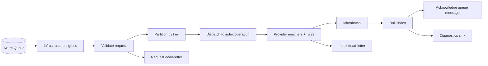
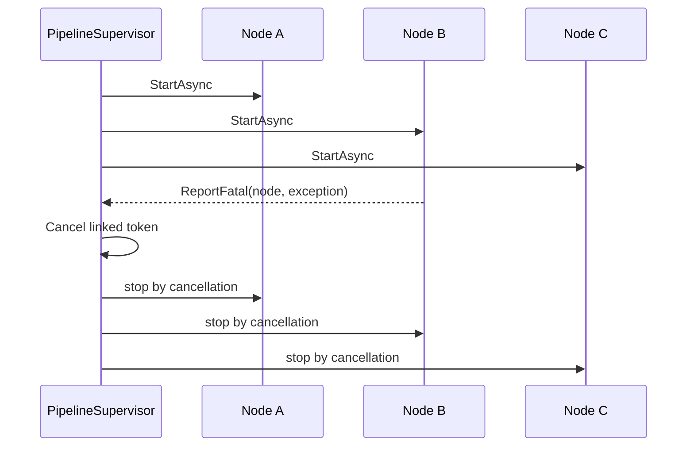

# Ingestion pipeline

This page is the narrative entry point for the ingestion section.

Use it when you want the current repository view of how a provider message becomes a canonical search document, where failure boundaries sit, and which supporting pages to read next.

## Reading path

- Read [Ingestion graph runtime foundations](Ingestion-Graph-Runtime) if you want the in-depth explanation of the generic node/channel runtime that sits underneath the concrete ingestion graph.
- Continue to [Ingestion walkthrough](Ingestion-Walkthrough) for a code-oriented trace through the host, provider, rules, and indexing flow.
- Read [Ingestion rules](Ingestion-Rules) and [Appendix: rule syntax quick reference](Appendix-Rule-Syntax-Quick-Reference) when the change you are making affects canonical enrichment logic.
- Use [Ingestion troubleshooting](Ingestion-Troubleshooting) when the runtime does not behave as expected.
- Keep [File Share provider](FileShare-Provider) and [CanonicalDocument and discovery taxonomy](CanonicalDocument-and-Discovery-Taxonomy) nearby when you need the provider-specific and canonical-model details.

## What the ingestion runtime is trying to achieve

The current ingestion runtime turns source-specific queue messages into provider-independent search documents.

At a high level it:

1. polls provider queues
2. validates incoming requests
3. partitions work by key into ordered lanes
4. creates index operations and minimal canonical documents
5. applies provider enrichers and rules
6. micro-batches and bulk indexes the result
7. acknowledges success or persists terminal failures to dead-letter storage

That sequence is intentionally split across infrastructure, provider, and canonical-model boundaries so a provider can stay source-specific without teaching the rest of the repository its private schema.

## Current runtime map



The current concrete processing graph lives in `src/Providers/UKHO.Search.Ingestion.Providers.FileShare/Pipeline/FileShareIngestionProcessingGraph.cs`.

## The generic runtime matters as much as the concrete graph

One risk in documentation like this is that the concrete File Share graph can crowd out the more general architecture it is built on. That would leave the reader with a list of stages but not with the deeper explanation of why the runtime behaves the way it does.

The concrete graph is only half of the story. Underneath it sits the reusable node-and-channel runtime in `src/UKHO.Search`. That runtime gives the repository its vocabulary of nodes, channels, envelopes, supervision, queue-depth tracking, and metrics. Without that foundation, terms like `lane`, `hot key`, `backpressure`, and `lane-blocking retry` sound like local jargon. With the foundation in view, they become understandable design choices.

If you want that deeper architectural layer explained in detail, read [Ingestion graph runtime foundations](Ingestion-Graph-Runtime) before continuing.

## Why the pipeline runtime is channel-based

The repository uses a channel-based graph because ingestion has to reconcile several needs at once: continuous asynchronous input, bounded memory use, per-key ordering, useful concurrency, and operational visibility.

The generic runtime in `src/UKHO.Search` provides the core pieces that make that possible:

- bounded channels for controlled flow rather than unbounded buffering
- explicit node boundaries so each stage has a clear responsibility
- queue-depth tracking via `CountingChannel`
- fail-fast supervision via `PipelineSupervisor`
- per-node metrics via `NodeMetrics`

In plain English, the runtime is designed to make pressure and ordering visible instead of accidental. If one stage becomes slow, the graph does not hide that slowness behind infinite buffering. If one document key receives disproportionate traffic, the graph preserves correctness for that key even when it makes one lane busier than the others. If one node fails structurally, the graph stops coherently rather than degrading into a half-broken background process.

That is why the channel-based runtime is not an implementation detail. It is the architectural basis of the ingestion system.

## Stage-by-stage view

### 1. Queue ingress stays in infrastructure

Infrastructure owns queue polling, visibility management, poison-queue handling, and acknowledgement plumbing.

By the time a provider sees a message, the runtime has already wrapped it in an `Envelope<IngestionRequest>` that carries:

- message identity
- document key
- timestamps and attempt information
- acknowledgement context
- provider-scoped context needed later in the graph

That split is deliberate: providers should focus on request processing rather than on Azure Queue mechanics.

### 2. Validation rejects structurally bad requests early

`IngestionRequestValidateNode` checks the structural contract before expensive work begins.

Typical checks include:

- exactly one of `IndexItem`, `DeleteItem`, or `UpdateAcl` is present
- payload ids are non-empty
- security tokens are valid when required
- `Envelope.Key` matches the payload id

Validation failures are treated as request-level dead-letter outcomes rather than as graph-fatal exceptions.

### 3. Partitioning preserves ordering per document key

`KeyPartitionNode<T>` hashes `Envelope.Key` into one of `laneCount` ordered lanes.

This is the point where a key term enters the design.

A **lane** is one ordered stream of work inside a wider concurrent graph. The graph can have several lanes active at once, which is where throughput comes from, but each individual lane still processes its own messages sequentially. That gives the runtime a controlled compromise between concurrency and correctness.

What that means in practice is that all messages for the same key stay on the same lane, and later updates for that document cannot jump ahead of earlier work for that same document. The system therefore preserves per-document ordering without forcing the entire ingestion host to process everything one message at a time.

This is also where the idea of a **hot key** becomes relevant. A hot key is simply a document key that receives much more work than most others. Because all work for that key stays on one lane, that one lane can become unusually busy while the rest of the graph remains healthy. That is not necessarily a defect. It is often the runtime preserving the exact ordering guarantee it was designed to protect.

### 4. Dispatch creates index operations and the minimal canonical document

`IngestionRequestDispatchNode` turns a validated request into an `IndexOperation`:

- `IndexItem` -> `UpsertOperation`
- `DeleteItem` -> `DeleteOperation`
- `UpdateAcl` -> `AclUpdateOperation`

For upserts, dispatch also creates the minimal `CanonicalDocument` containing source/provenance fields such as `Id`, `Provider`, `Source`, and `Timestamp`.

Everything developer-facing on the discovery surface is added later by enrichers and rules.

### 5. Enrichment combines provider logic with shared rule logic

`ApplyEnrichmentNode` resolves all registered `IIngestionEnricher` instances, orders them by ordinal, and applies them to the upsert document.

Important current behavior:

- enrichers run inside a scoped DI scope
- provider name is available through `IIngestionProviderContext`
- transient enrichment failures are retried with backoff and jitter
- non-transient or exhausted failures go to index dead letter
- after enrichment completes, the pipeline verifies that the final canonical document retained at least one title

That last rule is important: a document without a retained title is considered a failed ingestion outcome, not a partially useful one.

### 6. Microbatching is the boundary between per-item work and indexing efficiency

`MicroBatchNode<T>` accumulates lane-local items until either:

- `microbatchMaxItems` is reached, or
- `microbatchMaxDelayMilliseconds` expires

The batch metadata keeps enough timing and partition information for diagnostics while still preserving lane ordering.

### 7. Bulk indexing stays lane-blocking on purpose

Infrastructure bulk-index code maps each `IndexOperation` to the Elasticsearch bulk API.

The current projection preserves `Provider` as a `keyword` field so exact-match filtering and provenance diagnostics can distinguish documents by source.

Retries are intentionally lane-blocking. This is one of the most important design decisions in the runtime. If Elasticsearch is slow or rejecting work for one lane, later work for the same key is not allowed to overtake the current batch. The system deliberately chooses correctness over superficial throughput.

That means a slow lane should not automatically be read as a design failure. Sometimes it is the sign that the runtime is doing exactly what it was asked to do: protecting the order of related document updates until the current batch has either succeeded or reached a terminal failure path.

### 8. Acknowledgement only happens on successful terminal outcomes

Successful index operations reach an acknowledgement node that uses the queue acker stored in envelope context to delete the original queue message.

### 9. Dead-lettering is part of the normal operating model

There are two main dead-letter paths:

- **request dead-letter** for invalid or dispatch-failed `IngestionRequest` envelopes
- **index dead-letter** for enrichment or indexing failures on `IndexOperation` envelopes

The dead-letter blob path format is:

- `<deadletterBlobPrefix>/yyyy/MM/dd/<key>/<messageId>.json`

Dead-letter records are intentionally rich enough to help diagnose payload shape, canonical state, and failure reason after the fact.

## Channels, backpressure, and lane health

All graph boundaries use bounded channels from `BoundedChannelFactory`.

Important capacities are configured through settings such as:

- `ingestion:channelCapacityPrePartition`
- `ingestion:channelCapacityPerLane`
- `ingestion:channelCapacityMicrobatchOut`

The runtime uses `BoundedChannelFullMode.Wait`, which means downstream slowness naturally backpressures upstream writers instead of dropping work.

In plain language, **backpressure** means the graph refuses to pretend that every stage can accept unlimited work forever. If a downstream node is full or busy, upstream writers have to wait. That keeps memory growth controlled and makes bottlenecks visible instead of hidden.

Operationally, that means different queue-depth symptoms point at different bottlenecks:

- pre-partition growth can indicate slow ingress, validation, or dispatch
- per-lane growth can indicate a hot key or skewed partitioning
- microbatch output growth often points at downstream indexing pressure

## Supervision and fatal faults

`PipelineSupervisor` starts all nodes and cancels the graph when a node reports a fatal structural/runtime failure.



This preserves a fail-fast model for structural faults while still allowing business-data failures to be represented as dead-letter outcomes instead of process crashes.

## Metrics and observability

`UKHO.Search.ServiceDefaults` subscribes the custom meter `UKHO.Search.Ingestion.Pipeline`.

The runtime emits metrics such as:

- `ukho.pipeline.node.in`
- `ukho.pipeline.node.out`
- `ukho.pipeline.node.failed`
- `ukho.pipeline.node.duration_ms`
- `ukho.pipeline.node.inflight`
- `ukho.pipeline.node.queue_depth`

Use the Aspire dashboard to inspect metrics by node and provider, and pair those metrics with dead-letter blobs and diagnostics output when the graph is misbehaving.

For the full meter contract and local dashboard usage, see [Metrics in the Aspire dashboard](Metrics-in-the-Aspire-Dashboard).

## Practical local commands

Start the full local services stack:

```powershell
dotnet run --project src/Hosts/AppHost/AppHost.csproj
```

Start only the ingestion host when you need a tighter loop:

```powershell
dotnet run --project src/Hosts/IngestionServiceHost/IngestionServiceHost.csproj
```

Run ingestion-focused tests:

```powershell
dotnet test test/UKHO.Search.Infrastructure.Ingestion.Tests/UKHO.Search.Infrastructure.Ingestion.Tests.csproj
```

## When to read the next ingestion pages

| If you need to understand... | Read next |
|---|---|
| The code path from AppHost to provider graph | [Ingestion walkthrough](Ingestion-Walkthrough) |
| Rule syntax, semantics, and authoring flow | [Ingestion rules](Ingestion-Rules) |
| Fast syntax lookups while writing rules | [Appendix: rule syntax quick reference](Appendix-Rule-Syntax-Quick-Reference) |
| Startup, dead-letter, or rules-mismatch symptoms | [Ingestion troubleshooting](Ingestion-Troubleshooting) |

## Related pages

- [Ingestion graph runtime foundations](Ingestion-Graph-Runtime)
- [Ingestion walkthrough](Ingestion-Walkthrough)
- [Ingestion rules](Ingestion-Rules)
- [Appendix: rule syntax quick reference](Appendix-Rule-Syntax-Quick-Reference)
- [Ingestion troubleshooting](Ingestion-Troubleshooting)
- [Ingestion service provider mechanism](Ingestion-Service-Provider-Mechanism)
- [File Share provider](FileShare-Provider)
- [CanonicalDocument and discovery taxonomy](CanonicalDocument-and-Discovery-Taxonomy)
- [Metrics in the Aspire dashboard](Metrics-in-the-Aspire-Dashboard)
