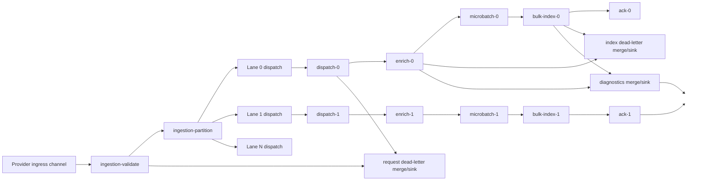
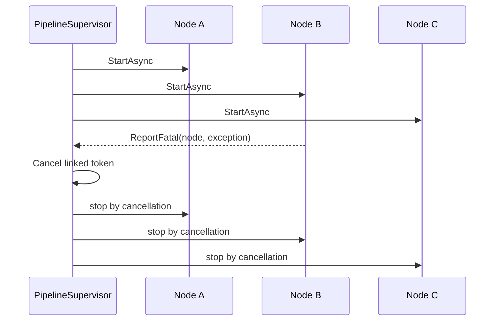

# Ingestion pipeline

The ingestion runtime is a supervised pipeline built on `System.Threading.Channels`.

At a high level it reads provider queue messages, validates them, partitions them by key into ordered lanes, enriches them into canonical index operations, micro-batches those operations, bulk indexes them into Elasticsearch, and persists failures to dead-letter storage.

## Why channels are used

The `src/UKHO.Search` project provides a generic node/channel runtime with these characteristics:

- bounded channels for backpressure
- explicit node boundaries
- queue-depth tracking via `CountingChannel`
- fail-fast supervision via `PipelineSupervisor`
- per-node metrics via `NodeMetrics`

This gives ingestion a deterministic, testable pipeline runtime without coupling the design to a single provider.

## File Share processing graph

The current concrete graph is built in:

- `src/UKHO.Search.Ingestion.Providers.FileShare/Pipeline/FileShareIngestionProcessingGraph.cs`

The graph is lane-based. A single validated request stream is partitioned into `laneCount` independent ordered lanes, and each lane gets its own dispatch, enrichment, batching, indexing, ack, dead-letter, and diagnostics flow.

## Runtime stages

### 1. Queue ingress

Infrastructure owns queue polling and deserialization. Providers own request processing.

The provider-facing contract is:

- `DeserializeIngestionRequestAsync(...)`
- `ProcessIngestionRequestAsync(Envelope<IngestionRequest> ...)`

By the time a request reaches the provider graph, it is already wrapped in an `Envelope<T>` with key/message metadata, queue-ack context, and provider-scoped context needed later in the pipeline.

In practice, queue ingress also includes infrastructure concerns that sit just outside the provider graph:

- polling Azure Queue Storage in batches
- setting and renewing message visibility timeouts while work is in flight
- moving over-dequeued messages to a poison queue
- attaching an acknowledgement/deletion callback into envelope context so successful or dead-lettered terminal outcomes can remove the original queue message

That split is deliberate: infrastructure owns queue mechanics, while the provider owns request processing.

For canonical document construction, the important provider-scoped value is the provider identifier itself. File Share attaches that context at ingress so later generic pipeline nodes can forward it without becoming provider-specific.

### 2. Validation

`IngestionRequestValidateNode` performs structural checks such as:

- exactly one of `IndexItem`, `DeleteItem`, or `UpdateAcl` is present
- the payload id is non-empty
- security tokens are valid where required
- `Envelope.Key` matches the payload id

Validation failures are marked on the envelope and sent to request dead-letter.

### 3. Partitioning into lanes

`KeyPartitionNode<T>` hashes `Envelope.Key` using a stable FNV-1a hash and writes the message to one of `laneCount` outputs.

Why this matters:

- all messages for the same key go to the same lane
- each lane is processed sequentially
- ordering for a given document id is preserved

### 4. Dispatch

`IngestionRequestDispatchNode` converts a valid request into an `IndexOperation`:

- `IndexItem` -> `UpsertOperation`
- `DeleteItem` -> `DeleteOperation`
- `UpdateAcl` -> `AclUpdateOperation`

For upserts it also creates the initial minimal `CanonicalDocument`.

That minimal document now includes the immutable `Provider` field. Dispatch resolves provider-scoped parameters propagated from queue ingress and passes them into `CanonicalDocumentBuilder`, which means `Provider` is always set before enrichment or indexing begins.

### 5. Enrichment

`ApplyEnrichmentNode` resolves all registered `IIngestionEnricher` instances, sorts them by ordinal, and applies them to the `UpsertOperation` document.

Important characteristics:

- enrichers run inside a scoped DI scope
- provider name is exposed through `IIngestionProviderContext`
- after enrichers finish, successful upserts are validated to ensure the canonical document retained at least one title
- transient enrichment failures (`TimeoutException`, `HttpRequestException`, `IOException`, non-cancelled `TaskCanceledException`) are retried with exponential backoff + jitter
- exhausted retries or non-transient errors dead-letter the index operation

### 6. Micro-batching

`MicroBatchNode<T>` accumulates lane-local items until either:

- `microbatchMaxItems` is reached, or
- `microbatchMaxDelayMilliseconds` expires

The batch carries:

- partition id
- created/flushed timestamps
- min/max item timestamps
- optional estimated total bytes

This is the boundary between per-item enrichment and bulk indexing efficiency.

### 7. Bulk indexing

Infrastructure bulk-index code converts each `IndexOperation` into an Elasticsearch bulk operation:

- upsert -> `BulkIndexOperation<CanonicalIndexDocument>`
- delete -> `BulkDeleteOperation`
- ACL update -> partial update of `source.securityTokens`

Before bulk indexing, the client ensures the index exists and validates expected field mappings.

The canonical index projection preserves `Provider` and maps it as a `keyword` so exact-match filtering and diagnostics can distinguish documents by their originating provider.

An important design detail is that retries for indexing are intentionally lane-blocking. If Elasticsearch is slow or rejecting a lane's current batch, later messages for the same key cannot jump ahead. This preserves per-key ordering guarantees all the way through to the index.

### 8. Acknowledgement

Successful index operations are passed to an ack node, which uses the queue acker stored in envelope context to delete the original queue message.

### 9. Dead-lettering

There are two main dead-letter flows:

- **request dead-letter** for invalid or dispatch-failed `IngestionRequest` envelopes
- **index dead-letter** for failed enrichment or indexing `IndexOperation` envelopes

Missing-title validation now uses the index-operation dead-letter path. If the final canonical upsert document has no retained title after enrichment/rules processing, the message is marked failed with `CANONICAL_TITLE_REQUIRED`, persisted through the existing dead-letter flow, and withheld from normal indexing output.

Blob persistence is handled by:

- `src/UKHO.Search.Infrastructure.Ingestion/DeadLetter/BlobDeadLetterSinkNode.cs`

Blob path format:

- `<deadletterBlobPrefix>/yyyy/MM/dd/<key>/<messageId>.json`

Recent dead-letter work added richer payload diagnostics so persisted dead letters show the runtime payload shape, including `CanonicalDocument` detail for failed upserts.

There is also a distinction between **poison queue handling** and **dead-letter persistence**:

- the **poison queue** is a queue-ingress concern for messages that have exceeded dequeue limits before successful terminal processing
- the **dead-letter blob/container** is the diagnostic artifact store for requests or index operations that reached a terminal failure path inside the ingestion runtime

The result is two complementary safety nets:

- queue-level isolation for repeatedly failing messages
- rich persisted diagnostics for understanding why a message or operation failed

## Diagnostics sinks

The graph does not only produce success and dead-letter paths. It also tees selected messages into diagnostics flows.

Dispatch and successful bulk-index outputs are merged into a diagnostics sink so the host can emit structured operational records about what the pipeline is doing without changing the core indexing path.

This is why the graph contains separate merge/sink paths for:

- request dead-letter
- index dead-letter
- diagnostics

## Channels and backpressure

All graph boundaries use bounded channels from `BoundedChannelFactory`.

Important capacities are read from configuration:

- `ingestion:channelCapacityPrePartition`
- `ingestion:channelCapacityPerLane`
- `ingestion:channelCapacityMicrobatchOut`

The runtime uses `BoundedChannelFullMode.Wait`, so slow downstream nodes naturally backpressure upstream writers instead of dropping data.

`CountingChannel` also tracks queue depth so metrics can surface input backlog.

This matters operationally because queue growth can happen at different boundaries for different reasons:

- pre-partition pressure can indicate slow global validation/dispatch ingress
- per-lane pressure can indicate a hot key or skewed partition distribution
- microbatch output pressure can indicate Elasticsearch or downstream indexing slowdown

## Supervision model

`PipelineSupervisor` starts all nodes and cancels the graph when a node reports a fatal error.

This preserves a fail-fast model for structural/runtime faults while still allowing node-level business failures to be dead-lettered as data, not fatal process crashes.

## Metrics and observability

`UKHO.Search.ServiceDefaults` explicitly subscribes the custom meter:

- `UKHO.Search.Ingestion.Pipeline`

The pipeline emits metrics such as:

- `ukho.pipeline.node.in`
- `ukho.pipeline.node.out`
- `ukho.pipeline.node.failed`
- `ukho.pipeline.node.dropped`
- `ukho.pipeline.node.duration_ms`
- `ukho.pipeline.node.inflight`
- `ukho.pipeline.node.queue_depth`

Use the Aspire dashboard to inspect metrics by node and provider.

## Local operational guidance

### Queue to index loop

A common local loop is:

1. use `FileShareEmulator` to submit a batch
2. ingestion host polls the queue
3. the provider graph processes the message
4. Elasticsearch receives the canonical document
5. Aspire shows metrics/logs
6. failures appear in dead-letter blob storage

### What to inspect when debugging

- queue depth and lane hotspots in Aspire metrics
- dead-letter blob content for failed requests/index operations
- poison queue growth when messages repeatedly fail before terminal success
- Elasticsearch mapping creation/validation failures
- enrichment warnings for ZIP/S-57/S-101/Kreuzberg stages
- diagnostics sink output for confirmation that messages are being dispatched and indexed as expected

## Design implications

This architecture intentionally separates concerns:

- infrastructure handles polling, clients, storage, and indexing adapters
- providers own processing graphs
- enrichers turn source-specific data into a canonical document
- the domain pipeline runtime remains reusable across providers

## Related pages

- [Ingestion service provider mechanism](Ingestion-Service-Provider-Mechanism)
- [File Share provider](FileShare-Provider)
- [Ingestion rules](Ingestion-Rules)
- [CanonicalDocument and discovery taxonomy](CanonicalDocument-and-Discovery-Taxonomy)
