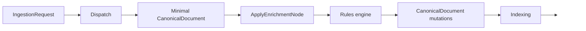

# How to write ingestion rules

This page explains how to write and maintain ingestion enrichment rules for the `UKHO.Search` ingestion rules engine.

It is aimed at developers, testers, and professional services users who need to create new ingestion rules or update existing ones.

Rules are loaded and validated at service startup. Invalid rules fail startup.

## What ingestion rules do

Rules enrich a `CanonicalDocument` using values found in an `IngestionRequest`.

At runtime the ingestion pipeline:

1. determines a `providerName` such as `file-share`
2. loads the rules scoped to that provider
3. selects the active payload from the request:
   - `request.AddItem` for add operations
   - `request.UpdateItem` for update operations
4. evaluates rule predicates against that active payload
5. applies all matching rules in deterministic order

Rules are provider-scoped. Rules for other providers are ignored.

## Where rules live

There are two useful views of rule storage.

### Runtime rules root contract

The rules engine contract is a directory named `Rules` under the host content root.

Rules are stored as one JSON file per rule.

The required logical structure is:

```text
Rules/
  <providerName>/
    <any-subdirectories-allowed>/
      <rule-file>.json
```

Notes:

- `<providerName>` is the provider scope such as `file-share`
- any subdirectory layout is allowed beneath the provider directory
- when loading rules for a provider, the engine scans all `.json` files under `Rules/<providerName>` recursively
- missing required `Rules/` directory fails startup

The historical ingestion-host guidance documented the committed rules directory as:

- `src/Hosts/IngestionServiceHost/Rules/`

### Current repository authoring workflow

For current local Aspire development, per-rule JSON files are authored under the repository root:

- `rules/file-share/...`

`AppHost` loads that directory into the local configuration emulator under the `rules` prefix when running locally in services mode.

The important practical point is that the current local workflow still uses provider-scoped, per-rule JSON files.

## Per-rule file schema

Each rule file must be valid JSON and must have this shape:

```json
{
  "schemaVersion": "1.0",
  "rule": {
    "id": "example-rule",
    "context": "example",
    "title": "Example exchange set",
    "if": {
      "properties[\"product\"]": "AVCS"
    },
    "then": {
      "keywords": { "add": ["exchange-set"] }
    }
  }
}
```

### `schemaVersion`

- required
- must equal exactly `"1.0"`

### `rule`

- required
- must be a JSON object conforming to the rule schema described below
- each file contains exactly one `rule` object

Fail-fast behavior includes:

- missing required `Rules/` directory
- invalid JSON in any rule file
- schema errors in any rule file
- duplicate rule ids within the same provider scope
- missing or blank required title values in the current ruleset contract

## Provider scoping and ordering

Rules are scoped by provider name.

- when `providerName = "file-share"`, only rules loaded from `Rules/file-share/**.json` are evaluated and applied
- provider key matching is case-insensitive

Provider identity is now backed by `UKHO.Search.ProviderModel` during rule loading.

- the provider folder or configuration key is resolved through `IProviderCatalog`
- provider names are canonicalized to `ProviderDescriptor.Name` before rules are exposed to consumers
- unknown providers fail load/startup with a diagnosable validation error
- rules for known-but-disabled providers can still be loaded for discovery, but ingestion runtime validation for enabled providers remains separate

Rules are applied in deterministic order. When loading per-rule files under a provider directory, ordering is:

1. file path using ordinal, case-insensitive ordering
2. rule id using ordinal, case-insensitive ordering as a tie-break

## `StudioServiceHost` rule discovery

`StudioServiceHost` now composes the same provider-aware read path used by ingestion rule loading.

- `GET /rules` returns a read-only rule discovery response
- providers are returned using canonical provider names from `UKHO.Search.ProviderModel`
- all known providers are included in the response, with empty `rules` arrays when a known provider has no rules
- startup fails clearly when configured rules reference an unknown provider
- save, update, and delete rule operations are still out of scope for this package

## Rule schema

A rule is a JSON object with these fields:

```json
{
  "id": "string",
  "context": "string (optional metadata; see below)",
  "description": "string (optional)",
  "enabled": true,
  "if": { },
  "then": { }
}
```

Current rules in this repository also use a top-level `title` field on the rule definition as part of the canonical title contract.

### `id`

- required
- must be non-empty
- must be unique within a provider scope across all files below `Rules/<providerName>`
- the file name does not need to match the rule id

### `context`

- optional metadata on the rule definition
- when supplied, it is normalized to trimmed lowercase
- it is not itself a predicate and does not change predicate evaluation semantics
- it is intended for rule classification and tooling scenarios alongside the rule definition

Current `file-share` validation behavior:

- for providers other than `file-share`, `context` is optional
- for `file-share`, a transitional validation rule applies:
  - if no `file-share` rules declare `context`, startup validation still allows the legacy all-missing state
  - once any `file-share` rule declares `context`, all `file-share` rules must declare `context`
- missing required `context` in a partially or fully uplifted `file-share` ruleset fails startup validation

### `description`

Free-text description for maintainability.

### `enabled`

- optional boolean
- defaults to `true`
- if `false`, the rule is skipped

### `if` vs `match`

Rules must contain exactly one predicate block:

- `if` is the preferred spelling
- `match` is supported as an alias

You must not specify both.

### `title`

Current rules in this repository also require a non-empty `title`.

- it is trimmed and resolved through the same templating pipeline used by rule actions
- it can use literals, `$val`, and `$path:` expressions
- it is written into `CanonicalDocument.Title`
- unlike additive index fields, it preserves display casing rather than forcing lowercase
- missing or blank title values are treated as rule-definition errors during validation

Separately, after enrichment completes, the pipeline validates that the final `CanonicalDocument` retained at least one title value. If no title was produced, the document is rejected and routed to dead-letter handling rather than indexed.

## Predicates

A predicate is evaluated against the active payload:

- `request.AddItem` if present
- otherwise `request.UpdateItem` if present

If neither is present, such as `DeleteItem` or `UpdateAcl`, the rules engine performs no mutations.

There are two supported predicate forms:

1. shorthand AND-only form
2. explicit boolean form using `all`, `any`, and `not`

### Shorthand AND-only predicate form

Shorthand form is an object mapping paths to string values.

Each entry is treated as an `eq` comparison, and all entries must match.

Example:

```json
"if": {
  "properties[\"product\"]": "AVCS",
  "id": "my-document-id"
}
```

Semantics:

- each value must be a JSON string
- the rule matches only if every path resolves and equals the provided string
- for shorthand, `$val` is the concatenation of the matched values from each shorthand entry in JSON property order

### Explicit boolean predicate form

Boolean nodes allow nested logic:

- `all` means logical AND across children
- `any` means logical OR across children
- `not` means negation of a single child

Rules:

- a boolean node must contain exactly one of `all`, `any`, or `not`
- `all` and `any` must be non-empty arrays
- `not` must be a single predicate object, not an array

Example:

```json
"if": {
  "all": [
    { "path": "properties[\"abcdef\"]", "exists": true },
    { "not": { "path": "id", "eq": "blocked" } }
  ]
}
```

### Leaf predicates

A leaf condition has this shape:

```json
{ "path": "<path>", "<operator>": "<value>" }
```

Rules:

- `path` is required and must be a string
- exactly one operator must be specified

## Paths

Paths identify values on the active payload.

Key rules:

- path segment matching is case-insensitive
- collection traversal must be explicit using `[*]`
- numeric indexes such as `[0]` are not allowed
- selector or filter syntax such as `[name=...]` is not allowed

If a path fails to resolve at runtime because optional data is missing, that is not an error:

- operators evaluate as non-match
- variable resolution produces no values
- the engine skips derived outputs

### Common path examples

Files:

- `files[*].mimeType`
- `files[*].filename`

Ingestion properties support two equivalent forms:

- dot form for identifier-like names: `properties.abcdef`
- bracket form for any name: `properties["abcdef"]`

Property name matching is case-insensitive.

### Path validation at startup

Paths are validated at startup for:

- syntax correctness
- allowed selector usage, where only `[*]` is valid
- traversing collections without `[*]`
- segments resolving via reflection on known request types

## Operators

Operators are evaluated against the resolved values from a path.

### Normalization

All string comparisons:

- trim whitespace
- compare using lowercased invariant form

### ANY-match semantics

If a path resolves to multiple values such as `files[*].mimeType`, the comparison succeeds if any resolved value matches.

### Supported operators

#### `exists`

Examples:

```json
{ "path": "properties[\"abcdef\"]", "exists": true }
```

```json
{ "path": "properties[\"abcdef\"]", "exists": false }
```

Meaning:

- `exists: true` matches if any resolved value is non-empty
- `exists: false` matches if no resolved value is non-empty

For `exists`, a retained value means a resolved value that is not null, empty, or whitespace-only.

That means `exists: false` matches when:

- the path is missing at runtime
- the path resolves only to null values
- the path resolves only to empty strings
- the path resolves only to whitespace-only strings

For `exists: true`, `$val` includes all resolved non-empty values.

For `exists: false`, `$val` includes no values.

`exists: false` is semantically equivalent in match outcome to:

```json
{
  "not": {
    "path": "properties[\"abcdef\"]",
    "exists": true
  }
}
```

#### `eq`

```json
{ "path": "files[*].mimeType", "eq": "app/s63" }
```

Matches if any resolved value equals the comparator after normalization.

`$val` includes only the resolved values that actually matched.

#### `contains`

```json
{ "path": "files[*].mimeType", "contains": "s63" }
```

#### `startsWith`

```json
{ "path": "id", "startsWith": "doc-" }
```

#### `endsWith`

```json
{ "path": "id", "endsWith": "-final" }
```

#### `in`

```json
{ "path": "files[*].mimeType", "in": ["app/s63", "text/plain"] }
```

- the value must be a non-empty array of strings

### Missing or unresolvable paths

If a path resolves to no values at runtime:

- `exists` evaluates to `false`
- all other operators evaluate to `false`

No exception is thrown.

## Actions

The `then` block defines monotonic enrichments.

Example structure:

```json
"then": {
  "keywords": { "add": ["..."] },
  "searchText": { "add": ["..."] },
  "content": { "add": ["..."] },
  "facets": {
    "add": [
      { "name": "facet name", "value": "..." },
      { "name": "facet name", "values": ["...", "..."] }
    ]
  },
  "documentType": { "set": "..." },
  "authority": { "add": ["..."] },
  "region": { "add": ["..."] },
  "format": { "add": ["..."] },
  "category": { "add": ["..."] },
  "series": { "add": ["..."] },
  "instance": { "add": ["..."] },
  "majorVersion": { "add": [1] },
  "minorVersion": { "add": [0] }
}
```

### Normalization and skipping empty values

All action-produced strings are:

- trimmed
- lowercased invariant

Null, empty, and whitespace-only outputs are skipped.

### `keywords.add`

Adds keywords to `CanonicalDocument.Keywords`.

- keyword values can be literal strings or templates
- the keyword set is naturally deduplicated

### `searchText.add`

Appends phrases to `CanonicalDocument.SearchText`.

- values are treated as phrases and may contain spaces
- the engine deduplicates phrases per field using boundary-aware matching

### `content.add`

Same behavior as `searchText.add`, but targets `CanonicalDocument.Content`.

### `facets.add`

Facet entries support either:

- `value`
- `values`

A facet entry must not contain both.

### `documentType.set`

This is a scalar action.

- it must not be able to expand to multiple values
- `$path:` in `documentType.set` must not reference wildcard paths
- `$val` in `documentType.set` is only allowed for a single, non-wildcard leaf predicate

### Additional top-level fields

The rules engine can also add values to additional top-level set-based fields on `CanonicalDocument`.

These are additive, non-destructive enrichments:

- adding the same value multiple times does not create duplicates
- string outputs are normalized like other actions
- empty outputs are skipped
- numeric outputs are produced by parsing operators, and if parsing fails, no value is produced

Supported actions:

- `authority.add`
- `region.add`
- `format.add`
- `category.add`
- `series.add`
- `instance.add`
- `majorVersion.add`
- `minorVersion.add`

Example using string fields:

```json
{
  "id": "region-and-authority",
  "if": {
    "all": [
      { "path": "properties[\"region\"]", "exists": true },
      { "path": "properties[\"authority\"]", "exists": true }
    ]
  },
  "then": {
    "region": { "add": ["$path:properties[\"region\"]"] },
    "authority": { "add": ["$path:properties[\"authority\"]"] }
  }
}
```

Example using numeric fields:

```json
{
  "id": "versions",
  "if": {
    "all": [
      { "path": "properties[\"majorVersion\"]", "exists": true },
      { "path": "properties[\"minorVersion\"]", "exists": true }
    ]
  },
  "then": {
    "majorVersion": { "add": ["toInt($path:properties[\"majorVersion\"])"] },
    "minorVersion": { "add": ["toInt($path:properties[\"minorVersion\"])"] }
  }
}
```

## Variables and templating

Action strings support variable substitution.

### Variable vocabulary

- `$val`
- `$path:<path>`

`$val` comes from predicate evaluation.

### Template expansion rules

- there is no escaping for `$`
- any `$...` sequence is treated as a variable
- unknown variables are treated as missing, and the produced value is skipped
- if a variable resolves to multiple values:
  - multi-valued actions such as `keywords`, `searchText`, `content`, and `facets` apply one output per value
  - scalar actions such as `documentType.set` must not be able to produce multiple values

Examples:

- whole-string `$val`: if `$val` is `["a", "b"]`, expansion becomes `["a", "b"]`
- embedded `$val`: `"facet-$val"` expands to `["facet-a", "facet-b"]`

### `$val` binding details

`$val` is derived from predicate evaluation:

- for `exists`, it includes resolved non-empty values
- for `eq`, `contains`, `startsWith`, `endsWith`, and `in`, it includes only values that matched
- for `all`, it concatenates matched values from each child in order
- for shorthand predicates, it concatenates matched values from each entry in JSON property order
- for `any`, it is taken from the first matching branch in evaluation order

## Parsing operators

Parsing operators convert string values, including variables like `$val`, into typed outputs required by some actions.

### `toInt(value)`

`toInt(value)` converts a value to a base-10 integer.

Common usage is parsing values into numeric fields such as `majorVersion.add` and `minorVersion.add`.

How it works:

1. the engine resolves variables first
2. the resolved value is treated as a string
3. the input string is trimmed
4. parsing uses invariant culture
5. accepted format is a base-10 integer, optionally with leading `+` or `-`

If parsing fails for any reason, including null, empty, whitespace, non-numeric text, overflow, or out-of-range values, no value is produced.

Failure behavior:

- the engine does not add anything to the target numeric field
- the engine continues evaluating other values, actions, and rules
- parsing failures must not fail ingestion

Examples:

```json
{
  "schemaVersion": "1.0",
  "rule": {
    "id": "parse-major-from-val",
    "if": { "files[*].filename": "ENC-2" },
    "then": {
      "majorVersion": {
        "add": ["toInt($val)"]
      }
    }
  }
}
```

```json
{
  "schemaVersion": "1.0",
  "rule": {
    "id": "mixed-parse",
    "if": { "id": "doc-1" },
    "then": {
      "minorVersion": {
        "add": ["toInt(10)", "toInt( 02 )", "toInt(not-a-number)"]
      }
    }
  }
}
```

Expected behavior:

- `10` and `2` are added
- `not-a-number` is ignored

```json
{
  "schemaVersion": "1.0",
  "rule": {
    "id": "parse-and-continue",
    "if": { "id": "doc-1" },
    "then": {
      "majorVersion": { "add": ["toInt($path:properties[\"major\"])"] },
      "keywords": { "add": ["version-parsed-or-not"] }
    }
  }
}
```

If `properties["major"]` is missing or not numeric, the keyword is still added while `majorVersion` remains unchanged.

## Runtime behavior in the pipeline

Rules are applied as part of the enrichment stage.



The rules engine is designed to be:

- provider-aware
- fail-fast for invalid rule definitions
- tolerant of missing runtime paths

That distinction matters:

- invalid JSON, schema, duplicate ids, unsupported operators, or invalid path syntax cause startup or configuration failure
- missing data in a specific payload causes the rule not to match, and any derived outputs are skipped

## Complete example

This is one complete per-rule JSON file for provider `file-share`.

Example path:

- `Rules/file-share/catalogue/mime-app-s63.json`

```json
{
  "schemaVersion": "1.0",
  "rule": {
    "id": "mime-app-s63",
    "context": "adds-s57",
    "description": "When any file is app/s63, enrich as exchange set",
    "enabled": true,
    "title": "Exchange set",
    "if": {
      "files[*].mimeType": "app/s63"
    },
    "then": {
      "keywords": { "add": ["exchange-set"] },
      "searchText": { "add": ["exchange set", "exchangeset"] }
    }
  }
}
```

Notes:

- each file contains exactly one `rule` object
- `context` is shown because `file-share` rulesets that have started using `context` must provide it consistently

## Troubleshooting and common validation errors

### Missing rules directory

- ensure the `Rules/` directory is present at the host content root
- ensure the provider directory exists for the provider you are using, such as `Rules/file-share/`

### Empty rules

- ensure at least one provider directory contains at least one valid rule file

### Missing required `context`

For provider `file-share`, once any rule file includes `context`, all `file-share` rule files must include it.

Typical remediation:

- add `context` to the missing `file-share` rule files, or
- revert the whole provider back to the legacy all-missing state if that is the intended transitional position

### Path validation errors

Common causes:

- missing wildcard when traversing a collection:
  - invalid: `files.mimeType`
  - valid: `files[*].mimeType`
- numeric index:
  - invalid: `files[0].mimeType`
- selector or filter syntax:
  - invalid: `files[name="x"].mimeType`

### Predicate shape errors

- `all` and `any` arrays must be non-empty
- `not` must be an object, not an array
- a leaf must specify exactly one operator

### Facet entry errors

- a facet entry must not contain both `value` and `values`

### `documentType.set` scalar-safety errors

- `documentType.set` must not be able to expand to multiple values
- `$path:` in `documentType.set` must not reference wildcard paths
- `$val` in `documentType.set` is only allowed for a single, non-wildcard leaf predicate

## Authoring guidance

### Keep rules small and focused

Prefer one rule per clear enrichment outcome or closely related set of outcomes.

### Prefer shorthand predicates for simple equality

For straightforward equality checks, shorthand is easier to read and maintain.

### Use explicit boolean predicates when you need structure

Use `all`, `any`, and `not` when the rule genuinely needs OR, NOT, or nested logic.

When the primary intent is to assert that a property is absent, prefer the direct form:

```json
{ "path": "properties[\"agency\"]", "exists": false }
```

rather than the more verbose equivalent `not { path: ..., exists: true }` form.

### Be careful with wildcard paths

Wildcard paths can produce multiple values, which affects:

- `$val`
- multi-valued outputs
- scalar-safety for `documentType.set`

### Use `$path:` when you want a different source value

Use `$path:` when you want to inject a value that is not the matched comparison value.

### Be careful with `$val` from `any`

Avoid relying on `$val` from `any` when multiple branches might match, because it binds from the first matching branch.

### Normalize expectations

Everything indexed into search-facing fields such as `Keywords`, `SearchText`, `Facets`, and related discovery taxonomy fields is expected to be lowercase or normalized through the `CanonicalDocument` API and associated mutators.

## RulesWorkbench and rule evaluation

`RulesWorkbench` is the main local tool for inspecting and evaluating rules.

It:

- loads rules through the same runtime rule catalog
- evaluates a sample payload into a `CanonicalDocument`
- shows matched rules and the final document JSON
- includes rule-checker and batch-scan tooling for finding candidate rule coverage

The `Checker` page also validates that the evaluated `CanonicalDocument` retained the required local-workflow fields:

- `Title`
- `Category`
- `Series`
- `Instance`

That keeps local rule-diagnosis feedback aligned with the runtime title contract, even though the checker remains intentionally scoped to the rules path rather than the full ZIP-dependent enrichment chain.

For stable tool guidance, see [Tools: `RulesWorkbench`](Tools-RulesWorkbench).

## How to test rule changes

Recommended local checks:

- run unit tests:
  - `dotnet test test/UKHO.Search.Ingestion.Tests/UKHO.Search.Ingestion.Tests.csproj`
- run the ingestion host locally when appropriate:
  - `dotnet run --project src/Hosts/IngestionServiceHost/IngestionServiceHost.csproj`

When startup validation fails, review the exception message and error list. Rules validation is fail-fast.

## Practical local workflow

1. Edit a rule under `rules/file-share/...`.
2. Start the local services stack.
3. Open `RulesWorkbench` to validate and evaluate the rule.
4. Use `FileShareEmulator` to submit real batches through the ingestion pipeline.
5. Inspect the resulting indexed documents or dead letters.

## Example authoring checklist

- unique `id`
- non-empty display-oriented `title`
- valid `schemaVersion`
- valid provider placement
- consistent `context` usage for `file-share`
- paths use `[*]` correctly
- actions only emit intended normalized values
- numeric fields use `toInt(...)` where needed

## Related pages

- [Ingestion pipeline](Ingestion-Pipeline)
- [CanonicalDocument and discovery taxonomy](CanonicalDocument-and-Discovery-Taxonomy)
- [File Share provider](FileShare-Provider)
- [Tools: `RulesWorkbench`](Tools-RulesWorkbench)
- [Documentation source map](Documentation-Source-Map)
